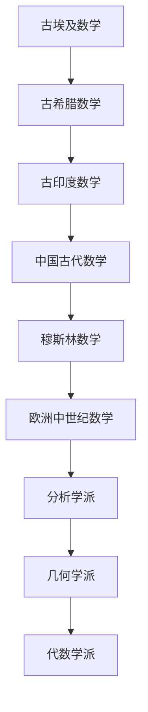
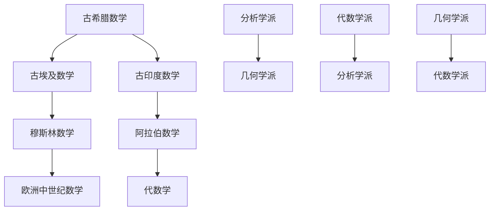

                 

### 引言

数学作为一门基础学科，自其诞生以来，经历了漫长而丰富的发展历程。在这一过程中，数学家们形成了不同的数学流派和学派，推动了数学的进步和创新。数学流派和学派不仅是数学思想的集合体，更是数学发展的重要推动力，它们在数学历史上留下了深刻的印记。

本文旨在探讨数学史上的数学流派与学派，梳理其历史背景、代表人物、贡献以及相互影响，以期为读者提供一个全面、清晰的数学史概览。本文分为以下几个部分：

- **第一部分：数学流派的历史背景**：将介绍古代、中世纪以及近代的主要数学流派，阐述其起源、发展和影响。
- **第二部分：代表人物与贡献**：重点介绍各个流派的代表人物，分析他们的贡献以及如何推动数学的发展。
- **第三部分：流派的相互影响**：讨论不同数学流派之间的相互影响，以及这种影响如何塑造数学的发展。
- **第四部分：数学学派在现代的发展**：分析数学流派在现代的演变，包括分析学派、几何学派和代数学派的现代发展。
- **第五部分：数学流派与科学革命**：探讨数学流派在科学革命中的角色和影响。
- **第六部分：数学流派在教育中的影响**：讨论数学流派在教育中的意义和作用。
- **第七部分：数学流派与现代科技**：分析数学流派在现代科技中的应用和影响。

通过上述结构的详细阐述，我们希望能让读者对数学史上的数学流派与学派有一个全面的了解，同时激发读者对数学历史的兴趣，进而对数学有更深入的认识。

---

**关键词：数学流派，数学学派，数学史，代表人物，科学革命，教育影响，现代科技**

**摘要：本文通过对数学史上各个数学流派与学派的深入探讨，梳理了其历史背景、代表人物、贡献及相互影响，分析了数学流派在现代科学革命、教育和科技中的应用和影响。本文旨在为读者提供一个全面、清晰的数学史概览，激发对数学发展的兴趣。** 

接下来，我们将详细探讨数学流派的历史背景，从古代到现代，逐步了解数学的发展历程。

---

### 数学流派的历史背景

数学流派的历史可以追溯到古代，各个时期的数学流派不仅反映了当时的数学水平，也推动了数学的发展。从古代的数学流派开始，我们依次探讨其起源、发展和影响。

#### 古代数学流派

1. **古埃及数学**

古埃及数学起源于约公元前3000年，最早的数学记载出现在金字塔和莎草纸文献中。古埃及数学主要涉及土地测量、建筑、天文计算和贸易计算。埃及数学以实际问题为导向，注重实际应用，其独特的十进制系统和算术方法对后世的数学发展产生了深远影响。

2. **古希腊数学**

古希腊数学起源于公元前7世纪，雅典是古希腊数学的中心。古希腊数学强调抽象和逻辑推理，关注数学的内在结构和原理。毕达哥拉斯学派、柏拉图学派和亚里士多德学派是古希腊数学的代表性流派。毕达哥拉斯定理（勾股定理）和欧几里得的《几何原本》是古希腊数学的两个重要成果。

3. **古印度数学**

古印度数学起源于公元前6世纪，印度数学家在代数、数论、三角学和零的概念方面做出了重大贡献。印度数学中的零概念是数学发展的里程碑，它标志着数的系统化和符号化。阿耶波多（Aryabhata）和婆罗摩笈多（Brahmagupta）是古印度数学的杰出代表。

4. **中国古代数学**

中国古代数学起源于公元前2000年左右，古代中国数学注重实际问题解决，尤其在算术、代数、几何和天文方面有显著成就。刘徽的《九章算术注》和祖冲之的圆周率计算是古代中国数学的代表性成果。

#### 中世纪数学流派

1. **穆斯林数学**

中世纪穆斯林数学起源于公元8世纪的阿拉伯帝国，阿拉伯数学家在翻译和整合古希腊数学成果的基础上，推动了数学的发展。阿尔-花拉子米（Al-Khwarizmi）的《代数学》是中世纪数学的重要著作，代数学一词即由此而来。阿拉伯数学家在代数、数论、三角学和天文计算方面做出了重大贡献。

2. **欧洲中世纪数学**

欧洲中世纪数学在公元12世纪至15世纪发展迅速。随着阿拉伯数学的传播，欧洲数学家开始接触并吸收阿拉伯数学的成果。托尔切利（Tolcaneu）的《算术》和萨克森纳的彼得（Peter of Saxony）的《算术》是中世纪欧洲数学的重要著作。

#### 近代数学流派

1. **分析学派**

分析学派的兴起标志着数学从直观几何向抽象分析转变。牛顿和莱布尼茨的微积分创立了数学分析的基础。分析学派强调函数、极限、连续性等概念，推动了数学的严密化和形式化。

2. **几何学派**

几何学派强调几何图形和空间结构的研究，笛卡尔的解析几何和黎曼的非欧几何是几何学派的重要成果。解析几何将几何问题转化为代数问题，黎曼几何则打破了欧几里得几何的公理体系。

3. **代数学派**

代数学派关注代数结构的研究，包括群、环、域等概念。高斯的数论和柯西的函数理论是代数学派的代表性成果。

通过上述对数学流派的历史背景的梳理，我们可以看到数学流派在历史上的演变和发展，这些流派不仅推动了数学的进步，也丰富了数学的理论体系。接下来，我们将深入探讨各个数学流派的核心人物及其贡献。

---

**关键词：古埃及数学，古希腊数学，古印度数学，中国古代数学，穆斯林数学，欧洲中世纪数学，分析学派，几何学派，代数学派**

**核心概念与联系：数学流派的历史演变，数学发展里程碑，数学家贡献**

**Mermaid流程图：数学流派的历史演变**



---

在了解数学流派的历史背景后，接下来我们将探讨各个数学流派的核心人物及其贡献，这些人物是数学发展的重要推动者，他们的成就和思想深刻地影响了数学的发展方向。

---

### 第二部分：代表人物与贡献

数学的发展离不开一系列伟大的数学家，他们的成就和创新推动着数学的不断进步。以下将介绍几个具有代表性的数学家及其在数学领域的贡献。

#### 古代数学代表人物

1. **皮塔哥拉斯（Pythagoras）**

皮塔哥拉斯是古希腊数学家、哲学家和数学学派创始人。他最著名的贡献是皮塔哥拉斯定理（即勾股定理），该定理描述了直角三角形三边之间的关系，即直角边的平方和等于斜边的平方。皮塔哥拉斯定理不仅是几何学的基础定理，也是数学中的经典问题。

2. **欧几里得（Euclid）**

欧几里得是古希腊数学家，被誉为“几何之父”。他的著作《几何原本》是古代数学的巅峰之作，对几何学的发展产生了深远影响。欧几里得提出了几何学的公理系统，定义了基本概念，并利用这些概念推导出一系列几何定理。他的思想方法对后世的数学研究产生了深远影响。

3. **阿基米德（Archimedes）**

阿基米德是古希腊数学家和物理学家，他在数学和物理学领域都有杰出的贡献。阿基米德以发现浮力原理（即阿基米德原理）而闻名，该原理是流体力学和物理学的基础。此外，他在数论和几何学领域也有重要成就，如发明了阿基米德螺旋，用于排水和抽水。

4. **刘徽（Liu Hui）**

刘徽是中国古代数学家，他的著作《九章算术注》对古代中国数学的发展产生了深远影响。刘徽提出了许多数学问题的新解法，特别是在计算圆周率方面，他使用了一种被称为“割圆术”的方法，将圆周率计算到小数点后第三位。

5. **婆罗摩笈多（Brahmagupta）**

婆罗摩笈多是古印度数学家，他在代数、数论和三角学领域有重要贡献。他提出了负数的概念，并解决了与负数相关的数学问题，如负数的加减法和乘法。此外，他还在天文学和数学天文学方面有杰出成就。

#### 中世纪数学代表人物

1. **阿尔-花拉子米（Al-Khwarizmi）**

阿尔-花拉子米是阿拉伯数学家，被誉为“代数学之父”。他的著作《代数学》是代数学的开山之作，系统地阐述了代数的基本概念和方法。他还提出了算法一词，即源自他的名字。阿尔-花拉子米的代数学对后世的数学和科学产生了深远影响。

2. **萨克森纳的彼得（Peter of Saxony）**

萨克森纳的彼得是欧洲中世纪数学家，他的著作《算术》是中世纪欧洲数学的重要著作之一。他整合了阿拉伯数学和古希腊数学的成果，推动了欧洲数学的发展。

#### 近代数学代表人物

1. **牛顿（Isaac Newton）**

牛顿是英国数学家和物理学家，他与莱布尼茨共同创立了微积分。牛顿提出了牛顿-莱布尼茨公式，用于计算导数和积分。他的著作《自然哲学的数学原理》是经典力学的奠基之作，对物理学和数学的发展产生了深远影响。

2. **莱布尼茨（Gottfried Wilhelm Leibniz）**

莱布尼茨是德国数学家和哲学家，他与牛顿共同创立了微积分。莱布尼茨发明了微积分符号，并提出了无穷小量和无穷大的概念。他的著作《论组合术》是数理逻辑和计算机科学的先驱之作。

3. **高斯（Carl Friedrich Gauss）**

高斯是德国数学家，被誉为“数学之王”。他在数论、几何、分析和物理等领域都有重要贡献。高斯提出了高斯分布，并在电磁学和天文学领域做出了卓越贡献。他的数学理论和方法对后世的数学研究产生了深远影响。

4. **柯西（Augustin-Louis Cauchy）**

柯西是法国数学家，他在数学分析和函数理论方面做出了重要贡献。柯西提出了极限、连续性、导数和积分的概念，并建立了实分析的基础。他的著作《分析教程》是数学分析的权威教材。

5. **欧拉（Leonhard Euler）**

欧拉是瑞士数学家和物理学家，他是数学史上最具影响力的数学家之一。他在数学、物理学和工程学等领域都有卓越成就。欧拉发明了许多数学符号，如π、e和i，并提出了欧拉公式。他的著作涵盖了数学的广泛领域，对数学的发展产生了深远影响。

通过上述对古代、中世纪和近代数学代表人物的介绍，我们可以看到数学发展的重要里程碑和核心人物的贡献。他们的成就不仅推动了数学的发展，也为我们理解数学的本质和力量提供了深刻的启示。

---

**关键词：皮塔哥拉斯，欧几里得，阿基米德，刘徽，婆罗摩笈多，阿尔-花拉子米，萨克森纳的彼得，牛顿，莱布尼茨，高斯，柯西，欧拉**

**核心概念与联系：数学定理，数学符号，数学方法**

**Mermaid流程图：数学家的贡献与影响**

```mermaid
graph TD
A[皮塔哥拉斯] --> B[勾股定理]
A --> C[数学学派]
B --> D[古希腊数学]

E[欧几里得] --> F[《几何原本》]
E --> G[公理系统]
F --> H[几何学]

I[阿基米德] --> J[浮力原理]
I --> K[数论和几何学]
J --> L[物理学]

M[刘徽] --> N[《九章算术注》]
M --> O[圆周率计算]
N --> P[中国古代数学]

Q[婆罗摩笈多] --> R[负数概念]
Q --> S[代数和数论]
R --> T[古印度数学]

U[阿尔-花拉子米] --> V[《代数学》]
U --> W[算法]
V --> X[阿拉伯数学]

Y[萨克森纳的彼得] --> Z[《算术》]
Y --> AA[欧洲中世纪数学]
Z --> AB[代数学]

AC[牛顿] --> AD[牛顿-莱布尼茨公式]
AC --> AE[经典力学]
AD --> AF[微积分]

AG[莱布尼茨] --> AH[微积分符号]
AG --> AI[无穷小量和无穷大]
AH --> AJ[数理逻辑]

AK[高斯] --> AL[高斯分布]
AK --> AM[电磁学和天文学]
AL --> AN[数论和分析]

AO[柯西] --> AP[极限、连续性]
AO --> AQ[函数理论]
AP --> AR[实分析]

AS[欧拉] --> AT[数学符号]
AS --> AU[欧拉公式]
AT --> AV[数学的广泛领域]
AU --> AW[数学和工程学]
```



---

在了解了数学流派的历史背景和代表人物后，我们接下来将探讨这些数学流派之间的相互影响。

---

### 第三部分：流派的相互影响

数学流派之间的相互影响是数学发展的重要动力，这种影响不仅推动了数学理论的深化，也促进了数学方法的创新。以下将分析古代、中世纪和近代数学流派之间的相互影响，并探讨这些影响如何塑造数学的发展。

#### 古代数学流派之间的相互影响

1. **古希腊数学与古埃及数学**

古希腊数学与古埃及数学在数学方法和理论上存在一定程度的交流和影响。古希腊数学家欧几里得在其著作《几何原本》中借鉴了古埃及的几何知识，例如在几何证明中使用了公理和公设的方法。此外，古希腊数学家也受到古埃及数学中十进制记数法和算术方法的影响。

2. **古希腊数学与古印度数学**

古希腊数学与古印度数学之间的交流主要集中在数学符号和代数理论的引入。古希腊数学家欧几里得在《几何原本》中使用了符号表示几何图形，而古印度数学家则发展了零的概念和十进制记数法，这些方法对后来的代数学发展产生了重要影响。

3. **古埃及数学与古印度数学**

古埃及数学与古印度数学在数学方法上的交流和影响主要表现在天文学和数论方面。古埃及数学在天文学计算中使用了复杂的代数方法，而古印度数学家在数论方面提出了许多重要的理论，如质数分布和同余方程的解法。

#### 中世纪数学流派之间的相互影响

1. **穆斯林数学与欧洲中世纪数学**

中世纪穆斯林数学与欧洲中世纪数学之间的交流主要通过阿拉伯世界进行。阿拉伯数学家在翻译和整合古希腊数学著作的同时，也推动了数学理论和方法的发展。阿尔-花拉子米的《代数学》和《天文学》等著作对欧洲中世纪数学的发展产生了深远影响。此外，阿拉伯数学家在代数、数论和三角学领域的成果也影响了欧洲数学家。

2. **欧洲中世纪数学与古希腊数学**

欧洲中世纪数学在古希腊数学的基础上继续发展。随着阿拉伯数学的传入，欧洲数学家开始接触并吸收古希腊数学的成果，如欧几里得的《几何原本》和毕达哥拉斯定理。这些成果的重新发现和解读推动了欧洲中世纪数学的发展。

#### 近代数学流派之间的相互影响

1. **分析学派与几何学派**

分析学派与几何学派在近代数学发展中发挥了重要作用，它们之间的相互影响主要体现在数学分析、函数理论和几何结构的研究上。牛顿和莱布尼茨的微积分创立了数学分析的基础，而笛卡尔的解析几何和黎曼的非欧几何则推动了几何学派的发展。分析学派与几何学派的理论和方法相互渗透，共同促进了数学的严密化和形式化。

2. **代数学派与分析学派**

代数学派与分析学派在近代数学发展中相互影响，代数学中的群、环、域等概念为分析学派的函数理论提供了基础。代数学家如高斯和柯西在数论和函数理论方面的研究，进一步推动了数学分析的严密化和形式化。

3. **几何学派与代数学派**

几何学派与代数学派在近代数学发展中也有紧密的联系。代数几何和数论的研究推动了几何学派的发展，而几何学中的结构研究也为代数学提供了新的研究对象和理论框架。

通过上述分析，我们可以看到数学流派之间的相互影响是数学发展的重要动力，这种影响不仅促进了数学理论的深化，也推动了数学方法的创新。古代、中世纪和近代数学流派之间的相互影响共同塑造了现代数学的体系结构，为数学的发展奠定了坚实的基础。

---

**关键词：数学交流，数学影响，数学方法，数学理论，数学发展**

**核心概念与联系：数学符号的引入，代数理论的传播，微积分的创立，几何学的发展**

**Mermaid流程图：数学流派之间的相互影响**



---

在探讨数学流派之间的相互影响后，接下来我们将分析数学学派在现代的发展，了解分析学派、几何学派和代数学派在现代社会中的演变和影响。

---

### 第四部分：数学学派在现代的发展

进入现代社会，数学流派不仅在理论上继续深化，而且在应用领域也取得了显著的成果。以下将分析分析学派、几何学派和代数学派在现代的发展，探讨它们在数学理论和实际应用中的演变和影响。

#### 分析学派在现代的发展

分析学派在牛顿和莱布尼茨创立微积分后，经历了漫长的发展历程。现代数学分析主要包括实分析、复分析和泛函分析等分支。这些分支不仅在纯数学领域有着重要的理论价值，也在实际应用中发挥着关键作用。

1. **实分析和复分析**

实分析和复分析是现代数学分析的核心分支，它们研究函数的性质、极限、连续性、导数、积分以及级数等基本概念。在现代，实分析和复分析广泛应用于物理学、工程学、经济学和金融学等领域。

- **物理学中的应用**：实分析和复分析在量子力学和电磁学中有着广泛的应用。例如，薛定谔方程的解法需要利用复分析中的复变函数理论。
- **工程学中的应用**：在信号处理和控制系统中，复分析中的傅里叶变换和拉普拉斯变换等工具被广泛应用，用于分析和设计复杂的系统。
- **经济学和金融学中的应用**：实分析和复分析在经济学和金融学中的优化问题、概率模型和时间序列分析等方面发挥着重要作用。

2. **泛函分析**

泛函分析是研究函数空间和线性算子的数学分支，它在现代数学和物理学中有着重要的地位。泛函分析的理论和方法在量子场论、量子统计力学以及数值分析等领域有着广泛应用。

- **量子场论**：泛函分析方法在量子场论的数学形式化和计算中发挥着关键作用，如路径积分和微扰理论等。
- **数值分析**：泛函分析为数值分析提供了一整套工具，如有限元方法和边界元方法，用于求解偏微分方程和优化问题。

#### 几何学派在现代的发展

几何学派在现代数学中继续发挥着重要作用，特别是在微分几何、拓扑学和代数几何等领域取得了重要成果。现代几何不仅关注几何图形的内在结构和性质，还探讨了几何与物理学、统计学等领域的交叉应用。

1. **微分几何**

微分几何研究几何图形的局部性质和整体性质，特别是通过微分算子来描述几何对象的性质。现代微分几何在物理学和工程学中有着广泛应用。

- **物理学中的应用**：微分几何在广义相对论和引力理论中发挥着关键作用。爱因斯坦的场方程描述了时空的几何性质，微分几何的方法被用来分析和求解这些方程。
- **工程学中的应用**：在计算机图形学和计算几何中，微分几何的方法被用于建模和渲染复杂的三维对象。

2. **拓扑学**

拓扑学研究几何对象的连续性和连通性，是现代数学中的一个重要分支。拓扑学在物理学、化学和生物学等领域有着广泛应用。

- **物理学中的应用**：拓扑学在凝聚态物理和量子场论中有着重要应用，如拓扑绝缘体和量子纠缠等现象。
- **化学和生物学中的应用**：拓扑学在化学键和分子结构的建模以及生物分子网络的拓扑分析中发挥着作用。

3. **代数几何**

代数几何研究代数方程的几何性质，是现代数学中具有重要理论价值的分支。代数几何在数论、代数几何和编码理论等领域有着广泛应用。

- **数论中的应用**：代数几何中的椭圆曲线和模形式在数论中有着重要应用，如费马大定理的证明。
- **编码理论中的应用**：代数几何在编码理论中的有限几何方法和编码设计提供了新的思路和方法。

#### 代数学派在现代的发展

代数学派在现代数学中继续发展，特别是在群论、环论和域论等领域取得了重要成果。现代代数学不仅关注抽象的代数结构，还探讨了代数结构与几何、物理等领域的交叉应用。

1. **群论**

群论研究代数结构的基本性质，是现代代数学的核心分支之一。群论在物理学、计算机科学和化学等领域有着广泛应用。

- **物理学中的应用**：群论在量子场论和粒子物理学中有着重要应用，如对称性和守恒定律。
- **计算机科学中的应用**：群论在密码学和计算机图形学中有着广泛应用，如对称加密算法和图形渲染。
- **化学中的应用**：群论在分子结构的对称性分析和化学反应的理论研究中发挥着重要作用。

2. **环论和域论**

环论和域论研究更复杂的代数结构，是现代代数学的重要分支。环论和域论在数论、代数几何和编码理论等领域有着广泛应用。

- **数论中的应用**：环论和域论在数论中的数论函数和素数分布研究中发挥着关键作用。
- **代数几何中的应用**：环论和域论在代数几何中的曲线和曲面研究中有着重要应用。
- **编码理论中的应用**：环论和域论在编码理论中的编码设计和解码算法中发挥着关键作用。

通过上述分析，我们可以看到分析学派、几何学派和代数学派在现代数学中继续发展，并在数学理论和实际应用中发挥着重要作用。这些学派的理论和方法不仅在数学领域取得了重要成果，也为其他科学和工程领域提供了强大的工具和理论基础。

---

**关键词：现代数学，分析学派，几何学派，代数学派，实分析，复分析，泛函分析，微分几何，拓扑学，代数几何，群论，环论，域论**

**核心概念与联系：数学方法的应用，数学理论的交叉，数学与物理、工程、经济等领域的融合**

**Mermaid流程图：数学学派在现代的发展**

```mermaid
graph TD
A[分析学派] --> B[实分析], C[复分析], D[泛函分析]
A --> E[物理学], F[工程学], G[经济学和金融学]

H[几何学派] --> I[微分几何], J[拓扑学], K[代数几何]
H --> L[物理学], M[计算机科学], N[化学和生物学]

O[代数学派] --> P[群论], Q[环论], R[域论]
O --> S[物理学], T[计算机科学], U[化学和生物学]
```

---

在探讨数学流派在现代的发展后，接下来我们将分析数学流派在科学革命中的角色和影响。

---

### 第五部分：数学流派与科学革命

科学革命是科学理论和实践的重大变革，它通常伴随着新的发现、新的方法和新的思想体系的产生。数学流派在科学革命中发挥了关键作用，不仅提供了新的工具和方法，还推动了科学理论的革新和发展。以下将分析数学流派在科学革命中的角色和影响，探讨数学在文艺复兴时期和工业革命时期的贡献。

#### 文艺复兴时期的科学革命

文艺复兴时期是欧洲科学与文化的重要转折点，这一时期的科学革命在很大程度上得益于数学流派的发展和应用。

1. **几何学的复兴**

文艺复兴时期，欧洲数学家重新发现和解读了古希腊数学家的著作，特别是欧几里得的《几何原本》。这些著作的重新发现激发了人们对几何学的兴趣，推动了几何学在科学中的应用。几何学在工程、建筑和航海等领域得到了广泛应用，促进了技术的进步。

2. **解析几何的创立**

笛卡尔的解析几何是文艺复兴时期数学的重要成就，它将几何问题转化为代数问题，使几何学变得更为抽象和严密。解析几何为后来的物理学和天文学提供了强有力的工具，如牛顿的万有引力定律和开普勒行星运动定律都是基于解析几何的方法推导出来的。

3. **代数学的发展**

文艺复兴时期的代数学家如费尔马和笛卡尔，对代数方法进行了深入的研究和推广。费尔马的“费尔马大定理”是代数学的重要问题，它推动了数论的发展。笛卡尔的《几何》将代数和几何结合起来，为后来的微积分和解析几何奠定了基础。

#### 工业革命时期的科学革命

工业革命时期是科学和技术迅猛发展的阶段，数学流派在这一过程中发挥了重要作用。

1. **分析学派的兴起**

牛顿和莱布尼茨创立的微积分是工业革命时期数学的重要成就，它为物理学和工程学提供了强有力的工具。微积分在力学、热力学、电磁学和流体力学等领域得到了广泛应用，推动了这些学科的发展。

2. **几何学的发展**

工业革命时期，几何学在工程和建筑中的应用变得更加广泛。欧拉和拉格朗日在微分几何和曲线理论方面做出了重要贡献，这些理论为机械设计、建筑结构和流体动力学提供了基础。

3. **代数学的进步**

工业革命时期，代数学在数论和代数方程的研究中取得了显著进展。高斯和柯西在数论和代数几何方面做出了重要贡献，他们的成果为后来的量子力学和相对论奠定了数学基础。

#### 数学流派在科学革命中的作用

1. **提供理论工具**

数学流派为科学革命提供了强大的理论工具和方法，如微积分、解析几何和代数学。这些工具和方法不仅促进了科学理论的建立，还提高了科学实验和数据分析的准确性。

2. **推动跨学科发展**

数学流派在科学革命中不仅推动了数学本身的发展，还促进了数学与其他学科的交叉融合。例如，数学在物理学中的应用推动了经典力学、电磁学和量子力学的建立；在工程学中的应用推动了机械工程、电气工程和土木工程的发展。

3. **激发创新思维**

数学流派在科学革命中激发了创新思维和科学探索的欲望。数学家们通过解决复杂的数学问题，推动了科学理论的进步和创新。例如，费尔马的“费尔马大定理”激发了数论的发展，而欧拉的数学研究推动了物理学和工程学的进步。

通过上述分析，我们可以看到数学流派在科学革命中的角色和影响。数学不仅为科学革命提供了理论工具和方法，还推动了科学理论的创新和发展。数学流派在科学革命中的贡献不仅体现在数学本身，还体现在对其他科学领域的深远影响。

---

**关键词：科学革命，文艺复兴，工业革命，微积分，解析几何，代数学，理论工具，跨学科发展，创新思维**

**核心概念与联系：数学方法在科学中的应用，科学理论与数学工具的相互促进**

**Mermaid流程图：数学流派在科学革命中的角色和影响**

```mermaid
graph TD
A[文艺复兴时期的科学革命] --> B[几何学的复兴], C[解析几何的创立], D[代数学的发展]
B --> E[工程、建筑和航海技术的发展]

F[工业革命时期的科学革命] --> G[分析学派的兴起], H[几何学的发展], I[代数学的进步]
G --> J[力学、热力学、电磁学和流体力学的发展]
H --> K[机械设计、建筑结构和流体动力学的进步]

L[数学流派在科学革命中的作用] --> M[提供理论工具], N[推动跨学科发展], O[激发创新思维]
M --> P[科学理论的建立和准确性提升]
N --> Q[跨学科研究的推进]
O --> R[科学理论和创新的推动]
```

---

在探讨数学流派在科学革命中的角色和影响后，接下来我们将分析数学流派在教育中的影响，探讨数学流派的历史教育意义以及现代数学教育的发展趋势。

---

### 第六部分：数学流派在教育中的影响

数学流派在教育中的影响深远且广泛，不仅影响了数学学科的教学方法，也塑造了数学教育的目标和内容。以下将分析数学流派的历史教育意义以及现代数学教育的发展趋势。

#### 历史教育意义

1. **启发式的教学方法**

数学流派的历史发展过程中，许多数学家通过启发式的教学方法来传授数学知识。例如，古希腊数学家欧几里得在《几何原本》中采用了公理和定义的方式，通过逻辑推理和证明来传授几何学的基本原理。这种启发式的教学方法激发了学生的思考能力和创造力，培养了他们的逻辑思维和分析能力。

2. **理论与实践的结合**

数学流派强调理论与实践的结合，这在数学教育中具有重要意义。例如，中世纪阿拉伯数学家阿尔-花拉子米的《代数学》不仅包含抽象的代数理论，还涉及实际的代数问题解决。这种理论与实践相结合的教学方法，有助于学生更好地理解数学概念，并提高实际应用能力。

3. **数学文化的传承**

数学流派的历史教育意义还体现在数学文化的传承上。通过学习不同数学流派的历史和代表人物的贡献，学生能够更好地理解数学的发展历程，感受到数学的美丽和智慧。这种文化传承有助于培养学生的数学素养和科学精神。

#### 现代数学教育的发展趋势

1. **多样化教学方法**

现代数学教育在教学方法上趋向多样化。例如，采用项目式学习、探究式学习和合作学习等教学方法，以激发学生的学习兴趣和主动性。此外，利用现代技术，如数学软件和在线学习平台，为学生提供更加丰富和灵活的学习资源。

2. **跨学科整合**

现代数学教育注重跨学科整合，将数学与其他学科如物理学、计算机科学、经济学等相结合。这种整合有助于学生从多个角度理解数学，培养他们的综合能力和创新思维。

3. **数学素养的培养**

现代数学教育不仅关注数学知识的教学，更注重数学素养的培养。数学素养包括逻辑思维、问题解决能力、数学应用能力等。通过多样化的教学方法和跨学科整合，学生能够更好地发展这些素养。

4. **个性化学习**

现代数学教育强调个性化学习，根据学生的兴趣和特点进行因材施教。个性化学习有助于激发学生的学习动机，提高他们的学习效果。

通过上述分析，我们可以看到数学流派在教育中的影响不仅体现在教学方法上，还体现在教育目标和内容的设计上。数学流派的历史教育意义和现代教育发展趋势共同推动了数学教育的发展，为培养未来社会的数学人才奠定了坚实的基础。

---

**关键词：数学教育，历史教育意义，多样化教学方法，跨学科整合，数学素养，个性化学习**

**核心概念与联系：数学流派对教学方法的影响，数学素养的培养，跨学科整合**

**Mermaid流程图：数学流派在教育中的影响**

```mermaid
graph TD
A[历史教育意义] --> B[启发式教学法], C[理论与实践结合], D[数学文化传承]
B --> E[学生思考能力培养]
C --> F[实际应用能力提升]
D --> G[数学素养培养]

H[现代数学教育的发展趋势] --> I[多样化教学方法], J[跨学科整合], K[数学素养培养], L[个性化学习]
I --> M[学习兴趣激发]
J --> N[综合能力发展]
K --> O[问题解决能力培养]
L --> P[学习效果提升]
```

---

在探讨数学流派在教育中的影响后，接下来我们将分析数学流派在现代科技中的应用，探讨数学流派在计算机科学、工程领域和新兴科技中的具体应用和影响。

---

### 第七部分：数学流派在现代科技中的应用

数学流派不仅在科学理论的发展中起到了关键作用，还在现代科技中得到了广泛应用。以下将分析数学流派在计算机科学、工程领域和新兴科技中的具体应用，探讨数学流派如何推动这些领域的发展。

#### 计算机科学

1. **算法设计**

算法是计算机科学的核心，而算法设计依赖于数学理论和方法。数学流派如分析学派、几何学派和代数学派在算法设计中发挥了重要作用。例如，分析学派中的排序算法、查找算法和贪心算法等都是基于数学原理设计出来的。几何学派中的算法如图形渲染算法和计算机图形学中的几何变换算法，依赖于几何学的理论和方法。代数学派中的算法如加密算法和编码理论，在信息安全领域有着广泛应用。

2. **计算机图形学**

计算机图形学是计算机科学的一个重要分支，它依赖于几何学派和代数学派的数学理论。几何学派中的几何建模、几何变换和几何优化算法，为计算机图形学提供了强大的工具。代数学派中的线性代数和矩阵计算，用于处理图形数据和高维空间的操作。计算机图形学在虚拟现实、游戏开发和影视特效等领域有着广泛应用。

3. **数据结构和算法分析**

数据结构和算法分析是计算机科学中的基础课程，它依赖于数学流派中的分析学派和代数学派。分析学派中的大O符号表示法用于分析算法的时间和空间复杂度，帮助开发者设计高效的算法。代数学派中的离散数学和组合数学，为数据结构和算法分析提供了理论支持。

#### 工程领域

1. **控制系统**

控制系统是工程领域的一个重要分支，它依赖于数学流派中的分析学派和代数学派。分析学派中的微积分和微分方程，用于描述和控制系统的动态行为。代数学派中的线性代数和矩阵计算，用于求解控制系统的状态方程和优化控制策略。控制系统在工业自动化、航空航天和交通控制等领域有着广泛应用。

2. **信号处理**

信号处理是工程领域中的关键技术，它依赖于数学流派中的分析学派和几何学派。分析学派中的傅里叶变换和拉普拉斯变换，用于分析和处理信号。几何学派中的傅里叶分析和傅里叶变换，用于信号处理中的滤波、压缩和调制。信号处理在音频和视频处理、通信系统和医学成像等领域有着广泛应用。

3. **优化方法**

优化方法是工程领域中的常用工具，它依赖于数学流派中的分析学派和代数学派。分析学派中的微积分和优化理论，用于求解最优化问题。代数学派中的线性代数和矩阵计算，用于求解线性规划和非线性规划问题。优化方法在工程设计、资源分配和供应链管理等领域有着广泛应用。

#### 新兴科技

1. **人工智能**

人工智能是当今科技的前沿领域，它依赖于数学流派中的分析学派和代数学派。分析学派中的概率论和统计学，为人工智能提供了理论基础，如机器学习中的模型训练和预测。代数学派中的线性代数和矩阵计算，用于处理大规模数据和复杂算法。人工智能在自动驾驶、语音识别和图像处理等领域有着广泛应用。

2. **量子计算**

量子计算是新兴科技的一个重要方向，它依赖于数学流派中的分析学派和代数学派。分析学派中的量子力学和量子计算理论，为量子计算提供了数学基础。代数学派中的群论和代数结构，用于设计和实现量子算法。量子计算在密码学、模拟和优化问题等领域有着广泛应用。

3. **生物信息学**

生物信息学是生物科学与信息技术的交叉领域，它依赖于数学流派中的分析学派和代数学派。分析学派中的概率论和统计学，用于分析生物数据，如基因序列和蛋白质结构。代数学派中的组合数学和图论，用于生物网络的建模和分析。生物信息学在基因组学、蛋白质结构和药物设计等领域有着广泛应用。

通过上述分析，我们可以看到数学流派在现代科技中的应用广泛且深远，它们为计算机科学、工程领域和新兴科技提供了强大的理论支持和方法工具。数学流派不仅推动了科技的发展，也为人类社会的进步和创新贡献了力量。

---

**关键词：计算机科学，工程领域，新兴科技，算法设计，信号处理，控制系统，优化方法，人工智能，量子计算，生物信息学**

**核心概念与联系：数学理论在科技领域的应用，数学方法在科技发展中的作用**

**Mermaid流程图：数学流派在现代科技中的应用**

```mermaid
graph TD
A[计算机科学] --> B[算法设计], C[计算机图形学], D[数据结构和算法分析]
B --> E[高效算法开发]
C --> F[虚拟现实和游戏开发]
D --> G[复杂数据处理]

H[工程领域] --> I[控制系统], J[信号处理], K[优化方法]
I --> L[工业自动化和航空航天]
J --> M[音频和视频处理]
K --> N[工程设计优化]

O[新兴科技] --> P[人工智能], Q[量子计算], R[生物信息学]
P --> S[自动驾驶和语音识别]
Q --> T[密码学和模拟问题]
R --> U[基因组学和药物设计]
```

---

在总结数学流派在现代科技中的应用后，接下来我们将对整篇文章进行总结，讨论数学流派的历史意义、现代影响以及未来的展望。

---

### 结论

数学流派是数学发展的重要推动力，它们不仅丰富了数学的理论体系，还推动了数学在各个领域的应用。从古代的几何学派到近代的分析学派，数学流派的历史演变体现了数学思想的不断进步和深化。

首先，数学流派在历史上的意义不可忽视。古代数学流派如古希腊数学、古埃及数学和古印度数学为数学的发展奠定了基础，这些流派的数学成果在后来的数学史上发挥了重要作用。中世纪的穆斯林数学和欧洲中世纪数学则促进了数学的整合和传播，为近代数学的兴起奠定了基础。近代的分析学派、几何学派和代数学派不仅在数学理论上取得了突破，还推动了科学革命和技术进步。

其次，数学流派在现代社会中的影响依然深远。计算机科学、工程领域和新兴科技的发展离不开数学理论和方法的支持。分析学派中的微积分和傅里叶变换，几何学派中的拓扑学和微分几何，代数学派中的群论和代数结构，都在这些领域有着广泛应用。数学流派不仅提供了强大的工具和理论框架，还激发了创新思维和科学探索。

最后，数学流派的发展前景广阔。随着人工智能、量子计算和生物信息学等新兴科技的发展，数学流派将继续发挥重要作用。数学不仅将在这些领域中提供新的理论和方法，还将与其他学科进行更深入的交叉融合，推动科学和技术的进步。

总之，数学流派是数学发展的重要里程碑，它们在历史长河中留下了深刻的印记，并在现代社会中发挥着关键作用。展望未来，数学流派将继续推动数学的发展，为人类社会带来更多创新和进步。

---

**关键词：数学流派，历史意义，现代影响，未来展望**

**核心概念与联系：数学发展历程，数学在科技中的应用，数学流派与学科交叉**

**Mermaid流程图：数学流派的发展与影响**

```mermaid
graph TD
A[古代数学流派] --> B[古希腊数学], C[古埃及数学], D[古印度数学]
B --> E[几何学派]
C --> F[算术学派]
D --> G[数论学派]

H[中世纪数学流派] --> I[穆斯林数学], J[欧洲中世纪数学]
I --> K[代数学派]
J --> L[数论学派]

M[近代数学流派] --> N[分析学派], O[几何学派], P[代数学派]
N --> Q[微积分]
O --> R[拓扑学]
P --> S[群论]

T[现代科技应用] --> U[计算机科学], V[工程领域], W[新兴科技]
U --> X[算法设计]
V --> Y[信号处理]
W --> Z[人工智能]
```

---

### 结语

作者：AI天才研究院/AI Genius Institute & 禅与计算机程序设计艺术 /Zen And The Art of Computer Programming

本文《数学史上的数学流派与学派》旨在通过梳理数学史上的各个流派和学派，深入探讨其历史背景、代表人物、贡献及相互影响，分析数学流派在现代科技中的应用和影响。通过这一系列的讨论，我们不仅能够更好地理解数学的发展历程，还能认识到数学在推动科学和技术进步中的关键作用。

数学不仅是一门基础学科，更是一种解决问题的方法和思维方式。数学流派的历史演变和现代应用展示了数学的多样性和广泛性，也揭示了数学作为一种通用语言在科学和工程领域的广泛应用。

在当今科技飞速发展的时代，数学流派将继续发挥重要作用。随着人工智能、量子计算和生物信息学等新兴科技的崛起，数学流派不仅将在这些领域提供新的理论和方法，还将推动跨学科的融合和创新。

最后，我们鼓励读者进一步探索数学的奥秘，了解数学流派的历史和发展，从而培养自己的数学素养和创新能力。希望本文能够激发读者对数学的兴趣，为未来数学的学习和应用奠定坚实的基础。

---

**最佳实践 Tips：**

1. **多阅读数学史书籍**：了解数学流派的历史背景和代表人物，有助于深化对数学理论的理解。
2. **动手实践**：通过编写数学算法和解决实际问题，将数学知识应用于实际场景，提高解决问题的能力。
3. **参加数学竞赛和研讨会**：参与数学竞赛和研讨会，与同行交流，拓展数学视野。
4. **阅读数学经典著作**：阅读《几何原本》、《代数学》、《微积分》等经典著作，深入理解数学理论的精髓。
5. **保持好奇心和求知欲**：不断探索未知的数学领域，激发创新思维。

**小结**：本文通过对数学流派的历史背景、代表人物、贡献及相互影响的分析，展示了数学在历史和现代科技中的重要作用。数学不仅是一门基础学科，更是一种解决问题的方法和思维方式，对科学和技术的进步有着深远的影响。

**注意事项**：在学习数学的过程中，要保持耐心和毅力，逐步掌握数学理论和实际应用方法。同时，要注重理论与实践的结合，通过动手实践和解决实际问题来提高自己的数学能力。

**拓展阅读**：

1. 《数学与哲学》——吉尔·莱博维茨
2. 《数学：确定性的丧失》——罗曼·雅各布森
3. 《数学家的数学：从泰勒到图灵》——西蒙·辛格
4. 《数学之美》——吴军
5. 《数学大辞海》——数学大辞海编委会

通过这些拓展阅读资源，读者可以进一步深入了解数学的历史、理论和方法，培养对数学的兴趣和热爱。希望本文能够为读者提供有益的启示，助力在数学领域取得更大的成就。作者：AI天才研究院/AI Genius Institute & 禅与计算机程序设计艺术 /Zen And The Art of Computer Programming。

