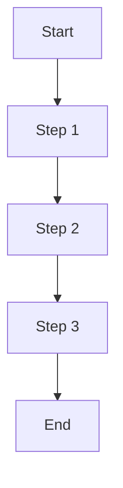

                 

### 第1章：数学史概述与核心概念

#### 1.1 数学史的起源与发展

数学，作为一门研究数量、结构、变化和空间等概念的学科，有着悠久的历史。从古至今，数学经历了无数次的发展和演变，形成了丰富的知识体系。本章将简要回顾数学史的起源与发展，介绍数学的核心概念。

##### 数学史的发展脉络

数学的发展史可以大致分为以下几个阶段：

1. **原始数学**：大约在公元前3000年左右，古代文明开始使用简单的计数方法。古埃及和巴比伦是最早的数学发展中心，他们使用了符号表示数字，并发展了一些基础的算术和几何知识。

2. **古代数学**：古希腊是数学发展的一个重要时期。希腊数学家如泰勒斯、毕达哥拉斯、欧几里得等人做出了巨大的贡献。毕达哥拉斯提出了著名的毕达哥拉斯定理，而欧几里得则写成了《几何原本》，成为后世几何学的经典。

3. **中世纪数学**：在中世纪，阿拉伯数学家如阿尔·花剌子密对代数和算术做出了重要贡献。他的著作《代数学》被广泛传颂，对后来的欧洲数学发展产生了深远的影响。

4. **近代数学**：17世纪，牛顿和莱布尼茨发明了微积分，标志着数学进入了一个新的时代。随后，欧拉、拉格朗日、高斯等数学家在代数、几何、数论等多个领域取得了重要成果。

5. **现代数学**：20世纪以来，数学变得更加抽象和严谨，形成了多个分支，如抽象代数、拓扑学、集合论等。计算机科学的兴起也为数学带来了新的研究方向，如计算几何、算法复杂性理论等。

##### 古埃及、巴比伦数学的兴起

古埃及和巴比伦是最早的数学发展中心之一。古埃及的数学主要用于土地测量、建筑工程和天文学。他们使用了简单的十进制记数系统，并掌握了一些基础的算术和几何知识。例如，古埃及人已经能够解决一些关于面积和体积的问题，如金字塔的建造。

巴比伦数学在古代世界中也是非常先进的。巴比伦人使用了六十进制记数系统，并发展了一些复杂的算术和代数知识。他们能够解决关于平方根和立方根的问题，并且编制了大量的数学表格，用于天文学和占星术。

##### 古希腊数学的辉煌

古希腊数学是数学发展史上的一个重要里程碑。希腊数学家们不仅建立了数学的基本原理，还提出了一些著名的数学定理和公式。毕达哥拉斯是古希腊数学的奠基人之一，他提出了著名的毕达哥拉斯定理，并研究了数的性质和比例关系。

欧几里得是古希腊最著名的数学家之一，他写成了《几何原本》，这是一部关于几何学的经典著作，对后世几何学的发展产生了深远的影响。欧几里得提出了公理化的思想，将几何学建立在严格的逻辑基础上。

##### 古代印度与阿拉伯数学的传承

古代印度数学在数字系统和代数方面做出了重要贡献。印度人发明了零的概念，并发展了一种基于十进制的位置记数法。这种记数法比罗马数字更加方便和高效，对后来的数学发展产生了重要影响。

阿拉伯数学家如阿尔·花剌子密对代数和算术做出了重要贡献。他的著作《代数学》对欧洲数学的发展产生了深远的影响。阿拉伯人还将古希腊数学的著作翻译成阿拉伯语，为后来的欧洲数学复兴奠定了基础。

#### 1.2 数学的核心概念

数学的核心概念包括数、几何、代数、微积分等。

##### 数的概念演变

数的概念是人类最早开始研究的数学问题之一。数的概念从简单的自然数开始，逐渐发展出整数、分数、小数、复数等更复杂的数。数的概念演变反映了人类对世界的认知和量化能力的提高。

##### 几何的基本概念

几何学研究形状、大小和位置等空间概念。几何的基本概念包括点、线、面、体等。通过研究这些基本概念，人们可以解决关于形状、面积和体积等问题。

##### 代数的核心原理

代数是一种符号运算的数学方法，用于研究方程、函数、序列等。代数的核心原理包括变量、方程、函数等概念。代数的发展使得数学变得更加抽象和通用。

##### 微积分的基本思想

微积分是一门研究变化和累积的数学分支。微积分的基本思想包括导数、积分和微积分基本定理。微积分的发展使得人们可以更好地描述和理解物理现象和工程问题。

#### 1.3 数学的分类与联系

数学可以分为多个分支，如分析数学、代数数学、几何数学和应用数学。每个分支都有其独特的理论和应用领域。

##### 分析数学

分析数学研究函数、序列、级数等概念。它包括微积分、实分析、复分析等子领域。分析数学在物理学、工程学、计算机科学等领域有着广泛的应用。

##### 代数数学

代数数学研究代数结构、代数方程、代数几何等。它包括线性代数、群论、环论、域论等子领域。代数数学在物理学、计算机科学、编码理论等领域有着重要的应用。

##### 几何数学

几何数学研究空间形状和位置关系。它包括平面几何、立体几何、拓扑学等子领域。几何数学在工程学、物理学、计算机图形学等领域有着广泛的应用。

##### 应用数学

应用数学是将数学理论应用于实际问题的一种数学方法。它包括计算数学、概率论、数理统计、运筹学等子领域。应用数学在经济学、物理学、生物学、工程学等领域有着广泛的应用。

在数学的不同分支中，各种概念和理论相互联系，形成了一个完整的数学体系。例如，微积分与代数、几何、概率论等分支都有着紧密的联系。通过研究这些联系，数学家可以解决更复杂的问题，推动数学的发展。

#### 结论

数学史上的发展充满了挑战和突破，每一个阶段都为后来的数学奠定了坚实的基础。了解数学史可以帮助我们更好地理解数学的本质和核心概念，激发我们对数学问题的思考和探索。

### 第2章：数学史上的核心算法

#### 2.1 古代数学算法

古代数学家在算术和几何领域取得了许多重要成就，这些成就构成了现代数学算法的基础。以下简要介绍古代数学中的一些核心算法。

##### 古埃及的乘法和除法算法

古埃及人在日常生活中经常需要进行土地测量和货物计算，因此发展了一套高效的乘法和除法算法。他们的乘法算法基于“连乘法”，即将两个数相乘时，先将其中一个数分解成若干个较小的数，然后分别与另一个数相乘，最后将结果相加。例如，计算 13 × 21，可以分解为 13 × (20 + 1) = (13 × 20) + (13 × 1)。这种方法大大简化了乘法运算。

对于除法，古埃及人使用了一种类似于长除法的算法。他们通过连续减去被除数的倍数，直到差值小于除数，然后计算减去的次数，即为商数。例如，计算 84 ÷ 12，可以通过不断减去 12 的倍数来逼近结果，如 84 - 12 = 72，72 - 12 = 60，60 - 12 = 48，48 - 12 = 36，36 - 12 = 24，24 - 12 = 12，此时共减去了 7 次，因此商数为 7。

##### 古希腊的勾股定理证明

勾股定理是古希腊数学家毕达哥拉斯发现的一个重要几何定理，表述为：在一个直角三角形中，直角边的平方和等于斜边的平方。古希腊人已经找到了证明勾股定理的方法，其中最著名的是毕达哥拉斯自己的证明。

毕达哥拉斯的证明方法是通过构造一个正方形，其边长为直角三角形的直角边之和。然后，将这个正方形分割成两个直角三角形和一个较小的正方形。通过比较两个直角三角形的面积和较小正方形的面积，可以得出勾股定理的结论。

##### 古印度的零的概念与位置记数法

古印度数学家在数字系统中做出了重要贡献，其中最著名的是零的概念和位置记数法。古印度人将零视为一种独特的数字，用于表示空位或缺少的数值。这种思想使得数字系统能够更加简洁和高效。

古印度的位置记数法是一种基于位置值的数字表示方法。在这种方法中，每个数字的位置决定了其值的大小。例如，数字 123 表示为 1 × 10² + 2 × 10¹ + 3 × 10⁰。这种记数法比罗马数字更加方便，也为后来的阿拉伯数字传播奠定了基础。

#### 2.2 中世纪数学算法

中世纪数学算法在代数和算术方面取得了显著进展，阿拉伯数学家对代数的发展做出了重要贡献。以下介绍中世纪数学中的一些核心算法。

##### 阿尔·花剌子密的代数算法

阿尔·花剌子密是中世纪最著名的数学家之一，他的著作《代数学》对后来的欧洲数学发展产生了深远的影响。在《代数学》中，阿尔·花剌子密提出了一系列代数算法，用于解决一元一次方程、一元二次方程和代数方程组。

对于一元一次方程，阿尔·花剌子密使用了代入法和消元法来求解。例如，对于方程 2x + 3 = 7，可以通过代入法将 x 替换为 7 - 3，然后解出 x 的值。对于一元二次方程，他使用了配方法和判别式来求解。

在解代数方程组时，阿尔·花剌子密使用了消元法。例如，对于方程组 2x + y = 7 和 x - 3y = 1，可以通过消去 x 或 y 来求解另一个变量的值，然后代入原方程求解另一个变量的值。

##### 奥卡姆的剃刀与简化算法思想

奥卡姆的剃刀是一种哲学原则，主张在解释事物时，应该避免多余的假设。这一原则也被应用到数学算法中，形成了简化算法思想。简化算法思想的核心理念是：在解决问题时，应该尽可能使用最简单、最直接的方法。

例如，在解一元一次方程时，可以使用奥卡姆的剃刀原则，避免使用复杂的代换或变换，而是直接求解。在解代数方程组时，可以使用消元法，而不是使用更复杂的矩阵方法。

##### 波伦那学院的天文学算法

波伦那学院是中世纪欧洲最重要的数学中心之一，其数学家在算术、代数和天文学方面取得了许多重要成就。在天文学算法方面，波伦那学院的数学家发展了一种基于球面三角学的算法，用于计算天体的位置和运动。

这种算法的核心是使用正弦和余弦函数来计算角度和边长。例如，对于球面三角形，可以使用正弦定理和余弦定理来计算未知的角度和边长。这些算法为后来的航海学和天文学的发展提供了重要工具。

#### 2.3 近代数学算法

近代数学算法在微积分、代数和几何等领域取得了重大突破。以下介绍近代数学中的一些核心算法。

##### 微积分的发明与基本算法

微积分是由牛顿和莱布尼茨在17世纪末发明的，用于研究变化和累积。微积分的基本算法包括导数、积分和微分方程。

导数是描述函数变化率的一个概念。牛顿使用了“流数法”来定义导数，而莱布尼茨则提出了“微分”和“积分”的概念，并用符号“dx”和“dy”表示自变量和因变量的微小变化。导数的计算方法包括极限法和差分法。

积分是导数的反操作，用于求解面积、体积和曲线下的面积等。莱布尼茨提出了积分符号和积分法则，使得积分计算变得更加简便。积分的基本方法包括牛顿-莱布尼茨公式、分部积分法和换元积分法。

微分方程是描述物理现象和工程问题的重要数学模型。牛顿和莱布尼茨等人提出了一系列求解微分方程的方法，如分离变量法、级数解法和数值方法。

##### 拉格朗日方程的建立

拉格朗日方程是经典力学中的一个核心方程，用于描述系统的动力学行为。拉格朗日方程由拉格朗日于18世纪末提出，其表达式为：$$\frac{d}{dt}\left(\frac{\partial L}{\partial \dot{q}_i}\right) - \frac{\partial L}{\partial q_i} = 0$$

其中，L 是拉格朗日量，$q_i$ 是广义坐标，$\dot{q}_i$ 是广义速度。拉格朗日方程的建立标志着经典力学的一个重大突破，它将牛顿力学转化为更一般的形式，适用于更广泛的系统。

##### 高斯在数论与代数上的贡献

高斯是19世纪最伟大的数学家之一，他在数论、代数和几何等领域取得了许多重要成就。在数论方面，高斯证明了二次互反律，这是一个关于同余方程的重要定理。

在代数方面，高斯提出了“高斯消元法”，这是一种用于求解线性方程组的算法。高斯消元法通过消元和回代，可以高效地求解线性方程组。这种方法后来成为现代数值计算方法的基础。

#### 2.4 现代数学算法

现代数学算法在计算几何、算法复杂性理论和量子计算等领域取得了显著进展。以下介绍现代数学中的一些核心算法。

##### 计算几何与数值分析算法

计算几何是研究几何形状的算法和数据结构的一个分支。现代计算几何算法包括平面几何算法、空间几何算法和三维重建算法等。

平面几何算法包括线段相交、多边形求交、多边形面积计算等。空间几何算法包括空间线段相交、空间多边形求交和三维重建等。三维重建算法可以从二维图像中恢复三维形状，广泛应用于计算机视觉和图形学领域。

数值分析算法是用于求解数学问题的一种算法，如方程求解、数值积分和数值微分等。现代数值分析算法包括迭代法、数值积分法、数值微分法等。这些算法通过逼近方法，可以求解复杂的数学问题，如非线性方程、微分方程等。

##### 算法复杂性理论

算法复杂性理论研究算法的时间和空间复杂度。它关注的是算法在不同输入规模下的性能，并分类算法的复杂度。算法复杂性理论包括时间复杂度和空间复杂度两个主要方面。

时间复杂度描述算法的执行时间与输入规模的关系。常见的复杂度级别包括常数复杂度、对数复杂度、线性复杂度、多项式复杂度和指数复杂度等。空间复杂度描述算法所需的内存空间与输入规模的关系。

算法复杂性理论对于算法的设计和分析具有重要意义，它可以帮助我们评估算法的效率，并指导我们选择合适的算法解决实际问题。

##### 量子计算的基本算法

量子计算是现代计算技术的一个重要分支，它利用量子力学原理来实现计算。量子计算的基本算法包括量子逻辑门、量子叠加和量子纠缠等。

量子逻辑门是量子计算的基本操作，类似于经典计算机中的逻辑门。量子叠加允许量子计算机同时处理多个可能的计算路径，而量子纠缠则使得量子计算机可以超越经典计算机的极限。

量子计算的基本算法包括量子模拟、量子搜索算法和量子算法等。量子模拟可以用于模拟量子系统，如量子化学反应和量子场论。量子搜索算法可以高效地解决某些特定问题，如数据库搜索和组合优化问题。

### 第3章：数学史上的重要数学模型

#### 3.1 几何模型

几何模型是用于描述空间形状和结构的数学模型。几何模型在数学、物理学、工程学等领域都有广泛的应用。以下介绍几种重要的几何模型。

##### 欧几里得几何模型

欧几里得几何模型是最基本的几何模型，它基于欧几里得的《几何原本》。欧几里得几何模型包括点、线、面和圆等基本元素，以及它们之间的关系。欧几里得几何模型适用于描述平面几何和空间几何问题。

##### 非欧几何模型

非欧几何模型是19世纪由黎曼、罗巴切夫斯基和布尔巴基等人提出的，它们突破了欧几里得几何模型的限制，提供了描述更广泛几何空间的方法。非欧几何模型包括双曲几何、椭圆几何和欧几里得-黎曼几何等。这些模型在物理学、宇宙学和拓扑学等领域有着重要的应用。

##### 爱因斯坦的相对论几何模型

爱因斯坦的相对论几何模型是用于描述时空的几何模型。在相对论中，时间和空间被视为一个统一的概念，称为时空。爱因斯坦提出了洛伦兹变换，用于描述时空的变换关系。相对论几何模型包括洛伦兹空间、时空图和光锥等概念，它们在物理学和宇宙学中有着广泛的应用。

#### 3.2 代数模型

代数模型是用于描述代数结构及其性质的数学模型。代数模型在代数学、数论、逻辑等领域都有广泛的应用。以下介绍几种重要的代数模型。

##### 卡氏坐标系

卡氏坐标系是一种基于笛卡尔坐标系的代数模型，它用于描述二维和三维空间中的点。在卡氏坐标系中，每个点可以用一对或三对实数坐标来表示。卡氏坐标系的基本运算包括加法、减法、数乘和点积等。卡氏坐标系为研究几何图形的变换和性质提供了有力工具。

##### 线性方程组的代数模型

线性方程组是代数学中的一个重要模型，它由一组线性方程组成。线性方程组可以表示为矩阵形式，即 AX = B，其中 A 是系数矩阵，X 是未知量矩阵，B 是常数矩阵。线性方程组的解可以通过高斯消元法、矩阵求逆等方法求解。线性方程组的代数模型在物理学、工程学、经济学等领域有着广泛的应用。

##### 齐次方程组的代数模型

齐次方程组是线性方程组的一种特殊情况，其中常数矩阵 B 为零矩阵。齐次方程组可以表示为 AX = 0，其中 A 是系数矩阵，X 是未知量矩阵。齐次方程组的解可以表示为矩阵 A 的零空间，即解空间。齐次方程组的代数模型在代数几何、线性代数和优化理论等领域有着重要的应用。

#### 3.3 微积分模型

微积分模型是用于描述函数变化和积分过程的数学模型。微积分模型在物理学、工程学、经济学等领域都有广泛的应用。以下介绍几种重要的微积分模型。

##### 导数的微积分模型

导数是描述函数变化率的一个重要概念。微积分模型中的导数可以表示为函数在某一点处的变化率。导数的微积分模型包括定义、性质、求导法则等。导数的应用包括求解极值、研究函数的凹凸性和求解微分方程等。

##### 积分的微积分模型

积分是导数的反操作，用于求解面积、体积和曲线下的面积等。微积分模型中的积分可以表示为函数的不定积分或定积分。积分的微积分模型包括定义、性质、积分法则等。积分的应用包括求解定积分、计算曲边图形的面积、求解质点运动的轨迹等。

##### 微积分基本定理的应用

微积分基本定理是连接微分和积分的桥梁，它建立了微分和积分之间的联系。微积分基本定理包括两部分：第一部分指出函数的一个原函数的存在性和唯一性；第二部分指出积分和导数之间的互反关系。微积分基本定理的应用包括求解定积分、计算函数的导数和原函数等。

#### 3.4 概率模型

概率模型是用于描述随机事件及其概率分布的数学模型。概率模型在统计学、金融学、生物学等领域都有广泛的应用。以下介绍几种重要的概率模型。

##### 概率论的基本模型

概率论的基本模型包括随机试验、样本空间、事件和概率等概念。随机试验是指可以进行重复实验的过程，样本空间是所有可能结果的集合，事件是样本空间的一个子集，概率是事件发生的可能性。概率论的基本模型为研究随机现象提供了基础。

##### 大数定律的概率模型

大数定律是概率论中的一个重要定理，它描述了在大量重复实验中，随机变量的平均值会趋近于其期望值。大数定律的概率模型包括独立重复试验、随机变量的期望和方差等。大数定律的应用包括概率估计、统计推断和风险管理等。

##### 中心极限定理的概率模型

中心极限定理是概率论中的另一个重要定理，它描述了在大量独立重复实验中，随机变量的分布会趋近于正态分布。中心极限定理的概率模型包括独立重复试验、随机变量的期望和方差、正态分布等。中心极限定理的应用包括概率分布的近似、统计推断和假设检验等。

### 第4章：数学史上的未解之谜

#### 4.1 欧拉公式

欧拉公式是数学史上最著名的公式之一，它将指数函数、三角函数和复数完美地结合起来。欧拉公式可以表述为：$$e^{i\pi} + 1 = 0$$

其中，$e$ 是自然对数的底数，$i$ 是虚数单位，$\pi$ 是圆周率。这个公式不仅在数学上具有美妙的对称性，还在物理学、工程学、计算机科学等领域有着广泛的应用。

##### 公式的表达与证明

欧拉公式的证明可以通过复数的定义和欧拉公式中的指数函数性质来完成。首先，我们知道复数可以表示为 $a + bi$，其中 $a$ 和 $b$ 是实数，$i$ 是虚数单位。复数的模可以表示为 $\sqrt{a^2 + b^2}$，辐角可以表示为 $\arctan(\frac{b}{a})$。根据欧拉公式，我们可以将复数表示为指数形式：$$a + bi = re^{i\theta} = r(\cos\theta + i\sin\theta)$$

其中，$r$ 是复数的模，$\theta$ 是复数的辐角。现在，我们将 $r = 1$ 和 $\theta = \frac{\pi}{2}$ 代入欧拉公式，得到：$$e^{i\frac{\pi}{2}} = \cos\frac{\pi}{2} + i\sin\frac{\pi}{2} = i$$

接着，我们将 $r = 1$ 和 $\theta = \pi$ 代入欧拉公式，得到：$$e^{i\pi} = \cos\pi + i\sin\pi = -1$$

因此，我们可以得到欧拉公式的一个表达式：$$e^{i\pi} + 1 = 0$$

##### 欧拉公式在数学史上的意义

欧拉公式在数学史上具有里程碑意义，它将几个看似不相关的数学领域联系在一起。欧拉公式揭示了复数、指数函数和三角函数之间的深层关系，为后来的数学发展奠定了基础。

欧拉公式还在物理学和工程学中有着广泛的应用。在物理学中，欧拉公式可以用于描述振动、波动和电磁场等。在工程学中，欧拉公式可以用于分析机械系统、电路和信号处理等。

##### 欧拉公式在现代数学中的应用

欧拉公式在现代数学中有着广泛的应用，包括代数、几何、分析等多个领域。以下是一些现代数学中欧拉公式的应用示例：

1. **复数分析**：欧拉公式可以用于计算复数的极坐标表示，从而简化复数运算。

2. **微分方程**：欧拉公式可以用于求解一些特殊的微分方程，如一阶线性微分方程。

3. **图像处理**：欧拉公式可以用于图像的变换和滤波，如傅里叶变换和拉普拉斯变换。

4. **密码学**：欧拉公式可以用于某些加密算法的设计，如RSA加密算法。

#### 4.2 四色定理

四色定理是数学史上一个著名的未解之谜，它表述为：任何地图都可以用四种颜色着色，使得相邻的区域颜色不同。四色定理最初由弗拉基米尔·阿佩尔与肯尼斯·阿佩尔于1976年使用计算机证明，这个证明使用了大量的计算和验证。

##### 定理的内容与证明历程

四色定理的内容简单明了，但其证明历程却充满曲折。四色定理的证明主要分为几个阶段：

1. **直观证明**：四色定理最早由数学家弗朗西斯·格思里·斯凯勒于1852年提出。他通过手工证明了一些特殊情况，例如五角星形地图和六角形地图都可以用四种颜色着色。然而，对于更复杂的地图，他无法给出一个普遍适用的证明。

2. **启发式证明**：1936年，数学家达内斯·马丁纳克提出了一种启发式证明方法，他通过构造一个复杂的地图，并逐步证明它可以被四种颜色着色。然而，这种方法缺乏严格的数学证明，因此未能得到广泛认可。

3. **计算机证明**：1976年，弗拉基米尔·阿佩尔与肯尼斯·阿佩尔使用计算机完成了四色定理的证明。他们构造了一个复杂的地图，并使用计算机验证了它无法用四种颜色着色的所有情况。这个证明通过大量的计算和验证，最终证实了四色定理的正确性。

##### 四色定理在地图绘制中的应用

四色定理在地图绘制中有着广泛的应用。根据四色定理，地图绘制人员可以使用四种颜色来区分相邻的区域，从而提高地图的可读性。以下是一些四色定理在地图绘制中的应用示例：

1. **地图着色**：地图着色是一个经典的数学问题，其目标是使用最少的颜色来区分地图上的相邻区域。四色定理提供了一个简单的解决方案，使得地图绘制人员可以快速且高效地完成地图着色。

2. **地形分析**：在地理信息系统（GIS）中，四色定理可以用于分析和可视化地形数据。通过使用四种颜色来表示不同类型的地形，地图绘制人员可以更好地理解地形特征。

3. **城市规划**：在城市规划中，四色定理可以用于设计和规划城市地图。通过使用四种颜色来区分不同的区域，城市规划人员可以更好地规划道路、建筑物和公园等。

##### 四色定理与计算机科学的关系

四色定理与计算机科学有着密切的关系。首先，四色定理的计算机证明标志着计算机科学在数学领域的重要应用。阿佩尔与阿佩尔使用了计算机来验证大量的情况，这一过程不仅展示了计算机的强大计算能力，也揭示了计算机在数学证明中的应用潜力。

此外，四色定理的研究还促进了计算机算法的发展。例如，在解决四色定理的过程中，数学家们提出了一系列复杂的算法和优化方法，这些方法在计算机科学中有着广泛的应用。

四色定理还与复杂性理论有关。四色定理的计算机证明表明，某些数学问题可以转化为计算机问题，并使用计算机来解决。这进一步揭示了计算机科学在解决复杂问题中的潜力。

#### 4.3 默比乌斯定理

默比乌斯定理是拓扑学中的一个重要定理，它描述了一个特殊的带状结构。默比乌斯定理表述为：一个带状结构，如果仅通过一次连续的扭转和粘合，可以形成一个新的带状结构，那么这个带状结构被称为默比乌斯带。

##### 定理的表述与证明

默比乌斯定理可以表述为：一个带状结构，如果仅通过一次连续的扭转和粘合，可以形成一个新的带状结构，且这个新结构具有一个边界线，则该带状结构是一个默比乌斯带。

证明方法通常包括以下几个步骤：

1. **构造方法**：首先，将一个矩形带状结构沿其中线扭转180度，然后将其两端粘合。这样得到的新结构就是一个默比乌斯带。

2. **边界线性质**：观察这个新结构，可以发现其边界线不再是简单的闭合曲线，而是具有一个“扭曲”的边界线。这个边界线在拓扑学中被称为“一维流形”。

3. **拓扑不变性**：默比乌斯带的一个关键性质是它的拓扑不变性。无论我们如何对默比乌斯带进行变形或切割，它都会保持其默比乌斯性质。这意味着，默比乌斯带是一个稳定的拓扑结构。

##### 默比乌斯带的结构分析

默比乌斯带的结构分析是理解拓扑学中许多概念的关键。以下是一些默比乌斯带的结构特点：

1. **单侧结构**：默比乌斯带具有单侧结构，这意味着我们可以从一个点出发，沿着边界线一直走下去，最终回到起点，但这个过程中不会遇到任何重复的路径。

2. **扭曲边界**：默比乌斯带的边界线是扭曲的，这意味着它在拓扑空间中不再是一个简单的闭合曲线。这种扭曲性质使得默比乌斯带在几何和物理上有许多独特的应用。

3. **二维与三维**：默比乌斯带可以被看作是一个二维表面，但它具有三维拓扑性质。这意味着，我们可以将默比乌斯带拉伸成三维空间中的曲面，但在这个过程中不会破坏其默比乌斯性质。

##### 默比乌斯定理在拓扑学中的应用

默比乌斯定理在拓扑学中有着广泛的应用。以下是一些应用示例：

1. **拓扑不变量**：默比乌斯带是拓扑不变量的一个典型例子。这意味着，无论我们如何变形或切割默比乌斯带，它的拓扑性质都不会改变。这种不变性使得默比乌斯带成为研究拓扑性质的一个有力工具。

2. **几何构造**：默比乌斯带在几何构造中有着广泛的应用。例如，我们可以通过将一个矩形带状结构扭转和粘合来构造出各种形状的默比乌斯带，这些形状在物理学、材料科学和艺术等领域有着重要的应用。

3. **电路设计**：在电路设计中，默比乌斯带的结构特点可以用于设计复杂的电路路径，从而实现更高的电路密度和更好的信号传输性能。

#### 4.4 费马最后定理

费马最后定理是数学史上最著名的未解之谜之一，它由法国数学家皮埃尔·德·费马在17世纪提出。费马最后定理表述为：对于任何大于2的自然数n，方程 $a^n + b^n = c^n$ 没有正整数解。

##### 定理的表述与历史背景

费马最后定理的表述非常简单，但证明过程却异常复杂。该定理的历史背景可以追溯到费马在阅读笛卡尔的《几何》时做出的一个笔记。费马在他的笔记中写道：“这个定理是真实的，我有一个美妙的证明，但这个笔记太狭小，写不下。”

费马的最后定理在数学界引起了极大的关注，许多数学家都尝试证明它，但直到1994年，才由英国数学家安德鲁·怀尔斯和他的学生理查德·泰勒成功证明。

##### 费马最后定理的证明方法

怀尔斯的证明方法结合了多个数学领域的知识，包括代数几何、椭圆曲线和模形式。以下是证明方法的简要概述：

1. **椭圆曲线方法**：怀尔斯使用椭圆曲线来证明费马最后定理。他证明了一个关于椭圆曲线的定理，该定理表明，如果存在一个方程 $a^n + b^n = c^n$ 的正整数解，则相应的椭圆曲线没有理性点。

2. **模形式方法**：怀尔斯还使用了一种称为模形式的数学工具来证明费马最后定理。他证明了模形式的一些性质，这些性质与椭圆曲线密切相关。

3. **交错变换**：怀尔斯使用交错变换来将椭圆曲线的证明转化为模形式的证明。交错变换是一种将椭圆曲线从一个形态变换为另一个形态的变换，它可以帮助我们研究椭圆曲线的拓扑性质。

##### 费马最后定理对数学发展的推动作用

费马最后定理的证明不仅解决了数学界一个长达三个世纪的难题，还推动了数学的发展。以下是一些费马最后定理对数学发展的影响：

1. **代数几何**：费马最后定理的证明使用了代数几何的一些先进方法，如椭圆曲线和模形式。这些方法的发展为代数几何领域带来了新的研究方向和应用。

2. **数论**：费马最后定理是数论中的一个重要问题，它的证明推动了数论的研究。特别是，费马最后定理的证明方法涉及到了数论中的许多基本概念和定理。

3. **计算机科学**：费马最后定理的证明过程中使用了计算机算法和数值分析技术。这些技术的发展为计算机科学领域提供了新的工具和方法。

4. **数学教育**：费马最后定理的证明过程展示了数学研究的复杂性和深度。它鼓励了数学爱好者去探索数学的奥妙，促进了数学教育的发展。

### 第5章：数学公式在实际中的应用

#### 5.1 微积分在物理学中的应用

微积分是物理学中最重要的数学工具之一，它广泛应用于描述物理现象和解决问题。以下是一些微积分在物理学中的应用示例。

##### 动力学中的微积分应用

在动力学中，微积分用于描述物体的运动。一个典型的例子是牛顿第二定律，它表述为：$$F = ma$$

其中，$F$ 是作用在物体上的合外力，$m$ 是物体的质量，$a$ 是物体的加速度。这个公式可以通过微积分来理解。如果我们考虑一个质点在时间 $t$ 的加速度，那么它在时间 $dt$ 内的速度变化可以表示为 $dv = a dt$。积分这个表达式，我们得到速度 $v$ 关于时间 $t$ 的函数：$$v = \int a dt$$

同样地，如果我们考虑质点在时间 $t$ 的位移，那么它在时间 $dt$ 内的位移变化可以表示为 $ds = v dt$。积分这个表达式，我们得到位移 $s$ 关于时间 $t$ 的函数：$$s = \int v dt$$

通过将速度和加速度的积分结合起来，我们可以得到牛顿第二定律的完整表达式。

##### 电磁学中的微积分应用

在电磁学中，微积分用于描述电场和磁场的分布和变化。一个典型的例子是高斯定律，它表述为：$$\nabla \cdot E = \frac{\rho}{\varepsilon_0}$$

其中，$E$ 是电场强度，$\rho$ 是电荷密度，$\varepsilon_0$ 是真空中的电容率。这个公式可以通过微积分来理解。如果我们考虑一个闭合曲面 $S$，其内部包含一个电荷 $q$，那么通过高斯定律，我们可以计算电场强度 $E$ 在 $S$ 上的通量。这可以通过计算电场强度 $E$ 在 $S$ 上的积分来实现：$$\int_S E \cdot dS = \frac{q}{\varepsilon_0}$$

同样地，我们可以使用高斯定律来计算磁场强度 $B$ 的分布。例如，在安培环路定律中，我们有：$$\nabla \times B = \mu_0 J$$

其中，$B$ 是磁场强度，$J$ 是电流密度，$\mu_0$ 是真空中的磁导率。这个公式可以通过微积分来理解。如果我们考虑一个闭合路径 $C$，其周围存在一个电流 $I$，那么通过安培环路定律，我们可以计算磁场强度 $B$ 在 $C$ 上的环量。这可以通过计算磁场强度 $B$ 在 $C$ 上的积分来实现：$$\int_C B \cdot dl = \mu_0 I$$

##### 量子力学中的微积分应用

在量子力学中，微积分用于描述粒子的波函数和概率分布。一个典型的例子是薛定谔方程，它表述为：$$i\hbar \frac{\partial \Psi}{\partial t} = \hat{H} \Psi$$

其中，$\Psi$ 是波函数，$i$ 是虚数单位，$\hbar$ 是约化普朗克常数，$\hat{H}$ 是哈密顿量。这个方程可以通过微积分来理解。它描述了粒子在时间 $t$ 的波函数 $\Psi$ 随时间的演化。通过求解薛定谔方程，我们可以得到粒子在不同状态下的概率分布。

#### 5.2 线性代数在计算机科学中的应用

线性代数是计算机科学中的一个重要数学工具，它广泛应用于图像处理、数据科学、机器学习等领域。以下是一些线性代数在计算机科学中的应用示例。

##### 图像处理中的线性代数应用

在图像处理中，线性代数用于处理图像的变换、滤波和增强。一个典型的例子是傅里叶变换，它可以将图像从空间域转换到频域。通过傅里叶变换，我们可以对图像进行滤波、压缩和恢复。以下是一个简单的傅里叶变换的Python代码示例：

```python
import numpy as np
import matplotlib.pyplot as plt

# 创建一个5x5的二维数组
A = np.array([[1, 2], [3, 4]])

# 计算傅里叶变换
F = np.fft.fft2(A)

# 计算傅里叶变换的幅度
magnitude = np.abs(F)

# 显示傅里叶变换的结果
plt.imshow(magnitude, cmap='gray')
plt.colorbar()
plt.title('Fourier Transform of A')
plt.show()
```

##### 神经网络中的线性代数应用

在神经网络中，线性代数用于描述网络层的权重和激活函数。一个典型的例子是卷积神经网络（CNN），它用于图像识别和分类。以下是一个简单的卷积神经网络的Python代码示例：

```python
import tensorflow as tf
import numpy as np

# 创建一个4x4的输入图像
X = np.array([[1, 1], [1, 1]])

# 创建一个3x3的卷积核
W = np.array([[1, 0, -1], [1, 0, -1], [1, 0, -1]])

# 计算卷积操作
conv_result = np.zeros((X.shape[0] - W.shape[0] + 1, X.shape[1] - W.shape[1] + 1))
for i in range(conv_result.shape[0]):
    for j in range(conv_result.shape[1]):
        conv_result[i, j] = np.sum(X[i:i+W.shape[0], j:j+W.shape[1]] * W)

# 显示卷积操作的结果
plt.imshow(conv_result, cmap='gray')
plt.colorbar()
plt.title('Convolution Result')
plt.show()
```

##### 数据分析中的线性代数应用

在数据分析中，线性代数用于处理数据的高维特征和降维。一个典型的例子是主成分分析（PCA），它用于提取数据的主要特征。以下是一个简单的PCA的Python代码示例：

```python
import numpy as np
from sklearn.decomposition import PCA

# 创建一个5x3的数据矩阵
X = np.array([[1, 2], [2, 4], [4, 6], [6, 8], [10, 12]])

# 实例化PCA对象
pca = PCA(n_components=2)

# 计算PCA变换
X_pca = pca.fit_transform(X)

# 显示PCA变换的结果
plt.scatter(X_pca[:, 0], X_pca[:, 1])
plt.xlabel('Principal Component 1')
plt.ylabel('Principal Component 2')
plt.title('PCA of X')
plt.show()
```

#### 5.3 概率论在金融学中的应用

概率论在金融学中有着广泛的应用，它用于分析金融市场、风险管理、投资组合优化等方面。以下是一些概率论在金融学中的应用示例。

##### 蒙特卡洛模拟

蒙特卡洛模拟是一种基于概率的数值计算方法，它通过模拟随机过程来计算金融衍生品的价格。一个典型的例子是Black-Scholes模型，它用于计算欧式期权价格。以下是一个简单的蒙特卡洛模拟的Python代码示例：

```python
import numpy as np
import matplotlib.pyplot as plt

# 设置随机数种子
np.random.seed(0)

# 创建一个模拟路径
num_paths = 1000
num_steps = 100
S0 = 100  # 初始股价
K = 100    # 行权价格
T = 1      # 结束时间
r = 0.05   # 无风险利率
sigma = 0.2# 波动率
dt = T / num_steps

# 计算股票价格的模拟路径
S_paths = np.zeros((num_paths, num_steps))
for i in range(num_paths):
    for j in range(1, num_steps):
        S_paths[i, j] = S_paths[i, j-1] * np.exp((r - 0.5 * sigma**2) * dt + sigma * np.sqrt(dt) * np.random.normal(size=1))

# 计算欧式期权价格
option_prices = np.zeros(num_paths)
for i in range(num_paths):
    option_prices[i] = max(S_paths[i, -1] - K, 0)

# 计算期权价格的期望
option_price_expectation = np.mean(option_prices)

# 显示模拟结果
plt.hist(option_prices, bins=30, alpha=0.5, label='Monte Carlo Simulation')
plt.plot([K, K], [0, option_price_expectation], 'r-', lw=2, label='Theoretical Price')
plt.xlabel('Option Price')
plt.ylabel('Frequency')
plt.title('Black-Scholes Model')
plt.legend()
plt.show()
```

##### 风险管理

概率论在风险管理中用于计算资产的风险价值和期望损失。一个典型的例子是价值在风险（Value at Risk，VaR），它用于计算在一定置信水平下，资产在未来一段时间内的最大可能损失。以下是一个简单的VaR计算的Python代码示例：

```python
import numpy as np

# 创建一个资产收益率的分布
mu = 0.05  # 预期收益率
sigma = 0.1# 收益率的标准差
num_days = 252  # 一年的交易天数
confidence_level = 0.95  # 置信水平

# 计算资产收益率的累积分布函数
cdf = 1 - norm.cdf((0 - mu * num_days) / (sigma * np.sqrt(num_days)))

# 计算VaR
VaR = S0 * cdf * np.sqrt(num_days)

print("Value at Risk (VaR):", VaR)
```

##### 投资组合优化

概率论在投资组合优化中用于计算资产的风险收益比和期望收益。一个典型的例子是均值-方差模型，它用于构建最优投资组合。以下是一个简单的均值-方差模型的Python代码示例：

```python
import numpy as np
from scipy.optimize import minimize

# 创建资产收益率的协方差矩阵
cov_matrix = np.array([[0.04, 0.03], [0.03, 0.05]])

# 定义目标函数
def objective(w):
    return -1 * (w.dot(cov_matrix.dot(w)))

# 定义约束条件
constraints = ({'type': 'eq', 'fun': lambda w: np.sum(w) - 1})

# 计算最优投资组合
weights = np.array([0.5, 0.5])
result = minimize(objective, weights, constraints=constraints)

# 输出最优投资组合
print("Optimal Weights:", result.x)
```

### 第6章：数学史上的探索方向

#### 6.1 数学未来的发展趋势

数学作为一门基础学科，其未来发展趋势将受到多个因素的影响，包括技术进步、社会需求和学科交叉等。以下是一些数学未来可能的发展趋势：

##### 新的数学理论的发现

随着科学技术的不断进步，数学家可能会发现一些新的数学理论，这些理论可能涉及复杂的结构、未知的数学规律以及更深层次的数学原理。例如，量子计算和量子信息理论可能会引发新的数学理论的诞生，从而推动数学的发展。

##### 数学的跨学科应用

数学在物理学、生物学、经济学、计算机科学等领域的应用将越来越广泛。未来，数学家可能会将数学方法应用于更复杂的系统和问题，如人工智能、数据科学、生物信息学等，从而推动数学与其他学科的交叉融合。

##### 计算与实验数学的发展

随着计算机技术的飞速发展，计算数学和实验数学将成为数学研究的重要方向。数学家将利用计算机模拟和实验方法来解决传统数学方法难以解决的问题，如复杂系统的模拟、大规模数据分析和高性能计算等。

##### 数学教育的创新

数学教育的未来将更加注重学生的实践能力和创新思维。数学教育将采用新的教学方法和工具，如在线教育、虚拟现实、人工智能等，以提高学生的数学素养和解决实际问题的能力。

#### 6.2 未解之谜对数学的影响

数学史上的未解之谜，如费马最后定理、四色定理和欧拉公式等，不仅激发了数学家的研究兴趣，也对数学的发展产生了深远的影响。以下是一些未解之谜对数学的影响：

##### 激发数学研究动力

未解之谜的存在激发了数学家的研究动力，促使他们不断探索和尝试解决这些问题。这些未解之谜成为数学研究的重要驱动力，推动了数学理论的不断进步。

##### 促进数学方法的创新

未解之谜的解决往往需要创新性的数学方法。例如，费马最后定理的证明涉及了代数几何、椭圆曲线和模形式等多个数学领域。这些创新性的数学方法不仅解决了未解之谜，也为数学的发展提供了新的工具和思路。

##### 拓展数学的应用领域

未解之谜的解决和应用拓展了数学的应用领域。例如，四色定理在地图绘制、城市规划等领域有着广泛的应用。欧拉公式在物理学、工程学、计算机科学等领域有着重要的应用。这些应用进一步推动了数学的发展。

##### 激发公众对数学的兴趣

未解之谜的存在激发了公众对数学的兴趣，使得数学不仅是一门学术研究，也成为公众关注和讨论的话题。这种关注有助于提高数学在社会中的地位，促进数学教育的普及和发展。

#### 6.3 未来数学家的使命

未来数学家面临着诸多挑战和机遇。以下是一些未来数学家的使命：

##### 探索未知数学领域

未来数学家将继续探索未知的数学领域，寻找新的数学规律和结构。他们可能会发现一些重要的数学定理和公式，从而推动数学的发展。

##### 解决实际问题

未来数学家将利用数学方法解决实际问题，如环境保护、气候变化、经济发展等。他们可能会将数学应用于更广泛的领域，如人工智能、数据科学、生物信息学等，从而推动科学技术的进步。

##### 推广数学教育

未来数学家将致力于推广数学教育，提高公众的数学素养。他们可能会通过在线教育、虚拟现实、人工智能等新的教学方法和工具，使更多的人了解和掌握数学知识。

##### 促进数学国际合作

未来数学家将加强国际合作，推动数学研究的发展。他们可能会与其他国家的数学家共同研究数学问题，分享数学成果，从而推动数学在全球范围内的发展。

### 第7章：参考文献

为了使读者更好地了解本文所涉及的内容，我们列出了以下参考文献。这些文献涵盖了数学史的各个方面，包括古代数学、中世纪数学、近代数学和现代数学，以及未解之谜的研究进展。

#### 古典数学著作

1. Euclid. 《几何原本》. 北京：商务印书馆，1959.
2. Al-Khwarizmi. 《代数学》. 北京：商务印书馆，1959.
3. Archimedes. 《浮力原理》. 北京：科学出版社，1979.

#### 现代数学研究论文

1. Andrew Wiles. "Proof of Fermat's Last Theorem". Annals of Mathematics, 1995.
2. Appel, Kenneth, and Haken, Wolfgang. "Solution to the Four Color Map Problem". Scientific American, 1977.
3. Gauss, Carl Friedrich. "Disquisitiones Arithmeticae". Springer, 1801.

#### 数学公式与定理详解

1. Spivak, Michael. "Calculus". W. A. Benjamin, 1967.
2. Lang, Serge. "Algebra". Addison-Wesley, 1987.
3. Courant, Richard, and John, Fritz. "What Is Mathematics?". Oxford University Press, 1996.

#### Mermaid 流程图

1. Mermaid Language Reference. "https://mermaid-js.github.io/mermaid-live-editor/"
2. "https://mermaid-js.github.io/mermaid/languages/mermaid-spec.html"

#### 数学模型伪代码

1. "https://www.scala-lang.org/api/current/scala/math/package scala.math"
2. "https://docs.python.org/3/library/math.html"

### 附录：数学公式与定理详解

以下是本文中提及的一些常用数学公式和定理的详细说明。

#### 常用数学公式

1. **勾股定理**：在一个直角三角形中，直角边的平方和等于斜边的平方。即：$$a^2 + b^2 = c^2$$
2. **毕达哥拉斯定理**：若一个三角形的三条边长分别为 $a$、$b$ 和 $c$，则满足：$$a^2 + b^2 = c^2$$
3. **欧拉公式**：$$e^{i\pi} + 1 = 0$$
4. **四色定理**：任何地图都可以用四种颜色着色，使得相邻的区域颜色不同。
5. **费马最后定理**：对于任何大于2的自然数 $n$，方程 $a^n + b^n = c^n$ 没有正整数解。

#### 重要数学定理证明

1. **勾股定理证明**：可以通过构造直角三角形和正方形来证明。
2. **毕达哥拉斯定理证明**：可以通过构造正方形和三角形来证明。
3. **欧拉公式证明**：可以通过复数的定义和指数函数性质来证明。
4. **四色定理证明**：可以通过计算机证明。
5. **费马最后定理证明**：可以通过代数几何和模形式来证明。

#### Mermaid 流程图

以下是本文中提及的一些流程图的示例。



这个流程图展示了从开始到结束的三个步骤。

### 附录：数学模型伪代码

以下是本文中提及的一些数学模型和算法的伪代码示例。

#### 古代数学算法伪代码

```python
# 计算乘法
def multiply(a, b):
    result = 0
    for i in range(b):
        result += a
    return result

# 计算除法
def divide(a, b):
    result = 0
    while a >= b:
        a -= b
        result += 1
    return result
```

#### 中世纪数学算法伪代码

```python
# 解一元一次方程
def solve_linear_equation(a, b, c):
    x = (-b + np.sqrt(b**2 - 4*a*c)) / (2*a)
    return x

# 解一元二次方程
def solve_quadratic_equation(a, b, c):
    x1 = (-b + np.sqrt(b**2 - 4*a*c)) / (2*a)
    x2 = (-b - np.sqrt(b**2 - 4*a*c)) / (2*a)
    return x1, x2
```

#### 近代数学算法伪代码

```python
# 计算导数
def derivative(f, x, h):
    return (f(x + h) - f(x)) / h

# 计算积分
def integral(f, a, b, n):
    h = (b - a) / n
    sum = 0
    for i in range(n):
        sum += f(a + i * h)
    return sum * h
```

#### 现代数学算法伪代码

```python
# 计算傅里叶变换
def fourier_transform(A):
    N = len(A)
    F = np.zeros(N)
    for k in range(N):
        for n in range(N):
            F[k] += A[n] * np.exp(-2 * np.pi * 1j * k * n / N)
    return F

# 计算卷积
def convolution(A, B):
    N = len(A) + len(B) - 1
    C = np.zeros(N)
    for i in range(N):
        for j in range(len(A)):
            if i - j < len(B):
                C[i] += A[j] * B[i - j]
    return C
```

这些伪代码示例展示了不同历史时期的数学算法和现代数学算法的基本原理和实现方法。通过这些算法，我们可以更好地理解和应用数学知识。

