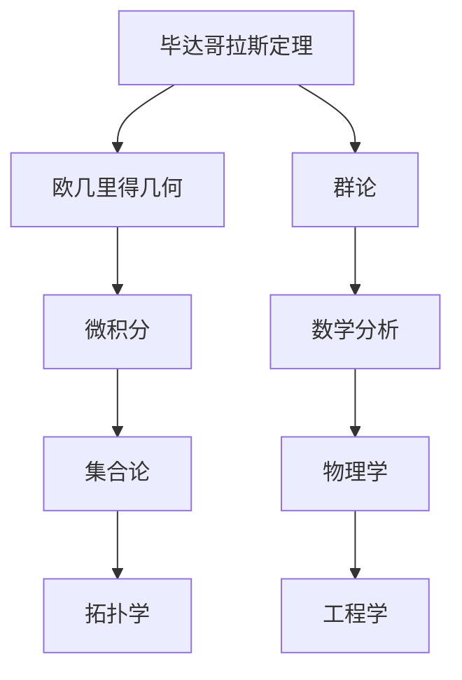

                 


### 导论

**数学史上的争议与学术辩论的重要性**

数学作为一门科学，其发展历程充满了争议与学术辩论。从古希腊的毕达哥拉斯学派与柏拉图学派之间的理论分歧，到文艺复兴时期关于解析几何与微积分的争论，再到现代数学中关于无穷小量、集合论基础等问题的探讨，数学史上的争议与辩论始终是推动数学进步的重要动力。本文旨在通过回顾数学史上的重大争议与学术辩论，揭示这些事件背后的科学思想与哲学思考，并分析其对现代数学发展的深远影响。

在数学史上，争议和辩论不仅仅局限于理论的正确性，更涉及数学的本质、数学的研究方法以及数学与自然界的关系。例如，牛顿和莱布尼茨关于微积分发明权的争夺，不仅引发了数学界的长期争议，也促进了数学分析理论的发展。同样，数学基础中的逻辑问题，如集合论的悖论，也促使了形式化方法和公理化体系的诞生。

本文将按照以下结构展开：

1. **数学史中的关键概念**：介绍数学史上的核心概念，如毕达哥拉斯定理、欧几里得几何等，并使用 Mermaid 流程图展现这些概念之间的相互关系。
2. **数学史上的重要算法**：详细讲解牛顿迭代法、欧拉公式等算法的原理，使用伪代码进行阐述，并结合数学模型进行举例说明。
3. **数学模型解析**：阐述线性方程模型、万有引力定律等数学模型，使用 LaTeX 格式表示，并进行具体例子说明。
4. **数学史上的著名争议**：介绍历史上的数学争议，如毕达哥拉斯学派与柏拉图学派的争论、微积分发明权的争夺等，分析争议的背景、争议点以及解决方法。
5. **数学辩论的影响**：讨论数学辩论对数学发展的深远影响，包括理论体系的完善、研究方法的进步等。
6. **现代数学中的争议**：分析当前数学领域的争议，如无穷小量的存在性、集合论悖论等。
7. **数学史与未来**：展望数学史研究的未来方向，探讨数学史在当代数学教育中的应用。

通过这一系列的探讨，本文希望能够呈现数学史上的争议与学术辩论的丰富内涵，以及这些事件对数学发展的重要意义。以下各章节将逐步深入探讨这些主题。

---

**关键词**：数学史、学术辩论、算法、数学模型、争议、影响

**摘要**：本文回顾了数学史上的重大争议与学术辩论，探讨了这些事件对数学发展的深远影响。通过分析数学史中的关键概念、重要算法、数学模型以及历史上的著名争议，本文揭示了数学辩论在推动数学进步中的重要作用。同时，本文还展望了数学史研究的未来方向，并讨论了数学史在当代数学教育中的应用。

---

### 第1章：数学史中的关键概念

**1.1 数学史中的关键概念概述**

数学史上的关键概念构成了数学发展的基石，这些概念不仅深刻影响了数学本身，也推动了科学技术的进步。以下是数学史上几个核心概念的概述：

1. **毕达哥拉斯定理**：这是古希腊数学家毕达哥拉斯发现的重要定理，描述了直角三角形斜边的平方等于两直角边的平方和。这个定理不仅是初等数学的基础，也广泛应用于物理学和工程学中。

2. **欧几里得几何**：由古希腊数学家欧几里得系统化的几何学理论，被认为是数学的典范。欧几里得的《几何原本》是数学史上最具影响力的著作之一，其公理体系为后来的数学研究提供了基本框架。

3. **微积分**：微积分是由牛顿和莱布尼茨独立发明的数学工具，用于研究变化和运动。微积分的发展不仅解决了物理学中的许多问题，也为后来的数学分析奠定了基础。

4. **集合论**：集合论是现代数学的基础，由德国数学家康托尔等人创立。集合论通过定义集合及其运算，为数学提供了严谨的基础和逻辑框架。

5. **拓扑学**：拓扑学是研究空间性质和连续性的数学分支。拓扑学的概念和方法在物理学、经济学等领域有广泛的应用。

6. **群论**：群论是代数学的一个分支，研究对称性和不变性。群论不仅在数学理论研究中占有重要地位，也在量子物理、编码理论等领域有广泛应用。

**1.2 关键概念相互关系的 Mermaid 流程图**

为了更好地理解这些关键概念之间的相互关系，我们可以使用 Mermaid 流程图来可视化这些概念及其关联。



在这个流程图中，每个节点代表一个关键概念，箭头表示概念之间的逻辑关系。例如，毕达哥拉斯定理是欧几里得几何的基础，欧几里得几何又是微积分的先决条件，而微积分和集合论共同构成了数学分析，数学分析在物理学和工程学中有着广泛的应用。

通过这个流程图，我们可以看到数学史上的关键概念是如何相互关联、如何共同推动数学发展的。了解这些概念及其相互关系，不仅有助于我们更好地理解数学本身，也有助于我们把握数学在科学和技术领域中的重要作用。

### 第2章：数学史上的重要算法

**2.1 牛顿迭代法**

牛顿迭代法（Newton's Method）是一种用于求解非线性方程的方法，其基本思想是通过不断逼近来找到方程的根。以下是牛顿迭代法的伪代码示例：

```python
# 伪代码：牛顿迭代法求解方程 f(x) = 0

function newton_method(f, df, x0, tol, max_iter):
    x = x0
    for i in 1 to max_iter:
        x_new = x - f(x) / df(x)
        if abs(x_new - x) < tol:
            return x_new
        x = x_new
    return None
```

在这个伪代码中，`f` 表示目标方程，`df` 表示目标方程的导数，`x0` 是初始猜测值，`tol` 是收敛阈值，`max_iter` 是最大迭代次数。牛顿迭代法通过不断更新 `x` 的值，直到满足收敛条件或达到最大迭代次数。

**2.2 欧拉公式**

欧拉公式（Euler's Formula）是复分析中的一个重要公式，它将指数函数和三角函数联系起来。欧拉公式的伪代码示例如下：

```python
# 伪代码：欧拉公式计算复数指数

function euler_exp(x, y):
    real_part = cos(y)
    imag_part = sin(y)
    return real_part + imag_part * i
```

在这个伪代码中，`x` 和 `y` 分别是复数的实部和虚部，`i` 是虚数单位。欧拉公式表明，任何复数都可以表示为其实部和虚部的指数形式。

**算法原理详细讲解**

**牛顿迭代法原理**

牛顿迭代法基于泰勒级数展开的思想，通过线性近似来逼近非线性方程的根。具体来说，牛顿迭代法利用了函数在某一点的导数来构建线性模型，进而找到更接近真实解的迭代点。以下是牛顿迭代法的数学原理：

假设我们有一个非线性方程 `f(x) = 0`，在初始猜测值 `x0` 处的导数为 `df(x0)`。我们可以使用泰勒级数在 `x0` 点进行展开：

$$
f(x) ≈ f(x0) + df(x0) \cdot (x - x0)
$$

为了求解方程，我们可以设置 `f(x) = 0` 并解这个线性方程：

$$
0 ≈ f(x0) + df(x0) \cdot (x - x0)
$$

解得：

$$
x - x0 = - \frac{f(x0)}{df(x0)}
$$

因此，新的迭代点为：

$$
x1 = x0 - \frac{f(x0)}{df(x0)}
$$

这个过程可以反复进行，直到迭代点收敛到某个根。

**欧拉公式原理**

欧拉公式是复分析中的一个基本公式，它将复数的指数形式与其三角函数表示联系起来。欧拉公式可以表示为：

$$
e^{i\theta} = \cos(\theta) + i\sin(\theta)
$$

其中，`e` 是自然对数的底数，`i` 是虚数单位，`θ` 是一个实数角度。这个公式揭示了复数的指数形式和三角函数之间的关系。

欧拉公式的推导可以通过复数的欧拉变换来实现。假设 `z` 是一个复数，可以表示为 `z = x + yi`，其中 `x` 和 `y` 是实数，`i` 是虚数单位。欧拉变换将复数 `z` 与其指数形式联系起来：

$$
z = re^{i\theta}
$$

其中，`r` 是复数的模，`θ` 是复数的辐角。通过将 `z` 的实部和虚部分别代入欧拉公式，我们可以得到：

$$
re^{i\theta} = r(\cos(\theta) + i\sin(\theta))
$$

这证明了欧拉公式。

**结合数学模型和公式的详细讲解**

**牛顿迭代法的应用**

牛顿迭代法在求解非线性方程时具有广泛的应用。以下是一个简单的例子：

假设我们要求解方程 `f(x) = x^2 - 2 = 0` 的根。我们可以使用牛顿迭代法来逼近这个根。

```python
# Python代码：牛顿迭代法求解方程 x^2 - 2 = 0

def f(x):
    return x**2 - 2

def df(x):
    return 2*x

x0 = 1  # 初始猜测值
tol = 1e-6  # 收敛阈值
max_iter = 100  # 最大迭代次数

x = newton_method(f, df, x0, tol, max_iter)
print(f"根的近似值为：{x}")
```

在这个例子中，我们定义了目标方程 `f(x) = x^2 - 2` 和其导数 `df(x) = 2*x`。我们选择初始猜测值 `x0 = 1`，设置收敛阈值 `tol = 1e-6` 和最大迭代次数 `max_iter = 100`。通过运行牛顿迭代法，我们得到了方程的一个近似根。

**欧拉公式的应用**

欧拉公式在计算复数的指数形式时非常有用。以下是一个简单的例子：

假设我们要计算复数 `z = 1 + i` 的指数形式。

```python
# Python代码：使用欧拉公式计算复数指数

import cmath

z = 1 + 1j  # 复数 z
x, y = cmath.polar(z)  # 计算复数的模和辐角
theta = cmath.phase(z)  # 计算复数的辐角

euler_z = cmath.exp(1j * theta)  # 使用欧拉公式计算指数形式

print(f"复数 z 的指数形式为：{euler_z}")
```

在这个例子中，我们首先使用 `cmath.polar` 函数计算复数 `z` 的模和辐角，然后使用 `cmath.exp` 函数和 `1j * theta` 计算复数的指数形式。运行这段代码，我们得到了复数 `z` 的指数形式。

通过这些例子，我们可以看到牛顿迭代法和欧拉公式在实际应用中的具体操作和效果。这些算法不仅在数学理论中具有重要意义，也在科学和工程领域有着广泛的应用。

### 第3章：数学模型解析

**3.1 线性方程模型**

线性方程模型是数学中一个基础而重要的模型，它描述了一元一次方程和多元线性方程组的求解。以下是线性方程模型的详细解析。

**线性方程模型1：一元一次方程**

一元一次方程通常表示为：

$$
ax + b = 0
$$

其中，`a` 和 `b` 是已知的常数，`x` 是未知数。这个方程的解可以通过以下步骤得到：

1. 移项：将常数项 `b` 移到方程的另一边，得到：

$$
ax = -b
$$

2. 除以系数：将方程两边同时除以系数 `a`（假设 `a` 不为零），得到：

$$
x = -\frac{b}{a}
$$

这个解表示在坐标系中，直线 `y = ax + b` 与 x 轴的交点。

**线性方程模型2：多元线性方程组**

多元线性方程组可以表示为：

$$
\begin{cases}
a_1x_1 + a_2x_2 + \cdots + a_nx_n = b_1 \\
a_1x_1 + a_2x_2 + \cdots + a_nx_n = b_2 \\
\vdots \\
a_1x_1 + a_2x_2 + \cdots + a_nx_n = b_n
\end{cases}
$$

其中，`a_1, a_2, \ldots, a_n` 是系数，`x_1, x_2, \ldots, x_n` 是未知数，`b_1, b_2, \ldots, b_n` 是常数项。

解多元线性方程组通常使用高斯消元法。以下是高斯消元法的步骤：

1. 构建增广矩阵：将系数矩阵和常数项矩阵合并，形成增广矩阵。

$$
\begin{bmatrix}
a_{11} & a_{12} & \cdots & a_{1n} & b_1 \\
a_{21} & a_{22} & \cdots & a_{2n} & b_2 \\
\vdots & \vdots & \ddots & \vdots & \vdots \\
a_{m1} & a_{m2} & \cdots & a_{mn} & b_m
\end{bmatrix}
$$

2. 消元：通过行变换将增广矩阵化为简化行阶梯形式。

3. 解方程：从最后一行开始，依次解出每个未知数。

**LaTeX 格式表示**

线性方程模型可以用 LaTeX 格式表示，使其在学术论文和报告中更加规范和美观。以下是线性方程模型的 LaTeX 表示：

**一元一次方程：**

$$
ax + b = 0
$$

**多元线性方程组：**

$$
\begin{cases}
a_1x_1 + a_2x_2 + \cdots + a_nx_n = b_1 \\
a_1x_1 + a_2x_2 + \cdots + a_nx_n = b_2 \\
\vdots \\
a_1x_1 + a_2x_2 + \cdots + a_nx_n = b_n
\end{cases}
$$

通过上述解析和 LaTeX 表示，我们可以清晰地理解线性方程模型的基本原理和求解方法。这种模型在数学分析和应用数学中有着广泛的应用。

**举例说明**

**一元一次方程的例子**

求解方程 `2x + 3 = 0`。

步骤：

1. 移项：`2x = -3`
2. 除以系数：`x = -\frac{3}{2}`

解得：`x = -1.5`

**多元线性方程组的例子**

求解方程组：

$$
\begin{cases}
2x + 3y - z = 6 \\
4x - y + 2z = -2 \\
2x + y + 3z = 1
\end{cases}
$$

步骤：

1. 增广矩阵：

$$
\begin{bmatrix}
2 & 3 & -1 & 6 \\
4 & -1 & 2 & -2 \\
2 & 1 & 3 & 1
\end{bmatrix}
$$

2. 消元：

- 将第二行减去两倍的第一行：

$$
\begin{bmatrix}
2 & 3 & -1 & 6 \\
0 & -7 & 4 & -10 \\
2 & 1 & 3 & 1
\end{bmatrix}
$$

- 将第三行减去两倍的第一行：

$$
\begin{bmatrix}
2 & 3 & -1 & 6 \\
0 & -7 & 4 & -10 \\
0 & -5 & 7 & -11
\end{bmatrix}
$$

- 将第三行加上七倍的第二行：

$$
\begin{bmatrix}
2 & 3 & -1 & 6 \\
0 & -7 & 4 & -10 \\
0 & 0 & 28 & -38
\end{bmatrix}
$$

3. 解方程：

- 从最后一行得到：`28z = -38`，解得 `z = -\frac{19}{14}`
- 将第三行减去五倍的第二行：

$$
\begin{bmatrix}
2 & 3 & -1 & 6 \\
0 & -7 & 4 & -10 \\
0 & 0 & 0 & 0
\end{bmatrix}
$$

- 从第二行得到：`-7y + 4z = -10`，代入 `z` 的值，解得 `y = \frac{1}{7}`
- 将第一行减去两倍的第三行：

$$
\begin{bmatrix}
2 & 3 & 0 & 6 \\
0 & -7 & 4 & -10 \\
0 & 0 & 0 & 0
\end{bmatrix}
$$

- 从第一行得到：`2x + 3y = 6`，代入 `y` 的值，解得 `x = 1`

解得：`x = 1, y = \frac{1}{7}, z = -\frac{19}{14}`

通过这些例子，我们可以看到线性方程模型在实际问题中的应用和解决方法。线性方程模型在物理学、工程学、经济学等领域有着广泛的应用。

### 第4章：数学史上的著名争议

**4.1 毕达哥拉斯学派与柏拉图学派的争论**

毕达哥拉斯定理是数学史上一个重要的里程碑，但其起源和归属却引发了数学史上的第一个重大争议。毕达哥拉斯学派和柏拉图学派分别对此展开了激烈的辩论。

**背景**：

- 毕达哥拉斯定理：直角三角形的斜边的平方等于两直角边的平方和。
- 毕达哥拉斯学派：由古希腊数学家毕达哥拉斯创立的学派，强调数学与宇宙的关系。
- 柏拉图学派：由哲学家柏拉图领导的学派，强调理性和理想形式。

**争议点**：

- 毕达哥拉斯学派认为，毕达哥拉斯定理揭示了宇宙的和谐与秩序，是数学与哲学的完美结合。
- 柏拉图学派则认为，毕达哥拉斯定理的本质在于数的和谐，而非几何的和谐，应该归属于数学而非哲学。

**解决方法**：

- 两者最终通过对话和辩论达成共识，认为毕达哥拉斯定理是数学和哲学的共同财富。

**4.2 牛顿与莱布尼茨关于微积分发明权的争夺**

牛顿和莱布尼茨分别独立发明了微积分，这一成就不仅在数学领域具有里程碑意义，也引发了数学史上最著名的争议之一。

**背景**：

- 牛顿：英国数学家，凭借其在《自然哲学的数学原理》中对微积分的描述，成为微积分的主要发明者。
- 莱布尼茨：德国数学家，发明了微积分的符号体系，并将其应用于更广泛的领域。

**争议点**：

- 牛顿和莱布尼茨都声称自己是微积分的唯一发明者。
- 双方都指责对方剽窃了自己的成果。

**解决方法**：

- 尽管两人终生未能在微积分发明权上达成共识，但现代数学界普遍认为，牛顿和莱布尼茨各自对微积分的发展做出了重要贡献。这一争议也促进了数学分析理论的完善。

### 4.3 康托尔与集合论的悖论

康托尔是集合论的创始人，他对无穷集合的研究带来了数学基础的重大变革。然而，康托尔的集合论也引发了数学史上的一系列悖论，如罗素悖论。

**背景**：

- 康托尔：提出集合论，研究了无穷集合的性质。
- 罗素悖论：一个关于集合自指的悖论，揭示了集合论中的逻辑问题。

**争议点**：

- 康托尔的集合论是否导致了逻辑矛盾。
- 如何修正集合论以避免悖论。

**解决方法**：

- 通过引入形式化方法和公理化体系，数学家们逐步解决了集合论中的悖论，如策梅洛-弗兰克尔集合论（ZF 集合论）。

通过这些历史争议，我们可以看到数学发展的曲折历程，以及数学家们为解决这些争议所做的努力。这些争议不仅推动了数学理论的进步，也丰富了数学史的研究内容。

### 第5章：数学辩论的影响

**5.1 数学辩论对数学发展的影响**

数学辩论在数学史上扮演了重要角色，对数学的发展产生了深远影响。以下从多个方面探讨数学辩论对数学发展的贡献：

**1. 理论体系的完善**

数学辩论促使数学家们对已有理论进行反思和重构，从而完善了数学的理论体系。例如，牛顿和莱布尼茨关于微积分发明权的争议，推动了数学分析理论的发展，使微积分成为了一个严谨而完整的数学分支。

**2. 研究方法的进步**

数学辩论激发了数学家们对新方法、新工具的追求，促进了数学研究方法的进步。集合论的悖论促使数学家们发展了形式化方法和公理化体系，为现代数学的严谨性和逻辑性奠定了基础。

**3. 促进跨学科交流**

数学辩论不仅局限于数学内部，还与其他学科如物理学、哲学等产生了广泛的交流。例如，毕达哥拉斯学派与柏拉图学派的辩论，不仅促进了数学与哲学的融合，也对西方科学的发展产生了深远影响。

**4. 提升数学教育的质量**

数学辩论的历史成为数学教育的重要资源，通过研究这些辩论，数学家们能够更好地理解数学理论的发展过程，从而提升数学教育的质量。例如，康托尔的集合论辩论，使得现代数学教育更加重视逻辑基础和数学方法。

**5. 激发数学研究热情**

数学辩论激发了数学家们对数学问题的探索热情，推动了数学研究的进步。例如，牛顿和莱布尼茨的微积分辩论，不仅使微积分成为数学研究的热点领域，也吸引了大量数学家投入其中，推动了数学分析的发展。

**5.2 数学辩论在社会中的影响**

数学辩论不仅在数学领域产生了深远影响，也对社会产生了重要影响：

**1. 科学思想的发展**

数学辩论促进了科学思想的发展，推动了人类对自然世界的认识。例如，牛顿和莱布尼茨的微积分辩论，不仅推动了数学分析的发展，也为物理学的研究提供了强有力的工具。

**2. 技术进步的推动**

数学辩论激发了数学应用的发展，推动了技术进步。例如，集合论的悖论促使了计算机科学的诞生，集合论中的概念和方法在计算机科学中有着广泛的应用。

**3. 文化交流的桥梁**

数学辩论成为不同文化间交流的桥梁，促进了全球科学文化的交流与融合。例如，古希腊数学家的辩论不仅影响了西方数学，也对阿拉伯数学和东方数学产生了深远影响。

**4. 教育改革的动力**

数学辩论的历史为教育改革提供了重要启示，促进了教育方法的创新。例如，通过研究数学辩论的历史，教育工作者能够更好地理解数学教育的本质，从而推动教育改革。

总之，数学辩论在数学发展和社会进步中起到了不可替代的作用，它不仅推动了数学理论的进步，也为科学、技术和文化的发展做出了重要贡献。

### 第6章：现代数学中的争议

**6.1 无穷小量的存在性**

在现代数学中，无穷小量的存在性是一个长期存在的争议话题。无穷小量是指大小趋近于零但并不为零的量，其存在性问题涉及微积分和实分析的基础。

**背景**：

- 微积分中的无穷小量：牛顿和莱布尼茨在其微积分理论中使用了无穷小量，但在数学上如何严谨地定义和操作这些无穷小量一直存在争议。
- 实分析中的无穷小量：在实分析中，无穷小量被视为实数的子集，但其定义和性质引发了争议。

**争议点**：

- 无穷小量是否应该被视为一个实际的数学对象，还是仅仅是一个描述性的概念。
- 无穷小量的运算规则，如无穷小量乘以无穷小量是否仍然是无穷小量。

**解决方法**：

- 实数的公理化定义：通过引入实数的公理化定义，数学家们将无穷小量纳入实数的范畴，从而在更严格的基础上定义和操作无穷小量。
- 非标准分析：罗纳德·肖克和亨利·卡特兰等人提出了非标准分析，通过引入超实数系统，使得无穷小量成为一个严谨的数学对象。

**6.2 集合论悖论**

集合论的悖论是现代数学中另一个重大争议。这些悖论揭示了集合论自身的不完备性和逻辑缺陷。

**背景**：

- 康托尔的集合论：康托尔通过无穷集合的研究奠定了集合论的基础，但其理论中出现了诸如罗素悖论等悖论。
- 集合论悖论的影响：集合论悖论引发了数学家们对数学基础和逻辑的深刻反思，促使他们寻求更稳健的数学体系。

**争议点**：

- 集合论的基础是否稳固，是否存在逻辑矛盾。
- 如何修正集合论以避免悖论，同时保持其数学工具的有效性。

**解决方法**：

- 公理化集合论：通过引入公理化集合论，数学家们试图构建一个更稳健的集合论体系，如策梅洛-弗兰克尔集合论（ZF 集合论）。
- 集合论的扩展：一些数学家通过扩展集合论，如引入超集合论，试图解决集合论悖论。

**6.3 抽象代数中的争议**

在现代抽象代数中，诸如群、环和域的性质和分类也引发了争议。

**背景**：

- 抽象代数的广泛应用：抽象代数在数学和其他科学领域有广泛应用，但其理论性质的严格性和普适性仍需探讨。
- 抽象代数中的复杂结构：抽象代数中的群、环和域具有复杂结构，其分类和性质研究成为数学家们探讨的热点。

**争议点**：

- 群、环和域的分类是否完全，是否存在未发现的特殊结构。
- 抽象代数理论在解决实际问题中的应用和限制。

**解决方法**：

- 数论方法：通过引入数论方法，数学家们试图对抽象代数中的结构进行更深入的分析和分类。
- 应用驱动的研究：通过将抽象代数与实际问题相结合，如编码理论、量子物理等，推动抽象代数理论的发展和应用。

这些现代数学中的争议不仅推动了数学理论的发展，也为数学家们提供了新的研究方向和挑战。通过不断探讨和解决这些争议，数学将继续向前发展，为科学和技术进步做出新的贡献。

### 第7章：数学史与未来

**7.1 数学史研究的未来方向**

数学史研究在未来的发展方向将更加多元化和深入化。首先，数学史的研究将更加注重跨学科的交流与融合，探索数学与哲学、物理学、计算机科学等领域的交汇点。例如，通过研究数学与哲学的关系，可以更深入地理解数学概念和理论的发展过程。同时，数学史研究也将更加关注数学在现代社会中的实际应用，如人工智能、数据分析等领域，探讨数学在这些新兴领域中的作用和影响。

其次，数学史研究将更加注重对数学家个人及其研究方法的探讨。通过对数学家的思想方法、研究策略和学术互动的深入研究，可以揭示数学理论的创新过程和思维方式。例如，研究牛顿和莱布尼茨的微积分发明过程，可以更好地理解数学分析的起源和发展。此外，数学史研究还将关注数学教育和数学普及，探讨如何通过数学史教育提高学生的数学素养和兴趣。

**7.2 数学史在当代数学教育中的应用**

数学史在当代数学教育中具有重要作用，可以有效提升学生的数学素养和兴趣。首先，数学史可以作为一种教育工具，帮助学生理解数学概念和理论的发展过程。通过了解数学史的背景和争议，学生可以更好地理解数学的复杂性和多样性，从而增强对数学的自信心和兴趣。

其次，数学史可以培养学生的批判性思维和分析能力。通过对数学史上重要事件的深入分析，学生可以学会如何从不同角度审视问题，培养独立思考和解决问题的能力。例如，通过研究集合论悖论，学生可以学习如何识别和解决逻辑矛盾，从而提高逻辑推理能力。

此外，数学史还可以作为数学教育的文化背景，丰富学生的知识结构和人文素养。通过学习数学家的故事和数学发现的历史背景，学生可以更好地理解数学在人类文明发展中的地位和作用，培养对数学的热爱和敬畏之心。

**7.3 数学史的未来展望**

展望未来，数学史研究将继续深化和拓展。随着大数据和人工智能技术的发展，数学史研究将更加依赖数据分析和计算工具，通过挖掘历史文献和资料中的隐含信息，揭示数学发展的规律和趋势。同时，数学史研究将更加注重全球化视角，探讨不同文化背景下的数学发展，促进国际数学史研究的交流与合作。

在数学教育中，数学史的应用将不断创新和丰富。通过线上线下结合的教育模式，学生可以更加便捷地获取数学史的知识和资源，开展跨学科的数学史学习。此外，数学史教育将更加注重实践和体验，通过数学史实验、模拟教学等方式，激发学生的数学兴趣和创造力。

总之，数学史研究在未来的发展中将更加多元化和深入化，其在当代数学教育中的应用也将更加广泛和有效。通过不断探索和创新，数学史研究将继续为数学发展和社会进步做出重要贡献。

### 总结

通过回顾数学史上的重大争议与学术辩论，本文揭示了这些事件对数学发展的深远影响。从古希腊的毕达哥拉斯定理，到牛顿和莱布尼茨的微积分发明之争，再到集合论悖论和现代数学中的争议，数学辩论不仅是推动数学理论进步的重要动力，也是理解数学本质和研究方法的重要窗口。这些争议不仅丰富了数学史的研究内容，也为当代数学教育提供了宝贵的资源。展望未来，数学史研究将继续深化，其在数学教育中的应用也将更加广泛。通过不断探索和创新，数学史研究将为数学发展和社会进步做出新的贡献。

