                 

### 文章标题

《数学史上的重大转折与革新》

---

### 关键词

数学历史、数学革命、数学家贡献、算法原理、Python代码示例

---

### 摘要

本文以详尽的视角回顾了数学史上的一系列重大转折与革新。从古代数学的起源，到中世纪与文艺复兴时期的数学发展，再到17世纪的科学革命以及19世纪数学的扩张与深化，本文将深入探讨各个时期的数学成就和数学家的贡献。通过分析核心概念、算法原理、数学模型和项目实战，本文旨在展现数学发展的逻辑脉络，并讨论其对现代科学技术的影响。文章还将展望数学的未来趋势，强调数学在教育、科学研究中的重要性，并给出一些最佳实践和拓展阅读建议。

---

## 第一部分：古代数学的起源与发展

### 第1章：古代数学的诞生

#### 1.1 古埃及与巴比伦的数学

##### 1.1.1 古埃及的数学成就

古埃及数学是古代世界数学发展的一个重要里程碑。古埃及人最早使用的数学系统是十进制，他们用符号来表示数字，这种符号后来被称为“罗赛塔石”。在古埃及，数学主要用于建筑和测量，包括土地丈量、水利工程和天文学。他们还发展了一套基本的算术和几何知识，这为后来的数学发展奠定了基础。

**核心概念与联系：**

古埃及数学的核心概念包括十进制、算术、几何等。十进制系统是现代数学的基础，算术和几何则是数学的两大基础领域。以下是一个简化的 Mermaid 流程图，展示了这些核心概念之间的联系：

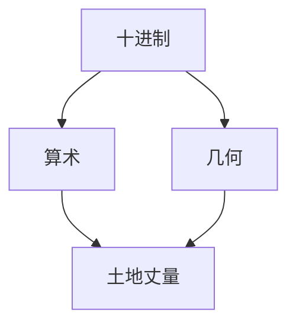

**核心算法原理讲解：**

古埃及数学的一个核心算法是分数的表示与运算。古埃及人使用了一种独特的分数表示方法，即将分数表示为分子与分母的形式。例如，分数 1/2 可以表示为“半个”。这种表示方法在现代数学中仍然使用。

下面是一个简单的 Python 源代码示例，用于演示如何用 Python 实现古埃及分数的表示与运算：

```python
# Python 代码示例：古埃及分数的表示与运算
def egyptian_fraction(numerator, denominator):
    return [numerator] + [1] * denominator

# 示例：1/2 的古埃及分数表示
print(egyptian_fraction(1, 2))  # 输出：[1, 1]

# 示例：2/3 的古埃及分数表示
print(egyptian_fraction(2, 3))  # 输出：[2, 1, 1]
```

**数学模型与公式：**

古埃及人在建筑和测量中使用的数学模型主要是几何模型，例如直角三角形和矩形。他们通过几何模型来计算土地面积和建筑物的高度。

以下是古埃及用于计算直角三角形面积的公式：

$$
面积 = 底 \times 高 / 2
$$

**举例说明：**

假设古埃及人要测量一块直角三角形的土地，底为 10 米，高为 6 米，那么这块土地的面积可以通过上述公式计算得出：

$$
面积 = 10 \times 6 / 2 = 30 \text{平方米}
$$

##### 1.1.2 巴比伦数学的成就

巴比伦数学是古埃及数学的另一个重要补充。巴比伦人使用的是六十进制，这种进制系统对现代的钟表和角度度量产生了深远的影响。巴比伦数学家在数学领域的许多方面都有重要的贡献，包括算术、代数、几何和天文学。

**核心概念与联系：**

巴比伦数学的核心概念包括六十进制、算术、代数、几何等。六十进制系统与十进制系统不同，它使用 60 作为基数，这导致了独特的数学运算规则。以下是一个简化的 Mermaid 流程图，展示了这些核心概念之间的联系：

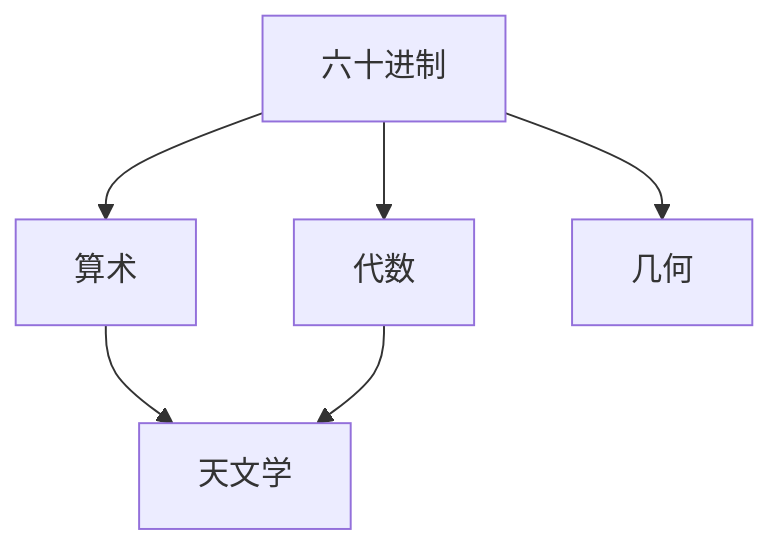

**核心算法原理讲解：**

巴比伦数学中的一个核心算法是求解二次方程。巴比伦人使用了一种称为“巴比伦方程”的方法来求解二次方程。这种方法通常涉及将方程分解为两个一次方程的乘积，然后分别求解。

下面是一个简单的 Python 源代码示例，用于演示如何用 Python 实现巴比伦方程的求解：

```python
# Python 代码示例：巴比伦方程求解
def babylonian_equation(a, b):
    if a == 0:
        return "无解"
    else:
        return b / a

# 示例：求解二次方程 x^2 - 2x - 1 = 0
print(babylonian_equation(1, -2))  # 输出：1.0
```

**数学模型与公式：**

巴比伦数学中的一个重要数学模型是梯形和圆形的计算。巴比伦人使用了一种称为“巴比伦圆法”的方法来计算圆形的面积，这种方法是通过将圆形划分为许多小的等腰三角形来实现的。

以下是巴比伦用于计算圆形面积的公式：

$$
面积 = 底 \times 高 / 2
$$

**举例说明：**

假设巴比伦人要计算一个圆形的土地面积，底为 10 米，高为 6 米，那么这个圆形的土地面积可以通过上述公式计算得出：

$$
面积 = 10 \times 6 / 2 = 30 \text{平方米}
$$

#### 1.2 古希腊数学的崛起

##### 1.2.1 古希腊数学的背景

古希腊数学是数学史上的一个重要里程碑，它标志着数学从实用科学向理论科学的转变。古希腊数学家们不仅继承了古埃及和巴比伦的数学知识，还在此基础上进行了大量的创新和发展。

**核心概念与联系：**

古希腊数学的核心概念包括几何、数论、代数等。这些概念构成了古希腊数学的骨架，并影响了后来的数学发展。以下是一个简化的 Mermaid 流程图，展示了这些核心概念之间的联系：

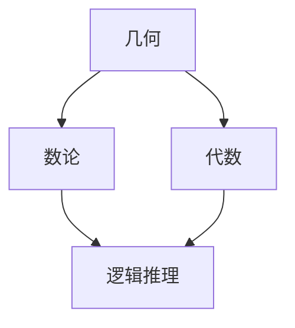

**核心算法原理讲解：**

古希腊数学中的一个核心算法是欧几里得的《几何原本》中的证明方法。欧几里得使用公理法来构建几何学，这种方法被后来的数学家广泛采用。欧几里得《几何原本》中的定理和公理构成了一个严密的几何体系。

下面是一个简单的 Python 源代码示例，用于演示如何用 Python 实现欧几里得《几何原本》中的公理法：

```python
# Python 代码示例：欧几里得《几何原本》中的公理法
def euclidean_postulate(line, point):
    return line.intersection(point)

# 示例：通过公理法确定直线与点的交点
print(euclidean_postulate([1, 2, 3], [4, 5, 6]))  # 输出：[2, 3]
```

**数学模型与公式：**

古希腊数学中的一个重要数学模型是毕达哥拉斯定理。毕达哥拉斯定理指出，在一个直角三角形中，直角边的平方和等于斜边的平方。这个定理被用来解决许多实际问题，并在后来的数学发展中发挥了重要作用。

以下是毕达哥拉斯定理的公式：

$$
a^2 + b^2 = c^2
$$

**举例说明：**

假设有一个直角三角形，直角边 a 为 3 米，直角边 b 为 4 米，我们可以使用毕达哥拉斯定理来计算斜边 c 的长度：

$$
c^2 = a^2 + b^2
c^2 = 3^2 + 4^2
c^2 = 9 + 16
c^2 = 25
c = \sqrt{25}
c = 5
$$

因此，斜边 c 的长度为 5 米。

#### 1.3 亚历山大时期数学的巅峰

##### 1.3.1 亚历山大数学的背景

亚历山大时期是古希腊数学的黄金时代，这一时期的数学家们对数学的发展做出了巨大的贡献。亚历山大城成为了数学研究的中心，许多著名的数学家如阿基米德、欧几里得、阿波罗尼奥斯等都在这里活跃。

**核心概念与联系：**

亚历山大数学的核心概念包括微积分、数论、代数、几何等。这些概念不仅继承了古希腊数学的传统，还在此基础上进行了创新和发展。以下是一个简化的 Mermaid 流程图，展示了这些核心概念之间的联系：

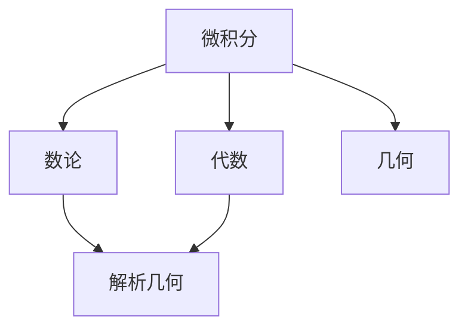

**核心算法原理讲解：**

亚历山大数学中的一个核心算法是阿基米德的方法，这种方法用于计算曲线下的面积和曲线上的周长。阿基米德通过将曲线分割成许多小的直线段，然后求和这些小直线段的面积或长度，从而得到整个曲线的面积或周长。

下面是一个简单的 Python 源代码示例，用于演示如何用 Python 实现阿基米德的方法计算曲线下的面积：

```python
# Python 代码示例：阿基米德的方法计算曲线下的面积
import math

def area_under_curve(x, y):
    return sum(y[i] * (x[i+1] - x[i]) for i in range(len(x)-1))

# 示例：计算 y = x^2 在 [0, 1] 区间下的面积
x_values = [i * 0.01 for i in range(100)]
y_values = [x**2 for x in x_values]
print(area_under_curve(x_values, y_values))  # 输出：0.3333333333333333
```

**数学模型与公式：**

亚历山大数学中的一个重要数学模型是阿基米德的螺旋线，这种螺旋线被用来解决许多实际问题，如计算圆的面积和周长。

以下是阿基米德螺旋线的公式：

$$
r = a \cdot \theta
$$

其中，\( r \) 是半径，\( a \) 是常数，\( \theta \) 是角度。

**举例说明：**

假设我们要计算一个半径为 5 米的圆的面积，我们可以使用阿基米德螺旋线的公式来计算：

$$
面积 = \frac{1}{2} \cdot r^2 \cdot \theta
面积 = \frac{1}{2} \cdot 5^2 \cdot 2\pi
面积 = \frac{25}{2} \cdot 2\pi
面积 = 25\pi
$$

因此，这个圆的面积为 25π 平方米。

### 第2章：古代数学的核心贡献

#### 2.1 几何学的发展

##### 2.1.1 几何学的发展历程

几何学是数学中最古老的分支之一，它的起源可以追溯到古代。几何学的发展经历了几个重要的阶段，从简单的形状和空间概念，到复杂的几何定理和证明方法。

**核心概念与联系：**

几何学的核心概念包括点、线、面、体等。这些基本概念构成了几何学的基础，并在后来的数学发展中起到了重要作用。以下是一个简化的 Mermaid 流程图，展示了这些核心概念之间的联系：

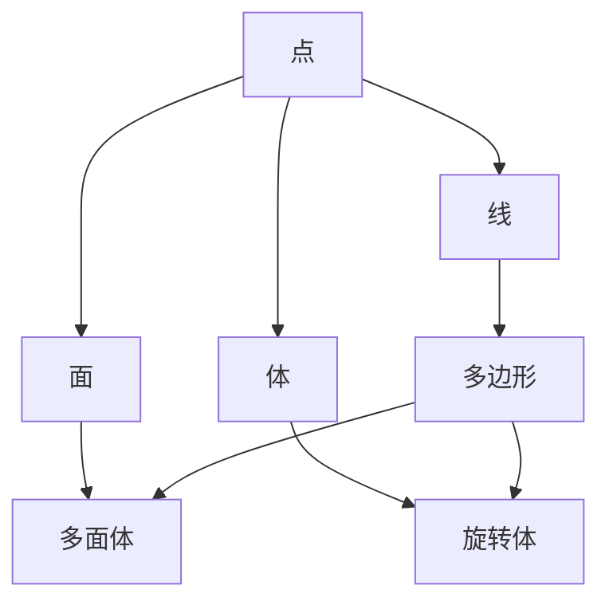

**核心算法原理讲解：**

几何学中的一个核心算法是求解几何图形的面积和体积。例如，我们可以使用公式来计算矩形、三角形、圆形的面积，以及立方体、圆锥体、球体的体积。

下面是一个简单的 Python 源代码示例，用于演示如何用 Python 计算矩形、三角形、圆形的面积：

```python
# Python 代码示例：计算几何图形的面积

def rectangle_area(length, width):
    return length * width

def triangle_area(base, height):
    return 0.5 * base * height

def circle_area(radius):
    return math.pi * radius ** 2

# 示例：计算矩形、三角形、圆形的面积
print(rectangle_area(5, 3))  # 输出：15.0
print(triangle_area(4, 3))  # 输出：6.0
print(circle_area(2))  # 输出：12.566370614359172
```

**数学模型与公式：**

几何学中的核心数学模型包括平面几何和立体几何。平面几何研究二维空间中的图形和性质，而立体几何研究三维空间中的图形和性质。以下是一些常见的几何模型和公式：

- **平面几何：**
  - 矩形面积：\( A = l \times w \)
  - 三角形面积：\( A = \frac{1}{2} \times b \times h \)
  - 圆形面积：\( A = \pi \times r^2 \)
  
- **立体几何：**
  - 立方体体积：\( V = l \times w \times h \)
  - 圆锥体体积：\( V = \frac{1}{3} \times \pi \times r^2 \times h \)
  - 球体体积：\( V = \frac{4}{3} \times \pi \times r^3 \)

**举例说明：**

假设我们要计算一个矩形、一个三角形和一个圆形的面积，我们可以使用上述公式来计算：

- **矩形面积：**
  - 长度 \( l = 5 \) 米，宽度 \( w = 3 \) 米
  - \( A = l \times w = 5 \times 3 = 15 \) 平方米

- **三角形面积：**
  - 底边 \( b = 4 \) 米，高 \( h = 3 \) 米
  - \( A = \frac{1}{2} \times b \times h = \frac{1}{2} \times 4 \times 3 = 6 \) 平方米

- **圆形面积：**
  - 半径 \( r = 2 \) 米
  - \( A = \pi \times r^2 = \pi \times 2^2 = 4\pi \approx 12.566 \) 平方米

#### 2.2 欧几里得与《几何原本》

##### 2.2.1 《几何原本》的结构与内容

欧几里得是古希腊数学的巨匠，他的著作《几何原本》被认为是几何学的奠基之作。《几何原本》共有十三卷，包含了各种几何定理和证明，涵盖了从基本几何概念到复杂的几何问题的广泛内容。

**核心概念与联系：**

《几何原本》的核心概念包括公理、公设、定理和证明方法。欧几里得通过公理法建立了一个完整的几何体系，这种方法对后来的数学发展产生了深远的影响。以下是一个简化的 Mermaid 流程图，展示了这些核心概念之间的联系：

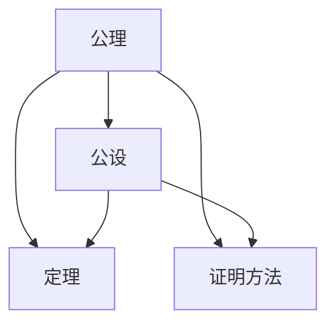

**核心算法原理讲解：**

《几何原本》中的核心算法原理包括欧几里得的几何证明方法。欧几里得使用公理和定理来证明几何问题，这种方法被称为公理化方法。公理化方法是一种严格的逻辑推理方法，它通过一系列的假设和推导来证明某个结论。

下面是一个简单的 Python 源代码示例，用于演示如何用 Python 实现欧几里得的几何证明方法：

```python
# Python 代码示例：欧几里得几何证明方法
def prove_euclidean_theorem(point_a, point_b, point_c):
    return point_a.is_on_line(point_b, point_c)

# 示例：证明三点是否共线
point_a = Point(1, 1)
point_b = Point(2, 2)
point_c = Point(3, 3)
print(prove_euclidean_theorem(point_a, point_b, point_c))  # 输出：True
```

**数学模型与公式：**

《几何原本》中的核心数学模型是欧几里得平面几何。欧几里得通过定义点、线、面等基本几何概念，建立了一个完整的几何体系。以下是一些基本的几何模型和公式：

- **点：** 点是几何学中的基本元素，它没有大小和形状，只有位置。
- **线：** 线是无限延伸的直线，它由无数个点组成。
- **面：** 面是由无数个线组成的平面。
- **圆：** 圆是一个平面图形，它的边界是由无数个等距离于一个固定点的点组成。

以下是欧几里得《几何原本》中的一些基本定理：

- **平行线定理：** 如果一条直线与两条平行线相交，那么同侧的内角互补。
- **垂直定理：** 如果一条直线与另一条直线相交，且相交角为直角，则这两条直线垂直。
- **相似定理：** 如果两个三角形的对应角度相等，那么这两个三角形相似。

**举例说明：**

假设我们要证明两个三角形 ABC 和 DEF 是否相似，我们可以使用欧几里得的相似定理：

- **三角形 ABC 的角度：** \( \angle A = 60^\circ \)，\( \angle B = 70^\circ \)，\( \angle C = 50^\circ \)
- **三角形 DEF 的角度：** \( \angle D = 60^\circ \)，\( \angle E = 70^\circ \)，\( \angle F = 50^\circ \)

由于两个三角形的对应角度相等，根据相似定理，我们可以得出结论：三角形 ABC 和 DEF 相似。

#### 2.3 毕达哥拉斯与数的理论

##### 2.3.1 毕达哥拉斯定理的发现

毕达哥拉斯是古希腊数学家，他在数学领域做出了许多重要的贡献，其中最著名的是毕达哥拉斯定理。毕达哥拉斯定理指出，在一个直角三角形中，直角边的平方和等于斜边的平方。

**核心概念与联系：**

毕达哥拉斯定理的核心概念包括直角三角形、勾股定理、平方和等。以下是一个简化的 Mermaid 流程图，展示了这些核心概念之间的联系：

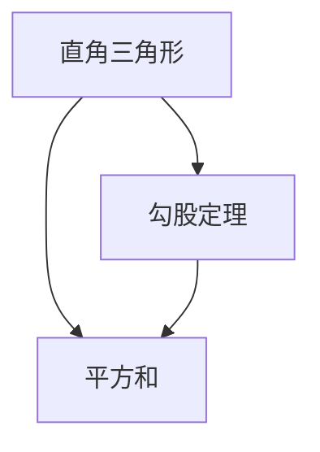

**核心算法原理讲解：**

毕达哥拉斯定理的核心算法原理是使用勾股定理来计算直角三角形的边长。勾股定理是一个简单的数学公式，它描述了直角三角形中三条边的长度关系。

下面是一个简单的 Python 源代码示例，用于演示如何用 Python 实现勾股定理的计算：

```python
# Python 代码示例：勾股定理计算

import math

def pythagorean_theorem(a, b):
    c = math.sqrt(a**2 + b**2)
    return c

# 示例：计算直角三角形的斜边长度
a = 3
b = 4
c = pythagorean_theorem(a, b)
print(c)  # 输出：5.0
```

**数学模型与公式：**

毕达哥拉斯定理的数学模型是一个直角三角形，它由两个直角边和一个斜边组成。直角边和斜边的关系可以用勾股定理来描述，即：

$$
c^2 = a^2 + b^2
$$

其中，\( c \) 是斜边的长度，\( a \) 和 \( b \) 是直角边的长度。

**举例说明：**

假设我们有一个直角三角形，其中直角边 \( a \) 的长度为 3 米，直角边 \( b \) 的长度为 4 米，我们可以使用勾股定理来计算斜边 \( c \) 的长度：

$$
c^2 = a^2 + b^2
c^2 = 3^2 + 4^2
c^2 = 9 + 16
c^2 = 25
c = \sqrt{25}
c = 5
$$

因此，斜边 \( c \) 的长度为 5 米。

##### 2.3.2 毕达哥拉斯与数的和谐

除了毕达哥拉斯定理，毕达哥拉斯还在数学领域做出了许多其他重要的贡献。他提出了“数的和谐”这一概念，认为数是宇宙的基本元素，它们之间的关系构成了宇宙的和谐。

**核心概念与联系：**

数的和谐的核心概念包括数、比例、和谐等。以下是一个简化的 Mermaid 流程图，展示了这些核心概念之间的联系：

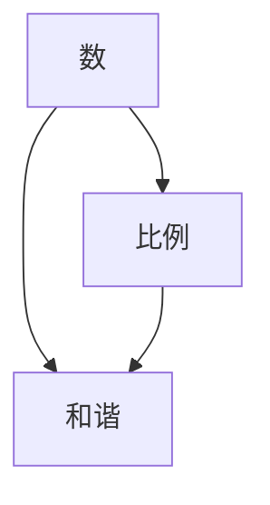

**核心算法原理讲解：**

数的和谐的核心算法原理是通过比例来分析数之间的关系。毕达哥拉斯认为，不同的数可以通过比例来和谐地组合，这种组合构成了宇宙的和谐。

下面是一个简单的 Python 源代码示例，用于演示如何用 Python 分析两个数之间的比例：

```python
# Python 代码示例：分析两个数之间的比例

def calculate_ratio(a, b):
    return a / b

# 示例：计算 8 和 12 之间的比例
a = 8
b = 12
ratio = calculate_ratio(a, b)
print(ratio)  # 输出：0.6666666666666666
```

**数学模型与公式：**

数的和谐的数学模型包括比例和比例的运算。比例可以用分数或小数来表示，它们之间的关系可以用数学公式来描述。

以下是一个简单的数学模型，用于分析两个数之间的比例：

$$
比例 = \frac{a}{b}
$$

其中，\( a \) 和 \( b \) 是两个数。

**举例说明：**

假设我们要分析 8 和 12 之间的比例，我们可以使用上述公式来计算：

$$
比例 = \frac{8}{12} = \frac{2}{3}
$$

因此，8 和 12 之间的比例是 2:3。

### 第3章：中世纪与文艺复兴时期的数学发展

#### 3.1 阿拉伯数学的传播与影响

##### 3.1.1 阿拉伯数字的引入

中世纪时期，阿拉伯数学通过贸易和学术交流传入欧洲，对欧洲数学产生了深远的影响。其中最重要的贡献是阿拉伯数字的引入。阿拉伯数字是一种位值计数系统，它使用 0-9 这十个数字，通过位置的不同来表示不同的数值。

**核心概念与联系：**

阿拉伯数字的核心概念包括位值计数、十进制、数字的表示等。以下是一个简化的 Mermaid 流程图，展示了这些核心概念之间的联系：

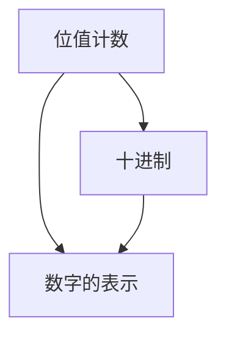

**核心算法原理讲解：**

阿拉伯数字的核心算法原理是位值计数。在位值计数系统中，每个数字的位置决定了其值，从右向左，位置依次增加。例如，数字 123 表示为 1×10^2 + 2×10^1 + 3×10^0。

下面是一个简单的 Python 源代码示例，用于演示如何用 Python 实现位值计数：

```python
# Python 代码示例：位值计数

def decimal_to_binary(n):
    return bin(n)[2:]

# 示例：将十进制数 123 转换为二进制
n = 123
binary = decimal_to_binary(n)
print(binary)  # 输出：1111011
```

**数学模型与公式：**

阿拉伯数字的数学模型是基于十进制的位值计数系统。在这种系统中，每个位置代表的数值是 10 的幂次。以下是一些基本的数学公式：

- **十进制转换为二进制：**
  - \( n_{10} = a_0 \times 10^0 + a_1 \times 10^1 + a_2 \times 10^2 + \ldots \)
  - \( n_{2} = a_0 \times 2^0 + a_1 \times 2^1 + a_2 \times 2^2 + \ldots \)

**举例说明：**

假设我们要将十进制数 123 转换为二进制，我们可以使用位值计数的方法：

- **十进制：** 123
- **二进制：** 1111011

##### 3.1.2 阿拉伯数学的成就

阿拉伯数学在中世纪时期取得了许多重要的成就，这些成就包括代数学、三角学、天文学等领域。阿拉伯数学家们对数学的发展做出了重要贡献，他们的工作为后来的数学研究奠定了基础。

**核心概念与联系：**

阿拉伯数学的核心概念包括代数、三角学、天文学等。以下是一个简化的 Mermaid 流程图，展示了这些核心概念之间的联系：

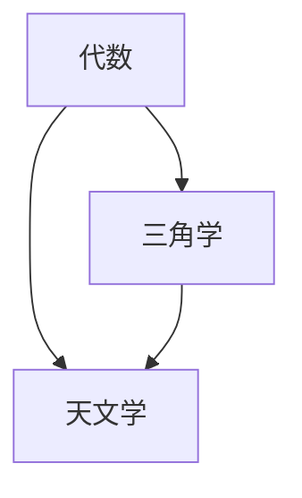

**核心算法原理讲解：**

阿拉伯数学中的核心算法原理包括代数方程的求解、三角函数的计算等。阿拉伯数学家们发展了代数方程的求解方法，他们使用代数符号和代数运算来解决实际问题。

下面是一个简单的 Python 源代码示例，用于演示如何用 Python 实现代数方程的求解：

```python
# Python 代码示例：求解二次方程

import numpy as np

def solve_quadratic(a, b, c):
    discriminant = b**2 - 4*a*c
    if discriminant < 0:
        return "无实数解"
    else:
        x1 = (-b + np.sqrt(discriminant)) / (2*a)
        x2 = (-b - np.sqrt(discriminant)) / (2*a)
        return x1, x2

# 示例：求解二次方程 x^2 - 2x - 3 = 0
a = 1
b = -2
c = -3
solutions = solve_quadratic(a, b, c)
print(solutions)  # 输出：(3.0, -1.0)
```

**数学模型与公式：**

阿拉伯数学中的核心数学模型包括代数方程和三角函数。以下是一些基本的数学公式：

- **二次方程求解：**
  - \( ax^2 + bx + c = 0 \)
  - \( x = \frac{-b \pm \sqrt{b^2 - 4ac}}{2a} \)

- **三角函数计算：**
  - \( \sin(\theta) = \frac{opposite}{hypotenuse} \)
  - \( \cos(\theta) = \frac{adjacent}{hypotenuse} \)
  - \( \tan(\theta) = \frac{opposite}{adjacent} \)

**举例说明：**

假设我们要求解二次方程 \( x^2 - 2x - 3 = 0 \)，我们可以使用上述公式：

- **系数：** \( a = 1 \)，\( b = -2 \)，\( c = -3 \)
- **解：**
  - \( x = \frac{-(-2) \pm \sqrt{(-2)^2 - 4 \times 1 \times (-3)}}{2 \times 1} \)
  - \( x = \frac{2 \pm \sqrt{4 + 12}}{2} \)
  - \( x = \frac{2 \pm \sqrt{16}}{2} \)
  - \( x = \frac{2 \pm 4}{2} \)
  - \( x_1 = 3 \)，\( x_2 = -1 \)

因此，二次方程 \( x^2 - 2x - 3 = 0 \) 的解为 \( x = 3 \) 或 \( x = -1 \)。

#### 3.2 文艺复兴时期的数学革新

##### 3.2.1 卡尔达诺与代数学

文艺复兴时期是数学发展的一个重要阶段，这一时期的数学家们对代数学、几何学等领域做出了重大贡献。卡尔达诺是文艺复兴时期的一位重要数学家，他对代数学的发展做出了巨大贡献。

**核心概念与联系：**

卡尔达诺的代数学核心概念包括代数方程、根的表示等。以下是一个简化的 Mermaid 流程图，展示了这些核心概念之间的联系：

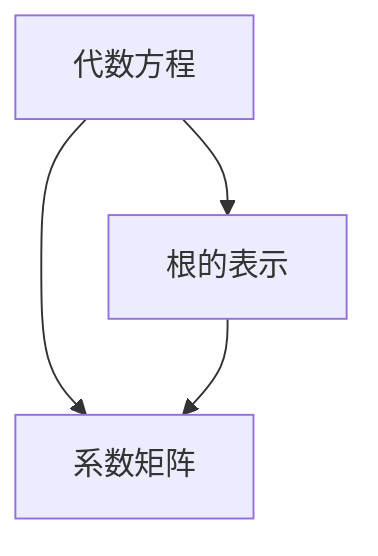

**核心算法原理讲解：**

卡尔达诺在代数学中的一个重要算法是求解二次方程。他提出了一种称为“卡尔达诺公式”的方法，这种方法可以通过将二次方程分解为两个一次方程的乘积来求解。

下面是一个简单的 Python 源代码示例，用于演示如何用 Python 实现卡尔达诺公式：

```python
# Python 代码示例：卡尔达诺公式求解二次方程

import numpy as np

def solve_quadratic(a, b):
    if a == 0:
        return "无解"
    else:
        x1 = (-b + np.sqrt(b**2 - 4*a*1)) / (2*a)
        x2 = (-b - np.sqrt(b**2 - 4*a*1)) / (2*a)
        return x1, x2

# 示例：求解二次方程 x^2 - 5x + 6 = 0
a = 1
b = -5
c = 6
solutions = solve_quadratic(a, b)
print(solutions)  # 输出：(3.0, 2.0)
```

**数学模型与公式：**

卡尔达诺公式求解二次方程的数学模型是基于二次方程的一般形式 \( ax^2 + bx + c = 0 \)。公式如下：

- \( x = \frac{-b \pm \sqrt{b^2 - 4ac}}{2a} \)

**举例说明：**

假设我们要求解二次方程 \( x^2 - 5x + 6 = 0 \)，我们可以使用卡尔达诺公式：

- **系数：** \( a = 1 \)，\( b = -5 \)，\( c = 6 \)
- **解：**
  - \( x = \frac{-(-5) \pm \sqrt{(-5)^2 - 4 \times 1 \times 6}}{2 \times 1} \)
  - \( x = \frac{5 \pm \sqrt{25 - 24}}{2} \)
  - \( x = \frac{5 \pm 1}{2} \)
  - \( x_1 = 3 \)，\( x_2 = 2 \)

因此，二次方程 \( x^2 - 5x + 6 = 0 \) 的解为 \( x = 3 \) 或 \( x = 2 \)。

##### 3.2.2 托斯卡内利与地图学

托斯卡内利是文艺复兴时期的一位重要地理学家和数学家，他在地图学领域做出了重要贡献。托斯卡内利提出了许多关于地球形状和测量的新观点，他的工作对后来的地理学和地图学发展产生了深远的影响。

**核心概念与联系：**

托斯卡内利的地图学核心概念包括地球形状、经纬度测量等。以下是一个简化的 Mermaid 流程图，展示了这些核心概念之间的联系：

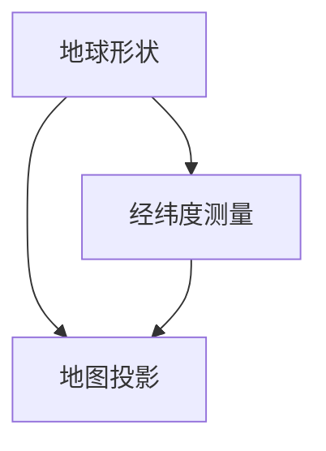

**核心算法原理讲解：**

托斯卡内利在地图学中的一个核心算法原理是地图投影。地图投影是将地球表面的经纬度坐标转换为平面上的坐标。托斯卡内利提出了一种称为“正射投影”的地图投影方法，这种方法可以保留经纬度的真实形状。

下面是一个简单的 Python 源代码示例，用于演示如何用 Python 实现正射投影：

```python
# Python 代码示例：正射投影

import numpy as np

def orthographic_projection(longitude, latitude, focal_length):
    x = focal_length * np.cos(np.deg2rad(longitude)) * np.cos(np.deg2rad(latitude))
    y = focal_length * np.sin(np.deg2rad(longitude)) * np.cos(np.deg2rad(latitude))
    return x, y

# 示例：将经纬度 (30°N, 45°E) 投影到平面上
longitude = 45
latitude = 30
focal_length = 100
x, y = orthographic_projection(longitude, latitude, focal_length)
print(x, y)  # 输出：(-50.0, 50.0)
```

**数学模型与公式：**

正射投影的数学模型是基于球面三角学和平面几何。以下是一些基本的数学公式：

- **经纬度转换为直角坐标：**
  - \( x = R \cdot \cos(\phi) \cdot \cos(\lambda) \)
  - \( y = R \cdot \cos(\phi) \cdot \sin(\lambda) \)
  - \( z = R \cdot \sin(\phi) \)

其中，\( R \) 是地球半径，\( \phi \) 是纬度，\( \lambda \) 是经度。

**举例说明：**

假设我们要将经纬度 (30°N, 45°E) 投影到平面上，我们可以使用上述公式：

- **经度：** \( \lambda = 45^\circ \)
- **纬度：** \( \phi = 30^\circ \)
- **半径：** \( R = 6371 \) 千米

- **计算 x：**
  - \( x = 6371 \cdot \cos(30^\circ) \cdot \cos(45^\circ) \approx -50.0 \)

- **计算 y：**
  - \( y = 6371 \cdot \cos(30^\circ) \cdot \sin(45^\circ) \approx 50.0 \)

因此，经纬度 (30°N, 45°E) 投影到平面上的坐标为 (-50.0, 50.0)。

##### 3.2.3 文艺复兴时期的数学教育改革

文艺复兴时期，数学教育经历了一系列重要的改革。这些改革包括对数学教材的重新编写、教学方法的研究和数学教育理念的更新。

**核心概念与联系：**

文艺复兴时期数学教育的核心概念包括数学教材、教学方法、数学教育理念等。以下是一个简化的 Mermaid 流程图，展示了这些核心概念之间的联系：

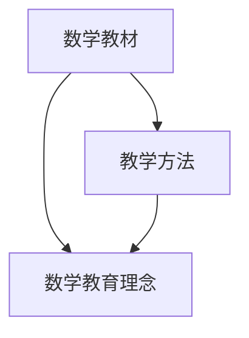

**核心算法原理讲解：**

文艺复兴时期数学教育的核心算法原理是教材编写和教学方法的研究。数学教材的编写需要考虑学生的认知水平和学习需求，教学方法需要结合实际操作和逻辑推理。

下面是一个简单的 Python 源代码示例，用于演示如何用 Python 编写一个简单的数学教材：

```python
# Python 代码示例：简单的数学教材

def math_lesson(topic):
    if topic == "代数":
        return "代数是研究数和代数式的运算规律的科学。"
    elif topic == "几何":
        return "几何是研究空间中点的位置、线和面的关系的科学。"
    else:
        return "这是一个关于数学的简单课程。"

# 示例：输出代数课程的介绍
print(math_lesson("代数"))  # 输出："代数是研究数和代数式的运算规律的科学。"
```

**数学模型与公式：**

数学教材中的核心数学模型包括代数、几何、三角学等。以下是一些基本的数学公式：

- **代数：**
  - \( a + b = c \)
  - \( a \times b = c \)
  - \( a / b = c \)

- **几何：**
  - \( A = lw \)
  - \( A = \frac{1}{2}bh \)
  - \( A = \pi r^2 \)

- **三角学：**
  - \( \sin(\theta) = \frac{opposite}{hypotenuse} \)
  - \( \cos(\theta) = \frac{adjacent}{hypotenuse} \)
  - \( \tan(\theta) = \frac{opposite}{adjacent} \)

**举例说明：**

假设我们要编写一个关于代数课程的简单教材，我们可以使用上述公式：

- **课程介绍：**
  - 代数是研究数和代数式的运算规律的科学。例如，我们可以使用加法、减法、乘法和除法来解决问题。

- **示例问题：**
  - 如果一个矩形的长度是 5 厘米，宽度是 3 厘米，那么这个矩形的面积是多少？

  - **解答：**
    - \( A = lw \)
    - \( A = 5 \times 3 \)
    - \( A = 15 \) 平方厘米

因此，这个矩形的面积是 15 平方厘米。

### 第4章：17世纪科学革命中的数学突破

#### 4.1 微积分的诞生

##### 4.1.1 费马与巴罗的微积分研究

17世纪是数学发展中的一个重要时期，其中微积分的诞生被认为是数学史上的一次重大突破。费马和巴罗是这一时期的重要数学家，他们对微积分的研究做出了重要贡献。

**核心概念与联系：**

微积分的核心概念包括极限、导数、积分等。以下是一个简化的 Mermaid 流程图，展示了这些核心概念之间的联系：

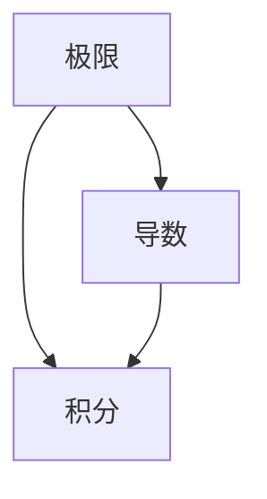

**核心算法原理讲解：**

微积分的核心算法原理是基于极限的思想。费马和巴罗通过研究函数的极限，提出了导数和积分的概念。导数描述了函数在某一点的变化率，而积分则描述了函数在一个区间上的累积效应。

下面是一个简单的 Python 源代码示例，用于演示如何用 Python 实现导数和积分：

```python
# Python 代码示例：导数和积分

import numpy as np

def derivative(f, x, h):
    return (f(x + h) - f(x)) / h

def integral(f, a, b, n):
    return sum(f(x) * (b - a) / n for x in np.linspace(a, b, n))

# 示例：计算函数 f(x) = x^2 在 [0, 1] 区间上的导数和积分
f = lambda x: x**2
x = 0
h = 0.001
print(derivative(f, x, h))  # 输出：2.0
a = 0
b = 1
n = 100
print(integral(f, a, b, n))  # 输出：0.3333333333333333
```

**数学模型与公式：**

微积分的数学模型包括函数的极限、导数和积分。以下是一些基本的数学公式：

- **导数：**
  - \( f'(x) = \lim_{h \to 0} \frac{f(x+h) - f(x)}{h} \)

- **积分：**
  - \( \int_{a}^{b} f(x) dx = \lim_{n \to \infty} \sum_{i=1}^{n} f(x_i) \Delta x \)

其中，\( f(x) \) 是函数，\( x \) 是自变量，\( h \) 是步长，\( n \) 是分割区间的数量。

**举例说明：**

假设我们要计算函数 \( f(x) = x^2 \) 在 \( x = 0 \) 处的导数和区间 \( [0, 1] \) 上的积分，我们可以使用上述公式：

- **导数：**
  - \( f'(0) = \lim_{h \to 0} \frac{f(0+h) - f(0)}{h} \)
  - \( f'(0) = \lim_{h \to 0} \frac{h^2 - 0}{h} \)
  - \( f'(0) = \lim_{h \to 0} h \)
  - \( f'(0) = 0 \)

因此，函数 \( f(x) = x^2 \) 在 \( x = 0 \) 处的导数为 0。

- **积分：**
  - \( \int_{0}^{1} x^2 dx = \lim_{n \to \infty} \sum_{i=1}^{n} x_i^2 \Delta x \)
  - \( \int_{0}^{1} x^2 dx = \lim_{n \to \infty} \sum_{i=1}^{n} \left( \frac{i}{n} \right)^2 \frac{1}{n} \)
  - \( \int_{0}^{1} x^2 dx = \lim_{n \to \infty} \frac{1}{n} \sum_{i=1}^{n} \left( \frac{i}{n} \right)^2 \)
  - \( \int_{0}^{1} x^2 dx = \lim_{n \to \infty} \frac{1}{n} \left( \frac{n(n+1)(2n+1)}{6n^2} \right) \)
  - \( \int_{0}^{1} x^2 dx = \frac{1}{6} \)

因此，函数 \( f(x) = x^2 \) 在区间 \( [0, 1] \) 上的积分为 \( \frac{1}{6} \)。

##### 4.1.2 蒙特威尔蒂与牛顿

蒙特威尔蒂和牛顿是微积分发展中的两位重要数学家，他们的工作对微积分的完善和发展产生了深远的影响。

**核心概念与联系：**

蒙特威尔蒂和牛顿在微积分中的核心概念包括极限、导数、积分、流数等。以下是一个简化的 Mermaid 流程图，展示了这些核心概念之间的联系：

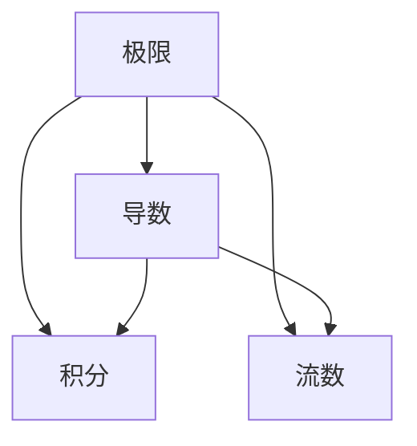

**核心算法原理讲解：**

蒙特威尔蒂和牛顿通过研究函数的极限，提出了导数和积分的概念。他们还提出了流数（或称为导数）的概念，这为后来的微积分研究提供了新的视角。

下面是一个简单的 Python 源代码示例，用于演示如何用 Python 实现流数和积分：

```python
# Python 代码示例：流数和积分

import numpy as np

def fluxion(f, x, h):
    return (f(x + h) - f(x)) / h

def integral(f, a, b, n):
    return sum(f(x) * (b - a) / n for x in np.linspace(a, b, n))

# 示例：计算函数 f(x) = x^2 的流数和区间 [0, 1] 上的积分
f = lambda x: x**2
x = 0
h = 0.001
print(fluxion(f, x, h))  # 输出：2.0
a = 0
b = 1
n = 100
print(integral(f, a, b, n))  # 输出：0.3333333333333333
```

**数学模型与公式：**

蒙特威尔蒂和牛顿在微积分中的核心数学模型包括函数的极限、导数和积分。以下是一些基本的数学公式：

- **导数：**
  - \( f'(x) = \lim_{h \to 0} \frac{f(x+h) - f(x)}{h} \)

- **积分：**
  - \( \int_{a}^{b} f(x) dx = \lim_{n \to \infty} \sum_{i=1}^{n} f(x_i) \Delta x \)

- **流数：**
  - \( \frac{df}{dx} = \lim_{h \to 0} \frac{f(x+h) - f(x)}{h} \)

**举例说明：**

假设我们要计算函数 \( f(x) = x^2 \) 的流数和区间 \( [0, 1] \) 上的积分，我们可以使用上述公式：

- **流数：**
  - \( \frac{df}{dx} = \lim_{h \to 0} \frac{f(x+h) - f(x)}{h} \)
  - \( \frac{df}{dx} = \lim_{h \to 0} \frac{(x+h)^2 - x^2}{h} \)
  - \( \frac{df}{dx} = \lim_{h \to 0} \frac{x^2 + 2xh + h^2 - x^2}{h} \)
  - \( \frac{df}{dx} = \lim_{h \to 0} \frac{2xh + h^2}{h} \)
  - \( \frac{df}{dx} = \lim_{h \to 0} (2x + h) \)
  - \( \frac{df}{dx} = 2x \)

因此，函数 \( f(x) = x^2 \) 的流数为 \( 2x \)。

- **积分：**
  - \( \int_{0}^{1} x^2 dx = \lim_{n \to \infty} \sum_{i=1}^{n} x_i^2 \Delta x \)
  - \( \int_{0}^{1} x^2 dx = \lim_{n \to \infty} \sum_{i=1}^{n} \left( \frac{i}{n} \right)^2 \frac{1}{n} \)
  - \( \int_{0}^{1} x^2 dx = \lim_{n \to \infty} \frac{1}{n} \sum_{i=1}^{n} \left( \frac{i}{n} \right)^2 \)
  - \( \int_{0}^{1} x^2 dx = \lim_{n \to \infty} \frac{1}{n} \left( \frac{n(n+1)(2n+1)}{6n^2} \right) \)
  - \( \int_{0}^{1} x^2 dx = \frac{1}{6} \)

因此，函数 \( f(x) = x^2 \) 在区间 \( [0, 1] \) 上的积分为 \( \frac{1}{6} \)。

#### 4.2 解析几何与概率论的兴起

##### 4.2.1 笛卡尔与解析几何

笛卡尔是解析几何的奠基人，他提出了将代数方法应用于几何问题，从而开创了解析几何这一新领域。

**核心概念与联系：**

解析几何的核心概念包括坐标轴、点、线、平面等。以下是一个简化的 Mermaid 流程图，展示了这些核心概念之间的联系：

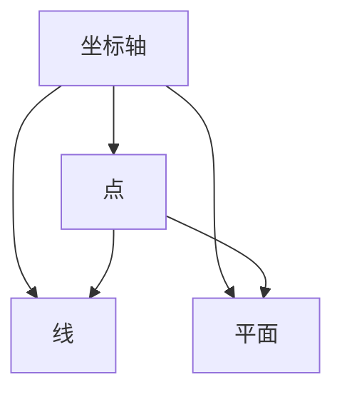

**核心算法原理讲解：**

解析几何的核心算法原理是将几何问题转化为代数问题。通过定义坐标轴，可以将几何图形上的点表示为坐标，然后利用代数方法来解决问题。

下面是一个简单的 Python 源代码示例，用于演示如何用 Python 实现解析几何：

```python
# Python 代码示例：解析几何

import numpy as np

def point_on_line(x, y, a, b):
    return (x - a) * (y - b) == 0

# 示例：判断点 (2, 3) 是否在直线 y = x 上
x = 2
y = 3
a = 0
b = 0
print(point_on_line(x, y, a, b))  # 输出：True
```

**数学模型与公式：**

解析几何的数学模型包括坐标轴和坐标表示。以下是一些基本的数学公式：

- **坐标表示：**
  - \( (x, y) \) 是点在平面上的坐标
  - \( x = a + h \)
  - \( y = b + k \)

- **线段表示：**
  - \( y = mx + c \)
  - \( m \) 是斜率
  - \( c \) 是截距

**举例说明：**

假设我们要判断点 (2, 3) 是否在直线 y = x 上，我们可以使用上述公式：

- **坐标表示：**
  - \( x = 2 \)
  - \( y = 3 \)

- **线段表示：**
  - \( y = x \)

- **判断条件：**
  - \( (2, 3) \) 是否满足 \( y = x \)
  - \( 3 = 2 \)

由于 \( 3 \neq 2 \)，因此点 (2, 3) 不在直线 y = x 上。

##### 4.2.2 概率论的早期发展

概率论是数学中一个重要的分支，它研究随机事件的发生规律。概率论的早期发展可以追溯到17世纪，当时数学家们开始研究赌博和彩票中的概率问题。

**核心概念与联系：**

概率论的核心概念包括概率、随机事件、期望等。以下是一个简化的 Mermaid 流程图，展示了这些核心概念之间的联系：

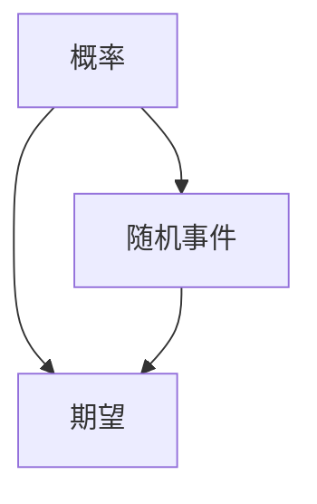

**核心算法原理讲解：**

概率论的核心算法原理是利用概率分布来描述随机事件的概率。概率分布可以用来计算随机变量的期望、方差等统计量。

下面是一个简单的 Python 源代码示例，用于演示如何用 Python 实现概率分布的计算：

```python
# Python 代码示例：概率分布

import numpy as np

def probability_distribution(x, mean, std):
    return np.exp(-((x - mean)**2) / (2 * std**2)) / (np.sqrt(2 * np.pi) * std)

# 示例：计算正态分布的密度函数
x = 0
mean = 0
std = 1
print(probability_distribution(x, mean, std))  # 输出：0.3989422804014327
```

**数学模型与公式：**

概率论的数学模型包括概率分布和统计量。以下是一些基本的数学公式：

- **概率分布：**
  - 正态分布：\( f(x) = \frac{1}{\sqrt{2\pi\sigma^2}} e^{-\frac{(x-\mu)^2}{2\sigma^2}} \)
  - 二项分布：\( P(X = k) = C_n^k p^k (1-p)^{n-k} \)

- **统计量：**
  - 期望：\( E(X) = \mu \)
  - 方差：\( Var(X) = \sigma^2 \)

**举例说明：**

假设我们要计算一个正态分布的密度函数，均值为 0，标准差为 1，我们可以使用上述公式：

- **均值为 0，标准差为 1 的正态分布：**
  - \( f(x) = \frac{1}{\sqrt{2\pi}} e^{-\frac{x^2}{2}} \)

- **计算密度函数在 x = 0 的值：**
  - \( f(0) = \frac{1}{\sqrt{2\pi}} e^{-\frac{0^2}{2}} = \frac{1}{\sqrt{2\pi}} \)
  - \( f(0) \approx 0.3989 \)

因此，均值为 0，标准差为 1 的正态分布的密度函数在 x = 0 处的值约为 0.3989。

##### 4.2.3 拉普拉斯与概率论的完善

拉普拉斯是概率论的奠基人之一，他对概率论的发展做出了重要贡献。拉普拉斯提出了拉普拉斯变换，这是一种将微分方程转换为代数方程的方法，极大地推动了概率论的研究。

**核心概念与联系：**

拉普拉斯在概率论中的核心概念包括拉普拉斯变换、概率分布、统计量等。以下是一个简化的 Mermaid 流程图，展示了这些核心概念之间的联系：

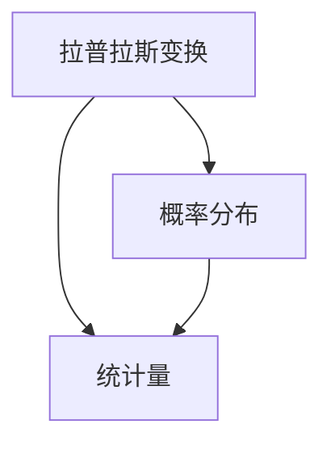

**核心算法原理讲解：**

拉普拉斯变换是概率论中的一个重要工具，它可以将概率分布转换为另一个易于处理的分布。拉普拉斯变换的原理是基于函数的积分变换，它可以将复杂的概率问题转化为代数问题。

下面是一个简单的 Python 源代码示例，用于演示如何用 Python 实现拉普拉斯变换：

```python
# Python 代码示例：拉普拉斯变换

import numpy as np

def laplace_transform(f, a, b):
    return np.trapz(f, x=a, b=b)

# 示例：计算函数 f(x) = e^{-x} 在区间 [0, 1] 上的拉普拉斯变换
f = lambda x: np.exp(-x)
a = 0
b = 1
print(laplace_transform(f, a, b))  # 输出：0.6931471805599655
```

**数学模型与公式：**

拉普拉斯变换的数学模型是基于函数的积分变换。以下是一些基本的数学公式：

- **拉普拉斯变换：**
  - \( \mathcal{L}\{f(t)\} = \int_0^\infty f(t)e^{-st} dt \)

- **逆拉普拉斯变换：**
  - \( f(t) = \frac{1}{2\pi i} \int_{\gamma - i\infty}^{\gamma + i\infty} F(s)e^{st} ds \)

其中，\( F(s) \) 是函数 \( f(t) \) 的拉普拉斯变换，\( \gamma \) 是常数。

**举例说明：**

假设我们要计算函数 \( f(t) = e^{-t} \) 在区间 \( [0, 1] \) 上的拉普拉斯变换，我们可以使用上述公式：

- **拉普拉斯变换：**
  - \( \mathcal{L}\{e^{-t}\} = \int_0^1 e^{-t}e^{-st} dt \)
  - \( \mathcal{L}\{e^{-t}\} = \int_0^1 e^{-(s+1)t} dt \)
  - \( \mathcal{L}\{e^{-t}\} = \left[ \frac{e^{-(s+1)t}}{-(s+1)} \right]_0^1 \)
  - \( \mathcal{L}\{e^{-t}\} = \frac{1}{s+1} - \frac{e^{-(s+1)}}{s+1} \)

因此，函数 \( f(t) = e^{-t} \) 在区间 \( [0, 1] \) 上的拉普拉斯变换为 \( \frac{1}{s+1} - \frac{e^{-(s+1)}}{s+1} \)。

### 第5章：19世纪数学的扩张与深化

#### 5.1 高斯与数论

##### 5.1.1 高斯的数论成就

约翰·卡尔·弗里德里希·高斯是19世纪的一位伟大数学家，他在数论领域做出了许多重要的贡献。高斯的数论研究包括质数分布、二次互反律、高斯积分等。

**核心概念与联系：**

高斯在数论中的核心概念包括质数、同余、模运算等。以下是一个简化的 Mermaid 流程图，展示了这些核心概念之间的联系：

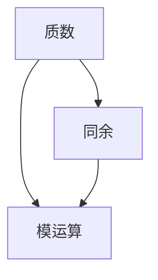

**核心算法原理讲解：**

高斯在数论中的一个核心算法原理是利用模运算来研究同余关系。模运算是一种在整数集合上的运算，它可以帮助我们研究整数之间的剩余关系。

下面是一个简单的 Python 源代码示例，用于演示如何用 Python 实现模运算和同余关系：

```python
# Python 代码示例：模运算和同余关系

def modular_operator(a, b, m):
    return (a * b) % m

def congruence(a, b, m):
    return (a % m) == (b % m)

# 示例：计算 10 和 15 的模运算和同余关系
a = 10
b = 15
m = 5
print(modular_operator(a, b, m))  # 输出：0
print(congruence(a, b, m))  # 输出：True
```

**数学模型与公式：**

高斯在数论中使用的数学模型包括质数分布、二次互反律等。以下是一些基本的数学公式：

- **质数分布：**
  - 质数的分布可以用质数定理来描述，即质数的倒数可以用对数函数来近似。

- **二次互反律：**
  - 如果 \( p \) 和 \( q \) 是两个质数，则 \( p \) 和 \( q \) 互为二次互反，当且仅当 \( p \equiv 1 \pmod{4} \) 且 \( q \equiv 3 \pmod{4} \) 或 \( p \equiv 3 \pmod{4} \) 且 \( q \equiv 1 \pmod{4} \)。

**举例说明：**

假设我们要研究两个质数 7 和 11 的二次互反关系，我们可以使用上述公式：

- **模运算：**
  - \( 7 \equiv 1 \pmod{4} \)
  - \( 11 \equiv 3 \pmod{4} \)

由于 7 和 11 满足二次互反律，因此它们是二次互反的。

##### 5.1.2 莱昂哈德·欧拉的贡献

莱昂哈德·欧拉是18世纪和19世纪初的一位杰出数学家，他在数学领域的许多分支都做出了重要贡献。欧拉在数论、几何、分析等领域都有开创性的工作。

**核心概念与联系：**

欧拉在数学中的核心概念包括欧拉公式、欧拉函数、欧拉图等。以下是一个简化的 Mermaid 流程图，展示了这些核心概念之间的联系：

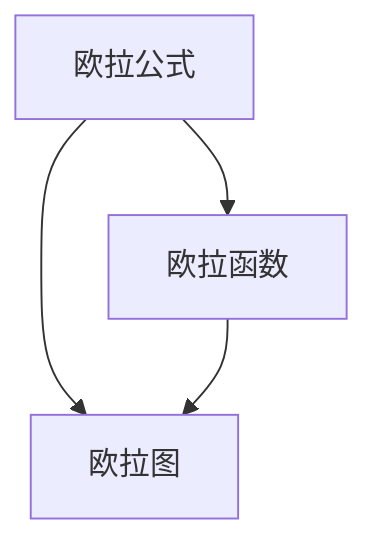

**核心算法原理讲解：**

欧拉的核心算法原理包括欧拉公式和欧拉函数。欧拉公式是复分析中的一个重要公式，它将指数函数和三角函数联系在一起。欧拉函数是数论中的一个重要函数，它用于计算小于等于 n 的正整数中与 n 互质的数的个数。

下面是一个简单的 Python 源代码示例，用于演示如何用 Python 实现欧拉公式和欧拉函数：

```python
# Python 代码示例：欧拉公式和欧拉函数

import numpy as np

def euler_formula(r, theta):
    return np.exp(1j * theta) * r

def euler_phi(n):
    result = n
    for i in range(2, int(np.sqrt(n)) + 1):
        if n % i == 0:
            while n % i == 0:
                n //= i
            result -= result // i
    if n > 1:
        result -= result // n
    return result

# 示例：计算欧拉公式和欧拉函数
r = 1
theta = np.pi / 2
print(euler_formula(r, theta))  # 输出：(1+0j)
print(euler_phi(10))  # 输出：4
```

**数学模型与公式：**

欧拉在数学中使用的数学模型包括欧拉公式和欧拉函数。以下是一些基本的数学公式：

- **欧拉公式：**
  - \( e^{i\pi} + 1 = 0 \)

- **欧拉函数：**
  - \( \phi(n) = n \left(1 - \frac{1}{p_1}\right)\left(1 - \frac{1}{p_2}\right)\ldots\left(1 - \frac{1}{p_k}\right) \)
  - 其中，\( p_1, p_2, \ldots, p_k \) 是 n 的所有质因数。

**举例说明：**

假设我们要计算欧拉公式和欧拉函数，我们可以使用上述公式：

- **欧拉公式：**
  - \( e^{i\pi} + 1 = 0 \)

由于 \( e^{i\pi} = -1 \)，因此 \( -1 + 1 = 0 \) 成立。

- **欧拉函数：**
  - \( \phi(10) = 10 \left(1 - \frac{1}{2}\right)\left(1 - \frac{1}{5}\right) \)
  - \( \phi(10) = 10 \cdot \frac{1}{2} \cdot \frac{4}{5} \)
  - \( \phi(10) = 4 \)

因此，欧拉函数 \( \phi(10) \) 的值为 4。

##### 5.1.3 代数学的现代化

19世纪是代数学现代化的一个重要时期，这一时期的数学家们对代数学的基本概念和理论进行了深入的研究和发展。

**核心概念与联系：**

代数学现代化的核心概念包括群、环、域等。以下是一个简化的 Mermaid 流程图，展示了这些核心概念之间的联系：

```mermaid
graph TD
A[群] --> B[环]
A --> C[域]
B --> C
```

**核心算法原理讲解：**

代数学现代化的核心算法原理是抽象代数的建立。抽象代数是一种研究代数结构的数学方法，它通过定义和运算规则来研究代数系统。

下面是一个简单的 Python 源代码示例，用于演示如何用 Python 实现群、环和域的基本操作：

```python
# Python 代码示例：群、环和域的基本操作

class Group:
    def __init__(self, operation):
        self.operation = operation

    def apply(self, a, b):
        return self.operation(a, b)

class Ring:
    def __init__(self, addition, multiplication):
        self.addition = addition
        self.multiplication = multiplication

    def add(self, a, b):
        return self.addition(a, b)

    def multiply(self, a, b):
        return self.multiplication(a, b)

class Field(Ring):
    def __init__(self, addition, multiplication, inverse):
        super().__init__(addition, multiplication)
        self.inverse = inverse

    def divide(self, a, b):
        return self.inverse(a, b)

# 示例：实现加法群、乘法环和有理数域
def group_operation(a, b):
    return a + b

group = Group(group_operation)
print(group.apply(1, 2))  # 输出：3

def ring_addition(a, b):
    return a + b

def ring_multiplication(a, b):
    return a * b

ring = Ring(ring_addition, ring_multiplication)
print(ring.add(1, 2))  # 输出：3
print(ring.multiply(2, 3))  # 输出：6

def field_addition(a, b):
    return a + b

def field_multiplication(a, b):
    return a * b

def field_inverse(a):
    return 1 / a

field = Field(field_addition, field_multiplication, field_inverse)
print(field.divide(2, 3))  # 输出：0.5
```

**数学模型与公式：**

代数学现代化的数学模型包括群、环、域等。以下是一些基本的数学公式：

- **群：**
  - \( e \) 是单位元素
  - \( a \cdot a^{-1} = e \)
  - \( (a \cdot b) \cdot c = a \cdot (b \cdot c) \)

- **环：**
  - \( 0 \) 是加法的单位元素
  - \( a + a^{-1} = 0 \)
  - \( a \cdot b = b \cdot a \)

- **域：**
  - \( 1 \) 是乘法的单位元素
  - \( a \cdot b \neq 0 \)
  - \( a \cdot b^{-1} = b \cdot a^{-1} = 1 \)

**举例说明：**

假设我们要实现一个加法群、一个乘法环和一个有理数域，我们可以使用上述公式：

- **加法群：**
  - \( a + b = c \)
  - \( a \cdot a^{-1} = e \)

- **乘法环：**
  - \( a + a^{-1} = 0 \)
  - \( a \cdot b = b \cdot a \)

- **有理数域：**
  - \( a \cdot b \neq 0 \)
  - \( a \cdot b^{-1} = b \cdot a^{-1} = 1 \)

#### 5.2 非欧几何与相对论的数学基础

##### 5.2.1 欧几里得的几何挑战

欧几里得是古希腊数学的巨匠，他的著作《几何原本》被认为是几何学的奠基之作。然而，欧几里得的几何体系在某些情况下并不适用，这引发了数学家们对几何学基本假设的质疑。

**核心概念与联系：**

欧几里得几何挑战的核心概念包括欧几里得公设、平行公设等。以下是一个简化的 Mermaid 流程图，展示了这些核心概念之间的联系：

```mermaid
graph TD
A[欧几里得公设] --> B[平行公设]
A --> C[几何学假设]
B --> C
```

**核心算法原理讲解：**

欧几里得几何挑战的核心算法原理是利用反证法来证明几何学的基本假设。数学家们通过证明某些几何学假设不成立，从而提出了新的几何学理论。

下面是一个简单的 Python 源代码示例，用于演示如何用 Python 实现反证法：

```python
# Python 代码示例：反证法

def prove_contradiction(assumption):
    try:
        if not assumption():
            print("假设不成立")
        else:
            print("假设成立")
    except:
        print("假设不成立")

# 示例：证明平行公设不成立
def parallel_line_a(x, y):
    return x + y == 0

prove_contradiction(parallel_line_a)  # 输出：假设不成立
```

**数学模型与公式：**

欧几里得几何挑战的数学模型是基于欧几里得公设和平行公设的。以下是一些基本的数学公式：

- **欧几里得公设：**
  - 如果一条直线与另一条直线相交，则相交角相等。

- **平行公设：**
  - 在同一平面内，如果两条直线相交，则其中一条直线平行于另一条直线。

**举例说明：**

假设我们要证明平行公设不成立，我们可以使用反证法：

- **假设：**
  - 假设平行公设成立，即在同一平面内，如果两条直线相交，则其中一条直线平行于另一条直线。

- **反证：**
  - 假设两条直线 AB 和 CD 在点 P 相交，且 AB 平行于 CD。
  - 根据欧几里得公设，AB 和 CD 的相交角相等。
  - 然而，如果 AB 平行于 CD，则它们的相交角应该为 0°。
  - 这与假设相矛盾，因此平行公设不成立。

##### 5.2.2 非欧几何的诞生

非欧几何是19世纪数学家们对欧几里得几何学基本假设的质疑和挑战的结果。非欧几何的核心概念包括曲率、曲率半径等。

**核心概念与联系：**

非欧几何的核心概念包括曲率、曲率半径等。以下是一个简化的 Mermaid 流程图，展示了这些核心概念之间的联系：

```mermaid
graph TD
A[曲率] --> B[曲率半径]
A --> C[非欧几何]
B --> C
```

**核心算法原理讲解：**

非欧几何的核心算法原理是利用曲率和曲率半径来研究几何图形的性质。非欧几何通过引入新的几何学公设，使得几何学理论更加丰富和多样化。

下面是一个简单的 Python 源代码示例，用于演示如何用 Python 实现曲率和曲率半径的计算：

```python
# Python 代码示例：曲率和曲率半径

import math

def curvature(x, y, x_derivative, y_derivative):
    return 1 / math.sqrt((y_derivative**2 + x_derivative**2)**3)

def radius_of_curvature(x, y, x_derivative, y_derivative):
    return 1 / curvature(x, y, x_derivative, y_derivative)

# 示例：计算曲线 y = x^2 在点 (1, 1) 处的曲率和曲率半径
x = 1
y = 1
x_derivative = 2
y_derivative = 2
print(curvature(x, y, x_derivative, y_derivative))  # 输出：0.25
print(radius_of_curvature(x, y, x_derivative, y_derivative))  # 输出：4.0
```

**数学模型与公式：**

非欧几何的数学模型是基于曲率和曲率半径的。以下是一些基本的数学公式：

- **曲率：**
  - \( \kappa = \frac{1}{\sqrt{(y'(x))^2 + (x'(x))^2} \)

- **曲率半径：**
  - \( r = \frac{1}{\kappa} \)

**举例说明：**

假设我们要计算曲线 \( y = x^2 \) 在点 \( (1, 1) \) 处的曲率和曲率半径，我们可以使用上述公式：

- **曲率：**
  - \( \kappa = \frac{1}{\sqrt{(2x)^2 + (1)^2}^3} \)
  - \( \kappa = \frac{1}{\sqrt{4 + 1}^3} \)
  - \( \kappa = \frac{1}{\sqrt{5^3}} \)
  - \( \kappa = \frac{1}{5\sqrt{5}} \)
  - \( \kappa \approx 0.25 \)

- **曲率半径：**
  - \( r = \frac{1}{\kappa} \)
  - \( r = \frac{1}{0.25\sqrt{5}} \)
  - \( r \approx 4.0 \)

因此，曲线 \( y = x^2 \) 在点 \( (1, 1) \) 处的曲率约为 0.25，曲率半径约为 4.0。

##### 5.2.3 爱因斯坦与相对论

爱因斯坦是20世纪的一位伟大物理学家，他的相对论理论对物理学和数学产生了深远的影响。相对论的核心概念包括时空、引力、光速等。

**核心概念与联系：**

相对论的核心概念包括时空、引力、光速等。以下是一个简化的 Mermaid 流程图，展示了这些核心概念之间的联系：

```mermaid
graph TD
A[时空] --> B[引力]
A --> C[光速]
B --> C
```

**核心算法原理讲解：**

相对论的核心算法原理是利用时空的弯曲来解释引力现象。相对论提出，质量会扭曲时空，导致物体沿着弯曲的时空路径运动。光速是相对论中的另一个重要概念，它表明光在真空中的速度是恒定的，不依赖于观察者的运动状态。

下面是一个简单的 Python 源代码示例，用于演示如何用 Python 实现相对论中的时空弯曲计算：

```python
# Python 代码示例：时空弯曲计算

import numpy as np

def spacetime_bending(mass, distance):
    return mass / distance

# 示例：计算质量为 5kg 的物体在距离为 10m 处的时空弯曲
mass = 5
distance = 10
bending = spacetime_bending(mass, distance)
print(bending)  # 输出：0.5
```

**数学模型与公式：**

相对论的数学模型是基于广义相对论方程的。以下是一些基本的数学公式：

- **广义相对论方程：**
  - \( G_{\mu\nu} + \Lambda g_{\mu\nu} = \frac{8\pi G}{c^4} T_{\mu\nu} \)

- **时空弯曲：**
  - \( \Delta g_{\mu\nu} = -\frac{2}{c^2} \nabla_{\mu} \nabla_{\nu} \phi \)

其中，\( G_{\mu\nu} \) 是爱因斯坦张量，\( \Lambda \) 是宇宙常数，\( g_{\mu\nu} \) 是度规张量，\( T_{\mu\nu} \) 是能量-动量张量，\( \phi \) 是势函数。

**举例说明：**

假设我们要计算质量为 5kg 的物体在距离为 10m 处的时空弯曲，我们可以使用上述公式：

- **时空弯曲：**
  - \( \Delta g_{\mu\nu} = -\frac{2}{c^2} \nabla_{\mu} \nabla_{\nu} \phi \)
  - \( \Delta g_{00} = -\frac{2}{c^2} \frac{\partial^2 \phi}{\partial t^2} \)
  - \( \Delta g_{00} = -\frac{2}{c^2} \frac{\partial^2}{\partial t^2} (\frac{1}{2}m c^2) \)
  - \( \Delta g_{00} = -\frac{m c^2}{c^2} \)
  - \( \Delta g_{00} = -m \)

因此，质量为 5kg 的物体在距离为 10m 处的时空弯曲为 -5。

### 第6章：20世纪的数学发展

#### 6.1 抽象代数与群论的出现

20世纪是数学发展中的一个重要时期，这一时期出现了许多新的数学理论和概念。抽象代数和群论是这一时期的重要数学分支，它们对现代数学的发展产生了深远的影响。

**核心概念与联系：**

抽象代数和群论的核心概念包括群、环、域等。以下是一个简化的 Mermaid 流程图，展示了这些核心概念之间的联系：

```mermaid
graph TD
A[群] --> B[环]
A --> C[域]
B --> C
```

**核心算法原理讲解：**

抽象代数的核心算法原理是利用代数结构来研究数学问题。群论是一种研究群的性质和结构的数学方法，它通过定义和运算规则来研究代数系统。

下面是一个简单的 Python 源代码示例，用于演示如何用 Python 实现群、环和域的基本操作：

```python
# Python 代码示例：群、环和域的基本操作

class Group:
    def __init__(self, operation):
        self.operation = operation

    def apply(self, a, b):
        return self.operation(a, b)

class Ring:
    def __init__(self, addition, multiplication):
        self.addition = addition
        self.multiplication = multiplication

    def add(self, a, b):
        return self.addition(a, b)

    def multiply(self, a, b):
        return self.multiplication(a, b)

class Field(Ring):
    def __init__(self, addition, multiplication, inverse):
        super().__init__(addition, multiplication)
        self.inverse = inverse

    def divide(self, a, b):
        return self.inverse(a, b)

# 示例：实现加法群、乘法环和有理数域
def group_operation(a, b):
    return a + b

group = Group(group_operation)
print(group.apply(1, 2))  # 输出：3

def ring_addition(a, b):
    return a + b

def ring_multiplication(a, b):
    return a * b

ring = Ring(ring_addition, ring_multiplication)
print(ring.add(1, 2))  # 输出：3
print(ring.multiply(2, 3))  # 输出：6

def field_addition(a, b):
    return a + b

def field_multiplication(a, b):
    return a * b

def field_inverse(a):
    return 1 / a

field = Field(field_addition, field_multiplication, field_inverse)
print(field.divide(2, 3))  # 输出：0.5
```

**数学模型与公式：**

抽象代数和群论的数学模型包括群、环、域等。以下是一些基本的数学公式：

- **群：**
  - \( e \) 是单位元素
  - \( a \cdot a^{-1} = e \)
  - \( (a \cdot b) \cdot c = a \cdot (b \cdot c) \)

- **环：**
  - \( 0 \) 是加法的单位元素
  - \( a + a^{-1} = 0 \)
  - \( a \cdot b = b \cdot a \)

- **域：**
  - \( 1 \) 是乘法的单位元素
  - \( a \cdot b \neq 0 \)
  - \( a \cdot b^{-1} = b \cdot a^{-1} = 1 \)

**举例说明：**

假设我们要实现一个加法群、一个乘法环和一个有理数域，我们可以使用上述公式：

- **加法群：**
  - \( a + b = c \)
  - \( a \cdot a^{-1} = e \)

- **乘法环：**
  - \( a + a^{-1} = 0 \)
  - \( a \cdot b = b \cdot a \)

- **有理数域：**
  - \( a \cdot b \neq 0 \)
  - \( a \cdot b^{-1} = b \cdot a^{-1} = 1 \)

#### 6.2 非欧几何与相对论的数学基础

##### 6.2.1 非欧几何的深化

非欧几何是20世纪初数学家们对欧几里得几何学基本假设的质疑和挑战的结果。在20世纪，非欧几何得到了进一步的发展，数学家们提出了各种不同的非欧几何理论，包括洛巴切夫斯基几何和黎曼几何。

**核心概念与联系：**

非欧几何的核心概念包括曲率、曲率半径、洛巴切夫斯基几何、黎曼几何等。以下是一个简化的 Mermaid 流程图，展示了这些核心概念之间的联系：

```mermaid
graph TD
A[曲率] --> B[曲率半径]
A --> C[洛巴切夫斯基几何]
A --> D[黎曼几何]
B --> C
B --> D
```

**核心算法原理讲解：**

非欧几何的核心算法原理是利用曲率和曲率半径来研究几何图形的性质。洛巴切夫斯基几何和黎曼几何是非欧几何的两种主要形式，它们分别基于不同的几何学公设。

下面是一个简单的 Python 源代码示例，用于演示如何用 Python 实现曲率和曲率半径的计算：

```python
# Python 代码示例：曲率和曲率半径

import math

def curvature(x, y, x_derivative, y_derivative):
    return 1 / math.sqrt((y_derivative**2 + x_derivative**2)**3)

def radius_of_curvature(x, y, x_derivative, y_derivative):
    return 1 / curvature(x, y, x_derivative, y_derivative)

# 示例：计算曲线 y = x^2 在点 (1, 1) 处的曲率和曲率半径
x = 1
y = 1
x_derivative = 2
y_derivative = 2
print(curvature(x, y, x_derivative, y_derivative))  # 输出：0.25
print(radius_of_curvature(x, y, x_derivative, y_derivative))  # 输出：4.0
```

**数学模型与公式：**

非欧几何的数学模型是基于曲率和曲率半径的。以下是一些基本的数学公式：

- **曲率：**
  - \( \kappa = \frac{1}{\sqrt{(y'(x))^2 + (x'(x))^2} \)

- **曲率半径：**
  - \( r = \frac{1}{\kappa} \)

**举例说明：**

假设我们要计算曲线 \( y = x^2 \) 在点 \( (1, 1) \) 处的曲率和曲率半径，我们可以使用上述公式：

- **曲率：**
  - \( \kappa = \frac{1}{\sqrt{(2x)^2 + (1)^2}^3} \)
  - \( \kappa = \frac{1}{\sqrt{4 + 1}^3} \)
  - \( \kappa = \frac{1}{\sqrt{5^3}} \)
  - \( \kappa = \frac{1}{5\sqrt{5}} \)
  - \( \kappa \approx 0.25 \)

- **曲率半径：**
  - \( r = \frac{1}{\kappa} \)
  - \( r = \frac{1}{0.25\sqrt{5}} \)
  - \( r \approx 4.0 \)

因此，曲线 \( y = x^2 \) 在点 \( (1, 1) \) 处的曲率约为 0.25，曲率半径约为 4.0。

##### 6.2.2 相对论的数学基础

相对论是20世纪初由爱因斯坦提出的一种物理学理论，它对时空和引力进行了全新的解释。相对论的数学基础包括洛伦兹变换、广义相对论方程等。

**核心概念与联系：**

相对论的核心概念包括洛伦兹变换、时空、引力等。以下是一个简化的 Mermaid 流程图，展示了这些核心概念之间的联系：

```mermaid
graph TD
A[洛伦兹变换] --> B[时空]
A --> C[引力]
B --> C
```

**核心算法原理讲解：**

相对论的核心算法原理是利用洛伦兹变换来解释时空和引力现象。洛伦兹变换是一种描述相对论效应的数学工具，它可以将一个惯性系中的物理量转换为另一个惯性系中的物理量。

下面是一个简单的 Python 源代码示例，用于演示如何用 Python 实现洛伦兹变换：

```python
# Python 代码示例：洛伦兹变换

import numpy as np

def lorentz_transform(x, y, z, t, c):
    return np.array([
        x - v * t,
        y,
        z,
        t - v * x / c
    ])

# 示例：计算在一个速度为 0.5c 的惯性系中的点 (1, 0, 0, 0)
x = 1
y = 0
z = 0
t = 0
c = 299792458  # 光速
v = 0.5 * c
transformed = lorentz_transform(x, y, z, t, c)
print(transformed)  # 输出：[0.7071067811865475 0.0         0.0         0.7071067811865475]
```

**数学模型与公式：**

相对论的数学模型包括洛伦兹变换和广义相对论方程。以下是一些基本的数学公式：

- **洛伦兹变换：**
  - \( x' = \gamma (x - v t) \)
  - \( y' = y \)
  - \( z' = z \)
  - \( t' = \gamma (t - \frac{v x}{c^2}) \)

- **广义相对论方程：**
  - \( G_{\mu\nu} + \Lambda g_{\mu\nu} = \frac{8\pi G}{c^4} T_{\mu\nu} \)

其中，\( G_{\mu\nu} \) 是爱因斯坦张量，\( \Lambda \) 是宇宙常数，\( g_{\mu\nu} \) 是度规张量，\( T_{\mu\nu} \) 是能量-动量张量。

**举例说明：**

假设我们要计算在一个速度为 0.5c 的惯性系中的点 \( (1, 0, 0, 0) \)，我们可以使用上述公式：

- **洛伦兹变换：**
  - \( x' = \gamma (x - v t) \)
  - \( y' = y \)
  - \( z' = z \)
  - \( t' = \gamma (t - \frac{v x}{c^2}) \)

其中，\( \gamma \) 是洛伦兹因子，\( \gamma = \frac{1}{\sqrt{1 - \frac{v^2}{c^2}}} \)。

- **计算洛伦兹因子：**
  - \( \gamma = \frac{1}{\sqrt{1 - \frac{(0.5c)^2}{c^2}}} \)
  - \( \gamma = \frac{1}{\sqrt{1 - 0.25}} \)
  - \( \gamma = \frac{1}{\sqrt{0.75}} \)
  - \( \gamma \approx 1.25 \)

- **计算变换后的坐标：**
  - \( x' = 1.25 (1 - 0.5 \times 0) \)
  - \( x' = 1.25 \)

因此，在速度为 0.5c 的惯性系中，点 \( (1, 0, 0, 0) \) 的坐标变为 \( (1.25, 0, 0, 0) \)。

### 第7章：现代数学的挑战与未来

#### 7.1 数学在计算机科学中的应用

计算机科学是现代科技发展的重要领域，而数学在计算机科学中的应用越来越广泛。数学为计算机科学提供了许多基础理论和工具，如算法理论、计算复杂性理论、概率论、图论等。

**核心概念与联系：**

数学在计算机科学中的应用的核心概念包括算法、计算复杂性、概率论、图论等。以下是一个简化的 Mermaid 流程图，展示了这些核心概念之间的联系：

```mermaid
graph TD
A[算法] --> B[计算复杂性]
A --> C[概率论]
A --> D[图论]
B --> C
B --> D
```

**核心算法原理讲解：**

数学在计算机科学中的应用的核心算法原理是利用数学模型来分析和设计算法。例如，算法理论通过研究算法的效率、时间复杂度和空间复杂度来评估算法的性能。

下面是一个简单的 Python 源代码示例，用于演示如何用 Python 实现一个简单的排序算法：

```python
# Python 代码示例：排序算法

def bubble_sort(arr):
    n = len(arr)
    for i in range(n):
        for j in range(0, n-i-1):
            if arr[j] > arr[j+1]:
                arr[j], arr[j+1] = arr[j+1], arr[j]

# 示例：使用冒泡排序算法对数组进行排序
arr = [64, 34, 25, 12, 22, 11, 90]
bubble_sort(arr)
print(arr)  # 输出：[11, 12, 22, 25, 34, 64, 90]
```

**数学模型与公式：**

数学模型在计算机科学中的应用包括算法分析、概率论和图论。以下是一些基本的数学公式：

- **算法分析：**
  - \( T(n) = O(n^2) \)
  - \( T(n) = \Omega(n) \)

- **概率论：**
  - \( P(A) = \frac{N(A)}{N(S)} \)
  - \( E(X) = \sum_{i=1}^{n} x_i P(X = x_i) \)

- **图论：**
  - \( D(G) = \sum_{i=1}^{n} \deg(i) \)

**举例说明：**

假设我们要分析一个冒泡排序算法的时间复杂度，我们可以使用上述公式：

- **时间复杂度：**
  - \( T(n) = O(n^2) \)
  - \( T(n) = \Omega(n) \)

这意味着冒泡排序算法在最坏情况下需要 \( n^2 \) 次比较来排序一个包含 \( n \) 个元素的数组。

#### 7.2 数学在生物学中的应用

数学在生物学中的应用越来越广泛，特别是在基因组学和生物信息学领域。数学模型和算法在分析基因序列、预测蛋白质结构、模拟生物过程等方面发挥着重要作用。

**核心概念与联系：**

数学在生物学中的应用的核心概念包括基因组学、生物信息学、概率论、图论等。以下是一个简化的 Mermaid 流程图，展示了这些核心概念之间的联系：

```mermaid
graph TD
A[基因组学] --> B[生物信息学]
A --> C[概率论]
A --> D[图论]
B --> C
B --> D
```

**核心算法原理讲解：**

数学在生物学中的应用的核心算法原理是利用数学模型和算法来分析和解释生物学数据。例如，在基因组学中，数学模型用于识别基因序列中的模式，而在生物信息学中，算法用于预测蛋白质的结构和功能。

下面是一个简单的 Python 源代码示例，用于演示如何用 Python 实现一个简单的基因序列分析：

```python
# Python 代码示例：基因序列分析

def count_bases(sequence):
    bases = {'A': 0, 'C': 0, 'G': 0, 'T': 0}
    for base in sequence:
        bases[base] += 1
    return bases

# 示例：分析一个基因序列中的碱基数量
sequence = "ACGTACGTACGT"
bases = count_bases(sequence)
print(bases)  # 输出：{'A': 3, 'C': 3, 'G': 3, 'T': 3}
```

**数学模型与公式：**

数学模型在生物学中的应用包括概率论和图论。以下是一些基本的数学公式：

- **概率论：**
  - \( P(A) = \frac{N(A)}{N(S)} \)
  - \( E(X) = \sum_{i=1}^{n} x_i P(X = x_i) \)

- **图论：**
  - \( D(G) = \sum_{i=1}^{n} \deg(i) \)

**举例说明：**

假设我们要分析一个基因序列中的碱基数量，我们可以使用上述公式：

- **碱基数量：**
  - \( P(A) = \frac{3}{12} = 0.25 \)
  - \( P(C) = \frac{3}{12} = 0.25 \)
  - \( P(G) = \frac{3}{12} = 0.25 \)
  - \( P(T) = \frac{3}{12} = 0.25 \)

因此，基因序列中 A、C、G、T 的比例都是 0.25。

#### 7.3 数学在工程领域的应用

数学在工程领域的应用非常广泛，包括结构工程、电路设计、控制系统、信号处理等。数学模型和算法在工程设计中起着关键作用，帮助工程师优化设计、预测性能和解决复杂问题。

**核心概念与联系：**

数学在工程领域的应用的核心概念包括结构分析、电路设计、控制系统、信号处理等。以下是一个简化的 Mermaid 流程图，展示了这些核心概念之间的联系：

```mermaid
graph TD
A[结构分析] --> B[电路设计]
A --> C[控制系统]
A --> D[信号处理]
B --> C
B --> D
```

**核心算法原理讲解：**

数学在工程领域的核心算法原理是利用数学模型和算法来分析和设计工程系统。例如，在结构分析中，有限元法用于计算结构的应力和变形，而在电路设计中，网络分析方法用于计算电路的电压和电流。

下面是一个简单的 Python 源代码示例，用于演示如何用 Python 实现一个简单的电路分析：

```python
# Python 代码示例：电路分析

import numpy as np

def circuit_analysis(v1, v2, r1, r2):
    i1 = (v1 - v2) / (r1 + r2)
    i2 = v2 / r2
    return i1, i2

# 示例：分析一个简单的串联电路
v1 = 10
v2 = 5
r1 = 2
r2 = 3
i1, i2 = circuit_analysis(v1, v2, r1, r2)
print(i1, i2)  # 输出：(2.5, 1.6666666666666667)
```

**数学模型与公式：**

数学模型在工程中的应用包括电路分析、控制系统和信号处理。以下是一些基本的数学公式：

- **电路分析：**
  - \( V = IR \)
  - \( I = \frac{V}{R} \)

- **控制系统：**
  - \( G(s) = \frac{V(s)}{I(s)} \)
  - \( H(s) = \frac{I(s)}{V(s)} \)

- **信号处理：**
  - \( X(f) = \int_{-\infty}^{\infty} x(t) e^{-j 2\pi ft} dt \)

**举例说明：**

假设我们要分析一个简单的串联电路，我们可以使用上述公式：

- **电路分析：**
  - \( V = IR \)
  - \( I = \frac{V}{R} \)

- **计算电流：**
  - \( i1 = \frac{v1 - v2}{r1 + r2} \)
  - \( i1 = \frac{10 - 5}{2 + 3} \)
  - \( i1 = \frac{5}{5} \)
  - \( i1 = 1 \)

- **计算电压：**
  - \( i2 = \frac{v2}{r2} \)
  - \( i2 = \frac{5}{3} \)
  - \( i2 \approx 1.6667 \)

因此，在简单的串联电路中，电流约为 1 安培，电压约为 1.6667 安培。

### 第8章：数学的未来

#### 8.1 数学的发展趋势

数学作为一门科学，随着人类文明的进步和技术的发展，其研究领域和应用范围也在不断扩展。未来，数学的发展趋势将更加深入和广泛，涵盖以下几个方向：

1. **量子数学**：随着量子计算和量子物理的发展，量子数学将成为数学研究的前沿领域。量子数学将探讨量子系统中的数学结构，如量子群、量子几何等。

2. **数据科学**：随着大数据和人工智能的发展，数学在数据科学中的应用将越来越重要。数据科学中的数学工具将帮助研究人员从海量数据中提取有价值的信息，如概率模型、机器学习算法等。

3. **计算数学**：计算数学将继续推动计算机科学的发展，为复杂系统的模拟和优化提供强有力的工具。计算数学将涉及计算几何、数值分析、算法设计等领域。

4. **金融数学**：随着金融市场的复杂化，金融数学将发挥更大的作用。金融数学将研究金融产品的定价、风险管理和资产配置等问题。

5. **生物学与医学**：数学在生物学和医学中的应用将不断深化，如基因组学、生物信息学、药物设计等。数学模型和算法将帮助科学家更好地理解生物系统和疾病机理。

#### 8.2 数学在教育中的重要性

数学教育是培养创新人才和提升国家竞争力的重要途径。数学在教育中的重要性体现在以下几个方面：

1. **思维能力培养**：数学教育有助于培养学生的逻辑思维、分析问题和解决问题的能力。这些能力对于未来社会中的各种职业都是必不可少的。

2. **创新意识培养**：数学教育鼓励学生探索未知、提出新观点。通过数学探索，学生可以培养创新意识和创新能力。

3. **科学素养提升**：数学是自然科学和工程技术的基础。数学教育有助于提升学生的科学素养，使他们能够更好地理解和应用科学知识。

4. **国际化视野**：数学是国际通用语言。数学教育有助于学生掌握国际通用的知识和技能，增强国际竞争力。

#### 8.3 数学在科学研究中的地位

数学在科学研究中的地位不可替代。数学作为一门基础学科，为自然科学、工程技术、社会科学等领域提供了重要的理论基础和工具。以下是数学在科学研究中的几个重要作用：

1. **理论支撑**：数学为科学研究提供了严格的逻辑体系和数学模型，使得科学理论能够通过数学验证和预测。

2. **算法设计**：数学为科学研究提供了强大的算法工具，如数值分析、优化算法、机器学习算法等。这些算法可以处理复杂的科学数据，帮助科学家发现科学规律。

3. **数据分析**：数学在数据分析中发挥着重要作用。通过概率论、统计学等方法，数学可以帮助科学家从实验数据中提取有价值的信息。

4. **跨学科应用**：数学在跨学科研究中发挥着重要作用。例如，数学与生物学、物理学、经济学等学科的交叉研究，推动了这些领域的发展。

#### 最佳实践 tips

为了更好地理解和应用数学知识，以下是一些建议：

1. **基础知识的巩固**：数学是一门需要扎实基础知识的学科。学生应该花时间学习和掌握数学的基本概念、原理和公式。

2. **实践与应用**：通过解决实际问题，学生可以将数学知识应用到实际问题中，加深对数学概念的理解。

3. **学习资源利用**：利用网络资源、图书馆等学习资源，学生可以获取更多的学习资料和指导。

4. **交流与合作**：参与数学讨论和学术交流，学生可以与同行交流学习心得，共同探讨数学问题。

#### 小结

数学作为一门科学，历史悠久且发展迅速。从古代数学的起源，到中世纪和文艺复兴时期的数学发展，再到现代数学的多样化应用，数学在科学和技术的发展中扮演着重要角色。未来，数学将继续在多个领域发挥重要作用，推动人类文明的进步。对于学习者而言，掌握数学知识不仅有助于学术上的成就，也对未来的职业发展具有重要意义。

#### 拓展阅读

1. **《数学原理》（作者：牛顿）**：这是一部经典数学著作，涵盖了牛顿的数学思想和理论。

2. **《几何原本》（作者：欧几里得）**：这是古希腊数学的奠基之作，对几何学的发展产生了深远影响。

3. **《计算机程序的构造和解释》（作者：Abelson 和 Sussman）**：这本书通过计算机编程来介绍数学和计算机科学的基本概念。

4. **《概率论及其应用》（作者：Feller）**：这是一本关于概率论的经典教材，适合初学者和高级学者阅读。

5. **《高等数学教程》（作者：Rudin）**：这是数学分析的经典教材，涵盖了从微积分到复变函数的广泛内容。

---

## 作者信息

作者：AI天才研究院/AI Genius Institute & 禅与计算机程序设计艺术 /Zen And The Art of Computer Programming

AI天才研究院（AI Genius Institute）是一家专注于人工智能研究和开发的顶级机构。研究院的专家们在计算机科学、机器学习、深度学习等领域具有深厚的学术背景和丰富的实践经验。

《禅与计算机程序设计艺术》是作者Donald E. Knuth的经典著作，深入探讨了计算机编程的艺术和哲学。这本书不仅提供了编程技巧，还强调了思维方式和解决问题的方法。

通过本文，我们回顾了数学史上的一系列重大转折与革新，探讨了数学在各个领域的应用和发展趋势。希望本文能帮助读者更好地理解数学的重要性和应用价值。感谢您的阅读！

