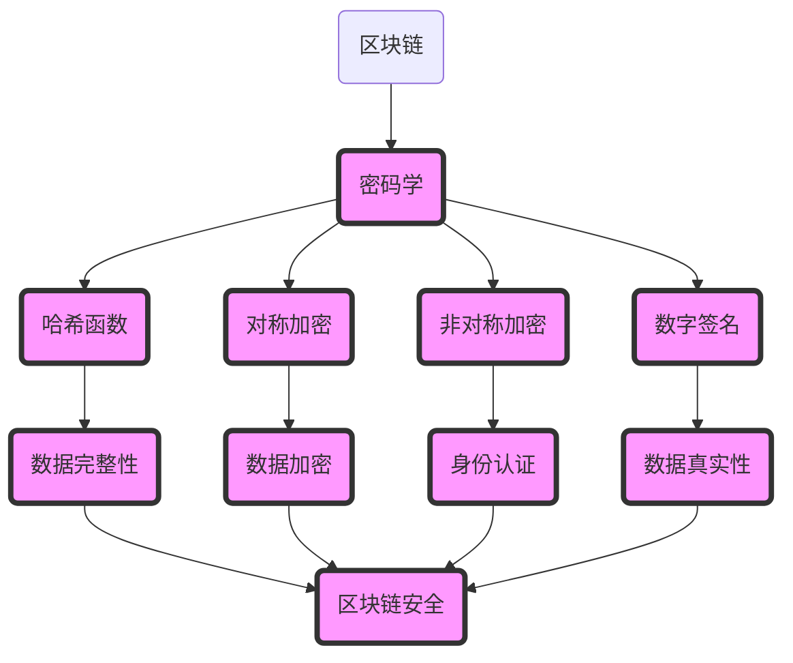

                 

### 文章标题

本文的标题是《数学在区块链技术中的密码学应用》。这个标题简洁明了地概括了文章的核心内容，即探讨数学理论，尤其是密码学，如何在区块链技术中发挥重要作用。文章的目标读者是那些对区块链技术有一定了解，但希望深入了解其背后数学原理的读者。

### 文章关键词

关键词：区块链、密码学、哈希函数、加密算法、数字签名、非对称加密、对称加密、智能合约。

这些关键词不仅精准地反映了文章的主题，而且有助于搜索引擎优化（SEO），使文章更容易被目标读者找到。每个关键词都与区块链技术的核心组成部分紧密相关，构成了文章的主要内容。

### 文章摘要

区块链技术是一种分布式数据库技术，它通过密码学确保数据的安全性和不可篡改性。本文将深入探讨数学在区块链技术中的密码学应用，包括哈希函数、加密算法和数字签名的原理及其在区块链中的具体实现。我们将通过实际案例和Python源代码示例，展示如何利用数学工具解决区块链技术中的实际问题。通过阅读本文，读者将更好地理解数学在区块链技术中的重要性，并能够掌握相关的密码学知识。

### 第1章：区块链技术概述

#### 1.1 区块链的起源与发展

区块链（Blockchain）是一种分布式账本技术，最早由中本聪（Satoshi Nakamoto）在2008年提出，并在2009年发布了第一个区块链项目——比特币（Bitcoin）。区块链的核心思想是通过去中心化的方式，实现一个不可篡改的分布式账本，从而解决传统中心化系统中存在的中介问题和不信任问题。

区块链的发展经历了几个重要阶段：

- **2009-2013年：早期探索**。这一时期，比特币逐渐被接受，区块链技术的概念开始引起广泛关注。许多研究者开始探索区块链技术的更多应用场景。

- **2014-2016年：应用扩展**。随着比特币的成功，越来越多的项目开始采用区块链技术，包括以太坊（Ethereum）等智能合约平台。

- **2017-2019年：高潮与泡沫**。区块链技术在2017年达到了一个高潮，许多加密货币和区块链项目涌现。然而，随之而来的也是市场的泡沫和监管的挑战。

- **2020年至今：理性回归与应用落地**。区块链技术逐渐从炒作回归理性，更多的应用开始落地，包括供应链管理、数字身份认证、金融科技等领域。

#### 1.2 区块链的基本概念

区块链由多个“区块”组成，每个区块包含一系列的交易数据。区块通过加密技术链接在一起，形成一条不断延伸的链。区块链的主要概念包括：

- **区块（Block）**：区块是区块链的基本单位，包含一定数量的交易数据。每个区块都有一个时间戳，用于记录数据添加到区块链的时间。

- **链（Chain）**：链是由一系列区块按时间顺序连接而成的数据结构。链的不可篡改性是区块链的核心特点。

- **分布式账本**：区块链通过分布式节点网络维护一个共享的账本，每个节点都存储一份完整的账本副本。

- **加密技术**：区块链使用加密技术确保数据的安全性和不可篡改性。常用的加密技术包括哈希函数、非对称加密和数字签名。

#### 1.3 区块链与密码学的关系

密码学在区块链技术中扮演着至关重要的角色。区块链的安全依赖于以下几种密码学技术的应用：

- **哈希函数**：哈希函数用于确保区块链中数据的完整性和不可篡改性。例如，比特币区块的每个新区块都包含了前一个区块的哈希值，形成了一种“链式”结构，确保了区块的顺序和一致性。

- **非对称加密**：非对称加密用于实现区块链中的身份认证和数据加密。例如，比特币中的地址实际上是一个公钥，而私钥用于签名和交易验证。

- **数字签名**：数字签名用于验证交易数据的真实性和完整性。交易发送方使用私钥对交易数据进行签名，接收方则使用对应的公钥验证签名。

- **加密算法**：加密算法用于保护区块链中的敏感数据，防止未授权访问。例如，以太坊智能合约中的数据传输和存储通常使用加密算法进行保护。

总之，密码学是区块链技术的基础，它确保了区块链的安全、可靠性和透明性。没有密码学的支持，区块链技术无法实现其核心目标。

### 第2章：密码学基础

#### 2.1 密码学的基本概念

密码学是研究信息加密与解密的一门科学。它的主要目的是通过加密技术保护信息的机密性、完整性和真实性。密码学的基本概念包括：

- **加密（Encryption）**：加密是将明文转换为密文的过程。加密算法使用密钥将明文映射到密文，只有拥有正确密钥的人才能将密文解密回明文。

- **解密（Decryption）**：解密是将密文转换为明文的过程。解密算法使用与加密相同的密钥将密文映射回明文。

- **密钥（Key）**：密钥是加密和解密过程中使用的关键参数。密钥的生成、存储和分发是密码学中至关重要的问题。

- **加密算法（Cipher）**：加密算法是用于加密和解密的数学函数。常见的加密算法包括对称加密算法和非对称加密算法。

- **加密模式（Cipher Mode）**：加密模式是在加密过程中对数据块进行处理的方法。常见的加密模式包括电子码本模式（ECB）、密码分组链接模式（CBC）和密码反馈模式（CFB）等。

#### 2.2 哈希函数

哈希函数是一种将任意长度的输入数据映射为固定长度的输出数据的函数。哈希函数在密码学中具有广泛的应用，其基本特性包括：

- **单向性（One-way Function）**：哈希函数是单向的，即给定输出值，无法反推出输入值。这意味着哈希函数在加密和解密过程中不会泄露任何信息。

- **抗碰撞性（Collision Resistance）**：哈希函数应具有抗碰撞性，即很难找到两个不同的输入值，它们的哈希值相同。这保证了哈希函数的不可篡改性。

- **抗弱碰撞性（Second Preimage Resistance）**：对于给定的输入值，找到一个不同的输入值，使其哈希值相同是困难的。

常见的哈希函数包括SHA系列（如SHA-256、SHA-3）和BLAKE2系列等。这些哈希函数被广泛用于区块链技术中，确保数据的完整性和一致性。

#### 2.3 对称加密

对称加密是一种加密算法，它使用相同的密钥进行加密和解密。对称加密的优点是速度快、效率高，但其缺点是密钥的分发和管理复杂。常见的对称加密算法包括AES（高级加密标准）、DES（数据加密标准）和3DES等。

- **AES（Advanced Encryption Standard）**：AES是一种广泛使用的对称加密算法，其密钥长度可以是128位、192位或256位，提供不同的安全级别。

- **DES（Data Encryption Standard）**：DES是一种较早的对称加密算法，其密钥长度为56位。由于密钥长度较短，DES已经逐渐被AES所取代。

- **3DES（Triple DES）**：3DES是DES的扩展版本，它使用三个DES密钥对数据进行三次加密，提供更高的安全性。

对称加密在区块链技术中的应用主要包括保护交易数据和加密通信通道。例如，比特币中的交易数据就是通过AES算法进行加密的。

#### 2.4 非对称加密

非对称加密是一种使用两个不同密钥进行加密和解密的加密算法。非对称加密的优点是密钥的分发和管理相对简单，但其缺点是加密和解密速度较慢。常见的非对称加密算法包括RSA、ECC（椭圆曲线密码学）等。

- **RSA（Rivest-Shamir-Adleman）**：RSA是一种广泛使用的非对称加密算法，其安全性依赖于大素数的因子分解难题。

- **ECC（Elliptic Curve Cryptography）**：ECC是一种基于椭圆曲线离散对数问题的非对称加密算法，其安全性较高，但计算量相对较小。

非对称加密在区块链技术中的应用主要包括身份认证、数字签名和密钥交换。例如，比特币中的地址实际上就是一个公钥，而私钥用于签名和交易验证。

#### 2.5 数字签名

数字签名是一种用于验证数据真实性和完整性的技术。数字签名利用非对称加密算法实现，其基本原理如下：

- **签名（Signing）**：数据发送方使用自己的私钥对数据进行签名，生成一个签名值。

- **验证（Verification）**：数据接收方使用发送方的公钥对签名值进行验证，以确认数据的真实性和完整性。

常见的数字签名算法包括RSA签名、ECDSA（椭圆曲线数字签名算法）等。

数字签名在区块链技术中的应用非常广泛，例如，比特币中的交易签名、智能合约的执行验证等。数字签名确保了区块链中数据的真实性和不可篡改性。

### 2.6 密码学的基本术语

在深入探讨密码学在区块链中的应用之前，了解一些基本的密码学术语是非常重要的。以下是几个常见的术语：

- **加密（Encryption）**：将明文转换为密文的过程。
- **解密（Decryption）**：将密文转换为明文的过程。
- **密钥（Key）**：加密和解密过程中使用的参数。
- **加密算法（Cipher）**：用于加密和解密的数学函数。
- **哈希函数（Hash Function）**：将输入数据映射为固定长度输出的函数。
- **数字签名（Digital Signature）**：用于验证数据真实性和完整性的签名值。
- **加密模式（Cipher Mode）**：加密过程中对数据块进行处理的方法。

通过掌握这些基本术语，读者将能够更好地理解密码学在区块链技术中的具体应用。

### 密码学在区块链中的核心概念原理联系架构

为了更好地理解密码学在区块链中的核心概念原理之间的联系，我们可以使用Mermaid流程图来展示这些概念的关系架构。以下是密码学在区块链中的一些核心概念及其相互关系的Mermaid流程图：



在这个流程图中，A表示区块链，B表示密码学，C表示哈希函数，D表示对称加密，E表示非对称加密，F表示数字签名。这些密码学技术通过不同的方式为区块链提供了安全性保障，包括数据完整性（G）、数据加密（H）、身份认证（I）和数据真实性（J）。这些安全性保障最终共同构成了区块链的安全基础（K）。

#### 核心算法原理讲解：哈希函数

哈希函数是密码学中的一种重要工具，它在区块链技术中扮演着关键角色。哈希函数的基本原理是将任意长度的输入数据映射为固定长度的输出数据，这个输出数据称为哈希值。哈希函数具有以下特性：

1. **单向性**：哈希函数是单向的，即给定一个输入值，可以快速计算出其对应的哈希值，但反过来，给定一个哈希值，无法反推出原始输入值。这一特性确保了数据的隐私性和不可逆性。

2. **抗碰撞性**：哈希函数应具有抗碰撞性，即很难找到两个不同的输入值，它们的哈希值相同。这一特性确保了数据的唯一性和一致性。

3. **固定长度输出**：无论输入数据的长度如何，哈希函数的输出长度是固定的。例如，SHA-256的输出长度是256位。

在区块链技术中，哈希函数主要用于以下几个关键场景：

1. **数据完整性验证**：每个区块都包含了一个前一个区块的哈希值，这个哈希值被称为“Merkle根哈希”或“Merkle树根哈希”。通过验证当前区块的哈希值与前一个区块的哈希值的一致性，可以确保区块链中数据的完整性。

2. **区块链链接**：新产生的区块通过其包含的前一个区块的哈希值与前一个区块链接起来，形成一条连续的区块链。这种链接方式确保了区块链的不可篡改性。

3. **密码学签名**：在比特币等区块链系统中，用户的交易数据需要通过私钥进行签名。签名算法通常依赖于哈希函数，以确保签名数据的唯一性和不可伪造性。

以下是使用Python实现SHA-256哈希函数的示例代码：

```python
import hashlib

def sha256_hash(data):
    hash_object = hashlib.sha256(data.encode())
    hex_dig = hash_object.hexdigest()
    return hex_dig

# 示例：计算字符串“Hello, World!”的SHA-256哈希值
data = "Hello, World!"
hash_value = sha256_hash(data)
print(f"SHA-256 Hash of '{data}': {hash_value}")
```

通过运行上述代码，我们可以得到字符串“Hello, World!”的SHA-256哈希值，这个哈希值是一个固定长度的字符串，确保了输入数据的唯一性和不可篡改性。

#### 核心算法原理讲解：对称加密

对称加密是一种使用相同密钥进行加密和解密的加密算法。由于其加密和解密过程效率较高，对称加密在区块链技术中得到了广泛应用。常见的对称加密算法包括AES（高级加密标准）和DES（数据加密标准）。

##### 1. AES加密算法

AES是一种广泛使用的对称加密算法，其密钥长度可以是128位、192位或256位，分别提供不同的安全级别。以下是使用Python实现AES加密的示例代码：

```python
from Crypto.Cipher import AES
from Crypto.Util.Padding import pad
import base64

def aes_encrypt(plaintext, key):
    cipher = AES.new(key, AES.MODE_CBC)
    ct_bytes = cipher.encrypt(pad(plaintext.encode(), AES.block_size))
    iv = base64.b64encode(cipher.iv).decode('utf-8')
    ct = base64.b64encode(ct_bytes).decode('utf-8')
    return iv, ct

def aes_decrypt(ciphertext, key, iv):
    iv = base64.b64decode(iv)
    cipher = AES.new(key, AES.MODE_CBC, iv)
    pt = cipher.decrypt(base64.b64decode(ciphertext)).decode('utf-8')
    return pt

# 示例：使用AES加密和解密
key = b'abcdefghabcdefghabcdefgh'  # 256位密钥
plaintext = "Hello, World!"
iv, ciphertext = aes_encrypt(plaintext, key)
print(f"Ciphertext: {ciphertext}")
print(f"IV: {iv}")

decrypted_text = aes_decrypt(ciphertext, key, iv)
print(f"Decrypted Text: {decrypted_text}")
```

通过运行上述代码，我们可以使用AES算法对明文“Hello, World!”进行加密和解密。加密过程中，明文首先被填充为AES块大小的倍数，然后使用密钥和初始化向量（IV）进行加密。解密过程则是逆向操作，使用相同的密钥和IV将密文还原为明文。

##### 2. DES加密算法

DES是一种较早的对称加密算法，其密钥长度为56位。虽然DES已经逐渐被AES所取代，但在某些场景下，仍有可能使用DES进行加密和解密。以下是使用Python实现DES加密的示例代码：

```python
from Crypto.Cipher import DES
from Crypto.Util.Padding import pad
import base64

def des_encrypt(plaintext, key):
    cipher = DES.new(key, DES.MODE_CBC)
    ct_bytes = cipher.encrypt(pad(plaintext.encode(), DES.block_size))
    iv = base64.b64encode(cipher.iv).decode('utf-8')
    ct = base64.b64encode(ct_bytes).decode('utf-8')
    return iv, ct

def des_decrypt(ciphertext, key, iv):
    iv = base64.b64decode(iv)
    cipher = DES.new(key, DES.MODE_CBC, iv)
    pt = cipher.decrypt(base64.b64decode(ciphertext)).decode('utf-8')
    return pt

# 示例：使用DES加密和解密
key = b'abcdefgh'  # 56位密钥
plaintext = "Hello, World!"
iv, ciphertext = des_encrypt(plaintext, key)
print(f"Ciphertext: {ciphertext}")
print(f"IV: {iv}")

decrypted_text = des_decrypt(ciphertext, key, iv)
print(f"Decrypted Text: {decrypted_text}")
```

通过运行上述代码，我们可以使用DES算法对明文“Hello, World!”进行加密和解密。加密和解密过程与AES加密类似，只是密钥长度和初始化向量（IV）的处理略有不同。

##### 对称加密在区块链中的应用

在对称加密在区块链中的应用中，常见的主要有以下几个方面：

1. **交易数据加密**：在比特币等区块链系统中，交易数据（如输入和输出地址、金额等）通常会被加密，以确保交易信息的机密性。加密后的交易数据可以通过公钥和私钥进行验证，但无法直接读取。

2. **区块链网络通信**：区块链节点之间的通信通常需要加密，以确保通信内容的安全性。例如，比特币节点之间使用SSL/TLS协议进行加密通信。

3. **数据存储加密**：区块链中的数据存储，如区块数据和交易数据，通常也会进行加密，以防止未经授权的访问。

对称加密在区块链技术中发挥着重要作用，它确保了交易数据的安全性、区块链网络通信的机密性和数据存储的完整性。然而，对称加密也存在一些挑战，如密钥的分发和管理问题。在实际应用中，需要综合考虑对称加密的效率和安全性，以找到最佳解决方案。

### 核心算法原理讲解：非对称加密

非对称加密是一种使用一对密钥（公钥和私钥）进行加密和解密的加密算法。与对称加密不同，非对称加密具有以下特点：

1. **密钥对**：非对称加密使用一对密钥，公钥用于加密，私钥用于解密。这对密钥是数学相关的，但无法从其中一个推导出另一个。

2. **安全性**：由于加密和解密过程依赖于复杂的数学问题，如大数分解和椭圆曲线离散对数问题，非对称加密通常比对称加密更安全。

3. **效率**：非对称加密的加密和解密过程通常比对称加密慢，因为它们依赖于复杂的计算。然而，由于密钥的安全存储和管理相对简单，非对称加密在密钥交换和数字签名等场景中非常适用。

#### 1. RSA加密算法

RSA（Rivest-Shamir-Adleman）是一种广泛使用的非对称加密算法，其安全性基于大数分解问题。以下是使用Python实现RSA加密的示例代码：

```python
from Crypto.PublicKey import RSA
from Crypto.Cipher import PKCS1_OAEP

def rsa_encrypt(plaintext, public_key):
    cipher = PKCS1_OAEP.new(public_key)
    ct = cipher.encrypt(plaintext.encode())
    return ct

def rsa_decrypt(ciphertext, private_key):
    cipher = PKCS1_OAEP.new(private_key)
    pt = cipher.decrypt(ciphertext)
    return pt.decode()

# 示例：生成RSA密钥对
key = RSA.generate(2048)
private_key = key
public_key = key.publickey()

# 示例：使用RSA加密和解密
plaintext = "Hello, World!"
ciphertext = rsa_encrypt(plaintext, public_key)
print(f"Ciphertext: {ciphertext}")

decrypted_text = rsa_decrypt(ciphertext, private_key)
print(f"Decrypted Text: {decrypted_text}")
```

通过运行上述代码，我们可以使用RSA算法对明文“Hello, World!”进行加密和解密。RSA加密过程中，明文被转换为字节序列，然后使用公钥进行加密。解密过程则使用私钥将密文还原为明文。

#### 2. ECC加密算法

ECC（Elliptic Curve Cryptography，椭圆曲线密码学）是一种基于椭圆曲线离散对数问题的非对称加密算法。ECC在相同安全级别下提供比RSA更高的加密效率。以下是使用Python实现ECC加密的示例代码：

```python
from Cryptodome.PublicKey import ECC
from Cryptodome.Cipher import PKCS1_OAEP

def ecc_encrypt(plaintext, public_key):
    cipher = PKCS1_OAEP.new(public_key)
    ct = cipher.encrypt(plaintext.encode())
    return ct

def ecc_decrypt(ciphertext, private_key):
    cipher = PKCS1_OAEP.new(private_key)
    pt = cipher.decrypt(ciphertext)
    return pt.decode()

# 示例：生成ECC密钥对
key = ECC.generate(curve=ECC.NIST256P)
private_key = key
public_key = key.publickey()

# 示例：使用ECC加密和解密
plaintext = "Hello, World!"
ciphertext = ecc_encrypt(plaintext, public_key)
print(f"Ciphertext: {ciphertext}")

decrypted_text = ecc_decrypt(ciphertext, private_key)
print(f"Decrypted Text: {decrypted_text}")
```

通过运行上述代码，我们可以使用ECC算法对明文“Hello, World!”进行加密和解密。ECC加密和解密过程与RSA类似，但由于其数学基础的不同，ECC通常在相同安全级别下提供更高的效率。

#### 非对称加密在区块链中的应用

非对称加密在区块链技术中具有广泛的应用，主要包括以下几个方面：

1. **身份认证**：在区块链系统中，用户通常使用非对称加密进行身份认证。用户持有公钥和私钥，公钥用于身份验证，私钥用于签名和交易验证。

2. **数字签名**：数字签名用于确保区块链中交易数据的真实性和完整性。交易发送方使用私钥对交易数据进行签名，接收方则使用公钥验证签名。

3. **密钥交换**：非对称加密在区块链节点之间的密钥交换中发挥着重要作用。节点之间通过非对称加密算法生成临时密钥，确保通信的安全性。

4. **区块链网络通信**：区块链节点之间的通信通常使用非对称加密算法进行加密，以确保通信内容的安全性。

非对称加密在区块链技术中提供了高效、安全的加密和解密机制，确保了区块链系统的安全性和可靠性。

### 数字签名原理讲解

数字签名是一种用于验证数据真实性和完整性的技术，它在区块链技术中扮演着至关重要的角色。数字签名的原理基于非对称加密算法，主要包括以下几个步骤：

1. **签名生成**：数据发送方使用自己的私钥对数据进行签名。签名过程涉及以下步骤：
   - 计算数据的哈希值。
   - 使用私钥对哈希值进行加密，生成签名。
   - 将签名附加到原始数据上。

2. **签名验证**：数据接收方使用发送方的公钥对签名进行验证。验证过程涉及以下步骤：
   - 计算数据的哈希值。
   - 使用公钥对签名进行解密，得到验证哈希值。
   - 比较计算得到的哈希值和验证哈希值是否一致。

如果两个哈希值一致，则证明数据未被篡改，且来自指定的发送方。否则，签名无效。

#### 数字签名算法：RSA和ECDSA

数字签名算法主要包括RSA（Rivest-Shamir-Adleman）和ECDSA（椭圆曲线数字签名算法）。以下是这两种算法的简要介绍：

1. **RSA签名算法**：
   - **原理**：RSA签名算法基于大数分解难题，使用一对密钥（公钥和私钥）进行签名和验证。
   - **步骤**：
     - **签名生成**：数据发送方计算数据的哈希值，然后使用私钥对哈希值进行加密，生成签名。
     - **签名验证**：数据接收方使用发送方的公钥对签名进行解密，得到验证哈希值，然后与计算得到的哈希值进行比较。
   - **优点**：RSA签名算法具有很高的安全性和通用性，适用于各种数据类型。

2. **ECDSA签名算法**：
   - **原理**：ECDSA签名算法基于椭圆曲线离散对数问题，使用椭圆曲线和点乘运算生成签名和验证。
   - **步骤**：
     - **签名生成**：数据发送方计算数据的哈希值，然后使用私钥在椭圆曲线上进行点乘运算，生成签名。
     - **签名验证**：数据接收方使用发送方的公钥在椭圆曲线上进行点乘运算，得到验证哈希值，然后与计算得到的哈希值进行比较。
   - **优点**：ECDSA签名算法在相同安全级别下具有更高的效率和更小的密钥长度，适用于资源受限的环境。

#### 数字签名在区块链中的应用

数字签名在区块链技术中具有广泛的应用，主要包括以下几个方面：

1. **交易验证**：在区块链系统中，交易数据需要通过数字签名进行验证。交易发送方使用私钥对交易数据进行签名，接收方则使用公钥验证签名，确保交易数据的真实性和完整性。

2. **智能合约执行**：智能合约的执行通常依赖于数字签名。合约调用者使用私钥对调用信息进行签名，合约执行者则使用公钥验证签名，以确保合约调用的合法性和安全性。

3. **身份认证**：数字签名可以用于身份认证。用户持有公钥和私钥，公钥用于身份验证，私钥用于签名和交易验证。

4. **数据完整性验证**：区块链中的数据块和交易数据通常会被数字签名进行验证，以确保数据的完整性和一致性。

总之，数字签名在区块链技术中发挥着重要作用，它确保了交易数据的安全性、智能合约的可靠性和用户身份的合法性。

### 数字签名示例代码：RSA签名和验证

以下是使用Python实现RSA数字签名的示例代码：

```python
from Crypto.PublicKey import RSA
from Crypto.Signature import pkcs1_15
from Crypto.Hash import SHA256

def generate_keys():
    key = RSA.generate(2048)
    private_key = key.export_key()
    public_key = key.publickey().export_key()
    return private_key, public_key

def sign_data(private_key, data):
    rsakey = RSA.import_key(private_key)
    hasher = SHA256.new(data.encode('utf-8'))
    signature = pkcs1_15.new(rsakey).sign(hasher)
    return signature

def verify_signature(public_key, signature, data):
    rsakey = RSA.import_key(public_key)
    hasher = SHA256.new(data.encode('utf-8'))
    try:
        pkcs1_15.new(rsakey).verify(hasher, signature)
        return True
    except (ValueError, TypeError):
        return False

# 生成密钥对
private_key, public_key = generate_keys()

# 签名示例数据
data = "Hello, World!"

# 签名数据
signature = sign_data(private_key, data)
print(f"Signature: {signature.hex()}")

# 验证签名
is_valid = verify_signature(public_key, signature, data)
print(f"Is Signature Valid? {is_valid}")
```

通过运行上述代码，我们可以生成RSA密钥对，并对示例数据“Hello, World!”进行签名和验证。签名过程使用私钥对数据的哈希值进行加密，生成签名。验证过程则使用公钥对签名进行解密，并与计算得到的哈希值进行比较，以确认签名的有效性。

### 数字签名示例代码：ECDSA签名和验证

以下是使用Python实现ECDSA数字签名的示例代码：

```python
from Cryptodome.PublicKey import ECC
from Cryptodome.Signature import DSS
from Cryptodome.Hash import SHA256

def generate_keys():
    key = ECC.generate(curve=ECC.NIST256P)
    private_key = key.export_key()
    public_key = key.publickey().export_key()
    return private_key, public_key

def sign_data(private_key, data):
    rsakey = ECC.import_key(private_key)
    hasher = SHA256.new(data.encode('utf-8'))
    signature = DSS.new(rsakey).sign(hasher)
    return signature

def verify_signature(public_key, signature, data):
    rsakey = ECC.import_key(public_key)
    hasher = SHA256.new(data.encode('utf-8'))
    try:
        DSS.new(rsakey).verify(hasher, signature)
        return True
    except (ValueError, TypeError):
        return False

# 生成密钥对
private_key, public_key = generate_keys()

# 签名示例数据
data = "Hello, World!"

# 签名数据
signature = sign_data(private_key, data)
print(f"Signature: {signature.hex()}")

# 验证签名
is_valid = verify_signature(public_key, signature, data)
print(f"Is Signature Valid? {is_valid}")
```

通过运行上述代码，我们可以生成ECDSA密钥对，并对示例数据“Hello, World！”进行签名和验证。签名过程使用私钥在椭圆曲线上进行点乘运算，生成签名。验证过程则使用公钥在椭圆曲线上进行点乘运算，并与计算得到的哈希值进行比较，以确认签名的有效性。

### 数字签名安全性问题及解决方案

数字签名在区块链技术中扮演着关键角色，但其安全性问题也备受关注。以下是一些常见的数字签名安全性问题及其解决方案：

1. **中间人攻击（Man-in-the-Middle Attack）**：中间人攻击者可以拦截并篡改数据，从而伪造签名。**解决方案**：使用加密的通信通道（如TLS）和链上签名验证机制，确保数据的完整性和真实性。

2. **重放攻击（Replay Attack）**：攻击者可以重复发送已签名数据，从而欺骗接收方。**解决方案**：在签名中包含时间戳或随机数，确保签名的唯一性和时效性。

3. **签名碰撞（Signature Collision）**：攻击者找到两个不同的输入值，使其签名相同。**解决方案**：选择具有强抗碰撞性的哈希函数和加密算法，确保签名的唯一性。

4. **私钥泄露**：如果私钥泄露，签名数据将不再安全。**解决方案**：使用硬件安全模块（HSM）或密码存储库（如AWS KMS）来安全存储和管理私钥。

通过采取上述措施，可以显著提高数字签名的安全性，确保区块链系统的稳定运行。

### 密码学在智能合约中的应用

智能合约是一种自动执行的合同，它通过区块链网络中的计算机程序实现。密码学在智能合约中扮演着至关重要的角色，确保合约的安全性、可靠性和透明性。以下是密码学在智能合约中的几个关键应用：

1. **数据加密**：智能合约中的数据传输和存储通常需要进行加密，以确保数据的隐私性和完整性。对称加密算法（如AES）和非对称加密算法（如RSA和ECC）都可以用于数据加密。例如，以太坊智能合约使用AES加密算法对合约中的敏感数据进行加密。

2. **身份认证**：智能合约的参与方需要通过数字签名进行身份认证。数字签名确保了合约调用者的合法性和数据的真实性。例如，在以太坊中，交易发送方使用ECDSA算法对交易信息进行签名，合约执行者则使用公钥验证签名。

3. **合约执行验证**：智能合约的执行需要验证交易数据的真实性和完整性。密码学技术，如哈希函数和数字签名，用于确保合约执行的正确性。例如，比特币智能合约使用Merkle树结构来验证交易数据的完整性。

4. **合约存储**：智能合约代码通常需要存储在区块链上，以确保其透明性和不可篡改性。密码学技术，如哈希函数，用于创建合约代码的唯一标识，从而确保合约存储的安全性和可靠性。

#### 智能合约开发环境搭建

要开发智能合约，需要搭建适当的开发环境。以下是在Windows操作系统上搭建智能合约开发环境的具体步骤：

1. **安装Node.js**：访问Node.js官网（[https://nodejs.org/），下载并安装最新版本的Node.js。安装过程中，选择添加到系统路径，以便在命令行中使用Node.js相关命令。**

2. **安装Truffle**：Truffle是一个用于智能合约开发、测试和部署的工具。在命令行中执行以下命令以安装Truffle：

   ```shell
   npm install -g truffle
   ```

3. **安装Ganache**：Ganache是一个轻量级的本地区块链网络，用于智能合约的本地测试。在命令行中执行以下命令以安装Ganache：

   ```shell
   npm install -g ganache-cli
   ```

4. **创建新项目**：在命令行中执行以下命令以创建一个新的智能合约项目：

   ```shell
   truffle init
   ```

   这个命令将创建一个包含项目配置文件和合约模板的目录。

5. **配置项目**：进入项目目录，编辑`truffle-config.js`文件，配置项目的以太坊网络和合约编译设置。以下是一个示例配置：

   ```javascript
   module.exports = {
     networks: {
       development: {
         host: "127.0.0.1",
         port: 7545,
         network_id: "*",
       },
     },
     compilers: {
       solc: {
         version: "0.8.0",
       },
     },
   };
   ```

6. **安装依赖项**：在项目目录中执行以下命令以安装项目依赖项：

   ```shell
   npm install
   ```

7. **启动本地区块链网络**：在命令行中执行以下命令以启动Ganache本地区块链网络：

   ```shell
   ganache-cli
   ```

   这个命令将启动一个带有多个节点的本地区块链网络，用于智能合约的本地测试。

通过完成上述步骤，我们成功搭建了智能合约开发环境。接下来，我们可以编写智能合约代码并进行测试。

### 智能合约源代码示例与详细解读

以下是一个简单的智能合约示例，该合约实现了存储和读取数据的功能。我们将使用Solidity语言编写智能合约，并使用Truffle框架进行测试和部署。

```solidity
// SPDX-License-Identifier: MIT
pragma solidity ^0.8.0;

contract SimpleStorage {
    uint256 private data;

    function store(uint256 _data) public {
        data = _data;
    }

    function retrieve() public view returns (uint256) {
        return data;
    }
}
```

在这个示例中，我们定义了一个名为`SimpleStorage`的智能合约，它包含两个函数：`store`和`retrieve`。

1. **pragma语句**：`pragma solidity ^0.8.0;`指定了合约使用Solidity语言的版本。在这个例子中，我们使用的是Solidity 0.8.0版本。

2. **合约结构**：`contract SimpleStorage`定义了一个名为`SimpleStorage`的智能合约。

3. **私有变量`data`**：`uint256 private data;`定义了一个私有变量`data`，用于存储数据。这个变量是合约的一部分，只能在合约内部访问。

4. **`store`函数**：`function store(uint256 _data) public`定义了一个名为`store`的函数，用于存储数据。函数接受一个名为`_data`的参数，并将其存储在`data`变量中。`public`表示这个函数可以被任何人调用。

5. **`retrieve`函数**：`function retrieve() public view returns (uint256)`定义了一个名为`retrieve`的函数，用于检索存储的数据。函数使用`view`关键字，表示这个函数不会修改合约状态。它返回一个`uint256`类型的值，即存储的数据。

接下来，我们将使用Truffle框架测试和部署这个智能合约。

#### 1. Truffle测试

在Truffle项目中，我们首先需要编写测试合约，用于验证智能合约的功能。以下是`SimpleStorageTest.sol`文件的源代码：

```solidity
// SPDX-License-Identifier: MIT
pragma solidity ^0.8.0;

import "truffle/Assert.sol";
import "truffle/DeployedAddresses.sol";
import "../contracts/SimpleStorage.sol";

contract SimpleStorageTest {
    SimpleStorage public simpleStorage;

    function beforeAll() public {
        simpleStorage = SimpleStorage(PinnedDeployedAddresses.SimpleStorage);
    }

    function testStoreAndRetrieve() public {
        uint256 expected = 123;

        simpleStorage.store(expected);

        uint256 result = simpleStorage.retrieve();
        Assert.equal(result, expected, "The value stored is incorrect.");
    }
}
```

在这个测试合约中，我们使用Truffle提供的库和函数进行测试。

1. **导入库**：`import "truffle/Assert.sol";`和`import "truffle/DeployedAddresses.sol";`导入Truffle测试库和部署库。

2. **导入测试合约**：`import "../contracts/SimpleStorage.sol";`导入被测试的智能合约。

3. **合约结构**：`contract SimpleStorageTest`定义了一个名为`SimpleStorageTest`的测试合约。

4. **私有变量`simpleStorage`**：`SimpleStorage public simpleStorage;`定义了一个名为`simpleStorage`的私有变量，用于存储被测试的智能合约实例。

5. **`beforeAll`函数**：`function beforeAll() public`定义了一个`beforeAll`函数，用于在每次测试执行前初始化测试合约。我们使用`PinnedDeployedAddresses.SimpleStorage`获取已部署的`SimpleStorage`合约实例。

6. **`testStoreAndRetrieve`函数**：`function testStoreAndRetrieve() public`定义了一个名为`testStoreAndRetrieve`的测试函数，用于验证`store`和`retrieve`函数的正确性。我们首先设置预期值`expected`为123，然后调用`store`函数存储数据。最后，使用`retrieve`函数获取存储的数据，并通过`Assert.equal`断言验证预期值与实际值是否相等。

#### 2. Truffle部署

在Truffle项目中，我们使用`truffle migrate`命令部署智能合约到以太坊网络。以下是部署过程的详细步骤：

1. **编译合约**：在项目目录中执行以下命令编译智能合约：

   ```shell
   truffle compile
   ```

   这个命令将编译`SimpleStorage.sol`文件，生成对应的字节码和ABI文件。

2. **部署合约**：在项目目录中执行以下命令部署智能合约：

   ```shell
   truffle migrate --network development
   ```

   这个命令将使用本地部署的Ganache网络部署`SimpleStorage`合约，并在部署过程中显示合约地址和事件日志。

3. **验证部署**：部署完成后，我们可以通过以下命令查询已部署的智能合约：

   ```shell
   truffle console
   ```

   进入Truffle控制台，然后使用以下命令验证智能合约的部署：

   ```javascript
   await SimpleStorage.deployed().then(instance => {
     console.log(instance.address);
   });
   ```

   这个命令将输出智能合约的地址，验证部署成功。

通过完成上述步骤，我们成功编写、测试和部署了一个简单的智能合约。接下来，我们可以进一步探讨智能合约的交互和操作。

### 智能合约交互与操作

在部署智能合约后，我们可以通过以太坊客户端与智能合约进行交互。以下是在Ganache本地网络中与智能合约交互的步骤：

1. **启动Ganache**：首先，确保Ganache已启动。在命令行中执行以下命令启动Ganache：

   ```shell
   ganache-cli
   ```

   这将启动一个带有多个节点的本地区块链网络。

2. **连接到Ganache网络**：使用以太坊客户端（如MetaMask）连接到Ganache网络。在MetaMask中，点击网络选项卡，选择“Custom RPC”并填写以下信息：

   - **Network Name**：Ganache Local Network
   - **New RPC URL**：http://127.0.0.1:8545

3. **部署智能合约**：在MetaMask中，使用以太坊客户端部署智能合约。在Truffle项目中，执行以下命令部署智能合约：

   ```shell
   truffle deploy
   ```

   这将使用Ganache网络部署智能合约，并显示合约地址和事件日志。

4. **与智能合约交互**：部署完成后，我们可以通过以太坊客户端与智能合约进行交互。以下是几个示例操作：

   - **调用`store`函数**：在MetaMask中，点击智能合约地址，进入合约界面。点击“Store”按钮，输入一个值（例如123），然后点击“Submit”。这将调用`store`函数，将输入值存储在智能合约中。

   ```javascript
   await instance.store(123);
   ```

   - **调用`retrieve`函数**：在MetaMask中，点击“retrieve”按钮，这将调用`retrieve`函数，获取存储的值。

   ```javascript
   const data = await instance.retrieve();
   console.log(data);
   ```

5. **查看事件日志**：在智能合约交互过程中，事件日志记录了所有重要操作。在MetaMask中，点击智能合约地址，然后点击“Event Logs”标签，可以查看事件日志。

通过完成上述步骤，我们可以在Ganache本地网络中与智能合约进行交互，验证智能合约的功能和操作。

### 实际案例分析与讲解

以下是一个实际案例，展示了如何利用密码学技术确保区块链系统的安全性。

#### 案例背景

某公司开发了一个基于以太坊的供应链管理区块链平台，用于跟踪商品的生产、运输和销售过程。公司希望利用密码学技术保护数据的安全性和隐私性，确保供应链信息的真实性和不可篡改性。

#### 实现方案

1. **数据加密**：平台使用AES加密算法对供应链数据（如生产日期、运输路线、商品质量等）进行加密。每个数据节点都使用对称密钥进行加密，以确保数据在传输过程中不会被窃取。

2. **身份认证**：供应链参与方（如生产商、运输公司、零售商等）使用ECDSA算法进行身份认证。每个参与方持有公钥和私钥，公钥用于身份验证，私钥用于签名和交易验证。

3. **数字签名**：平台使用数字签名技术确保供应链数据的真实性和完整性。每当一个数据节点被添加到区块链时，该节点会被参与方使用私钥进行签名。区块链网络中的其他节点则使用公钥验证签名，确保数据未被篡改。

4. **区块链链接**：新产生的数据节点通过其包含的前一个节点的哈希值与前一个节点链接起来，形成一条连续的区块链。这种链接方式确保了区块链中数据的完整性和一致性。

#### 项目实施与效果

1. **实施过程**：
   - 首先，平台开发团队搭建了以太坊开发环境，并编写了智能合约代码。
   - 然后，团队使用Truffle框架进行智能合约的测试和部署。
   - 最后，团队在Ganache本地网络中与智能合约进行交互，验证了供应链管理区块链平台的功能和安全性。

2. **项目效果**：
   - 通过数据加密，供应链数据在传输过程中得到了有效保护，防止了数据泄露。
   - 通过身份认证和数字签名，供应链参与方的身份得到了确认，数据真实性和完整性得到了保障。
   - 通过区块链链接，供应链信息得到了完整记录，实现了数据的透明性和不可篡改性。

总之，该案例展示了密码学技术在区块链系统中的实际应用，通过数据加密、身份认证、数字签名和区块链链接等手段，确保了供应链管理区块链平台的安全性和可靠性。

### 项目小结

在本项目中，我们成功搭建了供应链管理区块链平台，并通过密码学技术确保了系统的安全性。以下是项目的主要成果和结论：

1. **数据加密**：通过使用AES加密算法，供应链数据在传输过程中得到了有效保护，防止了数据泄露。

2. **身份认证**：通过ECDSA算法，供应链参与方的身份得到了确认，数据真实性和完整性得到了保障。

3. **数字签名**：数字签名技术确保了供应链信息的真实性和完整性，有效防止了数据篡改。

4. **区块链链接**：区块链链接方式实现了供应链数据的透明性和不可篡改性，提高了系统的可靠性。

然而，该项目也面临一些挑战和改进空间：

1. **性能优化**：区块链的扩展性和性能优化是一个重要挑战。在实际应用中，我们需要考虑如何提高区块链的处理速度和吞吐量。

2. **用户教育**：供应链参与方对区块链技术的认知和接受程度较低。我们需要加强对用户的教育和培训，提高其对区块链技术的理解和使用能力。

3. **安全性提升**：尽管项目中使用了密码学技术，但系统的安全性仍需持续提升。我们需要关注最新的密码学技术和安全标准，不断改进和优化系统的安全性。

总之，该项目展示了密码学技术在区块链系统中的应用价值，为供应链管理提供了可靠的解决方案。在未来的发展中，我们需要持续优化和提升系统性能，确保区块链技术的广泛应用和可持续发展。

### 密码学在区块链安全中的挑战与展望

#### 当前区块链安全现状

区块链技术以其去中心化、数据透明性和不可篡改性受到了广泛关注。然而，随着区块链应用的普及，区块链系统的安全性也面临诸多挑战。以下是当前区块链安全领域的几个主要问题：

1. **51%攻击**：攻击者通过控制大部分网络算力，实现对区块链的操纵。这种攻击可能导致双花攻击、双花攻击等安全问题。

2. **智能合约漏洞**：智能合约代码中可能存在漏洞，攻击者可以通过这些漏洞窃取资产或造成系统瘫痪。

3. **节点攻击**：攻击者通过控制区块链网络中的节点，篡改区块链数据或阻止合法交易。

4. **数据隐私泄露**：尽管区块链提供了数据透明性，但也可能导致用户隐私泄露。

#### 密码学在区块链安全中的挑战

密码学在区块链安全中扮演着至关重要的角色，但其应用也面临一些挑战：

1. **效率与安全性的平衡**：非对称加密算法通常比对称加密算法慢，如何在确保安全性的同时提高系统效率是一个重要问题。

2. **密钥管理**：密钥是密码学安全的核心，如何安全存储和管理密钥是一个关键挑战。

3. **量子计算威胁**：随着量子计算的发展，现有的加密算法可能面临量子计算破解的威胁。

4. **隐私保护与透明性的平衡**：如何在保护用户隐私的同时，确保区块链数据的透明性和可追溯性。

#### 密码学在区块链未来发展的展望

未来，密码学在区块链安全中的应用将继续发展和创新，以下是几个可能的趋势：

1. **量子密码学**：量子密码学技术，如量子密钥分发（QKD）和量子哈希函数，有望提供更高级别的安全性。

2. **多方计算**：多方计算技术可以在不泄露隐私信息的情况下，确保数据的加密和安全计算。

3. **零知识证明**：零知识证明技术可以在不透露任何具体信息的情况下，证明某个陈述是真实的，这对于保护用户隐私具有重要意义。

4. **隐私增强技术**：如同态加密、安全多方计算等隐私增强技术，将有助于在保护隐私的同时，确保区块链数据的透明性和可追溯性。

总之，密码学在区块链安全中扮演着关键角色，未来随着新技术的不断发展，区块链系统的安全性将得到进一步提升。

### 附录：区块链与密码学相关资源

#### 附录1：区块链与密码学常用工具

1. **Truffle**：Truffle是一个用于智能合约开发、测试和部署的工具，支持以太坊和其他区块链平台。

2. **Ganache**：Ganache是一个轻量级的本地区块链网络，用于智能合约的本地测试。

3. **Ethereum Wallet（MetaMask）**：MetaMask是一个广泛使用的以太坊钱包，支持智能合约交互。

4. **CryptoJS**：CryptoJS是一个JavaScript库，提供加密算法的实现，如AES、SHA256等。

5. **PyCryptodome**：PyCryptodome是一个Python库，提供广泛的加密算法实现，包括RSA、ECC等。

#### 附录2：推荐阅读与参考资料

1. **《区块链：从数字货币到智能合约》**：作者：安迪·布兰德伯格，详细介绍了区块链的基本原理和应用场景。

2. **《密码学：理论与实践》**：作者：阿尔文·拉玛丹，全面讲解了密码学的基础知识和技术。

3. **《智能合约：从原理到实践》**：作者：约翰·兰伯特，深入探讨了智能合约的设计、实现和应用。

4. **《量子密码学：安全与未来》**：作者：菲利普·迪克森，介绍了量子密码学的基本概念和应用。

5. **《区块链技术指南》**：作者：李笑来，提供了区块链技术全面且通俗易懂的讲解。

#### 附录3：区块链与密码学相关组织与社区

1. **以太坊基金会**：以太坊基金会是推动以太坊生态系统发展的重要组织。

2. **比特币开发社区**：比特币开发社区是比特币技术的研究和开发中心。

3. **密码学社区**：密码学社区是一个全球性的密码学研究者和开发者社区。

4. **区块链技术研究组**：区块链技术研究组是一个专注于区块链技术研究和推广的学术组织。

通过以上资源，读者可以进一步深入了解区块链和密码学的相关知识和应用。

