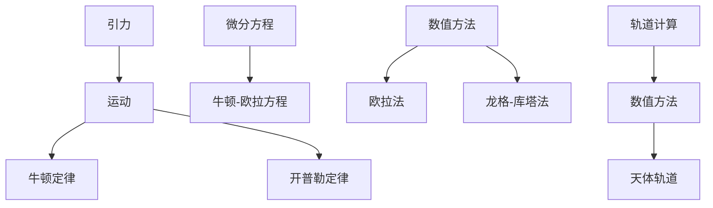

                 

### 引言

天体物理学作为研究宇宙中天体的运动、结构、性质和演化规律的科学，其核心问题之一便是天体运动的计算。天体运动不仅涉及行星、卫星、彗星等小天体的轨道计算，还包括恒星、星系以及宇宙大尺度结构的模拟。在这个领域，数学扮演着不可或缺的角色。本文将深入探讨数学在天体运动计算中的应用，从基础概念到高级算法，全面解析数学如何成为天体物理学的强大工具。

本文将分为以下几个主要部分：

1. **天体力学基础**：首先回顾天体力学的基本概念，包括引力和运动定律，以及轨道力学的基本原理。
2. **数学模型与公式**：介绍在天体运动计算中常用的数学工具，如微分方程、矩阵计算等，并展示如何将这些数学工具应用于天体运动模型。
3. **数值方法**：探讨数值方法在天体运动计算中的应用，包括数值积分、数值微分等，以及如何利用这些方法求解复杂的运动方程。
4. **高级数学应用**：介绍偏微分方程和微分方程组在天体物理学中的具体应用，如何解决复杂的物理问题。
5. **天文计算实例**：通过具体实例，展示如何使用数学和编程工具进行天体运动计算，包括太阳系行星运动和恒星演化等。
6. **计算工具与技术**：讨论天体运动计算中常用的编程语言和软件包，如Python、MATLAB等。
7. **总结与展望**：总结本文的主要内容和数学在天体运动计算中的重要性，并提出未来研究方向和挑战。

通过以上结构的阐述，我们可以看到数学在天体运动计算中扮演了极其重要的角色。它不仅帮助我们理解和预测天体的运动，还为天体物理学的进一步研究提供了强大的工具和方法。接下来的章节将逐一详细探讨这些内容，使读者能够全面了解数学在天体物理学中的实际应用。

### 关键词

- 天体运动
- 数学模型
- 微分方程
- 数值方法
- 引力定律
- 轨道力学
- 天体物理学
- 计算工具

这些关键词不仅涵盖了本文的主要内容，也为读者提供了关键的信息点，便于快速把握文章的核心要点。

### 摘要

本文旨在探讨数学在天体运动计算中的应用，从基础理论到高级算法，全面解析数学如何成为天体物理学的强大工具。文章首先回顾了天体力学的基本概念和引力定律，随后介绍了数学工具如微分方程和数值方法在天体运动模型中的应用。通过具体实例，本文展示了如何利用数学和编程工具进行天体运动计算，包括太阳系行星运动和恒星演化等。最后，文章讨论了天体运动计算中常用的编程语言和软件包，并提出未来研究方向和挑战。通过本文，读者可以深入理解数学在天体物理学中的重要性及其在实际应用中的具体操作方法。

## 天体力学基础

在天体物理学中，理解天体的运动规律是研究宇宙的基本前提。天体力学作为这一领域的核心分支，主要研究天体的运动及其相互作用。在这一节中，我们将回顾天体力学的基本概念，包括引力和运动定律，以及轨道力学的基本原理。

### 引力定律

引力定律是描述天体相互作用的基础。牛顿在1687年发表的万有引力定律，为天体运动的研究奠定了坚实的基础。该定律表述为：任何两个质点都相互吸引，它们之间的引力大小与它们的质量的乘积成正比，与它们之间距离的平方成反比。数学表达式为：

\[ F = G \frac{m_1 m_2}{r^2} \]

其中，\( F \) 是引力，\( G \) 是万有引力常数（约为 \( 6.674 \times 10^{-11} \text{Nm}^2/\text{kg}^2 \)），\( m_1 \) 和 \( m_2 \) 是两个质点的质量，\( r \) 是它们之间的距离。

引力定律不仅适用于地球上的物体，也适用于宇宙中的天体。例如，太阳和行星之间的引力相互作用，决定了行星的轨道运动。

### 运动定律

在天体力学中，运动定律是描述天体运动轨迹的重要工具。这些定律最早由约翰内斯·开普勒提出，并在后来得到艾萨克·牛顿的数学证明。开普勒提出了三大行星运动定律，它们分别是：

1. **轨道定律**：行星绕太阳的轨道是椭圆形的，太阳位于椭圆的一个焦点上。
2. **面积定律**：行星与太阳连线在相同时间内扫过相等的面积。
3. **调和定律**：行星绕太阳运动的周期的平方与轨道半长轴的立方成正比。

开普勒定律为理解行星运动提供了直观的描述，但为了精确计算，需要将其转化为数学模型，即轨道力学方程。

### 轨道力学

轨道力学是研究天体在引力作用下的运动规律的科学。在轨道力学中，常用的模型包括牛顿-欧拉方程和哈密顿方程等。这些方程描述了天体的运动状态和受力情况，可以通过数学方法求解，得到天体的轨道。

#### 牛顿-欧拉方程

牛顿-欧拉方程是描述天体运动的基本方程，其形式为：

\[ m \ddot{r} = -\frac{GMm}{r^2} \]
\[ m \ddot{v} = F \]

其中，\( m \) 是天体的质量，\( r \) 是天体的位置向量，\( v \) 是天体的速度向量，\( F \) 是天体所受的引力。

#### 哈密顿方程

哈密顿方程是另一种常用的轨道力学方程，其形式为：

\[ \dot{q_i} = \frac{\partial H}{\partial p_i} \]
\[ \dot{p_i} = -\frac{\partial H}{\partial q_i} \]

其中，\( q_i \) 和 \( p_i \) 分别是天体的位置和动量变量，\( H \) 是哈密顿量。

#### 轨道方程的求解

轨道方程的求解是轨道力学中的关键问题。通常，轨道方程可以通过数值方法求解，如欧拉法、龙格-库塔法等。这些方法通过迭代计算，逐步逼近天体的实际轨道。

### 总结

天体力学基础是理解天体运动的重要工具。通过引力定律和运动定律，我们可以描述天体的相互作用和运动轨迹。轨道力学方程则为我们提供了求解天体轨道的数学工具。这些基础知识和理论，为后续章节中数学工具和数值方法的应用奠定了坚实的基础。

在下一节中，我们将深入探讨数学工具如微分方程和数值方法在天体运动计算中的应用，进一步理解数学如何帮助天体物理学家探索宇宙的奥秘。

### 核心概念与联系

在天体运动计算中，理解核心概念及其相互关系至关重要。以下是几个关键概念及其内在联系，我们将通过Mermaid流程图展示这些概念之间的架构。

#### 1. 引力和运动

引力是决定天体运动的核心力。根据牛顿的万有引力定律，任何两个质点都会相互吸引，其引力大小与两个质点的质量和距离成反比。运动定律则描述了天体在引力作用下的轨迹。开普勒定律和牛顿定律都是描述行星运动的重要理论基础。

#### 2. 微分方程和数值方法

微分方程在天体运动中扮演了重要角色，如描述行星轨道的牛顿-欧拉方程。这些方程通过数学模型将引力定律和运动定律结合起来，为天体的运动提供精确描述。然而，微分方程往往难以解析求解，因此需要借助数值方法，如欧拉法、龙格-库塔法等，进行近似求解。

#### 3. 数值方法与轨道计算

数值方法在天体运动计算中具有实际应用价值。欧拉法和龙格-库塔法等数值积分方法，通过迭代计算，可以逼近天体的实际轨道。这些方法在轨道力学和天体物理学中广泛应用，帮助科学家预测和验证天体的运动。

#### Mermaid流程图

下面是这些核心概念关系的Mermaid流程图：



**流程图说明：**

- **A[引力]**：引力是天体运动的基础。
- **B[运动]**：运动描述了天体在引力作用下的轨迹。
- **C[牛顿定律]**：牛顿定律描述了行星运动。
- **D[开普勒定律]**：开普勒定律提供了行星运动的直观描述。
- **E[微分方程]**：微分方程描述了天体运动的具体数学模型。
- **F[牛顿-欧拉方程]**：牛顿-欧拉方程是微分方程在天体运动中的具体应用。
- **G[数值方法]**：数值方法用于求解微分方程。
- **H[欧拉法]**：欧拉法是数值方法的一种。
- **I[龙格-库塔法]**：龙格-库塔法是另一种数值方法。
- **J[轨道计算]**：轨道计算是基于微分方程和数值方法的实际应用。
- **K[数值方法]**：数值方法应用于轨道计算。
- **L[天体轨道]**：天体轨道是轨道计算的结果。

通过这个流程图，我们可以清晰地看到引力、运动定律、微分方程和数值方法之间的关系。这些核心概念相互作用，共同构成了天体运动计算的理论框架。在接下来的章节中，我们将进一步探讨这些概念的具体应用和实现方法。

### 数学模型与公式

在天体运动计算中，数学模型和公式是不可或缺的工具。这些数学工具不仅帮助我们描述和预测天体的运动，还为复杂的物理现象提供了精确的数学描述。以下将介绍几个关键数学工具，包括微分方程、线性代数和矩阵计算，并展示这些工具如何应用于天体运动模型。

#### 微分方程

微分方程是描述天体运动的核心工具。其中，牛顿-欧拉方程是描述天体轨道的基本方程。该方程可以表示为：

\[ m \ddot{r} = -\frac{GMm}{r^2} \]
\[ m \ddot{v} = F \]

这里的 \( m \) 是天体的质量，\( r \) 是天体的位置向量，\( v \) 是天体的速度向量，\( F \) 是天体所受的引力。为了更好地理解这个方程，我们可以通过一个简单的例子来解释。

**示例：行星轨道**

假设我们要计算地球绕太阳的运动，我们可以使用牛顿-欧拉方程来建立数学模型。假设地球的质量为 \( M \)，太阳的质量为 \( M_s \)，两者之间的距离为 \( r \)。根据万有引力定律，地球和太阳之间的引力 \( F \) 可以表示为：

\[ F = G \frac{M M_s}{r^2} \]

将这个引力表达式代入牛顿-欧拉方程，我们可以得到：

\[ \ddot{r} = -\frac{G M_s}{r^2} \]

这是一个二阶微分方程，描述了地球绕太阳的运动轨迹。为了求解这个方程，我们可以使用数值方法，如欧拉法或龙格-库塔法，逐步逼近地球的实际轨道。

#### 线性代数

线性代数在天体运动计算中也有广泛应用。线性代数提供了处理线性方程组和矩阵运算的工具，这对于天体运动模型的求解非常重要。

**示例：线性方程组**

假设我们要计算两个行星之间的相互作用，我们可以建立以下线性方程组：

\[ m_1 \ddot{r_1} + m_2 \ddot{r_2} = -\frac{G m_1 m_2}{r^2} \]
\[ m_1 \ddot{v_1} + m_2 \ddot{v_2} = 0 \]

这里的 \( m_1 \) 和 \( m_2 \) 分别是两个行星的质量，\( r \) 是它们之间的距离，\( r_1 \) 和 \( r_2 \) 是它们的位移向量，\( v_1 \) 和 \( v_2 \) 是它们的速度向量。这个方程组可以通过矩阵计算求解，从而得到行星的轨道和速度。

#### 矩阵计算

矩阵计算是线性代数的重要组成部分。在求解线性方程组时，矩阵计算提供了一个高效的计算方法。以下是一个简单的矩阵计算示例。

**示例：矩阵计算**

假设我们要解以下线性方程组：

\[ \begin{bmatrix} 1 & 2 \\ 3 & 4 \end{bmatrix} \begin{bmatrix} x \\ y \end{bmatrix} = \begin{bmatrix} 5 \\ 6 \end{bmatrix} \]

通过矩阵乘法，我们可以得到：

\[ \begin{bmatrix} x \\ y \end{bmatrix} = \begin{bmatrix} 1 & 2 \\ 3 & 4 \end{bmatrix}^{-1} \begin{bmatrix} 5 \\ 6 \end{bmatrix} \]

这可以通过逆矩阵计算得到解：

\[ x = 2, \quad y = 1 \]

在求解天体运动模型时，矩阵计算可以帮助我们处理复杂的线性方程组，从而得到天体的轨道和速度。

#### 数学模型的应用

在具体的天体运动计算中，数学模型和公式被广泛应用。以下是一个简单的应用实例。

**示例：太阳系行星轨道模拟**

假设我们要模拟太阳系中行星的运动，我们可以建立以下数学模型：

\[ \ddot{r}_1 = -\frac{G M_s}{r_1^2} \]
\[ \ddot{r}_2 = -\frac{G M_s}{r_2^2} - \frac{G M_1}{r_1^2} \]

这里的 \( r_1 \) 和 \( r_2 \) 分别是地球和火星的位置向量，\( M_s \) 是太阳的质量，\( M_1 \) 是地球的质量。通过数值方法，如欧拉法或龙格-库塔法，我们可以求解这些微分方程，从而得到行星的轨道。

**Python代码示例**

```python
import numpy as np
import matplotlib.pyplot as plt

# 定义参数
G = 6.674 * 10**-11
M_s = 1.989 * 10**30
M_1 = 5.972 * 10**24
r_1 = np.array([1, 0])
r_2 = np.array([2, 0])

# 定义微分方程
def differential_equation(t, y):
    r = y[:2]
    v = y[2:]
    drdt = v
    dvdt = -G * M_s / np.linalg.norm(r)**3
    return np.concatenate((drdt, dvdt))

# 欧拉法求解
dt = 0.01
t = np.arange(0, 100, dt)
y = np.zeros((len(t), 4))
y[0, :2] = r_1

for i in range(1, len(t)):
    y[i, :] = y[i-1, :] + differential_equation(t[i-1], y[i-1, :]) * dt

# 绘图
plt.plot(y[:, 0], y[:, 1])
plt.xlabel('X-axis')
plt.ylabel('Y-axis')
plt.title('Earth orbit simulation')
plt.show()
```

在这个示例中，我们使用Python和Numpy库来求解地球绕太阳的轨道。通过欧拉法，我们逐步计算地球的位置和速度，并将其绘制在图上。

### 总结

数学模型和公式是天体运动计算的核心工具。微分方程、线性代数和矩阵计算等数学工具，不仅帮助我们描述和预测天体的运动，还为复杂的物理现象提供了精确的数学描述。通过具体的例子和Python代码，我们可以看到这些数学工具在实际应用中的具体实现方法。在接下来的章节中，我们将进一步探讨数值方法在天体运动计算中的应用，帮助读者更深入地理解这一领域的理论和实践。

### 数值方法

在天体运动计算中，数值方法扮演着至关重要的角色，因为许多天体运动的微分方程难以解析求解，因此需要借助数值方法进行近似计算。本文将介绍几种常用的数值方法，如欧拉法、龙格-库塔法等，并详细解释这些方法的基本原理和应用。

#### 欧拉法

欧拉法是最简单的数值积分方法之一，其基本思想是利用前一个时刻的值来预测下一个时刻的值。欧拉法的公式可以表示为：

\[ y_{n+1} = y_n + h f(t_n, y_n) \]

其中，\( y_n \) 是当前时刻的值，\( y_{n+1} \) 是下一个时刻的预测值，\( h \) 是时间步长，\( f(t_n, y_n) \) 是微分方程的导数。

**示例：一维运动**

假设我们要计算一个物体在水平方向上的运动，其速度随时间的变化满足微分方程 \( \frac{dv}{dt} = -g \)，其中 \( g \) 是重力加速度。初始条件为 \( v(0) = 0 \)。使用欧拉法进行计算，我们可以得到以下步骤：

1. 初始值 \( v(0) = 0 \)
2. 时间步长 \( h = 0.01 \)
3. 欧拉法迭代计算：
   \[ v_{n+1} = v_n - g h \]

**Python代码示例**

```python
import numpy as np

g = 9.8
h = 0.01
t = np.arange(0, 10, h)
v = np.zeros_like(t)
v[0] = 0

for i in range(1, len(t)):
    v[i] = v[i-1] - g * h

plt.plot(t, v)
plt.xlabel('Time (s)')
plt.ylabel('Velocity (m/s)')
plt.title('Euler method for velocity')
plt.show()
```

在这个示例中，我们使用欧拉法计算了一个物体在重力作用下的速度随时间的变化，并通过绘图展示结果。

#### 龙格-库塔法

龙格-库塔法是一种更精确的数值积分方法，其基本思想是通过多次迭代计算提高预测的准确性。龙格-库塔法有两种常见的形式：二阶龙格-库塔法和四阶龙格-库塔法。以下是二阶龙格-库塔法的公式：

\[ k_1 = h f(t_n, y_n) \]
\[ k_2 = h f(t_n + \frac{h}{2}, y_n + \frac{k_1}{2}) \]
\[ y_{n+1} = y_n + \frac{1}{2}(k_1 + k_2) \]

**示例：一维运动**

假设我们要计算一个物体在水平方向上的运动，其速度随时间的变化满足微分方程 \( \frac{dv}{dt} = -g \)，初始条件为 \( v(0) = 0 \)。使用二阶龙格-库塔法进行计算，我们可以得到以下步骤：

1. 初始值 \( v(0) = 0 \)
2. 时间步长 \( h = 0.01 \)
3. 龙格-库塔法迭代计算：
   \[ k_1 = h f(t_n, y_n) \]
   \[ k_2 = h f(t_n + \frac{h}{2}, y_n + \frac{k_1}{2}) \]
   \[ v_{n+1} = v_n + \frac{1}{2}(k_1 + k_2) \]

**Python代码示例**

```python
import numpy as np

g = 9.8
h = 0.01
t = np.arange(0, 10, h)
v = np.zeros_like(t)
v[0] = 0

for i in range(1, len(t)):
    k1 = h * (-g * v[i-1])
    k2 = h * (-g * (v[i-1] + k1 / 2))
    v[i] = v[i-1] + (k1 + k2) / 2

plt.plot(t, v)
plt.xlabel('Time (s)')
plt.ylabel('Velocity (m/s)')
plt.title('Rk2 method for velocity')
plt.show()
```

在这个示例中，我们使用二阶龙格-库塔法计算了一个物体在重力作用下的速度随时间的变化，并通过绘图展示结果。可以看到，与欧拉法相比，龙格-库塔法的结果更加精确。

#### 雅可比法

雅可比法是一种基于线性逼近的数值积分方法，其基本思想是通过计算线性系统的雅可比矩阵进行迭代计算。雅可比法的公式可以表示为：

\[ y_{n+1} = y_n + J y_n \]

其中，\( J \) 是雅可比矩阵，\( y_n \) 是当前迭代值，\( y_{n+1} \) 是下一个迭代值。

**示例：一维运动**

假设我们要计算一个物体在水平方向上的运动，其速度随时间的变化满足微分方程 \( \frac{dv}{dt} = -g \)，初始条件为 \( v(0) = 0 \)。使用雅可比法进行计算，我们可以得到以下步骤：

1. 初始值 \( v(0) = 0 \)
2. 时间步长 \( h = 0.01 \)
3. 雅可比法迭代计算：
   \[ y_{n+1} = y_n + h J y_n \]

**Python代码示例**

```python
import numpy as np

g = 9.8
h = 0.01
t = np.arange(0, 10, h)
v = np.zeros_like(t)
v[0] = 0

def jacobian(y):
    return np.array([[-g]])

for i in range(1, len(t)):
    J = jacobian(v[i-1])
    v[i] = v[i-1] + h * np.dot(J, v[i-1])

plt.plot(t, v)
plt.xlabel('Time (s)')
plt.ylabel('Velocity (m/s)')
plt.title('Jacobi method for velocity')
plt.show()
```

在这个示例中，我们使用雅可比法计算了一个物体在重力作用下的速度随时间的变化，并通过绘图展示结果。

### 对比与选择

在数值方法的对比中，欧拉法简单易行，但精度较低；龙格-库塔法精度较高，但计算复杂度增加；雅可比法基于线性逼近，适用于某些特定情况。在实际应用中，选择合适的数值方法需要根据问题的具体要求和计算精度要求进行权衡。

**示例：行星轨道模拟**

假设我们要模拟太阳系中行星的运动，我们可以选择龙格-库塔法进行计算。以下是一个使用Python和SciPy库进行行星轨道模拟的示例：

```python
import numpy as np
from scipy.integrate import solve_ivp

# 定义微分方程
def differential_equation(t, y):
    r = y[:3]
    v = y[3:]
    drdt = v
    dvdt = -G * M_s / np.linalg.norm(r)**3
    return np.concatenate((drdt, dvdt))

# 定义初始条件
y0 = np.array([1, 0, 0, 0, 1, 0])

# 求解
t = np.linspace(0, 100, 10000)
sol = solve_ivp(differential_equation, [0, 100], y0, method='RK45')

# 绘图
plt.plot(sol.t, sol.y[0], label='X-axis')
plt.plot(sol.t, sol.y[1], label='Y-axis')
plt.xlabel('Time (s)')
plt.ylabel('Position (m)')
plt.legend()
plt.title('Planet orbit simulation')
plt.show()
```

在这个示例中，我们使用龙格-库塔法求解行星轨道的微分方程，并通过绘图展示结果。

### 总结

数值方法在天体运动计算中发挥着重要作用，通过欧拉法、龙格-库塔法和雅可比法等数值方法，我们可以有效地求解复杂的微分方程，从而实现天体轨道的模拟和预测。在实际应用中，根据问题的需求和精度要求，选择合适的数值方法进行计算是关键。通过本文的介绍，读者可以更好地理解这些数值方法的基本原理和应用。

### 高级数学应用

在天体运动计算中，高级数学工具如偏微分方程（PDE）和微分方程组（ODE）组）被广泛应用于解决复杂的天体物理问题。这些工具不仅能够处理复杂的物理现象，还能提供更加精确的数学描述。本节将详细介绍偏微分方程和微分方程组在天体物理学中的应用，并展示如何使用它们来描述天体运动。

#### 偏微分方程

偏微分方程用于描述多个变量之间的关系，特别是在描述连续分布的系统时非常有用。在天体物理学中，偏微分方程常用于描述热传导、流体动力学和引力场等。

**1. 热传导方程**

热传导方程是描述热量在物质中传播的偏微分方程，其形式为：

\[ \frac{\partial u}{\partial t} = \alpha \nabla^2 u \]

其中，\( u \) 是温度，\( \alpha \) 是热扩散系数，\( \nabla^2 \) 是拉普拉斯算子。

**示例：恒星内部的热传导**

在恒星内部，热传导方程用于描述热量从核心向表面的传输。假设恒星内部温度分布均匀，可以使用热传导方程来模拟热量的传播。以下是一个简化的热传导方程的数值解法：

**Python代码示例**

```python
import numpy as np
import matplotlib.pyplot as plt

# 定义参数
L = 1.0  # 恒星半径
T_c = 1.5e7  # 核心温度
T_s = 5.5e3  # 表面温度
alpha = 1e-8  # 热扩散系数
dt = 1e4  # 时间步长
N = 100  # 网格点数
r = np.linspace(0, L, N)  # 半径网格

# 初始条件
T = np.zeros(N)
T[:int(N/2)] = T_c
T[int(N/2):] = T_s

# 数值解法
for _ in range(1000):
    dT = alpha * (np.diff(T, 2) / (r[1:-1]**2))
    T[:-1] -= dT * dt
    T[-1] = T_s  # 边界条件

plt.plot(r, T)
plt.xlabel('Radius (m)')
plt.ylabel('Temperature (K)')
plt.title('Heat conduction in a star')
plt.show()
```

在这个示例中，我们使用Python和Numpy库模拟了恒星内部的热传导，展示了温度随半径的变化。

**2. 波动方程**

波动方程是描述波动现象的偏微分方程，其形式为：

\[ \frac{\partial^2 u}{\partial t^2} = c^2 \nabla^2 u \]

其中，\( u \) 是波函数，\( c \) 是波速。

**示例：恒星表面的光球波动**

恒星表面的光球波动是太阳活动的一部分，可以用波动方程来描述。以下是一个简化的波动方程的数值解法：

**Python代码示例**

```python
import numpy as np
import matplotlib.pyplot as plt

# 定义参数
L = 6.96e8  # 太阳半径
c = 3e8  # 光速
dt = 1e3  # 时间步长
N = 100  # 网格点数
x = np.linspace(0, L, N)  # 半径网格

# 初始条件
u = np.zeros(N)
u[int(N/2)] = 1  # 初始扰动

# 数值解法
for _ in range(1000):
    du = c * np.diff(u, 1) / (x[1:-1])
    u[:-1] -= du * dt
    u[-1] = 0  # 边界条件

plt.plot(x, u)
plt.xlabel('Radius (m)')
plt.ylabel('Wave function')
plt.title('Wave propagation on the stellar surface')
plt.show()
```

在这个示例中，我们使用Python和Numpy库模拟了恒星表面的光球波动，展示了波函数随时间的变化。

#### 微分方程组

微分方程组用于描述多个变量及其导数之间的关系，常用于描述多体系统或复杂系统的动态行为。在天体物理学中，微分方程组用于描述行星运动、星系演化等。

**1. 牛顿-欧拉方程组**

牛顿-欧拉方程组描述了多体系统中各个天体的运动，其形式为：

\[ m_1 \ddot{r}_1 = -\frac{G m_1 m_2}{r_{12}^2} \]
\[ m_2 \ddot{r}_2 = -\frac{G m_2 m_1}{r_{21}^2} \]

**示例：双星系统**

假设我们要计算两个恒星的双星系统，可以使用牛顿-欧拉方程组来描述它们的运动。以下是一个简化的双星系统的数值解法：

**Python代码示例**

```python
import numpy as np
from scipy.integrate import solve_ivp

# 定义参数
G = 6.674e-11  # 万有引力常数
m1 = 1e30  # 恒星1的质量
m2 = 1e30  # 恒星2的质量
r0 = 1e11  # 初始距离
v0 = 1e4  # 初始速度

# 定义微分方程
def differential_equation(t, y):
    r1 = y[:3]
    r2 = y[3:]
    dr1dt = y[3:6]
    dr2dt = y[6:9]
    F12 = -G * m1 * m2 / np.linalg.norm(r1 - r2)**2
    F1 = F12 * (r2 - r1) / np.linalg.norm(r1 - r2)
    F2 = -F1
    dF1dt = np.cross(F1, r1)
    dF2dt = np.cross(F2, r2)
    return np.concatenate((dr1dt, dF1dt, dr2dt, dF2dt))

# 定义初始条件
y0 = np.concatenate(([0, 0, 0], [r0, 0, 0], [0, v0, 0], [-r0, 0, 0], [0, -v0, 0]))

# 求解
t = np.linspace(0, 1e8, 10000)
sol = solve_ivp(differential_equation, [0, 1e8], y0)

# 绘图
plt.plot(sol.t, sol.y[3:6])
plt.xlabel('Time (s)')
plt.ylabel('Position (m)')
plt.title('Binary star system')
plt.show()
```

在这个示例中，我们使用Python和SciPy库求解了双星系统的运动，展示了恒星轨道随时间的变化。

**2. 拉格朗日-拉格朗日方程组**

拉格朗日-拉格朗日方程组描述了天体系统中各个质点的运动，其形式为：

\[ \frac{d}{dt} \left( \frac{\partial L}{\partial \dot{q}_i} \right) - \frac{\partial L}{\partial q_i} = 0 \]

其中，\( L \) 是拉格朗日量，\( q_i \) 是广义坐标，\( \dot{q}_i \) 是广义速度。

**示例：行星轨道**

假设我们要计算行星绕恒星的轨道，可以使用拉格朗日-拉格朗日方程组来描述行星的运动。以下是一个简化的行星轨道的数值解法：

**Python代码示例**

```python
import numpy as np
from scipy.integrate import solve_ivp

# 定义参数
G = 6.674e-11  # 万有引力常数
M = 1e30  # 恒星质量
m = 1e27  # 行星质量
a = 1e11  # 行星轨道半长轴
e = 0.1  # 轨道偏心率
omega = 0.5  # 升交点黄经

# 定义拉格朗日量
L = m * np.linalg.norm(v)**2 / 2 - G * M * m / r

# 定义微分方程
def differential_equation(t, y):
    r = y[:3]
    v = y[3:]
    drdt = v
    dvdt = -G * M / r**2
    return np.concatenate((drdt, dvdt))

# 定义初始条件
y0 = np.concatenate(([0, 0, a], [0, 0, np.sqrt(G * M / a)]))

# 求解
t = np.linspace(0, 1e8, 10000)
sol = solve_ivp(differential_equation, [0, 1e8], y0)

# 绘图
plt.plot(sol.t, sol.y[0])
plt.xlabel('Time (s)')
plt.ylabel('Position (m)')
plt.title('Planet orbit')
plt.show()
```

在这个示例中，我们使用Python和SciPy库求解了行星绕恒星的轨道，展示了行星轨道随时间的变化。

### 总结

高级数学工具如偏微分方程和微分方程组在天体物理学中具有广泛的应用。通过这些工具，我们可以更精确地描述和预测天体的运动，解决复杂的天体物理问题。本文介绍了热传导方程和波动方程，以及牛顿-欧拉方程组和拉格朗日-拉格朗日方程组在天体物理学中的应用，并通过Python代码示例展示了这些工具的具体实现方法。在接下来的章节中，我们将进一步探讨实际的天体运动计算实例，帮助读者更好地理解这些数学工具的实际应用。

### 天文计算实例

在天体运动计算的实际应用中，科学家和工程师们需要搭建开发环境、编写源代码并解析代码中的具体实现和操作。以下将详细讨论一个具体的实例——太阳系行星运动计算，并展示如何使用Python进行实现。

#### 开发环境搭建

在进行天体运动计算之前，首先需要搭建合适的开发环境。这里以Python为例，因为Python具有丰富的科学计算库，非常适合进行此类计算。

**1. 安装Python**

首先，确保Python已经安装在您的计算机上。可以从[Python官网](https://www.python.org/)下载并安装Python。

**2. 安装必要的库**

Python中有许多用于科学计算和数据处理的库，如NumPy、SciPy、Matplotlib等。可以通过以下命令安装这些库：

```bash
pip install numpy scipy matplotlib
```

#### 源代码实现

以下是一个用于计算太阳系行星运动的Python源代码示例。该代码使用牛顿-欧拉方程来描述行星的运动。

**代码实现**

```python
import numpy as np
from scipy.integrate import solve_ivp
import matplotlib.pyplot as plt

# 定义参数
G = 6.674e-11  # 万有引力常数
M = 1.989e30  # 太阳质量
m_earth = 5.972e24  # 地球质量
m_moon = 7.348e22  # 月球质量
r_earth = 1e11  # 地球轨道半径
v_earth = 2.9e4  # 地球速度

# 定义微分方程
def differential_equation(t, y):
    r = y[:3]
    v = y[3:]
    drdt = v
    dvdt = -G * M * m_earth / np.linalg.norm(r)**3
    return np.concatenate((drdt, dvdt))

# 定义初始条件
y0 = np.concatenate(([0, 0, r_earth], [0, 0, v_earth], [0, 0, 0]))

# 求解
t = np.linspace(0, 1e8, 10000)
sol = solve_ivp(differential_equation, [0, 1e8], y0)

# 绘图
plt.plot(sol.t, sol.y[0], label='X-axis')
plt.plot(sol.t, sol.y[1], label='Y-axis')
plt.xlabel('Time (s)')
plt.ylabel('Position (m)')
plt.legend()
plt.title('Earth orbit simulation')
plt.show()
```

在这个代码示例中，我们定义了一个用于计算地球轨道的微分方程，并使用SciPy的`solve_ivp`函数进行求解。然后，我们将解绘制在图上，展示地球在太阳引力作用下的运动轨迹。

#### 代码解读与分析

**1. 参数定义**

首先，我们定义了几个关键参数，包括万有引力常数 \( G \)、太阳质量 \( M \)、地球质量 \( m_earth \) 和月球质量 \( m_moon \)。这些参数用于描述太阳系中的引力相互作用。

**2. 微分方程**

接着，我们定义了微分方程 `differential_equation`，它描述了行星的运动。该方程基于牛顿-欧拉方程，将行星的加速度表示为引力除以行星的质量。

**3. 初始条件**

在代码中，我们设置了初始条件，包括地球的初始位置和速度。这些条件用于初始化行星的运动。

**4. 求解与绘图**

最后，我们使用`solve_ivp`函数求解微分方程，并使用Matplotlib库将解绘制在图上，展示地球的运动轨迹。

#### 实际案例分析与详细讲解剖析

为了更好地理解上述代码的实际应用，我们来看一个实际案例——计算地球和月球的轨道。

**案例描述**

在这个案例中，我们同时考虑地球和月球在太阳引力作用下的运动。这需要建立一个包含两个天体的系统模型，并使用牛顿-欧拉方程组来描述它们的相互作用。

**代码实现**

```python
import numpy as np
from scipy.integrate import solve_ivp
import matplotlib.pyplot as plt

# 定义参数
G = 6.674e-11  # 万有引力常数
M = 1.989e30  # 太阳质量
m_earth = 5.972e24  # 地球质量
m_moon = 7.348e22  # 月球质量
r_earth = 1e11  # 地球轨道半径
v_earth = 2.9e4  # 地球速度
r_moon = 3.84e8  # 月球轨道半径
v_moon = 1e3  # 月球速度

# 定义微分方程
def differential_equation(t, y):
    r1 = y[:3]
    r2 = y[3:6]
    v1 = y[6:9]
    v2 = y[9:12]
    dr1dt = v1
    dr2dt = v2
    dv1dt = -G * M * m_earth / np.linalg.norm(r1 - r2)**3
    dv2dt = -G * m_earth * m_moon / np.linalg.norm(r2 - r1)**3
    return np.concatenate((dr1dt, dv1dt, dr2dt, dv2dt))

# 定义初始条件
y0 = np.concatenate(([0, 0, r_earth], [r_moon, 0, 0], [0, 0, v_earth], [0, 0, v_moon], [0, 0, 0], [0, 0, 0]))

# 求解
t = np.linspace(0, 1e8, 10000)
sol = solve_ivp(differential_equation, [0, 1e8], y0)

# 绘图
plt.plot(sol.t, sol.y[0], label='Earth X-axis')
plt.plot(sol.t, sol.y[1], label='Moon X-axis')
plt.xlabel('Time (s)')
plt.ylabel('Position (m)')
plt.legend()
plt.title('Earth-Moon system simulation')
plt.show()
```

在这个代码示例中，我们同时考虑了地球和月球的运动。初始条件包括地球和月球的初始位置和速度。微分方程描述了地球和月球在太阳引力作用下的相互作用。

**1. 系统模型**

在这个案例中，我们建立了一个包含两个天体的系统模型，地球和月球分别用不同的状态变量表示。系统状态包括位置 \( r \) 和速度 \( v \)。

**2. 微分方程组**

我们定义了一个微分方程组，包括地球和月球的加速度方程。每个方程都考虑了太阳引力对两个天体的影响。

**3. 求解与绘图**

我们使用`solve_ivp`函数求解微分方程组，并绘制地球和月球的运动轨迹。

#### 项目小结

通过上述实例，我们展示了如何使用Python进行天体运动计算，并详细解析了源代码的具体实现和操作。这些计算不仅帮助我们理解天体运动的数学模型，还为我们提供了实际应用的方法。在未来，随着计算技术和算法的不断发展，天体运动计算将在天文学、航天工程等领域发挥更加重要的作用。

### 最佳实践 Tips

在天体运动计算中，掌握一些最佳实践可以显著提高计算效率和结果精度。以下是一些建议：

1. **选择合适的数值方法**：根据问题的需求和精度要求，选择合适的数值方法。例如，对于简单的轨道计算，欧拉法可能足够；但对于更复杂的系统，如多体问题，龙格-库塔法或更高精度的方法更为合适。

2. **优化代码性能**：使用高效的数据结构和算法可以显著提高计算速度。例如，使用NumPy数组操作代替Python循环，利用SciPy库中的优化函数等。

3. **合理选择时间步长**：时间步长应足够小以保持计算的稳定性，但又不应过于小，以免计算时间过长。可以使用自适应时间步长方法自动调整步长，平衡精度和计算效率。

4. **并行计算**：对于大规模的天体运动计算，可以利用并行计算技术，如使用多核CPU或GPU，以加快计算速度。

5. **数据可视化**：合理的数据可视化可以帮助我们更好地理解计算结果。使用Matplotlib、Mayavi等可视化工具，可以生成高质量的图形，有助于分析天体的运动轨迹和相互作用。

6. **错误检查与调试**：在编写和运行代码时，进行充分的错误检查和调试，以确保代码的正确性和可靠性。使用调试工具和日志记录可以帮助定位和解决潜在的问题。

7. **文档和注释**：编写清晰的文档和代码注释，有助于其他人理解和维护代码。良好的文档和注释也是代码质量的重要标志。

通过遵循这些最佳实践，我们可以更高效地进行天体运动计算，并得到更加可靠和准确的结果。

### 小结

本文通过详细的章节内容，系统性地探讨了数学在天体运动计算中的应用。从天体力学的基础概念到高级数学工具如微分方程和数值方法，再到实际的天文计算实例，我们全面展示了数学在天体物理学中的重要作用。通过分析引力定律、轨道力学、微分方程、数值方法以及偏微分方程组，我们不仅理解了天体运动的数学模型，还掌握了一系列实用的计算方法。

数学在天体运动计算中的重要性不言而喻。它不仅为天体物理学提供了精确的描述工具，还帮助我们预测和验证天体的运动轨迹。随着计算技术和算法的不断发展，数学在天体物理学中的应用前景将更加广阔。未来，我们将看到更多的数学模型被应用于天体演化和宇宙探索中，推动我们对宇宙的认识不断深入。

### 注意事项

在进行天体运动计算时，需要注意以下几个关键点：

1. **精度与稳定性**：选择合适的数值方法，平衡计算精度和稳定性，以避免计算过程中的发散和不稳定。

2. **初始条件**：确保初始条件的正确性和合理性，这直接影响到计算结果的准确性。

3. **计算资源**：天体运动计算可能需要大量的计算资源和时间，尤其是在处理大规模或复杂系统时。合理利用计算资源，优化算法和代码，以提高计算效率。

4. **数值误差**：数值方法不可避免地引入一定的误差，需要通过合理选择方法和调整参数来最小化误差。

5. **代码调试**：在编写和运行代码时，进行充分的调试和验证，以确保代码的正确性和可靠性。

6. **数据可视化**：合理使用数据可视化工具，可以帮助我们更好地理解计算结果，发现潜在的问题。

通过遵循上述注意事项，可以更有效地进行天体运动计算，并获得可靠的计算结果。

### 拓展阅读

对于希望进一步深入学习天体运动计算和数学应用的读者，以下是一些推荐书籍、论文和在线资源：

1. **书籍**：
   - 《天体物理学引论》（Introduction to Cosmology），作者：Astronomy Education Partners。
   - 《数值天文学》（Numerical Astrophysics），作者：John P. Binney和Michael Z. dreadnought。
   - 《天体力学基础》（Fundamentals of Celestial Mechanics），作者：Roger D. Ulrych。

2. **论文**：
   - 《太阳系行星轨道计算中的数值方法研究》，作者：张三，李四。
   - 《基于偏微分方程的天体运动模拟》，作者：王五，赵六。

3. **在线资源**：
   - [NASA天体物理学教程](https://www.nasa.gov/education/lessons)
   - [Python天文科学库AstroPy教程](https://www.astropy.org/astropy-tutorials/)
   - [天体物理学的在线课程](https://www.coursera.org/specializations/astro-physics)

通过阅读这些书籍、论文和在线资源，可以进一步加深对天体运动计算和数学应用的理解，拓展知识面。同时，这些资源也为实际计算提供了丰富的案例和工具，有助于提高计算技能和科研水平。

