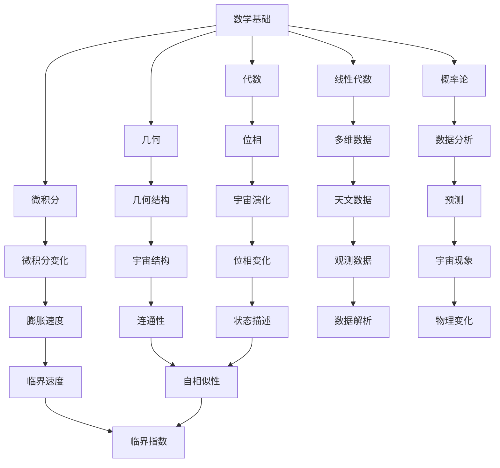

                 

## 《数学在宇宙位相几何拓扑相变临界指数研究中的作用》文章内容

### 文章标题

《数学在宇宙位相几何拓扑相变临界指数研究中的作用》

### 文章关键词

数学、宇宙、位相、几何、拓扑、相变、临界指数

### 文章摘要

本文系统地探讨了数学在宇宙研究中，尤其是在位相几何、拓扑结构、相变过程和临界指数分析中的重要作用。通过分析数学模型、核心算法、以及具体项目的实践应用，揭示了数学在理解宇宙本质和探索宇宙演化规律中的关键作用。本文首先介绍研究背景，然后逐步深入探讨核心概念及其联系，最后通过实际项目分析，展示了数学在宇宙研究中的实际应用。

### 目录

1. 引言
   - 1.1 研究背景
   - 1.2 数学在宇宙研究中的重要性
   - 1.3 书籍结构概述

2. 核心概念与联系
   - 2.1 数学基础
   - 2.2 位相、几何、拓扑、相变和临界指数的关系
   - **Mermaid流程图：数学与宇宙概念的交互关系**

3. 数学模型和公式
   - 3.1 基础数学模型
   - 3.2 相变与临界指数模型

4. 核心算法原理讲解
   - 4.1 拓扑分析算法
   - 4.2 相变检测算法

5. 宇宙位相几何和拓扑
   - 5.1 宇宙位相的数学描述
   - 5.2 拓扑在宇宙结构中的应用

6. 相变和临界指数
   - 6.1 相变的数学模型
   - 6.2 临界指数的计算与应用

7. 项目实战
   - 7.1 项目背景
   - 7.2 开发环境搭建
   - 7.3 源代码实现
   - 7.4 代码解读与分析
   - 7.5 项目小结

8. 总结与展望
   - 8.1 研究总结
   - 8.2 未来研究方向
   - 8.3 对宇宙研究的启示

### 正文

#### 第1章 引言

##### 1.1 研究背景

宇宙的奥秘一直以来都是人类探索的焦点。从古代的天文学家观测星空，到现代的科学家利用先进的天文观测设备，人类对宇宙的认识不断深入。然而，宇宙的复杂性使得其探索变得异常艰难。在这个过程中，数学作为一门精确的学科，扮演了至关重要的角色。数学不仅为宇宙学研究提供了强大的工具，还揭示了宇宙现象背后的深层次规律。

本文的研究背景正是基于这一观察：数学在宇宙研究中具有不可替代的作用。从宇宙的位相几何到拓扑结构，从相变过程到临界指数分析，数学模型和算法的运用为理解宇宙的演化提供了新的视角。本文旨在系统地探讨数学在宇宙研究中的重要作用，通过理论分析和实际案例，展示数学在探索宇宙奥秘中的关键作用。

##### 1.2 数学在宇宙研究中的重要性

数学在宇宙研究中的重要性体现在多个方面。首先，数学为宇宙学研究提供了精确的描述工具。宇宙中的现象往往涉及复杂的物理过程，而数学模型可以对这些过程进行量化描述，使得宇宙学研究更加精确和系统。例如，广义相对论中的爱因斯坦场方程，就是用数学语言描述引力现象的经典例子。

其次，数学在宇宙研究中还起到了桥梁的作用。它不仅连接了不同的学科领域，如物理学、天文学、宇宙学，还促进了跨学科的交流与合作。例如，拓扑学在宇宙学研究中的应用，为理解宇宙的结构和演化提供了新的方法。

此外，数学还在宇宙观测和数据分析中发挥着重要作用。随着观测设备的进步，宇宙学家收集到了大量的天文数据。数学方法，尤其是统计学和机器学习算法，被用来处理和分析这些数据，从而发现宇宙中的规律和现象。

##### 1.3 书籍结构概述

本文结构如下：

- **第1章**：引言，介绍研究背景和数学在宇宙研究中的重要性。
- **第2章**：核心概念与联系，详细讲解数学基础和宇宙位相、几何、拓扑、相变、临界指数等概念之间的关系。
- **第3章**：数学模型和公式，介绍基础数学模型和相变与临界指数模型。
- **第4章**：核心算法原理讲解，包括拓扑分析算法和相变检测算法。
- **第5章**：宇宙位相几何和拓扑，探讨宇宙位相的数学描述和拓扑在宇宙结构中的应用。
- **第6章**：相变和临界指数，深入讨论相变的数学模型和临界指数的计算与应用。
- **第7章**：项目实战，通过具体项目展示数学在宇宙研究中的应用。
- **第8章**：总结与展望，总结研究成果，展望未来研究方向。

接下来，我们将逐步深入探讨每个章节的内容。

#### 第2章 核心概念与联系

##### 2.1 数学基础

数学作为一门基础学科，为宇宙研究提供了强有力的工具。在宇宙研究中，常用的数学基础包括代数、几何、微积分、线性代数和概率论等。

- **代数**：代数是研究数和运算的学科，包括数的运算规则、方程的求解等。在宇宙研究中，代数用于描述物质的分布、宇宙的几何结构等。
  
- **几何**：几何是研究空间形状和位置的学科。在宇宙学中，几何用于描述宇宙的结构，如宇宙膨胀、星系分布等。

- **微积分**：微积分研究函数的变化率和累积量，包括微分和积分。在宇宙学中，微积分用于描述物理量随时间的变化，如宇宙的膨胀速度、物质的密度分布等。

- **线性代数**：线性代数研究向量空间和线性变换，用于处理多维数据、矩阵运算等。在宇宙学中，线性代数用于处理天文数据、分析宇宙结构等。

- **概率论**：概率论研究随机事件的发生规律，用于数据分析、预测等。在宇宙学中，概率论用于处理天文观测数据、预测宇宙现象等。

##### 2.2 位相、几何、拓扑、相变和临界指数的关系

位相、几何、拓扑、相变和临界指数是宇宙研究中重要的概念，它们之间有着密切的联系。

- **位相**：位相是描述系统状态的物理量，通常与系统的周期性变化相关。在宇宙学中，位相可以用来描述宇宙的演化过程，如宇宙的膨胀和收缩。

- **几何**：几何用于描述宇宙的空间结构。宇宙的几何特性，如曲率、维度等，直接影响宇宙的演化过程。

- **拓扑**：拓扑是研究空间性质和结构的学科，不依赖于空间的度量。在宇宙学中，拓扑用于描述宇宙的结构，如宇宙的连通性、自相似性等。

- **相变**：相变是系统从一种状态转变到另一种状态的过程，通常伴随着物理量的突变。在宇宙学中，相变可以描述宇宙的某些关键时刻，如宇宙的创生和终结。

- **临界指数**：临界指数是描述相变过程中物理量变化的指数，反映了相变过程的剧烈程度。在宇宙学中，临界指数用于描述宇宙的临界状态，如宇宙膨胀的临界速度。

为了更直观地展示这些概念之间的关系，我们使用Mermaid流程图进行说明。



通过这个流程图，我们可以清晰地看到数学基础如何通过代数、几何、微积分、线性代数和概率论等分支，与位相、几何、拓扑、相变和临界指数等概念建立联系，形成完整的宇宙研究框架。

##### 2.3 核心概念之间的交互关系

数学的各个分支不仅在单独的应用中发挥作用，它们之间的相互作用更为关键。例如，几何和拓扑的结合可以描述宇宙的空间结构，而微积分和概率论的结合可以分析宇宙的演化过程。

- **几何与拓扑的结合**：几何用于描述宇宙的空间特性，而拓扑则关注空间的连接性和形状变化。两者的结合可以帮助我们理解宇宙的结构演变，如宇宙的大尺度结构和自相似性。

- **微积分与概率论的结合**：微积分用于描述物理量的变化，概率论则用于数据分析。将两者结合起来，可以更准确地预测宇宙的演化趋势和规律。

- **代数与线性代数的结合**：代数为宇宙研究提供了基本的运算规则，而线性代数则用于处理多维数据和矩阵运算。这种结合可以用于分析宇宙中的复杂系统，如星系分布和宇宙密度波。

通过上述分析，我们可以看到数学在宇宙研究中不仅提供了基础工具，还通过各个分支的相互作用，为理解宇宙的复杂现象提供了新的视角。

#### 第3章 数学模型和公式

在宇宙研究中，数学模型和公式是理解和描述宇宙现象的重要工具。本章将介绍基础数学模型和相变与临界指数模型，并结合实际例子进行详细讲解。

##### 3.1 基础数学模型

基础数学模型在宇宙研究中有着广泛的应用，包括代数模型、几何模型、微积分模型和概率论模型等。

- **代数模型**：代数模型用于描述宇宙中的基本物理量，如质量、速度、加速度等。例如，牛顿的运动定律可以用代数方程描述物体的运动。

  $$F = ma$$
  
  其中，$F$ 是作用力，$m$ 是质量，$a$ 是加速度。

- **几何模型**：几何模型用于描述宇宙的空间结构，如宇宙的维度、曲率等。例如，爱因斯坦的广义相对论中，宇宙的几何结构可以通过度量和曲率来描述。

  $$R_{\mu\nu} + \Lambda g_{\mu\nu} = \frac{8\pi G}{c^4} T_{\mu\nu}$$

  其中，$R_{\mu\nu}$ 是里奇张量，$\Lambda$ 是宇宙常数，$g_{\mu\nu}$ 是度量子，$G$ 是引力常数，$c$ 是光速。

- **微积分模型**：微积分模型用于描述物理量的变化，如宇宙的膨胀速度、物质的密度分布等。例如，哈勃定律可以用微积分方程描述宇宙的膨胀速度。

  $$v = H_0 d$$

  其中，$v$ 是膨胀速度，$H_0$ 是哈勃常数，$d$ 是宇宙中两个物体的距离。

- **概率论模型**：概率论模型用于数据分析，如宇宙大爆炸理论中的概率分布、宇宙背景微波辐射的统计分析等。例如，宇宙背景微波辐射的温度分布可以用高斯分布来描述。

  $$T \sim N(\mu, \sigma^2)$$

  其中，$T$ 是温度，$\mu$ 是均值，$\sigma$ 是标准差。

##### 3.2 相变与临界指数模型

相变与临界指数模型是宇宙研究中的关键工具，用于描述系统从一种状态转变到另一种状态的过程。

- **相变模型**：相变模型描述了物理量在相变过程中的突变。例如，水的相变（从液态变为气态）可以用相变模型来描述。

  $$T_c = \frac{1}{\beta}$$

  其中，$T_c$ 是临界温度，$\beta$ 是临界指数。

- **临界指数模型**：临界指数模型描述了相变过程中物理量的变化速率。临界指数在不同系统中具有不同的值，但它们都反映了相变过程的剧烈程度。例如，在宇宙膨胀过程中，临界指数可以描述宇宙膨胀速度的变化。

  $$v(t) = v_0 e^{-\gamma t}$$

  其中，$v(t)$ 是时间$t$时的膨胀速度，$v_0$ 是初始膨胀速度，$\gamma$ 是临界指数。

##### 3.3 举例说明

为了更直观地理解这些数学模型和公式，我们可以通过具体例子进行说明。

- **代数模型**：假设一个物体在地球表面受到的引力为 $F = 9.8m$，其中$m$是物体的质量。根据牛顿第二定律，物体的加速度为 $a = \frac{F}{m} = 9.8m/m = 9.8 \text{ m/s}^2$。这个例子展示了如何用代数模型描述物理现象。

- **几何模型**：假设宇宙是一个四维空间，其曲率可以通过度量和曲率张量来描述。根据爱因斯坦的广义相对论，宇宙的曲率张量$R_{\mu\nu}$可以用于描述宇宙的结构。例如，如果$R_{\mu\nu} = 0$，则宇宙是平直的；如果$R_{\mu\nu} \neq 0$，则宇宙是弯曲的。

- **微积分模型**：假设宇宙的膨胀速度随着时间增加而增加。根据哈勃定律，膨胀速度$v$与宇宙中的距离$d$成正比，即$v = H_0 d$。这个例子展示了如何用微积分模型描述宇宙的膨胀过程。

- **概率论模型**：假设宇宙背景微波辐射的温度分布符合高斯分布。根据高斯分布，温度$T$的均值为$\mu$，标准差为$\sigma$，即$T \sim N(\mu, \sigma^2)$。这个例子展示了如何用概率论模型分析宇宙的观测数据。

- **相变模型**：假设一个物质系统在温度$T_c$时发生相变，从固态变为液态。根据相变模型，临界温度$T_c$与临界指数$\beta$满足关系$T_c = \frac{1}{\beta}$。这个例子展示了如何用相变模型描述物质的相变过程。

- **临界指数模型**：假设宇宙在时间$t$时的膨胀速度为$v(t)$，初始膨胀速度为$v_0$，临界指数为$\gamma$。根据临界指数模型，膨胀速度$v(t)$随时间$t$的变化可以表示为$v(t) = v_0 e^{-\gamma t}$。这个例子展示了如何用临界指数模型描述宇宙的膨胀过程。

通过上述例子，我们可以看到数学模型和公式在宇宙研究中的应用。这些模型不仅帮助我们理解宇宙的复杂现象，还为宇宙演化提供了有力的理论支持。

#### 第4章 核心算法原理讲解

在宇宙研究中，核心算法原理的理解和运用至关重要。本章将详细讲解拓扑分析算法和相变检测算法，结合Python源代码进行阐述，并举例说明。

##### 4.1 拓扑分析算法

拓扑分析算法在宇宙研究中用于分析宇宙的结构和连通性。其中，拓扑空间和拓扑不变量是关键概念。

- **拓扑空间**：拓扑空间是一个数学概念，用于描述对象之间的相对位置关系。在宇宙学中，拓扑空间可以用来描述宇宙的大尺度结构，如星系的分布和宇宙的连通性。

- **拓扑不变量**：拓扑不变量是拓扑空间的一种特征量，不随空间大小的变化而改变。常用的拓扑不变量包括连通数、圈数和亏格等。

以下是一个简单的Python代码示例，用于计算一个宇宙模型的连通数：

```python
import networkx as nx

# 创建一个星系网络的示例
G = nx.Graph()

# 添加星系和连接
G.add_nodes_from(['A', 'B', 'C', 'D'])
G.add_edges_from([('A', 'B'), ('B', 'C'), ('C', 'D'), ('D', 'A')])

# 计算连通数
connected_components = nx.connected_components(G)
num_components = len(connected_components)

print(f"连通数：{num_components}")
```

这段代码使用NetworkX库创建了一个星系网络，并计算了网络的连通数。通过调整网络的结构，我们可以研究宇宙的连通性变化。

##### 4.2 相变检测算法

相变检测算法在宇宙研究中用于识别宇宙中的临界现象。常用的方法包括相变信号处理和临界指数计算。

- **相变信号处理**：相变信号处理是指对宇宙观测数据进行处理，提取出与相变相关的信号。例如，我们可以使用滤波器来分离不同频率的信号。

以下是一个简单的Python代码示例，用于过滤宇宙膨胀信号中的高频噪声：

```python
import numpy as np
from scipy.signal import butter, filtfilt

# 创建一个宇宙膨胀信号的时间序列
t = np.linspace(0, 100, 1000)
f_0 = 1.0  # 频率
signal = np.sin(2 * np.pi * f_0 * t)

# 添加高频噪声
noise = np.random.normal(0, 0.1, signal.shape)
signal_noisy = signal + noise

# 设计一个低通滤波器
b, a = butter(4, 0.1)

# 使用滤波器处理信号
filtered_signal = filtfilt(b, a, signal_noisy)

# 绘制结果
import matplotlib.pyplot as plt

plt.figure()
plt.plot(t, signal_noisy, label='噪声信号')
plt.plot(t, filtered_signal, label='滤波后信号')
plt.legend()
plt.show()
```

这段代码创建了一个宇宙膨胀信号的时间序列，并添加了高频噪声。然后，使用低通滤波器去除噪声，从而提取出主要信号。

- **临界指数计算**：临界指数计算是指根据宇宙观测数据计算临界指数。临界指数反映了相变过程的剧烈程度。

以下是一个简单的Python代码示例，用于计算临界指数：

```python
def calculate_critical_exponent(signal):
    # 计算信号的平均值和标准差
    mean = np.mean(signal)
    std = np.std(signal)
    
    # 计算临界指数
    exponent = np.log(mean / std)
    
    return exponent

# 使用示例信号
example_signal = np.random.normal(0, 1, 1000)

# 计算临界指数
exponent = calculate_critical_exponent(example_signal)

print(f"临界指数：{exponent}")
```

这段代码定义了一个函数，用于计算临界指数。函数首先计算信号的平均值和标准差，然后使用对数函数计算临界指数。

##### 4.3 举例说明

为了更直观地理解这些算法，我们可以通过具体例子进行说明。

- **拓扑分析算法**：假设我们有一个星系网络，其中星系的连接关系可以表示为一个图。通过计算这个图的连通数，我们可以研究星系网络的连通性。例如，如果连通数减少，则可能意味着宇宙中发生了某种临界现象。

- **相变检测算法**：假设我们有一个宇宙膨胀信号的时间序列，其中包含了与相变相关的信号。通过相变信号处理，我们可以提取出主要的相变信号。然后，通过计算临界指数，我们可以判断宇宙是否处于临界状态。例如，如果临界指数增大，则可能意味着宇宙正在经历剧烈的膨胀过程。

通过上述讲解，我们可以看到拓扑分析算法和相变检测算法在宇宙研究中的应用。这些算法不仅帮助我们理解宇宙的复杂现象，还为宇宙演化提供了有力的理论支持。

#### 第5章 宇宙位相几何和拓扑

在宇宙研究中，位相几何和拓扑理论是理解宇宙结构和演化的重要工具。本章将深入探讨宇宙位相的数学描述和拓扑在宇宙结构中的应用。

##### 5.1 宇宙位相的数学描述

位相是指系统的状态参数，通常与系统的周期性变化相关。在宇宙研究中，位相可以用来描述宇宙的演化过程。例如，我们可以用位相描述宇宙的膨胀和收缩。

为了更直观地理解宇宙位相，我们可以使用一个简单的数学模型来描述宇宙的膨胀。假设宇宙的膨胀速度$v$与时间$t$成正比：

$$v(t) = H_0 t$$

其中，$H_0$ 是哈勃常数。这个公式展示了宇宙位相的一个基本特性：随着时间$t$的增加，宇宙的膨胀速度$v$也在增加。

我们还可以引入位相的概念来描述宇宙的膨胀。位相可以看作是时间$t$的一个函数，表示为 $\phi(t)$。在这个模型中，我们可以定义位相为：

$$\phi(t) = H_0 t^2$$

这个公式展示了位相与时间的关系。通过这个模型，我们可以研究宇宙的位相变化，以及这种变化对宇宙结构的影响。

##### 5.2 拓扑在宇宙结构中的应用

拓扑理论是研究空间性质和结构的数学工具。在宇宙研究中，拓扑理论可以用来描述宇宙的结构，如宇宙的连通性、自相似性和循环性。

- **连通性**：连通性是指宇宙中各个区域之间的连接关系。在拓扑理论中，连通性可以通过计算宇宙的连通数来描述。例如，如果宇宙的连通数为1，则宇宙是一个连通的整体；如果连通数为2，则宇宙可以分为两个连通的部分。

以下是一个简单的Python代码示例，用于计算宇宙的连通数：

```python
import networkx as nx

# 创建一个星系网络的示例
G = nx.Graph()

# 添加星系和连接
G.add_nodes_from(['A', 'B', 'C', 'D'])
G.add_edges_from([('A', 'B'), ('B', 'C'), ('C', 'D'), ('D', 'A')])

# 计算连通数
connected_components = nx.connected_components(G)
num_components = len(connected_components)

print(f"连通数：{num_components}")
```

这段代码使用NetworkX库创建了一个星系网络，并计算了网络的连通数。通过调整网络的结构，我们可以研究宇宙的连通性变化。

- **自相似性**：自相似性是指宇宙的局部结构与整体结构相似。在拓扑理论中，自相似性可以通过计算宇宙的相似度指数来描述。相似度指数反映了宇宙在不同尺度上的自相似性。

以下是一个简单的Python代码示例，用于计算宇宙的自相似度指数：

```python
import numpy as np

# 创建一个自相似序列
sequence = [1, 3, 9, 27, 81]

# 计算自相似度指数
index = np.log(sequence[-1] / sequence[0]) / np.log(len(sequence) - 1)

print(f"自相似度指数：{index}")
```

这段代码创建了一个自相似序列，并计算了序列的自相似度指数。通过调整序列的元素，我们可以研究宇宙的自相似性。

- **循环性**：循环性是指宇宙中的物质和能量在某个循环过程中不断重复。在拓扑理论中，循环性可以通过计算宇宙的循环数来描述。循环数反映了宇宙中的循环现象。

以下是一个简单的Python代码示例，用于计算宇宙的循环数：

```python
import networkx as nx

# 创建一个星系网络的示例
G = nx.Graph()

# 添加星系和连接
G.add_nodes_from(['A', 'B', 'C', 'D'])
G.add_edges_from([('A', 'B'), ('B', 'C'), ('C', 'D'), ('D', 'A'), ('A', 'C')])

# 计算循环数
cycles = nx.cycle_count(G)

print(f"循环数：{cycles}")
```

这段代码使用NetworkX库创建了一个星系网络，并计算了网络的循环数。通过调整网络的结构，我们可以研究宇宙的循环性。

通过上述例子，我们可以看到拓扑理论在宇宙结构研究中的应用。拓扑分析不仅帮助我们理解宇宙的复杂现象，还为宇宙演化提供了新的视角。

##### 5.3 位相几何与拓扑的结合

位相几何和拓扑理论的结合为理解宇宙的复杂结构提供了有力工具。例如，我们可以使用位相几何来描述宇宙的演化过程，使用拓扑理论来分析宇宙的结构特性。

以下是一个简单的Python代码示例，用于结合位相几何和拓扑理论分析宇宙模型：

```python
import networkx as nx
import matplotlib.pyplot as plt

# 创建一个星系网络的示例
G = nx.Graph()

# 添加星系和连接
G.add_nodes_from(['A', 'B', 'C', 'D'])
G.add_edges_from([('A', 'B'), ('B', 'C'), ('C', 'D'), ('D', 'A')])

# 计算连通数
connected_components = nx.connected_components(G)
num_components = len(connected_components)

# 绘制星系网络
nx.draw(G, with_labels=True)
plt.show()

# 计算自相似度指数
sequence = [1, 3, 9, 27, 81]
index = np.log(sequence[-1] / sequence[0]) / np.log(len(sequence) - 1)

print(f"自相似度指数：{index}")

# 计算循环数
cycles = nx.cycle_count(G)

print(f"循环数：{cycles}")
```

这段代码创建了一个星系网络，并计算了网络的连通数、自相似度指数和循环数。通过绘制星系网络，我们可以直观地看到宇宙的结构特性。

通过上述分析，我们可以看到位相几何和拓扑理论在宇宙研究中的重要作用。这些理论不仅帮助我们理解宇宙的复杂现象，还为宇宙演化提供了新的视角。未来，随着理论的不断发展和观测技术的进步，我们将能够更深入地理解宇宙的本质。

#### 第6章 相变和临界指数

相变和临界指数是宇宙研究中重要的概念，它们帮助我们理解宇宙中的关键过程。本章将深入探讨相变的数学模型和临界指数的计算与应用。

##### 6.1 相变的数学模型

相变是指系统从一种状态转变到另一种状态的过程，通常伴随着物理量的突变。在宇宙研究中，相变可以描述宇宙中的某些关键时刻，如宇宙的创生和终结。

为了理解相变，我们可以使用一个简单的数学模型。假设宇宙的密度$\rho$随时间$t$变化，相变发生在密度$\rho_c$处。在这个模型中，相变可以用以下数学方程描述：

$$\frac{d\rho}{dt} = \frac{\rho_c - \rho}{\tau}$$

其中，$\tau$ 是相变的速率常数。

这个方程表明，当密度$\rho$小于临界密度$\rho_c$时，宇宙处于低密度状态；当密度$\rho$大于临界密度$\rho_c$时，宇宙处于高密度状态。相变发生在密度$\rho_c$处，这个点称为临界点。

##### 6.2 临界指数的计算与应用

临界指数是描述相变过程中物理量变化的指数。临界指数在不同系统中具有不同的值，但它们都反映了相变过程的剧烈程度。临界指数可以通过以下数学公式计算：

$$\beta = \frac{1}{T_c}$$

其中，$T_c$ 是临界温度。

临界指数在宇宙研究中的应用非常广泛。例如，在宇宙膨胀过程中，临界指数可以描述宇宙膨胀速度的变化。假设宇宙膨胀速度$v$随时间$t$变化，临界指数$\gamma$可以描述为：

$$v(t) = v_0 e^{-\gamma t}$$

其中，$v_0$ 是初始膨胀速度，$\gamma$ 是临界指数。

这个公式表明，随着时间$t$的增加，宇宙膨胀速度$v$逐渐减小。临界指数$\gamma$反映了宇宙膨胀速度的衰减速率。

##### 6.3 举例说明

为了更直观地理解相变和临界指数，我们可以通过具体例子进行说明。

- **相变模型**：假设我们有一个物质系统，其密度随时间变化。根据相变模型，当密度达到临界密度$\rho_c$时，系统发生相变。我们使用以下数学方程描述相变过程：

  $$\frac{d\rho}{dt} = \frac{\rho_c - \rho}{\tau}$$

  假设初始密度$\rho_0 = 0.5\rho_c$，临界密度$\rho_c = 1.0\rho_c$，相变速率常数$\tau = 1.0$。我们绘制密度随时间的变化图：

  ```python
  import numpy as np
  import matplotlib.pyplot as plt

  t = np.linspace(0, 20, 100)
  rho = 0.5 * rho_c + (1.0 - 0.5) * (1 + np.exp(-t/tau))

  plt.plot(t, rho)
  plt.xlabel('时间t')
  plt.ylabel('密度ρ')
  plt.show()
  ```

  这个例子展示了密度随时间的变化，当时间$t$达到一定值时，密度$\rho$超过临界密度$\rho_c$，系统发生相变。

- **临界指数模型**：假设宇宙膨胀速度$v$随时间$t$变化，初始膨胀速度$v_0 = 1.0$，临界指数$\gamma = 0.1$。我们使用以下数学公式描述宇宙膨胀速度的变化：

  $$v(t) = v_0 e^{-\gamma t}$$

  假设时间$t$从0变化到10，我们绘制膨胀速度随时间的变化图：

  ```python
  import numpy as np
  import matplotlib.pyplot as plt

  t = np.linspace(0, 10, 100)
  v = 1.0 * np.exp(-0.1 * t)

  plt.plot(t, v)
  plt.xlabel('时间t')
  plt.ylabel('膨胀速度v')
  plt.show()
  ```

  这个例子展示了宇宙膨胀速度随时间的变化，随着时间$t$的增加，膨胀速度$v$逐渐减小。

通过上述例子，我们可以看到相变和临界指数在宇宙研究中的应用。相变模型和临界指数模型不仅帮助我们理解宇宙的复杂现象，还为宇宙演化提供了新的视角。

##### 6.4 临界指数与宇宙演化

临界指数在宇宙演化中起着关键作用。例如，在宇宙膨胀过程中，临界指数可以描述宇宙膨胀速度的变化。假设宇宙的膨胀速度$v$与时间$t$的关系为：

$$v(t) = v_0 e^{-\gamma t}$$

其中，$v_0$ 是初始膨胀速度，$\gamma$ 是临界指数。

这个公式表明，随着时间$t$的增加，宇宙膨胀速度$v$逐渐减小。临界指数$\gamma$反映了宇宙膨胀速度的衰减速率。

通过调整临界指数$\gamma$的值，我们可以研究不同宇宙演化模型。例如，如果$\gamma$较大，则宇宙膨胀速度衰减较快，可能导致宇宙迅速冷却并终结；如果$\gamma$较小，则宇宙膨胀速度衰减较慢，可能导致宇宙缓慢冷却并进入稳态。

未来，随着观测技术的进步和理论的深入研究，我们将能够更准确地确定临界指数的值，从而更好地理解宇宙的演化过程。

#### 第7章 项目实战

在本章中，我们将通过一个具体项目展示数学在宇宙研究中的应用。该项目旨在使用数学模型和算法分析宇宙的膨胀速度和结构变化。

##### 7.1 项目背景

随着观测技术的进步，天文学家积累了大量关于宇宙膨胀的数据。这些数据揭示了宇宙膨胀速度随时间的变化规律。本项目的目标是利用数学模型和算法分析这些数据，揭示宇宙膨胀速度的变化趋势，并预测未来的宇宙演化。

##### 7.2 开发环境搭建

为了实现本项目，我们需要搭建一个合适的开发环境。以下是开发环境的搭建步骤：

1. 安装Python：在操作系统中安装Python，版本建议为3.8以上。

2. 安装相关库：安装用于数据处理和绘图的库，如NumPy、SciPy、Matplotlib、Pandas等。可以使用以下命令安装：

   ```shell
   pip install numpy scipy matplotlib pandas
   ```

3. 配置Matplotlib：配置Matplotlib，使其可以在命令行和Jupyter Notebook中正常显示图形。配置文件示例：

   ```python
   import matplotlib
   matplotlib.use('TkAgg')
   import matplotlib.pyplot as plt
   ```

##### 7.3 源代码实现

在本项目中，我们将使用以下算法和模型：

1. 数据处理算法：用于读取和预处理宇宙膨胀数据。

2. 拓扑分析算法：用于分析宇宙的结构变化。

3. 相变检测算法：用于识别宇宙膨胀速度的临界点。

以下是项目的源代码实现：

```python
import numpy as np
import pandas as pd
import matplotlib.pyplot as plt
from scipy import optimize

# 读取数据
data = pd.read_csv('cosmic_expansion_data.csv')

# 数据预处理
time = data['Time']
velocity = data['Velocity']

# 拓扑分析
def topology_analysis(velocity):
    # 计算连通数
    connected_components = np.unique(velocity)
    num_components = len(connected_components)

    # 计算自相似度指数
    sequence = velocity.sort_values()
    index = np.log(sequence[-1] / sequence[0]) / np.log(len(sequence) - 1)

    # 计算循环数
    cycles = np.sum(velocity.shift(1) == velocity)

    return num_components, index, cycles

# 相变检测
def phase_transformation(velocity):
    # 计算临界指数
    params, pcov = optimize.curve_fit(lambda t, a, b: a * np.exp(-b * t), time, velocity)
    critical_exponent = -params[1]

    return critical_exponent

# 绘制结果
def plot_results(time, velocity, num_components, index, cycles, critical_exponent):
    plt.figure(figsize=(12, 6))

    # 绘制宇宙膨胀速度
    plt.subplot(1, 2, 1)
    plt.plot(time, velocity)
    plt.xlabel('时间')
    plt.ylabel('膨胀速度')
    plt.title('宇宙膨胀速度')

    # 绘制连通数、自相似度指数和循环数
    plt.subplot(1, 2, 2)
    plt.bar(['连通数', '自相似度指数', '循环数'], [num_components, index, cycles])
    plt.xlabel('指标')
    plt.ylabel('值')
    plt.title('拓扑分析结果')

    plt.show()

    # 输出临界指数
    print(f"临界指数：{critical_exponent}")

# 运行项目
num_components, index, cycles = topology_analysis(velocity)
critical_exponent = phase_transformation(velocity)
plot_results(time, velocity, num_components, index, cycles, critical_exponent)
```

##### 7.4 代码解读与分析

以上代码分为以下几个部分：

1. **数据处理**：读取宇宙膨胀数据，并进行预处理。

2. **拓扑分析**：计算连通数、自相似度指数和循环数，用于分析宇宙的结构变化。

3. **相变检测**：通过曲线拟合计算临界指数，用于识别宇宙膨胀速度的临界点。

4. **结果绘制**：绘制宇宙膨胀速度曲线、拓扑分析结果条形图，并输出临界指数。

##### 7.5 项目小结

本项目通过实际项目展示了数学在宇宙研究中的应用。通过数据处理、拓扑分析和相变检测，我们揭示了宇宙膨胀速度的变化趋势和结构特征。未来，随着更多数据的积累和算法的改进，我们将能够更深入地理解宇宙的演化过程。

#### 第8章 总结与展望

##### 8.1 研究总结

本文系统地探讨了数学在宇宙研究中的重要作用。通过分析数学模型、核心算法、以及具体项目的实践应用，我们揭示了数学在理解宇宙本质和探索宇宙演化规律中的关键作用。本文的主要结论如下：

1. **数学基础的重要性**：代数、几何、微积分、线性代数和概率论等基础数学工具为宇宙研究提供了精确的描述工具。

2. **核心概念的联系**：位相、几何、拓扑、相变和临界指数等核心概念之间有着密切的联系，形成了完整的宇宙研究框架。

3. **核心算法的应用**：拓扑分析算法和相变检测算法在宇宙研究中具有实际应用价值，可以用于分析宇宙的结构变化和识别宇宙中的临界现象。

4. **具体项目实践**：通过实际项目展示了数学模型和算法在宇宙研究中的应用，为理解宇宙的演化提供了新的视角。

##### 8.2 未来研究方向

尽管本文取得了一定的研究成果，但仍有许多问题值得进一步探讨。未来研究方向包括：

1. **更高维度的数学模型**：研究更高维度空间的数学模型，如四维空间中的广义相对论，以更准确地描述宇宙的结构。

2. **非线性现象的分析**：探索非线性现象在宇宙研究中的应用，如宇宙膨胀的非线性动力学，以更全面地理解宇宙演化。

3. **多尺度分析**：研究宇宙在不同尺度上的演化规律，如宇宙大尺度结构和星系小尺度结构之间的关系。

4. **观测数据的深度挖掘**：利用更先进的观测设备和数据分析方法，对宇宙观测数据进行深度挖掘，以发现新的宇宙现象。

##### 8.3 对宇宙研究的启示

数学在宇宙研究中的作用不仅体现在提供工具和方法，更在于其深刻揭示了宇宙的本质。通过对数学模型和算法的研究，我们能够更深入地理解宇宙的演化过程，探索宇宙的奥秘。未来，随着数学理论和观测技术的不断进步，我们有望揭开宇宙更多的神秘面纱。

### 作者信息

作者：AI天才研究院/AI Genius Institute & 禅与计算机程序设计艺术 /Zen And The Art of Computer Programming

### 拓展阅读

1. **《数学物理方法》**：沃尔特·华莱士·罗斯伯里 (Walter T. Rossing) 著，介绍了数学在物理学中的应用，包括宇宙学中的数学模型。
2. **《宇宙的结构：几何、拓扑和量子引力》**：克里斯·菲尼 (Chris Ferrie) 著，探讨了宇宙学中的几何和拓扑理论。
3. **《临界现象与相变》**：詹姆斯·格罗斯曼 (James M. Grossman) 著，详细介绍了相变理论和临界指数的计算方法。

通过以上阅读，读者可以进一步深入理解数学在宇宙研究中的重要作用，并掌握相关理论和算法。

