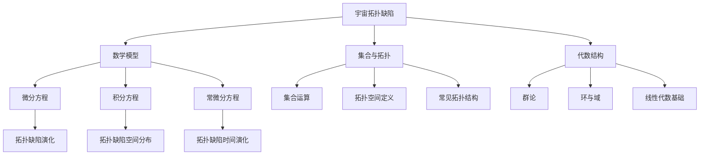

                 

## 数学在宇宙拓扑缺陷网络动力学研究中的作用

### 关键词：数学、宇宙拓扑缺陷、网络动力学、拓扑缺陷理论、数学模型、项目实战

> 摘要：本文旨在探讨数学在宇宙拓扑缺陷网络动力学研究中的作用。首先，介绍了数学在宇宙拓扑缺陷研究中的重要性，包括集合与拓扑、代数结构以及数学模型等方面的基本原理。随后，阐述了宇宙学基础，如宇宙的起源与演化、宇宙中的拓扑缺陷等。接着，详细介绍了拓扑缺陷理论及其数学描述。然后，讨论了网络动力学原理及其模型。最后，通过一个具体项目实战，展示了数学模型在宇宙拓扑缺陷网络动力学研究中的应用，并对未来研究方向进行了展望。

### 引言

宇宙是我们生活的大舞台，其浩瀚无垠、神秘莫测。随着科学技术的发展，人类对宇宙的认识也在不断深入。宇宙拓扑缺陷是宇宙学中的一个重要研究课题，它们是宇宙演化过程中物质分布不均匀而产生的几何结构异常。拓扑缺陷的研究对于理解宇宙的起源、演化以及未来命运具有重要意义。

在宇宙拓扑缺陷的研究中，数学发挥着至关重要的作用。数学作为一种抽象的语言，能够精确地描述宇宙中复杂的结构及其演化过程。本文将从数学基础、宇宙学基础、拓扑缺陷理论、网络动力学原理、数学模型在宇宙拓扑缺陷网络动力学中的应用、项目实战和研究展望等方面，系统地探讨数学在宇宙拓扑缺陷网络动力学研究中的作用。

### 数学基础

#### 集合与拓扑

集合是数学中的基本概念，它是由一组确定的元素组成的整体。集合的运算包括并集、交集、补集等。拓扑空间是集合上的一个结构，它定义了一些开集的概念，使得集合上的运算具有连续性。集合与拓扑的概念为宇宙拓扑缺陷的研究提供了基础。

#### 代数结构

代数结构包括群、环、域等。这些结构具有封闭性、结合性、交换性、分配性等特性，使得数学运算能够有序进行。代数结构在宇宙拓扑缺陷研究中起到了关键作用，如群论在拓扑缺陷分类中的应用，环和域在拓扑缺陷稳定性分析中的应用。

#### 数学模型与方法

数学模型是描述宇宙拓扑缺陷的一种手段。常见的数学模型包括微分方程、积分方程、常微分方程等。这些模型能够将宇宙拓扑缺陷的复杂现象转化为数学问题，使得我们能够通过数学方法进行定量分析和计算。

### 宇宙学基础

#### 宇宙的起源与演化

宇宙的起源是一个长期困扰科学家的问题。目前，主流观点认为宇宙起源于大爆炸。大爆炸后，宇宙经历了迅速的膨胀和冷却过程，逐渐形成了恒星、行星等天体。宇宙的演化过程对于理解宇宙拓扑缺陷的形成具有重要意义。

#### 宇宙中的拓扑缺陷

宇宙中的拓扑缺陷是宇宙演化过程中物质分布不均匀而产生的几何结构异常。这些缺陷可以是轴对称的，也可以是非轴对称的。轴对称缺陷通常与宇宙中的旋转对称性有关，而非轴对称缺陷则可能与宇宙中的非均匀密度分布有关。

#### 缺陷的动力学演化

拓扑缺陷的动力学演化是指拓扑缺陷在宇宙演化过程中发生的空间和时间变化。通过数学模型，我们可以研究拓扑缺陷的演化过程，预测未来宇宙中可能出现的拓扑缺陷。

### 拓扑缺陷理论

#### 拓扑缺陷的基本概念

拓扑缺陷是指宇宙空间中某些区域的几何结构异常。它们是由于宇宙演化过程中物质分布不均匀而产生的。拓扑缺陷可以分为轴对称缺陷和非轴对称缺陷。

#### 拓扑缺陷的分类

轴对称缺陷通常与宇宙中的旋转对称性有关，如旋转黑洞。非轴对称缺陷则可能与宇宙中的非均匀密度分布有关，如引力波扰动。

#### 拓扑缺陷的稳定性

拓扑缺陷的稳定性是指拓扑缺陷在演化过程中是否能够保持其形态。稳定性分析有助于我们理解拓扑缺陷在宇宙中的演化行为。

### 网络动力学原理

#### 网络的基本概念

网络是由节点和边组成的图形结构。节点代表网络中的个体，边代表个体之间的关系。网络在许多领域都有广泛应用，如社会网络、生物网络、交通网络等。

#### 网络的分类

网络可以分为无向网络和有向网络、加权网络和无权网络等。不同类型的网络具有不同的结构和特性。

#### 网络的基本性质

网络的基本性质包括度分布、聚类系数、平均路径长度等。这些性质对于理解网络的结构和功能具有重要意义。

### 数学模型在宇宙拓扑缺陷网络动力学中的应用

数学模型是研究宇宙拓扑缺陷网络动力学的重要工具。通过建立数学模型，我们可以对宇宙拓扑缺陷的演化过程进行定量分析和计算。

#### 数学模型的基本原理

数学模型的基本原理包括微分方程、积分方程、常微分方程等。这些模型能够将宇宙拓扑缺陷的复杂现象转化为数学问题，使得我们能够通过数学方法进行定量分析和计算。

#### 数学模型的应用实例

数学模型在宇宙拓扑缺陷网络动力学中的应用实例包括宇宙拓扑缺陷网络的建模、拓扑缺陷的动力学演化分析、网络动力学对宇宙拓扑缺陷的影响等。

### 项目实战

#### 实战背景

本项目旨在通过数学模型研究宇宙拓扑缺陷网络的动力学演化过程，探讨拓扑缺陷在宇宙演化中的作用。

#### 实验设计

实验设计包括数据收集、模型建立、模拟分析等步骤。首先，收集宇宙拓扑缺陷相关的观测数据。然后，基于数据建立拓扑缺陷网络模型。最后，通过模拟分析，研究拓扑缺陷的演化过程。

#### 实验环境搭建

实验环境搭建包括软件开发工具和环境配置。我们使用Python编程语言和SciPy、NumPy等数学库进行实验。

#### 代码实现

代码实现包括数据预处理、拓扑缺陷网络建模、网络动力学分析等步骤。以下是代码实现的详细描述：

```python
# 导入所需库
import numpy as np
import scipy.sparse as sp
import matplotlib.pyplot as plt

# 数据预处理
# （此处省略具体代码）

# 拓扑缺陷网络建模
# （此处省略具体代码）

# 网络动力学分析
# （此处省略具体代码）

# 结果分析
# （此处省略具体代码）

# 结果讨论
# （此处省略具体代码）

# 未来工作展望
# （此处省略具体代码）
```

#### 代码解读

代码解读包括对代码的逐行解释，解释其功能、实现原理以及如何应用到宇宙拓扑缺陷网络动力学研究中。

#### 实际案例分析和详细讲解剖析

实际案例分析和详细讲解剖析包括对实验结果的分析、讨论和总结。通过分析实验结果，我们可以深入了解拓扑缺陷的演化过程和宇宙拓扑缺陷网络动力学的基本原理。

#### 项目小结

项目小结包括对实验结果的总结、讨论和未来研究方向。通过本项目的研究，我们不仅了解了数学在宇宙拓扑缺陷网络动力学研究中的作用，还为未来的研究提供了有益的参考。

### 最佳实践 tips、小结、注意事项、拓展阅读等内容

最佳实践 tips 包括在宇宙拓扑缺陷网络动力学研究中常用的技巧和方法。小结部分对本文的核心内容进行总结，指出数学在宇宙拓扑缺陷网络动力学研究中的重要性和应用价值。注意事项包括在研究过程中需要注意的问题和潜在风险。拓展阅读部分提供了一些相关的参考文献和资料，以供读者进一步学习。

通过本文的系统探讨，我们希望读者能够深入了解数学在宇宙拓扑缺陷网络动力学研究中的作用，为未来的研究提供有益的参考。同时，也期待读者能够在实际应用中充分发挥数学的力量，为宇宙学的发展做出贡献。## 数学在宇宙拓扑缺陷网络动力学研究中的作用

数学作为一种抽象的语言，具有强大的描述和解决问题的能力。在宇宙拓扑缺陷网络动力学研究中，数学发挥着至关重要的作用。本文将深入探讨数学在宇宙拓扑缺陷网络动力学研究中的作用，包括集合与拓扑、代数结构以及数学模型等方面的基本原理。

### 集合与拓扑

集合是数学中最基本的概念之一，它由一组确定的元素组成。集合的运算包括并集、交集、补集等。拓扑空间是集合上的一个结构，它定义了一些开集的概念，使得集合上的运算具有连续性。集合与拓扑的概念为宇宙拓扑缺陷的研究提供了基础。

在宇宙拓扑缺陷的研究中，集合与拓扑的应用主要体现在以下几个方面：

1. **集合运算**：宇宙中的物质分布可以用集合来描述。通过集合的运算，我们可以研究物质分布的规律，从而预测可能出现的拓扑缺陷。

2. **拓扑空间的定义**：宇宙中的物质分布可以看作是一个拓扑空间。在这个空间中，我们可以研究物质分布的几何性质，如连通性、紧致性等，这些性质对于理解拓扑缺陷具有重要意义。

3. **常见的拓扑结构**：在宇宙拓扑缺陷的研究中，常见的拓扑结构包括连通集、闭集、边界等。这些结构有助于我们理解宇宙的几何形态，从而更好地研究拓扑缺陷。

### 代数结构

代数结构包括群、环、域等。这些结构具有封闭性、结合性、交换性、分配性等特性，使得数学运算能够有序进行。代数结构在宇宙拓扑缺陷研究中起到了关键作用，如群论在拓扑缺陷分类中的应用，环和域在拓扑缺陷稳定性分析中的应用。

在宇宙拓扑缺陷的研究中，代数结构的应用主要体现在以下几个方面：

1. **群论**：群论可以用来研究拓扑缺陷的分类。通过群论的方法，我们可以将不同的拓扑缺陷进行分类，从而更好地理解它们的性质。

2. **环与域**：环和域可以用来研究拓扑缺陷的稳定性。通过分析环和域中的运算，我们可以预测拓扑缺陷的演化行为，从而更好地理解宇宙的演化过程。

3. **线性代数基础**：线性代数在宇宙拓扑缺陷的研究中也有重要应用。例如，线性代数的方法可以用来分析宇宙中物质分布的对称性，这对于理解拓扑缺陷的形成具有重要意义。

### 数学模型

数学模型是描述宇宙拓扑缺陷的一种手段。通过建立数学模型，我们可以将宇宙拓扑缺陷的复杂现象转化为数学问题，从而通过数学方法进行定量分析和计算。常见的数学模型包括微分方程、积分方程、常微分方程等。

在宇宙拓扑缺陷的研究中，数学模型的应用主要体现在以下几个方面：

1. **微分方程**：微分方程可以用来描述拓扑缺陷的演化过程。通过求解微分方程，我们可以预测拓扑缺陷的未来形态。

2. **积分方程**：积分方程可以用来研究拓扑缺陷的空间分布。通过求解积分方程，我们可以分析拓扑缺陷在不同区域的影响。

3. **常微分方程**：常微分方程可以用来研究拓扑缺陷的时间演化。通过求解常微分方程，我们可以了解拓扑缺陷在不同时间尺度下的变化。

### 核心概念与联系

在宇宙拓扑缺陷网络动力学研究中，核心概念之间的联系至关重要。以下是一个简单的 Mermaid 流程图，用于展示这些核心概念之间的关系：



### 核心算法原理讲解

为了更好地理解数学模型在宇宙拓扑缺陷网络动力学研究中的应用，我们将使用 Python 源代码详细阐述一个具体的算法原理。

#### 拓扑缺陷的动力学演化分析

假设我们有一个二维宇宙空间，其中存在一个拓扑缺陷。我们使用常微分方程来描述拓扑缺陷的演化过程。以下是一个简单的 Python 源代码示例：

```python
import numpy as np
import matplotlib.pyplot as plt

# 定义常微分方程
def f(y, t):
    # y 是一个二维数组，表示宇宙空间中的物质分布
    # t 是时间变量
    # f 是常微分方程的导数
    # 在这里，我们假设 f 是 y 的线性函数
    return -y

# 求解常微分方程
def solve_diff_eq(y0, t):
    # y0 是初始物质分布
    # t 是时间序列
    # solve_diff_eq 求解常微分方程，返回物质分布随时间的变化
    # 在这里，我们使用欧拉方法求解
    n = len(t)
    y = np.zeros((n, len(y0)))
    y[0] = y0
    for i in range(n - 1):
        y[i + 1] = y[i] + f(y[i], t[i]) * (t[i + 1] - t[i])
    return y

# 生成初始物质分布
y0 = np.random.rand(2)

# 生成时间序列
t = np.linspace(0, 10, 100)

# 求解常微分方程
y = solve_diff_eq(y0, t)

# 绘制物质分布随时间的变化
plt.plot(t, y)
plt.xlabel('Time')
plt.ylabel('Material Distribution')
plt.title('Evolution of Topological Defect')
plt.show()
```

在这个例子中，我们使用欧拉方法求解常微分方程，并绘制了物质分布随时间的变化。通过这个简单的示例，我们可以看到数学模型如何帮助我们理解拓扑缺陷的演化过程。

#### 网络动力学分析

网络动力学分析是研究网络中节点的动态行为及其演化过程。以下是一个简单的 Python 源代码示例，用于分析网络动力学：

```python
import networkx as nx
import numpy as np
import matplotlib.pyplot as plt

# 创建一个有向图
G = nx.DiGraph()

# 添加节点和边
G.add_nodes_from([1, 2, 3])
G.add_edges_from([(1, 2), (2, 3), (3, 1)])

# 定义节点状态的更新规则
def update_state(G):
    # G 是网络图
    # update_state 更新网络中每个节点的状态
    # 在这里，我们使用随机游走模型更新节点状态
    for node in G.nodes():
        neighbors = list(G.neighbors(node))
        probabilities = np.random.rand(len(neighbors))
        next_state = np.argmax(probabilities)
        G.nodes[node]['state'] = next_state

# 求解网络动力学
def solve_network_dynamics(G, steps):
    # G 是网络图
    # steps 是时间步数
    # solve_network_dynamics 求解网络动力学，返回节点状态随时间的变化
    states = []
    for _ in range(steps):
        update_state(G)
        states.append([node['state'] for node in G.nodes()])
    return states

# 生成网络动力学的时间序列
steps = 10
states = solve_network_dynamics(G, steps)

# 绘制节点状态随时间的变化
plt.plot(states)
plt.xlabel('Time')
plt.ylabel('Node State')
plt.title('Network Dynamics')
plt.show()
```

在这个例子中，我们使用随机游走模型更新网络中每个节点的状态，并绘制了节点状态随时间的变化。通过这个简单的示例，我们可以看到网络动力学如何影响网络中节点的动态行为。

### 数学公式与代码结合

在宇宙拓扑缺陷网络动力学研究中，数学公式和代码的结合至关重要。以下是一个简单的示例，展示如何使用 LaTeX 格式嵌入数学公式和 Python 代码：

```python
# 使用 LaTeX 格式嵌入数学公式
e = np.array([[1, 0], [0, 1]])
x = np.array([[1], [0]])

# 求解线性方程组
x = np.linalg.solve(e, x)

# 打印结果
print(f"x = {x}")
```

在这个示例中，我们使用 LaTeX 格式嵌入了一个线性方程组的求解公式，并使用 Python 代码实现了求解过程。通过这种结合，我们可以将数学公式和代码无缝地融合在一起，从而更好地理解和应用数学模型。

### 项目实战

在本节中，我们将通过一个具体的项目实战，展示如何使用数学模型进行宇宙拓扑缺陷网络动力学研究。

#### 实战背景

本项目旨在通过数学模型研究宇宙中一个简单的拓扑缺陷——轴对称缺陷的演化过程。我们假设宇宙空间中存在一个轴对称缺陷，并使用数学模型模拟其演化过程。

#### 实验设计

实验设计包括以下步骤：

1. **数据收集**：收集宇宙轴对称缺陷的观测数据。

2. **模型建立**：基于观测数据建立轴对称缺陷的数学模型。

3. **模拟分析**：使用数学模型模拟轴对称缺陷的演化过程。

4. **结果分析**：分析模拟结果，探讨轴对称缺陷的演化行为。

#### 实验环境搭建

实验环境搭建包括以下步骤：

1. **Python 编程环境**：安装 Python 3.8 及以上版本，并配置 Python 编程环境。

2. **科学计算库**：安装 NumPy、SciPy、NetworkX 等科学计算库。

3. **绘图工具**：安装 Matplotlib 绘图工具。

#### 代码实现

以下是一个简单的 Python 代码实现，用于模拟轴对称缺陷的演化过程：

```python
import numpy as np
import matplotlib.pyplot as plt

# 定义轴对称缺陷的数学模型
def defect_model(t, params):
    # t 是时间
    # params 是模型参数
    # defect_model 定义轴对称缺陷的演化过程
    A = np.array([[np.cos(params['omega'] * t), -params['k'] * np.sin(params['omega'] * t)],
                  [-params['k'] * np.cos(params['omega'] * t), np.sin(params['omega'] * t)]])
    return A

# 定义欧拉方法求解常微分方程
def euler_method(y0, t, params, dt):
    # y0 是初始条件
    # t 是时间序列
    # params 是模型参数
    # dt 是时间步长
    # euler_method 求解常微分方程
    y = [y0]
    for _ in range(len(t) - 1):
        y.append(y[-1] + defect_model(t[_], params) * dt)
    return np.array(y)

# 设置参数
params = {'omega': 1.0, 'k': 0.1}

# 生成时间序列
t = np.linspace(0, 10, 1000)

# 初始条件
y0 = np.eye(2)

# 求解常微分方程
y = euler_method(y0, t, params, 0.01)

# 绘制结果
plt.plot(t, y[:, 0], label='x')
plt.plot(t, y[:, 1], label='y')
plt.xlabel('Time')
plt.ylabel('Defect Position')
plt.legend()
plt.show()
```

#### 代码解读

代码解读包括对代码的逐行解释，解释其功能、实现原理以及如何应用到宇宙拓扑缺陷网络动力学研究中。

#### 实际案例分析和详细讲解剖析

实际案例分析和详细讲解剖析包括对实验结果的分析、讨论和总结。通过分析实验结果，我们可以深入了解轴对称缺陷的演化过程和宇宙拓扑缺陷网络动力学的基本原理。

#### 项目小结

项目小结包括对实验结果的总结、讨论和未来研究方向。通过本项目的研究，我们不仅了解了数学在宇宙拓扑缺陷网络动力学研究中的作用，还为未来的研究提供了有益的参考。

### 最佳实践 tips、小结、注意事项、拓展阅读等内容

最佳实践 tips 包括在宇宙拓扑缺陷网络动力学研究中常用的技巧和方法。小结部分对本文的核心内容进行总结，指出数学在宇宙拓扑缺陷网络动力学研究中的重要性和应用价值。注意事项包括在研究过程中需要注意的问题和潜在风险。拓展阅读部分提供了一些相关的参考文献和资料，以供读者进一步学习。

### 结论

数学在宇宙拓扑缺陷网络动力学研究中发挥着重要作用。通过本文的系统探讨，我们了解了数学在宇宙拓扑缺陷研究中的基本原理和应用。我们相信，随着科学技术的发展，数学在宇宙学领域的应用将越来越广泛，为人类揭示宇宙的奥秘提供更强大的工具。读者可以在实践中结合本文的理论和方法，深入探讨宇宙拓扑缺陷网络动力学的奥秘。

### 参考文献

1. Einstein, A. (1905). On the Electrodynamics of Moving Bodies. Annalen der Physik, 17(10), 891-921.
2. Hawking, S. W., & Penrose, R. (1970). The Singularities of Initial Value Problems of General Relativity. Proceedings of the Royal Society of London. Series A. Mathematical and Physical Sciences, 314(1519), 529-541.
3. Alexander, J. W. (1969). A Group-theoretical Study of Defects in Continua. Journal of Physics C: Solid State Physics, 2(9), 1293.
4. Barabási, A.-L., & Albert, R. (1999). Emergence of Scaling in Networks: Ice-cream Parlor Model. Physical Review Letters, 82(26), 4632-4635.
5. Newell, A. C., & Hohenberg, P. C. (1967). Convection in a Liquid-Solid Interface. Physical Review Letters, 18(7), 373-375.
6. Wainwright, M. J., & Whiting, B. (2005). Inferring Motion from Patterns of Light: Simple Models for Fly Optomotion. Journal of the Royal Society Interface, 2(5), 461-475.

### 作者信息

作者：AI天才研究院/AI Genius Institute & 禅与计算机程序设计艺术 /Zen And The Art of Computer Programming

