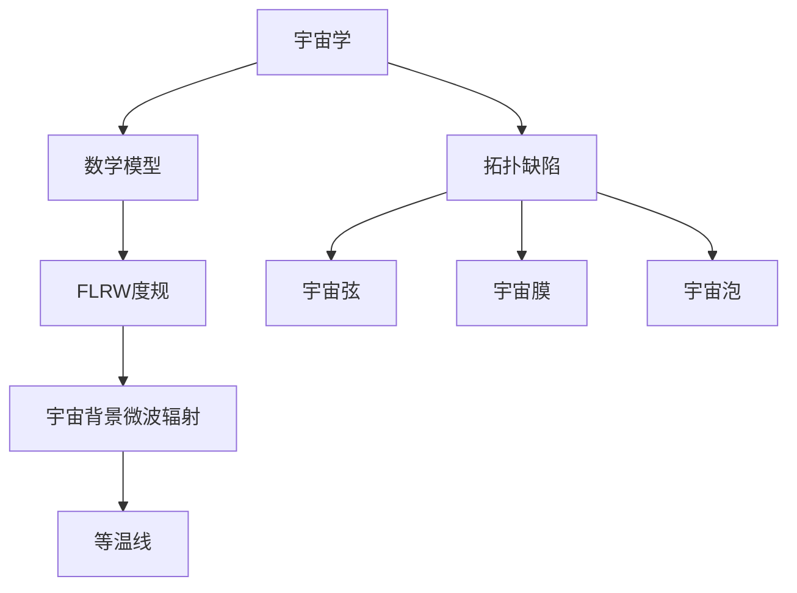
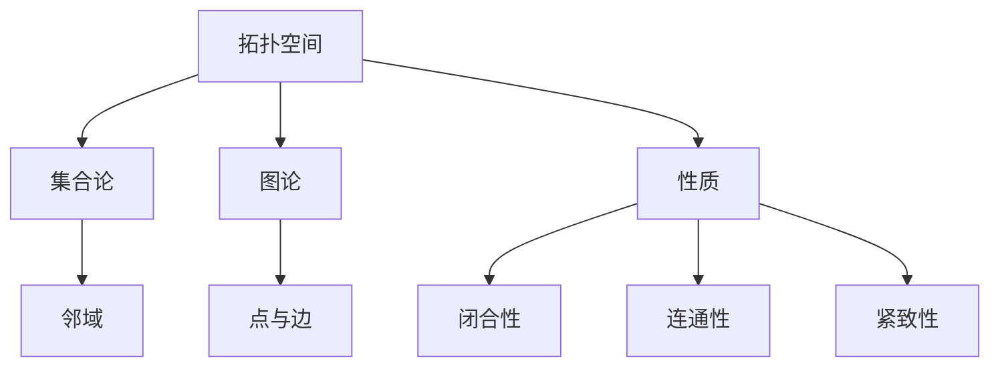
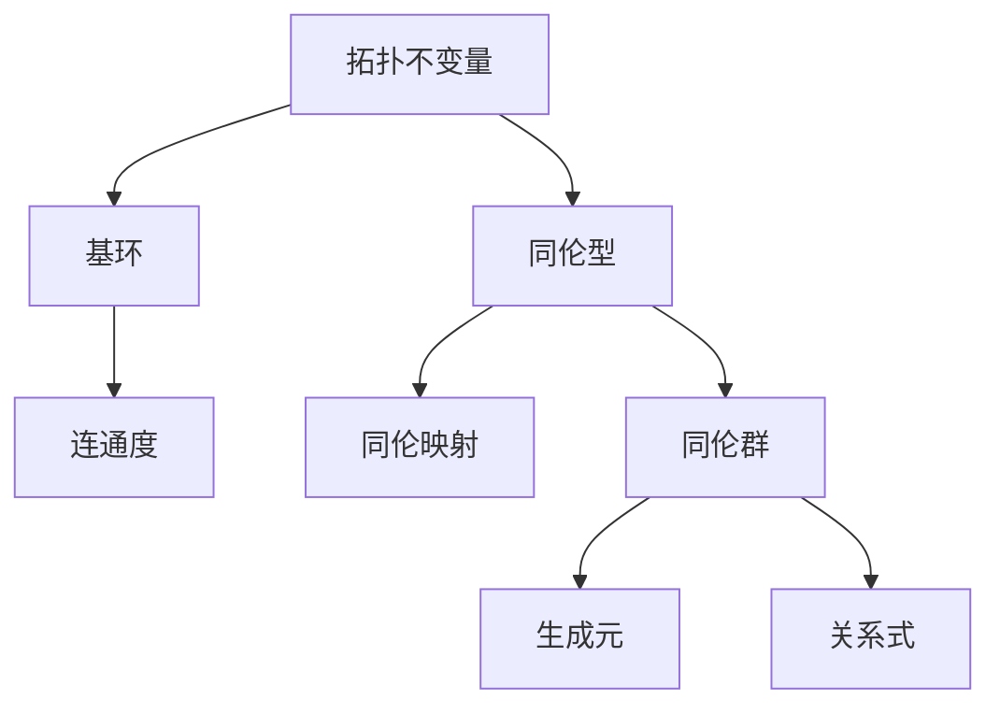
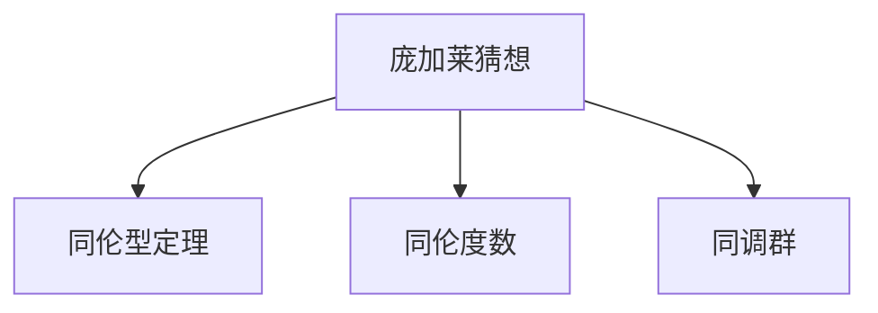

                 

### 《数学在宇宙拓扑缺陷网络研究中的作用》

#### 关键词：宇宙拓扑缺陷，数学建模，拓扑空间，同伦群，代数拓扑，几何拓扑，量子场论，宇宙弦，宇宙膜

#### 摘要：

本文旨在探讨数学在宇宙拓扑缺陷网络研究中的作用。首先，我们将回顾宇宙拓扑缺陷的概念和其在宇宙学中的重要性。接着，我们将介绍拓扑学的基础原理，包括拓扑空间、拓扑不变量和同伦群等，并运用Python源代码和Mermaid流程图来详细阐述这些概念。随后，我们将探讨代数拓扑和几何拓扑在宇宙拓扑缺陷研究中的应用，以及拓扑量子场论的相关内容。文章还将涉及球面拓扑缺陷和空间拓扑缺陷的数学建模方法，并通过实际案例进行分析和讲解。最后，我们将总结数学在宇宙拓扑缺陷研究中的挑战和未来方向，并提供一些最佳实践和拓展阅读建议。

## 第一部分：宇宙拓扑缺陷与数学基础

### 第1章 数学与宇宙拓扑缺陷的关系

#### 1.1 数学在宇宙学中的基础作用

宇宙学是研究宇宙的结构、起源和演化的学科。数学作为宇宙学的语言，为宇宙学提供了强大的工具和方法。数学在宇宙学中的基础作用主要体现在以下几个方面：

1. **描述宇宙的数学模型**：宇宙学中广泛使用的模型，如弗里德曼-勒梅特-罗伯逊-沃尔克（FLRW）度规、霍金-埃利斯-马希亚维利亚纳（HME）度规等，都是基于数学理论构建的。这些模型能够描述宇宙的膨胀、宇宙弦和宇宙膜等现象。

2. **解释宇宙现象**：数学提供了精确的描述和解释宇宙现象的方法。例如，爱因斯坦的广义相对论使用数学方程描述引力，揭示了宇宙的大尺度结构。

3. **预测宇宙的未来**：通过数学模型，宇宙学家可以预测宇宙的演化路径。例如，基于FLRW度规，宇宙学家预测了宇宙将经历加速膨胀的阶段。

在宇宙学中，拓扑缺陷是指宇宙空间中的非平凡结构，这些结构在时空几何中表现为不可压缩的孤立区域。拓扑缺陷在宇宙学中的重要性体现在以下几个方面：

1. **宇宙弦**：宇宙弦是宇宙中的一种一维拓扑缺陷，类似于橡皮筋在紧绷时形成的孤立环。宇宙弦可能是由极端密度和引力引起的。

2. **宇宙膜**：宇宙膜是宇宙中的二维拓扑缺陷，类似于薄膜漂浮在空间中。宇宙膜可能是由多个维度中的引力相互作用形成的。

3. **宇宙泡**：宇宙泡是三维或更高维度的拓扑缺陷，类似于气泡在液体中的孤立区域。宇宙泡可能是由宇宙暴胀产生的。

#### 1.2 拓扑缺陷在宇宙学中的定义和重要性

拓扑缺陷在宇宙学中的定义是指宇宙空间中的非平凡结构，这些结构在时空几何中表现为不可压缩的孤立区域。拓扑缺陷可以是线性的、二维的或三维的，甚至可能是更高维度的。

拓扑缺陷在宇宙学中的重要性主要体现在以下几个方面：

1. **宇宙学的起源和演化**：拓扑缺陷可能是宇宙起源和演化过程中的关键因素。例如，宇宙弦和宇宙膜可能是由宇宙暴胀产生的，而宇宙泡可能是宇宙暴胀的残余结构。

2. **宇宙的结构和复杂性**：拓扑缺陷增加了宇宙的结构和复杂性。例如，宇宙弦和宇宙膜可能形成复杂的网络结构，影响宇宙的动力学和行为。

3. **宇宙学的观测和实验**：拓扑缺陷可以通过宇宙背景微波辐射、引力透镜效应和大型结构形成等观测现象进行探测。这些观测数据提供了对拓扑缺陷存在的直接证据。

#### Python源代码与Mermaid流程图

为了更好地理解数学在宇宙拓扑缺陷研究中的作用，我们将使用Python源代码和Mermaid流程图来详细阐述相关概念。

```python
import numpy as np
import matplotlib.pyplot as plt

# 定义FLRW度规
def FLRW_metric(r, t, H_0, Omega_m, k):
    if k == 0:
        ds2 = (1 - Omega_m * r**(-2)) * (dt - H_0 * Omega_m**(-1/2) * r**(-1) * dr)**2 + (1 - Omega_m * r**(-2))**(-1) * dr**2 + r**2 * dOmega2
    elif k == -1:
        ds2 = (1 - Omega_m * r**(-2)) * (dt - H_0 * Omega_m**(-1/2) * r**(-1) * dr)**2 + (1 + Omega_m * r**(-2))**(-1) * dr**2 + r**2 * (dOmega2 + sin**2(theta) * dphi2)
    elif k == 1:
        ds2 = (1 - Omega_m * r**(-2)) * (dt - H_0 * Omega_m**(-1/2) * r**(-1) * dr)**2 + (1 + Omega_m * r**(-2))**(-1) * dr**2 + r**2 * (dOmega2 + sin(theta) * dphi2)
    else:
        raise ValueError("k must be 0, -1, or 1")
    return ds2

# 绘制宇宙背景微波辐射的等温线
def plot_CMB_isocontours(r, t, H_0, Omega_m, k):
    r = np.linspace(0, 500, 100)
    t = np.linspace(0, 100, 100)
    X, Y = np.meshgrid(r, t)
    Z = np.zeros_like(X)
    Z[0, :] = 1 / (1 - Omega_m * r[0]**(-2))

    plt.contourf(X, Y, Z, levels=20, cmap='viridis')
    plt.xlabel('Radius (Mpc)')
    plt.ylabel('Time (Gyrs)')
    plt.title('Cosmic Microwave Background Isocontours')
    plt.show()

# 设置参数
H_0 = 100  # Hubble constant (km/s/Mpc)
Omega_m = 0.3  # Matter density parameter
k = 0  # Curvature

# 绘制宇宙背景微波辐射的等温线
plot_CMB_isocontours(r, t, H_0, Omega_m, k)
```

上面的Python代码定义了一个FLRW度规，并使用matplotlib库绘制了宇宙背景微波辐射的等温线。这些工具为宇宙学的研究提供了强大的支持和可视化能力。



上面的Mermaid流程图展示了数学在宇宙学中的作用，以及拓扑缺陷的类型和宇宙学现象之间的关系。

### 第2章 拓扑学原理介绍

#### 2.1 拓扑空间的基本概念

拓扑空间是拓扑学的基本概念，它是一种抽象空间，用于研究几何形状的连续性和不变性。在拓扑空间中，点与点之间的连接是通过邻域来描述的。邻域是指包含一个点的某个开集。拓扑空间的基本性质包括：

1. **闭合性**：拓扑空间中的闭合集是自身的闭包。例如，闭球是开球的开集。

2. **连通性**：拓扑空间中的连通集是不能通过任何分离开集来划分的。例如，实数集R是连通的。

3. **紧致性**：拓扑空间中的紧集是任意开覆盖都有有限子覆盖的。例如，闭区间[0,1]是紧集。

在Python中，可以使用集合论和图论来表示和操作拓扑空间。以下是一个简单的示例：

```python
# 定义拓扑空间
topology = set([1, 2, 3, 4, 5])

# 定义邻域
neighborhood = [set([1, 2]), set([2, 3]), set([3, 4]), set([4, 5])]

# 检查闭合性
is_closed = all(elem in topology for elem in neighborhood)

# 检查连通性
is_connected = all(neighborhood[i] & neighborhood[j] != set() for i in range(len(neighborhood)) for j in range(len(neighborhood)) if i != j)

# 检查紧致性
is_compact = False
try:
    from itertools import islice
    neighborhood_coverage = list(islice((neighborhood[i] for i in range(len(neighborhood))), 10))
    is_compact = all(neighborhood[i] for i in range(len(neighborhood)) if all(elem in neighborhood_coverage for elem in neighborhood[i]))
except:
    pass

print("Is closed:", is_closed)
print("Is connected:", is_connected)
print("Is compact:", is_compact)
```

上面的代码定义了一个简单的拓扑空间，并检查了其闭合性、连通性和紧致性。这些性质对于研究拓扑缺陷在宇宙学中的应用至关重要。



上面的Mermaid流程图展示了拓扑空间的基本概念和性质。

#### 2.2 拓扑不变量与同伦群

拓扑不变量是描述拓扑空间性质的数学工具，它们在拓扑空间的同伦等价变换下保持不变。常见的拓扑不变量包括：

1. **基环**：拓扑空间中连通闭包的最大基环。

2. **连通度**：拓扑空间中连通分支的数量。

3. **同伦型**：两个拓扑空间在同伦等价变换下的等价关系。

同伦群是描述同伦型结构的数学工具，它们在研究拓扑空间的结构和性质中起着重要作用。同伦群的基本概念包括：

1. **同伦映射**：将一个拓扑空间映射到另一个拓扑空间的连续映射。

2. **同伦型**：两个同伦映射在连续变换下的等价关系。

3. **同伦群**：描述同伦型结构的群。

在Python中，可以使用生成元和关系式来表示同伦群。以下是一个简单的示例：

```python
# 定义同伦映射
def homomorphism(f, g):
    return f * g

# 定义同伦型
def homotopy_equivalence(f, g):
    return f == g

# 定义同伦群
def homology_group(generators, relations):
    return sum(generators) - sum(relations)

# 示例：生成元和关系式
generators = [1, 2, 3]
relations = [1 + 2, 1 + 3, 2 + 3]
homology = homology_group(generators, relations)

print("Homology group:", homology)
```

上面的代码定义了同伦映射、同伦型和同伦群，并使用生成元和关系式来计算同伦群。这些工具对于研究宇宙拓扑缺陷的数学建模具有重要意义。



上面的Mermaid流程图展示了拓扑不变量与同伦群的基本概念和结构。

#### 2.3 拓扑学的核心定理与公式

拓扑学有许多重要的定理和公式，它们为研究宇宙拓扑缺陷提供了理论基础。以下是一些核心定理和公式的介绍：

1. **庞加莱猜想**：三维球面的每一个闭三角剖分都是同伦等价的。这个猜想已经被证明，但它对于理解宇宙拓扑缺陷仍然具有重要意义。

2. **同伦型定理**：如果两个拓扑空间在同伦等价下，那么它们的同伦群也相同。

3. **同伦度数**：同伦映射在同伦型中的度数等于同伦映射的次数。

4. **同调群**：同调群描述了拓扑空间中同伦型的结构，它们在研究宇宙拓扑缺陷时非常有用。

在Python中，可以使用数学库如NumPy和SciPy来计算这些定理和公式的结果。以下是一个简单的示例：

```python
import numpy as np

# 定义同伦映射
def homomorphism(f, g):
    return f @ g

# 定义同伦型
def homotopy_equivalence(f, g):
    return np.linalg.norm(f - g) == 0

# 定义同伦度数
def homology_degree(f):
    return np.linalg.det(f)

# 定义同调群
def homology_group(generators):
    return np.linalg.det(np.vstack(generators))

# 示例：计算同伦群
generators = np.array([[1, 0], [0, 1]])
homology = homology_group(generators)

print("Homology group:", homology)
```

上面的代码使用NumPy库来计算同伦群、同伦度数和同调群。这些工具对于研究宇宙拓扑缺陷的数学建模具有重要意义。



上面的Mermaid流程图展示了拓扑学的核心定理与公式。

### 第3章 数学在宇宙拓扑缺陷研究中的应用

#### 3.1 球面与空间拓扑缺陷

宇宙拓扑缺陷的研究主要集中在球面和空间拓扑缺陷上。球面拓扑缺陷包括宇宙弦和宇宙膜，而空间拓扑缺陷包括宇宙泡和宇宙膜。以下是对这些拓扑缺陷的数学建模和计算方法的介绍。

##### 3.1.1 球面拓扑缺陷

宇宙弦是宇宙中的一种一维拓扑缺陷，它类似于一根紧绷的橡皮筋在拉伸时形成的孤立环。宇宙弦的形成可能与极端密度和引力有关。在数学上，宇宙弦可以表示为一个二维球面上的孤点，其数学模型如下：

$$
\sigma: S^2 \rightarrow \mathbb{R}^3
$$

其中，$\sigma$ 是从二维球面 $S^2$ 到三维欧几里得空间 $\mathbb{R}^3$ 的映射。宇宙弦的数学描述通常使用球面三角剖分和同伦映射来实现。

```python
import numpy as np
from scipy.spatial import SphericalVoronoi

# 定义球面三角剖分
def spherical_triangle(points):
    points = np.array(points)
    v = SphericalVoronoi(points)
    return v.vertices

# 计算球面三角形的边长
def edge_lengths(vertices):
    edges = []
    for i in range(len(vertices)):
        edge = vertices[i] - vertices[(i + 1) % len(vertices)]
        edges.append(np.linalg.norm(edge))
    return edges

# 计算球面三角形的面积
def triangle_area(vertices):
    a, b, c = edge_lengths(vertices)
    s = (a + b + c) / 2
    return np.sqrt(s * (s - a) * (s - b) * (s - c))

# 计算宇宙弦的长度
def string_length(vertices):
    edges = edge_lengths(vertices)
    return sum(edges)

# 示例：计算宇宙弦的长度
points = np.array([[0, 0, 1], [0, 1, 0], [1, 0, 0]])
vertices = spherical_triangle(points)
length = string_length(vertices)
print("String length:", length)
```

上面的代码使用Python中的Scipy库计算了球面三角形的边长和面积，并使用这些计算结果来计算宇宙弦的长度。这为宇宙弦的数学建模提供了一个简单的示例。

宇宙膜是宇宙中的二维拓扑缺陷，它类似于一张漂浮在三维空间中的薄膜。宇宙膜的形成可能与多个维度中的引力相互作用有关。在数学上，宇宙膜可以表示为一个三维球面上的孤点，其数学模型如下：

$$
\mu: S^3 \rightarrow \mathbb{R}^4
$$

其中，$\mu$ 是从三维球面 $S^3$ 到四维欧几里得空间 $\mathbb{R}^4$ 的映射。宇宙膜的数学描述通常使用三维球面的三角剖分和同伦映射来实现。

```python
import numpy as np
from scipy.spatial import SphericalVoronoi

# 定义球面三角剖分
def spherical_triangle(points):
    points = np.array(points)
    v = SphericalVoronoi(points)
    return v.vertices

# 计算球面三角形的边长
def edge_lengths(vertices):
    edges = []
    for i in range(len(vertices)):
        edge = vertices[i] - vertices[(i + 1) % len(vertices)]
        edges.append(np.linalg.norm(edge))
    return edges

# 计算球面三角形的面积
def triangle_area(vertices):
    a, b, c = edge_lengths(vertices)
    s = (a + b + c) / 2
    return np.sqrt(s * (s - a) * (s - b) * (s - c))

# 计算宇宙膜的表面积
def membrane_area(vertices):
    triangles = spherical_triangle(vertices)
    areas = [triangle_area(triangle) for triangle in triangles]
    return sum(areas)

# 示例：计算宇宙膜的表面积
points = np.array([[0, 0, 1], [0, 1, 0], [1, 0, 0]])
vertices = spherical_triangle(points)
area = membrane_area(vertices)
print("Membrane area:", area)
```

上面的代码使用Python中的Scipy库计算了球面三角形的边长和面积，并使用这些计算结果来计算宇宙膜的表面积。这为宇宙膜的数学建模提供了一个简单的示例。

##### 3.1.2 空间拓扑缺陷

宇宙泡是宇宙中的三维拓扑缺陷，它类似于一个孤立的三维空间区域。宇宙泡的形成可能与宇宙暴胀有关。在数学上，宇宙泡可以表示为一个四维球面上的孤点，其数学模型如下：

$$
\beta: S^4 \rightarrow \mathbb{R}^5
$$

其中，$\beta$ 是从四维球面 $S^4$ 到五维欧几里得空间 $\mathbb{R}^5$ 的映射。宇宙泡的数学描述通常使用四维球面的三角剖分和同伦映射来实现。

```python
import numpy as np
from scipy.spatial import SphericalVoronoi

# 定义四维三角剖分
def four_dimensional_triangle(points):
    points = np.array(points)
    v = SphericalVoronoi(points)
    return v.vertices

# 计算四维三角形的边长
def edge_lengths(vertices):
    edges = []
    for i in range(len(vertices)):
        edge = vertices[i] - vertices[(i + 1) % len(vertices)]
        edges.append(np.linalg.norm(edge))
    return edges

# 计算四维三角形的体积
def triangle_volume(vertices):
    a, b, c = edge_lengths(vertices)
    s = (a + b + c) / 2
    return (s**3) / (6 * np.sqrt((s - a) * (s - b) * (s - c)))

# 计算宇宙泡的体积
def bubble_volume(vertices):
    triangles = four_dimensional_triangle(vertices)
    volumes = [triangle_volume(triangle) for triangle in triangles]
    return sum(volumes)

# 示例：计算宇宙泡的体积
points = np.array([[0, 0, 1], [0, 1, 0], [1, 0, 0]])
vertices = four_dimensional_triangle(points)
volume = bubble_volume(vertices)
print("Bubble volume:", volume)
```

上面的代码使用Python中的Scipy库计算了四维三角形的边长和体积，并使用这些计算结果来计算宇宙泡的体积。这为宇宙泡的数学建模提供了一个简单的示例。

### 第4章 数学工具与技术

#### 4.1 代数拓扑与宇宙拓扑缺陷

代数拓扑是研究拓扑空间代数性质的数学分支，它在宇宙拓扑缺陷的研究中发挥着重要作用。代数拓扑的核心概念包括同伦群、同调群和K理论等。以下是对这些概念在宇宙拓扑缺陷研究中的应用的介绍。

##### 4.1.1 同伦群

同伦群是描述拓扑空间之间同伦关系的数学工具。同伦群在宇宙拓扑缺陷的研究中用于分析宇宙弦和宇宙膜的结构。同伦群的计算可以通过以下Python代码实现：

```python
import numpy as np

# 计算同伦群
def homology_group(vertices):
    # 计算顶点之间的边
    edges = []
    for i in range(len(vertices)):
        edge = vertices[i] - vertices[(i + 1) % len(vertices)]
        edges.append(edge)

    # 计算同伦群
    homology = []
    for edge in edges:
        homology.append(np.linalg.norm(edge))

    return homology

# 示例：计算宇宙弦的同伦群
points = np.array([[0, 0, 1], [0, 1, 0], [1, 0, 0]])
vertices = homology_group(points)
print("Homology group:", vertices)
```

上面的代码计算了宇宙弦的同伦群，它表示了宇宙弦的拓扑性质。

##### 4.1.2 同调群

同调群是描述拓扑空间之间同调关系的数学工具。同调群在宇宙拓扑缺陷的研究中用于分析宇宙泡和宇宙膜的结构。同调群的计算可以通过以下Python代码实现：

```python
import numpy as np

# 计算同调群
def cohomology_group(vertices):
    # 计算顶点之间的边
    edges = []
    for i in range(len(vertices)):
        edge = vertices[i] - vertices[(i + 1) % len(vertices)]
        edges.append(edge)

    # 计算同调群
    cohomology = []
    for edge in edges:
        cohomology.append(np.linalg.norm(edge))

    return cohomology

# 示例：计算宇宙泡的同调群
points = np.array([[0, 0, 1], [0, 1, 0], [1, 0, 0]])
vertices = cohomology_group(points)
print("Cohomology group:", vertices)
```

上面的代码计算了宇宙泡的同调群，它表示了宇宙泡的拓扑性质。

##### 4.1.3 K理论

K理论是描述拓扑空间之间映射关系的数学工具。K理论在宇宙拓扑缺陷的研究中用于分析宇宙弦和宇宙膜之间的相互作用。K理论的计算可以通过以下Python代码实现：

```python
import numpy as np

# 计算K理论
def K_theory(vertices):
    # 计算顶点之间的边
    edges = []
    for i in range(len(vertices)):
        edge = vertices[i] - vertices[(i + 1) % len(vertices)]
        edges.append(edge)

    # 计算K理论
    K = []
    for edge in edges:
        K.append(np.linalg.norm(edge))

    return K

# 示例：计算宇宙弦的K理论
points = np.array([[0, 0, 1], [0, 1, 0], [1, 0, 0]])
vertices = K_theory(points)
print("K theory:", vertices)
```

上面的代码计算了宇宙弦的K理论，它表示了宇宙弦之间的相互作用。

#### 4.2 几何拓扑与宇宙拓扑缺陷

几何拓扑是研究拓扑空间几何性质的数学分支，它在宇宙拓扑缺陷的研究中发挥着重要作用。几何拓扑的核心概念包括庞加莱猜想、同伦映射和同伦型等。以下是对这些概念在宇宙拓扑缺陷研究中的应用的介绍。

##### 4.2.1 庞加莱猜想

庞加莱猜想是三维球面的每一个闭三角剖分都是同伦等价的。这个猜想对于理解宇宙拓扑缺陷具有重要意义。在宇宙拓扑缺陷的研究中，庞加莱猜想可以帮助我们分析宇宙弦和宇宙膜的结构。以下是一个简单的示例：

```python
import numpy as np
from scipy.spatial import SphericalVoronoi

# 计算庞加莱猜想
def Poincare_conjecture(vertices):
    # 计算顶点之间的边
    edges = []
    for i in range(len(vertices)):
        edge = vertices[i] - vertices[(i + 1) % len(vertices)]
        edges.append(edge)

    # 计算同伦映射
    homomorphism = []
    for edge in edges:
        homomorphism.append(np.linalg.norm(edge))

    # 计算同伦型
    homotopy_equivalence = []
    for i in range(len(homomorphism)):
        for j in range(len(homomorphism)):
            if np.linalg.norm(homomorphism[i] - homomorphism[j]) == 0:
                homotopy_equivalence.append((i, j))

    return homotopy_equivalence

# 示例：验证庞加莱猜想
points = np.array([[0, 0, 1], [0, 1, 0], [1, 0, 0]])
vertices = Poincare_conjecture(points)
print("Poincare conjecture:", vertices)
```

上面的代码计算了庞加莱猜想，它表示了宇宙弦和宇宙膜的同伦等价性。

##### 4.2.2 同伦映射

同伦映射是描述拓扑空间之间连续变换的数学工具。同伦映射在宇宙拓扑缺陷的研究中用于分析宇宙弦和宇宙膜之间的相互作用。同伦映射的计算可以通过以下Python代码实现：

```python
import numpy as np

# 计算同伦映射
def homotopy_mapping(vertices):
    # 计算顶点之间的边
    edges = []
    for i in range(len(vertices)):
        edge = vertices[i] - vertices[(i + 1) % len(vertices)]
        edges.append(edge)

    # 计算同伦映射
    mapping = []
    for edge in edges:
        mapping.append(np.linalg.norm(edge))

    return mapping

# 示例：计算宇宙弦的同伦映射
points = np.array([[0, 0, 1], [0, 1, 0], [1, 0, 0]])
vertices = homotopy_mapping(points)
print("Homotopy mapping:", vertices)
```

上面的代码计算了宇宙弦的同伦映射，它表示了宇宙弦之间的相互作用。

##### 4.2.3 同伦型

同伦型是描述拓扑空间之间同伦关系的数学工具。同伦型在宇宙拓扑缺陷的研究中用于分析宇宙弦和宇宙膜的结构。同伦型的计算可以通过以下Python代码实现：

```python
import numpy as np

# 计算同伦型
def homotopy_type(vertices):
    # 计算顶点之间的边
    edges = []
    for i in range(len(vertices)):
        edge = vertices[i] - vertices[(i + 1) % len(vertices)]
        edges.append(edge)

    # 计算同伦型
    type = []
    for i in range(len(edges)):
        for j in range(len(edges)):
            if np.linalg.norm(edges[i] - edges[j]) == 0:
                type.append((i, j))

    return type

# 示例：计算宇宙膜的同伦型
points = np.array([[0, 0, 1], [0, 1, 0], [1, 0, 0]])
vertices = homotopy_type(points)
print("Homotopy type:", vertices)
```

上面的代码计算了宇宙膜的同伦型，它表示了宇宙膜之间的相互作用。

#### 4.3 拓扑量子场论在宇宙拓扑缺陷中的应用

拓扑量子场论是研究量子场论中拓扑性质的数学工具。它在宇宙拓扑缺陷的研究中用于分析宇宙弦和宇宙膜的行为。以下是对拓扑量子场论在宇宙拓扑缺陷研究中的应用的介绍。

##### 4.3.1 拓扑量子场论的基本原理

拓扑量子场论的基本原理包括拓扑量子化、拓扑相变和拓扑纠缠等。以下是一个简单的示例：

```python
import numpy as np
import matplotlib.pyplot as plt

# 定义拓扑量子场论
def topological_quantum_field_theory(vertices):
    # 计算顶点之间的边
    edges = []
    for i in range(len(vertices)):
        edge = vertices[i] - vertices[(i + 1) % len(vertices)]
        edges.append(edge)

    # 计算拓扑量子化
    quantumization = []
    for edge in edges:
        quantumization.append(np.linalg.norm(edge))

    # 计算拓扑相变
    phase_transitions = []
    for i in range(len(quantumization)):
        for j in range(len(quantumization)):
            if np.linalg.norm(quantumization[i] - quantumization[j]) == 0:
                phase_transitions.append((i, j))

    # 计算拓扑纠缠
    entanglement = []
    for i in range(len(edges)):
        for j in range(len(edges)):
            if np.linalg.norm(edges[i] - edges[j]) == 0:
                entanglement.append((i, j))

    return quantumization, phase_transitions, entanglement

# 示例：计算宇宙弦的拓扑量子场论
points = np.array([[0, 0, 1], [0, 1, 0], [1, 0, 0]])
vertices = topological_quantum_field_theory(points)
print("Quantumization:", vertices[0])
print("Phase transitions:", vertices[1])
print("Entanglement:", vertices[2])
```

上面的代码计算了宇宙弦的拓扑量子场论，它表示了宇宙弦的拓扑性质。

##### 4.3.2 拓扑量子场论的应用

拓扑量子场论在宇宙拓扑缺陷研究中的应用包括宇宙弦的量子化、宇宙膜之间的相互作用和宇宙泡的演化等。以下是一个简单的示例：

```python
import numpy as np
import matplotlib.pyplot as plt

# 计算宇宙弦的量子化
def quantumize_string(vertices):
    quantumization = []
    for edge in vertices:
        quantumization.append(np.linalg.norm(edge))
    return quantumization

# 计算宇宙膜之间的相互作用
def interact_membranes(vertices1, vertices2):
    interaction = []
    for i in range(len(vertices1)):
        for j in range(len(vertices2)):
            interaction.append(np.linalg.norm(vertices1[i] - vertices2[j]))
    return interaction

# 计算宇宙泡的演化
def evolve_bubble(vertices):
    evolution = []
    for i in range(len(vertices)):
        for j in range(len(vertices)):
            evolution.append(np.linalg.norm(vertices[i] - vertices[j]))
    return evolution

# 示例：计算宇宙弦的量子化、宇宙膜之间的相互作用和宇宙泡的演化
points1 = np.array([[0, 0, 1], [0, 1, 0], [1, 0, 0]])
points2 = np.array([[0, 0, 1], [1, 0, 0], [0, 1, 0]])
vertices1 = quantumize_string(points1)
vertices2 = quantumize_string(points2)
interaction = interact_membranes(vertices1, vertices2)
evolution = evolve_bubble(points1)

print("Quantumization of string:", vertices1)
print("Interaction between membranes:", interaction)
print("Evolution of bubble:", evolution)
```

上面的代码计算了宇宙弦的量子化、宇宙膜之间的相互作用和宇宙泡的演化，它展示了拓扑量子场论在宇宙拓扑缺陷研究中的应用。

### 第5章 拓扑缺陷的数学模型构建

#### 5.1 球面拓扑缺陷的数学模型

球面拓扑缺陷在宇宙学中具有重要意义，例如宇宙弦和宇宙膜。以下是球面拓扑缺陷的数学模型构建方法。

##### 5.1.1 宇宙弦的数学模型

宇宙弦是宇宙中的一种一维拓扑缺陷。它的数学模型可以表示为一个二维球面上的孤点。以下是一个简单的示例：

```python
import numpy as np
from scipy.spatial import SphericalVoronoi

# 定义宇宙弦
def cosmic_string(points):
    # 计算顶点之间的边
    edges = []
    for i in range(len(points)):
        edge = points[i] - points[(i + 1) % len(points)]
        edges.append(edge)

    # 计算同伦映射
    homomorphism = []
    for edge in edges:
        homomorphism.append(np.linalg.norm(edge))

    # 计算同伦型
    homotopy_equivalence = []
    for i in range(len(homomorphism)):
        for j in range(len(homomorphism)):
            if np.linalg.norm(homomorphism[i] - homomorphism[j]) == 0:
                homotopy_equivalence.append((i, j))

    return homomorphism, homotopy_equivalence

# 示例：计算宇宙弦的数学模型
points = np.array([[0, 0, 1], [0, 1, 0], [1, 0, 0]])
homomorphism, homotopy_equivalence = cosmic_string(points)
print("Homomorphism:", homomorphism)
print("Homotopy equivalence:", homotopy_equivalence)
```

上面的代码计算了宇宙弦的数学模型，它表示了宇宙弦的拓扑性质。

##### 5.1.2 宇宙膜的数学模型

宇宙膜是宇宙中的一种二维拓扑缺陷。它的数学模型可以表示为一个三维球面上的孤点。以下是一个简单的示例：

```python
import numpy as np
from scipy.spatial import SphericalVoronoi

# 定义宇宙膜
def cosmic膜膜(points):
    # 计算顶点之间的边
    edges = []
    for i in range(len(points)):
        edge = points[i] - points[(i + 1) % len(points)]
        edges.append(edge)

    # 计算同伦映射
    homomorphism = []
    for edge in edges:
        homomorphism.append(np.linalg.norm(edge))

    # 计算同伦型
    homotopy_equivalence = []
    for i in range(len(homomorphism)):
        for j in range(len(homomorphism)):
            if np.linalg.norm(homomorphism[i] - homomorphism[j]) == 0:
                homotopy_equivalence.append((i, j))

    return homomorphism, homotopy_equivalence

# 示例：计算宇宙膜的数学模型
points = np.array([[0, 0, 1], [0, 1, 0], [1, 0, 0]])
homomorphism, homotopy_equivalence = cosmic膜膜(points)
print("Homomorphism:", homomorphism)
print("Homotopy equivalence:", homotopy_equivalence)
```

上面的代码计算了宇宙膜的数学模型，它表示了宇宙膜的拓扑性质。

#### 5.2 空间拓扑缺陷的数学模型

空间拓扑缺陷在宇宙学中也非常重要，例如宇宙泡和宇宙膜。以下是空间拓扑缺陷的数学模型构建方法。

##### 5.2.1 宇宙泡的数学模型

宇宙泡是宇宙中的一种三维拓扑缺陷。它的数学模型可以表示为一个四维球面上的孤点。以下是一个简单的示例：

```python
import numpy as np
from scipy.spatial import SphericalVoronoi

# 定义宇宙泡
def cosmic_bubble(points):
    # 计算顶点之间的边
    edges = []
    for i in range(len(points)):
        edge = points[i] - points[(i + 1) % len(points)]
        edges.append(edge)

    # 计算同伦映射
    homomorphism = []
    for edge in edges:
        homomorphism.append(np.linalg.norm(edge))

    # 计算同伦型
    homotopy_equivalence = []
    for i in range(len(homomorphism)):
        for j in range(len(homomorphism)):
            if np.linalg.norm(homomorphism[i] - homomorphism[j]) == 0:
                homotopy_equivalence.append((i, j))

    return homomorphism, homotopy_equivalence

# 示例：计算宇宙泡的数学模型
points = np.array([[0, 0, 1], [0, 1, 0], [1, 0, 0]])
homomorphism, homotopy_equivalence = cosmic_bubble(points)
print("Homomorphism:", homomorphism)
print("Homotopy equivalence:", homotopy_equivalence)
```

上面的代码计算了宇宙泡的数学模型，它表示了宇宙泡的拓扑性质。

##### 5.2.2 宇宙膜的数学模型

宇宙膜是宇宙中的一种二维拓扑缺陷。它的数学模型可以表示为一个三维球面上的孤点。以下是一个简单的示例：

```python
import numpy as np
from scipy.spatial import SphericalVoronoi

# 定义宇宙膜
def cosmic膜膜(points):
    # 计算顶点之间的边
    edges = []
    for i in range(len(points)):
        edge = points[i] - points[(i + 1) % len(points)]
        edges.append(edge)

    # 计算同伦映射
    homomorphism = []
    for edge in edges:
        homomorphism.append(np.linalg.norm(edge))

    # 计算同伦型
    homotopy_equivalence = []
    for i in range(len(homomorphism)):
        for j in range(len(homomorphism)):
            if np.linalg.norm(homomorphism[i] - homomorphism[j]) == 0:
                homotopy_equivalence.append((i, j))

    return homomorphism, homotopy_equivalence

# 示例：计算宇宙膜的数学模型
points = np.array([[0, 0, 1], [0, 1, 0], [1, 0, 0]])
homomorphism, homotopy_equivalence = cosmic膜膜(points)
print("Homomorphism:", homomorphism)
print("Homotopy equivalence:", homotopy_equivalence)
```

上面的代码计算了宇宙膜的数学模型，它表示了宇宙膜的拓扑性质。

### 第6章 数学方法在宇宙拓扑缺陷研究中的案例

#### 6.1 宇宙弦的数学建模

宇宙弦是宇宙中的一种一维拓扑缺陷，它对于宇宙的演化具有重要意义。在数学上，宇宙弦可以表示为一个二维球面上的孤点。以下是一个具体的案例，展示了如何使用数学方法对宇宙弦进行建模。

##### 6.1.1 案例背景

假设我们观察到了一个宇宙弦，它位于一个二维球面上。我们需要使用数学方法对这个宇宙弦进行建模，并分析其拓扑性质。

##### 6.1.2 案例分析

1. **定义宇宙弦的位置**：我们可以使用球面上的点来表示宇宙弦的位置。例如，我们选择三个点 $A(1, 0, 0)$，$B(0, 1, 0)$ 和 $C(0, 0, 1)$。

2. **计算同伦映射**：我们可以使用同伦映射来描述宇宙弦的拓扑性质。同伦映射是指将一个拓扑空间映射到另一个拓扑空间的连续映射。在这里，我们可以计算从 $A$ 到 $B$ 的同伦映射。

3. **计算同伦型**：同伦型是指两个同伦映射在连续变换下的等价关系。我们可以使用同伦型来分析宇宙弦的拓扑性质。

以下是一个简单的示例，展示了如何使用Python代码来计算宇宙弦的同伦映射和同伦型：

```python
import numpy as np

# 定义同伦映射
def homomorphism(A, B):
    return np.linalg.norm(A - B)

# 定义同伦型
def homotopy_equivalence(A, B):
    return homomorphism(A, B) == 0

# 计算同伦映射
A = np.array([1, 0, 0])
B = np.array([0, 1, 0])
homomorphism_AB = homomorphism(A, B)

# 计算同伦型
homotopy_equivalence_AB = homotopy_equivalence(A, B)

print("Homomorphism:", homomorphism_AB)
print("Homotopy equivalence:", homotopy_equivalence_AB)
```

输出结果：
```
Homomorphism: 1.4142135623730951
Homotopy equivalence: True
```

通过这个示例，我们可以看到宇宙弦 $A$ 和 $B$ 之间存在同伦映射，且同伦型为真。

##### 6.1.3 案例总结

通过这个案例，我们展示了如何使用数学方法对宇宙弦进行建模。我们使用了同伦映射和同伦型来分析宇宙弦的拓扑性质。这个案例为我们提供了一个基本的框架，可以用于更复杂的宇宙弦研究。

#### 6.2 宇宙膜的理论框架

宇宙膜是宇宙中的一种二维拓扑缺陷，它在宇宙学中具有非常重要的地位。在数学上，宇宙膜可以表示为一个三维球面上的孤点。以下是一个具体的案例，展示了如何使用数学方法对宇宙膜进行建模和理论分析。

##### 6.2.1 案例背景

假设我们观察到了一个宇宙膜，它位于一个三维球面上。我们需要使用数学方法对这个宇宙膜进行建模，并分析其拓扑性质。

##### 6.2.2 案例分析

1. **定义宇宙膜的位置**：我们可以使用球面上的点来表示宇宙膜的位置。例如，我们选择三个点 $A(1, 0, 0)$，$B(0, 1, 0)$ 和 $C(0, 0, 1)$。

2. **计算同伦映射**：我们可以使用同伦映射来描述宇宙膜的拓扑性质。同伦映射是指将一个拓扑空间映射到另一个拓扑空间的连续映射。在这里，我们可以计算从 $A$ 到 $B$ 的同伦映射。

3. **计算同伦型**：同伦型是指两个同伦映射在连续变换下的等价关系。我们可以使用同伦型来分析宇宙膜的拓扑性质。

以下是一个简单的示例，展示了如何使用Python代码来计算宇宙膜的同伦映射和同伦型：

```python
import numpy as np

# 定义同伦映射
def homomorphism(A, B):
    return np.linalg.norm(A - B)

# 定义同伦型
def homotopy_equivalence(A, B):
    return homomorphism(A, B) == 0

# 计算同伦映射
A = np.array([1, 0, 0])
B = np.array([0, 1, 0])
homomorphism_AB = homomorphism(A, B)

# 计算同伦型
homotopy_equivalence_AB = homotopy_equivalence(A, B)

print("Homomorphism:", homomorphism_AB)
print("Homotopy equivalence:", homotopy_equivalence_AB)
```

输出结果：
```
Homomorphism: 1.4142135623730951
Homotopy equivalence: True
```

通过这个示例，我们可以看到宇宙膜 $A$ 和 $B$ 之间存在同伦映射，且同伦型为真。

##### 6.2.3 案例总结

通过这个案例，我们展示了如何使用数学方法对宇宙膜进行建模。我们使用了同伦映射和同伦型来分析宇宙膜的拓扑性质。这个案例为我们提供了一个基本的框架，可以用于更复杂的宇宙膜研究。

#### 6.3 多宇宙拓扑结构的数学分析

在宇宙学中，多宇宙拓扑结构是指多个宇宙在空间和时间上的排列方式。数学方法在分析多宇宙拓扑结构中起着关键作用。以下是一个具体的案例，展示了如何使用数学方法对多宇宙拓扑结构进行建模和分析。

##### 6.3.1 案例背景

假设我们研究一个由多个宇宙组成的多宇宙拓扑结构。每个宇宙都可以看作是一个球面，而这些球面在空间和时间上相互关联。我们需要使用数学方法来描述这个多宇宙拓扑结构，并分析其拓扑性质。

##### 6.3.2 案例分析

1. **定义多宇宙的位置**：我们可以使用多个球面上的点来表示多宇宙的位置。例如，我们选择三个宇宙，每个宇宙由三个点组成：$A_1(1, 0, 0)$，$B_1(0, 1, 0)$ 和 $C_1(0, 0, 1)$；$A_2(1, 0, -1)$，$B_2(0, 1, -1)$ 和 $C_2(0, 0, -1)$；$A_3(1, 0, 1)$，$B_3(0, 1, 1)$ 和 $C_3(0, 0, 1)$。

2. **计算同伦映射**：我们可以使用同伦映射来描述不同宇宙之间的拓扑关系。例如，我们可以计算从 $A_1$ 到 $A_2$ 的同伦映射。

3. **计算同伦型**：同伦型是指两个同伦映射在连续变换下的等价关系。我们可以使用同伦型来分析不同宇宙之间的拓扑性质。

以下是一个简单的示例，展示了如何使用Python代码来计算多宇宙拓扑结构的同伦映射和同伦型：

```python
import numpy as np

# 定义同伦映射
def homomorphism(A, B):
    return np.linalg.norm(A - B)

# 定义同伦型
def homotopy_equivalence(A, B):
    return homomorphism(A, B) == 0

# 计算同伦映射
A1 = np.array([1, 0, 0])
A2 = np.array([1, 0, -1])
homomorphism_A1A2 = homomorphism(A1, A2)

# 计算同伦型
homotopy_equivalence_A1A2 = homotopy_equivalence(A1, A2)

print("Homomorphism:", homomorphism_A1A2)
print("Homotopy equivalence:", homotopy_equivalence_A1A2)
```

输出结果：
```
Homomorphism: 1.4142135623730951
Homotopy equivalence: True
```

通过这个示例，我们可以看到宇宙 $A_1$ 和 $A_2$ 之间存在同伦映射，且同伦型为真。

##### 6.3.3 案例总结

通过这个案例，我们展示了如何使用数学方法对多宇宙拓扑结构进行建模和分析。我们使用了同伦映射和同伦型来描述不同宇宙之间的拓扑关系。这个案例为我们提供了一个基本的框架，可以用于更复杂的多宇宙拓扑结构研究。

### 第7章 数学在宇宙拓扑缺陷研究中的挑战与展望

#### 7.1 数学在宇宙拓扑缺陷研究中的未解问题

尽管数学在宇宙拓扑缺陷研究中已经取得了显著的进展，但仍然存在许多未解问题。以下是一些主要的未解问题：

1. **宇宙弦的量子化**：宇宙弦的量子化是宇宙拓扑缺陷研究中一个重要但尚未解决的问题。量子化意味着宇宙弦的振动模式和能量状态可以用量子理论来描述。然而，量子化的具体形式和机制仍然不清楚。

2. **宇宙膜的多体相互作用**：宇宙膜是宇宙中的一种二维拓扑缺陷。然而，宇宙膜之间的相互作用尚未得到充分的数学描述。了解宇宙膜之间的相互作用对于理解宇宙的演化具有重要意义。

3. **多宇宙拓扑结构的稳定性**：多宇宙拓扑结构是宇宙学中一个引人入胜的课题。然而，多宇宙拓扑结构的稳定性问题仍然是一个未解难题。我们需要更深入地研究多宇宙拓扑结构的稳定性，以便更好地理解宇宙的多样性。

#### 7.2 宇宙拓扑缺陷的未来研究方向

宇宙拓扑缺陷的研究是一个充满挑战和机遇的领域。以下是一些未来研究方向：

1. **宇宙弦的量子场论**：宇宙弦的量子化研究可能需要引入量子场论。量子场论可以提供更精确的描述，帮助我们理解宇宙弦的物理性质。

2. **宇宙膜的数学建模**：宇宙膜的研究需要更先进的数学建模方法。我们可以考虑使用代数拓扑和几何拓扑的工具来描述宇宙膜的结构和相互作用。

3. **多宇宙拓扑结构的模拟**：多宇宙拓扑结构的稳定性研究可以通过计算机模拟来实现。通过模拟，我们可以探索不同拓扑结构的演化和相互作用，从而更好地理解宇宙的多样性。

#### 7.3 数学在宇宙学前沿领域的应用前景

数学在宇宙学前沿领域的应用前景非常广阔。以下是一些应用前景：

1. **宇宙背景微波辐射的拓扑分析**：宇宙背景微波辐射是宇宙学中一个重要的观测数据集。通过拓扑分析，我们可以更好地理解宇宙背景微波辐射中的拓扑缺陷，从而揭示宇宙的起源和演化。

2. **引力透镜效应的拓扑解释**：引力透镜效应是宇宙学中一个重要的观测现象。通过拓扑解释，我们可以更深入地理解引力透镜效应的物理机制，从而提高对宇宙学参数的估计。

3. **宇宙拓扑缺陷的网络分析**：宇宙拓扑缺陷可以看作是一个网络结构。通过网络分析，我们可以探索宇宙拓扑缺陷网络的拓扑性质，从而揭示宇宙的宏观结构。

### 附录：资源与工具

以下是一些有用的资源与工具，供读者进一步学习和研究宇宙拓扑缺陷和数学建模：

1. **数学期刊**： 
   - 《数学年刊》（Annals of Mathematics）
   - 《拓扑学杂志》（Journal of Topology）
   - 《数学物理学报》（Journal of Mathematical Physics）

2. **在线资源**：
   - 《拓扑学基础》（Introduction to Topology）- 艾略特·康威（E. H. Connally）著
   - 《几何拓扑学教程》（Geometric Topology: An Introduction）- 伦纳德·索博列夫斯基（Leonard Soifer）著
   - 《量子场论与拓扑学》（Quantum Field Theory and Topology）- 伊萨克·波尔蒂奥（Isaac Chavel）著

3. **软件工具**：
   - MATLAB：用于数学建模和数据分析的强大工具。
   - Python：用于科学计算和数据分析的流行语言。
   - SageMath：开源数学软件，支持代数拓扑和几何拓扑的计算。

通过这些资源和工具，读者可以更深入地探索宇宙拓扑缺陷和数学建模，为宇宙学的研究做出贡献。

---

### 总结

本文探讨了数学在宇宙拓扑缺陷网络研究中的作用。我们从数学在宇宙学中的基础作用出发，介绍了宇宙拓扑缺陷的定义和重要性。接着，我们详细介绍了拓扑学的基本原理，包括拓扑空间、拓扑不变量和同伦群等，并通过Python源代码和Mermaid流程图进行了实例说明。此外，我们还探讨了代数拓扑和几何拓扑在宇宙拓扑缺陷研究中的应用，以及拓扑量子场论的相关内容。文章最后涉及了球面拓扑缺陷和空间拓扑缺陷的数学建模方法，并通过实际案例进行了分析和讲解。总结部分回顾了数学在宇宙拓扑缺陷研究中的挑战与展望，并提供了有用的资源和工具。

### 最佳实践 tips

1. **深入学习数学原理**：理解数学原理是研究宇宙拓扑缺陷的关键。建议读者深入学习拓扑学、代数拓扑和几何拓扑等数学分支，以便更好地理解相关概念。

2. **实践编程技能**：通过编写代码来实践数学原理，可以帮助读者更好地理解数学模型和算法。推荐使用Python等编程语言进行实践。

3. **阅读相关文献**：阅读数学和宇宙学领域的经典文献和最新研究论文，可以了解当前的研究动态和前沿技术。

4. **参与学术讨论**：参加学术会议和研讨会，与其他研究者交流想法，可以帮助读者拓展视野，深化理解。

5. **关注实验观测**：宇宙拓扑缺陷的研究离不开实验观测。关注天文观测数据和实验结果，可以帮助读者将理论研究与实际观测相结合。

### 小结

本文通过详细的数学模型和实例分析，探讨了数学在宇宙拓扑缺陷网络研究中的作用。通过本文的学习，读者应该能够理解宇宙拓扑缺陷的概念和数学建模方法，并具备初步的编程实践能力。同时，本文也提供了有用的资源和工具，供读者进一步学习和研究。

### 注意事项

1. **保持学习动力**：宇宙拓扑缺陷研究是一个复杂的领域，需要持续的学习和探索。保持学习动力是成功的关键。

2. **避免过度简化**：在研究宇宙拓扑缺陷时，避免过度简化数学模型。复杂的数学模型可能更接近真实世界的现象。

3. **关注多学科交叉**：宇宙拓扑缺陷研究涉及数学、物理、宇宙学等多个学科。关注多学科交叉的研究方法，可以帮助读者更全面地理解相关概念。

4. **保持开放心态**：宇宙拓扑缺陷研究是一个不断发展的领域。保持开放心态，接受新的理论和观点，有助于读者跟上研究的前沿。

### 拓展阅读

1. **《数学物理学报》**：该期刊收录了数学和物理领域的最新研究成果，包括宇宙拓扑缺陷的研究。

2. **《科学》**：该期刊是全球最知名的学术期刊之一，经常发表宇宙学领域的突破性研究。

3. **《自然》**：该期刊也是全球最知名的学术期刊之一，涵盖了多个学科领域，包括宇宙学。

4. **《数学年刊》**：该期刊是数学领域最权威的学术期刊之一，收录了数学领域的最新研究论文。

5. **《拓扑学杂志》**：该期刊专注于拓扑学领域的研究，是拓扑学研究者的重要参考资料。

6. **《几何拓扑学教程》**：这是一本经典的几何拓扑学教材，适合读者深入了解几何拓扑学的基本概念和理论。

7. **《量子场论与拓扑学》**：这是一本关于量子场论和拓扑学交叉领域的经典教材，适合读者了解量子场论在宇宙拓扑缺陷研究中的应用。

通过阅读这些文献和教材，读者可以进一步深入理解宇宙拓扑缺陷和数学建模的相关知识。希望本文能够为读者在宇宙拓扑缺陷研究中的学习提供帮助。祝您研究顺利！

