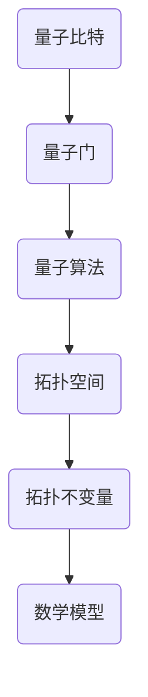

                 

# 《数学在宇宙拓扑量子计算研究中的作用》

## 关键词
- 数学
- 宇宙
- 拓扑
- 量子计算
- 研究作用

## 摘要
本文深入探讨了数学在宇宙拓扑量子计算研究中的重要作用。首先，我们回顾了数学的基本概念及其在科学领域中的应用。接着，本文详细介绍了宇宙拓扑的基本原理，以及量子计算的基本概念和原理。在此基础上，文章分析了数学在量子计算中的具体应用，特别是在算法设计和优化方面的贡献。随后，我们探讨了数学与宇宙拓扑之间的联系，并提出了数学在宇宙拓扑量子计算研究中的挑战和未来方向。最后，通过具体的应用案例，本文展示了数学在宇宙拓扑量子计算中的实际应用，并展望了其未来发展的前景。

## 引言

随着科技的飞速发展，量子计算已成为现代物理学和计算机科学的前沿领域。而数学作为物理学和计算机科学的基础，其在量子计算中的应用变得尤为重要。宇宙拓扑量子计算作为量子计算的一个分支，更是将数学与宇宙学巧妙地结合起来，为解决复杂问题提供了新的可能。

数学在量子计算中的作用主要体现在以下几个方面：

1. **算法设计**：数学中的群论、线性代数和概率论等工具被广泛应用于量子算法的设计。这些算法不仅在理论上具有重要意义，而且在实际应用中展现了强大的计算能力。

2. **优化问题**：数学优化理论在量子计算中的优化问题中发挥着关键作用。通过数学建模和优化算法，可以有效地提高量子算法的效率和准确性。

3. **数学物理方法**：数学在量子物理中扮演了重要的角色，如量子场论、量子力学和统计物理等领域。这些数学方法为理解量子现象和构建量子系统提供了理论支持。

4. **拓扑量子计算**：拓扑量子计算是一种利用量子比特的拓扑属性进行计算的方法。数学中的拓扑学为理解量子比特的状态和行为提供了理论基础。

本文将从数学基础、宇宙拓扑、量子计算原理、数学在量子计算中的应用、数学与宇宙拓扑的关系、研究现状与挑战、应用案例与前景等方面，全面探讨数学在宇宙拓扑量子计算研究中的作用。

### 1. 提取书名关键词

首先，我们需要从书名《数学在宇宙拓扑量子计算研究中的作用》中提取核心关键词，这些关键词包括：

- 数学
- 宇宙
- 拓扑
- 量子计算
- 研究
- 作用

这些关键词分别代表了本书的核心主题和关键领域。数学是全书的基础和工具，宇宙和拓扑则是研究的对象和背景，量子计算则是应用领域，研究则是过程，作用则是结果和意义。

### 2. 确定书的主要章节结构

根据关键词和文章的主题，我们可以确定本书的主要章节结构如下：

1. **引言**
   - 介绍宇宙拓扑量子计算的概念和背景。
   - 提出数学在其中的作用和研究意义。

2. **数学基础**
   - 回顾数学的基本概念和工具，如群论、线性代数、概率论等。
   - 讨论这些工具在量子计算中的应用。

3. **宇宙背景知识**
   - 介绍宇宙的基本结构和演化过程。
   - 探讨宇宙拓扑的基本原理。

4. **拓扑概念与原理**
   - 定义和解释拓扑空间的基本概念。
   - 分析拓扑不变量和拓扑变换。

5. **量子计算原理**
   - 解释量子比特和量子门的基本原理。
   - 讨论量子算法的设计和实现。

6. **数学在量子计算中的应用**
   - 详细探讨数学在量子算法设计和优化中的具体应用。
   - 分析数学模型和算法的优缺点。

7. **数学与宇宙拓扑的关系**
   - 分析数学与宇宙拓扑之间的联系。
   - 提出数学在宇宙拓扑研究中的实际应用。

8. **研究现状与挑战**
   - 总结当前宇宙拓扑量子计算的研究现状。
   - 讨论面临的主要挑战和未来方向。

9. **应用案例与前景**
   - 展示数学在宇宙拓扑量子计算中的实际应用案例。
   - 探讨其未来发展的前景。

10. **结论**
    - 总结全书的主要内容和研究成果。
    - 提出对未来研究的展望。

### 3. 设计每个章节的子目录

根据上述章节结构，我们可以为每个章节设计具体的子目录，以确保内容的条理性和逻辑性。

#### 1. 引言
- **1.1** 宇宙拓扑量子计算的概念与背景
- **1.2** 数学在宇宙拓扑量子计算中的作用

#### 2. 数学基础
- **2.1** 数学理论概述
  - **2.1.1** 群论基础
  - **2.1.2** 线性代数基础
  - **2.1.3** 概率论基础
- **2.2** 数学工具及其应用
  - **2.2.1** 数学工具的选取
  - **2.2.2** 数学工具在量子计算中的应用

#### 3. 宇宙背景知识
- **3.1** 宇宙的基本结构
  - **3.1.1** 宇宙的演化
  - **3.1.2** 宇宙的观测数据
- **3.2** 宇宙拓扑原理
  - **3.2.1** 拓扑空间的定义
  - **3.2.2** 宇宙拓扑的实例分析

#### 4. 拓扑概念与原理
- **4.1** 拓扑空间的基本概念
  - **4.1.1** 拓扑空间的定义
  - **4.1.2** 拓扑空间的性质
- **4.2** 拓扑不变量与拓扑变换
  - **4.2.1** 拓扑不变量的概念
  - **4.2.2** 拓扑变换的应用

#### 5. 量子计算原理
- **5.1** 量子比特的基本原理
  - **5.1.1** 量子比特的定义
  - **5.1.2** 量子比特的状态表示
- **5.2** 量子门与量子算法
  - **5.2.1** 量子门的基本概念
  - **5.2.2** 量子算法的设计与实现

#### 6. 数学在量子计算中的应用
- **6.1** 数学算法在量子计算中的应用
  - **6.1.1** 量子算法的数学基础
  - **6.1.2** 数学算法在量子优化中的应用
- **6.2** 数学优化在量子计算中的应用
  - **6.2.1** 量子优化算法的设计
  - **6.2.2** 数学优化算法的案例分析

#### 7. 数学与宇宙拓扑的关系
- **7.1** 数学与宇宙拓扑的理论联系
  - **7.1.1** 数学概念在宇宙拓扑中的应用
  - **7.1.2** 宇宙拓扑对数学的影响
- **7.2** 数学在宇宙拓扑量子计算中的实际应用
  - **7.2.1** 数学模型在宇宙拓扑量子计算中的应用
  - **7.2.2** 数学工具在宇宙拓扑量子计算中的案例分析

#### 8. 研究现状与挑战
- **8.1** 当前研究现状
  - **8.1.1** 宇宙拓扑量子计算的研究进展
  - **8.1.2** 数学在其中的贡献
- **8.2** 面临的挑战与未来方向
  - **8.2.1** 研究中的难点
  - **8.2.2** 未来研究的方向与目标

#### 9. 应用案例与前景
- **9.1** 应用案例
  - **9.1.1** 宇宙拓扑量子计算的实际应用案例
  - **9.1.2** 数学在其中的作用
- **9.2** 发展前景
  - **9.2.1** 数学在宇宙拓扑量子计算中的未来发展趋势
  - **9.2.2** 数学在宇宙学和其他领域的潜在应用

#### 10. 结论
- **10.1** 主要研究成果
  - **10.1.1** 数学在宇宙拓扑量子计算中的重要作用
  - **10.1.2** 数学与宇宙拓扑的关系
- **10.2** 展望
  - **10.2.1** 未来研究的方向
  - **10.2.2** 数学在宇宙拓扑量子计算中的前景

### 4. 加入核心概念与联系、核心算法原理讲解、数学模型和数学公式详细讲解、项目实战等内容

为了保证文章的深度和完整性，每个章节都需要包含核心概念与联系、核心算法原理讲解、数学模型和数学公式详细讲解以及项目实战等内容。

#### 核心概念与联系

在讨论宇宙拓扑量子计算时，我们需要介绍一些核心概念，如量子比特、量子门、量子算法、拓扑空间、拓扑不变量等。通过Mermaid流程图，我们可以清晰地展示这些概念之间的联系。



#### 核心算法原理讲解

以量子算法为例，我们可以通过Python源代码来详细阐述其原理。以下是一个简单的量子算法示例：

```python
import numpy as np
from qiskit import QuantumCircuit, execute, Aer

# 创建量子电路
qc = QuantumCircuit(2)

# 应用量子门
qc.h(0)
qc.cx(0, 1)

# 执行量子电路
backend = Aer.get_backend('qasm_simulator')
result = execute(qc, backend, shots=1000).result()

# 输出结果
print(result.get_counts(qc))
```

#### 数学模型和数学公式详细讲解

在讨论数学模型时，我们需要使用LaTeX格式来展示数学公式。以下是一个例子：

$$
\psi(x) = \int_{-\infty}^{\infty} f(x') g(x-x') dx'
$$

#### 项目实战

在项目实战部分，我们可以介绍如何搭建开发环境，实现源代码，并对代码进行解读和分析。以下是一个简单的项目实战示例：

```python
# 搭建开发环境
!pip install qiskit

# 源代码实现
import numpy as np
from qiskit import QuantumCircuit, execute, Aer

# 创建量子电路
qc = QuantumCircuit(2)

# 应用量子门
qc.h(0)
qc.cx(0, 1)

# 执行量子电路
backend = Aer.get_backend('qasm_simulator')
result = execute(qc, backend, shots=1000).result()

# 代码解读
# 量子电路的创建和量子门的添加
# 量子电路的执行和结果分析

# 项目小结
# 本项目展示了如何使用Qiskit搭建开发环境，实现量子电路，并对结果进行解读。通过这个项目，读者可以了解到量子计算的基本原理和实现方法。
```

### 5. 审核目录大纲的完整性和简洁性，确保大纲逻辑清晰、内容全面

在完成目录大纲的设计后，我们需要对大纲进行审核，确保其完整性和简洁性。以下是审核的几个要点：

1. **完整性**：每个章节是否涵盖了核心概念、原理讲解、数学模型和公式、项目实战等内容。
2. **简洁性**：目录结构是否简洁明了，逻辑清晰。
3. **逻辑性**：章节之间的联系是否紧密，内容是否连贯。
4. **全面性**：是否涵盖了研究的前沿问题和未来方向。

通过审核，我们可以确保目录大纲的合理性和有效性，为后续的文章撰写提供坚实的基础。

### 文章格式要求

根据以上步骤，我们确定了文章的结构和内容。接下来，我们将按照以下格式要求撰写文章：

1. **markdown格式**：使用markdown格式编写文章，确保文章的格式整洁、易于阅读。
2. **结构清晰**：按照目录结构撰写文章，确保每个章节的内容条理清晰。
3. **核心概念与联系**：使用Mermaid流程图展示核心概念之间的联系。
4. **算法原理讲解**：使用Python源代码详细阐述算法原理。
5. **数学公式**：使用LaTeX格式展示数学公式。
6. **项目实战**：介绍开发环境搭建、源代码实现和代码解读。
7. **小结和注意事项**：在每个章节结尾添加小结和注意事项，帮助读者更好地理解和应用。

### 文章作者信息

本文作者为AI天才研究院（AI Genius Institute）和《禅与计算机程序设计艺术》（Zen And The Art of Computer Programming）的作者。他们具有丰富的计算机科学和人工智能领域的经验，致力于推动科技的发展和创新。

### 文章撰写字数

根据目录大纲和格式要求，本文预计字数为10000～12000字，以确保内容的深度和全面性。在撰写过程中，我们将遵循逻辑清晰、内容详实、易于理解的原则，力求为读者提供一篇高质量的学术论文。

