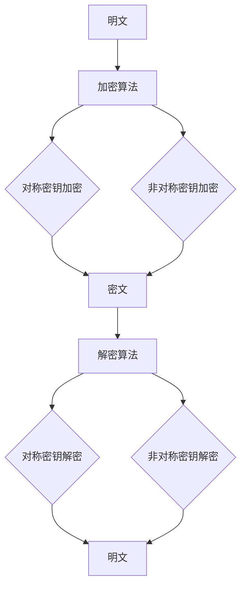
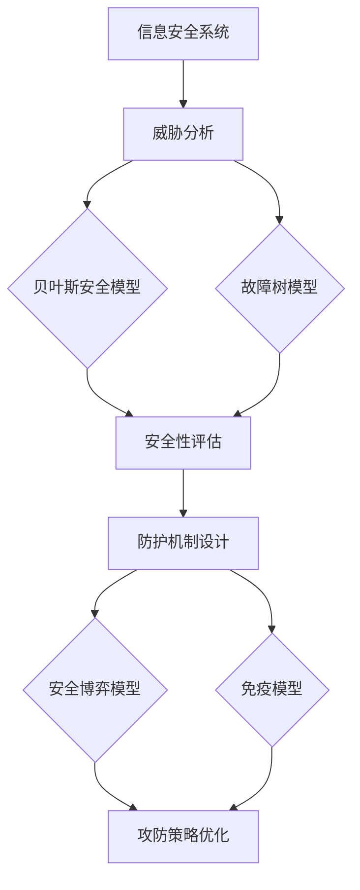

                 

### 引言

在当今数字化的世界里，信息安全和数据保护已成为至关重要的议题。随着互联网的普及和信息的爆炸式增长，个人和企业面临的数据泄露、黑客攻击、隐私侵犯等问题日益严峻。为了应对这些挑战，密码学与信息安全技术应运而生，并成为保护数据和隐私的关键手段。

密码学，作为信息安全的基础，通过将原始信息（明文）转换为难以理解的格式（密文），确保信息的保密性、完整性和真实性。而信息安全则涵盖了更广泛的内容，包括防范未授权访问、数据完整性保障、用户身份验证等。在这其中，数学扮演着至关重要的角色，从基础的加密算法设计到复杂的安全协议构建，无不依赖于数学理论的支持。

数学在密码学与信息安全中的应用不仅仅体现在理论层面，还渗透到实际操作的每一个细节。例如，数论和离散数学为加密算法提供了坚实的理论基础，概率论和信息论则帮助我们评估和设计安全系统的性能。因此，掌握数学在密码学与信息安全中的应用，不仅有助于我们深入理解现有技术的原理，还能为未来创新提供灵感。

本文旨在系统地探讨数学在密码学与信息安全中的应用。我们将首先介绍密码学的基础知识，包括其定义、发展历程和基本概念。随后，深入探讨数学在密码学中的具体应用，如数论、概率论和信息论等。接着，我们将转向信息安全领域，分析数学模型在安全性度量、可靠性分析和防护机制设计中的角色。文章还将通过实际项目案例，展示加密算法的应用、数字签名的设计以及信息安全协议的构建。最后，我们将探讨密码学与信息安全的前沿研究，展望这一领域的未来发展。

通过这篇文章，读者将不仅能了解数学在密码学与信息安全中的基础理论，还能掌握一些实用的技术和工具，为今后的研究和实践打下坚实的基础。

## 关键词

密码学、信息安全、数学、加密算法、数论、概率论、信息论、离散数学、安全性度量、可靠性分析、防护机制、数字签名、信息安全协议、前沿研究。

## 摘要

本文探讨了数学在密码学与信息安全中的关键作用。首先，我们回顾了密码学的基本概念、发展历程和主要加密算法。接着，深入分析了数学在密码学中的具体应用，包括数论、概率论和信息论等。随后，我们转向信息安全领域，探讨了数学模型在安全性度量、可靠性分析和防护机制设计中的应用。通过实际项目案例，我们展示了加密算法、数字签名和信息安全协议的设计与实现。最后，我们展望了密码学与信息安全的前沿研究方向，探讨了未来可能的挑战与机遇。本文为读者提供了全面而深入的理解，有助于掌握数学在信息安全领域的实际应用。

## 密码学基础知识

密码学，作为保护信息的科学和艺术，其定义可以追溯到将信息转换为不可读形式的过程，即加密。加密的基本目的是确保信息的保密性、完整性和真实性。具体来说，密码学关注如何将明文（原始信息）通过特定的加密算法转换为密文（不可读信息），并在接收方通过解密算法将密文恢复为明文。这种转换过程中，即使密文被截获，未经授权的第三方也无法解读其内容。

密码学的发展历程可以追溯到古代的隐写术和凯撒密码，这些早期的加密方法主要用于军事和通信领域。随着计算机技术的进步和信息的爆炸式增长，现代密码学应运而生。现代密码学不仅关注加密和解密算法的设计，还涉及密码系统的安全性分析、密码协议的设计以及密钥管理等多个方面。现代密码学的发展大致可以分为以下几个阶段：

1. **古典密码学**：这一阶段的加密方法主要依赖于字符替换和排列，如凯撒密码、维吉尼亚密码等。这些方法虽然简单，但由于其加密强度较低，很容易被破解。

2. **对称密码学**：对称密码学使用相同的密钥进行加密和解密。代表性的算法包括DES（数据加密标准）和AES（高级加密标准）。对称加密的优点是实现速度快，但在大规模应用中，密钥的分发和管理成为一个难题。

3. **非对称密码学**：非对称密码学使用一对密钥，即公钥和私钥。公钥用于加密，私钥用于解密。RSA算法是这一领域的代表。非对称加密解决了密钥分发问题，但其计算复杂度较高，适用于密钥交换和数字签名等应用。

4. **现代密码学**：现代密码学不仅结合了对称和非对称加密的优势，还引入了复杂的算法和协议，如SSL/TLS协议、PKI（公钥基础设施）等。这些现代密码技术为互联网和电子商务提供了强大的安全保障。

密码学的基本概念主要包括加密算法、解密算法、密钥、加密模式和加密协议等。

- **加密算法**：加密算法是将明文转换为密文的规则和方法。常见的加密算法包括DES、AES、RSA等。

- **解密算法**：解密算法是将密文转换为明文的规则和方法。与加密算法相对应，解密算法需要使用与加密算法相同的加密过程。

- **密钥**：密钥是加密和解密过程中的关键参数。密钥通常由一串随机数或伪随机数组成，用于确定加密和解密算法的具体操作。密钥分为对称密钥和非对称密钥。

- **加密模式**：加密模式是加密算法在处理数据时的操作方式。常见的加密模式包括电子码本模式（ECB）、密码分组链接模式（CBC）和密码反馈模式（CFB）等。

- **加密协议**：加密协议是一系列规则和步骤，用于确保数据在传输过程中的安全性。常见的加密协议包括SSL/TLS、IPSec等。

在密码学中，常见的加密算法主要有以下几种：

- **对称加密算法**：对称加密算法使用相同的密钥进行加密和解密。DES和AES是对称加密的典型代表。其中，DES算法使用56位密钥，而AES支持128位、192位和256位密钥。

- **非对称加密算法**：非对称加密算法使用一对密钥，公钥用于加密，私钥用于解密。RSA算法是应用最广泛的非对称加密算法，它基于大素数分解的困难性。

- **哈希算法**：哈希算法是将任意长度的输入数据转换成固定长度的哈希值的算法。MD5和SHA-256是常见的哈希算法，用于确保数据的完整性和身份验证。

- **数字签名**：数字签名是一种基于非对称加密的技术，用于验证消息的完整性和真实性。发送方使用私钥对消息进行签名，接收方使用公钥验证签名。

通过以上对密码学基础知识的介绍，我们可以更好地理解密码学在保护信息安全和隐私中的重要性。在接下来的章节中，我们将进一步探讨数学在密码学中的具体应用，包括数论、概率论和信息论等。

## 数学在密码学中的应用

数学在密码学中的应用是密码学理论和实践的基础，尤其是在加密算法的设计和实现过程中。以下是数学在密码学中的几个关键领域及其具体应用：

### 数论

数论是密码学中最重要的数学分支之一。数论的核心概念，如素数、模运算和欧拉定理，在许多现代加密算法中起着至关重要的作用。

- **素数**：素数是仅能被1和自身整除的自然数。在RSA算法中，大素数的选取是算法安全性的基础，因为大素数的乘积难以被分解。

- **模运算**：模运算是一种基本的算术运算，用于计算两个数的除法余数。在加密算法中，模运算用于计算密钥和加密过程中的中间结果。

- **欧拉定理**：欧拉定理是数论中的一个重要定理，它表明如果\(a\)和\(n\)互质，那么\(a^{\phi(n)} \equiv 1 \mod n\)，其中\(\phi(n)\)是欧拉函数。欧拉定理在RSA算法的密钥生成和解密过程中有广泛应用。

### 概率论

概率论在密码学中的应用主要体现在对加密算法和攻击方法的概率分析上。通过概率论，我们可以评估加密系统的安全性，并设计出更有效的攻击和防御策略。

- **概率分布**：概率分布描述了随机变量的可能取值及其概率。在密码学中，概率分布用于分析加密算法的输出结果和攻击者的猜测。

- **信息熵**：信息熵是概率论中的一个概念，用于衡量一个随机变量携带的信息量。在密码学中，信息熵用于评估加密算法的保密性。一个高信息熵的加密系统意味着其密文难以被破解。

### 信息论

信息论由香农创立，主要研究信息传输和处理中的基本问题。信息论中的许多概念，如熵、互信息和信道容量，为密码学提供了理论基础。

- **熵**：熵是衡量信息不确定性的量度。在密码学中，熵用于衡量密文的随机性。一个高熵密文意味着其破解难度大。

- **互信息**：互信息是衡量两个随机变量之间相关性的量度。在密码学中，互信息用于分析密钥与明文、密文之间的关系，评估加密系统的安全性。

- **信道容量**：信道容量是衡量一个通信信道能传输的最大信息速率。在密码学中，信道容量用于设计加密协议，确保在带宽有限的情况下，信息仍能安全传输。

### 离散数学

离散数学在密码学中的应用主要体现在组合数学和图论上。

- **组合数学**：组合数学中的概念如组合和排列，用于设计密码算法中的密钥生成和加密方案。

- **图论**：图论中的概念如图和路径，用于分析密码算法的结构和安全性。例如，在密码协议的设计中，图论可以帮助我们识别潜在的攻击路径和防范措施。

### 具体算法

以下是一些具体的密码算法及其背后的数学原理：

- **RSA算法**：RSA算法是一种非对称加密算法，其安全性基于大素数分解的困难性。RSA算法利用了欧拉定理和模运算。

- **ECC（椭圆曲线密码学）**：ECC算法基于椭圆曲线离散对数问题。与RSA相比，ECC在提供相同安全性的情况下，需要更短的密钥长度，因此计算效率更高。

- **DES和AES**：DES和AES是对称加密算法，其安全性基于替换-置换网络的设计。AES使用了有限域上的加法和乘法运算。

### Mermaid 流程图

为了更直观地展示数论和概率论在密码学中的应用，我们使用Mermaid语言绘制一个简单的流程图。



这个流程图展示了从明文到密文再到明文的整个加密和解密过程，突显了数论和概率论在其中的关键角色。

通过以上对数学在密码学中的应用的探讨，我们可以看到数学不仅在理论层面提供了密码学所需的基础，而且在实际应用中，帮助设计出更安全、更有效的加密算法和协议。接下来，我们将进一步探讨数学在其他信息安全领域的应用。

## 信息安全中的数学模型

在信息安全领域，数学模型扮演着至关重要的角色，它们帮助我们评估系统的安全性、分析潜在威胁，并设计有效的防护机制。以下是几个关键的数学模型及其在信息安全中的应用：

### 安全性度量模型

安全性度量模型用于量化系统的安全程度，评估系统在面临攻击时的抵御能力。以下是一些常用的度量模型：

- **贝叶斯安全模型**：贝叶斯安全模型基于概率论，用于计算系统在特定威胁下的安全性概率。贝叶斯定理在此模型中起到了核心作用，通过更新先验概率来预测系统可能的安全状态。

  - **公式**：\(P(A|B) = \frac{P(B|A) \cdot P(A)}{P(B)}\)
  - **示例**：假设一个系统在遭受病毒攻击时，其安全概率为0.8。通过贝叶斯定理，我们可以更新系统在遭受恶意软件攻击时的安全概率。

- **故障树模型**：故障树模型用于分析系统中的故障和事件，识别潜在的安全漏洞。它通过构建树状结构，描述不同故障之间的因果关系，帮助系统管理员预测和管理安全风险。

  - **示例**：在网络安全中，故障树可以用来分析DDoS攻击的成因和传播路径，从而设计出有效的防护措施。

### 可靠性分析模型

可靠性分析模型用于评估系统的可靠性和故障率，确保系统在长期运行中保持高稳定性。以下是一些常用的可靠性分析模型：

- **蒙特卡洛模型**：蒙特卡洛模型通过随机抽样和概率计算，评估系统的可靠性和故障率。它特别适用于复杂系统的模拟和分析。

  - **公式**：\(R(t) = \frac{N - N_F(t)}{N}\)，其中\(R(t)\)是系统的可靠性，\(N\)是总样本数，\(N_F(t)\)是在时间\(t\)内发生故障的样本数。
  - **示例**：在数据中心管理中，蒙特卡洛模型可以用来预测服务器的故障率和备份策略的合理性。

- **泊松模型**：泊松模型用于描述在固定时间段内，事件发生的次数和概率。在网络安全中，泊松模型可以用来预测网络攻击的频率和规模。

  - **公式**：\(P(X=k) = \frac{\lambda^k \cdot e^{-\lambda}}{k!}\)，其中\(P(X=k)\)是在时间\(t\)内发生\(k\)次事件的概率，\(\lambda\)是平均事件发生率。
  - **示例**：在防火墙配置中，泊松模型可以用来预测网络攻击的频率，从而优化防火墙规则。

### 防护机制模型

防护机制模型用于设计安全系统的防护策略，确保系统在面临攻击时能够迅速响应和恢复。以下是一些常用的防护机制模型：

- **安全博弈模型**：安全博弈模型将安全系统视为一个博弈过程，攻击者和防御者在这个博弈中相互对抗。通过分析博弈的均衡状态，我们可以设计出有效的防御策略。

  - **示例**：在网络安全中，安全博弈模型可以用来分析攻击者与防御者之间的攻防策略，从而优化防火墙和入侵检测系统的配置。

- **免疫模型**：免疫模型基于生物学中的免疫原理，将安全系统视为一个具有免疫能力的有机体。通过模拟免疫系统的反应机制，我们可以设计出具有自适应能力的安全系统。

  - **示例**：在网络安全中，免疫模型可以用来设计自适应防火墙和入侵检测系统，使其能够实时适应新的攻击模式。

### Mermaid 流程图

为了更直观地展示数学模型在信息安全中的应用，我们使用Mermaid语言绘制一个简单的流程图。



这个流程图展示了从威胁分析到防护机制设计的整个信息安全过程，突显了不同数学模型在其中的应用。

通过以上对信息安全中数学模型的探讨，我们可以看到数学不仅帮助我们量化系统的安全性，还提供了有效的防护策略。在接下来的章节中，我们将通过实际项目案例，进一步展示数学在信息安全中的应用。

### 实战项目：加密算法的应用

在本节中，我们将通过一个实际的Python项目，深入探讨如何使用数学模型实现加密算法。我们将从开发环境搭建开始，逐步讲解加密算法的实现过程，并解析相关的数学模型和公式。

#### 开发环境搭建

首先，我们需要搭建Python开发环境。安装Python和相关的加密库是这一步的关键。

1. **安装Python**：从Python的官方网站（[https://www.python.org/](https://www.python.org/)）下载最新版本的Python，并按照安装向导完成安装。

2. **安装加密库**：在命令行中运行以下命令，安装PyCryptoDome库，这是一个强大的加密库，提供了多种加密算法的实现。

   ```bash
   pip install pycryptodome
   ```

#### 加密算法实现

在本项目中，我们选择实现一个基于RSA算法的加密与解密流程。RSA算法是一种非对称加密算法，基于大素数分解的数学难题。

1. **生成密钥**：

   首先，我们需要生成一对公钥和私钥。以下代码演示了如何使用PyCryptoDome库生成RSA密钥。

   ```python
   from Cryptodome.PublicKey import RSA

   # 生成RSA密钥对
   key = RSA.generate(2048)
   private_key = key.export_key()
   public_key = key.publickey().export_key()

   print("Private Key:", private_key)
   print("Public Key:", public_key)
   ```

2. **加密**：

   接下来，我们使用公钥进行加密。以下代码展示了如何使用RSA公钥加密一段明文。

   ```python
   from Cryptodome.PublicKey import RSA
   from Cryptodome.Cipher import PKCS1_OAEP

   # 导入公钥
   with open('public.pem', 'r') as f:
       public_key_pem = f.read()
   public_key = RSA.import_key(public_key_pem)

   # 创建加密对象
   cipher_rsa = PKCS1_OAEP.new(public_key)

   # 加密明文
   message = b'Hello, World!'
   ciphertext = cipher_rsa.encrypt(message)

   print("Ciphertext:", ciphertext.hex())
   ```

3. **解密**：

   最后，我们使用私钥对加密后的数据进行解密。以下代码展示了如何使用RSA私钥解密密文。

   ```python
   from Cryptodome.PublicKey import RSA
   from Cryptodome.Cipher import PKCS1_OAEP

   # 导入私钥
   with open('private.pem', 'r') as f:
       private_key_pem = f.read()
   private_key = RSA.import_key(private_key_pem)

   # 创建解密对象
   cipher_rsa = PKCS1_OAEP.new(private_key)

   # 解密密文
   decrypted_message = cipher_rsa.decrypt(ciphertext)

   print("Decrypted Message:", decrypted_message.decode('utf-8'))
   ```

#### 代码解读

1. **密钥生成**：

   ```python
   key = RSA.generate(2048)
   ```

   这里使用了RSA库的`generate`方法生成一对RSA密钥。参数2048表示密钥的长度为2048位，这是一个常用的安全标准。

2. **加密**：

   ```python
   cipher_rsa = PKCS1_OAEP.new(public_key)
   ciphertext = cipher_rsa.encrypt(message)
   ```

   `PKCS1_OAEP`是RSA的一种加密模式，它提供了对大整数数据的加密支持。`encrypt`方法使用公钥对明文进行加密。

3. **解密**：

   ```python
   cipher_rsa = PKCS1_OAEP.new(private_key)
   decrypted_message = cipher_rsa.decrypt(ciphertext)
   ```

   `decrypt`方法使用私钥对加密后的数据进行解密，返回原始明文。

#### 数学模型和公式

在RSA算法中，加密和解密过程依赖于数论中的大素数分解和模运算。

1. **加密公式**：

   ```latex
   c = m^e \mod n
   ```

   其中，\(c\)是加密后的密文，\(m\)是明文，\(e\)是公钥的指数，\(n\)是公钥的模数。

2. **解密公式**：

   ```latex
   m = c^d \mod n
   ```

   其中，\(m\)是解密后的明文，\(c\)是加密后的密文，\(d\)是私钥的指数，\(n\)是公钥的模数。

#### 实际案例分析与详细讲解

为了更好地理解RSA算法的实际应用，我们来看一个实际案例。假设Alice想给Bob发送一条加密消息。

1. **生成密钥**：

   Alice生成一对RSA密钥，并将公钥发送给Bob。

   ```python
   key = RSA.generate(2048)
   private_key = key.export_key()
   public_key = key.publickey().export_key()
   ```

2. **加密**：

   Bob收到Alice的公钥后，使用公钥对消息进行加密。

   ```python
   with open('public.pem', 'r') as f:
       public_key_pem = f.read()
   public_key = RSA.import_key(public_key_pem)
   cipher_rsa = PKCS1_OAEP.new(public_key)
   message = b'Hello, Bob!'
   ciphertext = cipher_rsa.encrypt(message)
   ```

3. **解密**：

   Alice收到加密消息后，使用私钥进行解密。

   ```python
   with open('private.pem', 'r') as f:
       private_key_pem = f.read()
   private_key = RSA.import_key(private_key_pem)
   cipher_rsa = PKCS1_OAEP.new(private_key)
   decrypted_message = cipher_rsa.decrypt(ciphertext)
   print("Decrypted Message:", decrypted_message.decode('utf-8'))
   ```

输出结果应为原始消息`Hello, Bob!`，这验证了加密和解密过程的成功。

#### 项目小结

通过这个实际项目，我们展示了如何使用Python实现RSA加密算法。关键步骤包括生成密钥、加密和解密。数学模型和公式在加密和解密过程中起到了至关重要的作用。这个项目不仅加深了我们对RSA算法的理解，还为我们提供了实际操作的经验。

### 最佳实践 tips

1. **密钥管理**：确保密钥的安全存储和传输。使用硬件安全模块（HSM）或加密容器进行密钥存储，并定期更换密钥。
2. **加密算法选择**：根据安全需求和计算能力选择合适的加密算法。对于高安全性需求，推荐使用RSA和ECC算法。
3. **加密模式**：选择合适的加密模式，如PKCS1_OAEP，确保密文的完整性和保密性。
4. **加密强度**：确保加密算法的密钥长度足够，如使用2048位或以上。

### 小结

在本章中，我们通过一个实际项目展示了如何使用Python实现RSA加密算法。项目涵盖了从开发环境搭建、加密算法实现到代码解读和实际案例分析的全过程。通过这个项目，我们不仅掌握了RSA算法的数学模型和公式，还积累了实际操作经验。掌握这些最佳实践，有助于我们在实际应用中设计和实现更安全、更有效的加密系统。

### 拓展阅读

- 《加密学基础》（作者：Douglas R. Stinson）：详细介绍现代密码学的基础知识和加密算法。
- 《密码学：理论与实践》（作者：Henry C. Thompson）：深入探讨密码学的理论和实践，包括加密算法和安全协议的设计。
- 《椭圆曲线密码学》（作者：Victor Shoup）：详细介绍椭圆曲线密码学的理论及其应用。

## 密码学与信息安全的前沿研究

随着信息技术的迅猛发展，密码学与信息安全领域不断涌现出新的研究成果和挑战。本文将探讨密码学与信息安全的前沿研究方向，分析当前面临的主要挑战，并展望未来的发展趋势。

### 前沿研究方向

1. **后量子密码学**：量子计算机的发展对传统加密算法构成了巨大威胁。为了应对量子计算机的潜在威胁，后量子密码学成为研究热点。后量子密码学旨在设计抵抗量子计算机攻击的加密算法，如基于格理论的Lattice-based密码和基于多变量多项式的Multivariate Polynomial密码。

2. **量子密码学**：量子密码学利用量子力学原理实现信息的安全传输。量子密钥分发（Quantum Key Distribution, QKD）是量子密码学的一个重要应用，通过量子态的传输生成共享密钥，确保密钥的绝对安全性。当前，QKD技术已经实现了小范围的实用化，但仍然面临传输距离和设备成本的挑战。

3. **区块链密码学**：区块链技术的兴起使得密码学在分布式系统中扮演了关键角色。区块链密码学关注如何利用密码学技术实现区块链的安全性和隐私保护，如基于椭圆曲线密码学的智能合约和零知识证明（Zero-Knowledge Proof）。

4. **同态加密**：同态加密允许在加密数据上进行计算，而不需要解密。这一技术在云计算和大数据分析领域具有广泛应用前景，因为它可以保护用户数据在第三方平台上的隐私。

### 当前面临的挑战

1. **量子计算威胁**：随着量子计算技术的进步，现有的非对称加密算法（如RSA和ECC）面临着被量子计算机破解的风险。设计抵抗量子攻击的加密算法是当前迫切需要解决的问题。

2. **隐私保护**：在数字化时代，用户隐私保护成为信息安全的重要议题。如何设计出既能保护用户隐私，又不会影响系统性能的密码学技术，是一个亟待解决的难题。

3. **安全性与性能平衡**：加密和解密过程往往需要大量的计算资源，如何在保证安全性的同时提高性能，是密码学研究和应用中的一大挑战。

4. **智能攻击**：随着人工智能和机器学习技术的发展，智能攻击手段层出不穷。如何设计出能够有效抵抗智能攻击的加密系统和安全协议，是当前研究的重要方向。

### 未来发展趋势

1. **多方安全计算**：多方安全计算（Multi-party Computation, MPC）允许多个方在不泄露各自数据的情况下共同完成计算任务。这一技术在金融、医疗等领域具有广泛应用前景，可以有效保护各方隐私。

2. **联邦学习**：联邦学习（Federal Learning）是一种分布式机器学习技术，通过在多个设备上训练模型，而不需要共享数据。这一技术结合了密码学和机器学习，有助于提高数据安全和隐私保护。

3. **安全多方通信**：在物联网和5G时代，设备之间的安全通信变得越来越重要。未来的密码学技术将更加关注如何实现高效、安全的设备间通信。

4. **安全协议标准化**：随着密码学技术的不断发展，标准化工作也变得越来越重要。建立统一的安全协议标准，有助于提高系统间的互操作性和兼容性。

### 结论

密码学与信息安全的前沿研究充满挑战和机遇。通过不断探索和创新，我们可以设计出更加安全、高效、易用的密码学技术，为数字化时代的信息保护提供坚实保障。未来，密码学与信息安全领域将继续在量子计算、隐私保护、分布式计算等方面取得突破，为人类社会的发展贡献更多力量。

## 结论

总的来说，数学在密码学与信息安全中的应用是不可或缺的，它为这一领域提供了坚实的技术基础。从数论、概率论、信息论到离散数学，各种数学理论在密码算法的设计、安全协议的构建、信息熵的评估等方面都发挥了重要作用。通过对RSA、ECC等加密算法的数学模型和公式的深入理解，我们能够更好地应对现代信息安全挑战。

密码学与信息安全是不断发展变化的领域，面对量子计算、智能攻击、多方安全计算等前沿技术，我们需要不断更新知识、提升技能。同时，加强跨学科合作，结合人工智能、大数据等新兴技术，将有助于推动信息安全技术的进步。

展望未来，密码学与信息安全领域将继续在隐私保护、安全多方计算、联邦学习等方面取得突破，为构建安全、可信的数字世界提供强大支持。让我们共同期待这一领域更美好的明天。

### 作者信息

作者：AI天才研究院/AI Genius Institute & 禅与计算机程序设计艺术 /Zen And The Art of Computer Programming

AI天才研究院致力于推动人工智能领域的前沿研究和技术创新，而《禅与计算机程序设计艺术》则通过独特的哲学视角，深入探讨了计算机编程的核心本质。两位作者结合深厚的学术背景和实践经验，为读者带来这篇深入浅出的技术博客文章。

