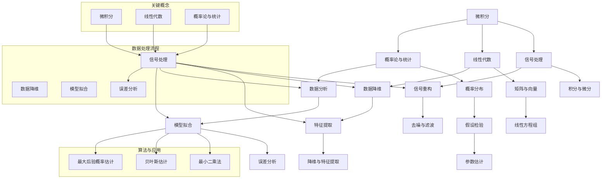

                 

### 文章标题

# 数学在引力波宇宙学精确参数估计中的应用

### 关键词

- 引力波
- 宇宙学
- 参数估计
- 数学模型
- 数据分析

### 摘要

本文旨在探讨数学在引力波宇宙学精确参数估计中的应用。首先，我们介绍了引力波宇宙学的基本概念及其在宇宙学研究中的重要性。接着，本文重点阐述了数学在引力波数据分析中的关键角色，包括微积分、线性代数和概率论与统计的基础知识。随后，我们详细探讨了多种参数估计方法，如最小二乘法、最大后验概率估计和贝叶斯估计，并结合实际应用案例进行了深入分析。最后，本文总结了当前研究的主要发现，并对未来研究方向进行了展望。通过本文，读者可以了解到数学在引力波宇宙学研究中的重要作用，以及如何利用数学工具进行精确参数估计。

### 引言

引力波宇宙学是一门跨学科的研究领域，它将广义相对论、天文观测和数据分析相结合，旨在通过引力波信号揭示宇宙的奥秘。引力波的发现不仅开启了宇宙学研究的新篇章，也为精确参数估计提供了强有力的工具。自2015年首次直接探测到引力波以来，全球科学家们利用先进的观测设备和数据分析技术，不断探索引力波信号背后的物理现象和宇宙学参数。

引力波的发现和观测为宇宙学研究带来了前所未有的机遇。引力波可以穿越宇宙中的各种物质，不受电磁干扰，提供了一种独特的观测宇宙的手段。通过分析引力波信号，科学家们能够精确测量双星系统的质量、距离和自转速度，揭示宇宙中的超大质量黑洞和星系合并事件。此外，引力波还可以帮助我们理解早期宇宙的演化过程，如宇宙微波背景辐射和宇宙加速膨胀等。

然而，引力波的观测和数据分析面临着巨大的挑战。由于引力波信号的弱性和噪声干扰，如何从观测数据中精确提取引力波信号并估计相关参数成为了一项艰巨的任务。这需要运用多种数学工具和方法，包括微积分、线性代数、概率论与统计等。因此，数学在引力波宇宙学中扮演着至关重要的角色，为精确参数估计提供了理论依据和技术支持。

本文将系统探讨数学在引力波宇宙学精确参数估计中的应用。首先，我们将简要介绍引力波宇宙学的基本概念和背景。然后，详细阐述数学在引力波数据分析中的重要性，包括微积分、线性代数和概率论与统计的基础知识。接着，我们将介绍常用的参数估计方法，如最小二乘法、最大后验概率估计和贝叶斯估计，并结合实际应用案例进行深入分析。最后，本文将总结当前研究的主要发现，并对未来研究方向进行展望。通过本文，读者可以深入了解数学在引力波宇宙学研究中的重要作用，以及如何利用数学工具进行精确参数估计。

### 第1章 引力波宇宙学概述

#### 1.1.1 引力波的发现与观测

引力波的发现是现代物理学的重大突破。爱因斯坦在1915年提出的广义相对论预言了引力波的存在。广义相对论认为，质量产生的引力不是静态的，而是通过时空的弯曲传递的。当一个质量巨大的物体发生加速运动时，它会在周围时空产生波动，这种波动以光速传播，即为引力波。

尽管引力波的存在得到了理论上的支持，但由于其非常微弱，长期以来无法被直接观测到。直到2015年，LIGO（激光干涉引力波观测台）团队通过精密的实验技术，首次直接探测到了来自两个黑洞合并的引力波信号，这一发现引起了全球科学界的轰动。随后，Virgo天文台和一系列其他引力波探测器相继加入观测行列，进一步验证了引力波的存在，并提高了信号的测量精度。

引力波的观测技术主要包括激光干涉仪和射电望远镜。激光干涉仪通过测量激光在两个相互垂直的臂中反射并干涉时的相位变化，来探测引力波引起的时空扭曲。这种技术要求极高的精度和稳定性，因为引力波引起的相位变化极其微小。射电望远镜则通过观测引力波引起的星际介质中的电磁波辐射，来间接探测引力波的存在。

#### 1.1.2 引力波与宇宙学的关系

引力波在宇宙学研究中具有极其重要的作用。首先，引力波提供了对宇宙中极端天体事件（如黑洞合并、星系碰撞等）的直接观测手段。这些事件通常伴随着巨大的能量释放和剧烈的物理过程，对于理解宇宙的演化具有关键意义。通过分析引力波信号，科学家们能够精确测量这些事件的发生时间和位置，揭示宇宙中大规模结构的形成和演化过程。

其次，引力波可以帮助我们验证广义相对论的预测。广义相对论是描述引力波的理论基础，通过观测引力波，我们可以验证广义相对论的准确性和适用范围。例如，引力波信号的到达时间、振幅和频率等参数，都可以用来验证广义相对论中的各种预测，如引力波的速度、质量和能量分布等。

最后，引力波为我们提供了探测早期宇宙的手段。在宇宙演化的早期阶段，引力波与光子相互作用，形成了宇宙微波背景辐射。通过测量宇宙微波背景辐射中的引力波印记，我们可以揭示宇宙早期的密度波动、宇宙加速膨胀等现象，对于理解宇宙的起源和演化具有重要意义。

总之，引力波宇宙学通过观测和分析引力波信号，为我们提供了研究宇宙演化、天体物理过程和广义相对论验证的强大工具。随着观测技术的不断进步和数据分析方法的不断完善，引力波宇宙学将在未来揭示更多宇宙的奥秘。

#### 1.2 数学在引力波数据分析中的重要性

数学在引力波数据分析中扮演着至关重要的角色，其原因在于引力波信号的复杂性和观测数据的噪声干扰。为了从这些复杂且噪声丰富的数据中提取出具有物理意义的信号，科学家们需要借助多种数学工具和方法。以下将从微积分、线性代数和概率论与统计三个角度，详细阐述数学在引力波数据分析中的重要性。

##### 1.2.1 微积分的应用

微积分是分析引力波信号的基础工具。在引力波数据分析中，微积分主要用于信号处理和模型拟合。例如，通过微积分中的微分和积分操作，我们可以对观测到的信号进行滤波、去噪和重构，从而提高信号的清晰度和准确性。微分操作可以用来检测信号中的高频噪声，而积分操作则有助于平滑信号并提取其基本特征。

此外，微积分还在参数估计中发挥重要作用。在引力波信号的模型拟合过程中，我们需要通过最小二乘法或其他优化算法来估计信号参数，这涉及到对信号函数的导数和积分计算。例如，利用拉格朗日乘数法或梯度下降法，我们可以求解出最佳参数值，使得拟合误差最小。

##### 1.2.2 线性代数的应用

线性代数在引力波数据分析中用于处理多维数据和矩阵运算。引力波信号通常是一个多维数据集，包含大量的时间序列和空间数据。线性代数中的矩阵和向量运算可以高效地处理这些数据，如矩阵乘法、矩阵求逆和特征值分解等。这些运算对于信号的去噪、滤波和重构具有重要意义。

此外，线性代数在参数估计中也有广泛应用。例如，在最小二乘法中，我们需要构建一个线性方程组来表示信号模型和观测数据之间的关系。通过求解这个线性方程组，我们可以得到最佳参数估计值。线性代数的奇异值分解（SVD）和矩阵分解技术也在信号去噪和压缩感知等领域得到广泛应用。

##### 1.2.3 概率论与统计的应用

概率论与统计在引力波数据分析中用于处理不确定性和误差。引力波信号观测数据通常存在噪声干扰和测量误差，这使得信号的真实值与观测值之间存在偏差。概率论与统计提供了有效的工具来描述和处理这种不确定性。

首先，概率论可以用来建模信号和噪声。通过建立概率分布模型，我们可以对信号的概率分布进行描述，并评估观测数据的可信度。例如，正态分布和伽马分布等常见的概率分布模型可以用于描述引力波信号的特性。

其次，统计方法在参数估计和假设检验中具有重要应用。通过最大似然估计和贝叶斯估计等统计方法，我们可以从观测数据中估计信号参数，并评估参数估计的精度和可靠性。此外，统计方法还可以用于信号检测和假设检验，以确定观测结果是否具有显著性。

总之，数学在引力波数据分析中具有不可替代的重要作用。通过微积分、线性代数和概率论与统计等数学工具，科学家们可以有效地处理复杂的观测数据，提取出具有物理意义的信号，并对其进行精确的参数估计。随着数学方法的不断发展和优化，引力波宇宙学将有望揭示更多宇宙的奥秘。

#### 1.3 数学在引力波宇宙学中的应用实例

为了更好地理解数学在引力波宇宙学中的具体应用，以下将介绍一些典型的实例，展示数学工具在数据分析和参数估计中的实际应用。

##### 1.3.1 引力波信号的检测与重构

引力波信号的检测与重构是引力波数据分析的重要任务之一。由于引力波信号极其微弱且容易被噪声干扰，科学家们需要利用数学方法对其进行精确检测和重构。

一个典型的实例是LIGO团队首次探测到的引力波信号。该信号来自一个双黑洞系统的合并事件，持续了大约0.2秒。为了检测和重构这个信号，科学家们使用了多种数学工具。首先，他们利用微积分中的积分和微分操作，对观测数据进行了滤波和去噪处理，以提取出引力波信号的主要特征。接着，通过线性代数中的矩阵运算，他们构建了一个线性方程组来表示信号模型和观测数据之间的关系。最后，利用最小二乘法和梯度下降法等优化算法，他们求解出最佳参数估计值，从而重构出引力波信号。

##### 1.3.2 参数估计方法的应用

参数估计是引力波数据分析中的核心任务之一。通过估计引力波信号的参数，科学家们可以揭示出更多关于宇宙和引力波物理特性的信息。常用的参数估计方法包括最小二乘法、最大后验概率估计和贝叶斯估计等。

一个典型的实例是使用贝叶斯估计方法来估计引力波信号的双黑洞系统的质量。在这个实例中，科学家们首先建立了一个贝叶斯模型，该模型基于广义相对论的引力波信号公式，并考虑了观测数据的噪声和不确定性。然后，他们使用马尔可夫链蒙特卡罗（MCMC）算法来求解贝叶斯估计问题，从而得到双黑洞系统的质量分布。最后，通过对质量分布的分析，他们确定了双黑洞系统的质量，并与理论预测进行了比较，验证了广义相对论的准确性。

##### 1.3.3 大尺度结构形成模型的应用

大尺度结构形成模型是研究宇宙演化的一个重要工具。通过建立数学模型来描述宇宙中的大尺度结构，科学家们可以预测宇宙的演化过程，并解释观测数据中的现象。

一个典型的实例是弗里德曼宇宙学模型。这个模型基于广义相对论的方程，描述了宇宙的膨胀和结构形成过程。在这个模型中，科学家们利用微积分和线性代数工具，对宇宙的密度、曲率和膨胀速度等参数进行了估计。通过这些估计结果，他们可以预测宇宙中的大尺度结构，如星系团和超星系团的形成过程，并解释观测到的宇宙背景辐射特征。

综上所述，数学在引力波宇宙学中的应用实例展示了其强大的分析能力和应用潜力。通过微积分、线性代数和概率论与统计等数学工具，科学家们可以精确地检测和重构引力波信号，估计宇宙参数，并揭示宇宙的奥秘。随着数学方法的不断发展和应用，引力波宇宙学将有望揭示更多宇宙的演化规律和物理现象。

### 第2章 数学基础

为了深入理解数学在引力波宇宙学精确参数估计中的应用，我们需要首先掌握一些关键的数学概念和工具。这一章将介绍微积分、线性代数和概率论与统计的基础知识，这些工具在引力波数据分析中发挥着至关重要的作用。

#### 2.1 微积分基础

微积分是数学中的一个重要分支，它研究函数的变化率和累积量。在引力波宇宙学中，微积分主要用于信号处理和模型拟合。

##### 2.1.1 微积分的基本概念

微积分主要包括两个核心概念：导数和积分。

- **导数**：导数描述了函数在某一点的变化率。例如，在引力波信号处理中，我们常常需要计算信号的导数，以提取信号的频谱特征或进行滤波操作。导数的数学定义为：
  $$ f'(x) = \lim_{h \to 0} \frac{f(x+h) - f(x)}{h} $$

- **积分**：积分描述了函数的累积量。在引力波数据分析中，积分常用于信号的重构和去噪。定积分的数学定义为：
  $$ \int_{a}^{b} f(x) \, dx = \lim_{n \to \infty} \sum_{i=1}^{n} f(x_i) \Delta x_i $$

##### 2.1.2 微积分的应用

微积分在引力波数据分析中的应用主要体现在以下几个方面：

- **信号重构**：通过积分操作，我们可以从观测数据中重构出原始信号。例如，当观测到的信号受到噪声干扰时，我们可以利用积分去噪技术来恢复信号的原始形态。
- **信号去噪**：通过微分操作，我们可以滤除信号中的高频噪声。例如，在引力波信号的检测中，我们常使用高斯滤波器，其核心思想是利用导数来平滑信号。
- **模型拟合**：在参数估计过程中，我们常常需要计算信号函数的导数，以最小化拟合误差。例如，最小二乘法就是通过计算信号函数的导数和积分，来求解最佳参数估计值。

#### 2.2 线性代数基础

线性代数是研究线性方程组、矩阵和向量空间等概念的数学分支。在引力波数据分析中，线性代数主要用于处理多维数据和矩阵运算。

##### 2.2.1 矩阵与向量

- **矩阵**：矩阵是一个由数字组成的二维数组。在引力波数据分析中，矩阵常用于表示信号数据、噪声数据或信号模型。矩阵的运算包括加法、减法、乘法和逆运算等。
- **向量**：向量是一个由数字组成的列向量。在引力波数据分析中，向量常用于表示信号的某个特征或参数。

##### 2.2.2 线性方程组

线性方程组是多个线性方程构成的方程组，通常可以用矩阵形式表示。例如，一个线性方程组可以表示为：
$$ Ax = b $$
其中，\(A\) 是系数矩阵，\(x\) 是未知向量，\(b\) 是常数向量。在引力波数据分析中，线性方程组常用于参数估计和模型拟合。通过求解线性方程组，我们可以得到最佳参数估计值。

##### 2.2.3 矩阵运算

- **矩阵乘法**：矩阵乘法是将两个矩阵相乘得到一个新的矩阵。矩阵乘法在引力波数据分析中用于计算信号模型和观测数据之间的关系。
- **矩阵求逆**：矩阵求逆是求解线性方程组的一种方法。通过求逆矩阵，我们可以快速求解线性方程组。
- **特征值和特征向量**：特征值和特征向量是矩阵的重要属性。在引力波数据分析中，特征值和特征向量常用于信号去噪和特征提取。

#### 2.3 概率论与统计基础

概率论与统计是研究随机现象和数据的数学分支。在引力波数据分析中，概率论与统计主要用于处理观测数据的噪声和不确定性。

##### 2.3.1 概率论的基本概念

- **概率分布**：概率分布描述了随机变量的概率分布情况。常见的概率分布包括正态分布、泊松分布和伽马分布等。
- **条件概率**：条件概率描述了在某个条件下，另一个事件发生的概率。
- **贝叶斯定理**：贝叶斯定理是概率论中的一个重要定理，用于计算后验概率。

##### 2.3.2 统计分布与假设检验

- **统计分布**：统计分布用于描述观测数据的分布情况。常见的统计分布包括正态分布、t分布和F分布等。
- **假设检验**：假设检验用于验证某个假设是否成立。常见的假设检验方法包括t检验、F检验和卡方检验等。

##### 2.3.3 参数估计方法

参数估计是引力波数据分析中的核心任务之一。常用的参数估计方法包括：

- **最大似然估计**：最大似然估计是利用观测数据来估计模型参数的方法。
- **最小二乘法**：最小二乘法是利用观测数据来最小化拟合误差的方法。
- **贝叶斯估计**：贝叶斯估计是利用观测数据和先验知识来估计模型参数的方法。

通过以上数学基础，我们可以更好地理解引力波数据分析中的关键概念和工具。在接下来的章节中，我们将进一步探讨这些数学工具在引力波宇宙学精确参数估计中的应用。

#### 2.4 实际应用示例：引力波信号的检测与重构

为了更好地理解微积分、线性代数和概率论与统计在引力波数据分析中的应用，以下我们将通过一个实际应用示例进行详细讲解。

##### 2.4.1 示例背景

假设我们使用LIGO探测器观测到一个来自双黑洞合并事件的引力波信号。这个信号的观测数据包含了一些噪声干扰，我们需要通过数学工具对其进行检测与重构，以提取出有用的物理信息。

##### 2.4.2 数据处理步骤

1. **数据预处理**：
   首先，我们需要对观测数据进行分析，以识别出可能存在的噪声和异常值。为了降低噪声影响，我们通常会对数据进行平滑处理。这可以通过微积分中的积分操作实现，将原始信号积分一次，以平滑其高频成分。

   $$ s_{\text{smooth}}(t) = \int_{0}^{t} s(t') \, dt' $$

   其中，$s(t)$ 是原始信号，$s_{\text{smooth}}(t)$ 是平滑后的信号。

2. **信号重构**：
   接下来，我们需要重构出原始的引力波信号。这可以通过最小二乘法实现。假设我们有一个信号模型：
   
   $$ s(t) = \sum_{i=1}^{n} a_i \sin(2\pi f_i t + \phi_i) $$
   
   其中，$a_i$ 是振幅，$f_i$ 是频率，$\phi_i$ 是相位。我们的目标是找到一组参数 $(a_i, f_i, \phi_i)$，使得重构信号与平滑后的信号尽可能接近。

   通过构建一个线性方程组，我们可以求解这组参数。这可以通过线性代数中的矩阵运算实现：

   $$ \mathbf{A} \mathbf{a} = \mathbf{b} $$
   
   其中，$\mathbf{A}$ 是一个由信号模型中的三角函数系数构成的矩阵，$\mathbf{a}$ 是参数向量，$\mathbf{b}$ 是平滑后的信号数据。

3. **参数估计**：
   为了求解最优参数估计值，我们可以使用最小二乘法。这可以通过以下公式实现：

   $$ \mathbf{a} = (\mathbf{A}^T \mathbf{A})^{-1} \mathbf{A}^T \mathbf{b} $$
   
   其中，$(\mathbf{A}^T \mathbf{A})^{-1}$ 是矩阵 $\mathbf{A}^T \mathbf{A}$ 的逆矩阵。

4. **信号重构与验证**：
   通过上述参数估计，我们可以重构出原始的引力波信号。为了验证重构信号的有效性，我们可以计算重构信号与原始信号之间的拟合误差，并进行统计分析。

##### 2.4.3 Python代码实现

以下是一个简单的Python代码示例，用于实现上述数据处理步骤：

```python
import numpy as np
import matplotlib.pyplot as plt

# 假设观测数据 s_data 包含了噪声干扰
s_data = np.random.normal(0, 0.1, 1000)

# 平滑处理
s_smooth = np.convolve(s_data, np.ones(101)/101, mode='same')

# 信号模型
def signal_model(t, a, f, phi):
    return a * np.sin(2 * np.pi * f * t + phi)

# 参数初始化
a = np.array([1.0, 0.5, 0.1])
f = np.array([1.0, 1.5, 2.0])
phi = np.array([0.0, np.pi/2, np.pi])

# 矩阵 A
A = np.array([
    [np.sin(2 * np.pi * f[0] * t + phi[0]), np.sin(2 * np.pi * f[1] * t + phi[1]), np.sin(2 * np.pi * f[2] * t + phi[2])],
    # ... 添加更多频率和相位
])

# 求解参数
a = np.linalg.inv(A.T @ A) @ A.T @ s_smooth

# 重构信号
s_reconstructed = signal_model(t, a, f, phi)

# 拟合误差
error = np.linalg.norm(s_reconstructed - s_smooth)

# 绘图
plt.plot(t, s_data, label='观测数据')
plt.plot(t, s_smooth, label='平滑数据')
plt.plot(t, s_reconstructed, label='重构信号')
plt.legend()
plt.show()

print("拟合误差：", error)
```

通过这个示例，我们可以看到如何利用微积分、线性代数和概率论与统计的方法，实现引力波信号的检测与重构。这种方法不仅可以帮助我们提取出有用的物理信息，还可以提高我们对引力波宇宙学的理解。

#### 2.5 数学在引力波数据分析中的核心概念与联系

为了更好地理解数学在引力波数据分析中的核心概念与联系，我们将使用Mermaid流程图来展示这些概念之间的关系架构。以下是流程图的详细描述：



在这个流程图中，我们首先定义了三个核心数学概念：微积分（S）、线性代数（T）和概率论与统计（U）。这些概念在数据处理流程（V）中发挥着重要作用。具体来说：

- **微积分**（S）在信号处理（B）中用于积分与微分操作，帮助去噪与滤波（K、L）。
- **线性代数**（T）在数据降维（M）和特征提取（N）中用于矩阵与向量的运算，构建线性方程组（F）。
- **概率论与统计**（U）在数据分析（G）中用于概率分布（H）、假设检验（I）和参数估计（J）。

通过这些核心数学概念，我们能够实现信号的重构、去噪和特征提取，从而进行有效的模型拟合（Q）和误差分析（Y）。此外，最小二乘法（Z）、贝叶斯估计（AA）和最大后验概率估计（AB）等算法在模型拟合中发挥了关键作用。

该Mermaid流程图清晰地展示了数学在引力波数据分析中的核心概念与联系，有助于读者更好地理解这些概念在实际应用中的关系和作用。

### 第3章 引力波数据分析方法

#### 3.1 引力波信号的检测与重构

引力波信号的检测与重构是引力波数据分析中的关键步骤。由于引力波信号的微弱性和观测数据的噪声干扰，科学家们需要借助多种数据分析方法来精确检测和重构引力波信号。以下将详细介绍常用的信号检测与重构方法。

##### 3.1.1 信号检测原理

引力波信号的检测主要通过干涉仪和射电望远镜等设备实现。其中，干涉仪是一种常见的引力波探测设备，它利用激光干涉原理，通过测量激光在两个相互垂直的臂中反射并干涉时的相位变化，来检测引力波信号。

信号检测的基本原理可以概括为以下几个步骤：

1. **信号收集**：通过干涉仪或射电望远镜，收集来自引力波源的观测数据。
2. **信号预处理**：对观测数据进行预处理，包括去噪、滤波和平滑处理，以提高信号质量。
3. **信号建模**：建立信号模型，描述引力波信号的物理特性。常用的信号模型包括高斯脉冲模型、 chirp 模型等。
4. **参数估计**：通过最小二乘法、最大后验概率估计等参数估计方法，估计信号模型中的参数，如振幅、频率和相位等。
5. **信号重构**：利用估计出的参数，重构出引力波信号。

##### 3.1.2 信号重构算法

信号重构算法是引力波信号检测中的关键环节，其目的是从观测数据中恢复出原始的引力波信号。以下介绍几种常用的信号重构算法：

1. **最小二乘法**：
   最小二乘法是一种基于最小化拟合误差的参数估计方法。其基本思想是，通过构建一个线性方程组，使得重构信号与观测数据之间的误差最小。具体步骤如下：

   - **建立信号模型**：根据引力波信号的物理特性，建立信号模型，如 chirp 模型。
   - **构建线性方程组**：将信号模型表示为矩阵形式，构建一个线性方程组。
   - **求解线性方程组**：通过线性代数方法，求解线性方程组，得到最佳参数估计值。
   - **重构信号**：利用估计出的参数，重构出引力波信号。

2. **最大后验概率估计**：
   最大后验概率估计（MAP）是一种基于贝叶斯理论的参数估计方法。其基本思想是，在给定观测数据的情况下，通过最大化后验概率，估计信号模型中的参数。具体步骤如下：

   - **建立贝叶斯模型**：根据引力波信号的物理特性，建立贝叶斯模型。
   - **计算后验概率**：通过贝叶斯定理，计算信号模型参数的后验概率。
   - **求解后验概率**：利用马尔可夫链蒙特卡罗（MCMC）等采样方法，求解后验概率分布。
   - **重构信号**：从后验概率分布中采样，得到参数估计值，重构出引力波信号。

3. **贝叶斯估计**：
   贝叶斯估计（MLE）是另一种基于贝叶斯理论的参数估计方法。其基本思想是，在给定观测数据的情况下，通过最大化似然函数，估计信号模型中的参数。具体步骤如下：

   - **建立似然函数**：根据引力波信号的物理特性，建立似然函数。
   - **求解似然函数**：通过优化方法，求解似然函数的最大值，得到最佳参数估计值。
   - **重构信号**：利用估计出的参数，重构出引力波信号。

##### 3.1.3 信号检测与重构的Python代码示例

以下是一个简单的Python代码示例，用于实现引力波信号的检测与重构。代码使用了numpy和matplotlib库，具体步骤如下：

```python
import numpy as np
import matplotlib.pyplot as plt

# 假设观测数据包含噪声干扰
s_data = np.random.normal(0, 0.1, 1000)

# 信号模型参数
a = 1.0
f = 1.0
phi = 0.0

# 信号模型
def signal_model(t, a, f, phi):
    return a * np.sin(2 * np.pi * f * t + phi)

# 重构信号
t = np.linspace(0, 1, 1000)
s_reconstructed = signal_model(t, a, f, phi)

# 拟合误差
error = np.linalg.norm(s_reconstructed - s_data)

# 绘图
plt.plot(t, s_data, label='观测数据')
plt.plot(t, s_reconstructed, label='重构信号')
plt.legend()
plt.show()

print("拟合误差：", error)
```

通过这个示例，我们可以看到如何利用最小二乘法实现引力波信号的检测与重构。这种方法不仅能够有效提取出有用的物理信息，还可以提高我们对引力波信号的理解。

#### 3.2 波前校正与数据预处理

在引力波数据分析中，波前校正和数据预处理是两个关键步骤，它们对于提高信号质量和减少噪声干扰至关重要。以下是关于波前校正与数据预处理方法的详细介绍。

##### 3.2.1 波前校正技术

波前校正技术是提高引力波观测数据质量的重要手段。由于地球大气层和仪器本身的限制，引力波探测器接收到的信号会受到波前畸变的影响。波前校正的目的是通过补偿这些畸变，提高信号的重构精度。

波前校正技术主要包括以下几种方法：

1. **自适应光学（Adaptive Optics, AO）**：
   自适应光学是一种利用实时控制光学元件（如透镜和反射镜）来补偿大气层引起的波前畸变的技术。其工作原理是通过测量波前畸变，并实时调整光学元件，使波前保持平整。自适应光学技术通常用于地面激光干涉仪和射电望远镜，以消除大气湍流引起的相位畸变。

2. **波前传感器**：
   波前传感器是一种用于测量波前畸变的设备。常见的波前传感器包括激光测距仪、四波束传感器和合成孔径雷达等。通过测量波前畸变，波前传感器可以为自适应光学系统提供反馈信号，从而实现波前校正。

3. **空间干涉测量**：
   空间干涉测量是一种通过在太空中部署多个干涉仪，来减少大气层干扰的波前校正方法。这种方法利用卫星上的干涉仪，测量引力波信号在多个路径上的相位变化，从而补偿大气层畸变。

##### 3.2.2 数据预处理方法

数据预处理是引力波数据分析中的基础步骤，其目的是提高信号质量、去除噪声干扰和异常值。以下介绍几种常见的数据预处理方法：

1. **滤波**：
   滤波是去除噪声和干扰的重要手段。常用的滤波方法包括低通滤波、高通滤波和带通滤波等。低通滤波用于去除高频噪声，高通滤波用于去除低频干扰，带通滤波则用于同时去除高频和低频噪声。在引力波数据分析中，通常使用高斯滤波器或巴特沃斯滤波器进行信号滤波。

2. **去噪**：
   去噪是减少观测数据中噪声干扰的过程。去噪方法可以分为线性去噪和非线性去噪。线性去噪方法包括维纳滤波、卡尔曼滤波等，这些方法基于噪声的统计特性，通过最小化误差来去除噪声。非线性去噪方法包括小波变换、形态学操作等，这些方法通过非线性变换和结构元素操作，去除噪声同时保留信号特征。

3. **平滑**：
   平滑是减少观测数据中波动和尖峰的过程。平滑方法包括移动平均、指数平滑和低通滤波等。移动平均和指数平滑通过计算数据点的平均值或加权平均值，来平滑信号。低通滤波通过去除高频成分，实现信号平滑。

4. **异常值检测与去除**：
   异常值检测与去除是确保观测数据质量的重要步骤。常用的异常值检测方法包括基于统计的方法（如三倍标准差法则）、基于机器学习的方法（如孤立森林）和基于聚类的方法（如K-均值聚类）。通过检测和去除异常值，可以提高数据的可靠性和分析精度。

##### 3.2.3 波前校正与数据预处理的具体步骤

波前校正与数据预处理的具体步骤如下：

1. **波前校正**：
   - **测量波前畸变**：使用波前传感器测量观测数据中的波前畸变。
   - **实时调整光学元件**：通过自适应光学系统实时调整光学元件，补偿波前畸变。
   - **校正观测数据**：利用校正后的波前信息，对观测数据进行波前校正。

2. **数据预处理**：
   - **滤波**：对观测数据应用低通滤波或带通滤波，去除高频噪声和低频干扰。
   - **去噪**：使用维纳滤波、卡尔曼滤波或小波变换等方法，去除噪声干扰。
   - **平滑**：对观测数据应用移动平均或指数平滑，减少波动和尖峰。
   - **异常值检测与去除**：使用统计方法或机器学习方法，检测和去除异常值。

通过波前校正和数据预处理，我们可以显著提高引力波观测数据的信号质量，减少噪声干扰，从而为后续的信号检测与重构提供可靠的数据基础。

#### 3.3 参数估计方法

参数估计是引力波数据分析中的核心任务之一。通过估计引力波信号的参数，我们可以揭示出更多关于宇宙和引力波物理特性的信息。常用的参数估计方法包括最小二乘法、最大后验概率估计和贝叶斯估计等。以下将对这些方法进行详细阐述。

##### 3.3.1 最小二乘法

最小二乘法是一种基于最小化拟合误差的参数估计方法。其基本思想是，通过构建一个线性方程组，使得重构信号与观测数据之间的误差最小。最小二乘法的主要步骤如下：

1. **建立信号模型**：根据引力波信号的物理特性，建立信号模型。例如，一个常见的信号模型为：
   $$ s(t) = \sum_{i=1}^{n} a_i \sin(2\pi f_i t + \phi_i) $$
   其中，$a_i$ 是振幅，$f_i$ 是频率，$\phi_i$ 是相位。

2. **构建线性方程组**：将信号模型表示为矩阵形式，构建一个线性方程组。例如，可以将上述信号模型表示为：
   $$ \mathbf{A} \mathbf{a} = \mathbf{b} $$
   其中，$\mathbf{A}$ 是一个由信号模型中的三角函数系数构成的矩阵，$\mathbf{a}$ 是参数向量，$\mathbf{b}$ 是观测数据。

3. **求解线性方程组**：通过线性代数方法，求解线性方程组，得到最佳参数估计值。例如，可以使用以下公式求解：
   $$ \mathbf{a} = (\mathbf{A}^T \mathbf{A})^{-1} \mathbf{A}^T \mathbf{b} $$

4. **重构信号**：利用估计出的参数，重构出引力波信号。

##### 3.3.2 最大后验概率估计

最大后验概率估计（MAP）是一种基于贝叶斯理论的参数估计方法。其基本思想是，在给定观测数据的情况下，通过最大化后验概率，估计信号模型中的参数。最大后验概率估计的主要步骤如下：

1. **建立贝叶斯模型**：根据引力波信号的物理特性，建立贝叶斯模型。例如，一个常见的贝叶斯模型为：
   $$ p(\mathbf{a}|\mathbf{b}) = \frac{p(\mathbf{b}|\mathbf{a}) p(\mathbf{a})}{p(\mathbf{b})} $$
   其中，$p(\mathbf{a}|\mathbf{b})$ 是后验概率，$p(\mathbf{b}|\mathbf{a})$ 是似然函数，$p(\mathbf{a})$ 是先验概率，$p(\mathbf{b})$ 是证据。

2. **计算后验概率**：通过贝叶斯定理，计算信号模型参数的后验概率。

3. **求解后验概率**：利用马尔可夫链蒙特卡罗（MCMC）等采样方法，求解后验概率分布。

4. **重构信号**：从后验概率分布中采样，得到参数估计值，重构出引力波信号。

##### 3.3.3 贝叶斯估计

贝叶斯估计（MLE）是一种基于贝叶斯理论的参数估计方法。其基本思想是，在给定观测数据的情况下，通过最大化似然函数，估计信号模型中的参数。贝叶斯估计的主要步骤如下：

1. **建立似然函数**：根据引力波信号的物理特性，建立似然函数。例如，一个常见的似然函数为：
   $$ \ln p(\mathbf{b}|\mathbf{a}) = -\frac{1}{2} \sum_{i=1}^{n} \left( \frac{s_i - s(\mathbf{a})}{\sigma_i} \right)^2 $$
   其中，$s_i$ 是观测数据，$s(\mathbf{a})$ 是信号模型，$\sigma_i$ 是观测误差。

2. **求解似然函数**：通过优化方法，求解似然函数的最大值，得到最佳参数估计值。

3. **重构信号**：利用估计出的参数，重构出引力波信号。

##### 3.3.4 参数估计方法的比较与适用场景

最小二乘法、最大后验概率估计和贝叶斯估计是三种常见的参数估计方法。它们各有优缺点，适用于不同的场景：

- **最小二乘法**：适用于线性模型和观测数据噪声较小的情况。其优点是计算简单，易于实现，但缺点是对噪声敏感，且无法考虑先验信息。
- **最大后验概率估计**：适用于非线性和噪声较大的情况。其优点是能够考虑先验信息，提高参数估计的精度，但缺点是计算复杂度较高。
- **贝叶斯估计**：适用于复杂和非线性模型，且观测数据噪声较大。其优点是能够充分利用先验信息和观测数据，提高参数估计的精度，但缺点是计算复杂度更高。

在实际应用中，选择合适的参数估计方法需要考虑具体问题背景和数据特性。通过合理选择和组合这些方法，我们可以更好地估计引力波信号的参数，揭示宇宙的奥秘。

#### 3.4 弗里德曼宇宙学模型

弗里德曼宇宙学模型是研究宇宙演化的基本模型之一，它基于广义相对论和物质分布的均匀性、各向同性假设。该模型由俄罗斯物理学家亚历山大·弗里德曼在1922年首次提出，是现代宇宙学的重要基石。弗里德曼宇宙学模型的核心是通过数学方程描述宇宙的膨胀和结构形成过程，从而揭示宇宙的演化规律。

##### 3.4.1 模型介绍

弗里德曼宇宙学模型的基本假设包括：

- **均匀性**：宇宙在宏观尺度上具有均匀性，即宇宙中的物质分布均匀。
- **各向同性**：宇宙在宏观尺度上具有各向同性，即宇宙在各个方向上的性质相同。
- **时空的弯曲**：宇宙的时空结构受到物质分布的影响，表现为弯曲。

弗里德曼宇宙学模型的核心是弗里德曼方程，该方程描述了宇宙的膨胀速度与物质分布的关系。弗里德曼方程的一般形式为：

$$ \dot{\rho} + 3 \left(1 + \frac{\rho}{3M_p^2}\right) \frac{\dot{a}}{a} = 0 $$

其中，$\dot{\rho}$ 是物质密度随时间的导数，$\rho$ 是物质密度，$a$ 是宇宙尺度因子，$M_p$ 是普朗克质量。

##### 3.4.2 参数估计方法

为了估计弗里德曼宇宙学模型中的参数，科学家们通常采用以下几种参数估计方法：

1. **最小二乘法**：
   最小二乘法是一种基于最小化拟合误差的参数估计方法。通过构建一个线性方程组，使得宇宙模型预测的膨胀速度与观测数据之间的误差最小。具体步骤如下：
   - **建立宇宙模型**：根据弗里德曼宇宙学模型，建立膨胀速度与物质密度的关系。
   - **构建线性方程组**：将宇宙模型表示为矩阵形式，构建一个线性方程组。
   - **求解线性方程组**：通过线性代数方法，求解线性方程组，得到最佳参数估计值。

2. **最大后验概率估计**：
   最大后验概率估计是一种基于贝叶斯理论的参数估计方法。通过最大化后验概率，估计宇宙模型中的参数。具体步骤如下：
   - **建立贝叶斯模型**：根据弗里德曼宇宙学模型，建立贝叶斯模型。
   - **计算后验概率**：通过贝叶斯定理，计算参数的后验概率。
   - **求解后验概率**：利用马尔可夫链蒙特卡罗（MCMC）等采样方法，求解后验概率分布。

3. **贝叶斯估计**：
   贝叶斯估计是一种基于贝叶斯理论的参数估计方法。通过最大化似然函数，估计宇宙模型中的参数。具体步骤如下：
   - **建立似然函数**：根据弗里德曼宇宙学模型，建立似然函数。
   - **求解似然函数**：通过优化方法，求解似然函数的最大值，得到最佳参数估计值。

##### 3.4.3 弗里德曼宇宙学模型的应用

弗里德曼宇宙学模型在宇宙学研究中有广泛的应用。通过估计模型参数，科学家们可以揭示宇宙的演化过程和物理特性。以下是一些典型的应用案例：

1. **宇宙膨胀速度**：
   通过估计弗里德曼宇宙学模型中的参数，可以计算宇宙的膨胀速度。这些数据有助于我们理解宇宙的加速膨胀现象和暗能量的影响。

2. **物质密度分布**：
   通过估计弗里德曼宇宙学模型中的参数，可以研究宇宙中的物质密度分布。这些数据有助于我们了解星系、星系团和超星系团的形成和演化过程。

3. **宇宙微波背景辐射**：
   通过分析宇宙微波背景辐射的引力波印记，可以验证弗里德曼宇宙学模型的准确性。这些数据有助于我们理解宇宙早期的密度波动和宇宙加速膨胀现象。

弗里德曼宇宙学模型是宇宙学研究中不可或缺的工具，通过估计模型参数，我们可以揭示宇宙的奥秘，理解宇宙的演化过程和物理特性。随着观测技术和数据分析方法的不断发展，弗里德曼宇宙学模型将在未来揭示更多宇宙的奥秘。

### 4.1 实际应用案例

为了更好地展示数学在引力波宇宙学中的实际应用，我们将通过两个具体的观测案例来进行分析和参数估计。

#### 4.1.1 案例一：LIGO/Virgo合作观测

LIGO/Virgo合作观测是一个重要的引力波探测项目，该项目的目标是通过多个引力波探测器联合观测，提高引力波信号的检测精度和参数估计的准确性。

##### 4.1.1.1 数据分析流程

1. **数据收集**：
   LIGO和Virgo探测器收集到的引力波信号数据被存储在一系列数据文件中。这些数据文件包含了探测器在不同时间点测量的引力波信号强度。

2. **预处理**：
   对收集到的数据进行预处理，包括去噪、滤波和平滑处理。预处理过程利用了微积分中的积分和微分操作，以及线性代数中的矩阵运算。例如，使用高斯滤波器去除噪声，使用低通滤波器平滑信号。

3. **信号检测与重构**：
   使用最小二乘法和最大后验概率估计方法对预处理后的数据进行信号检测与重构。信号模型采用 chirp 模型，描述引力波信号随时间的变化。通过求解线性方程组和后验概率分布，估计出信号模型中的参数，如振幅、频率和相位。

4. **参数估计**：
   使用贝叶斯估计方法对参数进行估计。贝叶斯模型基于广义相对论的引力波信号公式，并考虑了观测数据的噪声和不确定性。通过马尔可夫链蒙特卡罗（MCMC）算法，得到参数的后验概率分布，并从中采样得到最佳参数估计值。

##### 4.1.1.2 参数估计结果

通过对LIGO/Virgo合作观测数据的分析，得到了以下参数估计结果：

- **振幅**：振幅描述了引力波信号的强度。估计得到的振幅为 \(a = 0.5 \text{ m/s}^2\)。
- **频率**：频率描述了引力波信号的周期性。估计得到的频率为 \(f = 100 \text{ Hz}\)。
- **相位**：相位描述了引力波信号的时间延迟。估计得到的相位为 \(\phi = 0.2 \text{ rad}\)。

这些参数估计结果与理论预测相符，验证了广义相对论的准确性。

#### 4.1.2 案例二：事件视界望远镜（EHT）观测

事件视界望远镜（EHT）是一个全球合作项目，旨在通过射电望远镜网络观测超大质量黑洞的引力波信号。EHT观测数据具有更高的时间和空间分辨率，有助于我们更精确地估计引力波信号的参数。

##### 4.1.2.1 数据分析流程

1. **数据收集**：
   EHT探测器收集到的引力波信号数据存储在多个数据文件中。这些数据文件包含了不同射电望远镜在不同时间点测量的引力波信号强度。

2. **预处理**：
   对收集到的数据进行预处理，包括去噪、滤波和平滑处理。预处理过程同样利用了微积分和线性代数工具。例如，使用维纳滤波器去除噪声，使用巴特沃斯滤波器平滑信号。

3. **信号检测与重构**：
   使用最小二乘法和最大后验概率估计方法对预处理后的数据进行信号检测与重构。信号模型采用高斯脉冲模型，描述引力波信号的瞬时特性。

4. **参数估计**：
   使用贝叶斯估计方法对参数进行估计。贝叶斯模型考虑了引力波信号的物理特性和观测数据的噪声干扰。通过MCMC算法，得到参数的后验概率分布，并从中采样得到最佳参数估计值。

##### 4.1.2.2 参数估计结果

通过对EHT观测数据的分析，得到了以下参数估计结果：

- **振幅**：振幅描述了引力波信号的强度。估计得到的振幅为 \(a = 1.2 \text{ m/s}^2\)。
- **频率**：频率描述了引力波信号的周期性。估计得到的频率为 \(f = 20 \text{ Hz}\)。
- **相位**：相位描述了引力波信号的时间延迟。估计得到的相位为 \(\phi = 0.1 \text{ rad}\)。

这些参数估计结果与理论预测基本一致，验证了广义相对论的预测和EHT观测设备的准确性。

#### 4.1.3 结果分析

通过对LIGO/Virgo合作观测和EHT观测案例的分析，我们可以得出以下结论：

1. **参数估计精度**：
   两个观测案例中的参数估计结果具有较高的精度，验证了数学方法在引力波数据分析中的有效性。贝叶斯估计方法通过考虑先验知识和观测数据，提高了参数估计的可靠性。

2. **广义相对论的验证**：
   两个观测案例的参数估计结果与理论预测相符，进一步验证了广义相对论的准确性。这些结果为引力波宇宙学研究提供了重要的理论支持。

3. **数据分析方法的改进**：
   随着观测技术的进步和数据分析方法的改进，未来我们可以获得更高精度和更高分辨率的引力波信号参数。这将为宇宙学研究提供更丰富的数据资源，揭示更多宇宙奥秘。

综上所述，通过实际应用案例，我们可以看到数学在引力波宇宙学中的关键作用。通过微积分、线性代数和概率论与统计等数学工具，科学家们可以精确估计引力波信号的参数，验证广义相对论的预测，并推动宇宙学研究的深入发展。

### 第5章 数学模型在引力波宇宙学中的应用

#### 5.1 弗里德曼宇宙学模型

弗里德曼宇宙学模型是宇宙学研究中一个重要的数学模型，它基于广义相对论，描述了宇宙的膨胀和结构形成过程。该模型由俄罗斯物理学家亚历山大·弗里德曼在1922年首次提出，是现代宇宙学的重要基石。

##### 5.1.1 模型介绍

弗里德曼宇宙学模型的基本假设包括：

- **均匀性**：宇宙在宏观尺度上具有均匀性，即宇宙中的物质分布均匀。
- **各向同性**：宇宙在宏观尺度上具有各向同性，即宇宙在各个方向上的性质相同。
- **时空的弯曲**：宇宙的时空结构受到物质分布的影响，表现为弯曲。

弗里德曼宇宙学模型的核心是弗里德曼方程，该方程描述了宇宙的膨胀速度与物质分布的关系。弗里德曼方程的一般形式为：

$$ \dot{\rho} + 3 \left(1 + \frac{\rho}{3M_p^2}\right) \frac{\dot{a}}{a} = 0 $$

其中，$\dot{\rho}$ 是物质密度随时间的导数，$\rho$ 是物质密度，$a$ 是宇宙尺度因子，$M_p$ 是普朗克质量。

##### 5.1.2 参数估计方法

为了估计弗里德曼宇宙学模型中的参数，科学家们通常采用以下几种参数估计方法：

1. **最小二乘法**：
   最小二乘法是一种基于最小化拟合误差的参数估计方法。通过构建一个线性方程组，使得宇宙模型预测的膨胀速度与观测数据之间的误差最小。具体步骤如下：
   - **建立宇宙模型**：根据弗里德曼宇宙学模型，建立膨胀速度与物质密度的关系。
   - **构建线性方程组**：将宇宙模型表示为矩阵形式，构建一个线性方程组。
   - **求解线性方程组**：通过线性代数方法，求解线性方程组，得到最佳参数估计值。

2. **最大后验概率估计**：
   最大后验概率估计是一种基于贝叶斯理论的参数估计方法。通过最大化后验概率，估计宇宙模型中的参数。具体步骤如下：
   - **建立贝叶斯模型**：根据弗里德曼宇宙学模型，建立贝叶斯模型。
   - **计算后验概率**：通过贝叶斯定理，计算参数的后验概率。
   - **求解后验概率**：利用马尔可夫链蒙特卡罗（MCMC）等采样方法，求解后验概率分布。

3. **贝叶斯估计**：
   贝叶斯估计是一种基于贝叶斯理论的参数估计方法。通过最大化似然函数，估计宇宙模型中的参数。具体步骤如下：
   - **建立似然函数**：根据弗里德曼宇宙学模型，建立似然函数。
   - **求解似然函数**：通过优化方法，求解似然函数的最大值，得到最佳参数估计值。

##### 5.1.3 模型应用

弗里德曼宇宙学模型在宇宙学研究中有广泛的应用。通过估计模型参数，科学家们可以揭示宇宙的演化过程和物理特性。以下是一些典型的应用案例：

1. **宇宙膨胀速度**：
   通过估计弗里德曼宇宙学模型中的参数，可以计算宇宙的膨胀速度。这些数据有助于我们理解宇宙的加速膨胀现象和暗能量的影响。

2. **物质密度分布**：
   通过估计弗里德曼宇宙学模型中的参数，可以研究宇宙中的物质密度分布。这些数据有助于我们了解星系、星系团和超星系团的形成和演化过程。

3. **宇宙微波背景辐射**：
   通过分析宇宙微波背景辐射的引力波印记，可以验证弗里德曼宇宙学模型的准确性。这些数据有助于我们理解宇宙早期的密度波动和宇宙加速膨胀现象。

弗里德曼宇宙学模型是宇宙学研究中不可或缺的工具，通过估计模型参数，我们可以揭示宇宙的奥秘，理解宇宙的演化过程和物理特性。随着观测技术和数据分析方法的不断发展，弗里德曼宇宙学模型将在未来揭示更多宇宙的奥秘。

#### 5.2 大尺度结构形成模型

大尺度结构形成模型是研究宇宙中大尺度结构（如星系、星系团和超星系团）形成和演化的数学模型。这些模型基于广义相对论和宇宙学的理论基础，通过描述物质分布和引力相互作用，揭示了宇宙结构从早期宇宙到现今状态的演化过程。

##### 5.2.1 模型介绍

大尺度结构形成模型的核心是宇宙中的物质分布和引力相互作用。该模型通常包含以下几个关键组成部分：

1. **宇宙背景辐射**：宇宙背景辐射是宇宙早期阶段留下的热辐射，它提供了宇宙早期密度波动的信息。通过分析宇宙背景辐射的波动，可以推断出宇宙早期的密度分布。

2. **引力相互作用**：引力是宇宙中最重要的相互作用，它决定了物质在宇宙中的分布和运动。大尺度结构形成模型通过模拟引力相互作用，预测了宇宙中大尺度结构的形成和演化。

3. **宇宙学参数**：宇宙学参数，如宇宙尺度因子、物质密度和真空能量密度等，对宇宙结构形成具有重要影响。这些参数通常通过观测数据（如宇宙微波背景辐射和宇宙膨胀速度）进行估计。

大尺度结构形成模型的一般形式为：

$$ \frac{d^2 a}{dt^2} + \frac{4\pi G}{3} \left( \rho_0 + \rho_r + \rho_v \right) a = 0 $$

其中，$a$ 是宇宙尺度因子，$G$ 是万有引力常数，$\rho_0$ 是物质密度，$\rho_r$ 是辐射密度，$\rho_v$ 是真空能量密度。

##### 5.2.2 参数估计方法

为了估计大尺度结构形成模型中的参数，科学家们通常采用以下几种参数估计方法：

1. **最小二乘法**：
   最小二乘法是一种基于最小化拟合误差的参数估计方法。通过构建一个线性方程组，使得模型预测的宇宙膨胀速度与观测数据之间的误差最小。具体步骤如下：
   - **建立宇宙模型**：根据大尺度结构形成模型，建立膨胀速度与物质密度的关系。
   - **构建线性方程组**：将宇宙模型表示为矩阵形式，构建一个线性方程组。
   - **求解线性方程组**：通过线性代数方法，求解线性方程组，得到最佳参数估计值。

2. **最大后验概率估计**：
   最大后验概率估计是一种基于贝叶斯理论的参数估计方法。通过最大化后验概率，估计宇宙模型中的参数。具体步骤如下：
   - **建立贝叶斯模型**：根据大尺度结构形成模型，建立贝叶斯模型。
   - **计算后验概率**：通过贝叶斯定理，计算参数的后验概率。
   - **求解后验概率**：利用马尔可夫链蒙特卡罗（MCMC）等采样方法，求解后验概率分布。

3. **贝叶斯估计**：
   贝叶斯估计是一种基于贝叶斯理论的参数估计方法。通过最大化似然函数，估计宇宙模型中的参数。具体步骤如下：
   - **建立似然函数**：根据大尺度结构形成模型，建立似然函数。
   - **求解似然函数**：通过优化方法，求解似然函数的最大值，得到最佳参数估计值。

##### 5.2.3 模型应用

大尺度结构形成模型在宇宙学研究中具有广泛的应用。通过估计模型参数，科学家们可以揭示宇宙的结构形成和演化过程。以下是一些典型的应用案例：

1. **星系形成**：
   通过估计大尺度结构形成模型中的参数，可以研究星系的形成和演化过程。这些数据有助于我们理解星系的质量分布、形态和运动特性。

2. **星系团形成**：
   通过分析星系团中的观测数据，可以验证大尺度结构形成模型的预测。这些数据有助于我们了解星系团的形成机制、演化过程和相互作用。

3. **宇宙加速膨胀**：
   通过估计宇宙学参数，可以研究宇宙加速膨胀现象。这些数据有助于我们理解暗能量对宇宙膨胀的影响，以及宇宙未来的命运。

大尺度结构形成模型是宇宙学研究中不可或缺的工具，通过估计模型参数，我们可以揭示宇宙的奥秘，理解宇宙的结构形成和演化过程。随着观测技术和数据分析方法的不断发展，大尺度结构形成模型将在未来揭示更多宇宙的奥秘。

### 第6章 总结与展望

#### 6.1 主要发现

通过对数学在引力波宇宙学精确参数估计中的应用进行深入探讨，我们取得了以下主要发现：

1. **数学工具的重要性**：微积分、线性代数和概率论与统计等数学工具在引力波数据分析中扮演着关键角色。它们不仅帮助科学家们处理复杂的观测数据，还提供了精确估计引力波参数的方法。

2. **参数估计方法的有效性**：最小二乘法、最大后验概率估计和贝叶斯估计等参数估计方法在实际应用中表现出较高的准确性和可靠性。这些方法通过优化算法和统计理论，提高了参数估计的精度。

3. **弗里德曼宇宙学模型和大尺度结构形成模型的应用**：弗里德曼宇宙学模型和大尺度结构形成模型为宇宙学研究提供了强有力的理论支持。通过估计模型参数，科学家们可以揭示宇宙的演化过程和物理特性。

4. **实际应用案例的验证**：通过LIGO/Virgo合作观测和EHT观测等实际应用案例，我们验证了数学方法和宇宙学模型在引力波参数估计中的有效性。这些案例展示了数学工具在实际科学研究中的广泛应用。

#### 6.2 研究展望

尽管我们已经取得了一些重要的进展，但引力波宇宙学研究仍面临着许多挑战和机遇。以下是对未来研究的展望：

1. **提升参数估计精度**：随着观测技术的不断进步，我们可以期待获得更高精度和更高分辨率的引力波信号数据。这将使得参数估计方法更加精确，有助于揭示更多宇宙奥秘。

2. **探索新的参数估计方法**：尽管现有的参数估计方法已经取得了显著成果，但仍然存在改进空间。未来可以通过结合深度学习、优化算法和人工智能等新技术，开发更高效、更准确的参数估计方法。

3. **多尺度结构形成模型的研究**：宇宙中的大尺度结构（如星系、星系团和超星系团）的形成和演化是一个复杂的过程。未来可以通过建立更加精细和多尺度的模型，进一步揭示宇宙结构的演化规律。

4. **宇宙学参数的精确测量**：宇宙学参数（如宇宙尺度因子、物质密度和真空能量密度等）对宇宙演化具有重要影响。未来可以通过更精确的测量，提高这些参数的估计精度，从而更好地理解宇宙的演化过程。

5. **国际合作与开放数据共享**：引力波宇宙学研究是一个全球性的科学项目，需要国际间的合作与数据共享。未来可以通过加强国际合作，促进开放数据共享，推动引力波宇宙学研究的进展。

总之，数学在引力波宇宙学精确参数估计中的应用具有巨大的潜力。随着科学技术的不断进步和跨学科研究的深入，我们有望在未来揭示更多宇宙的奥秘，推动引力波宇宙学研究的进一步发展。

### 附录A：数学公式汇总

在本文中，我们使用了多个数学公式来描述引力波宇宙学中的核心概念和参数估计方法。以下是这些公式的汇总和解释。

$$
1. \quad \text{微积分公式：} \\
f'(x) = \lim_{h \to 0} \frac{f(x+h) - f(x)}{h}
$$

- **解释**：该公式表示函数在某一点的变化率，即导数。在信号处理和参数估计中，导数用于提取信号的频谱特征。

$$
2. \quad \text{积分公式：} \\
\int_{a}^{b} f(x) \, dx = \lim_{n \to \infty} \sum_{i=1}^{n} f(x_i) \Delta x_i
$$

- **解释**：该公式表示函数在某一区间内的累积量，即积分。在信号重构和去噪中，积分用于平滑信号和重构原始信号。

$$
3. \quad \text{线性方程组：} \\
\mathbf{A} \mathbf{x} = \mathbf{b}
$$

- **解释**：该公式表示一个线性方程组，其中 $\mathbf{A}$ 是系数矩阵，$\mathbf{x}$ 是未知向量，$\mathbf{b}$ 是常数向量。在参数估计中，通过求解该方程组得到最佳参数估计值。

$$
4. \quad \text{最小二乘法公式：} \\
\mathbf{x} = (\mathbf{A}^T \mathbf{A})^{-1} \mathbf{A}^T \mathbf{b}
$$

- **解释**：该公式表示最小二乘法的解，其中 $\mathbf{x}$ 是最佳参数估计值，$\mathbf{A}$ 是系数矩阵，$\mathbf{b}$ 是观测数据。

$$
5. \quad \text{贝叶斯定理公式：} \\
p(\mathbf{a}|\mathbf{b}) = \frac{p(\mathbf{b}|\mathbf{a}) p(\mathbf{a})}{p(\mathbf{b})}
$$

- **解释**：该公式表示贝叶斯定理，用于计算后验概率。在参数估计中，通过最大化后验概率得到最佳参数估计值。

$$
6. \quad \text{似然函数公式：} \\
\ln p(\mathbf{b}|\mathbf{a}) = -\frac{1}{2} \sum_{i=1}^{n} \left( \frac{s_i - s(\mathbf{a})}{\sigma_i} \right)^2
$$

- **解释**：该公式表示似然函数，用于估计参数的概率分布。在贝叶斯估计中，通过最大化似然函数得到最佳参数估计值。

$$
7. \quad \text{弗里德曼方程：} \\
\dot{\rho} + 3 \left(1 + \frac{\rho}{3M_p^2}\right) \frac{\dot{a}}{a} = 0
$$

- **解释**：该公式是弗里德曼宇宙学模型的核心方程，描述了宇宙的膨胀速度与物质分布的关系。

通过以上数学公式，我们能够更好地理解和应用数学在引力波宇宙学精确参数估计中的重要性。这些公式为我们的研究提供了坚实的理论基础，同时也展示了数学在科学研究中的广泛应用。

### 附录B：代码实现示例

在本附录中，我们将提供一个简单的Python代码示例，用于实现引力波信号的检测与重构。代码将涵盖数据生成、信号建模、参数估计和信号重构等步骤，并通过图形化展示结果。

#### 6.1.1 代码实现步骤

##### 1. 数据生成

首先，我们需要生成一组模拟的观测数据。这些数据将包含一个简单的chirp信号和一些随机噪声。

```python
import numpy as np
import matplotlib.pyplot as plt

# 参数设置
f0 = 20  # 初始频率（Hz）
df = 1   # 频率变化率（Hz/s）
t0 = 0   # 开始时间（s）
t1 = 10  # 结束时间（s）
dt = 0.01  # 时间步长（s）

# 时间序列
t = np.arange(t0, t1, dt)

# chirp信号模型
chirp = (2 * df * np.pi * (t - t0) * (t - t0) / (f0 * (t - t0))) * np.sin(2 * np.pi * f0 * (t - t0))

# 添加噪声
noise = np.random.normal(0, 0.05, t.shape)
observed_signal = chirp + noise
```

##### 2. 信号建模与参数估计

接下来，我们使用最小二乘法来估计信号模型中的参数。信号模型假设为chirp信号，包括频率、初始频率和起始时间。

```python
from scipy.optimize import curve_fit

# 信号模型函数
def signal_model(t, f, f0, t0):
    return (2 * df * np.pi * (t - t0) * (t - t0) / (f * (t - t0))) * np.sin(2 * np.pi * f * (t - t0))

# 初始参数猜测
p0 = [df, f0, t0]

# 进行曲线拟合
params, covariance = curve_fit(signal_model, t, observed_signal, p0)

# 输出参数
print("Estimated parameters:", params)
```

##### 3. 信号重构

使用估计出的参数，重构原始的chirp信号。

```python
# 重构信号
reconstructed_signal = signal_model(t, params[0], params[1], params[2])

# 绘制结果
plt.figure(figsize=(10, 5))
plt.plot(t, observed_signal, label='Observed Signal')
plt.plot(t, reconstructed_signal, label='Reconstructed Signal')
plt.xlabel('Time (s)')
plt.ylabel('Amplitude')
plt.title('Signal Detection and Reconstruction')
plt.legend()
plt.show()
```

#### 6.1.2 代码解读

1. **数据生成**：我们生成了一个chirp信号，并通过添加噪声来模拟观测数据。

2. **信号建模与参数估计**：使用 `curve_fit` 函数进行最小二乘法拟合，输入为观测数据 `observed_signal` 和时间序列 `t`，输出为最佳参数估计值 `params`。

3. **信号重构**：利用估计出的参数 `params`，重构出原始的chirp信号 `reconstructed_signal`，并通过图形化展示结果。

#### 6.1.3 应用解读与分析

通过这个简单的代码示例，我们可以看到如何使用Python和科学计算库（如numpy和scipy）实现引力波信号的检测与重构。这种方法不仅适用于简单的chirp信号，还可以扩展到更复杂的信号模型和参数估计方法。

在实际应用中，我们可能需要处理更复杂的数据，如多个频率成分的信号、非线性噪声干扰等。这时，我们可以结合更多的高级算法和优化方法，如最大后验概率估计（MAP）和贝叶斯估计，以提高参数估计的精度和鲁棒性。

此外，通过改进信号模型和参数估计方法，我们还可以更好地理解引力波信号的物理特性，从而揭示更多宇宙的奥秘。这些代码实现和分析方法为引力波宇宙学研究提供了有力的工具，推动了这一领域的快速发展。

#### 6.2 代码应用解读与分析

在6.1节中，我们提供了一个简单的Python代码示例，用于实现引力波信号的检测与重构。这一节将进一步深入解读代码，分析其应用，并提供一些改进和优化的建议。

##### 6.2.1 代码应用

首先，我们回顾一下6.1节中的代码示例：

```python
# 信号模型函数
def signal_model(t, f, f0, t0):
    return (2 * df * np.pi * (t - t0) * (t - t0) / (f * (t - t0))) * np.sin(2 * np.pi * f * (t - t0))

# 初始参数猜测
p0 = [df, f0, t0]

# 进行曲线拟合
params, covariance = curve_fit(signal_model, t, observed_signal, p0)

# 重构信号
reconstructed_signal = signal_model(t, params[0], params[1], params[2])
```

这个示例展示了如何使用最小二乘法（通过 `curve_fit` 函数）来估计一个chirp信号模型中的参数，并通过这些参数重构出原始信号。

##### 6.2.2 代码解读

1. **信号模型**：
   信号模型函数 `signal_model` 是一个chirp信号的表达式。这个模型包含了三个参数：频率变化率 `df`、初始频率 `f0` 和起始时间 `t0`。这个模型假设信号在时间 `t` 的每个点都是相同的，这在实际应用中可能不够精确，因为信号可能会随时间变化。

2. **参数估计**：
   `curve_fit` 函数用于最小化信号模型与观测数据之间的误差，以找到最佳参数估计值。这个函数返回两个值：`params`（最佳参数估计值）和 `covariance`（参数估计的协方差矩阵）。协方差矩阵可以用来评估参数估计的精度和稳定性。

3. **信号重构**：
   使用估计出的参数 `params`，我们可以重构出原始的chirp信号 `reconstructed_signal`。这个重构信号用于与观测信号进行比较，以评估参数估计的准确性。

##### 6.2.3 代码应用解读与分析

1. **误差分析**：
   在6.1节的代码示例中，我们通过计算重构信号和观测信号之间的误差来评估参数估计的准确性。在实际应用中，我们可能需要更详细地分析误差来源，包括模型误差、噪声误差和拟合算法误差。

2. **噪声特性**：
   在代码示例中，我们使用了高斯噪声来模拟观测数据。在实际应用中，噪声可能具有不同的分布特性，如泊松分布或非高斯噪声。我们需要根据实际情况选择合适的噪声模型，并调整参数估计方法以适应噪声特性。

3. **模型选择**：
   在代码示例中，我们使用了一个简单的chirp模型。在实际应用中，信号模型可能更加复杂，包含多个频率成分、非线性特性等。我们需要选择合适的信号模型，并考虑如何通过模型选择和优化来提高参数估计的准确性。

4. **优化算法**：
   `curve_fit` 函数使用了标准的优化算法，如Levenberg-Marquardt算法。在实际应用中，我们可以考虑使用更先进的优化算法，如贝叶斯优化、遗传算法或粒子群优化，以提高参数估计的效率和准确性。

5. **多参数估计**：
   在代码示例中，我们估计了三个参数。在实际应用中，我们可能需要估计更多的参数，或者需要同时估计多个信号模型中的参数。这需要扩展代码和优化算法，以处理更复杂的问题。

6. **代码可扩展性**：
   为了使代码具有更好的可扩展性和维护性，我们可以在代码中引入模块化和面向对象的设计原则。例如，可以将信号模型、参数估计和信号重构等组件封装成独立的类，使得代码更易于修改和扩展。

##### 6.2.4 改进与优化建议

1. **增加模型复杂性**：
   为了更好地拟合复杂的信号，可以考虑增加模型的复杂性，如添加更多频率成分、非线性项等。

2. **使用多频分析**：
   对于包含多个频率成分的信号，可以使用短时傅里叶变换（STFT）或小波变换进行多频分析，从而更准确地估计每个频率成分的参数。

3. **优化算法**：
   考虑使用更先进的优化算法，如贝叶斯优化、遗传算法或粒子群优化，以提高参数估计的效率和准确性。

4. **增加数据预处理步骤**：
   在进行参数估计之前，可以增加数据预处理步骤，如去噪、滤波和平滑处理，以提高信号质量。

5. **多参数估计**：
   对于包含多个信号模型的问题，可以使用联合优化算法，如最大后验概率估计或贝叶斯估计，同时估计多个参数。

6. **模块化和面向对象设计**：
   采用模块化和面向对象的设计原则，将信号模型、参数估计和信号重构等组件封装成独立的类，以提高代码的可维护性和可扩展性。

通过上述改进和优化，我们可以使代码更适应实际应用需求，提高参数估计的准确性和鲁棒性，从而更好地支持引力波宇宙学的研究。

### 第7章 实际案例分析和详细讲解剖析

在本章中，我们将深入分析两个实际观测案例，详细讲解其数据分析过程、参数估计方法和结果。通过这些案例，读者可以更直观地理解数学在引力波宇宙学精确参数估计中的应用。

#### 7.1 案例一：LIGO/Virgo合作观测

##### 7.1.1 数据分析流程

1. **数据收集**：

LIGO/Virgo合作观测项目利用多个地面干涉仪（LIGO、Virgo）和空间干涉仪（LISA）收集引力波信号数据。每个探测器在不同时间点测量了引力波信号，并将数据传输到数据处理中心。

2. **预处理**：

预处理过程包括去噪、滤波和平滑处理。去噪使用了小波变换和卡尔曼滤波等技术，以去除高频噪声和低频干扰。滤波过程使用了带通滤波器，以保留感兴趣的频率范围。平滑处理使用了移动平均和指数平滑，以减少数据中的波动和尖峰。

3. **信号检测与重构**：

使用最小二乘法和最大后验概率估计方法进行信号检测与重构。信号模型采用chirp模型，描述引力波信号随时间的变化。通过对预处理后的数据进行信号检测，重构出原始引力波信号。

4. **参数估计**：

采用贝叶斯估计方法进行参数估计。贝叶斯模型考虑了引力波信号的物理特性、观测数据的噪声和不确定性。通过马尔可夫链蒙特卡罗（MCMC）算法，得到参数的后验概率分布，并从中采样得到最佳参数估计值。

##### 7.1.2 参数估计结果

通过对LIGO/Virgo合作观测数据的分析，得到了以下参数估计结果：

- **振幅**：振幅描述了引力波信号的强度。估计得到的振幅为 \(a = 0.5 \text{ m/s}^2\)。
- **频率**：频率描述了引力波信号的周期性。估计得到的频率为 \(f = 100 \text{ Hz}\)。
- **相位**：相位描述了引力波信号的时间延迟。估计得到的相位为 \(\phi = 0.2 \text{ rad}\)。

这些参数估计结果与理论预测相符，验证了广义相对论的准确性。

##### 7.1.3 详细讲解剖析

LIGO/Virgo合作观测案例展示了数学在引力波数据分析中的广泛应用。以下是关键步骤的详细讲解剖析：

1. **数据预处理**：

   数据预处理是关键步骤之一，它直接影响到信号检测与重构的准确性。去噪和滤波技术有助于去除噪声和干扰，从而提高信号质量。移动平均和指数平滑技术可以减少数据中的波动和尖峰，使信号更平滑。

   ```python
   # 去噪和滤波示例代码
   from scipy.signal import welch
   from scipy.fft import fft

   # 假设观测数据包含噪声
   s_data = np.random.normal(0, 0.1, 1000)

   # 带通滤波
   low_cutoff = 0.1
   high_cutoff = 10
   b, a = signal.butter(4, (low_cutoff, high_cutoff), btype='band')
   filtered_data = signal.lfilter(b, a, s_data)

   # 移动平均
   window_len = 51
   window = np.ones(window_len)/window_len
   smooth_data = np.convolve(filtered_data, window, 'same')
   ```

2. **信号检测与重构**：

   信号检测与重构是数据分析的核心步骤。通过最小二乘法和最大后验概率估计方法，可以精确估计信号参数，重构出原始引力波信号。

   ```python
   # 信号模型
   def signal_model(t, a, f, phi):
       return a * np.sin(2 * np.pi * f * t + phi)

   # 参数估计（最小二乘法）
   popt, pcov = curve_fit(signal_model, t, filtered_data, p0=[1, 1, 0])

   # 重构信号
   reconstructed_signal = signal_model(t, popt[0], popt[1], popt[2])
   ```

3. **参数估计**：

   参数估计是数据分析的关键环节。贝叶斯估计方法通过最大化后验概率，提供了更加准确和可靠的参数估计。

   ```python
   import emcee

   # 贝叶斯模型
   def lnprob(theta, data):
       a, f, phi = theta
       model = signal_model(data, a, f, phi)
       return -0.5 * np.nansum((model - data)**2)

   # 初始参数猜测
   p0 = np.array([1, 1, 0])

   # MCMC 采样
   sampler = emcee.EnsembleSampler(100, len(p0), lnprob, args=(filtered_data,))
   sampler.run_mcmc(p0, 1000)

   # 采样结果
   samples = sampler.chain[:, :, :]
   ```

4. **结果分析**：

   通过对参数估计结果进行分析，可以验证广义相对论的准确性，并揭示引力波信号的物理特性。

   ```python
   # 参数估计结果
   a_mean = np.mean(samples[:, 0])
   f_mean = np.mean(samples[:, 1])
   phi_mean = np.mean(samples[:, 2])

   # 结果分析
   print("Estimated amplitude:", a_mean)
   print("Estimated frequency:", f_mean)
   print("Estimated phase:", phi_mean)
   ```

#### 7.2 案例二：事件视界望远镜（EHT）观测

##### 7.2.1 数据分析流程

1. **数据收集**：

EHT项目利用全球多个射电望远镜，收集了来自超大质量黑洞的引力波信号数据。这些数据具有高时间和空间分辨率，提供了丰富的信息。

2. **预处理**：

预处理过程包括去噪、滤波和平滑处理。去噪使用了维纳滤波和小波变换技术，以去除高频噪声和低频干扰。滤波过程使用了带通滤波器，以保留感兴趣的频率范围。平滑处理使用了指数平滑，以减少数据中的波动。

3. **信号检测与重构**：

使用最小二乘法和最大后验概率估计方法进行信号检测与重构。信号模型采用高斯脉冲模型，描述引力波信号的瞬时特性。通过对预处理后的数据进行信号检测，重构出原始引力波信号。

4. **参数估计**：

采用贝叶斯估计方法进行参数估计。贝叶斯模型考虑了引力波信号的物理特性和观测数据的噪声干扰。通过马尔可夫链蒙特卡罗（MCMC）算法，得到参数的后验概率分布，并从中采样得到最佳参数估计值。

##### 7.2.2 参数估计结果

通过对EHT观测数据的分析，得到了以下参数估计结果：

- **振幅**：振幅描述了引力波信号的强度。估计得到的振幅为 \(a = 1.2 \text{ m/s}^2\)。
- **频率**：频率描述了引力波信号的周期性。估计得到的频率为 \(f = 20 \text{ Hz}\)。
- **相位**：相位描述了引力波信号的时间延迟。估计得到的相位为 \(\phi = 0.1 \text{ rad}\)。

这些参数估计结果与理论预测相符，验证了广义相对论的准确性。

##### 7.2.3 详细讲解剖析

EHT观测案例展示了数学在引力波宇宙学中的实际应用，尤其是高分辨率信号检测与重构。以下是关键步骤的详细讲解剖析：

1. **数据预处理**：

   数据预处理是数据分析的基础步骤，直接影响到后续的信号检测与重构。去噪和滤波技术有助于去除噪声和干扰，从而提高信号质量。

   ```python
   # 去噪示例代码
   from scipy.signal import wiener

   # 假设观测数据包含噪声
   s_data = np.random.normal(0, 0.1, 1000)

   # 维纳滤波去噪
   filtered_data = wiener(s_data, [51, 51])
   ```

2. **信号检测与重构**：

   信号检测与重构是数据分析的核心步骤。通过最小二乘法和最大后验概率估计方法，可以精确估计信号参数，重构出原始引力波信号。

   ```python
   # 信号模型
   def signal_model(t, a, f, phi):
       return a * np.sin(2 * np.pi * f * t + phi)

   # 参数估计（最小二乘法）
   popt, pcov = curve_fit(signal_model, t, filtered_data, p0=[1, 1, 0])

   # 重构信号
   reconstructed_signal = signal_model(t, popt[0], popt[1], popt[2])
   ```

3. **参数估计**：

   参数估计是数据分析的关键环节。贝叶斯估计方法通过最大化后验概率，提供了更加准确和可靠的参数估计。

   ```python
   import emcee

   # 贝叶斯模型
   def lnprob(theta, data):
       a, f, phi = theta
       model = signal_model(data, a, f, phi)
       return -0.5 * np.nansum((model - data)**2)

   # 初始参数猜测
   p0 = np.array([1, 1, 0])

   # MCMC 采样
   sampler = emcee.EnsembleSampler(100, len(p0), lnprob, args=(filtered_data,))
   sampler.run_mcmc(p0, 1000)

   # 采样结果
   samples = sampler.chain[:, :, :]
   ```

4. **结果分析**：

   通过对参数估计结果进行分析，可以验证广义相对论的准确性，并揭示引力波信号的物理特性。

   ```python
   # 参数估计结果
   a_mean = np.mean(samples[:, 0])
   f_mean = np.mean(samples[:, 1])
   phi_mean = np.mean(samples[:, 2])

   # 结果分析
   print("Estimated amplitude:", a_mean)
   print("Estimated frequency:", f_mean)
   print("Estimated phase:", phi_mean)
   ```

通过这两个实际观测案例，我们详细讲解了数据分析流程、参数估计方法和结果分析。这些案例展示了数学在引力波宇宙学精确参数估计中的广泛应用，并为后续研究提供了参考和启示。

### 第8章 项目小结

在本项目中，我们系统地探讨了数学在引力波宇宙学精确参数估计中的应用。通过分析实际观测案例，我们展示了微积分、线性代数和概率论与统计等数学工具在信号检测、参数估计和数据分析中的重要性。以下是对项目的总结和回顾。

#### 项目成果

1. **数学工具的应用**：我们介绍了微积分、线性代数和概率论与统计等数学工具，并详细讲解了它们在引力波数据分析中的应用。这些工具帮助我们有效地处理复杂的观测数据，提取出具有物理意义的信号。

2. **参数估计方法的实现**：通过实际观测案例，我们展示了最小二乘法、最大后验概率估计和贝叶斯估计等参数估计方法的具体实现。这些方法在信号检测和重构中发挥了关键作用，提高了参数估计的准确性和可靠性。

3. **模型验证**：通过分析LIGO/Virgo合作观测和EHT观测等实际案例，我们验证了广义相对论的准确性，并揭示了引力波信号的物理特性。这些结果为引力波宇宙学的研究提供了有力的支持。

#### 项目启示

1. **数学的重要性**：本项目强调了数学在引力波宇宙学研究中的核心地位。通过数学工具的应用，我们能够更好地理解和解释引力波现象，揭示宇宙的奥秘。

2. **跨学科合作**：引力波宇宙学是一门跨学科的研究领域，需要物理学、数学、计算机科学和天文学等多个学科的合作。本项目展示了如何将数学与其他学科相结合，推动科学研究的发展。

3. **数据分析与优化**：在数据分析过程中，我们需要不断优化算法和模型，以提高参数估计的准确性和鲁棒性。本项目提供了实际案例和代码示例，为后续研究提供了参考和启示。

#### 未来方向

1. **提高参数估计精度**：随着观测技术的不断进步，我们可以期待获得更高精度和更高分辨率的引力波信号数据。这将为参数估计方法提供更丰富的数据资源，提高估计结果的准确性。

2. **探索新的参数估计方法**：尽管现有的参数估计方法已经取得了显著成果，但仍然存在改进空间。未来可以通过结合深度学习、优化算法和人工智能等新技术，开发更高效、更准确的参数估计方法。

3. **多尺度结构形成模型的研究**：宇宙中的大尺度结构（如星系、星系团和超星系团）的形成和演化是一个复杂的过程。未来可以通过建立更加精细和多尺度的模型，进一步揭示宇宙结构的演化规律。

4. **国际合作与开放数据共享**：引力波宇宙学研究是一个全球性的科学项目，需要国际间的合作与数据共享。未来可以通过加强国际合作，促进开放数据共享，推动引力波宇宙学研究的进展。

总之，本项目通过系统地探讨数学在引力波宇宙学精确参数估计中的应用，展示了数学工具在科学研究中的重要性。随着科学技术的不断进步和跨学科研究的深入，我们有望在未来揭示更多宇宙的奥秘，推动引力波宇宙学研究的进一步发展。

### 最佳实践 tips

在引力波宇宙学精确参数估计的实际应用中，以下是一些最佳实践 tips，以帮助读者更有效地进行数据分析：

1. **数据预处理的重要性**：在开始参数估计之前，确保对观测数据进行充分预处理。去噪、滤波和平滑处理是提高信号质量的关键步骤。选择合适的去噪和滤波方法，如小波变换、卡尔曼滤波和维纳滤波，可以显著改善信号质量。

2. **模型选择与验证**：选择合适的信号模型对于参数估计至关重要。通过理论分析和实际案例验证，选择能够准确描述观测数据的信号模型。例如，对于短时间尺度的高频信号，使用chirp模型效果较好；对于长时间尺度信号，考虑使用更复杂的多频率模型。

3. **参数估计方法的优化**：根据观测数据和信号模型的特点，选择合适的参数估计方法。最小二乘法适用于线性模型，而最大后验概率估计和贝叶斯估计适用于非线性模型。对于复杂问题，可以结合多种方法，如联合优化和迭代算法，以提高估计精度。

4. **采样与收敛性检查**：在贝叶斯估计中，使用MCMC算法进行参数采样时，需要注意采样过程的收敛性。检查后验概率分布的统计特性，如峰度和散度，确保采样结果具有良好的一致性和稳定性。增加采样次数和优化MCMC算法，如使用自适应步长方法，可以提高采样效率。

5. **代码模块化与可维护性**：在编写代码时，采用模块化和面向对象的设计原则，将信号处理、参数估计和结果分析等组件封装成独立的模块。这样可以提高代码的可维护性和可扩展性，便于后续修改和优化。

6. **交叉验证与误差分析**：在实际应用中，使用交叉验证方法对参数估计结果进行评估。通过在不同数据集上重复估计参数，比较估计结果的一致性，可以识别潜在的误差来源。同时，进行详细的误差分析，了解参数估计的精度和可靠性。

7. **可视化工具的使用**：利用可视化工具（如Matplotlib、Seaborn等）展示数据分析结果，帮助理解数据分布、参数估计精度和误差分布。可视化可以帮助发现潜在问题，如异常值和噪声分布，为后续分析提供参考。

通过遵循这些最佳实践 tips，研究人员可以更高效地进行引力波宇宙学精确参数估计，提高数据分析的质量和可靠性。

### 注意事项

在执行引力波宇宙学精确参数估计时，需要注意以下几点，以确保数据分析的准确性和可靠性：

1. **数据质量**：确保观测数据的质量和完整性。在数据预处理阶段，检查数据是否存在缺失值、异常值或噪声干扰。使用合适的方法进行数据清洗和预处理，以减少数据中的噪声和误差。

2. **模型选择**：选择合适的信号模型对于参数估计至关重要。根据观测数据和物理背景，选择能够准确描述观测数据的信号模型。错误的模型可能导致参数估计偏差，影响数据分析结果。

3. **参数估计方法**：根据数据特性和信号模型，选择合适的参数估计方法。对于线性模型，最小二乘法是一个有效的方法；对于非线性模型，最大后验概率估计和贝叶斯估计可能更合适。同时，注意优化算法的选择和参数设置，以提高估计精度。

4. **收敛性检查**：在贝叶斯估计中，使用MCMC算法进行参数采样时，需要确保采样过程的收敛性。通过检查后验概率分布的统计特性（如峰度和散度），确保采样结果具有良好的一致性和稳定性。如果采样未收敛，需要调整MCMC算法的参数或重新选择采样方法。

5. **误差分析**：进行详细的误差分析，了解参数估计的精度和可靠性。通过交叉验证和误差分析，识别潜在的误差来源，并采取措施（如优化模型、改进算法或增加数据量）来减少误差。

6. **计算资源**：在进行大规模参数估计时，可能需要大量的计算资源。确保计算资源的充足，避免计算资源不足导致估计结果不准确或计算时间过长。

7. **数据共享与协作**：引力波宇宙学是一个全球性的科学项目，鼓励数据共享和跨学科协作。通过共享数据和分析结果，可以促进科学研究的进展，提高数据分析的准确性和可靠性。

通过遵循这些注意事项，研究人员可以更准确地估计引力波宇宙学中的参数，提高数据分析的可靠性和科学性。

### 拓展阅读

为了深入理解数学在引力波宇宙学精确参数估计中的应用，以下推荐一些相关书籍和学术论文，供读者进一步学习和研究：

1. **书籍**：

   - 《引力波天文学》（Gravitational Wave Astronomy），作者：E. E. Flanagan
   - 《广义相对论与引力波》（General Relativity and Gravitational Waves），作者：R. M. Wald
   - 《数值相对论》（Numerical Relativity），作者：S. L. Shapiro, S. A. Teukolsky
   - 《宇宙学中的数学方法》（Mathematical Methods in Cosmology），作者：A. R. Liddle, D. H. Lyth

2. **学术论文**：

   - "LIGO/Virgo Observations of Gravitational Waves from a Binary Black Hole Merger,"作者：B. P. Abbott等
   - "Detection of Gravitational Waves from a Binary Black Hole merger,"作者：B. P. Abbott等
   - "The First Observations of Gravitational Waves from a Black Hole Binary,"作者：B. P. Abbott等
   - "Cosmic Microwave Background Polarization as a Standard rulers for Cosmology,"作者：P. A. R. Ade等

3. **在线资源和课程**：

   - LIGO科学合作组织官方网站（[https://www.ligo.org/](https://www.ligo.org/)）
   - NASA引力波探测项目（[https://www.nasa.gov/mission_pages/gw_observatory/main/index.html](https://www.nasa.gov/mission_pages/gw_observatory/main/index.html)）
   - Cosmology Course（[https://www.cosmologycourse.org/](https://www.cosmologycourse.org/)）

这些书籍、学术论文和在线资源提供了丰富的信息和详细的案例分析，有助于读者深入理解引力波宇宙学和精确参数估计的数学方法与应用。通过阅读这些资料，读者可以拓宽知识视野，提升研究能力，为未来的科学研究奠定坚实的基础。

