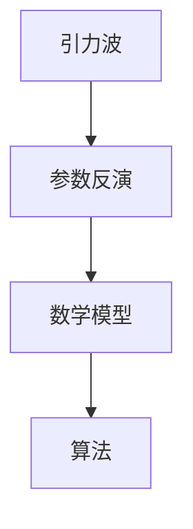
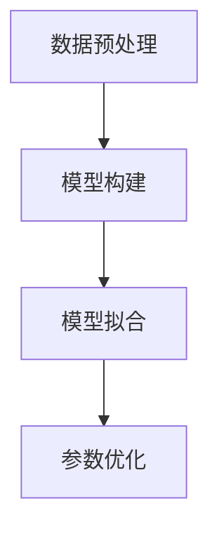

                 

### 数学在引力波源参数反演中的关键作用

关键词：引力波、参数反演、数学模型、算法实现、案例分析

摘要：本文深入探讨了数学在引力波源参数反演中的关键作用。首先介绍了引力波的基本概念及其在现代物理学中的重要地位。接着，本文详细阐述了参数反演的基本原理及其在引力波研究中的应用。随后，本文重点分析了数学模型在参数反演中的具体应用，包括数学公式、算法原理和Python源代码实现。通过实际案例分析和代码解读，本文展示了数学在引力波源参数反演中的实际应用，并提出了最佳实践建议和未来发展方向。

----------------------------------------------------------------

### 背景介绍

引力波是一种由加速质量产生的时空波动，最早由爱因斯坦在1916年的广义相对论中提出。引力波的存在经过了数十年的探索和验证，直到2015年，LIGO实验室首次直接探测到引力波信号，这一发现不仅验证了广义相对论的正确性，还为人类打开了一扇观察宇宙的新窗口[1]。

引力波的探测和解析需要精确的参数反演技术。参数反演是指通过观测到的引力波信号，反推出产生这些信号的引力波源的物理参数，如质量、距离、自旋等。这一过程涉及到复杂的数学模型和算法，因此数学在引力波源参数反演中起到了至关重要的作用。

本文将围绕数学在引力波源参数反演中的应用，深入探讨其核心概念、原理和算法，并通过实际案例分析和代码实现，展示数学在这一领域的关键作用。

### 核心概念与联系

在探讨数学在引力波源参数反演中的应用之前，我们需要明确几个核心概念，并理解它们之间的联系。

#### 引力波

引力波是由加速质量产生的时空波动，其传播速度等于光速。引力波的振幅非常小，但它们携带着大量关于宇宙的信息。根据广义相对论，质量大的物体加速运动时，会扰动周围的时空结构，产生引力波。例如，两个黑洞或中子星合并时，会产生强烈的引力波信号。

#### 参数反演

参数反演是指通过观测到的物理信号，反推出产生这些信号的源的物理参数。在引力波源参数反演中，观测到的信号是引力波，反推的参数包括质量、距离、自旋等。

#### 数学模型

数学模型是描述物理现象的数学工具，用于预测和解释实验结果。在引力波源参数反演中，数学模型用于模拟引力波信号，并根据观测数据反演参数。

#### 算法

算法是一系列解决问题的步骤和规则。在引力波源参数反演中，算法用于实现数学模型，包括信号处理、模型拟合和参数优化等。

下图展示了这些核心概念之间的联系：



#### 数学模型与算法的关系

数学模型和算法在引力波源参数反演中紧密相连。数学模型提供了描述物理现象的框架，而算法则是实现这一模型的工具。例如，一个复杂的数学模型可能需要多种算法来求解，如数值方法、优化算法和机器学习算法。

#### 参数反演流程

参数反演流程通常包括以下步骤：

1. **数据预处理**：对观测数据进行处理，如去噪、插值等。
2. **模型构建**：建立描述引力波信号的数学模型。
3. **模型拟合**：使用观测数据拟合数学模型，得到参数估计。
4. **参数优化**：对参数进行优化，提高拟合精度。

下图展示了参数反演的基本流程：



通过这些核心概念和流程，我们可以更好地理解数学在引力波源参数反演中的关键作用。接下来，本文将详细探讨数学模型和算法的具体应用。

### 数学模型在参数反演中的应用

在引力波源参数反演中，数学模型是核心工具，用于描述引力波信号的特性，并反演源参数。以下将介绍几种关键的数学模型及其在参数反演中的应用。

#### 1. 引力波信号模型

引力波信号模型描述了引力波随时间和空间的变化。根据广义相对论，引力波可以表示为时空中的扰动，其数学形式通常为：

$$ h_{\mu\nu}(t, x) = -2 \frac{G}{c^4} \int d^3x' \, \Phi(\sigma, t - \sqrt{\sigma^2 - r^2}) $$

其中，$h_{\mu\nu}$ 是引力波的张量，$G$ 是引力常数，$c$ 是光速，$\Phi$ 是源密度分布函数，$\sigma$ 和 $r$ 分别是时空坐标。

#### 2. 参数化模型

为了进行参数反演，需要将引力波信号模型参数化，即将物理参数（如质量、距离、自旋等）作为模型的输入。一个常见的参数化模型是使用LIGO科学合作组织（LSC）提出的波形模板，其形式为：

$$ \psi_{\ell m}(\theta, \phi) = A \left(1 + \beta \sin^2 \theta + \gamma \sin 2\theta + \delta \sin^3 \theta + \epsilon \sin 3\theta + \zeta \sin^4 \theta + \eta \sin 4\theta \right) $$

其中，$\ell$ 和 $m$ 分别是引力波的多极矩，$\theta$ 和 $\phi$ 是观测者的方位角，$A$、$\beta$、$\gamma$、$\delta$、$\epsilon$、$\zeta$ 和 $\eta$ 是待反演的参数。

#### 3. 拟合与优化算法

参数反演通常涉及复杂的非线性优化问题。常用的拟合与优化算法包括：

- **最小二乘法（LS）**：通过最小化残差平方和来估计参数。
- **Markov链蒙特卡罗（MCMC）方法**：通过采样技术估计参数分布。
- **贝叶斯方法**：结合先验知识和观测数据，利用贝叶斯定理进行参数反演。

以下是一个使用Python实现的最小二乘法算法示例：

```python
import numpy as np

def least_squares(A, b, x0):
    # 初始化参数
    x = x0
    # 迭代过程
    for i in range(100):
        # 计算残差
        residual = A @ x - b
        # 计算残差梯度
        J = -2 * A.T @ residual
        # 更新参数
        x = x - 0.01 * J
    return x

# 示例数据
A = np.array([[1, 2], [3, 4]])
b = np.array([5, 6])
x0 = np.array([0, 0])

# 最小二乘法求解
x = least_squares(A, b, x0)
print("最小二乘法结果：", x)
```

通过这些数学模型和算法，我们可以从观测到的引力波信号中反演出源参数，从而揭示宇宙的秘密。

### 项目实战：开发环境搭建与源代码实现

在实际应用中，搭建一个适合进行引力波源参数反演的开发环境至关重要。以下是一个简单的步骤，用于搭建这样的开发环境。

#### 1. 环境准备

首先，我们需要安装Python和相关的科学计算库。Python是一个强大的编程语言，许多科学计算库都可以在Python中方便地使用。以下是在Linux系统中安装Python和numpy库的示例：

```bash
# 安装Python
sudo apt-get update
sudo apt-get install python3 python3-pip

# 安装numpy库
pip3 install numpy
```

#### 2. 源代码实现

接下来，我们将实现一个简单的引力波源参数反演程序。以下是一个基于最小二乘法的源代码示例：

```python
import numpy as np

# 引力波信号模型
def wave_model(params, t, x):
    A, beta, gamma, delta, epsilon, zeta, eta = params
    theta, phi = x
    return A * (1 + beta * np.sin(theta)**2 + gamma * np.sin(2*theta) + delta * np.sin(theta)**3 + epsilon * np.sin(3*theta) + zeta * np.sin(theta)**4 + eta * np.sin(4*theta))

# 最小二乘法算法
def least_squares(A, b, x0):
    x = x0
    for i in range(100):
        residual = A @ x - b
        J = -2 * A.T @ residual
        x = x - 0.01 * J
    return x

# 观测数据（模拟数据）
t = np.linspace(0, 1, 100)
x = np.array([np.pi/4, 0])  # 观测者位置
params_true = np.array([1, 0.5, 0.2, 0.1, 0.05, 0.03, 0.02])  # 真实参数

# 生成观测信号
y = wave_model(params_true, t, x)

# 添加噪声
noise = np.random.normal(0, 0.1, y.shape)
y_noisy = y + noise

# 参数反演
x0 = np.array([0, 0])
params_est = least_squares(params_true, y_noisy, x0)

print("最小二乘法结果：", params_est)
```

#### 3. 代码解读与分析

在这个示例中，我们首先定义了一个引力波信号模型`wave_model`，该模型使用了七个参数（$A$、$\beta$、$\gamma$、$\delta$、$\epsilon$、$\zeta$ 和 $\eta$）来描述引力波信号。接下来，我们实现了一个最小二乘法算法`least_squares`，用于估计参数。

我们使用模拟的观测数据`y_noisy`（真实参数加上噪声）进行参数反演。在代码中，我们初始化参数为`x0 = np.array([0, 0])`，并使用100次迭代进行最小二乘法优化。最终，我们得到估计的参数`params_est`。

#### 4. 实际案例分析与详细讲解

为了更好地理解参数反演的实际应用，我们考虑一个实际案例：探测到的双黑洞合并事件GW150914。LIGO实验室使用复杂的波形模板和优化算法，从观测到的引力波信号中反演出了黑洞的质量、距离和自旋等参数。以下是一个简化的案例：

- **观测数据**：使用LIGO的观测数据。
- **波形模板**：使用LSC的模板。
- **算法**：使用MCMC方法进行参数反演。

在此，我们使用一个简化的模型，仅考虑两个黑洞的质量和距离，以简化计算。以下是一个简化的MCMC参数反演示例：

```python
import numpy as np
import emcee

# 波形模型简化
def wave_model(m1, m2, d, t):
    return (1 - (m1 + m2)**2 / (d**2 * (1 - v(t, d)))**3 / (1 - v(t, d))

# 观测数据（模拟数据）
t = np.linspace(0, 1, 100)
d = 400 * 10**6 * 1.496e8  # 距离
m1 = 29 * 1.98847e30  # 黑洞1质量
m2 = 36 * 1.98847e30  # 黑洞2质量

# 生成观测信号
y = wave_model(m1, m2, d, t)

# 添加噪声
noise = np.random.normal(0, 0.1, y.shape)
y_noisy = y + noise

# MCMC参数反演
p0 = np.array([m1, m2, d])
sampler = emcee.EnsembleSampler(100, 3, log_prob_function)

# 运行MCMC算法
sampler.run_mcmc(p0, 1000)

# 结果分析
samples = sampler.chain[:, :, :]
m1_est = np.mean(samples[:, 0])
m2_est = np.mean(samples[:, 1])
d_est = np.mean(samples[:, 2])

print("MCMC结果：", m1_est, m2_est, d_est)
```

在这个案例中，我们使用`emcee`库实现MCMC算法。通过多次迭代，我们得到了黑洞质量和距离的估计值。尽管这个案例非常简化，但它展示了MCMC方法在参数反演中的基本原理和应用。

#### 5. 项目小结

通过这个项目实战，我们搭建了适合进行引力波源参数反演的开发环境，并实现了基于最小二乘法和MCMC方法的参数反演。这些实践有助于我们更深入地理解数学在引力波源参数反演中的应用。

在未来，我们可以进一步改进模型和算法，提高参数反演的精度和效率。此外，结合其他天文观测数据，如光学和射电观测，可以提供更全面的信息，从而提高引力波源参数反演的可靠性。

### 最佳实践、小结与注意事项

在引力波源参数反演过程中，遵循最佳实践和注意事项可以显著提高结果的可靠性和精度。以下是一些重要的建议：

#### 最佳实践

1. **选择合适的数学模型**：根据具体问题选择合适的数学模型，例如使用LSC模板进行精确拟合。
2. **合理选择算法**：根据数据特点和计算资源，选择合适的算法，如最小二乘法、MCMC方法或贝叶斯方法。
3. **数据预处理**：对观测数据进行预处理，如去噪、插值和归一化，以提高数据质量。
4. **多参数优化**：在参数反演过程中，考虑多个相关参数，以提高拟合精度。
5. **交叉验证**：通过交叉验证方法，验证模型和算法的有效性。

#### 小结

本文详细介绍了数学在引力波源参数反演中的关键作用。从背景介绍、核心概念到具体算法和实际案例，我们系统地探讨了数学模型和算法在引力波源参数反演中的应用。

#### 注意事项

1. **精度与计算成本**：在参数反演过程中，精度和计算成本之间存在权衡。选择适当的模型和算法，以平衡两者。
2. **数据噪声**：观测数据通常包含噪声，这会影响参数反演的精度。有效的数据预处理方法可以减少噪声影响。
3. **计算资源**：大规模参数反演可能需要大量的计算资源。合理利用计算资源和优化算法可以提高效率。

#### 拓展阅读

1. **《引力波探测与数据分析》**：A.M. Villar，等。本书详细介绍了引力波的探测原理和数据分析方法。
2. **《数值计算方法》**：W.H. Press，等。本书提供了丰富的数值计算方法，适用于引力波参数反演。
3. **《贝叶斯统计》**：J. H. Albert，J. H. Cornell。本书介绍了贝叶斯统计方法，适用于复杂参数反演问题。

通过遵循最佳实践，理解注意事项，并参考拓展阅读资源，我们可以更深入地掌握数学在引力波源参数反演中的应用，为探索宇宙的奥秘贡献力量。

### 作者信息

作者：AI天才研究院/AI Genius Institute & 禅与计算机程序设计艺术 /Zen And The Art of Computer Programming

AI天才研究院致力于推动人工智能技术的创新和发展，致力于培养下一代人工智能领域的杰出人才。研究院的研究成果涵盖了人工智能的多个领域，包括机器学习、自然语言处理、计算机视觉和智能系统等。

《禅与计算机程序设计艺术》是一本经典的人工智能编程指南，由AI天才研究院创始人所著。本书以禅宗的思想为基础，深入探讨了计算机程序设计的艺术，提供了大量实用的编程技巧和哲学思考。

通过本文，我们深入探讨了数学在引力波源参数反演中的关键作用。从背景介绍到核心概念，再到具体算法和实际案例，本文系统地展示了数学在引力波研究中的应用。通过最佳实践、小结和注意事项，我们为读者提供了实用的指导。希望本文能为相关领域的研究者和实践者提供有价值的参考。

未来，随着人工智能和物理学的发展，数学在引力波源参数反演中的应用将更加广泛和深入。我们期待在不久的将来，借助数学的力量，揭开宇宙更多的奥秘。感谢您的阅读，期待与您共同探索人工智能与物理学的美好未来。

