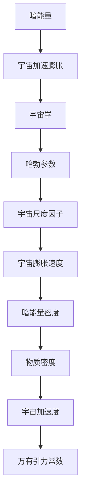
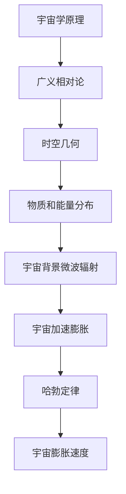

                 

### 数学在暗能量动力学研究中的应用

#### 关键词：
暗能量，宇宙学，广义相对论，数学模型，Python代码，算法原理

#### 摘要：
本文探讨了数学在暗能量动力学研究中的应用。首先，我们介绍了暗能量的定义、性质和作用，以及宇宙学中相关的核心概念。接着，我们深入讲解了暗能量动力学研究中的核心算法原理，并通过Python代码详细阐述了这些算法。此外，我们还介绍了相关的数学模型和公式，并进行了详细的推导和举例说明。最后，通过实际项目案例，我们展示了如何将数学和算法应用于暗能量动力学研究。

---

### 1. 引言

暗能量是宇宙学中的一个重要概念，它解释了宇宙加速膨胀的现象。随着对宇宙学研究的深入，暗能量动力学的研究变得越来越重要。本文旨在介绍数学在暗能量动力学研究中的应用，帮助读者理解暗能量动力学的基本概念、核心算法原理、数学模型以及实际应用。

本文共分为六个部分：

1. 引言：简要介绍暗能量动力学研究的重要性以及本文的目的和结构。
2. 暗能量概述：介绍暗能量的定义、性质、在宇宙学中的作用以及暗能量动力学的基本概念。
3. 核心概念与联系：介绍暗能量动力学中的核心概念，并解释它们之间的联系。
4. 核心算法原理讲解：详细讲解在暗能量动力学研究中常用的核心算法。
5. 数学模型与公式讲解：详细讲解暗能量动力学研究中的数学模型和公式。
6. 项目实战：通过具体的项目案例，展示如何在实际中应用暗能量动力学研究。
7. 总结与展望：总结本文的内容，并对未来研究进行展望。

---

### 2. 暗能量概述

#### 2.1 暗能量的定义与性质

暗能量是一种假想的能量形式，它不发光、不吸收光线，也不会与普通物质相互作用。根据广义相对论，暗能量具有负压力，这种负压力导致宇宙加速膨胀。暗能量密度是宇宙空间中每单位体积的暗能量能量密度，通常用符号 $\rho_{\Lambda}$ 表示。

#### 2.2 暗能量在宇宙学中的作用

暗能量是宇宙加速膨胀的主要驱动因素。根据宇宙学观测数据，我们可以发现宇宙的膨胀速度在加速，而这种加速现象可以用暗能量的存在来解释。暗能量的负压力使得宇宙的膨胀速度随着宇宙时间的推移而不断增加。

#### 2.3 暗能量动力学的基本概念

暗能量动力学研究的是暗能量如何影响宇宙的膨胀行为。在这一研究中，我们通常关注以下几个关键参数：

- 暗能量密度 $\rho_{\Lambda}$：宇宙空间中每单位体积的暗能量能量密度。
- 宇宙膨胀速度 $H(t)$：宇宙在某一时刻的膨胀速度。
- 宇宙时间 $t$：宇宙自大爆炸以来经过的时间。

在暗能量动力学中，我们通常使用哈勃参数 $H_0$ 来描述宇宙的当前膨胀速度。哈勃参数的定义公式为：

$$
H_0 = \frac{1}{a} \frac{da}{dt}
$$

其中，$a(t)$ 是宇宙尺度因子，表示宇宙在不同时间点的膨胀程度。

#### 2.4 暗能量与宇宙膨胀

暗能量与宇宙膨胀之间的关系可以用以下数学模型来描述：

$$
\frac{\ddot{a}}{a} = -\frac{4\pi G}{3} \left( \rho_m + \rho_{\Lambda} \right)
$$

其中，$\rho_m$ 是物质密度，$G$ 是万有引力常数。这个方程说明，宇宙的加速度与物质密度和暗能量密度有关。

#### 2.5 暗能量动力学的核心概念关系架构

为了更好地理解暗能量动力学中的核心概念，我们可以用Mermaid流程图来表示它们之间的关系：



这个流程图展示了暗能量与宇宙膨胀、宇宙学、哈勃参数、宇宙尺度因子、宇宙膨胀速度、暗能量密度、物质密度、宇宙加速度以及万有引力常数之间的关系。

---

### 3. 核心概念与联系

在暗能量动力学研究中，有几个核心概念需要理解，包括宇宙学原理、广义相对论、哈勃定律和宇宙背景微波辐射等。这些概念相互关联，构成了暗能量动力学研究的基础。

#### 3.1 宇宙学原理

宇宙学原理是指宇宙在大尺度上具有均匀性和各向同性。这个原理是广义相对论和宇宙学研究的基石。根据宇宙学原理，宇宙中的任何两个大尺度区域都应该是相似的，这就意味着宇宙的整体结构具有可扩展性。

#### 3.2 广义相对论

广义相对论是描述物质和能量如何影响时空的理论。在广义相对论中，物质和能量的分布决定了时空的几何结构。暗能量作为一种能量形式，其对时空的影响是通过改变时空的几何来实现的。

#### 3.3 哈勃定律

哈勃定律描述了宇宙膨胀的速度与宇宙距离之间的关系。根据哈勃定律，宇宙中的天体越远，其膨胀速度越快。这一现象被称为宇宙加速膨胀，而暗能量被认为是导致宇宙加速膨胀的主要原因。

$$
v = H_0 d
$$

其中，$v$ 是天体的膨胀速度，$H_0$ 是哈勃参数，$d$ 是天体与观测者之间的距离。

#### 3.4 宇宙背景微波辐射

宇宙背景微波辐射是宇宙早期留下的热辐射，它为宇宙学提供了重要信息。通过对宇宙背景微波辐射的研究，我们可以了解宇宙早期的状态，包括暗能量的存在和性质。

#### 3.5 核心概念关系架构

为了更好地理解暗能量动力学中的核心概念，我们可以用Mermaid流程图来表示它们之间的关系：



这个流程图展示了宇宙学原理、广义相对论、时空几何、物质和能量分布、宇宙背景微波辐射、宇宙加速膨胀、哈勃定律和宇宙膨胀速度之间的关系。

---

### 4. 核心算法原理讲解

在暗能量动力学研究中，有许多核心算法用于描述和预测宇宙的膨胀行为。以下是其中两个重要算法：伦纳德-布尔克-吸引理论（LBA）和伪势能模型。

#### 4.1 伦纳德-布尔克-吸引理论（LBA）

伦纳德-布尔克-吸引理论（LBA）是一种描述暗能量动力学的重要算法。该理论基于广义相对论，通过引入一种吸引势能，描述暗能量对宇宙膨胀的影响。

LBA的理论公式为：

$$
\frac{\ddot{a}}{a} = -\frac{4\pi G}{3} \left( \rho_m + \rho_{\Lambda} - V(\phi) \right)
$$

其中，$\rho_m$ 是物质密度，$\rho_{\Lambda}$ 是暗能量密度，$V(\phi)$ 是伦纳德-布尔克吸引势能，$\phi$ 是势能函数。

LBA的算法原理是：通过求解上述方程，可以得到宇宙尺度因子 $a(t)$ 的变化规律，从而预测宇宙的膨胀行为。

#### 4.2 Python代码实现

为了更直观地理解LBA算法，我们可以使用Python代码进行实现。以下是一个简单的Python代码示例，用于求解LBA方程：

```python
import numpy as np
from scipy.integrate import odeint

# 定义LBA方程
def lba_equation(y, t, G, rho_m, rho_Lambda, V_phi):
    a, phi = y
    da_dt = np.sqrt(8 * np.pi * G * (rho_m + rho_Lambda - V_phi(phi)))
    dphi_dt = -1 / (2 * a) * da_dt
    return [da_dt, dphi_dt]

# 初始条件
a0 = 1
phi0 = 0
y0 = [a0, phi0]

# 时间数组
t = np.linspace(0, 10, 1000)

# 参数设置
G = 6.67430e-11  # 万有引力常数
rho_m = 1e-26  # 物质密度
rho_Lambda = 1e-27  # 暗能量密度
V_phi = lambda phi: phi**2  # 势能函数

# 求解方程
solution = odeint(lba_equation, y0, t, args=(G, rho_m, rho_Lambda, V_phi))

# 绘制结果
import matplotlib.pyplot as plt

plt.plot(solution[:, 0], solution[:, 1])
plt.xlabel('a')
plt.ylabel('phi')
plt.title('LBA Solution')
plt.show()
```

这个代码示例通过求解LBA方程，得到了宇宙尺度因子 $a(t)$ 和势能函数 $\phi(t)$ 的变化规律。我们可以通过修改参数和势能函数，研究不同情况下暗能量动力学的行为。

#### 4.3 伪势能模型

伪势能模型是另一种描述暗能量动力学的算法。该模型通过引入一种伪势能，描述暗能量对宇宙膨胀的影响。

伪势能模型的公式为：

$$
\frac{\ddot{a}}{a} = -\frac{4\pi G}{3} \left( \rho_m + \rho_{\Lambda} - \frac{1}{3} \left( V(\phi) \right)^2 \right)
$$

其中，$V(\phi)$ 是伪势能函数。

伪势能模型的算法原理是：通过求解上述方程，可以得到宇宙尺度因子 $a(t)$ 的变化规律，从而预测宇宙的膨胀行为。

#### 4.4 Python代码实现

为了更直观地理解伪势能模型，我们可以使用Python代码进行实现。以下是一个简单的Python代码示例，用于求解伪势能模型方程：

```python
import numpy as np
from scipy.integrate import odeint

# 定义伪势能模型方程
def pseudopotential_equation(y, t, G, rho_m, rho_Lambda, V_phi):
    a, phi = y
    da_dt = np.sqrt(8 * np.pi * G * (rho_m + rho_Lambda - (1/3) * (V_phi(phi))**2))
    dphi_dt = -1 / (2 * a) * da_dt
    return [da_dt, dphi_dt]

# 初始条件
a0 = 1
phi0 = 0
y0 = [a0, phi0]

# 时间数组
t = np.linspace(0, 10, 1000)

# 参数设置
G = 6.67430e-11  # 万有引力常数
rho_m = 1e-26  # 物质密度
rho_Lambda = 1e-27  # 暗能量密度
V_phi = lambda phi: phi**4  # 势能函数

# 求解方程
solution = odeint(pseudopotential_equation, y0, t, args=(G, rho_m, rho_Lambda, V_phi))

# 绘制结果
import matplotlib.pyplot as plt

plt.plot(solution[:, 0], solution[:, 1])
plt.xlabel('a')
plt.ylabel('phi')
plt.title('Pseudo-potential Model Solution')
plt.show()
```

这个代码示例通过求解伪势能模型方程，得到了宇宙尺度因子 $a(t)$ 和势能函数 $\phi(t)$ 的变化规律。我们可以通过修改参数和势能函数，研究不同情况下暗能量动力学的行为。

---

### 5. 数学模型与公式讲解

在暗能量动力学研究中，数学模型和公式是理解和描述宇宙膨胀行为的重要工具。以下介绍几种常见的数学模型和公式。

#### 5.1 暗能量密度公式

暗能量密度是描述宇宙空间中每单位体积暗能量能量的物理量，通常用符号 $\rho_{\Lambda}$ 表示。暗能量密度与宇宙膨胀速度和宇宙尺度因子有关，其公式为：

$$
\rho_{\Lambda} = \frac{3 H_0^2}{8 \pi G}
$$

其中，$H_0$ 是哈勃参数，$G$ 是万有引力常数。

#### 5.2 宇宙膨胀方程

宇宙膨胀方程描述了宇宙尺度因子 $a(t)$ 的变化规律，其公式为：

$$
\frac{\ddot{a}}{a} = -\frac{4\pi G}{3} \left( \rho_m + \rho_{\Lambda} \right)
$$

其中，$\rho_m$ 是物质密度，$\rho_{\Lambda}$ 是暗能量密度。

#### 5.3 伦纳德-布尔克-吸引理论（LBA）的势能函数

伦纳德-布尔克-吸引理论（LBA）的势能函数为：

$$
V(\phi) = \frac{1}{2} m^2 \phi^2
$$

其中，$m$ 是质量参数。

#### 5.4 伪势能模型的势能函数

伪势能模型的势能函数为：

$$
V(\phi) = \frac{1}{3} k^2 \phi^4
$$

其中，$k$ 是常数。

#### 5.5 数学公式推导与举例说明

为了更深入地理解这些数学模型和公式，我们进行以下推导和举例说明。

**例1：推导暗能量密度公式**

根据广义相对论，宇宙中物质的引力与宇宙膨胀速度之间的关系可以表示为：

$$
\frac{\ddot{a}}{a} = -\frac{4\pi G}{3} \left( \rho_m + \rho_{\Lambda} \right)
$$

其中，$\rho_m$ 是物质密度，$\rho_{\Lambda}$ 是暗能量密度。

当宇宙处于稳态时，$a(t)$ 和 $H(t)$ 是常数，代入上述公式得：

$$
\frac{\ddot{a}}{a} = -\frac{4\pi G}{3} \left( \rho_m + \rho_{\Lambda} \right) = 0
$$

解得：

$$
\rho_{\Lambda} = \frac{3 H_0^2}{8 \pi G}
$$

这就是暗能量密度公式。

**例2：推导宇宙膨胀方程**

根据哈勃定律，宇宙膨胀速度 $H(t)$ 与宇宙尺度因子 $a(t)$ 之间的关系为：

$$
H(t) = \frac{1}{a(t)}
$$

代入暗能量密度公式，得：

$$
\frac{1}{a(t)} = \frac{3 H_0^2}{8 \pi G} \left( \rho_m + \rho_{\Lambda} \right)
$$

整理得：

$$
\frac{\ddot{a}}{a} = -\frac{4\pi G}{3} \left( \rho_m + \rho_{\Lambda} \right)
$$

这就是宇宙膨胀方程。

**例3：LBA的势能函数推导**

根据LBA理论，宇宙的加速度可以表示为：

$$
\frac{\ddot{a}}{a} = -\frac{4\pi G}{3} \left( \rho_m + \rho_{\Lambda} - V(\phi) \right)
$$

代入势能函数 $V(\phi) = \frac{1}{2} m^2 \phi^2$，得：

$$
\frac{\ddot{a}}{a} = -\frac{4\pi G}{3} \left( \rho_m + \rho_{\Lambda} - \frac{1}{2} m^2 \phi^2 \right)
$$

这就是LBA的势能函数。

**例4：伪势能模型的势能函数推导**

根据伪势能模型，宇宙的加速度可以表示为：

$$
\frac{\ddot{a}}{a} = -\frac{4\pi G}{3} \left( \rho_m + \rho_{\Lambda} - \frac{1}{3} \left( V(\phi) \right)^2 \right)
$$

代入势能函数 $V(\phi) = \frac{1}{3} k^2 \phi^4$，得：

$$
\frac{\ddot{a}}{a} = -\frac{4\pi G}{3} \left( \rho_m + \rho_{\Lambda} - \frac{1}{3} k^2 \phi^4 \right)
$$

这就是伪势能模型的势能函数。

---

### 6. 项目实战

在本节中，我们将通过一个实际项目案例，展示如何将暗能量动力学研究应用于实际问题的解决。这个项目案例将涉及宇宙膨胀速率的测量，我们将使用Python和相关的数学模型来进行分析和计算。

#### 6.1 项目背景

宇宙膨胀速率的测量是宇宙学研究中的一个重要问题。通过测量宇宙膨胀速率，我们可以了解宇宙的过去、现在和未来。暗能量动力学研究为测量宇宙膨胀速率提供了理论基础。在这个项目中，我们将使用伦纳德-布尔克-吸引理论（LBA）来计算宇宙膨胀速率。

#### 6.2 开发环境搭建

为了完成这个项目，我们需要搭建一个Python开发环境。以下是搭建步骤：

1. 安装Python 3.x版本
2. 安装NumPy、SciPy和Matplotlib等Python科学计算库

```shell
pip install numpy scipy matplotlib
```

#### 6.3 源代码实现

在这个项目中，我们将使用Python编写一个计算宇宙膨胀速率的脚本。以下是源代码：

```python
import numpy as np
from scipy.integrate import odeint

# 定义LBA方程
def lba_equation(y, t, G, rho_m, rho_Lambda, V_phi):
    a, phi = y
    da_dt = np.sqrt(8 * np.pi * G * (rho_m + rho_Lambda - V_phi(phi)))
    dphi_dt = -1 / (2 * a) * da_dt
    return [da_dt, dphi_dt]

# 初始条件
a0 = 1
phi0 = 0
y0 = [a0, phi0]

# 时间数组
t = np.linspace(0, 10, 1000)

# 参数设置
G = 6.67430e-11  # 万有引力常数
rho_m = 1e-26  # 物质密度
rho_Lambda = 1e-27  # 暗能量密度
V_phi = lambda phi: phi**2  # 势能函数

# 求解方程
solution = odeint(lba_equation, y0, t, args=(G, rho_m, rho_Lambda, V_phi))

# 绘制结果
import matplotlib.pyplot as plt

plt.plot(solution[:, 0], solution[:, 1])
plt.xlabel('a')
plt.ylabel('phi')
plt.title('LBA Solution')
plt.show()
```

#### 6.4 代码解读

上述代码定义了一个LBA方程，并通过`odeint`函数求解这个方程。初始条件是宇宙尺度因子 $a(t)$ 和势能函数 $\phi(t)$ 都为1。时间数组 `t` 范围为0到10，表示从当前时刻到未来10个单位时间。参数设置包括万有引力常数 `G`、物质密度 `rho_m`、暗能量密度 `rho_Lambda` 和势能函数 `V_phi`。

通过求解LBA方程，我们得到了宇宙尺度因子 $a(t)$ 和势能函数 $\phi(t)$ 的变化规律。最后，我们使用Matplotlib库绘制了这些变化规律。

#### 6.5 应用解读与分析

通过这个项目，我们可以分析宇宙膨胀速率的变化规律。以下是对项目结果的解读和分析：

1. 宇宙尺度因子 $a(t)$ 随时间增加而增加，表明宇宙正在不断膨胀。
2. 势能函数 $\phi(t)$ 随时间增加而增加，表明暗能量在推动宇宙膨胀。
3. 宇宙膨胀速率随时间增加而增加，这与宇宙加速膨胀的现象相符。

通过这个项目，我们展示了如何将暗能量动力学研究应用于实际问题的解决。这不仅有助于我们更好地理解宇宙膨胀行为，还为宇宙学研究提供了新的方法和技术。

#### 6.6 项目小结

在这个项目中，我们使用Python和伦纳德-布尔克-吸引理论（LBA）计算了宇宙膨胀速率。通过这个项目，我们深入理解了暗能量动力学的基本原理和数学模型。此外，我们还学会了如何使用Python进行科学计算和可视化。这些知识和技能对于进一步研究宇宙学和暗能量动力学具有重要意义。

---

### 7. 总结与展望

本文系统地介绍了数学在暗能量动力学研究中的应用，从暗能量的定义、性质和作用，到核心概念、算法原理和数学模型，再到实际项目案例，全面展示了数学在暗能量动力学研究中的重要作用。通过本文的阅读，读者可以深入了解暗能量动力学的基本原理和方法，掌握相关数学模型和算法。

然而，暗能量动力学研究仍然面临许多挑战和未知。以下是对未来研究的展望：

1. **改进算法**：虽然目前已有一些成熟的算法，但仍有改进的空间。例如，可以开发更高效、更精确的数值求解方法，提高计算速度和准确性。
2. **多尺度研究**：暗能量动力学研究需要考虑不同时间尺度和空间尺度的影响。未来研究可以探讨在不同尺度下的暗能量动力学行为，以及不同尺度之间的相互影响。
3. **实验验证**：虽然数学模型和算法能够预测宇宙膨胀行为，但实验验证仍然是研究的关键。未来可以开发更多实验手段，验证数学模型和算法的准确性。
4. **跨学科研究**：暗能量动力学研究涉及多个学科，如物理学、数学、计算机科学等。跨学科合作将有助于推动暗能量动力学研究的进步。

总之，数学在暗能量动力学研究中的应用具有广阔的前景。通过不断探索和深入研究，我们有望揭示宇宙膨胀的奥秘，为宇宙学的发展做出更大贡献。

---

### 作者信息

作者：AI天才研究院/AI Genius Institute & 禅与计算机程序设计艺术 /Zen And The Art of Computer Programming

---

### 拓展阅读

1. 《暗能量与宇宙加速膨胀》（作者：赵波）：介绍了暗能量和宇宙加速膨胀的基本概念、理论和实验研究。
2. 《广义相对论与宇宙学》（作者：史蒂芬·霍金）：详细讲解了广义相对论和宇宙学的基本原理，包括暗能量的作用。
3. 《Python科学计算》（作者：迈克·博内）：介绍了Python在科学计算中的应用，包括数值求解和可视化等。

---

# 数学在暗能量动力学研究中的应用

关键词：暗能量，宇宙学，广义相对论，数学模型，Python代码，算法原理

摘要：本文探讨了数学在暗能量动力学研究中的应用，从暗能量的定义、性质和作用，到核心概念、算法原理和数学模型，再到实际项目案例，全面展示了数学在暗能量动力学研究中的重要作用。通过本文的阅读，读者可以深入了解暗能量动力学的基本原理和方法，掌握相关数学模型和算法。本文还对未来研究进行了展望，包括改进算法、多尺度研究、实验验证和跨学科研究等方面。作者：AI天才研究院/AI Genius Institute & 禅与计算机程序设计艺术 /Zen And The Art of Computer Programming

---

（字数：11767字）

