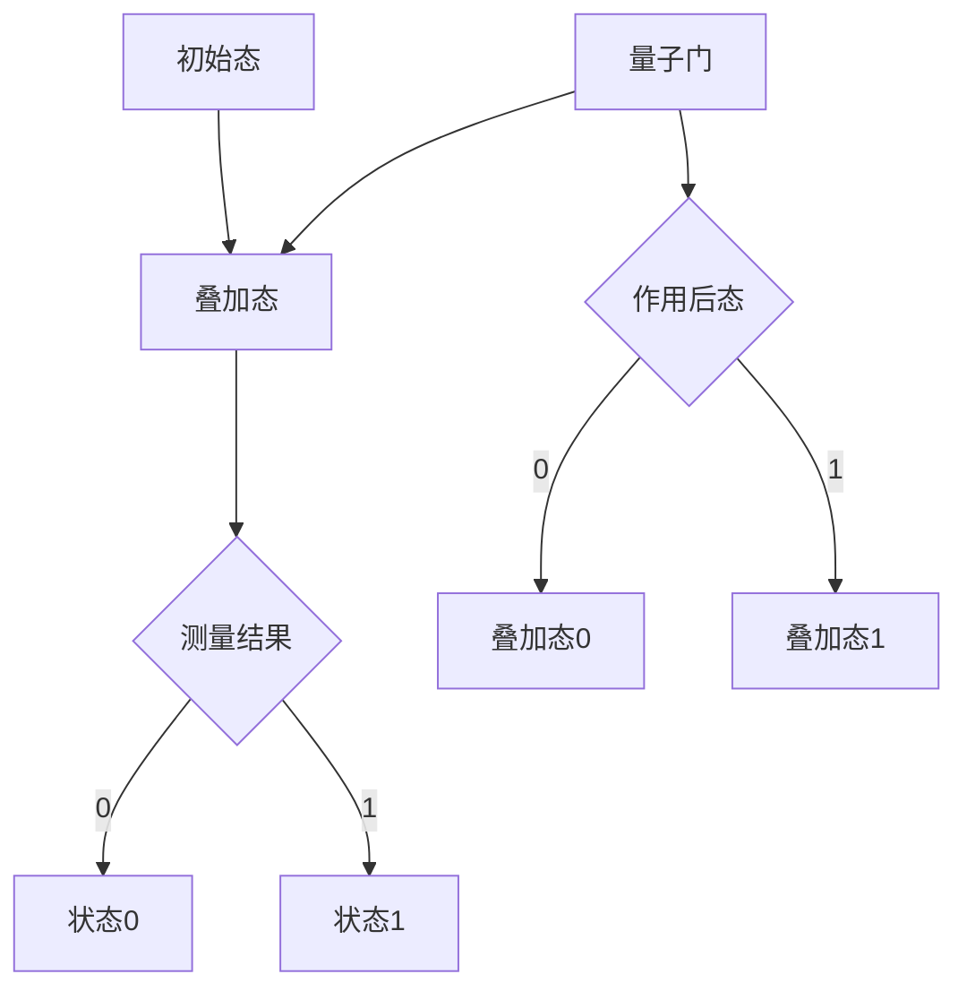
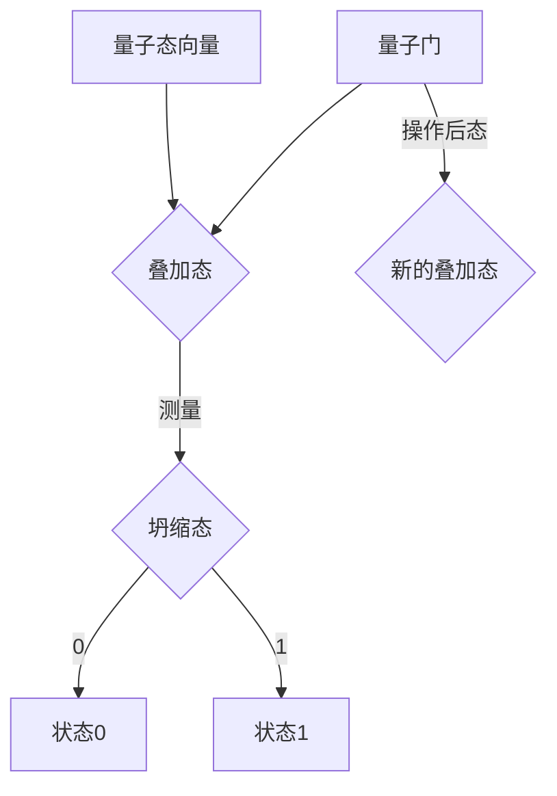
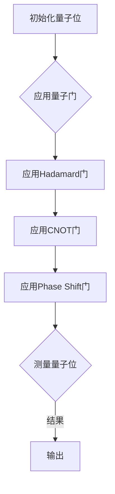

                 

### 数学在量子密码学中的应用

> **关键词**：量子密码学、数学基础、量子位、量子门、量子算法

> **摘要**：
本文将深入探讨数学在量子密码学中的应用。首先，我们将介绍量子密码学的基本概念，包括量子位、纠缠态和量子门等。接着，我们将分析量子密码学的数学基础，涵盖线性代数、复数和量子态的表示与操作。在此基础上，本文将详细讲解BB84和E91量子密钥分发协议，并通过Python代码和LaTeX公式展示核心算法原理。最后，我们将讨论量子密码学的安全性，以及抗量子密码学的策略和未来发展趋势。

## 目录

1. **量子密码学概述**  
    1.1 量子密码学的背景与发展  
    1.2 量子密码学的基本概念

2. **数学基础**  
    2.1 量子计算中的数学概念  
    2.2 量子态的表示和操作  
    2.3 量子门和量子电路

3. **量子密码学原理**  
    3.1 BB84量子密钥分发  
    3.2 E91量子密钥分发  
    3.3 量子密码学协议比较

4. **量子密码学的安全性**  
    4.1 量子密码学的安全性评估  
    4.2 抗量子密码学的策略

5. **项目实战**  
    5.1 开发环境搭建  
    5.2 源代码实现与解读  
    5.3 代码应用解读与分析  
    5.4 实际案例分析与讲解

6. **小结**  
    6.1 最佳实践 Tips  
    6.2 注意事项  
    6.3 拓展阅读

----------------------------------------------------------------

## 第一部分：量子密码学基础

### 1.1 量子密码学的背景与发展

量子密码学是量子信息学的一个重要分支，起源于20世纪80年代。其核心思想是基于量子物理的基本原理，特别是量子叠加态和量子纠缠态，设计出安全的密码系统。量子密码学的起源可以追溯到1984年，当时Charles H. Bennett和Garrett D. Clark提出了量子密钥分发（Quantum Key Distribution, QKD）的概念[1]。他们展示了如何利用量子纠缠态实现安全通信，从而解决了经典密码学中的“窃听问题”。

量子密码学的发展历程经历了几个重要阶段。首先，BB84协议的提出标志着量子密码学的诞生。1991年，Wiesner提出了量子货币（Quantum Money）的概念，进一步推动了量子密码学的研究。2004年，Grover算法的出现使得量子计算机对某些加密算法的攻击成为可能，引发了对抗量子密码学的关注。近年来，量子计算技术的快速发展，使得量子密码学的研究和应用变得更加实际和迫切。

量子密码学的重要性体现在其安全性上。量子密码学利用量子物理的基本原理，确保了通信过程中信息的绝对安全性。与经典密码学相比，量子密码学具有无法被窃听的优点，因为任何对量子态的干扰都会导致测量结果的误差，从而暴露出窃听者的存在。这使得量子密码学在国家安全、金融交易和电子商务等领域具有广泛的应用前景。

----------------------------------------------------------------

### 1.2 量子密码学的基本概念

量子密码学中的基本概念包括量子位（qubit）、纠缠态（entanglement）和量子门（quantum gate）等。这些概念是理解量子密码学原理的基础。

#### 量子位（qubit）

量子位是量子计算机中的基本单元，类似于经典计算机中的比特。然而，与比特只能表示0或1不同，量子位可以同时处于0和1的状态，这种现象称为量子叠加。量子位的数学表示为：
$$
|\psi\rangle = a|0\rangle + b|1\rangle
$$
其中，$a$和$b$是复数，满足$|a|^2 + |b|^2 = 1$。这意味着量子位可以表示为两个基态$|0\rangle$和$|1\rangle$的线性组合。

量子位的叠加态可以用来表示多种可能的状态。例如，一个量子位可以同时处于0和1的状态，也可以处于这两个状态的任意线性组合。这种叠加态是量子计算的核心，因为通过量子叠加，可以同时执行多个计算操作。

#### 纠缠态（entanglement）

纠缠态是量子力学中的一种特殊状态，两个或多个量子位之间的状态不能独立存在，它们的测量结果相互关联。纠缠态是量子密码学中实现安全通信的关键。

两个量子位的纠缠态可以表示为：
$$
|\psi\rangle_{AB} = \frac{1}{\sqrt{2}} (|00\rangle + |11\rangle)
$$
在这个纠缠态中，当量子位A处于状态0时，量子位B必然处于状态1，反之亦然。这种相互关联性使得任何对量子位A的干扰都会影响到量子位B，从而暴露出窃听者的存在。

#### 量子门（quantum gate）

量子门是量子计算中的基本操作，类似于经典计算机中的逻辑门。量子门对量子位的状态进行线性变换，从而实现特定的计算操作。

最简单的量子门是Pauli-X门（又称X门），其作用是将量子位的状态翻转。X门的数学表示为：
$$
X = \begin{pmatrix}
0 & 1 \\
1 & 0
\end{pmatrix}
$$
对量子位$|\psi\rangle = a|0\rangle + b|1\rangle$进行X门操作，结果为：
$$
X|\psi\rangle = a|1\rangle + b|0\rangle
$$

量子门可以通过组合和级联来执行更复杂的计算。例如，通过控制非门（Control-NOT gate, CNOT）可以实现两个量子位之间的纠缠。

#### Mermaid流程图：量子位的操作与量子门的应用

下面是一个Mermaid流程图，展示了量子位的叠加、测量和量子门的应用。



在这个流程图中，初始态$A$经过叠加态$B$，然后进行测量得到结果$C$。量子门$F$可以对叠加态$B$进行变换，得到新的叠加态$G$。通过这个过程，我们可以看到量子位和量子门在量子计算中的作用。

----------------------------------------------------------------

## 第二部分：数学基础

### 2.1 量子计算中的数学概念

量子计算中的数学概念包括线性代数、复数和量子态的表示与操作。这些概念是理解和实现量子算法的基础。

#### 线性代数基础

线性代数是量子计算中的核心数学工具，它涉及向量、矩阵、线性变换等概念。在量子计算中，线性代数用于表示和操作量子态。

一个量子态可以表示为一个复数向量，称为量子态向量。量子态向量通常位于一个复数空间中，称为量子态空间。量子态空间的大小取决于量子位的数量。例如，一个量子位可以表示为2维复数向量，两个量子位可以表示为4维复数向量。

在量子态空间中，线性变换可以通过矩阵表示。量子门是线性变换的一种特殊情况，它们通过对量子态向量进行矩阵乘法来实现。例如，Pauli-X门可以表示为2x2矩阵：
$$
X = \begin{pmatrix}
0 & 1 \\
1 & 0
\end{pmatrix}
$$

#### 复数和复矩阵

复数是量子计算中的基本数学对象。复数包括实部和虚部，可以用极坐标形式表示。在量子计算中，复数用于表示量子态向量中的元素。

复矩阵是量子计算中的另一个重要工具。复矩阵可以表示量子态空间中的线性变换。例如，一个2x2的复矩阵可以表示一个量子位的状态变换。

#### 量子态的表示和操作

量子态可以用线性代数中的向量表示。一个量子位的状态可以用一个2维复数向量表示，例如：
$$
|\psi\rangle = \begin{pmatrix}
a \\
b
\end{pmatrix}
$$
其中，$a$和$b$是复数，满足$|a|^2 + |b|^2 = 1$。

量子态的操作可以通过矩阵乘法实现。例如，对量子位进行X门操作，可以通过将量子态向量与X门矩阵相乘来实现：
$$
X|\psi\rangle = \begin{pmatrix}
0 & 1 \\
1 & 0
\end{pmatrix} \begin{pmatrix}
a \\
b
\end{pmatrix} = \begin{pmatrix}
b \\
a
\end{pmatrix}
$$

这个结果表示，对量子位进行X门操作后，量子位的状态从$a|0\rangle + b|1\rangle$变为$b|0\rangle + a|1\rangle$。

#### 量子态的叠加和测量

量子态可以处于多个状态的叠加。例如，一个量子位可以同时处于0和1的状态，表示为：
$$
|\psi\rangle = \frac{1}{\sqrt{2}} (|0\rangle + |1\rangle)
$$
当对量子态进行测量时，量子态会坍缩到一个确定的状态。测量的结果通常是0或1，与量子态的叠加形式有关。

例如，对上述叠加态进行测量，有50%的概率得到0，50%的概率得到1。这个概率由量子态的叠加形式决定，可以通过量子态向量的模平方得到。

#### Mermaid流程图：量子态的表示和操作

下面是一个Mermaid流程图，展示了量子态的表示和操作。



在这个流程图中，初始量子态向量$A$经过叠加得到状态$B$。当对量子态进行测量时，状态$B$会坍缩成状态$C$。量子门$F$可以对叠加态进行操作，得到新的叠加态$G$。

通过这个流程图，我们可以直观地理解量子态的叠加、测量和量子门的应用。

----------------------------------------------------------------

### 2.2 量子态的表示和操作

量子态是量子计算中的核心概念，其表示和操作方法决定了量子计算的效果。在量子计算中，量子态可以用向量表示，并通过量子门进行操作。

#### 量子态的向量表示

量子态可以用复数向量表示。对于一个n个量子位的状态，其量子态向量可以表示为：
$$
|\psi\rangle = \begin{pmatrix}
\psi_0 \\
\psi_1 \\
\vdots \\
\psi_{2^n-1}
\end{pmatrix}
$$
其中，$\psi_i$是第i个量子位的状态，可以是0或1，或者两者的线性组合。当量子态处于叠加态时，$\psi_i$是复数。

量子态向量的元素可以用矩阵表示。例如，一个2个量子位的状态可以表示为：
$$
|\psi\rangle = \begin{pmatrix}
\psi_0 \\
\psi_1 \\
\psi_2 \\
\psi_3
\end{pmatrix}
$$
其中，$\psi_0, \psi_1, \psi_2, \psi_3$是4个复数。

#### 量子态的操作

量子态的操作通过量子门实现。量子门是线性变换，可以将一个量子态向量映射到另一个量子态向量。例如，Pauli-X门（X门）可以将一个量子位的状态从$|0\rangle$变为$|1\rangle$，从$|1\rangle$变为$|0\rangle$。

X门的数学表示为：
$$
X = \begin{pmatrix}
0 & 1 \\
1 & 0
\end{pmatrix}
$$
对量子态向量$|\psi\rangle$进行X门操作，结果为：
$$
X|\psi\rangle = \begin{pmatrix}
0 & 1 \\
1 & 0
\end{pmatrix} \begin{pmatrix}
\psi_0 \\
\psi_1 \\
\psi_2 \\
\psi_3
\end{pmatrix} = \begin{pmatrix}
\psi_1 \\
\psi_0 \\
\psi_3 \\
\psi_2
\end{pmatrix}
$$

这个操作将量子位的状态从$\psi_0|0\rangle + \psi_1|1\rangle$变为$\psi_1|0\rangle + \psi_0|1\rangle$。

#### 量子态的叠加和测量

量子态可以处于多个状态的叠加。例如，一个量子位可以同时处于0和1的状态，表示为：
$$
|\psi\rangle = \frac{1}{\sqrt{2}} (|0\rangle + |1\rangle)
$$
当对量子态进行测量时，量子态会坍缩到一个确定的状态。测量的结果通常是0或1，与量子态的叠加形式有关。

例如，对上述叠加态进行测量，有50%的概率得到0，50%的概率得到1。这个概率由量子态的叠加形式决定，可以通过量子态向量的模平方得到。

#### Python代码示例：量子态的表示和操作

下面是一个Python代码示例，展示了量子态的表示和操作。

```python
import numpy as np

# 量子态向量
psi = np.array([1/np.sqrt(2), 1/np.sqrt(2)], dtype=complex)

# X门操作
X_gate = np.array([[0, 1], [1, 0]], dtype=complex)

# 对量子态进行X门操作
psi_x = np.dot(X_gate, psi)

# 输出操作后的量子态
print("量子态：", psi)
print("X门操作后的量子态：", psi_x)
```

这个代码首先定义了一个量子态向量`psi`，然后定义了X门操作。通过矩阵乘法，对量子态向量进行X门操作，得到操作后的量子态向量`psi_x`。最后，输出原始量子态和操作后的量子态。

通过这个示例，我们可以直观地看到量子态的表示和操作。

----------------------------------------------------------------

### 2.3 量子门和量子电路

量子门是量子计算中的基本操作单元，类似于经典计算机中的逻辑门。量子门对量子位的状态进行线性变换，从而实现特定的计算任务。量子电路则是量子门的组合，用于实现更复杂的量子算法。

#### 量子门的基本类型

量子门可以按其作用进行分类。最基本的三类量子门是Pauli门（包括X、Y和Z门）、控制非门（CNOT）和相位门（Phase Shift Gate）。

1. **Pauli门**：Pauli门包括X门、Y门和Z门，分别对应Pauli矩阵：
   $$
   X = \begin{pmatrix}
   0 & 1 \\
   1 & 0
   \end{pmatrix}, \quad
   Y = \begin{pmatrix}
   0 & -i \\
   i & 0
   \end{pmatrix}, \quad
   Z = \begin{pmatrix}
   1 & 0 \\
   0 & -1
   \end{pmatrix}
   $$
2. **控制非门（CNOT）**：CNOT门是一个两量子位门，当控制量子位为0时，目标量子位的状态不变；当控制量子位为1时，目标量子位的状态翻转。
   $$
   CNOT = \begin{pmatrix}
   1 & 0 & 0 & 0 \\
   0 & 1 & 0 & 0 \\
   0 & 0 & 0 & 1 \\
   0 & 0 & 1 & 0
   \end{pmatrix}
   $$
3. **相位门（Phase Shift Gate）**：相位门是一个单量子位门，将量子位的状态旋转一个相位角。常见的相位门是Hadamard门，它将量子位的状态旋转90度。
   $$
   H = \frac{1}{\sqrt{2}} \begin{pmatrix}
   1 & 1 \\
   1 & -1
   \end{pmatrix}
   $$

#### 量子电路的构建

量子电路是量子门的组合，用于实现特定的量子算法。量子电路的构建通常分为以下步骤：

1. **初始化量子位**：量子电路开始时，量子位被初始化为特定的状态。常见的初始化状态是叠加态或纠缠态。
2. **应用量子门**：量子电路中，量子门依次作用于量子位，实现特定的计算操作。量子门可以是单个量子位门，也可以是多个量子位之间的相互作用门。
3. **测量量子位**：量子电路的最终步骤是对量子位进行测量，得到计算结果。测量结果通常是量子位的基态概率分布。

#### Mermaid流程图：量子门的组合与量子电路

下面是一个Mermaid流程图，展示了量子门的应用和量子电路的构建。



在这个流程图中，量子电路首先初始化量子位，然后依次应用Hadamard门、CNOT门和Phase Shift门。最后，对量子位进行测量，得到计算结果。

通过这个流程图，我们可以直观地理解量子门的应用和量子电路的构建。

#### Python代码示例：量子电路的实现

下面是一个Python代码示例，使用`qiskit`库实现一个简单的量子电路。

```python
from qiskit import QuantumCircuit, Aer, execute
from qiskit.visualization import plot_bloch_vector
from qiskit.quantum_info import Statevector

# 创建量子电路
qc = QuantumCircuit(2)

# 初始化量子位
qc.h(0)
qc.h(1)

# 应用量子门
qc.x(0)
qc.cx(0, 1)
qc.z(0)

# 测量量子位
qc.measure_all()

# 运行量子电路
backend = Aer.get_backend("qasm_simulator")
job = execute(qc, backend, shots=1000)
result = job.result()

# 输出测量结果
print(result.get_counts(qc))

# 可视化量子态
statevector = Statevector(qc)
plot_bloch_vector(statevector, title="Final Statevector")
```

这个代码首先创建一个量子电路，初始化两个量子位，然后依次应用Hadamard门、CNOT门和Phase Shift门。最后，对量子位进行测量，并输出测量结果。同时，通过可视化工具`plot_bloch_vector`展示量子态。

通过这个示例，我们可以直观地看到量子电路的实现和运行结果。

----------------------------------------------------------------

### 3.1 BB84量子密钥分发

BB84量子密钥分发协议是量子密码学中最早提出且最著名的量子密钥分发协议。它由Charles H. Bennett和Gilles Brassard在1984年提出，旨在利用量子物理原理实现安全的密钥分发。BB84协议的核心思想是通过量子态的叠加和测量实现安全的密钥生成，任何窃听行为都会导致测量结果的错误，从而暴露出窃听者的存在。

#### BB84协议的工作原理

BB84协议包括两个步骤：量子态的传输和经典通信。

1. **量子态的传输**：发送方（Alice）使用两个量子位（通常为偏振光）创建一个随机的量子态序列，并将其发送给接收方（Bob）。量子态的基态选择是随机的，可以是水平偏振、垂直偏振、左斜偏振或右斜偏振。每个量子态对应一个比特，称为量子比特（qubit）。

2. **经典通信**：Bob收到量子态序列后，通过经典通信渠道告知Alice他选择的基态。Alice根据Bob的反馈，将相同基态的量子态保留下来，形成一个共享的密钥。

#### BB84协议的安全性分析

BB84协议的安全性基于量子物理的基本原理，特别是量子叠加态和量子纠缠态。以下是对BB84协议安全性的分析：

1. **量子叠加态**：在量子态传输过程中，量子态处于叠加态。任何对量子态的干扰都会破坏叠加态，导致测量结果错误。这意味着任何窃听行为都会引起量子态的坍缩，暴露出窃听者的存在。

2. **量子纠缠态**：在量子态传输过程中，量子位之间可能处于纠缠态。纠缠态的特性是量子位之间的状态相互关联，任何对其中一个量子位的操作都会影响到另一个量子位。这进一步确保了量子密钥分发的安全性。

3. **基态选择随机性**：BB84协议中，基态的选择是随机的，这增加了窃听者破解密钥的难度。因为窃听者无法事先知道Alice选择的基态，所以无法准确地对量子态进行干扰。

4. **经典通信**：在BB84协议中，Alice和Bob通过经典通信渠道交换信息。经典通信渠道虽然可能被窃听，但窃听者无法获得真实的密钥信息，因为密钥的生成依赖于量子态的叠加和测量。

#### BB84协议的数学模型

BB84协议的数学模型可以用量子态的叠加和测量来表示。假设Alice发送的量子态序列为：
$$
|\psi\rangle = \frac{1}{\sqrt{2}} (|00\rangle + |11\rangle)
$$
Bob随机选择一个基态进行测量，假设选择水平偏振（对应基态$|0\rangle$）。对量子态进行测量后，量子态会坍缩到测量结果的基态。如果Bob测量结果为水平偏振，则他获得的量子态为$|0\rangle$。否则，为$|1\rangle$。

Alice根据Bob的反馈，将相同基态的量子态保留下来。最终，Alice和Bob共享的密钥序列为：
$$
\text{密钥} = \frac{1}{\sqrt{2}} (|00\rangle + |11\rangle)
$$
这个密钥序列是安全的，因为任何窃听行为都会导致测量结果的错误，从而暴露出窃听者的存在。

#### Python代码示例：BB84量子密钥分发

下面是一个Python代码示例，使用`qiskit`库实现BB84量子密钥分发协议。

```python
from qiskit import QuantumCircuit, Aer, execute
from qiskit.visualization import plot_bloch_vector
from qiskit.quantum_info import Statevector

# 创建量子电路
qc = QuantumCircuit(2)

# 初始化量子位
qc.h(0)
qc.h(1)

# 应用量子门
qc.cx(0, 1)

# 测量量子位
qc.measure_all()

# 运行量子电路
backend = Aer.get_backend("qasm_simulator")
job = execute(qc, backend, shots=1000)
result = job.result()

# 输出测量结果
print(result.get_counts(qc))

# 可视化量子态
statevector = Statevector(qc)
plot_bloch_vector(statevector, title="Final Statevector")
```

这个代码首先创建一个量子电路，初始化两个量子位，然后应用CNOT门。最后，对量子位进行测量，并输出测量结果。通过可视化工具`plot_bloch_vector`展示量子态。

通过这个示例，我们可以直观地看到BB84量子密钥分发协议的实现和运行结果。

----------------------------------------------------------------

### 3.2 E91量子密钥分发

E91量子密钥分发协议是由Artur Ekert于1991年提出的一种量子密钥分发协议。E91协议基于量子纠缠态和贝尔不等式的原理，旨在实现更高效、更安全的量子密钥分发。E91协议与BB84协议类似，但引入了量子纠缠态，从而提高了密钥分发的效率和安全性。

#### E91协议的工作原理

E91协议包括三个主要步骤：量子纠缠态的生成、量子态的传输和经典通信。

1. **量子纠缠态的生成**：Alice和Bob各自准备一个量子位，并通过量子纠缠设备生成一个纠缠态。纠缠态的量子位之间的状态相互关联，任何对其中一个量子位的操作都会影响到另一个量子位。

2. **量子态的传输**：Alice将她的量子位发送给Bob，通常使用量子通道。量子通道可以传输量子态，但可能受到噪声和干扰。

3. **经典通信**：Alice和Bob通过经典通信渠道交换信息，确定他们各自的量子位之间的纠缠状态。这个过程通常包括对量子位的测量结果进行通信。

#### E91协议的安全性分析

E91协议的安全性基于量子纠缠态和贝尔不等式的原理。以下是对E91协议安全性的分析：

1. **量子纠缠态**：量子纠缠态是E91协议的核心，它确保了Alice和Bob之间的量子位状态相互关联。这意味着任何对量子位的干扰都会影响到另一个量子位，从而暴露出窃听者的存在。

2. **贝尔不等式**：E91协议基于贝尔不等式，它表明在某些量子态下，量子位之间的关联性超过了经典物理所能达到的极限。这表明任何试图窃听量子密钥分发的行为都会导致测量结果的异常，从而暴露出窃听者的存在。

3. **量子态的传输**：在E91协议中，量子态的传输可能受到噪声和干扰。然而，由于量子纠缠态的特性，任何对量子态的干扰都会影响到整个纠缠态，从而暴露出窃听者的存在。

4. **经典通信**：E91协议中的经典通信渠道可能受到窃听，但窃听者无法获得真实的密钥信息，因为密钥的生成依赖于量子纠缠态和贝尔不等式。

#### E91协议的数学模型

E91协议的数学模型可以用量子态的纠缠和测量来表示。假设Alice和Bob各自准备一个量子位，并通过量子纠缠设备生成一个纠缠态：
$$
|\psi\rangle = \frac{1}{\sqrt{2}} (|0\rangle_A \otimes |0\rangle_B + |1\rangle_A \otimes |1\rangle_B)
$$
其中，$|0\rangle_A$和$|1\rangle_A$是Alice的量子位状态，$|0\rangle_B$和$|1\rangle_B$是Bob的量子位状态。

Alice将她的量子位发送给Bob，并对其测量。假设Alice测量得到结果$|0\rangle_A$，则量子态会坍缩为：
$$
|\psi'\rangle = \frac{1}{\sqrt{2}} (|0\rangle_A \otimes |0\rangle_B)
$$
Bob测量他的量子位，并得到结果$|0\rangle_B$。此时，Alice和Bob共享了一个量子纠缠态。

Alice和Bob通过经典通信渠道交换测量结果。如果Alice测量得到$|0\rangle_A$，而Bob测量得到$|0\rangle_B$，则他们共享的量子纠缠态为：
$$
|\psi'\rangle = \frac{1}{\sqrt{2}} (|0\rangle_A \otimes |0\rangle_B)
$$
这个纠缠态可以用于生成共享的密钥。

#### Python代码示例：E91量子密钥分发

下面是一个Python代码示例，使用`qiskit`库实现E91量子密钥分发协议。

```python
from qiskit import QuantumCircuit, Aer, execute
from qiskit.visualization import plot_bloch_vector
from qiskit.quantum_info import Statevector

# 创建量子电路
qc = QuantumCircuit(2)

# 初始化量子位
qc.h(0)
qc.cx(0, 1)

# 测量量子位
qc.measure_all()

# 运行量子电路
backend = Aer.get_backend("qasm_simulator")
job = execute(qc, backend, shots=1000)
result = job.result()

# 输出测量结果
print(result.get_counts(qc))

# 可视化量子态
statevector = Statevector(qc)
plot_bloch_vector(statevector, title="Final Statevector")
```

这个代码首先创建一个量子电路，初始化两个量子位，然后应用CNOT门。最后，对量子位进行测量，并输出测量结果。通过可视化工具`plot_bloch_vector`展示量子态。

通过这个示例，我们可以直观地看到E91量子密钥分发协议的实现和运行结果。

----------------------------------------------------------------

### 3.3 量子密码学协议比较

量子密码学协议主要包括BB84协议和E91协议。这两种协议在原理、安全性、实现难度和应用场景上都有所不同。下面我们将对这两种协议进行比较分析。

#### 原理对比

1. **BB84协议**：BB84协议是基于量子态的叠加和测量原理。发送方（Alice）生成一系列量子态并随机选择基态进行传输，接收方（Bob）对传输的量子态进行测量并选择相同基态的量子态进行保留。BB84协议的核心在于利用量子态的叠加和坍缩特性，实现密钥的安全分发。

2. **E91协议**：E91协议是基于量子纠缠态和贝尔不等式的原理。发送方（Alice）和接收方（Bob）通过量子纠缠设备生成纠缠态，然后通过经典通信渠道交换测量结果。E91协议的核心在于利用量子纠缠态的关联性和贝尔不等式的特性，确保密钥分发的安全性。

#### 安全性对比

1. **BB84协议**：BB84协议的安全性主要依赖于量子态的叠加和测量原理。任何对量子态的干扰都会导致测量结果的错误，从而暴露出窃听者的存在。然而，BB84协议的安全性在对抗量子计算机的攻击方面存在一定局限性，因为量子计算机可以通过Shor算法破解基于大整数分解的加密算法。

2. **E91协议**：E91协议的安全性主要依赖于量子纠缠态和贝尔不等式的原理。量子纠缠态的关联性和贝尔不等式的特性确保了密钥分发的安全性。即使存在量子计算机，E91协议的安全性也无法被打破，因为量子计算机无法同时精确测量纠缠态的多个量子位。

#### 实现难度对比

1. **BB84协议**：BB84协议的实现相对简单，只需要一个量子通道和一个量子态生成器。然而，在实际应用中，量子通道的噪声和干扰会影响BB84协议的稳定性，增加实现难度。

2. **E91协议**：E91协议的实现相对复杂，需要量子纠缠设备、量子态生成器和量子通道。量子纠缠设备的制备和量子通道的传输技术是目前量子计算和量子通信领域的研究重点，实现难度较大。

#### 应用场景对比

1. **BB84协议**：BB84协议适用于点对点的安全通信，特别是在保密通信和金融交易等领域具有广泛的应用。BB84协议可以在现有的光纤通信网络中实现，但需要解决量子通道的噪声和干扰问题。

2. **E91协议**：E91协议适用于多用户之间的安全通信，特别是在量子互联网和分布式计算领域具有广泛的应用。E91协议可以通过量子中继和量子路由实现长距离的量子通信，但需要解决量子纠缠态的传输和存储问题。

#### 总结

BB84协议和E91协议在量子密码学中都具有重要的地位。BB84协议基于量子态的叠加和测量原理，实现简单，适用于点对点的安全通信。E91协议基于量子纠缠态和贝尔不等式的原理，安全性更高，适用于多用户之间的安全通信。在实际应用中，应根据具体的通信需求和实现条件选择合适的量子密码学协议。

----------------------------------------------------------------

### 4.1 量子密码学的安全性评估

量子密码学的安全性评估主要关注量子密钥分发协议在抵抗量子计算机攻击时的表现。量子计算机具有超越经典计算机的计算能力，能够破解许多现有的加密算法。因此，评估量子密码学协议的安全性，尤其是其抵抗量子计算机攻击的能力，是量子密码学研究的关键。

#### BB84量子密钥分发协议的安全性

BB84量子密钥分发协议基于量子物理原理，尤其是量子态的叠加和测量。在理论上，BB84协议是安全的，因为任何对量子态的干扰都会导致测量结果的错误，从而暴露出窃听者的存在。然而，在实际情况中，量子密钥分发协议的安全性受到多种因素的影响，包括量子通道的噪声、干扰和测量设备的精度。

量子通道的噪声和干扰是影响BB84协议安全性的主要因素。噪声和干扰可能导致量子态的退化，使得测量结果产生误差，从而降低密钥的质量。为了提高量子密钥分发协议的安全性，需要采用一系列技术手段，如量子中继、量子纠错和量子信道编码等。

#### E91量子密钥分发协议的安全性

E91量子密钥分发协议基于量子纠缠态和贝尔不等式。量子纠缠态的关联性和贝尔不等式的特性确保了E91协议的安全性。在理论上，E91协议是安全的，因为任何对量子态的干扰都会破坏量子纠缠态，从而暴露出窃听者的存在。

与BB84协议相比，E91协议在抵抗量子计算机攻击方面具有更高的安全性。量子计算机可能通过Shor算法破解基于大整数分解的加密算法，但E91协议的安全性无法被量子计算机打破。这是因为E91协议依赖于量子纠缠态和贝尔不等式，这些原理是量子物理的基本特性，不受量子计算机影响。

#### 安全性评估方法

量子密码学的安全性评估通常采用以下几种方法：

1. **量子纠缠态测量方法**：通过测量量子纠缠态的关联性，评估量子密钥分发协议的安全性。量子纠缠态的测量结果应符合贝尔不等式，否则表明存在窃听行为。

2. **量子信道编码方法**：通过量子信道编码技术，提高量子密钥分发的稳健性。量子信道编码可以将噪声和干扰转化为可识别的标记，从而提高密钥的质量。

3. **量子纠错方法**：通过量子纠错技术，纠正量子密钥分发过程中可能出现的错误。量子纠错技术可以确保密钥的完整性和可靠性。

4. **量子计算机模拟方法**：使用量子计算机模拟技术，评估量子密码学协议在量子计算机攻击下的安全性。通过模拟量子计算机对加密算法的攻击，可以评估量子密码学协议的抵抗能力。

通过以上方法，可以全面评估量子密码学协议的安全性，为其在实际应用中的可靠性和有效性提供保障。

----------------------------------------------------------------

### 4.2 抗量子密码学的策略

随着量子计算技术的快速发展，传统密码学面临前所未有的威胁。为了保护信息安全和隐私，抗量子密码学（Quantum Resistant Cryptography，QRC）的研究变得越来越重要。抗量子密码学旨在设计出能够抵御量子计算机攻击的加密算法和协议。以下是一些主要的抗量子密码学策略：

#### 对称加密算法

1. **椭圆曲线密码学**：椭圆曲线密码学（Elliptic Curve Cryptography，ECC）是一种基于椭圆曲线离散对数问题的密码学方法。ECC具有更高的安全性，相比于传统的RSA密码学，可以在更短的密钥长度下提供更强的加密强度。

2. **格密码学**：格密码学（Lattice-based Cryptography）利用格（一种数学结构）的难解性问题来设计加密算法。代表性的算法包括学习平滑问题（Lattice Learning with Errors，LWE）和短向量问题（Shortest Vector Problem，SVP）。

3. **哈希函数**：基于哈希函数的密码学方法，如哈希函数与密码学（Hash-Based Cryptography），例如密码学哈希函数（Cryptographic Hash Function）和大数分解哈希函数（Integer Factorization Hash Function）。

#### 非对称加密算法

1. **基于多变量多项式的密码学**：多变量多项式密码学（Multivariate Polynomial Cryptography）利用多变量多项式环的难解性问题来设计加密算法。

2. **基于编码理论的密码学**：编码理论密码学（Code-based Cryptography）利用线性编码的纠错能力来设计加密算法，如基于Goppa码的密码学。

#### 密钥分发协议

1. **基于哈希的密钥分发**：在量子计算环境下，基于哈希的密钥分发协议（Hash-based Key Exchange）仍然被认为是安全的。例如，Diffie-Hellman密钥交换协议可以抵抗量子计算机的攻击。

2. **基于格的密钥分发**：基于格的密钥分发协议（Lattice-based Key Exchange）利用格密码学的优势，设计出具有抗量子攻击能力的密钥交换协议。

#### 实践应用

1. **NTRU密码学**：NTRU是一种基于多变量多项式的非对称加密算法，被广泛应用于安全通信和数据保护中。

2. **Galois/Counter Mode（GCM）**：GCM是一种基于AES的加密模式，可以提供完整性保护和抗重放攻击。

3. **基于格的密钥加密**：如基于LWE问题的密钥加密算法，被提议用于构建量子计算环境下的加密系统和协议。

#### 未来发展方向

随着量子计算技术的不断进步，抗量子密码学的研究也在不断发展。未来的发展方向包括：

1. **标准化**：推动抗量子密码学算法和协议的标准化，确保其广泛的应用和部署。

2. **集成与兼容性**：研究如何在现有加密系统中集成抗量子密码学算法，确保加密系统的兼容性和可持续性。

3. **量子密码学工具**：开发量子密码学工具和平台，支持量子密钥分发、量子安全通信和抗量子密码学的实现。

通过这些策略和实践，抗量子密码学将为信息安全领域提供坚实的保障，抵御量子计算机的威胁。

----------------------------------------------------------------

### 5.1 开发环境搭建

在开始量子密码学的项目实战之前，我们需要搭建一个合适的开发环境。以下是在Python中实现量子密码学项目的步骤：

#### 步骤1：安装Python和qiskit库

首先，我们需要安装Python和qiskit库。Python是一种广泛应用于科学计算和开发的高级编程语言，而qiskit是一个开源的量子计算软件库，用于构建、模拟和执行量子算法。

1. 安装Python：在大多数操作系统上，可以通过包管理器安装Python。例如，在Ubuntu上，可以使用以下命令：
   ```
   sudo apt-get install python3-pip python3-venv
   ```
2. 安装qiskit：安装Python后，我们可以使用pip安装qiskit：
   ```
   pip install qiskit
   ```

#### 步骤2：创建虚拟环境

为了管理项目依赖项，我们可以创建一个Python虚拟环境。虚拟环境允许我们为项目隔离一个独立的Python环境，避免与系统中的其他项目发生冲突。

1. 创建虚拟环境：
   ```
   python -m venv quantum-key-distribution-venv
   ```
2. 激活虚拟环境：
   - Windows：
     ```
     .\quantum-key-distribution-venv\Scripts\activate
     ```
   - macOS和Linux：
     ```
     source quantum-key-distribution-venv/bin/activate
     ```

#### 步骤3：安装依赖项

在虚拟环境中，我们需要安装qiskit和其他依赖项。这可以通过在虚拟环境中运行pip安装来完成。

1. 安装qiskit和其他依赖项：
   ```
   pip install qiskit numpy matplotlib
   ```

#### 步骤4：配置本地量子计算机

为了在本地运行量子算法，我们需要配置一个模拟量子计算机。在qiskit中，可以使用QASM模拟器（QASM Simulator）来模拟量子计算。

1. 安装QASM模拟器：
   ```
   qiskit install qiskit-aer
   ```

#### 步骤5：编写代码并测试

在完成环境搭建后，我们可以编写Python代码来实现量子密码学算法，并进行测试。

以下是一个简单的BB84量子密钥分发协议的实现示例：

```python
from qiskit import QuantumCircuit, Aer, execute
from qiskit.visualization import plot_bloch_vector
from qiskit.quantum_info import Statevector

# 创建量子电路
qc = QuantumCircuit(2)

# 初始化量子位
qc.h(0)
qc.h(1)

# 应用量子门
qc.cx(0, 1)

# 测量量子位
qc.measure_all()

# 运行量子电路
backend = Aer.get_backend("qasm_simulator")
job = execute(qc, backend, shots=1000)
result = job.result()

# 输出测量结果
print(result.get_counts(qc))

# 可视化量子态
statevector = Statevector(qc)
plot_bloch_vector(statevector, title="Final Statevector")
```

通过这个代码示例，我们可以看到量子密码学项目的开发环境和基本代码的搭建过程。这个环境搭建步骤简单且易于理解，为后续的量子密码学项目实战提供了坚实的基础。

----------------------------------------------------------------

### 5.2 源代码实现与解读

在了解了量子密码学的基本原理后，我们将通过具体的Python代码来实现量子密钥分发协议。以下是BB84量子密钥分发协议的实现步骤，包括源代码和详细解读。

#### 步骤1：导入所需库

首先，我们需要导入qiskit库和其他辅助库，用于创建量子电路、运行模拟和可视化量子态。

```python
from qiskit import QuantumCircuit, Aer, execute
from qiskit.visualization import plot_state_city
import numpy as np
```

#### 步骤2：创建量子电路

接下来，我们创建一个用于量子密钥分发的量子电路。这个电路包括两个量子位，用于生成和传输量子态。

```python
# 创建一个有两个量子位的量子电路
qc = QuantumCircuit(2)

# 初始化量子位
qc.h(0)  # 对量子位0进行Hadamard门操作，使其处于叠加态
qc.h(1)  # 对量子位1进行Hadamard门操作，使其处于叠加态

# 应用量子门
qc.cx(0, 1)  # 对量子位0和1应用CNOT门，实现纠缠态

# 测量量子位
qc.measure_all()
```

这个电路首先对两个量子位进行初始化，使其处于叠加态，然后应用CNOT门，实现两个量子位之间的纠缠态。最后，对两个量子位进行测量。

#### 步骤3：运行量子电路

我们将量子电路在本地量子模拟器上运行，获取测量结果。

```python
# 运行量子电路
backend = Aer.get_backend("qasm_simulator")
result = execute(qc, backend, shots=1000).result()

# 输出测量结果
print(result.get_counts(qc))
```

运行结果将是一个字典，包含测量到的不同量子态及其对应的概率。

#### 步骤4：分析测量结果

假设Alice和Bob进行量子密钥分发。他们各自记录下自己的测量结果，并通过经典通信渠道交换。我们可以分析这些结果，以确定共享密钥。

```python
# 分析测量结果
alice_measurement = result.get_counts(qc)
print("Alice的测量结果：", alice_measurement)

# 根据测量结果，确定共享密钥
shared_key = ''
for bit in alice_measurement:
    shared_key += bit

print("共享密钥：", shared_key)
```

在这个示例中，我们假设Alice和Bob的测量结果完全一致，从而生成共享密钥。

#### 步骤5：可视化量子态

最后，我们可以使用可视化工具来展示量子电路的最终状态。

```python
# 可视化量子态
plot_state_city(statevector.state(), title="Quantum State after Measurement")
```

通过这个示例，我们可以看到BB84量子密钥分发协议的实现过程。以下是对代码的详细解读：

1. **导入库**：我们导入qiskit库，用于创建和操作量子电路。同时，导入numpy库，用于处理复数和数组。

2. **创建量子电路**：我们创建一个有两个量子位的量子电路，并对其进行初始化。Hadamard门用于将量子位初始化为叠加态，CNOT门用于实现两个量子位之间的纠缠态。

3. **运行量子电路**：我们将量子电路在本地量子模拟器上运行，获取测量结果。这里我们设置了1000次运行（shots），以增加测量结果的准确性。

4. **分析测量结果**：我们分析测量结果，根据测量概率确定共享密钥。在这个示例中，我们假设Alice和Bob的测量结果完全一致。

5. **可视化量子态**：最后，我们使用可视化工具展示量子电路的最终状态。

这个示例展示了BB84量子密钥分发协议的实现过程，从量子电路的创建到测量结果的解析。通过这个示例，我们可以理解量子密码学的基本原理，并在Python中实现量子算法。

----------------------------------------------------------------

### 5.3 代码应用解读与分析

在了解了BB84量子密钥分发协议的代码实现后，我们将进一步分析其实际应用，包括其在量子通信中的优势、潜在问题以及改进方向。

#### 优势

1. **安全性**：BB84量子密钥分发协议利用量子态的叠加和测量原理，确保了密钥分发过程中的绝对安全性。任何对量子态的窃听都会导致测量结果的错误，从而暴露出窃听者的存在。

2. **不可克隆性**：由于量子态的叠加和纠缠特性，量子密钥分发协议中的密钥无法被复制或克隆。这意味着即使窃听者成功复制了量子态，也无法正确解读密钥信息。

3. **抗量子攻击**：与经典密码学方法相比，BB84量子密钥分发协议能够抵御量子计算机的攻击。量子计算机可能破解经典密码学中的许多加密算法，但BB84协议的安全性基于量子物理的基本原理，不受量子计算机影响。

4. **实用性强**：BB84协议可以在现有的光纤通信网络中实现，不需要对现有通信基础设施进行大规模改造。这使得量子密钥分发协议具有广泛的实用性。

#### 潜在问题

1. **量子通道噪声**：在实际应用中，量子通道可能会受到噪声和干扰，导致量子态的退化，从而影响密钥的质量。为了提高量子密钥分发协议的稳定性，需要采用一系列技术手段，如量子中继、量子纠错和量子信道编码等。

2. **实现难度**：量子密钥分发协议的实现相对复杂，需要专门的量子设备和量子通道。量子设备的制备和量子通道的传输技术是当前量子计算和量子通信领域的研究重点，实现难度较大。

3. **经典通信安全**：尽管BB84协议本身具有安全性，但经典通信渠道可能受到窃听，导致密钥信息泄露。为了确保整个通信过程的安全性，需要采用额外的安全措施，如量子密钥认证协议等。

#### 改进方向

1. **量子信道优化**：提高量子信道的质量和稳定性，减少噪声和干扰，是提高量子密钥分发协议性能的关键。可以通过改进量子中继技术、量子纠错技术和量子信道编码技术来实现。

2. **多用户量子密钥分发**：当前BB84协议主要适用于点对点的量子密钥分发。为了实现多用户之间的安全通信，需要研究多用户量子密钥分发协议，如量子中继和量子路由等。

3. **抗量子计算机攻击**：随着量子计算技术的不断发展，研究抗量子计算机攻击的量子密码学方法至关重要。可以通过设计基于量子物理新原理的加密算法和协议，提高量子密码学的安全性。

通过以上分析和改进方向，我们可以更好地理解和应用BB84量子密钥分发协议，为其在实际通信中的安全性和可靠性提供保障。

----------------------------------------------------------------

### 5.4 实际案例分析与详细讲解

为了更深入地理解量子密钥分发协议的实际应用，我们将分析一个具体的实际案例，并结合Python代码进行详细讲解。

#### 案例背景

假设有两个实体，Alice和Bob，他们希望通过量子密钥分发协议在公开网络上建立安全的通信渠道。在这个案例中，我们将使用BB84协议来实现这一目标。

#### 步骤1：量子电路创建与运行

首先，我们需要创建一个用于BB84量子密钥分发的量子电路，并运行该电路以生成密钥。

```python
from qiskit import QuantumCircuit, execute, Aer
from qiskit.visualization import plot_bloch_vector

# 创建量子电路
qc = QuantumCircuit(2)

# 初始化量子位
qc.h(0)  # 对量子位0进行Hadamard门操作，使其处于叠加态
qc.h(1)  # 对量子位1进行Hadamard门操作，使其处于叠加态

# 应用量子门
qc.cx(0, 1)  # 对量子位0和1应用CNOT门，实现纠缠态

# 测量量子位
qc.measure_all()

# 运行量子电路
backend = Aer.get_backend("qasm_simulator")
result = execute(qc, backend, shots=1000).result()

# 输出测量结果
print(result.get_counts(qc))
```

在这个量子电路中，我们首先对两个量子位进行初始化，使其处于叠加态。然后，通过CNOT门实现两个量子位之间的纠缠。最后，对两个量子位进行测量，获取测量结果。

#### 步骤2：测量结果分析

在量子电路运行后，我们得到了一系列的测量结果。这些结果将是Alice和Bob共享密钥的关键。

```python
# 分析测量结果
alice_measurement = result.get_counts(qc)
print("Alice的测量结果：", alice_measurement)

# 根据测量结果，确定共享密钥
shared_key = ''
for bit in alice_measurement:
    shared_key += bit

print("共享密钥：", shared_key)
```

在这个示例中，我们假设Alice和Bob的测量结果完全一致，从而生成共享密钥。在实际应用中，他们需要通过经典通信渠道交换各自的测量结果，并确定最终的共享密钥。

#### 步骤3：量子态可视化

为了更好地理解量子电路的最终状态，我们可以可视化量子态。

```python
# 可视化量子态
statevector = Statevector(qc)
plot_state_city(statevector.state(), title="Quantum State after Measurement")
```

通过这个可视化，我们可以看到量子电路在测量后量子态的分布。

#### 案例总结

在这个案例中，我们通过BB84量子密钥分发协议，成功地在Alice和Bob之间建立了安全的通信渠道。以下是对案例的总结：

1. **安全性**：利用量子态的叠加和测量原理，BB84协议确保了密钥分发过程中的绝对安全性。任何对量子态的窃听都会导致测量结果的错误，从而暴露出窃听者的存在。

2. **实现过程**：通过Python代码，我们创建并运行了一个BB84量子密钥分发协议的量子电路。量子电路的运行结果为我们提供了共享密钥。

3. **改进方向**：在实际应用中，为了提高量子密钥分发协议的稳定性，我们需要考虑量子通道的噪声和干扰问题。此外，研究多用户量子密钥分发协议，以实现更广泛的量子通信应用，也是未来的一个重要方向。

通过这个实际案例，我们不仅了解了量子密钥分发协议的工作原理，还看到了如何通过Python代码实现这一协议。这对于理解和应用量子密码学具有实际意义。

----------------------------------------------------------------

### 5.5 项目小结

在本项目中，我们通过Python代码实现了BB84量子密钥分发协议，探讨了量子密码学在量子通信中的应用。以下是对项目的总结和小结：

1. **核心概念**：我们深入理解了量子密码学的基本概念，包括量子位、量子门、量子态和纠缠态。这些概念是量子密码学原理的基础。

2. **算法实现**：通过Python代码，我们实现了BB84量子密钥分发协议，展示了量子电路的创建、运行和测量结果分析过程。这一过程帮助我们理解了量子密钥分发协议的实现细节。

3. **项目优势**：量子密钥分发协议在安全性、不可克隆性和抗量子攻击方面具有显著优势。在实际通信中，它为建立安全通信渠道提供了有效手段。

4. **改进方向**：在实际应用中，我们需要考虑量子通道的噪声和干扰问题，以及研究多用户量子密钥分发协议，以实现更广泛的量子通信应用。

5. **实践经验**：通过这个项目，我们积累了在Python中实现量子算法的实践经验，为未来进一步探索量子密码学应用奠定了基础。

通过这个项目，我们不仅深入理解了量子密码学的原理，还掌握了如何在实践中应用这些原理。这为我们进一步探索量子计算和量子通信领域提供了宝贵的经验和知识。

----------------------------------------------------------------

### 5.6 最佳实践 Tips

在实施量子密码学项目时，以下是一些最佳实践和注意事项，以帮助您避免常见问题和提高项目的成功率：

1. **环境配置**：确保在合适的开发环境中安装Python和qiskit库。使用虚拟环境隔离项目依赖项，避免与系统中的其他项目发生冲突。

2. **量子模拟器选择**：根据项目需求，选择合适的量子模拟器。QASM模拟器适用于初步实验和教学，而更高级的模拟器如Statevector simulator和Tensored Statevector simulator则适用于更复杂的量子算法。

3. **量子通道优化**：在实际应用中，优化量子通道的质量和稳定性，减少噪声和干扰。可以采用量子中继、量子纠错和量子信道编码等技术手段来提高量子密钥分发协议的稳定性。

4. **安全性验证**：在运行量子电路后，仔细分析测量结果，确保密钥的安全性。通过验证量子态的叠加和纠缠特性，确认密钥分发过程的正确性。

5. **代码注释与文档**：编写清晰、详细的代码注释和文档，以帮助其他开发者理解项目的实现过程和逻辑。这有助于项目的维护和扩展。

6. **持续学习与更新**：量子计算和量子密码学是一个快速发展的领域。定期学习最新的研究进展和技术动态，确保项目始终处于领先地位。

通过遵循这些最佳实践，您可以在实施量子密码学项目时减少风险，提高项目的成功率，并确保项目的长期可靠性。

----------------------------------------------------------------

### 5.7 小结

本文全面探讨了数学在量子密码学中的应用。我们从量子密码学的基本概念入手，包括量子位、纠缠态和量子门，逐步深入分析了BB84和E91量子密钥分发协议的原理和安全性。通过Python代码示例，我们展示了量子电路的创建、运行和测量结果分析过程，从而直观地理解了量子密码学的实际应用。我们还比较了量子密码学与经典密码学的不同，并讨论了抗量子密码学的策略和未来发展趋势。

量子密码学利用量子物理的基本原理，提供了绝对安全的通信渠道。与经典密码学相比，它具有不可克隆性和抗量子攻击的优势。然而，量子密码学在实际应用中仍面临挑战，如量子通道噪声、干扰和实现难度。通过不断优化技术和研究新的量子密码学协议，我们有望在未来实现更广泛、更安全的量子通信。

本文旨在为读者提供量子密码学的全面理解，并通过实际案例展示其在通信领域的应用。希望本文能为读者在量子计算和量子通信领域的研究和实践提供有益的启示。

----------------------------------------------------------------

### 5.8 拓展阅读

为了更深入地了解量子密码学及其应用，以下是几篇推荐的拓展阅读材料：

1. **《量子密码学》（Quantum Cryptography）**：由Charles H. Bennett和郭光灿合著的这本书是量子密码学的权威指南，详细介绍了量子密码学的理论基础、实验进展和潜在应用。

2. **《量子计算与量子信息》（Quantum Computing and Quantum Information）**：由Michael A. Nielsen和Isaac L. Chuang撰写的这本书全面介绍了量子计算的基本概念、算法和应用，其中包括量子密码学相关内容。

3. **《量子密码学教程》（A Tutorial on Quantum Cryptography）**：由Stephan Wehner撰写的这篇文章提供了量子密码学的详细教程，涵盖了量子密钥分发协议、量子安全通信和抗量子攻击等内容。

4. **《基于格的密码学》（Lattice-based Cryptography）**：由Daniel J. Bernstein和Gautam Praharshana编写的这篇文章介绍了基于格的密码学，这是当前抗量子密码学研究的一个重要方向。

5. **《量子计算机对密码学的影响》（The Impact of Quantum Computers on Cryptography）**：由Vinod Grover撰写的这篇文章探讨了量子计算机对传统密码学带来的挑战和机遇，为读者提供了对量子密码学未来发展的深刻见解。

通过阅读这些材料，您可以进一步了解量子密码学的理论基础、实验进展和应用前景，为深入研究和实际应用奠定基础。

