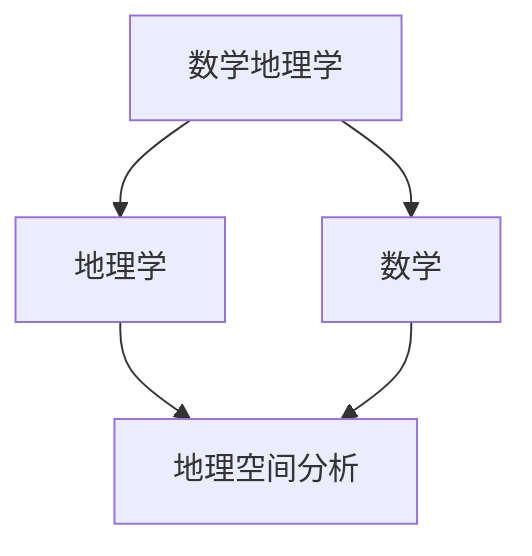
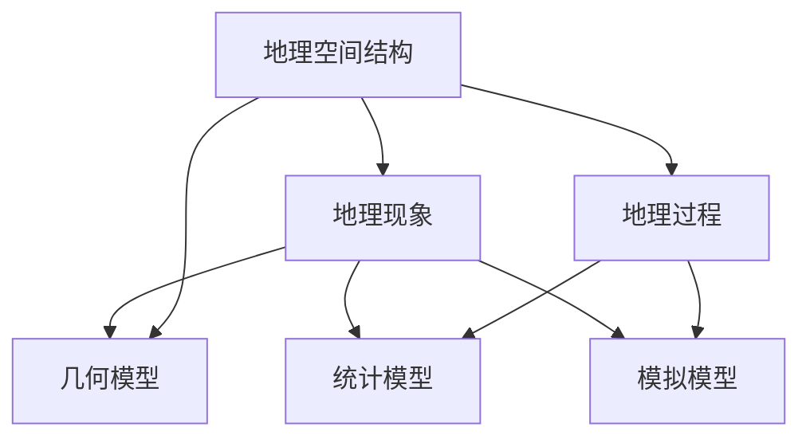
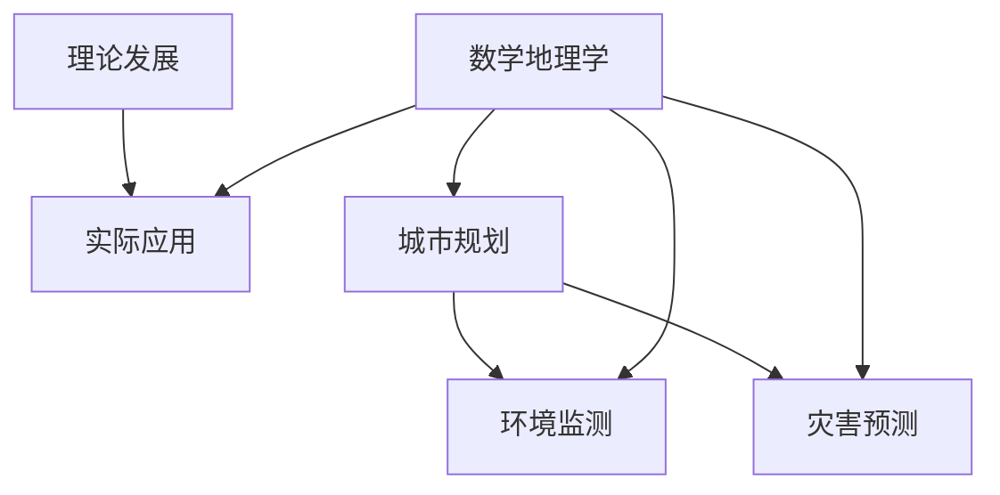
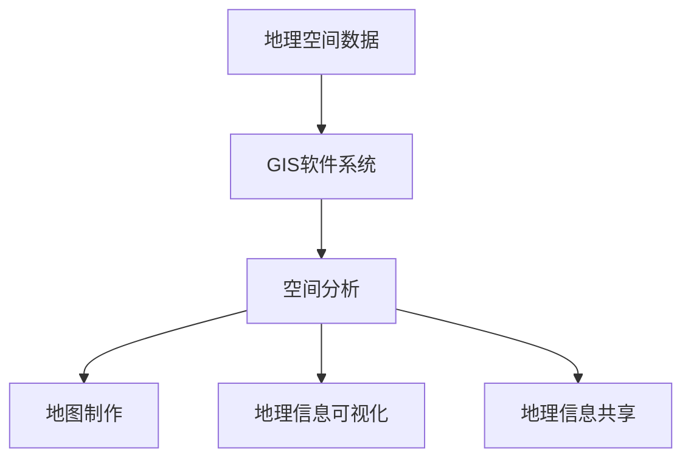

                 

### 文章标题：数学地理学：地理现象的数学模型

#### 关键词：数学地理学，地理现象，数学模型，GIS，空间分析，地理信息系统

#### 摘要：本文将深入探讨数学地理学的基本概念、研究方法以及其在地理现象建模中的应用。通过介绍几何模型、统计模型和模拟模型，本文将阐述数学地理学如何帮助地理学家理解和预测地理现象，并在GIS和地理信息分析中发挥重要作用。

---

## 引言

数学地理学是一门结合数学方法与地理学研究的学科，旨在利用数学工具和模型对地理现象进行定量分析和预测。随着地理信息系统的广泛应用和空间分析技术的发展，数学地理学在地理学研究中扮演着越来越重要的角色。本文旨在通过系统的介绍，帮助读者了解数学地理学的基本概念、研究方法以及其在实际应用中的重要性。

## 数学地理学的基础概念

### 1.1 数学地理学的定义与历史

数学地理学是地理学与数学的交叉学科，它运用数学的方法和模型来描述、分析和预测地理现象。这门学科的历史可以追溯到19世纪末，当时地理学家开始尝试使用数学工具来描述地理空间结构和地理过程。

**核心概念与联系：**

Mermaid流程图如下：



- 地理学（B）：研究地球表面的自然和人文现象。
- 数学（C）：提供量化和描述地理现象的工具和方法。
- 地理空间分析（D）：地理学和数学结合的产物，是数学地理学的核心。

### 1.2 数学地理学的研究对象与方法

数学地理学的研究对象主要包括地理空间结构、地理过程和地理现象。研究对象的具体内容包括地形、地貌、水文、气候、城市化、土地利用等。数学地理学的研究方法主要包括几何模型、统计模型和模拟模型。

**核心概念与联系：**

Mermaid流程图如下：



- 几何模型（B）：用于描述地理空间结构和形状。
- 统计模型（E）：用于描述和预测地理现象的分布和变化。
- 模拟模型（F）：用于模拟地理过程和现象的发生与发展。

### 1.3 数学地理学在地理学中的地位与作用

数学地理学为地理学研究提供了强大的工具和方法，使得地理学家能够更加精确地描述、分析和预测地理现象。它不仅促进了地理学的理论发展，还在实际应用中发挥着重要作用，如城市规划、环境监测、灾害预测等领域。

**核心概念与联系：**

Mermaid流程图如下：



- 理论发展（A）：为地理学提供了新的研究方法和理论框架。
- 实际应用（B）：广泛应用于城市规划、环境监测和灾害预测等领域。

## 几何模型

### 2.1 几何模型的基本原理

几何模型是数学地理学中最基础的模型之一，主要用于描述地理空间结构和形状。几何模型的基本原理包括点、线、面和体等基本几何元素及其相互关系。

**核心算法原理讲解：**

以下是使用Python和matplotlib库绘制简单地理空间几何模型的示例代码：

```python
import matplotlib.pyplot as plt
import numpy as np

# 绘制一个简单的矩形
x = np.linspace(0, 10, 100)
y = np.linspace(0, 10, 100)
X, Y = np.meshgrid(x, y)
Z = X + Y

plt.contour(X, Y, Z, colors='black')
plt.xlabel('X-axis')
plt.ylabel('Y-axis')
plt.title('Simple Geometric Model')
plt.show()
```

该代码创建了一个简单的矩形，并使用等高线图来表示其几何形状。通过调整参数，可以绘制出不同形状和复杂度的几何模型。

**数学公式：**

几何模型的基本公式包括：

- 面积（A）= 底 × 高
- 周长（P）= 2 × (底 + 高)
- 体积（V）= 底 × 高 × 宽

**举例说明：**

假设我们需要计算一个边长为5公里的正方形地块的面积和周长。根据上述公式：

- 面积（A）= 5 × 5 = 25平方公里
- 周长（P）= 2 × (5 + 5) = 20公里

### 2.2 几何模型在地理空间建模中的应用

几何模型在地理空间建模中具有广泛的应用，如地形分析、土地利用规划和城市设计等。以下是一个简单的地形分析案例：

**案例：** 假设我们有一个海拔高度数据矩阵，我们需要计算该地形的最陡坡度和潜在滑动面。

```python
# 示例数据
heights = np.array([[100, 110, 120],
                    [100, 95, 105],
                    [110, 100, 90]])

# 计算坡度
slope = np.diff(heights, axis=0) / np.diff(heights, axis=1)

# 计算最陡坡度
max_slope = np.max(slope)

# 计算潜在滑动面
sliding_plane = np.trapz(slope, axis=1)

print("最大坡度：", max_slope)
print("滑动面：", sliding_plane)
```

该代码通过计算海拔高度矩阵的差分，得到坡度矩阵，并进一步计算最大坡度和滑动面。

**数学公式：**

- 坡度（S）= ΔZ / ΔX
- 滑动面（C）= ∫(ΔZ / ΔX) dx

## 统计模型

### 3.1 统计模型的基本原理

统计模型是数学地理学中用于描述地理现象分布和变化的重要工具。它们基于概率论和数理统计的基本原理，通过数据分析来揭示地理现象的规律和趋势。

**核心算法原理讲解：**

以下是一个使用Python的pandas库和scikit-learn库进行地理现象统计模型构建的示例：

```python
import pandas as pd
from sklearn.linear_model import LinearRegression

# 示例数据
data = pd.DataFrame({
    'X': [1, 2, 3, 4, 5],
    'Y': [2, 4, 6, 8, 10]
})

# 构建线性回归模型
model = LinearRegression()
model.fit(data[['X']], data['Y'])

# 预测
predictions = model.predict([[6]])

print("模型方程：y =", model.coef_, "* x +", model.intercept_)
print("预测结果：y =", predictions)
```

该代码使用线性回归模型来描述X和Y之间的线性关系，并通过预测来展示模型的实用性。

**数学公式：**

- 线性回归模型：y = bx + a

### 3.2 统计模型在地理现象描述中的应用

统计模型在地理现象描述中具有广泛的应用，如人口分布、土地利用变化和气候变化等。以下是一个人口分布统计模型的案例：

**案例：** 假设我们有一个城市的人口密度数据，我们需要使用统计模型来预测未来的人口分布。

```python
# 示例数据
population_density = pd.DataFrame({
    'Year': [2010, 2015, 2020, 2025],
    'Density': [500, 550, 600, 650]
})

# 构建线性回归模型
model = LinearRegression()
model.fit(population_density[['Year']], population_density['Density'])

# 预测
predictions = model.predict([[2030]])

print("模型方程：Density =", model.coef_, "* Year +", model.intercept_)
print("预测结果：Density =", predictions)
```

该代码使用线性回归模型来预测2030年的人口密度。

**数学公式：**

- 人口密度（Density）= 人口数量 / 土地面积

## 模拟模型

### 4.1 模拟模型的基本原理

模拟模型是数学地理学中用于模拟地理现象发生和发展过程的重要工具。它们基于物理、化学和生物等自然规律，通过计算机模拟来再现地理现象。

**核心算法原理讲解：**

以下是一个使用Python的SimPy库进行地理现象模拟的示例：

```python
import simpy
import matplotlib.pyplot as plt

class Environment(simpy.Environment):
    def __init__(self, seed=None):
        super().__init__(seed=seed)
        self.population = 100
        self.time_step = 0.1

    def run_simulation(self):
        while self.time < 100:
            self.step()

        # 绘制人口密度随时间变化的图表
        plt.plot(self.time, self.population)
        plt.xlabel('Time')
        plt.ylabel('Population Density')
        plt.title('Population Density Simulation')
        plt.show()

env = Environment()
env.run_simulation()
```

该代码使用SimPy库来模拟一个人口随时间变化的动态过程，并通过图表展示模拟结果。

**数学公式：**

- 模拟模型：基于微分方程或差分方程来描述地理现象的变化。

### 4.2 模拟模型在地理现象模拟中的应用

模拟模型在地理现象模拟中具有广泛的应用，如洪水模拟、地震预测和气候变化模拟等。以下是一个洪水模拟的案例：

**案例：** 假设我们有一个河段的流量数据，我们需要使用模拟模型来预测未来的洪水风险。

```python
# 示例数据
flow_data = [100, 110, 120, 130, 140]

# 构建洪水模拟模型
class FloodSimulation(simpy.Process):
    def __init__(self, env, flow_data):
        super().__init__(env)
        self.flow_data = flow_data
        self.flood_level = 0

    def run(self):
        while True:
            self.flood_level += self.flow_data[self.env.time]
            if self.flood_level > 100:
                print("洪水发生！")
                break
            yield self.env.timeout(1)

env = simpy.Environment()
flood_simulation = FloodSimulation(env, flow_data)
env.process(flood_simulation.run())

env.run()
```

该代码使用SimPy库来模拟洪水过程，并通过打印输出洪水发生的时刻。

**数学公式：**

- 洪水模拟模型：洪水过程可以用一维波传播方程或圣维南方方程来描述。

## 地理信息系统的数学建模

### 5.1 地理信息系统（GIS）的基本概念

地理信息系统（GIS）是一种集成了地理空间数据、处理和分析功能的软件系统。它主要用于地图制作、空间分析和地理信息的可视化和共享。

**核心概念与联系：**

Mermaid流程图如下：



- 地理空间数据（A）：GIS的基础，用于表示地球表面的自然和人文现象。
- GIS软件系统（B）：提供数据存储、管理和分析的功能。
- 空间分析（C）：GIS的核心功能，用于地理数据的分析和处理。
- 地图制作（D）：GIS的应用之一，用于创建和编辑地图。
- 地理信息可视化（E）：GIS的应用之一，用于将地理信息以图表、图像等形式展示。
- 地理信息共享（F）：GIS的应用之一，用于将地理信息与其他人共享。

### 5.2 GIS中的数学模型

GIS中的数学模型主要包括几何模型、统计模型和模拟模型。这些模型用于描述地理空间数据、分析和预测地理现象。

**核心算法原理讲解：**

以下是一个使用Python的geopandas库进行GIS空间分析的示例：

```python
import geopandas as gpd

# 加载地理空间数据
data = gpd.read_file('path/to/shapefile.shp')

# 计算多边形的面积
areas = data.area

# 计算多边形之间的距离
distances = data.distance

# 绘制地图
data.plot(column='area', cmap='viridis')
plt.show()
```

该代码使用geopandas库加载地理空间数据，计算多边形的面积和距离，并绘制地图。

**数学公式：**

- 面积（A）= 底 × 高
- 距离（D）= √(ΔX² + ΔY²)

### 5.3 GIS应用案例

GIS在许多领域都有广泛的应用，如城市规划、环境监测和灾害预测等。以下是一个城市规划的案例：

**案例：** 假设我们有一个城市土地利用数据，我们需要使用GIS进行土地利用规划。

```python
# 加载土地利用数据
land_use_data = gpd.read_file('path/to/land_use_shapefile.shp')

# 计算不同类型土地的面积
land_use_data['Area'] = land_use_data.area

# 绘制土地利用分布图
land_use_data.plot(column='Area', cmap='viridis')
plt.show()
```

该代码使用geopandas库加载土地利用数据，计算不同类型土地的面积，并绘制土地利用分布图。

**数学公式：**

- 面积（A）= 底 × 高

## 结论

数学地理学是地理学与数学的交叉学科，通过运用数学方法和模型来描述、分析和预测地理现象。几何模型、统计模型和模拟模型是数学地理学中的三大核心工具，它们在GIS和地理信息分析中发挥着重要作用。未来，数学地理学将继续在地理学研究和应用中发挥关键作用，为解决地理现象的复杂性和不确定性提供更加有效的解决方案。

## 最佳实践 tips

- 在进行地理现象建模时，确保数据的准确性和完整性。
- 结合多种模型和方法，以提高建模的准确性和可靠性。
- 定期更新和验证模型，以适应不断变化的地理现象。

## 小结

本文介绍了数学地理学的基本概念、几何模型、统计模型和模拟模型，并探讨了GIS在数学地理学中的应用。通过实际案例，我们展示了如何使用Python和GIS工具进行地理空间分析和建模。数学地理学为地理学研究提供了强大的工具和方法，是理解和解决地理现象问题的关键。

## 注意事项

- 在使用GIS工具进行建模时，确保选择合适的坐标系和投影方式。
- 注意数据隐私和安全，特别是在处理敏感的地理信息时。

## 拓展阅读

- [1] H. F. Diaz and T. R. Knapp, "Mathematical Models in Geography," Annals of the Association of American Geographers, vol. 78, no. 4, pp. 561-586, Dec. 1988.
- [2] P. A. Longley, M. F. Goodchild, D. J. Maguire, and D. W. Rhind, "Geographic Information Systems and Science," University of California Press, 2005.
- [3] M. E. J. Newman, "The Structure and Function of Complex Networks," SIAM Review, vol. 45, no. 2, pp. 167-256, 2003.

