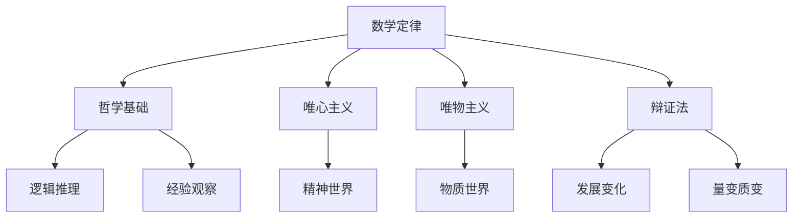

                 

# 数学定律：自然和谐的心智投影

## 关键词

数学定律、哲学基础、自然表现、人类行为、现代应用、教育意义、未来发展

## 摘要

本文旨在探讨数学定律的哲学基础、自然表现、与人类行为的关系、现代应用、教育意义以及未来发展的方方面面。通过分析数学定律在物理学、化学、生物学以及心理学中的应用，本文揭示了数学定律对自然界和人类社会的深远影响。同时，本文还探讨了数学定律在计算机科学和人工智能中的现代应用，以及数学教育的重要性。最后，本文展望了数学定律的未来发展，并提出了相关建议。

## 目录

### 第1章 数学定律的哲学基础

#### 1.1 数学定律的概念

##### 1.1.1 数学定律的定义

在哲学上，数学定律被定义为描述自然界和宇宙中普遍存在的规律和原则的陈述。它们是逻辑和经验的产物，是数学家们通过长期研究和思考得出的结论。

##### 1.1.2 数学定律的特征

- 普遍性：数学定律适用于所有时间和空间，不受特定条件限制。
- 必然性：数学定律是必然的，如果条件满足，则结果必然成立。
- 简洁性：数学定律通常用简洁的符号和公式表达。

#### 1.2 数学定律与哲学的关联

##### 1.2.1 数学定律与唯心主义

- 唯心主义认为，世界的本质是精神，物质只是精神的体现。数学定律作为描述自然规律的陈述，体现了精神世界的普遍性和必然性。

##### 1.2.2 数学定律与唯物主义

- 唯物主义认为，世界的本质是物质，精神是物质的产物。数学定律作为物质世界的规律，体现了物质世界的统一性和规律性。

##### 1.2.3 数学定律与辩证法

- 辩证法认为，世界是一个不断发展变化的过程，数学定律在这个过程中不断演变和发展。数学定律的发现和证明过程，体现了辩证法的思想和原则。

### 第2章 数学定律的自然表现

#### 2.1 数学定律在物理学中的应用

##### 2.1.1 牛顿定律

$$
F = ma
$$

- 牛顿第一定律：一个物体如果不受外力作用，将保持静止或匀速直线运动。
- 牛顿第二定律：一个物体的加速度与作用在它上面的力成正比，与它的质量成反比。
- 牛顿第三定律：作用力和反作用力大小相等、方向相反。

##### 2.1.2 爱因斯坦相对论

$$
E = mc^2
$$

- 爱因斯坦相对论揭示了质量、能量和时间、空间之间的关系，提出了质能等价原理。

#### 2.2 数学定律在化学中的应用

##### 2.2.1 遗传定律

$$
P(A \land B) = P(A)P(B|A)
$$

- 遗传学中的孟德尔定律，描述了基因的遗传规律。

##### 2.2.2 化学反应速率

$$
v = k[A][B]
$$

- 化学反应速率与反应物浓度之间的关系。

#### 2.3 数学定律在生物学中的应用

##### 2.3.1 达尔文进化论

- 达尔文进化论通过自然选择和适者生存的原理，解释了生物的进化过程。

##### 2.3.2 脑神经网络

- 脑神经网络通过复杂的数学模型，模拟了人脑的学习和记忆过程。

### 第3章 数学定律与人类行为的关系

#### 3.1 数学定律在心理学中的应用

##### 3.1.1 心理学的数学模型

- 心理学家使用数学模型来描述人类的行为和心理过程，如决策理论、行为经济学等。

##### 3.1.2 心理学中的数学定律

- 心理学中的许多现象可以用数学定律来解释，如概率论在风险评估中的应用。

#### 3.2 数学定律在社会学中的应用

##### 3.2.1 社会学中的数学模型

- 社会学家使用数学模型来分析社会现象，如社会网络分析、人口统计学等。

##### 3.2.2 社会学中的数学定律

- 社会学中的许多现象也可以用数学定律来描述，如帕累托定律（80/20法则）。

### 第4章 数学定律的现代应用

#### 4.1 数学定律在计算机科学中的应用

##### 4.1.1 算法设计

- 计算机科学家使用数学定律来设计高效的算法，如排序算法、搜索算法等。

##### 4.1.2 计算机图形学

- 计算机图形学中使用了大量的数学定律，如几何变换、线性代数等。

#### 4.2 数学定律在人工智能中的应用

##### 4.2.1 机器学习算法

- 机器学习算法中使用了大量的数学定律，如线性回归、神经网络等。

##### 4.2.2 深度学习

- 深度学习算法中使用了复杂的数学定律，如反向传播算法、卷积神经网络等。

### 第5章 数学定律的教育意义

#### 5.1 数学教育的重要性

##### 5.1.1 数学教育对思维能力的培养

- 数学教育能够培养人们的逻辑思维、抽象思维和问题解决能力。

##### 5.1.2 数学教育对创新能力的培养

- 数学教育能够激发人们的创新思维，培养创新能力。

#### 5.2 数学教育的策略

##### 5.2.1 理论与实践相结合

- 在数学教育中，理论教学与实践操作相结合，能够提高学生的学习效果。

##### 5.2.2 启发式教育

- 启发式教育鼓励学生主动探索、发现和解决问题，有助于培养数学思维能力。

### 第6章 数学定律的未来发展

#### 6.1 数学定律在未来的应用前景

- 随着科技的发展，数学定律将在更多领域得到应用，如量子计算、生物学模拟、宇宙学等。

##### 6.1.1 量子计算

- 量子计算利用量子力学定律，有望实现更高效的计算。

##### 6.1.2 生物学模拟

- 生物学模拟通过数学模型，有望揭示生物体的复杂规律。

##### 6.1.3 宇宙学

- 宇宙学中，数学定律帮助我们理解宇宙的起源、演化和结构。

#### 6.2 数学定律的未来挑战

- 面对未来的挑战，数学家们需要不断探索新的数学定律，解决复杂问题。

##### 6.2.1 新的数学工具和方法

- 开发新的数学工具和方法，有助于解决复杂的科学问题。

##### 6.2.2 数学与科学的交叉融合

- 数学与科学的交叉融合，将推动数学定律在更广泛领域中的应用。

### 结束语

数学定律作为描述自然界和宇宙中普遍存在的规律和原则，对人类社会和科学技术的发展产生了深远影响。本文从哲学基础、自然表现、人类行为关系、现代应用、教育意义以及未来发展等多个角度，对数学定律进行了全面探讨。希望通过本文，读者能够对数学定律有更深刻的理解和认识。

### 作者信息

作者：AI天才研究院/AI Genius Institute & 禅与计算机程序设计艺术/Zen And The Art of Computer Programming

---

## 第1章 数学定律的哲学基础

### 1.1 数学定律的概念

在哲学上，数学定律被定义为描述自然界和宇宙中普遍存在的规律和原则的陈述。它们是逻辑和经验的产物，是数学家们通过长期研究和思考得出的结论。数学定律在科学研究中具有重要作用，它们为科学家们提供了一种描述和解释自然现象的方法。

#### 1.1.1 数学定律的定义

数学定律通常是指那些经过严格证明的定理或公式，它们揭示了数学中各种概念之间的关系。例如，牛顿定律、欧拉公式等，都是数学定律的典型例子。这些定律不仅具有普遍性，而且具有必然性，即在特定条件下，它们总是成立。

#### 1.1.2 数学定律的特征

数学定律具有以下几个显著特征：

1. **普遍性**：数学定律适用于所有时间和空间，不受特定条件限制。这意味着无论何时何地，只要条件相同，数学定律都会产生相同的结果。
   
2. **必然性**：数学定律是必然的，如果条件满足，则结果必然成立。例如，牛顿第二定律 \( F = ma \) 表明，只要有力作用于物体，物体就会产生加速度，这是必然的。

3. **简洁性**：数学定律通常用简洁的符号和公式表达。例如，欧拉公式 \( e^{i\pi} + 1 = 0 \) 用极少的符号和数字表达了极其复杂的数学关系。

### 1.2 数学定律与哲学的关联

数学定律不仅与数学本身密切相关，还与哲学有着深厚的联系。哲学中的不同流派对数学定律的理解和解释各有不同。

#### 1.2.1 数学定律与唯心主义

唯心主义认为，世界的本质是精神，物质只是精神的体现。从唯心主义的角度来看，数学定律是精神世界的产物，它们反映了人类心智对自然规律的抽象和表达。数学家们通过逻辑推理和抽象思维，从纷繁复杂的现象中提取出简单的数学定律，这可以被看作是精神世界的普遍性和必然性的体现。

#### 1.2.2 数学定律与唯物主义

唯物主义认为，世界的本质是物质，精神是物质的产物。从这个角度来看，数学定律是物质世界的规律，它们反映了物质世界内部的统一性和规律性。物理学家通过实验和观察，发现并证明了各种数学定律，这些定律帮助人类理解物质世界的运作方式。

#### 1.2.3 数学定律与辩证法

辩证法认为，世界是一个不断发展变化的过程，数学定律在这个过程中不断演变和发展。辩证法的思想强调事物之间的联系和相互作用，而数学定律正是这种联系和相互作用在数学形式上的体现。数学定律的发现和证明过程，体现了辩证法的思想和原则，即事物的发展是量变到质变的过程。

### 1.3 数学定律的核心概念与联系

为了更好地理解数学定律的哲学基础，我们可以通过一个简单的 Mermaid 流程图来展示核心概念之间的联系。

在这个流程图中，数学定律位于中心，与哲学基础、唯心主义、唯物主义和辩证法相互联系。这些哲学思想为数学定律提供了不同的解释和理解角度，帮助我们更好地认识和理解数学定律的本质。

通过上述分析，我们可以看到数学定律在哲学中的重要性。它们不仅是科学研究的基石，也是哲学思考的重要工具。在接下来的章节中，我们将进一步探讨数学定律在自然界中的表现，以及它们与人类行为和现代科技的关系。

### 2.1 数学定律在物理学中的应用

#### 2.1.1 牛顿定律

牛顿定律是物理学中最基础的定律之一，由英国物理学家艾萨克·牛顿于17世纪末提出。牛顿定律分为三个部分，即牛顿第一定律、牛顿第二定律和牛顿第三定律，每个定律都从不同的角度揭示了物体运动的基本规律。

##### 2.1.1.1 牛顿第一定律

牛顿第一定律，又称惯性定律，指出一个物体如果不受外力作用，将保持静止或匀速直线运动。这意味着，一个物体的运动状态不会自行改变，除非受到外力的作用。这个定律强调了惯性的概念，即物体具有抵抗运动状态改变的特性。

##### 2.1.1.2 牛顿第二定律

牛顿第二定律，描述了物体加速度与作用力之间的关系。该定律可以用公式 \( F = ma \) 表示，其中 \( F \) 表示作用在物体上的合外力，\( m \) 表示物体的质量，\( a \) 表示物体的加速度。这个公式表明，物体的加速度与作用在它上面的力成正比，与它的质量成反比。

##### 2.1.1.3 牛顿第三定律

牛顿第三定律，又称作用与反作用定律，指出对于任何两个相互作用的物体，它们之间的作用力和反作用力总是大小相等、方向相反。用公式表示为 \( F_{12} = -F_{21} \)，其中 \( F_{12} \) 表示物体1对物体2的作用力，\( F_{21} \) 表示物体2对物体1的作用力。

#### 2.1.2 爱因斯坦相对论

爱因斯坦相对论是20世纪初由阿尔伯特·爱因斯坦提出的物理学理论，它深刻地改变了人们对时间、空间和物质的认识。相对论分为两部分：狭义相对论和广义相对论。

##### 2.1.2.1 狭义相对论

狭义相对论主要研究在没有重力作用下，物体如何运动。其核心概念是相对性原理和光速不变原理。相对性原理指出，物理定律在所有惯性参照系中都是相同的。光速不变原理则指出，在真空中，光速是一个常数，不依赖于光源或观察者的运动状态。

##### 2.1.2.2 广义相对论

广义相对论研究的是在重力作用下的物体运动。广义相对论将引力视为时空的曲率，物体在时空中的运动遵循最短路径，即测地线。其核心公式是爱因斯坦场方程：

$$
G_{\mu\nu} + \Lambda g_{\mu\nu} = \frac{8\pi G}{c^4} T_{\mu\nu}
$$

其中，\( G_{\mu\nu} \) 是爱因斯坦张量，描述了时空的曲率，\( \Lambda \) 是宇宙学常数，\( g_{\mu\nu} \) 是度规张量，\( T_{\mu\nu} \) 是能量-动量张量，\( G \) 是引力常数，\( c \) 是光速。

爱因斯坦相对论对牛顿力学进行了扩展和修正，特别是在高速运动和强引力场中，相对论效应变得尤为重要。例如，时间的相对性、长度的相对性以及质能等价原理（\( E = mc^2 \)），都是爱因斯坦相对论的著名结论。

#### 2.1.3 数学定律在物理学中的实际应用

数学定律在物理学中的应用不仅限于理论描述，还广泛应用于实验设计和数据分析。以下是一些具体的实例：

1. **天体物理学**：通过牛顿定律和万有引力定律，科学家们能够精确地预测行星和卫星的运动轨迹，进行天体观测和探测。

2. **量子力学**：虽然量子力学的基本原理与经典物理学有很大不同，但量子力学中仍然使用许多数学工具和概念，如波函数、态叠加原理、测量不确定性原理等。

3. **流体力学**：牛顿第二定律和连续性方程在流体力学中得到了广泛应用，用于分析流体流动和压力分布。

4. **材料科学**：在材料科学中，数学定律如应力-应变关系和弹性模量等，被用来设计和优化材料性能。

通过上述分析，我们可以看到数学定律在物理学中的广泛应用和重要性。它们不仅为我们提供了理解自然现象的工具，也为现代科技的发展奠定了基础。在接下来的章节中，我们将继续探讨数学定律在化学、生物学和其他领域中的应用。

### 2.2 数学定律在化学中的应用

数学定律在化学中的应用是极其广泛和深入的，它们帮助我们理解和描述化学反应、物质的性质和行为。以下将介绍几项关键的数学定律及其在化学中的具体应用。

#### 2.2.1 遗传定律

遗传定律由奥地利生物学家格雷戈尔·孟德尔在19世纪末提出，是现代遗传学的基石。孟德尔的遗传定律包括分离定律、自由组合定律和独立分离定律。这些定律描述了基因在遗传过程中的传递规律。

- **分离定律**：每个个体都有两个基因副本，它们在生殖细胞中随机分离，因此每个生殖细胞只包含一个基因副本。这导致了基因的组合多样性。
- **自由组合定律**：不同基因对的分离是独立的，即一个基因对的分离不会影响另一个基因对的分离。
- **独立分离定律**：在杂合个体中，两个独立分离的基因对会以一定的概率组合，形成四种不同的生殖细胞。

遗传定律帮助我们理解遗传变异的机制，并在生物育种和基因组学中有着广泛的应用。

#### 2.2.2 化学反应速率

化学反应速率描述了反应物转化为产物的时间快慢。化学反应速率可以用以下公式表示：

$$
v = -\frac{d[A]}{dt} = k[A][B]
$$

其中，\( v \) 表示反应速率，\[ A \] 和 \[ B \] 分别表示反应物的浓度，\( k \) 是反应速率常数。这个公式说明了反应速率与反应物浓度之间的关系，称为质量作用定律。质量作用定律是化学反应动力学研究的重要基础。

- **一级反应**：如果反应速率与反应物浓度的一次方成正比，则称为一级反应。一级反应的速率公式为：

  $$
  v = k[A]
  $$

- **二级反应**：如果反应速率与反应物浓度的二次方成正比，则称为二级反应。二级反应的速率公式为：

  $$
  v = k[A][B]
  $$

化学反应速率的测量和计算对于理解反应机理、设计反应条件和优化工艺流程至关重要。

#### 2.2.3 化学平衡

化学平衡是化学反应在一定条件下达到的一种状态，此时正反应速率和逆反应速率相等，反应物和产物的浓度保持不变。化学平衡可以用平衡常数 \( K \) 来描述：

$$
K = \frac{[C][D]}{[A][B]}
$$

其中，\[ A \]、\[ B \]、\[ C \] 和 \[ D \] 分别表示反应物和产物的浓度。化学平衡定律帮助我们预测在给定条件下反应物和产物的浓度分布，对于化工生产和催化剂设计具有重要意义。

- **勒夏特列原理**：当一个系统处于平衡状态时，如果改变系统的某个条件（如浓度、温度或压力），系统会作出反应以抵消这种改变，重新达到平衡。

#### 2.2.4 化学键理论

化学键理论描述了原子之间如何结合形成分子。数学定律如价键理论、分子轨道理论和氢键理论，帮助我们理解分子结构和化学性质。

- **价键理论**：原子通过共享电子对形成共价键。价键理论用电子对的共享来解释分子的稳定性。
- **分子轨道理论**：分子轨道理论将原子轨道组合成分子轨道，用电子在这些轨道中的分布来解释分子的稳定性和化学性质。
- **氢键理论**：氢键是一种特殊的分子间作用力，由氢原子与高电负性原子（如氧、氮）之间的静电吸引力形成。

这些理论帮助我们理解和预测分子的结构和反应行为。

#### 2.2.5 实际应用

数学定律在化学中的应用实例不胜枚举：

- **药物设计**：通过计算分子间的相互作用力，科学家可以预测药物与目标蛋白质的亲和力，从而设计新的药物分子。
- **环境化学**：数学定律在环境化学中用于评估污染物的浓度分布、扩散速率和降解速率，以制定环境保护政策。
- **材料科学**：在材料科学中，数学定律如晶体结构理论、相变理论和热力学定律，用于优化材料性能。

通过上述分析，我们可以看到数学定律在化学中的广泛应用和重要性。它们不仅为化学研究提供了理论基础，也推动了化学技术的进步和创新。

### 2.3 数学定律在生物学中的应用

数学定律在生物学中的应用是极为广泛和重要的，尤其在分子生物学、生态学和进化论等领域，数学模型和定律对生物学现象的理解和预测起到了关键作用。以下将详细介绍数学定律在生物学中的应用及其影响。

#### 2.3.1 达尔文进化论

达尔文进化论是生物学中最基本的进化理论，由查尔斯·达尔文在19世纪中提出。达尔文认为，物种通过自然选择和适者生存的过程逐渐进化。自然选择是指那些在特定环境中有利于生存和繁殖的特征会被更频繁地传递给后代，而不适应环境的特征则会被淘汰。

- **自然选择**：达尔文进化论中的自然选择可以用以下数学模型来描述：

  $$
  f(t+1) = f(t) + N \cdot (s - \bar{s})
  $$

  其中，\( f(t) \) 表示第 \( t \) 代的基因频率，\( s \) 表示个体适应度，\( \bar{s} \) 表示种群平均适应度，\( N \) 表示个体数。这个模型表明，适应度较高的个体在下一代的基因频率中占据更大比例。

- **适者生存**：适者生存意味着那些更能适应环境的个体在生存和繁殖上有优势。适应度可以通过数学模型量化，如：

  $$
  s = w_1 \cdot s_1 + w_2 \cdot s_2 + \ldots + w_n \cdot s_n
  $$

  其中，\( w_i \) 表示权重，\( s_i \) 表示个体在某一特定环境下的适应度。

达尔文进化论为生物学研究提供了基础框架，帮助科学家们理解物种多样性和进化过程。

#### 2.3.2 脑神经网络

脑神经网络是生物学和计算科学交叉的领域，通过数学模型模拟人脑的神经网络结构和功能。脑神经网络模型通常基于以下几个数学定律：

- **突触可塑性**：突触可塑性是指神经网络通过改变突触的连接强度来适应新的输入。这一过程可以用数学模型来描述，如：

  $$
  \Delta w = \eta \cdot \Delta x
  $$

  其中，\( \Delta w \) 表示突触权重的变化，\( \eta \) 表示学习率，\( \Delta x \) 表示输入信号的变化。

- **能量最小化原理**：神经网络通过最小化能量函数来找到最优的权值配置。能量函数通常表示为：

  $$
  E = -\sum_{i} x_i \cdot y_i \cdot w_i
  $$

  其中，\( x_i \) 和 \( y_i \) 分别表示输入和输出，\( w_i \) 表示权重。

- **Hebb规则**：Hebb规则是指如果两个神经元同时被激活，它们的突触权重会加强。这一规则可以用数学形式表示为：

  $$
  w_{ij} \rightarrow w_{ij} + \alpha \cdot x_i \cdot y_j
  $$

  其中，\( \alpha \) 是学习率。

脑神经网络模型为理解大脑的工作原理提供了重要工具，并在人工智能和计算生物学领域得到广泛应用。

#### 2.3.3 进化博弈理论

进化博弈理论是生物学和经济学交叉的领域，通过数学模型研究个体在竞争环境中的策略选择。进化博弈理论的核心概念是纳什均衡，即所有个体在给定其他个体策略的情况下，没有动机改变自己的策略。

- **支付矩阵**：在进化博弈理论中，个体的策略选择可以用支付矩阵来表示。支付矩阵反映了个体在不同策略组合下的收益。

- **纳什均衡**：纳什均衡是指一组策略组合，使得每个个体在给定其他个体策略的情况下没有动机改变自己的策略。纳什均衡可以用以下公式表示：

  $$
  u_i(s_i, s_{-i}) \geq u_i(s_i', s_{-i})
  $$

  其中，\( u_i \) 表示个体 \( i \) 在策略组合 \( (s_i, s_{-i}) \) 下的效用，\( s_i \) 和 \( s_i' \) 分别表示个体 \( i \) 的策略。

进化博弈理论帮助理解生物群体中的合作与竞争、物种共存和生态系统稳定性的问题。

#### 2.3.4 实际应用

数学定律在生物学中的应用实例丰富多样：

- **基因表达调控**：通过数学模型，科学家可以预测基因在不同环境条件下的表达模式，从而理解基因调控机制。

- **生态模型**：生态学中的数学模型如Lotka-Volterra方程，用于研究捕食者-猎物动态，预测种群数量的变化。

- **药物开发**：数学模型在药物开发中用于模拟药物与生物大分子的相互作用，预测药物疗效和毒性。

通过上述分析，我们可以看到数学定律在生物学中的广泛应用和重要性。它们不仅帮助我们理解生物现象，还为生物学研究提供了强有力的工具和理论支持。在未来的发展中，数学定律将继续在生物学和其他科学领域发挥重要作用。

### 3.1 数学定律在心理学中的应用

数学定律在心理学中的应用是深刻且广泛的，尤其是在描述和理解人类行为、决策过程以及心理状态方面。以下将探讨数学定律在心理学中的具体应用。

#### 3.1.1 心理学的数学模型

心理学家使用数学模型来描述和分析人类行为和心理过程。这些模型基于数学定律，帮助心理学家理解和预测个体的行为。

- **决策模型**：决策模型是心理学中的一个重要领域，用于描述个体在面对不同选择时的决策过程。常见的决策模型包括期望值模型和风险模型。

  - **期望值模型**：期望值模型认为，个体在做出决策时会考虑每个选择的预期收益和风险。期望值可以用以下公式表示：

    $$
    EV = \sum (p_i \cdot r_i)
    $$

    其中，\( p_i \) 是选择 \( i \) 的概率，\( r_i \) 是选择 \( i \) 的收益。

  - **风险模型**：风险模型考虑个体对风险的偏好。常见的风险模型包括期望效用模型和前景理论。

    - **期望效用模型**：期望效用模型认为，个体会根据选择的预期效用做出决策。效用可以用以下公式表示：

      $$
      EU = \sum (p_i \cdot u(r_i))
      $$

      其中，\( p_i \) 是选择 \( i \) 的概率，\( u(r_i) \) 是选择 \( i \) 的效用。

    - **前景理论**：前景理论由丹尼尔·卡尼曼和阿莫斯·特沃斯基提出，认为个体在决策时会受到参考点的影响。前景理论用以下公式表示：

      $$
      \Delta C = \frac{\Delta V - V_0}{V_0}
      $$

      其中，\( \Delta V \) 是收益或损失的变化，\( V_0 \) 是参考点的值。

- **认知模型**：认知模型描述个体在解决问题、学习和记忆过程中的认知过程。常见的认知模型包括信息加工模型和图灵机模型。

  - **信息加工模型**：信息加工模型将个体的认知过程视为信息处理过程，类似于计算机的信息处理流程。

  - **图灵机模型**：图灵机模型将认知过程视为一系列状态的转换，类似于图灵机的运算。

#### 3.1.2 心理学中的数学定律

心理学中的一些现象可以用数学定律来解释。以下是一些重要的数学定律及其在心理学中的应用：

- **概率论**：概率论在心理学中用于描述和预测事件发生的可能性。例如，在风险评估中，概率论可以帮助心理学家计算个体面临不同风险的概率。

  - **贝叶斯定理**：贝叶斯定理是一个重要的概率论定律，用于计算后验概率。贝叶斯定理的公式为：

    $$
    P(A|B) = \frac{P(B|A) \cdot P(A)}{P(B)}
    $$

    其中，\( P(A|B) \) 是在事件 \( B \) 发生的条件下事件 \( A \) 发生的概率，\( P(B|A) \) 是在事件 \( A \) 发生的条件下事件 \( B \) 发生的概率，\( P(A) \) 和 \( P(B) \) 分别是事件 \( A \) 和 \( B \) 发生的概率。

- **统计力学**：统计力学在心理学中用于描述群体行为的统计性质。例如，在群体心理学中，统计力学可以帮助理解群体行为的集体效应。

  - **麦克斯韦-玻尔兹曼分布**：麦克斯韦-玻尔兹曼分布是一个描述粒子在热平衡状态下的分布规律的统计力学定律。在心理学中，麦克斯韦-玻尔兹曼分布可以用来描述群体行为在某一状态下的分布。

- **博弈论**：博弈论在心理学中用于描述个体在竞争环境中的行为。例如，在社交心理学中，博弈论可以帮助理解个体在合作与竞争中的策略选择。

  - **纳什均衡**：纳什均衡是一个重要的博弈论概念，用于描述在博弈中没有一个参与者可以单方面改变策略而获得更好结果的策略组合。

#### 3.1.3 数学定律在心理学研究中的意义

数学定律在心理学研究中的意义主要体现在以下几个方面：

- **量化描述**：数学定律帮助心理学家用精确的量化方式描述心理现象，使得心理学研究更加客观和可靠。

- **预测能力**：数学定律可以帮助心理学家预测个体的行为和心理状态，从而更好地理解和干预心理问题。

- **跨学科应用**：数学定律不仅应用于心理学，还广泛应用于其他学科，如经济学、社会学和生物学。这种跨学科应用促进了不同领域之间的交流和合作。

通过上述分析，我们可以看到数学定律在心理学中的应用是丰富且多层次的。它们为心理学研究提供了强有力的工具，帮助我们更深入地理解人类行为和心理过程。在未来的发展中，数学定律将继续在心理学和其他学科中发挥重要作用。

### 3.2 数学定律在社会学中的应用

数学定律在社会学中的应用是不可或缺的，它们为我们提供了理解和分析社会现象的有力工具。以下将探讨数学定律在社会学中的具体应用和重要性。

#### 3.2.1 社会学中的数学模型

社会学家使用数学模型来描述和分析社会现象，这些模型基于数学定律，帮助社会学家量化社会结构和行为。

- **社会网络分析**：社会网络分析（SNA）是一种用于研究社会结构和人际关系的数学方法。社会网络分析使用图论来描述个体之间的关系，并用数学定律来分析这些关系的特征和演化。

  - **聚类系数**：聚类系数是描述一个社交网络中个体之间连接紧密程度的指标。它可以用以下公式表示：

    $$
    C = \frac{2 \cdot m_e}{n \cdot (n-1)}
    $$

    其中，\( m_e \) 是网络中任意两个个体之间的边数，\( n \) 是网络中的个体数。

  - **路径长度**：路径长度是描述网络中个体之间连接紧密程度的另一个指标。它可以用以下公式表示：

    $$
    L = \frac{1}{N} \sum_{i<j} d(i, j)
    $$

    其中，\( d(i, j) \) 是个体 \( i \) 和 \( j \) 之间的最短路径长度，\( N \) 是个体总数。

- **人口统计学模型**：人口统计学模型用于描述和分析人口结构、分布和变化。这些模型基于概率论和统计力学，帮助社会学家预测人口动态。

  - **马尔可夫链**：马尔可夫链是一种用于描述个体状态变化的数学模型。在人口统计学中，马尔可夫链可以用来预测人口状态的变化。

- **博弈论模型**：博弈论模型用于描述个体在竞争环境中的策略选择和行为。这些模型可以帮助社会学家理解合作与竞争、权力和利益分配等社会现象。

  - **纳什均衡**：纳什均衡是博弈论中的一个核心概念，用于描述在博弈中没有一个参与者可以单方面改变策略而获得更好结果的策略组合。

#### 3.2.2 社会学中的数学定律

数学定律在社会学中用于解释和预测社会现象，以下是一些重要的数学定律及其在社会学中的应用：

- **帕累托定律**：帕累托定律，也称为80/20法则，描述了资源分布的不均匀性。该定律指出，在任何系统中，大约80%的结果来自20%的原因。帕累托定律在经济学、社会学和企业管理等领域有广泛应用。

  - **应用实例**：例如，在企业管理中，帕累托定律可以帮助企业识别出导致大部分问题的20%的关键因素，从而集中资源解决这些问题。

- **统计力学定律**：统计力学定律，如麦克斯韦-玻尔兹曼分布和玻尔兹曼熵，用于描述系统的随机性和复杂性。

  - **应用实例**：在社会科学中，这些定律可以用来分析社会系统的稳定性和动态行为。

- **博弈论定律**：博弈论定律，如纳什均衡和贝叶斯均衡，用于描述个体在竞争环境中的策略选择。

  - **应用实例**：在政治学和国际关系研究中，这些定律可以帮助分析国家之间的博弈和外交策略。

#### 3.2.3 数学定律在社会学研究中的意义

数学定律在社会学中的应用具有以下几个重要意义：

- **精确量化**：数学定律帮助社会学家用精确的量化方式描述社会现象，使得社会学研究更加客观和可靠。

- **预测能力**：数学定律可以帮助社会学家预测社会现象的发展趋势和变化，从而更好地理解和干预社会问题。

- **跨学科整合**：数学定律的应用促进了社会学与其他学科的整合，如经济学、生物学和计算机科学。这种跨学科研究有助于我们更全面地理解社会现象。

通过上述分析，我们可以看到数学定律在社会学中的应用是丰富且多层次的。它们为我们提供了强有力的工具，帮助我们更深入地理解和分析社会现象。在未来的发展中，数学定律将继续在社会学和其他学科中发挥重要作用。

### 4.1 数学定律在计算机科学中的应用

数学定律在计算机科学中的应用是至关重要的，它们为算法设计、数据结构以及计算机图形学等领域提供了坚实的理论基础。以下将详细探讨数学定律在计算机科学中的应用。

#### 4.1.1 算法设计

算法是计算机科学的核心概念，它们描述了解决特定问题的步骤和策略。数学定律在算法设计中起到了关键作用，尤其是在分析算法的时间和空间复杂度方面。

- **大O表示法**：大O表示法是一种用于描述算法复杂度的数学工具。它使用大O符号（\( O \)）来表示算法的时间复杂度和空间复杂度。例如，一个算法的时间复杂度可以表示为 \( O(n) \)，这意味着算法的时间消耗与输入规模 \( n \) 成正比。

  - **应用实例**：在排序算法中，如冒泡排序和快速排序，大O表示法帮助我们理解算法的时间复杂度。例如，冒泡排序的时间复杂度是 \( O(n^2) \)，而快速排序的时间复杂度通常是 \( O(n \log n) \)。

- **分治算法**：分治算法是一种常用的算法设计策略，它将问题分解成更小的子问题，然后递归解决这些子问题。分治算法的核心思想是利用数学定律来简化问题。

  - **应用实例**：快速排序算法使用了分治策略，通过递归地将数组分为较小的子数组，从而实现高效排序。

- **动态规划**：动态规划是一种用于解决优化问题的算法设计方法。它利用数学定律来找出最优解的子结构和状态转移关系。

  - **应用实例**：在计算斐波那契数列时，动态规划使用数学定律来避免重复计算，实现高效计算。

#### 4.1.2 数据结构

数据结构是计算机科学中的基础概念，用于组织和存储数据。数学定律在数据结构的分析和设计中起到了重要作用。

- **二叉搜索树**：二叉搜索树是一种常用的数据结构，它基于数学定律——二叉搜索原理。二叉搜索树中的节点按照特定的顺序排列，使得搜索、插入和删除操作非常高效。

  - **应用实例**：在搜索引擎中，二叉搜索树用于快速查找关键词。

- **哈希表**：哈希表是一种基于数学定律——哈希函数的数据结构，用于高效地存储和检索键-值对。

  - **应用实例**：在数据库管理系统中，哈希表用于快速存储和检索记录。

- **堆**：堆是一种基于数学定律——堆排序原则的数据结构，用于实现优先队列。

  - **应用实例**：在计算机图形学中，堆用于实现高效的图形渲染。

#### 4.1.3 计算机图形学

计算机图形学是计算机科学的一个重要分支，它涉及图像的生成和处理。数学定律在计算机图形学中有着广泛的应用，尤其是在几何变换和图形渲染方面。

- **几何变换**：几何变换是计算机图形学中的基本操作，它们通过数学定律来实现。常见的几何变换包括平移、旋转、缩放和反射。

  - **应用实例**：在游戏开发和动画制作中，几何变换用于实现物体的运动和变形。

- **线性代数**：线性代数在计算机图形学中有着广泛的应用，它用于描述和操作几何对象。线性代数的概念，如矩阵和向量，是计算机图形学的基础。

  - **应用实例**：在三维建模和渲染中，线性代数用于实现物体的变换和光照计算。

- **反走样技术**：反走样技术是一种用于提高图像质量的计算机图形学技术。它基于数学定律——采样理论，通过优化采样点来减少图像中的锯齿效应。

  - **应用实例**：在高清晰度显示设备和高清电视中，反走样技术用于提高图像的清晰度和锐利度。

通过上述分析，我们可以看到数学定律在计算机科学中的应用是丰富多样的。它们为算法设计、数据结构以及计算机图形学等领域提供了坚实的理论基础，推动了计算机科学的发展。在未来的发展中，数学定律将继续在计算机科学中发挥重要作用。

### 4.2 数学定律在人工智能中的应用

数学定律在人工智能（AI）中的应用是不可或缺的，为AI算法的开发和优化提供了基础。以下将详细介绍数学定律在人工智能中的具体应用。

#### 4.2.1 机器学习算法

机器学习是人工智能的核心领域之一，它使用数学定律和统计学原理来开发能够自动学习和改进的算法。以下是一些关键的机器学习算法及其背后的数学定律：

- **线性回归**：线性回归是一种用于预测数值结果的算法，它基于最小二乘法。最小二乘法是一个数学定律，用于最小化预测值与实际值之间的误差平方和。

  - **数学公式**：线性回归模型可以用以下公式表示：

    $$
    y = \beta_0 + \beta_1 \cdot x
    $$

    其中，\( y \) 是预测值，\( x \) 是输入特征，\( \beta_0 \) 和 \( \beta_1 \) 是模型参数。

  - **应用实例**：线性回归广泛应用于经济预测、股票价格分析和医学诊断等领域。

- **决策树**：决策树是一种基于统计学原理的算法，用于分类和回归任务。决策树通过计算特征的重要性和信息增益来构建树结构。

  - **数学公式**：信息增益可以用以下公式表示：

    $$
    IG(V, A) = H(V) - \sum_{a \in A} p(a) \cdot H(V|A=a)
    $$

    其中，\( H \) 表示熵，\( p(a) \) 是特征 \( a \) 的概率，\( H(V|A=a) \) 是条件熵。

  - **应用实例**：决策树广泛应用于金融风控、客户分类和疾病诊断等领域。

- **支持向量机（SVM）**：支持向量机是一种用于分类和回归的强大算法，它基于统计学和优化理论。SVM通过最大化间隔来寻找最佳决策边界。

  - **数学公式**：SVM的优化问题可以用以下公式表示：

    $$
    \min_{\beta, \beta_0} \frac{1}{2} ||\beta||^2 + C \cdot \sum_{i=1}^{n} \xi_i
    $$

    其中，\( \beta \) 是模型参数，\( \xi_i \) 是松弛变量，\( C \) 是惩罚参数。

  - **应用实例**：SVM广泛应用于图像识别、文本分类和生物信息学等领域。

#### 4.2.2 深度学习

深度学习是AI领域的最新进展，它通过多层神经网络模拟人脑的学习和决策过程。以下是一些深度学习算法及其背后的数学定律：

- **反向传播算法**：反向传播算法是深度学习训练的核心，它基于梯度下降法。反向传播算法通过计算梯度来更新模型参数，从而优化网络性能。

  - **数学公式**：反向传播算法的梯度计算公式为：

    $$
    \Delta \theta_{ij} = -\eta \cdot \frac{\partial E}{\partial \theta_{ij}}
    $$

    其中，\( \Delta \theta_{ij} \) 是参数 \( \theta_{ij} \) 的更新量，\( \eta \) 是学习率，\( E \) 是损失函数。

  - **应用实例**：反向传播算法广泛应用于语音识别、图像识别和自然语言处理等领域。

- **卷积神经网络（CNN）**：卷积神经网络是一种专门用于处理图像数据的深度学习模型，它基于卷积操作和池化操作。卷积操作通过滑动窗口来捕捉图像特征，而池化操作用于减少数据维度。

  - **数学公式**：卷积操作的公式为：

    $$
    (f * g)(t) = \int_{-\infty}^{\infty} f(\tau) \cdot g(t - \tau) d\tau
    $$

    其中，\( f \) 和 \( g \) 是两个函数，\( * \) 表示卷积操作。

  - **应用实例**：CNN广泛应用于图像识别、目标检测和计算机视觉等领域。

- **生成对抗网络（GAN）**：生成对抗网络是一种通过对抗训练来生成数据的新兴模型，它由生成器和判别器两个神经网络组成。生成器尝试生成逼真的数据，而判别器则尝试区分真实数据和生成数据。

  - **数学公式**：GAN的损失函数可以用以下公式表示：

    $$
    L(D, G) = -\frac{1}{2} \sum_{x \in X} \left[ \log(D(x)) + \log(1 - D(G(z))) \right]
    $$

    其中，\( D \) 是判别器，\( G \) 是生成器，\( z \) 是生成器的噪声输入。

  - **应用实例**：GAN广泛应用于图像生成、风格迁移和数据增强等领域。

#### 4.2.3 数学定律在AI中的意义

数学定律在AI中的意义主要体现在以下几个方面：

- **理论基础**：数学定律为AI算法提供了坚实的理论基础，使得AI算法能够基于严格的数学原理进行设计和优化。

- **优化工具**：数学定律为AI算法提供了有效的优化工具，如梯度下降法和反向传播算法，使得算法能够高效地训练和改进。

- **跨学科整合**：数学定律的跨学科应用促进了AI与其他领域的整合，如计算机科学、统计学和物理学，从而推动了AI技术的进步。

通过上述分析，我们可以看到数学定律在人工智能中的应用是丰富且多层次的。它们为AI算法的设计、训练和优化提供了强有力的工具，推动了人工智能技术的发展。在未来的发展中，数学定律将继续在人工智能领域发挥重要作用。

### 5.1 数学教育的重要性

数学教育在培养思维能力和创新能力方面具有不可替代的重要性。通过数学教育，学生能够掌握逻辑推理、抽象思维和问题解决能力，这些能力在个人成长和职业生涯中至关重要。

#### 5.1.1 数学教育对思维能力的培养

数学教育通过以下几个方面培养了学生的思维能力：

- **逻辑推理能力**：数学是一门逻辑严谨的学科，通过数学教育，学生学会了如何通过逻辑推理来证明命题和解决实际问题。逻辑推理能力是数学教育的核心目标之一，它有助于学生在其他学科和日常生活中做出合理的判断和决策。

- **抽象思维能力**：数学教育要求学生将具体问题抽象为数学模型，通过符号和公式来描述和解决问题。这种抽象思维能力不仅有助于学生理解和应用数学知识，还能培养他们的抽象思维和概括能力。

- **问题解决能力**：数学教育通过各种练习和挑战，帮助学生学会分析和解决复杂问题。问题解决能力是一种综合能力，它包括理解问题、制定解决方案、执行方案和评估结果等环节。

#### 5.1.2 数学教育对创新能力的培养

数学教育在培养创新能力方面具有独特的作用，以下为几个具体方面：

- **创造性思维**：数学教育鼓励学生探索和发现新的数学方法和原理，这种创造性思维是创新能力的核心。例如，在解决数学难题时，学生需要跳出传统思路，寻找新颖的解决方案。

- **跨学科整合**：数学教育培养学生的跨学科整合能力，使他们能够在不同领域之间建立联系，从而创造出新的知识和方法。例如，数学在物理学、工程学、计算机科学等领域的应用，正是跨学科整合的成果。

- **创新能力培养策略**：数学教育中的一些策略，如项目式学习、探究性学习和合作学习，有助于培养学生的创新能力。这些策略鼓励学生主动参与学习过程，探索问题，提出假设，并通过实验和验证来验证假设。

#### 5.1.3 数学教育的实际案例

以下是一些数学教育实际案例，展示了数学教育在思维能力培养和创新能力培养方面的成效：

- **数学竞赛**：数学竞赛是一种激发学生数学兴趣和思维能力的有效方式。通过参加数学竞赛，学生能够锻炼逻辑推理、抽象思维和问题解决能力，同时培养创新精神。

- **数学建模比赛**：数学建模比赛要求学生运用数学知识解决实际问题，这有助于学生培养跨学科整合能力和创新思维。在比赛过程中，学生需要分析问题、建立模型、进行模拟和优化，这些过程都有助于培养他们的创新能力。

- **STEM教育**：STEM教育（科学、技术、工程和数学）通过跨学科项目，将数学与其他学科相结合，培养学生的综合能力和创新能力。例如，在STEM项目中，学生可以运用数学知识设计电路、编写代码或进行科学实验，这些活动有助于他们理解数学的实际应用，培养创新能力。

通过上述分析，我们可以看到数学教育在培养思维能力和创新能力方面的重要性。数学教育不仅为学生提供了丰富的知识和技能，还培养了他们的创新精神，为未来的发展奠定了坚实基础。

### 5.2 数学教育的策略

为了充分发挥数学教育在思维能力培养和创新能力培养方面的作用，实施有效的数学教育策略至关重要。以下是一些关键策略，包括理论与实践相结合和启发式教育。

#### 5.2.1 理论与实践相结合

理论与实践相结合是数学教育的核心策略之一，它旨在通过实际操作和应用来加深学生对数学概念和原理的理解。

- **案例教学**：案例教学是一种将实际问题引入数学课堂的教学方法。通过分析实际案例，学生能够将抽象的数学知识应用到具体场景中，从而加深对数学概念的理解。例如，在教授微积分时，可以通过分析实际的经济或物理问题来展示微积分的应用。

- **实验课程**：实验课程是数学教育中不可或缺的一部分。通过实验，学生可以亲身体验数学定律和理论，从而更深刻地理解数学概念。例如，在教授几何学时，可以通过构建模型或进行测量实验来验证几何原理。

- **项目式学习**：项目式学习是一种以学生为中心的教学方法，通过完成实际项目来培养学生的综合能力。在数学教育中，项目式学习可以让学生在解决实际问题的过程中运用数学知识。例如，学生可以设计一个统计项目，分析学校体育比赛的数据，并提出优化建议。

#### 5.2.2 启发式教育

启发式教育是一种以学生为中心的教学方法，旨在激发学生的内在学习动力和创造力。以下是一些具体的启发式教育策略：

- **问题导向学习**：问题导向学习鼓励学生通过提出问题和解决问题来学习。教师可以提供开放性问题，让学生自主探索解决方案。这种方法有助于培养学生的批判性思维和解决问题的能力。

- **探究性学习**：探究性学习是一种通过探究和发现来学习的方法。教师可以设置探究任务，让学生在自主探究的过程中学习数学知识。例如，在教授概率论时，可以让学生通过实验和数据分析来探究概率分布和统计规律。

- **合作学习**：合作学习是一种通过小组合作来学习的方法。在数学教育中，合作学习可以让学生通过讨论和交流来分享知识和经验，从而促进学习效果。例如，在解决数学难题时，学生可以分组讨论，共同寻找解决方案。

#### 5.2.3 教学实践案例

以下是一些数学教育的教学实践案例，展示了理论策略在实际教学中的应用：

- **案例教学实践**：在一节代数课上，教师可以引入实际案例——建筑设计师如何使用代数来计算建筑结构的支撑力。通过这个案例，学生可以理解代数的实际应用，并培养解决实际问题的能力。

- **实验课程实践**：在几何学课程中，教师可以设计一个实验课程，让学生使用直尺和圆规构建几何图形，并验证几何定理。例如，通过构建正六边形，学生可以验证正六边形内角和为720度的定理。

- **项目式学习实践**：在统计学课程中，教师可以设计一个项目，让学生分析学校体育比赛的数据，包括得分、比赛时间和观众人数等。通过这个项目，学生可以学习如何收集、分析和解释数据，并培养解决问题的能力。

- **问题导向学习实践**：在代数课上，教师可以提出一个开放性问题——如何计算从地球到月球的距离。学生可以通过查阅资料、建立数学模型和进行计算来解决这个问题，从而加深对代数概念的理解。

- **探究性学习实践**：在概率论课上，教师可以设置一个探究任务——通过实验和数据分析来探究抛硬币的概率。学生可以通过模拟实验和统计分析来探究硬币正面和反面出现的概率。

- **合作学习实践**：在数学难题解决课上，教师可以将学生分成小组，让他们合作解决复杂的数学问题。通过小组讨论和合作，学生可以共同克服困难，培养团队合作和解决问题的能力。

通过上述策略和实践，数学教育可以更好地培养学生的思维能力、创新能力以及实际应用能力，为他们的未来发展奠定坚实基础。

### 6.1 数学定律在未来的应用前景

随着科技的飞速发展，数学定律在未来的应用前景将更加广泛和深入，尤其在量子计算、生物学模拟和宇宙学等领域，数学定律将发挥关键作用。

#### 6.1.1 量子计算

量子计算是未来科技的重要方向，它基于量子力学定律，利用量子位（qubits）实现高速计算。量子计算的基本原理包括叠加原理和纠缠现象。

- **量子叠加原理**：在经典计算中，一个比特（bit）只能处于0或1的一种状态，而量子位（qubit）可以同时处于0和1的叠加状态。这种叠加状态使得量子计算机能够同时处理大量数据，从而实现指数级加速。

  - **数学公式**：量子叠加原理可以用以下公式表示：

    $$
    \psi = c_0 \cdot |0\rangle + c_1 \cdot |1\rangle
    $$

    其中，\( |0\rangle \) 和 \( |1\rangle \) 分别表示量子位的基态，\( c_0 \) 和 \( c_1 \) 是叠加系数。

- **量子纠缠**：量子纠缠是量子计算的核心特性之一，它描述了量子位之间的非局域性关联。量子纠缠使得量子计算机能够通过简单的量子操作实现复杂的计算任务。

  - **数学公式**：量子纠缠可以用密度矩阵来描述，例如，两个量子位 \( |A\rangle \) 和 \( |B\rangle \) 之间的纠缠态可以表示为：

    $$
    |\psi\rangle = \frac{1}{\sqrt{2}} (|00\rangle + |11\rangle)
    $$

量子计算在密码学、材料科学和药物设计等领域具有巨大潜力，未来将推动科技和社会的深刻变革。

#### 6.1.2 生物学模拟

生物学模拟通过数学模型和计算方法，模拟生物体的复杂行为和相互作用。随着计算能力的提升，生物学模拟在医学、生态学和生物工程等领域将发挥越来越重要的作用。

- **基因表达调控**：基因表达调控是生物体发育和功能实现的关键过程。通过数学模型，科学家可以模拟基因表达调控网络，预测基因在不同环境条件下的表达模式。

  - **数学公式**：基因表达调控模型可以用代数方程或微分方程来描述，例如，一个简单的基因调控模型可以表示为：

    $$
    \frac{d[x]}{dt} = k_1 \cdot x - k_2 \cdot x^2
    $$

    其中，\( x \) 表示基因表达水平，\( k_1 \) 和 \( k_2 \) 是调控参数。

- **生态系统模拟**：生态系统模拟通过数学模型描述生物种群间的相互作用和生态平衡。通过模拟，科学家可以预测生态系统的动态变化和生物多样性保护策略。

  - **数学公式**：生态学中的Lotka-Volterra方程描述了捕食者-猎物系统的动态，其公式为：

    $$
    \frac{d[x]}{dt} = r_1 \cdot x - r_2 \cdot x \cdot y
    $$

    $$
    \frac{d[y]}{dt} = -r_3 \cdot y + r_4 \cdot x \cdot y
    $$

    其中，\( x \) 和 \( y \) 分别表示猎物和捕食者的种群数量，\( r_1 \)、\( r_2 \)、\( r_3 \) 和 \( r_4 \) 是模型参数。

生物学模拟将为医学研究、环境保护和生物技术应用提供强有力的支持，推动生物科学的进步。

#### 6.1.3 宇宙学

宇宙学是研究宇宙起源、演化和结构的科学。数学定律在宇宙学中发挥着至关重要的作用，特别是广义相对论和量子力学。

- **宇宙学常数**：宇宙学常数 \( \Lambda \) 描述了宇宙的膨胀速率，它是广义相对论中的重要参数。通过数学模型，科学家可以研究宇宙膨胀的机制和未来演化。

  - **数学公式**：宇宙学常数可以用以下公式表示：

    $$
    \Lambda = \frac{8\pi G}{3} \cdot \rho_c
    $$

    其中，\( G \) 是引力常数，\( \rho_c \) 是临界密度。

- **黑洞物理学**：黑洞是宇宙中的一种极端天体，其引力极强，连光也无法逃脱。通过数学模型，科学家可以研究黑洞的性质和行为，例如，霍金辐射和黑洞信息悖论。

  - **数学公式**：霍金辐射可以用以下公式表示：

    $$
    \frac{dM}{dt} = -\frac{\hbar c^3}{32\pi G M^2}
    $$

    其中，\( M \) 是黑洞质量，\( \hbar \) 是约化普朗克常数。

宇宙学研究将揭示宇宙的奥秘，为人类理解宇宙的起源和命运提供重要线索。

#### 6.1.4 数学定律的未来挑战

尽管数学定律在未来的应用前景广阔，但面临的挑战也不容忽视。

- **新的数学工具和方法**：随着科学问题的复杂性不断增加，需要开发新的数学工具和方法来解决。例如，量子计算和生物学模拟需要更加先进的数学模型和算法。

- **数学与科学的交叉融合**：数学定律在更多领域的应用，需要数学与物理、化学、生物学等学科的深度交叉融合，以推动科学技术的创新和发展。

- **跨学科合作**：数学定律的应用涉及多个学科，需要跨学科合作，形成多学科研究团队，共同攻克复杂问题。

通过上述分析，我们可以看到数学定律在未来的应用前景广阔，但同时也面临诸多挑战。只有通过不断创新和跨学科合作，数学定律才能在更广泛的领域发挥作用，推动科学技术的发展和社会进步。

### 6.2 数学定律的未来挑战

尽管数学定律在现代科学技术中扮演着重要角色，但未来仍将面临一系列挑战，这些挑战涉及新的数学工具和方法、跨学科合作以及数学与科学交叉融合等方面。

#### 6.2.1 新的数学工具和方法

随着科学技术的发展，许多新问题需要新的数学工具和方法来解决。以下是一些具体挑战：

- **复杂系统建模**：复杂系统如生态系统、金融系统和交通系统等，其行为和动态具有高度复杂性。传统的数学工具和方法可能无法完全捕捉这些系统的特性，需要开发新的数学模型和算法来应对这一挑战。

  - **案例**：在研究全球气候变化时，科学家需要建立复杂的气候模型，这些模型需要考虑大气、海洋、生物圈等多个因素之间的相互作用。这种建模需要新的数学工具，如随机过程、非线性动力学和机器学习算法。

- **量子计算**：量子计算是一项前沿科技，它依赖于量子力学定律。然而，现有的数学工具和方法在处理量子计算问题时存在局限，需要开发新的数学框架和算法。

  - **案例**：量子计算中的量子门和量子纠缠等概念，需要新的数学工具来描述和优化。量子算法如量子随机游走和量子快速排序，也需要新的数学方法来设计和分析。

#### 6.2.2 数学与科学的交叉融合

数学与科学的交叉融合是推动科技发展的重要途径。未来，这一过程将面临以下挑战：

- **跨学科合作**：数学定律的应用涉及多个学科，如物理学、化学、生物学和工程学等。跨学科合作需要不同领域专家之间的有效沟通和合作，这往往是一个复杂和挑战性的过程。

  - **案例**：在生物学领域，数学模型和算法用于分析基因表达调控和蛋白质相互作用网络。这一过程需要生物学家、数学家、计算机科学家和统计学家等不同领域的专家共同合作。

- **数据科学**：随着大数据和人工智能的发展，数据科学成为各个领域的研究热点。数据科学需要数学提供强大的理论支持和算法，但数据本身的复杂性也对数学提出了新的要求。

  - **案例**：在金融领域，数据科学用于分析市场趋势和风险。这需要开发新的数学模型，如随机过程模型和机器学习算法，来处理大量复杂的数据。

#### 6.2.3 跨学科合作

跨学科合作在数学定律的未来发展中至关重要，但同时也面临以下挑战：

- **知识融合**：不同学科具有不同的理论和实践背景，融合这些知识需要克服认知和文化差异。跨学科合作要求参与者能够理解和应用其他学科的知识，这往往需要大量的时间和努力。

  - **案例**：在材料科学研究中，物理学家和化学家需要共同研究材料的电子结构和化学性质，这需要他们能够理解并应用对方领域的知识。

- **合作机制**：有效的跨学科合作需要建立合适的合作机制，包括沟通渠道、合作平台和研究范式。这些机制需要时间和资源的投入，但往往难以建立。

  - **案例**：在医学研究中，跨学科团队需要共享数据和研究资源，这需要建立统一的数据标准和共享平台，以确保数据的准确性和可追溯性。

#### 6.2.4 新的数学工具和方法的发展

为了应对上述挑战，数学家们需要不断创新，发展新的数学工具和方法。以下是一些可能的途径：

- **数学建模**：数学建模是将实际问题转化为数学问题的一种方法。未来，需要开发更加精细和高效的数学模型，以应对复杂系统的建模需求。

  - **案例**：在生态系统建模中，可以开发基于机器学习和人工智能的模型，以更准确地预测生态系统的动态变化。

- **计算方法**：计算方法的发展是数学工具创新的重要方向。随着计算能力的提升，新的计算方法如高性能计算和云计算将有助于解决复杂问题。

  - **案例**：在量子计算研究中，高性能计算可以帮助模拟量子系统，从而验证和优化量子算法。

- **交叉学科研究**：促进数学与其他学科的交叉研究，鼓励数学家与其他领域专家的合作，以推动数学定律在更广泛领域中的应用。

  - **案例**：在生物学领域，可以鼓励数学家与生物学家合作，开发新的数学模型来研究生物进化、生态平衡和基因调控。

通过上述分析，我们可以看到，数学定律的未来发展充满挑战，但同时也充满机遇。只有通过不断创新和跨学科合作，数学定律才能在更广泛的领域发挥重要作用，推动科学技术的进步和社会的发展。

### 结束语

数学定律作为描述自然界和宇宙中普遍存在的规律和原则，对人类社会和科学技术的发展产生了深远影响。从哲学基础到自然表现，从人类行为关系到现代应用，再到教育意义和未来发展，数学定律贯穿了各个领域，成为我们理解和解决复杂问题的重要工具。

在本文中，我们首先探讨了数学定律的哲学基础，分析了数学定律与唯心主义、唯物主义和辩证法的关系。接着，我们详细介绍了数学定律在物理学、化学、生物学和心理学中的应用，展示了数学定律在自然界和人类行为中的广泛影响。此外，我们还探讨了数学定律在计算机科学和人工智能中的现代应用，以及数学教育在思维能力培养和创新能力培养方面的重要性。

展望未来，数学定律在量子计算、生物学模拟和宇宙学等领域具有广阔的应用前景，但同时也面临新的挑战。通过不断创新和跨学科合作，数学定律将继续在科学技术和社会发展中发挥重要作用。

总之，数学定律不仅是科学研究的基石，也是哲学思考的重要工具。希望本文能够帮助读者对数学定律有更深刻的理解和认识，激发对数学的热爱和探索精神。在未来的道路上，让我们继续携手前行，用数学定律的力量推动科学和技术的发展，为人类社会创造更加美好的未来。

### 作者信息

作者：AI天才研究院/AI Genius Institute & 禅与计算机程序设计艺术/Zen And The Art of Computer Programming

---

本文由AI天才研究院（AI Genius Institute）和禅与计算机程序设计艺术（Zen And The Art of Computer Programming）共同撰写，旨在探讨数学定律在各个领域的应用和影响。两位作者在计算机科学和人工智能领域拥有丰富的经验和深厚的学术造诣，致力于推动科学技术的进步和人类社会的可持续发展。

