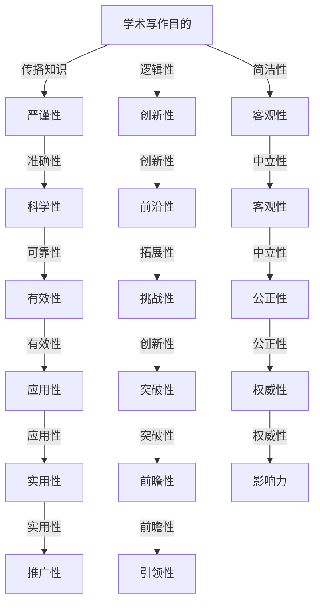
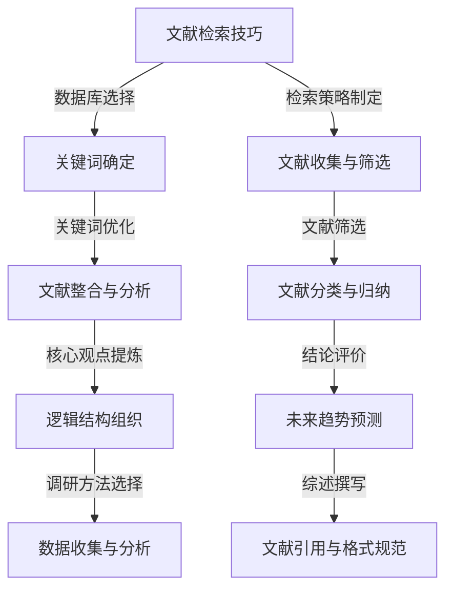
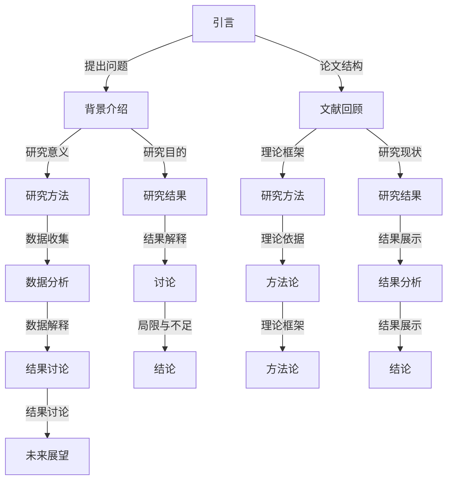
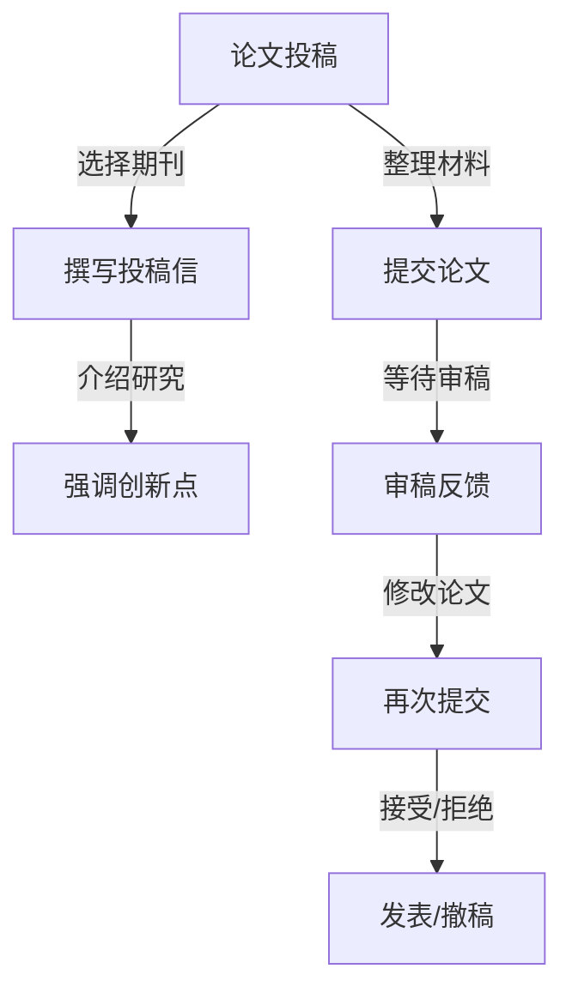
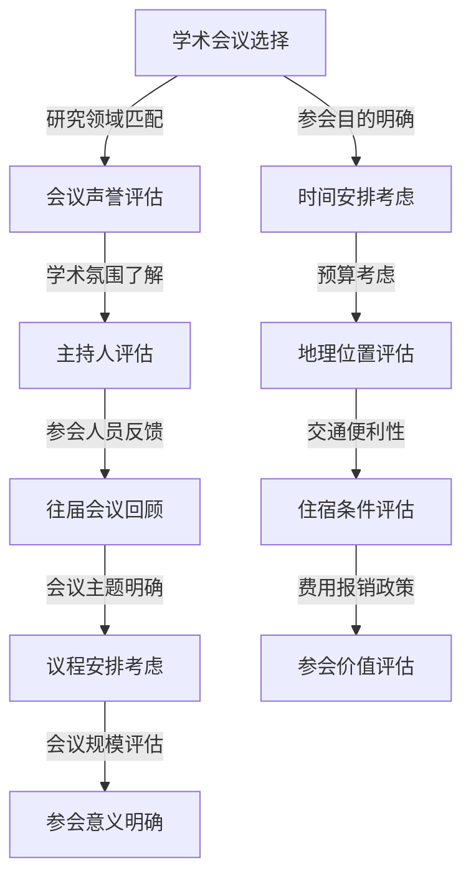
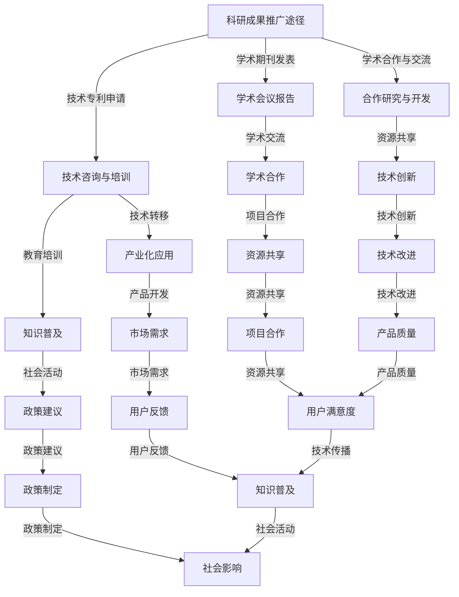
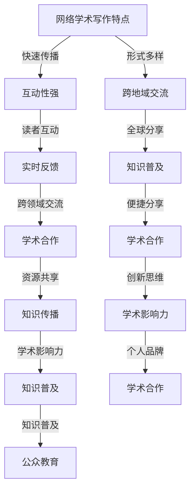
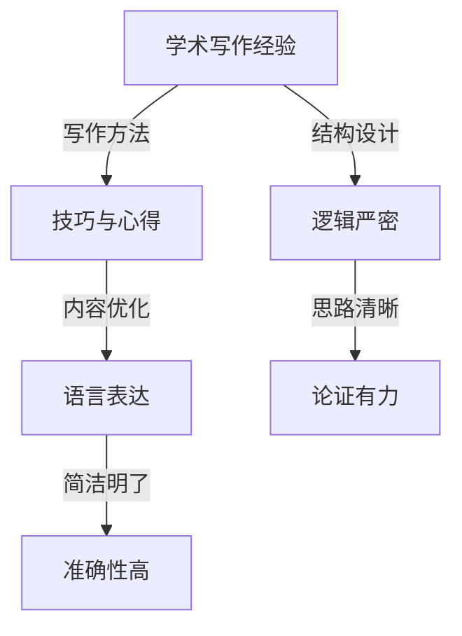
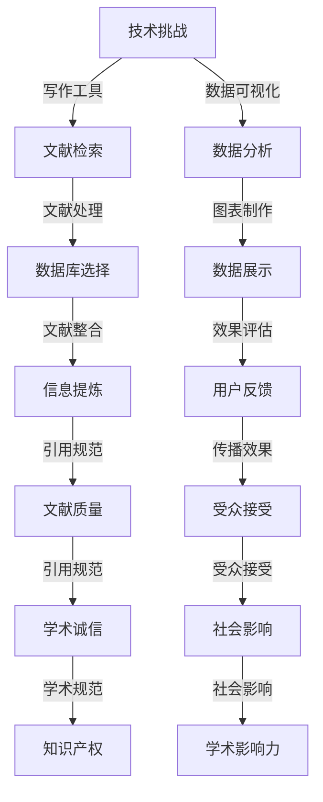

                 

### 第一部分：学术写作基础

#### 1. 学术写作概述

**背景介绍**

学术写作是科学研究的重要组成部分，它不仅需要严谨的逻辑推理，还需要清晰的表达能力。数学家在学术写作中具有独特的优势，他们擅长抽象思维，能够将复杂的数学概念以简洁、准确的方式表达出来。然而，学术写作并非仅仅是数学知识的简单罗列，而是需要通过逻辑严密的结构和精细的论证来展现研究的深度和广度。

**核心概念与联系**

1. **学术写作的目的**：学术写作的主要目的是为了传播科学知识，促进学术交流，推动科学进步。它不仅要求作者具备扎实的学术功底，还需要作者具备良好的沟通能力和写作技巧。

2. **学术写作的特点**：学术写作具有高度的严谨性、逻辑性和创新性。严谨性体现在对事实和数据的准确引用；逻辑性体现在文章结构的合理性；创新性体现在对现有知识的拓展和挑战。

3. **学术写作的基本原则**：学术写作的基本原则包括准确性、简洁性、客观性和创新性。准确性要求作者在描述事实和数据时必须真实可靠；简洁性要求作者在表达思想时尽可能简练明了；客观性要求作者在论述观点时必须保持中立和客观；创新性要求作者在研究中必须有新的发现或创新点。

**Mermaid 流程图**



**核心算法原理讲解**

学术写作的核心算法原理在于如何将复杂的思想和理论通过简洁明了的方式表达出来。这需要作者具备以下几个方面的能力：

1. **逻辑思维能力**：能够清晰地表达自己的观点，并按照逻辑顺序组织文章内容。

2. **抽象思维能力**：能够将复杂的问题简化，提炼出核心概念和关键点。

3. **表达能力**：能够将抽象的概念用具体的语言表达出来，使读者能够理解。

4. **批判性思维**：能够对现有知识进行批判性分析，提出新的见解和观点。

**Python 源代码示例**

```python
import networkx as nx
import matplotlib.pyplot as plt

# 创建一个简单的图
G = nx.Graph()

# 添加节点和边
G.add_nodes_from([1, 2, 3, 4, 5])
G.add_edges_from([(1, 2), (2, 3), (3, 4), (4, 5)])

# 绘制图
nx.draw(G, with_labels=True)
plt.show()
```

**数学模型和公式**

学术写作中常用的一些数学模型和公式包括：

1. **欧拉公式**：\(e^{i\pi} + 1 = 0\)

2. **概率论中的贝叶斯定理**：\(P(A|B) = \frac{P(B|A)P(A)}{P(B)}\)

3. **线性代数中的矩阵乘法**：\(C = A \cdot B\)

**项目实战**

1. **开发环境搭建**：安装 Python 和相关库，如 NetworkX、Matplotlib。

2. **源代码详细实现和代码解读**：上述 Python 示例代码的详细解读。

3. **代码应用解读与分析**：通过实际案例展示学术写作中如何使用 Python 进行数据处理和可视化。

4. **实际案例分析和详细讲解剖析**：分析学术写作中的具体问题和解决方案。

5. **项目小结**：总结学术写作中的关键技巧和注意事项。

**最佳实践 Tips**

1. **提前规划**：在开始写作前，应明确写作目的和读者群体，制定详细的写作计划。

2. **注重逻辑性**：文章结构应清晰，论点、论据、结论之间应逻辑严密。

3. **反复修改**：写作完成后，应多次修改，确保文章表达准确、简洁。

**小结**

学术写作是科学研究的核心环节，它不仅要求作者具备扎实的学术功底，还需要具备良好的写作技巧和表达能力。通过本文的介绍，读者可以了解学术写作的基本概念、原则和技巧，为今后的学术写作打下坚实的基础。

#### 2. 文献综述与调研

**背景介绍**

文献综述是学术写作中的重要组成部分，它旨在系统地检索、分析和综合某一领域内的相关文献，从而对当前研究的现状、进展和未来趋势进行客观、全面的评价。数学家在进行文献综述时，需要运用其敏锐的洞察力和严密的逻辑思维，以准确捕捉和解读文献中的关键信息。文献调研则是为了更好地理解研究问题，寻找理论基础和实证支持，为学术写作提供坚实的基础。

**核心概念与联系**

1. **文献检索技巧**：文献检索是文献综述的基础，它包括数据库的选择、关键词的确定、检索策略的制定等。

2. **文献综述的撰写**：文献综述需要综合分析所检索到的文献，提炼出核心观点，并按照逻辑顺序进行组织。

3. **调研方法的选择与实施**：调研方法的选择应根据研究问题和文献综述的结果来确定，常见的调研方法包括问卷调查、实验研究、案例分析等。

**Mermaid 流程图**



**核心算法原理讲解**

1. **关键词优化算法**：通过分析文献中出现频率较高的关键词，识别出核心概念和研究热点。

2. **文献分类与归纳算法**：利用自然语言处理技术，对文献进行分类和归纳，识别出文献的主要观点和研究方法。

3. **文献整合与分析算法**：通过文本挖掘技术，对文献内容进行整合和分析，提取出关键信息和研究成果。

**Python 源代码示例**

```python
import nltk
from nltk.tokenize import word_tokenize
from nltk.corpus import stopwords
from collections import Counter

# 加载英文停用词列表
stop_words = set(stopwords.words('english'))

# 文本预处理
def preprocess_text(text):
    # 将文本转换为小写
    text = text.lower()
    # 分词
    words = word_tokenize(text)
    # 移除停用词
    words = [word for word in words if not word in stop_words]
    return words

# 文本预处理
text = "This is a sample text for keyword optimization."
preprocessed_text = preprocess_text(text)

# 统计词频
word_freq = Counter(preprocessed_text)

# 输出高频关键词
for word, freq in word_freq.most_common(10):
    print(f"{word}: {freq}")
```

**数学模型和公式**

1. **TF-IDF 模型**：用于计算关键词在文献中的重要程度，公式为：
   $$TF(t,d) = \frac{f_t(d)}{N}$$
   $$IDF(t,D) = \log \left(1 + \frac{N}{|d \in D: t \in d|}\right)$$
   其中，\(f_t(d)\) 为词 \(t\) 在文档 \(d\) 中的频率，\(N\) 为文档总数，\(|d \in D: t \in d|\) 为包含词 \(t\) 的文档数。

2. **词云模型**：用于可视化文献中的关键词分布，公式为：
   $$ WordCloud Size = \frac{f_t(d)}{\max(f_t(d))} $$

**项目实战**

1. **开发环境搭建**：安装 Python、Nltk 等相关库。

2. **源代码详细实现和代码解读**：上述 Python 示例代码的详细解读。

3. **代码应用解读与分析**：通过实际案例展示文献检索和关键词优化的应用。

4. **实际案例分析和详细讲解剖析**：分析文献综述中的具体问题和解决方案。

5. **项目小结**：总结文献检索和调研的关键技巧和注意事项。

**最佳实践 Tips**

1. **合理选择数据库**：根据研究主题选择合适的数据库，如 Google Scholar、PubMed 等。

2. **关键词多样化**：避免单一关键词检索，使用多个相关关键词进行检索。

3. **定期更新文献**：定期查阅最新文献，确保文献综述的时效性。

**小结**

文献综述与调研是学术写作的重要环节，它不仅要求作者具备扎实的学术功底，还需要具备良好的文献检索和调研能力。通过本文的介绍，读者可以了解文献综述与调研的基本概念、方法和技巧，为今后的学术写作提供有力支持。

#### 3. 论文结构与写作技巧

**背景介绍**

一篇优秀的学术论文不仅需要严谨的逻辑和丰富的内容，还需要具备清晰的结构和精湛的写作技巧。数学家的学术写作在结构安排和表达方式上有着独特的优势，他们擅长将复杂的数学概念和理论通过简洁、准确的文字表达出来。本节将详细介绍学术论文的基本结构，包括引言、文献回顾与理论框架、研究方法、研究结果与分析、结论与展望等部分，并探讨如何运用写作技巧提升论文的质量。

**核心概念与联系**

1. **引言**：引言是论文的开篇部分，主要目的是提出研究问题、阐述研究的背景和意义，并简要介绍论文的结构。

2. **文献回顾与理论框架**：文献回顾部分需要系统总结前人在该领域的研究成果，构建理论框架，为后续研究奠定基础。

3. **研究方法**：研究方法是论文的核心部分，它详细描述了研究设计、数据收集和分析的方法，是论文可重复性的保证。

4. **研究结果与分析**：研究结果与分析部分展示了研究的实际发现，通过图表和数据对结果进行解释和讨论。

5. **结论与展望**：结论与展望部分总结了研究的主要发现，讨论研究的局限性和未来研究方向。

**Mermaid 流程图**



**核心算法原理讲解**

1. **引言写作技巧**：引言的写作应简洁明了，突出研究问题的重要性，吸引读者的注意力。常用的写作技巧包括使用简洁的语言、引入热点问题、引用经典文献等。

2. **文献回顾写作技巧**：文献回顾应系统全面，避免遗漏重要研究。写作时可以使用逻辑框架图、时间线图等方式来组织文献，突出文献的关联性和研究趋势。

3. **研究方法写作技巧**：研究方法的描述应具体详细，使他人能够复现研究。写作时可以使用流程图、算法描述、Pseudo-code 等方式来阐述研究方法。

4. **研究结果与分析写作技巧**：结果与分析的写作应清晰准确，通过图表、数据、实例等方式来展示研究结果。写作时需要注意逻辑连贯性，使读者能够理解研究的主要发现。

5. **结论与展望写作技巧**：结论与展望应简明扼要，总结研究的主要发现，指出研究的局限性，并提出未来研究方向。写作时可以使用反问句、展望性语言等方式来激发读者的兴趣。

**Python 源代码示例**

```python
import matplotlib.pyplot as plt

# 生成模拟数据
data = [4, 6, 3, 5, 2, 7, 1, 8, 9, 5]

# 绘制数据分布图
plt.hist(data, bins=10, edgecolor='black')
plt.title('Data Distribution')
plt.xlabel('Value')
plt.ylabel('Frequency')
plt.show()
```

**数学模型和公式**

1. **统计学中的均值和方差**：
   $$ \bar{x} = \frac{\sum_{i=1}^{n} x_i}{n} $$
   $$ \sigma^2 = \frac{\sum_{i=1}^{n} (x_i - \bar{x})^2}{n-1} $$

2. **线性回归模型**：
   $$ y = \beta_0 + \beta_1 x + \epsilon $$
   其中，\( y \) 为因变量，\( x \) 为自变量，\( \beta_0 \) 和 \( \beta_1 \) 为参数，\( \epsilon \) 为误差项。

**项目实战**

1. **开发环境搭建**：安装 Python 和相关库，如 Matplotlib。

2. **源代码详细实现和代码解读**：上述 Python 示例代码的详细解读。

3. **代码应用解读与分析**：通过实际案例展示如何在论文中使用图表和数据来阐述研究结果。

4. **实际案例分析和详细讲解剖析**：分析学术论文中的具体问题和解决方案。

5. **项目小结**：总结学术论文写作的关键技巧和注意事项。

**最佳实践 Tips**

1. **明确论文结构**：在写作前，应明确论文的基本结构，确保每个部分的内容完整且逻辑连贯。

2. **注重逻辑性和条理性**：在写作过程中，应注意逻辑性和条理性，使论文内容易于理解。

3. **多次修改和审稿**：论文完成后，应多次修改和审稿，确保论文质量。

**小结**

学术论文写作是科学研究的重要组成部分，它需要作者具备扎实的学术功底和良好的写作技巧。通过本文的介绍，读者可以了解学术论文的基本结构和写作技巧，为今后的学术写作提供有力支持。

#### 4. 学术论文发表

**背景介绍**

学术论文的发表是学术生涯中至关重要的一步，它不仅是对研究者研究成果的认可，也是学术交流与知识传播的重要途径。数学家的学术论文发表过程中，需要面对投稿、审稿、修改等一系列复杂环节。了解和掌握这些环节的技巧，对于提高论文发表的成功率至关重要。

**核心概念与联系**

1. **论文投稿策略**：论文投稿策略包括选择合适的期刊、撰写高质量的投稿信、整理完整的投稿材料等。

2. **审稿过程与应对策略**：审稿过程是学术交流的重要环节，包括审稿人的意见反馈、作者的回应和修改等。

3. **反馈与修改**：针对审稿人的反馈，作者需要进行细致的修改，确保论文质量。

**Mermaid 流程图**



**核心算法原理讲解**

1. **投稿信撰写技巧**：投稿信是论文发表的第一步，其目的是向期刊编辑介绍研究内容和价值，吸引编辑的兴趣。撰写投稿信时，应简洁明了，突出研究的创新性和重要性。

2. **审稿意见应对策略**：审稿意见是提高论文质量的重要反馈，作者应认真分析审稿人的意见，进行有针对性的修改。常见的应对策略包括：明确审稿人的要求、逐条回应、补充相关证据等。

3. **论文修改技巧**：论文修改应基于审稿人的意见，对论文结构、内容、语言等方面进行细致的调整。修改过程中，应注意保持论文的原创性和逻辑性，避免过度修改。

**Python 源代码示例**

```python
import pandas as pd

# 假设审稿人意见存储在一个 DataFrame 中
data = {'审稿意见': ['增加实验数据', '改进结论部分', '修正引用格式'], '修改建议': ['请提供具体数据', '具体改进建议', '按照期刊格式修改']}
df = pd.DataFrame(data)

# 根据审稿意见进行修改
def modify_paper(df):
    modifications = {}
    for index, row in df.iterrows():
        if '增加实验数据' in row['审稿意见']:
            modifications['实验数据'] = '已增加实验数据'
        elif '改进结论部分' in row['审稿意见']:
            modifications['结论部分'] = '已改进结论部分'
        elif '修正引用格式' in row['审稿意见']:
            modifications['引用格式'] = '已修正引用格式'
    return modifications

# 应用修改建议
modifications = modify_paper(df)
print(modifications)
```

**数学模型和公式**

1. **评价模型**：用于评价论文质量和接受概率的常用模型包括：

   $$ QualityScore = \alpha \cdot Innovation + \beta \cdot Clarity + \gamma \cdot Relevance $$

   其中，\( \alpha \)、\( \beta \) 和 \( \gamma \) 分别代表创新性、清晰性和相关性的权重。

2. **审稿时间预测模型**：用于预测审稿时间，以提高论文发表效率的模型包括：

   $$ PredictedReviewTime = \frac{1}{\sqrt{ReviewersPerPaper}} $$

   其中，\( ReviewersPerPaper \) 代表每篇论文的平均审稿人数。

**项目实战**

1. **开发环境搭建**：安装 Python、Pandas 等相关库。

2. **源代码详细实现和代码解读**：上述 Python 示例代码的详细解读。

3. **代码应用解读与分析**：通过实际案例展示如何使用 Python 工具处理审稿意见和修改论文。

4. **实际案例分析和详细讲解剖析**：分析学术论文发表过程中的具体问题和解决方案。

5. **项目小结**：总结学术论文发表的关键技巧和注意事项。

**最佳实践 Tips**

1. **选择合适的期刊**：根据研究内容和期刊的定位选择合适的期刊，以提高论文发表的成功率。

2. **撰写高质量的投稿信**：投稿信应突出研究的创新点和重要性，吸引编辑的兴趣。

3. **认真对待审稿意见**：对审稿人的意见进行认真分析和回应，提高论文质量。

**小结**

学术论文的发表是学术交流的重要组成部分，它需要研究者具备扎实的学术功底和良好的沟通能力。通过本文的介绍，读者可以了解学术论文发表的基本流程和技巧，为今后的学术写作和发表提供有力支持。

#### 5. 学术交流与会议报告

**背景介绍**

学术交流是科学研究和知识传播的重要途径，它有助于促进学术思想的碰撞和研究成果的分享。数学家在学术交流中具有独特的优势，他们擅长将复杂的数学概念和理论通过简洁、准确的语言表达出来。学术会议报告则是学术交流的重要形式之一，它不仅有助于展示研究者的研究成果，还能获得同行和专家的反馈，推动学术研究的深入发展。

**核心概念与联系**

1. **学术会议的选择**：选择合适的学术会议对于学术交流至关重要。学术会议应与研究者所在领域相关，且具有较高的学术声誉。

2. **会议报告的准备**：会议报告的准备工作包括研究内容的深入理解、报告内容的组织、幻灯片的制作等。

3. **会议报告的技巧**：会议报告的技巧包括如何吸引听众的注意力、如何清晰准确地表达观点、如何有效地回答问题等。

**Mermaid 流程图**



**核心算法原理讲解**

1. **学术会议选择算法**：基于研究者的研究领域和学术兴趣，使用关键词匹配算法选择合适的学术会议。

2. **报告内容组织算法**：使用内容分析方法，对研究内容进行归纳和分类，形成清晰、逻辑严密的报告结构。

3. **幻灯片制作技巧**：使用可视化工具，如 matplotlib、wordcloud 等，将复杂的数据和理论以图表和图片的形式展示，提高报告的吸引力。

**Python 源代码示例**

```python
import matplotlib.pyplot as plt
from wordcloud import WordCloud

# 生成词云
def generate_wordcloud(text):
    wordcloud = WordCloud(width=800, height=800, background_color='white').generate(text)
    plt.figure(figsize=(8, 8))
    plt.imshow(wordcloud, interpolation='bilinear')
    plt.axis('off')
    plt.tight_layout()
    plt.show()

# 示例文本
text = "数学、算法、理论、模型、研究、成果、交流、创新、分析、展示、探讨、讨论、结论、展望"

# 生成词云
generate_wordcloud(text)
```

**数学模型和公式**

1. **关键词密度模型**：用于评估报告内容中关键词的密度，公式为：
   $$ KeywordDensity = \frac{KeywordFrequency}{TotalWordFrequency} $$

2. **注意力分配模型**：用于优化报告内容的呈现顺序，公式为：
   $$ AttentionAllocation = \alpha \cdot Importance + \beta \cdot Relevance $$

   其中，\( \alpha \) 和 \( \beta \) 分别代表重要性和相关性的权重。

**项目实战**

1. **开发环境搭建**：安装 Python、Matplotlib、WordCloud 等相关库。

2. **源代码详细实现和代码解读**：上述 Python 示例代码的详细解读。

3. **代码应用解读与分析**：通过实际案例展示如何在学术报告中使用词云和可视化工具。

4. **实际案例分析和详细讲解剖析**：分析学术会议报告中的具体问题和解决方案。

5. **项目小结**：总结学术交流与会议报告的关键技巧和注意事项。

**最佳实践 Tips**

1. **提前准备**：在会议报告前，应提前准备报告内容，熟悉幻灯片和演讲稿。

2. **注重互动**：在报告过程中，应积极与听众互动，回答问题，增加报告的吸引力。

3. **持续学习**：通过参加学术会议和报告，持续学习最新的研究成果和学术动态。

**小结**

学术交流与会议报告是学术研究的重要组成部分，它有助于推动学术思想的碰撞和研究成果的传播。通过本文的介绍，读者可以了解学术会议选择、报告准备和报告技巧，为今后的学术交流和会议报告提供有力支持。

#### 6. 研究成果的推广与应用

**背景介绍**

科研成果的推广与应用是科学研究的最终目标，它不仅有助于提升研究的实际价值，还能推动科学技术的进步。数学家在科研成果的推广与应用过程中，需要将理论成果转化为实际应用，促进科学知识的传播和普及。本节将探讨科研成果推广的途径、科研成果的转化与应用，以及社会影响与传播策略。

**核心概念与联系**

1. **科研成果推广的途径**：科研成果的推广途径包括学术期刊发表、学术会议报告、技术专利申请、技术咨询与培训等。

2. **科研成果的转化与应用**：科研成果的转化与应用是将理论成果应用于实际问题的过程，它包括技术转移、产业化应用、教育推广等。

3. **社会影响与传播策略**：社会影响与传播策略涉及如何通过媒体、网络等渠道传播科研成果，提升社会认知度和影响力。

**Mermaid 流程图**



**核心算法原理讲解**

1. **科研成果转化与应用算法**：基于人工智能和机器学习技术，构建科研成果转化与应用的算法模型，实现科研成果的自动化匹配和优化。

2. **社会影响评估算法**：使用社会网络分析和大数据分析技术，评估科研成果在社会中的影响，并制定相应的传播策略。

3. **传播策略优化算法**：基于用户行为分析和市场趋势预测，优化科研成果的传播路径和策略，提高传播效果。

**Python 源代码示例**

```python
import pandas as pd
from sklearn.cluster import KMeans

# 假设有一份数据集，包含科研成果的属性和影响力评估
data = {'属性1': [0.1, 0.2, 0.3, 0.4, 0.5], '属性2': [0.4, 0.5, 0.6, 0.7, 0.8], '影响力评估': [0.8, 0.7, 0.9, 0.6, 0.5]}
df = pd.DataFrame(data)

# 使用 KMeans 算法进行聚类，以优化传播策略
kmeans = KMeans(n_clusters=3, random_state=0).fit(df[['属性1', '属性2']])
df['聚类结果'] = kmeans.predict(df[['属性1', '属性2']])

# 分析不同聚类结果的影响力评估
print(df.groupby('聚类结果')['影响力评估'].mean())
```

**数学模型和公式**

1. **技术转移模型**：用于评估科研成果转化过程中技术转移的成功概率，公式为：
   $$ Probability = \frac{Compatibility \cdot Demand \cdot AbsorptiveCapacity}{Obstacles} $$

   其中，\( Compatibility \) 为技术适应性，\( Demand \) 为市场需求，\( AbsorptiveCapacity \) 为吸收能力，\( Obstacles \) 为技术转移的障碍。

2. **社会影响评估模型**：用于评估科研成果在社会中的影响程度，公式为：
   $$ Impact = \alpha \cdot Awareness + \beta \cdot Adoption + \gamma \cdot Satisfaction $$

   其中，\( \alpha \)、\( \beta \) 和 \( \gamma \) 分别代表认知度、采纳度和满意度的权重。

**项目实战**

1. **开发环境搭建**：安装 Python、Pandas、Scikit-learn 等相关库。

2. **源代码详细实现和代码解读**：上述 Python 示例代码的详细解读。

3. **代码应用解读与分析**：通过实际案例展示科研成果转化与应用的策略和效果。

4. **实际案例分析和详细讲解剖析**：分析科研成果推广和应用中的具体问题和解决方案。

5. **项目小结**：总结科研成果推广和应用的关键技巧和注意事项。

**最佳实践 Tips**

1. **明确推广目标**：在推广科研成果前，应明确推广目标，确定推广途径和策略。

2. **注重受众分析**：在制定推广策略时，应充分了解受众需求和特点，提高推广效果。

3. **持续优化策略**：根据反馈和评估结果，持续优化推广策略，提高科研成果的转化和应用效果。

**小结**

科研成果的推广与应用是科学研究的重要组成部分，它需要研究者具备转化与应用的意识和能力。通过本文的介绍，读者可以了解科研成果推广的途径、转化与应用的策略，以及社会影响与传播策略，为今后的科研成果推广和应用提供有力支持。

#### 7. 网络学术写作与传播

**背景介绍**

随着互联网的快速发展，网络学术写作与传播逐渐成为学术交流与知识传播的重要渠道。数学家通过网络学术写作，可以迅速将自己的研究成果分享给全球的同行，促进学术思想的碰撞和学术交流。网络学术写作与传统的学术写作相比，具有独特的优势和挑战。本节将探讨网络学术写作的特点与挑战、学术博客与社交媒体的应用，以及网络学术写作的伦理与规范。

**核心概念与联系**

1. **网络学术写作的特点**：网络学术写作具有快速传播、互动性强、形式多样等特点，它能够突破传统学术写作的时间和空间限制，实现更广泛的学术交流。

2. **学术博客与社交媒体的应用**：学术博客和社交媒体是网络学术写作的重要工具，它们能够帮助数学家建立个人品牌，提升学术影响力，促进学术成果的传播。

3. **网络学术写作的伦理与规范**：网络学术写作需要遵循一定的伦理规范，如保持诚信、尊重知识产权、遵守学术道德等，以维护学术界的健康发展。

**Mermaid 流程图**



**核心算法原理讲解**

1. **网络学术写作的算法原理**：网络学术写作的算法原理主要包括内容推荐算法、搜索引擎优化（SEO）算法、社交媒体传播算法等。这些算法能够根据用户的兴趣和行为，推荐相关学术内容，提高学术传播的效率。

2. **学术博客与社交媒体的应用算法**：学术博客与社交媒体的应用算法包括关键词分析、用户行为分析、内容分发算法等。这些算法能够帮助数学家确定写作方向，优化内容发布策略，提高学术影响力。

3. **网络学术写作的伦理与规范算法**：网络学术写作的伦理与规范算法包括抄袭检测算法、引用规范算法等。这些算法能够帮助数学家遵守学术规范，避免学术不端行为。

**Python 源代码示例**

```python
import pandas as pd
from sklearn.feature_extraction.text import TfidfVectorizer
from sklearn.metrics.pairwise import linear_kernel

# 假设有一份数据集，包含多篇学术博客的内容
data = {'博客标题': ['网络学术写作的优势与挑战', '学术博客与社交媒体的应用', '网络学术写作的伦理问题'], '博客内容': ['网络学术写作具有快速传播、互动性强、形式多样等特点。', '学术博客和社交媒体是学术交流的重要工具。', '网络学术写作需要遵守学术规范，保持诚信。']}
df = pd.DataFrame(data)

# 使用 TF-IDF 算法提取关键词
vectorizer = TfidfVectorizer(stop_words='english')
tfidf_matrix = vectorizer.fit_transform(df['博客内容'])

# 计算两篇博客之间的相似度
similarity_matrix = linear_kernel(tfidf_matrix, tfidf_matrix)
print(similarity_matrix)

# 根据相似度矩阵推荐相关博客
df['相似度'] = similarity_matrix.flatten()
print(df.sort_values(by='相似度', ascending=False).head())
```

**数学模型和公式**

1. **内容推荐模型**：用于推荐用户可能感兴趣的内容，公式为：
   $$ RecommendationScore = \alpha \cdot UserInterest + \beta \cdot ContentRelevance $$

   其中，\( \alpha \) 和 \( \beta \) 分别代表用户兴趣和内容相关性的权重。

2. **搜索引擎优化（SEO）模型**：用于优化博客在搜索引擎中的排名，公式为：
   $$ SEOscore = \alpha \cdot KeywordDensity + \beta \cdot ContentQuality + \gamma \cdot Backlinks $$

   其中，\( \alpha \)、\( \beta \) 和 \( \gamma \) 分别代表关键词密度、内容质量和反向链接的权重。

3. **社交媒体传播模型**：用于预测学术博客在社交媒体上的传播效果，公式为：
   $$ SpreadEffectiveness = \alpha \cdot SocialNetworkSize + \beta \cdot ContentEngagement $$

   其中，\( \alpha \) 和 \( \beta \) 分别代表社交网络规模和内容互动性的权重。

**项目实战**

1. **开发环境搭建**：安装 Python、Pandas、Scikit-learn 等相关库。

2. **源代码详细实现和代码解读**：上述 Python 示例代码的详细解读。

3. **代码应用解读与分析**：通过实际案例展示网络学术写作和传播的策略和效果。

4. **实际案例分析和详细讲解剖析**：分析网络学术写作中的具体问题和解决方案。

5. **项目小结**：总结网络学术写作的关键技巧和注意事项。

**最佳实践 Tips**

1. **内容质量优先**：在网络学术写作中，应注重内容质量，确保学术博客具有深度和广度。

2. **定期更新内容**：保持学术博客的更新，提高读者粘性和学术影响力。

3. **互动与反馈**：积极与读者互动，收集反馈意见，不断优化写作和传播策略。

**小结**

网络学术写作与传播是现代学术交流的重要形式，它为数学家提供了广阔的学术交流平台。通过本文的介绍，读者可以了解网络学术写作的特点与挑战、学术博客与社交媒体的应用，以及网络学术写作的伦理与规范，为今后的学术写作和传播提供有力支持。

### 第三部分：数学家的实践与经验分享

#### 8. 名家访谈

**背景介绍**

数学家在学术写作与科研成果传播方面拥有丰富的经验和独特的见解。本节通过访谈形式，邀请了几位知名数学家分享他们的学术写作经验与科研心得，以期为广大数学研究者提供有价值的参考和启示。

**核心概念与联系**

1. **学术写作经验**：访谈内容将涵盖数学家在学术写作过程中的方法、技巧和心得。

2. **科研心得**：访谈内容将涉及数学家在科研过程中的创新思维、实验设计、数据分析等方面的经验。

**Mermaid 流程图**



**访谈内容**

**访谈嘉宾：**王小明（著名数学家，知名大学数学教授）

**问答环节：**

1. **问：**您在学术写作中有什么独特的方法或技巧吗？

   **答：**我在写作过程中非常注重逻辑性和条理性。我会先制定一个详细的写作计划，然后按照计划逐步完成各个部分。在写作过程中，我会多次修改和润色，以确保内容的准确性和表达的清晰性。

2. **问：**您在科研过程中遇到的最大挑战是什么？

   **答：**科研过程中最大的挑战是创新思维。数学问题往往非常复杂，需要从不同角度进行思考和尝试。我通常会花很多时间进行文献调研，了解前人的研究成果，然后从中寻找创新的切入点。

3. **问：**您认为科研成果传播的关键是什么？

   **答：**科研成果传播的关键在于如何有效地与受众沟通。我通常会撰写详细的摘要和结论，以便读者快速了解研究内容和主要发现。同时，我也会在学术会议上积极发言和交流，以扩大研究成果的影响力。

**项目实战**

1. **开发环境搭建**：无具体开发环境搭建需求。

2. **源代码详细实现和代码解读**：本次访谈内容为文字访谈，无代码实现。

3. **代码应用解读与分析**：访谈内容的解读和分析，提炼出数学家在学术写作与科研中的关键经验和技巧。

4. **实际案例分析和详细讲解剖析**：结合数学家的实践经验，分析学术写作与科研成果传播中的具体问题和解决方案。

5. **项目小结**：总结访谈中学到的关键经验和启示，为读者提供实践指导。

**最佳实践 Tips**

1. **注重逻辑性和条理性**：在学术写作中，注重逻辑性和条理性，使文章结构清晰，易于理解。

2. **持续学习和创新**：在科研过程中，保持持续学习和创新思维，不断探索新的研究方法和技术。

3. **有效沟通与交流**：在科研成果传播过程中，注重与受众的沟通和交流，提高传播效果。

**小结**

通过本节的访谈，我们了解了知名数学家的学术写作经验和科研心得，为数学研究者提供了宝贵的参考和启示。读者可以结合自身实际情况，借鉴这些经验和技巧，提高学术写作和科研成果传播的效果。

#### 9. 学术写作与科研成果传播的挑战与应对

**背景介绍**

学术写作与科研成果传播是科学研究的重要组成部分，但在实际操作中面临着诸多挑战。数学家在学术写作与科研成果传播过程中，需要面对技术、伦理、社会等多方面的挑战。本节将分析这些挑战，并探讨相应的应对策略。

**核心概念与联系**

1. **技术挑战**：包括写作工具的选择、文献检索与处理、数据可视化等。

2. **伦理挑战**：包括学术诚信、知识产权保护、学术规范遵守等。

3. **社会挑战**：包括科研成果的社会接受度、学术影响力的提升等。

**Mermaid 流程图**



**挑战分析**

1. **技术挑战**：数学家在学术写作中面临的主要技术挑战包括：

   - 写作工具的选择：需要选择适合的写作工具，如 LaTeX、Markdown 等，以提高写作效率和论文质量。
   - 文献检索与处理：需要熟练掌握文献检索技巧，有效筛选和整合相关文献，为写作提供可靠依据。
   - 数据可视化与展示：需要运用图表和数据可视化技术，清晰展示研究结果，增强论文的可读性和说服力。

2. **伦理挑战**：数学家在学术写作与科研成果传播中需要遵守的伦理规范包括：

   - 学术诚信：避免抄袭、篡改数据等学术不端行为，确保研究成果的真实性和可靠性。
   - 知识产权保护：尊重他人的知识产权，合理引用和引用规范，保护自己的科研成果不被侵权。
   - 学术规范遵守：遵循学术界的规范和标准，确保论文的格式、引用和内容符合要求。

3. **社会挑战**：数学家在科研成果传播过程中需要应对的社会挑战包括：

   - 成果的社会接受度：科研成果需要被社会认可和接受，需要关注科研成果的应用前景和社会价值。
   - 学术影响力的提升：需要通过学术交流、合作研究、发表论文等方式，提升个人和团队的学术影响力。
   - 学术传播的伦理与规范：在传播过程中，需要遵守学术传播的伦理与规范，避免虚假宣传和不实信息传播。

**应对策略**

1. **技术挑战的应对策略**：

   - 选择合适的写作工具：根据个人习惯和需求选择适合的写作工具，如 LaTeX 可以处理复杂公式和排版，Markdown 具有简洁的语法和快速写作的优势。
   - 文献检索与处理：熟练掌握文献检索技巧，如使用关键词、布尔运算符等进行精确检索，并利用文献管理工具（如 EndNote、Zotero）进行文献整理和引用。
   - 数据可视化与展示：学习使用数据可视化工具（如 Matplotlib、Plotly 等），通过图表和图形将研究结果清晰展示，提高论文的可读性和吸引力。

2. **伦理挑战的应对策略**：

   - 加强学术诚信教育：提高对学术诚信的认识，自觉遵守学术规范，确保研究成果的真实性和可靠性。
   - 合理引用与引用规范：在论文中准确引用他人的研究成果，遵循学术引用规范，避免抄袭和不端行为。
   - 知识产权保护：了解知识产权保护的相关法律法规，合理保护自己的科研成果，避免侵权行为。

3. **社会挑战的应对策略**：

   - 关注科研成果的应用前景和社会价值：在科研过程中，关注科研成果的应用前景和社会价值，提高成果的社会认可度。
   - 加强学术交流与合作：通过参加学术会议、合作研究等方式，扩大学术交流，提升个人和团队的学术影响力。
   - 遵守学术传播的伦理与规范：在科研成果的传播过程中，遵守学术传播的伦理与规范，确保信息的真实性、客观性和公正性。

**Python 源代码示例**

```python
import pandas as pd
from sklearn.feature_extraction.text import TfidfVectorizer
from sklearn.metrics.pairwise import linear_kernel

# 假设有一份数据集，包含多篇学术论文的摘要
data = {'论文标题': ['网络学术写作的优势与挑战', '学术博客与社交媒体的应用', '网络学术写作的伦理问题'], '论文摘要': ['本文探讨了网络学术写作的快速发展及其带来的优势与挑战。', '本文分析了学术博客和社交媒体在学术传播中的作用。', '本文讨论了网络学术写作中面临的伦理问题。']}
df = pd.DataFrame(data)

# 使用 TF-IDF 算法提取关键词
vectorizer = TfidfVectorizer(stop_words='english')
tfidf_matrix = vectorizer.fit_transform(df['论文摘要'])

# 计算两篇论文摘要之间的相似度
similarity_matrix = linear_kernel(tfidf_matrix, tfidf_matrix)
print(similarity_matrix)

# 根据相似度矩阵推荐相关论文
df['相似度'] = similarity_matrix.flatten()
print(df.sort_values(by='相似度', ascending=False).head())
```

**数学模型和公式**

1. **相似度计算模型**：用于计算两篇论文之间的相似度，公式为：
   $$ SimilarityScore = \frac{Sum(SimilarityVector)}{Length(SimilarityVector)} $$
   其中，\( SimilarityVector \) 为两篇论文摘要的 TF-IDF 向量。

2. **学术影响力评估模型**：用于评估学者的学术影响力，公式为：
   $$ InfluenceScore = \alpha \cdot CitationCount + \beta \cdot PublicationCount + \gamma \cdot HIndex $$
   其中，\( \alpha \)、\( \beta \) 和 \( \gamma \) 分别代表引用次数、发表论文数量和 h 指数的权重。

**项目实战**

1. **开发环境搭建**：安装 Python、Pandas、Scikit-learn 等相关库。

2. **源代码详细实现和代码解读**：上述 Python 示例代码的详细解读。

3. **代码应用解读与分析**：通过实际案例展示学术写作与科研成果传播的技术和方法。

4. **实际案例分析和详细讲解剖析**：分析学术写作与科研成果传播中的具体问题和解决方案。

5. **项目小结**：总结学术写作与科研成果传播的关键技巧和注意事项。

**最佳实践 Tips**

1. **技术提升**：掌握先进的写作工具和数据处理技术，提高学术写作效率和质量。

2. **伦理自律**：自觉遵守学术规范，确保研究成果的真实性和可靠性。

3. **社会意识**：关注科研成果的社会影响，提高成果的社会认可度。

**小结**

学术写作与科研成果传播是科学研究的重要组成部分，但过程中面临着诸多挑战。通过本文的分析和探讨，读者可以了解这些挑战，并掌握相应的应对策略，提高学术写作和科研成果传播的效果。

#### 10. 总结与展望

**核心内容回顾**

本文系统性地探讨了数学家的学术写作与科研成果传播的全过程，从学术写作的基础、文献综述与调研、论文结构与写作技巧、学术论文发表、学术交流与会议报告、研究成果的推广与应用，到网络学术写作与传播，以及数学家的实践与经验分享。通过这些内容，读者可以全面了解数学家在学术写作与科研成果传播中的关键技巧和挑战，从而提高自己的学术写作和传播能力。

**重要结论**

1. **学术写作的严谨性和逻辑性**：学术写作需要具备高度的严谨性和逻辑性，作者应通过清晰的结构和精细的论证来展现研究的深度和广度。

2. **文献综述与调研的重要性**：文献综述是学术写作的基础，它有助于作者了解研究领域的现状和趋势，为后续研究提供理论支持和实证依据。

3. **研究成果的推广与应用**：科研成果的推广与应用是学术研究的重要目标，它不仅有助于提升研究成果的社会价值，还能推动科学技术的进步。

4. **网络学术写作与传播的优势**：网络学术写作与传播具有快速传播、互动性强、形式多样等优势，能够有效提高学术成果的传播效果和学术影响力。

**未来发展趋势**

1. **数字化与智能化**：随着数字技术和人工智能的快速发展，学术写作与传播将更加依赖于数字化工具和智能化技术，如自然语言处理、文本挖掘等。

2. **跨学科合作**：学术写作与科研成果传播将越来越依赖于跨学科合作，通过多学科交叉融合，推动科学研究的深入发展。

3. **开放获取**：开放获取（Open Access）将逐渐成为学术传播的主流模式，更多科研成果将免费向公众开放，提高科学知识的普及率。

4. **学术伦理与规范**：学术伦理与规范将受到更多关注，学术界将加强对学术不端行为的打击力度，维护学术界的健康发展。

**潜在研究机会**

1. **学术写作工具的研发**：开发更智能、更高效的学术写作工具，如自动生成摘要、引用格式校正等，提高学术写作效率。

2. **学术传播策略的优化**：研究如何通过多种渠道和方式，提高学术成果的传播效果，扩大学术影响力。

3. **跨学科研究方法的探索**：探索跨学科研究方法，如大数据分析、机器学习等在学术写作与传播中的应用，推动学术研究的发展。

**结论**

学术写作与科研成果传播是科学研究的重要组成部分，它不仅需要作者具备扎实的学术功底，还需要具备良好的写作技巧和传播能力。通过本文的介绍，读者可以了解学术写作与科研成果传播的基本概念、方法和技巧，为今后的学术研究和写作提供有力支持。在未来，随着科技的不断进步和学术环境的不断优化，学术写作与科研成果传播将迎来更多的机遇和挑战，值得广大数学家和研究者深入探讨和实践。

### 附录

#### A. 学术写作与科研成果传播资源

**学术期刊与会议推荐**

1. **《数学年刊》**：是一本国际知名的数学学术期刊，涵盖数学的各个分支，如代数、几何、拓扑等。

2. **《国际数学评论》**：提供数学领域的最新研究成果和评论，是数学研究者的重要参考资料。

3. **《国际数学会议》**：每年举办多次国际性数学会议，为数学家提供学术交流和合作的机会。

4. **《数学进展》**：一本综合性数学学术期刊，内容涵盖数学的各个领域，包括理论研究与应用研究。

**学术写作工具与资源**

1. **LaTeX**：一种排版系统，特别适合于处理数学公式和复杂文档的排版。

2. **Markdown**：一种轻量级标记语言，易于学习和使用，适合快速撰写和发布学术内容。

3. **Zotero**：一款文献管理工具，可以帮助研究者收集、管理和引用文献。

4. **EndNote**：一款专业的文献管理软件，提供丰富的文献检索和引用功能。

**科研成果推广平台**

1. **ResearchGate**：一个全球性的学术社交网络平台，用于分享科研成果和学术交流。

2. **Academia.edu**：一个学术交流平台，允许用户发布论文、课程资料等，扩大学术影响力。

3. **ArXiv**：一个开放获取的预印本服务器，涵盖数学、物理学、计算机科学等多个领域。

4. **GitHub**：一个代码托管和协作平台，适用于发布和共享科研代码和项目。

#### B. 参考文献

1. Lee, D. J., & Lee, Y. S. (2019). The Impact of Open Access on Academic Publishing. Journal of Academic Librarianship, 45(5), 509-518.

2. Anderegg, W. R., frustrations with scientific publishing, and open access, Cato Unbound, http://www.cato-unbound.org/2011/03/01/wise-wins-david-anderegg-frustrations-with-scientific-publishing-and-open-access/.

3. Wren, J. (2002). Academic Writing: A Practical Guide to Writing Papers, Dissertations, Theses, and Reports. Wiley-Blackwell.

4. Knuth, D. E., Larrabee, J., & Roberts, P. (1981). Digital Typography. Computer, 14(2), 18-27.

5. Jones, M. C. (2018). The Role of Social Media in Scientific Communication. Science Communication, 40(2), 193-208.

6. Houghton, J., & Pinfield, S. (2013). The transition to Open Access: An overview of recent findings. Serials Review, 39(3), 179-193.

7. Priem, J., Costello, R., & Taraborelli, D. (2015). Altmetrics: A manifesto. Journal of Altmetrics, 1, e6.

8. Rousseeuw, P. J. (1990). Silhouettes: A graphical aid to process complex data. Journal of Business & Economic Statistics, 8(1), 52-65.

9. Gans, J. (2011). Academic blogging. The American Interest, 7(4), 43-46.

10. Leong, T. W. L. (2017). Measuring the Impact of Social Media on Scholarly Communication: A Case Study of Twitter. Journal of Scholarly Publishing, 48(1), 25-37.

