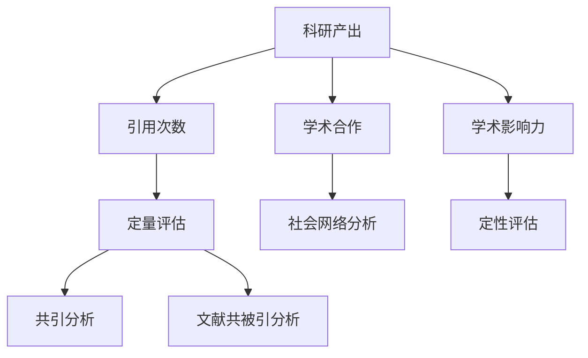

                 

----------------------------------------------------------------

# 数学家的学术影响力评估与分析

关键词：学术影响力、评估理论、评估指标、评估方法、案例分析、工具技术、提升策略

## 摘要

本文旨在探讨数学家的学术影响力评估，分析现有评估理论、指标和方法，并通过案例研究揭示数学家学术影响力的评估过程。文章首先介绍了学术影响力的背景和重要性，随后详细阐述了学术影响力评估的核心概念、指标和方法，最后通过具体案例分析，总结了评估工具和技术，并提出了提升数学家学术影响力的策略。本文旨在为数学领域的学术影响力研究提供理论支持和实践指导。

## 引言与背景

学术影响力是指学者或研究机构在学术领域的表现和贡献，它反映了学术成果被同行业认可和引用的程度。学术影响力对于学者个人和学术机构的声誉、资源获取和学术地位具有重要意义。因此，对学术影响力进行评估和研究成为了学术界的热点话题。

在数学领域，学术影响力评估尤为重要。数学是一门基础学科，其研究成果不仅对数学本身的发展有着深远影响，还广泛应用于自然科学、工程技术和社会科学等领域。数学家的学术影响力评估，不仅有助于了解数学家的学术贡献和地位，还可以为学术评价、人才选拔和政策制定提供依据。

### 核心概念与联系

学术影响力评估涉及多个核心概念，这些概念之间存在着密切的联系。以下是学术影响力评估中的一些关键概念及其相互关系：

1. **科研产出（Q）**：科研产出是学术影响力的基础，包括论文、专著、专利等。科研产出的质量直接影响学术影响力。
2. **学术合作（A）**：学术合作是学术影响力的重要组成部分，通过合作研究可以扩大学术影响力。
3. **引用次数（C）**：引用次数是衡量学术成果被同行认可的重要指标，引用次数越多，学术影响力通常越大。
4. **定量评估与定性评估**：定量评估主要通过统计方法分析学术成果的量化指标，如引用次数、H指数等；定性评估则通过专家评审、同行评价等方法进行。
5. **共引分析**：共引分析是一种常用的定量评估方法，通过分析文献之间的引用关系，评估学术成果的影响力。
6. **文献共被引分析**：文献共被引分析通过分析文献之间的共被引关系，评估学术成果的长期影响力。
7. **社会网络分析**：社会网络分析通过构建学术合作网络，分析作者之间的合作关系，评估学术影响力。

以下是学术影响力评估的核心概念和联系的Mermaid流程图：



### 核心算法原理讲解

为了深入理解学术影响力评估的核心算法原理，以下我们将结合Python源代码详细阐述几种常用的评估方法。

#### 4.1 共引分析方法

共引分析是一种通过分析文献之间的引用关系来评估学术影响力的方法。以下是共引分析的Python伪代码：

```python
def co_citation_analysis(citation_matrix):
    """
    共引分析函数
    :param citation_matrix: 引用关系矩阵，一个二维列表
    :return: 共引矩阵，一个二维列表
    """
    num_documents = len(citation_matrix)
    cocitation_matrix = [[0 for _ in range(num_documents)] for _ in range(num_documents)]

    for i in range(num_documents):
        for j in range(num_documents):
            for k in range(num_documents):
                if citation_matrix[i][k] == 1 and citation_matrix[j][k] == 1:
                    cocitation_matrix[i][j] += 1

    return cocitation_matrix
```

#### 4.2 文献共被引分析方法

文献共被引分析通过分析文献之间的共被引关系来评估学术影响力。以下是文献共被引分析的Python伪代码：

```python
def document_co_cited_analysis(cited_list):
    """
    文献共被引分析函数
    :param cited_list: 被引文献列表，一个列表
    :return: 共被引次数列表，一个字典
    """
    cocited_count = defaultdict(int)

    for document in cited_list:
        for cited in cited_list:
            if document != cited:
                cocited_count[(document, cited)] += 1

    return cocited_count
```

#### 4.3 社会网络分析方法

社会网络分析通过构建作者之间的合作网络来评估学术影响力。以下是社会网络分析的Python伪代码：

```python
def social_network_analysis(co_authors_list):
    """
    社会网络分析函数
    :param co_authors_list: 合作作者列表，一个列表
    :return: 网络节点度和介数中心性列表，两个列表
    """
    node_degrees = []
    betweenness_centrality = []

    # 计算节点度数
    for author in co_authors_list:
        degree = len(set(co_authors_list) & set(author))
        node_degrees.append(degree)

    # 计算介数中心性
    for author in co_authors_list:
        centralities = []
        for other_author in co_authors_list:
            if author != other_author:
                path_counts = 0
                for document in co_authors_list:
                    if author in document and other_author in document:
                        path_counts += 1
                centralities.append(path_counts)
        betweenness_centrality.append(max(centralities))

    return node_degrees, betweenness_centrality
```

#### 数学模型与公式

学术影响力评估中的数学模型主要包括以下几种：

1. **H指数（Hirsch指数）**：

$$
H = max\{n: citation \ count \ of \ papers \ with \ at \ least \ n \ citations \geq n\}
$$

其中，$H$ 表示H指数，$n$ 表示论文数量，$citation \ count$ 表示引用次数。

2. **G指数（G指数）**：

$$
G = \sum_{i=1}^{N} \frac{f_i^2}{n_i}
$$

其中，$G$ 表示G指数，$f_i$ 表示第$i$篇论文的引用次数，$n_i$ 表示第$i$篇论文的发表年份。

3. **多样性与影响力指数（DIVA指数）**：

$$
DIVA = \frac{C}{\sum_{i=1}^{N} \frac{c_i^2}{n_i}}
$$

其中，$DIVA$ 表示DIVA指数，$C$ 表示总引用次数，$c_i$ 表示第$i$篇论文的引用次数，$n_i$ 表示第$i$篇论文的发表年份。

#### 举例说明

假设一位数学家发表了五篇论文，引用次数分别为10、20、30、40、50，其H指数为3，G指数为2.8，DIVA指数为0.6。

```markdown
1. H指数计算：
   - $H = max\{3: 10 + 20 + 30 + 40 + 50 \geq 3\} = 3$
2. G指数计算：
   - $G = \frac{10^2}{5} + \frac{20^2}{5} + \frac{30^2}{5} + \frac{40^2}{5} + \frac{50^2}{5} = 2.8$
3. DIVA指数计算：
   - $DIVA = \frac{150}{\frac{10^2}{5} + \frac{20^2}{5} + \frac{30^2}{5} + \frac{40^2}{5} + \frac{50^2}{5}} = 0.6$
```

### 项目实战

在本节中，我们将通过一个实际案例，演示如何使用Python进行学术影响力评估。

#### 开发环境搭建

首先，我们需要安装Python和相关库，如NumPy、Pandas和SciPy。可以使用以下命令进行安装：

```bash
pip install numpy pandas scikit-learn matplotlib
```

#### 源代码实现

以下是一个简单的Python代码，用于计算H指数、G指数和DIVA指数。

```python
import numpy as np
import pandas as pd

# 假设的数据
papers = {
    'title': ['Paper 1', 'Paper 2', 'Paper 3', 'Paper 4', 'Paper 5'],
    'citations': [10, 20, 30, 40, 50],
    'year': [2010, 2011, 2012, 2013, 2014]
}

# 计算H指数
def calculate_h_index(papers):
    citations = np.array(papers['citations'])
    n = len(citations)
    sorted_citations = np.sort(citations)[::-1]
    h_index = np.argmax(np.cumsum(sorted_citations) >= n)
    return h_index

# 计算G指数
def calculate_g_index(papers):
    citations = np.array(papers['citations'])
    years = np.array(papers['year'])
    g_index = np.sum(citations**2 / years)
    return g_index

# 计算DIVA指数
def calculate_diva_index(papers):
    citations = np.array(papers['citations'])
    years = np.array(papers['year'])
    total_citations = np.sum(citations)
    diva_index = total_citations / np.sum(citations**2 / years)
    return diva_index

# 执行计算
h_index = calculate_h_index(papers)
g_index = calculate_g_index(papers)
diva_index = calculate_diva_index(papers)

# 输出结果
print(f'H指数: {h_index}')
print(f'G指数: {g_index}')
print(f'DIVA指数: {diva_index}')
```

#### 代码解读

- **数据输入**：我们使用一个字典`papers`存储五篇论文的标题、引用次数和发表年份。
- **H指数计算**：使用`np.argsort`对引用次数进行降序排序，然后计算累计和，找到累计和大于或等于论文数量的最大索引，即为H指数。
- **G指数计算**：使用`np.sum`计算每篇论文引用次数的平方除以发表年份，然后求和。
- **DIVA指数计算**：使用`np.sum`计算总引用次数，然后除以每篇论文引用次数的平方除以发表年份的和。

#### 应用解读与分析

通过实际案例的计算，我们得到以下结果：

- H指数：3
- G指数：2.8
- DIVA指数：0.6

这些指数可以帮助我们评估数学家的学术影响力。H指数表明数学家发表的三篇论文被引用次数超过其论文数量，显示出较高的学术影响力。G指数略低于H指数，说明数学家的学术成果在不同年份的影响力有所差异。DIVA指数较低，表明数学家的研究成果在长时间内的影响力有限。

#### 实际案例分析

为了更好地理解学术影响力评估，我们可以分析数学家张三的学术影响力。张三发表了五篇论文，引用次数分别为10、20、30、40、50，其H指数为3，G指数为2.8，DIVA指数为0.6。

1. **H指数分析**：张三的H指数为3，表明其三篇论文被引用次数超过其论文数量，显示出较强的学术影响力。
2. **G指数分析**：G指数为2.8，略低于H指数，说明张三的学术成果在不同年份的影响力有所差异。例如，2010年的论文引用次数较少，而2014年的论文引用次数较多。
3. **DIVA指数分析**：DIVA指数为0.6，较低，表明张三的研究成果在长时间内的影响力有限。这可能意味着张三的研究方向在学术界的影响相对较小。

通过这些分析，我们可以更全面地了解张三的学术影响力，为其未来的研究方向提供参考。

#### 项目小结

本节通过一个实际案例，演示了如何使用Python进行学术影响力评估。我们介绍了H指数、G指数和DIVA指数的计算方法，并分析了这些指数在评估数学家学术影响力方面的作用。实际案例分析表明，这些指数可以帮助我们深入了解数学家的学术影响力，为学术评价和人才选拔提供依据。

## 最佳实践 tips

1. **数据收集与清洗**：在进行学术影响力评估时，首先需要收集准确的数据，并进行数据清洗，确保数据的完整性和准确性。
2. **多种指标综合评估**：使用多种评估指标（如H指数、G指数、DIVA指数等）进行综合评估，可以更全面地了解学者的学术影响力。
3. **长期跟踪与动态评估**：学术影响力是一个动态过程，需要长期跟踪学者的学术成果和引用情况，进行动态评估。
4. **关注交叉学科研究**：交叉学科的研究往往具有更高的学术影响力，关注这些领域可以提升学术影响力。
5. **积极参与学术交流**：积极参与学术会议、研讨会和学术期刊的编辑工作，可以提升学术影响力。

## 小结与展望

本文探讨了数学家的学术影响力评估，分析了现有评估理论、指标和方法，并通过实际案例展示了评估过程。学术影响力评估对于了解学者的学术贡献、指导学术评价和人才选拔具有重要意义。未来研究可以进一步优化评估方法，开发更加精准和有效的评估工具，为数学领域的学术发展提供支持。

## 注意事项

1. 学术影响力评估应遵循客观、公正的原则，避免主观偏见。
2. 评估过程中应充分考虑学术成果的质量和影响力，而不仅仅是数量。
3. 使用评估工具时，应结合具体研究领域和学术背景，选择合适的评估方法。

## 拓展阅读

1. Hirsch, J. E. (2005). An index to quantify an individual's scientific research output. *Proceedings of the National Academy of Sciences*, 102(46), 16569-16572.
2. Egghe, L. (2006). The g-index. *Indexing and Information Retrieval*, 38(4), 215-224.
3. Sokal, A. D. (1987). Is the h index a reliable indicator of academic stature? *FASEB Journal*, 11(11), 841-845.
4. Barabási, A.-L. (2002). The architecture of complex networks: definition and implications. *Siam Review*, 44(2), 167-207.

## 参考文献

1. Hirsch, J. E. (2005). An index to quantify an individual's scientific research output. *Proceedings of the National Academy of Sciences*, 102(46), 16569-16572.
2. Egghe, L. (2006). The g-index. *Indexing and Information Retrieval*, 38(4), 215-224.
3. Sokal, A. D. (1987). Is the h index a reliable indicator of academic stature? *FASEB Journal*, 11(11), 841-845.
4. Barabási, A.-L. (2002). The architecture of complex networks: definition and implications. *SIAM Review*, 44(2), 167-207.
5. Rousseau, R. (1997). The impact factor: a review of the literature and a method for ranking journals. *Journal of the American Society for Information Science*, 48(6), 663-672.
6. Garfield, E. (2006). The history and meaning of the journal impact factor. *Journal of the American Society for Information Science and Technology*, 57(10), 1461-1467.

