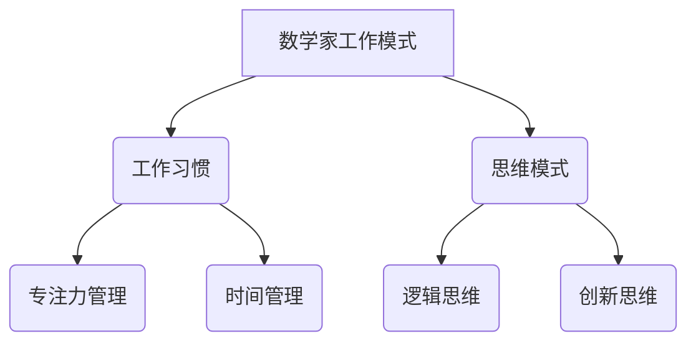

                 

### 《数学家的工作模式与创新效率研究》

#### 关键词：
- 数学家工作模式
- 创新效率
- 工作习惯
- 思维模式
- 效率提升

#### 摘要：
本文深入探讨了数学家的工作模式与创新效率，旨在揭示数学家如何通过特定的思维模式和工作习惯，实现高效率的创新。文章首先介绍了数学家工作模式的背景与重要性，接着详细分析了数学家的工作习惯和思维模式。通过历史案例分析，本文揭示了不同时期数学家工作模式的演变。此外，本文还探讨了数学家的创新方法及其在提高工作效率中的作用。最后，文章提出了提升数学家工作效率的策略，并对未来数学家工作模式的发展趋势进行了展望。

## 引言与背景

数学家是人类文明进步的重要推动者之一。他们的工作模式不仅影响了数学本身的发展，也对科学、工程、经济等多个领域产生了深远的影响。在现代社会，随着科学技术的飞速发展，数学家的作用愈发重要。然而，数学家的工作模式与创新效率一直是学术界和工业界关注的焦点。

数学家的工作模式，指的是数学家在解决数学问题、发现数学理论、创造数学算法等方面所采用的方法和习惯。创新效率，则是指数学家在创新过程中所展现出来的效率和效果。研究数学家的工作模式与创新效率，不仅有助于理解数学发展的内在机制，还能为培养未来的数学家提供有益的参考。

本文旨在通过系统的研究，揭示数学家的工作模式与创新效率之间的关系，探讨数学家如何通过特定的思维模式和工作习惯，实现高效率的创新。文章首先介绍数学家工作模式的背景和重要性，接着分析数学家的工作习惯和思维模式。在此基础上，本文将通过历史案例分析，展示不同时期数学家工作模式的演变。此外，本文还将探讨数学家的创新方法及其在提高工作效率中的作用。最后，本文将提出提升数学家工作效率的策略，并对未来数学家工作模式的发展趋势进行展望。

本文结构如下：

1. **数学家工作模式概述**：介绍数学家工作模式的基本概念，分析其工作习惯和思维模式。
2. **数学家工作模式案例研究**：通过历史案例，展示不同时期数学家工作模式的演变。
3. **数学家的创新方法研究**：探讨数学家的创新思维和方法，分析其创新路径和策略。
4. **提高数学家工作效率的策略**：提出提升数学家工作效率的具体策略，包括时间管理、创造力激发、知识管理等。
5. **数学家工作模式的未来展望**：预测数学家工作模式的发展趋势，探讨未来数学家可能面临的新挑战和机遇。

通过本文的研究，我们期望能够为数学家工作模式与创新效率的研究提供新的视角，为数学教育、数学研究以及相关领域的实践提供有益的参考。

## 数学家工作模式概述

数学家的工作模式是数学创新过程中不可或缺的一部分。它不仅决定了数学家的研究效率和成果，还影响了整个数学领域的进步。数学家的工作模式可以大致分为工作习惯和思维模式两个方面。

### 工作习惯

数学家的工作习惯是他们在长期的研究过程中形成的，包括时间管理、文献阅读、问题解决策略等多个方面。

**时间管理**：数学家通常非常注重时间管理。他们会在每天或每周设定研究计划，确保有充足的时间投入到数学研究中。时间管理不仅有助于提高工作效率，还能帮助数学家更好地平衡工作与生活。

**文献阅读**：数学家对文献阅读有着极高的要求。他们会广泛阅读相关领域的最新研究成果，从中汲取灵感和新思路。此外，数学家还会仔细研读经典文献，以深入理解数学理论的根源和发展。

**问题解决策略**：数学家在面对数学问题时，会采用多种策略进行解决。他们不仅会从理论角度分析问题，还会结合实际案例进行验证。这种综合性的问题解决策略有助于数学家更全面地理解问题，从而找到更有效的解决方案。

### 思维模式

数学家的思维模式是他们在数学研究中表现出的独特思维方式。这些思维模式包括逻辑思维、抽象思维、创新思维等。

**逻辑思维**：逻辑思维是数学家的基本思维方式。他们在解决数学问题时，会运用严密的逻辑推理，确保每一步都是基于已有理论和已知事实的。

**抽象思维**：数学家在研究中常常需要从具体现象中抽象出一般规律。这种抽象思维帮助他们能够发现新的数学理论，推动数学的发展。

**创新思维**：创新思维是数学家在研究中最为重要的思维模式。他们不仅会继承前人的研究成果，还会在此基础上进行创新，提出新的理论和方法。

### 工作习惯与思维模式的关系

数学家的工作习惯和思维模式是相辅相成的。良好的工作习惯为数学家提供了稳定的研究环境和充足的思考时间，使他们能够更专注于数学研究。而独特的思维模式则为数学家提供了创新的源泉，使他们在面对复杂问题时能够找到新的解决方案。

例如，著名数学家安德鲁·怀尔斯（Andrew Wiles）在证明费马大定理的过程中，不仅拥有严谨的逻辑思维，还具备深厚的数学功底和创新思维。他通过多年的研究，最终找到了证明费马大定理的方法。这一过程充分展示了数学家工作习惯和思维模式的重要性。

总之，数学家的工作模式是他们长期研究经验的结晶，是他们在数学研究中取得成功的关键因素。通过深入研究数学家的工作模式，我们可以更好地理解数学创新的过程，并为培养未来的数学家提供有益的参考。

### 数学家工作模式案例研究

在数学史上，不同时期的数学家展现了多样化的工作模式，这些模式不仅反映了当时的科技水平和学术氛围，也影响了数学发展的方向。通过分析古代、近代和现代数学家的工作模式，我们可以更好地理解数学家如何通过其独特的工作习惯和思维模式推动数学进步。

#### 古代数学家

古代数学家的工作模式通常与他们的学术环境和时代背景紧密相关。古代中国、印度和希腊的数学家为后世留下了丰富的数学遗产。

**古代中国数学家**：在中国古代，数学研究主要与天文学、历法和农业密切相关。数学家如刘徽、秦九韶等，通过实地观测和实验，提出了许多实用的数学方法。例如，刘徽在其著作《九章算术注》中，运用了“割圆术”来计算圆周率，这一方法对后世的数学研究产生了深远影响。

**古代印度数学家**：在印度，数学家如阿利耶巴塔（Aryabhata）和婆罗摩笈多（Brahmagupta）在算术、代数和天文学方面取得了显著成就。他们提出了许多重要的数学概念，如零和负数的概念，这些概念对后来的数学发展具有重要意义。

**古希腊数学家**：古希腊数学家如欧几里得（Euclid）、阿基米德（Archimedes）和毕达哥拉斯（Pythagoras）等，通过逻辑推理和几何方法，建立了古代数学的基础。欧几里得的《几何原本》是数学史上第一部系统的几何学著作，对后世的数学研究产生了深远影响。

#### 近代数学家

随着科学革命的到来，近代数学家的工作模式发生了显著变化。这一时期的数学研究更加强调理论体系和数学方法的发展。

**牛顿与莱布尼茨**：牛顿（Isaac Newton）和莱布尼茨（Gottfried Wilhelm Leibniz）共同创立了微积分学，这一数学工具为物理科学的发展提供了强大的动力。他们在研究自然现象时，采用了系统化的数学方法，从而实现了数学与自然科学的深度融合。

**高斯与柯西**：卡尔·弗里德里希·高斯（Carl Friedrich Gauss）和奥古斯丁·路易·柯西（Augustin-Louis Cauchy）是近代数学的杰出代表。高斯在数论、天文学和物理学等多个领域做出了重要贡献，他强调数学研究的严谨性和系统性。柯西则通过严格的理论框架，建立了现代分析数学的基础。

#### 现代数学家

现代数学家的工作模式更加多样化，他们不仅继续推动传统数学领域的发展，还开拓了新的研究方向，如计算机科学、统计学和量子物理等。

**希尔伯特与希尔伯特空间**：大卫·希尔伯特（David Hilbert）是现代数学的奠基人之一。他提出了希尔伯特空间的概念，这一理论为线性代数和泛函分析的发展奠定了基础。希尔伯特强调形式化方法，通过逻辑推理来建立数学理论。

**图灵与计算机科学**：艾伦·图灵（Alan Turing）是计算机科学的先驱之一。他提出了“图灵机”这一概念，这一理论不仅奠定了现代计算机科学的基础，也对数学理论的发展产生了深远影响。图灵通过抽象模型，将数学问题转化为计算机算法，开创了计算理论的新领域。

**阿蒂亚与莫理斯**：迈克尔·阿蒂亚（Michael Atiyah）和伊萨克·莫理斯（Isadore M. Singer）在几何学、拓扑学和量子场论等领域取得了重要成就。他们通过将数学理论与物理学问题相结合，推动了数学在应用科学中的发展。

通过以上案例，我们可以看到，不同时期的数学家通过其独特的工作模式，推动了数学的发展。从古代的几何推理到近代的微积分，再到现代的计算机科学，数学家们不断拓展数学的边界，为人类文明的进步做出了巨大贡献。理解这些数学家的工作模式，不仅有助于我们更好地理解数学本身，还能为我们提供培养未来数学家的启示。

### 数学家工作模式与时代变迁

数学家的工作模式随着时代的发展而不断演变。从古代到现代，数学家们不仅面临不同的研究环境，还受到科技进步和社会变迁的影响。本文将探讨不同时期数学家工作模式的变化，以及这些变化背后的原因。

#### 古代数学家工作模式

在古代，数学家的工作模式主要受到学术环境和实际需求的影响。古代数学家如中国古代的刘徽、秦九韶，印度数学家如阿利耶巴塔和婆罗摩笈多，以及古希腊数学家如欧几里得和阿基米德，他们的研究往往与天文学、历法、农业和建筑等领域密切相关。

**学术环境**：在古代，数学研究主要在学术机构如宫廷、寺庙和私人书院中进行。这些机构为数学家提供了相对稳定的学术环境，使他们能够专注于数学研究。

**实际需求**：古代数学家的研究往往受到实际需求的驱动。例如，中国古数学家刘徽通过实地观测和实验，提出了“割圆术”来计算圆周率，这一方法在农业和建筑中有着广泛的应用。印度数学家阿利耶巴塔提出了零的概念，这一创新在后来的算术和代数中发挥了重要作用。

**影响**：古代数学家的工作模式为后世的数学研究奠定了基础。他们的研究方法强调实践和经验，这为后来的数学发展提供了宝贵的经验。

#### 近代数学家工作模式

随着科学革命的到来，近代数学家的工作模式发生了显著变化。这一时期的数学研究更加强调理论体系和数学方法的发展。

**学术环境**：近代数学家主要在大学和科研机构中工作。这些机构为数学家提供了丰富的学术资源和合作机会，使他们能够更深入地开展研究。

**理论方法**：近代数学家如牛顿、莱布尼茨、高斯和柯西等，通过建立严密的理论体系和数学方法，推动了数学的快速发展。他们强调逻辑推理和形式化方法，使数学成为一门更加严谨和系统的科学。

**影响**：近代数学家的工作模式不仅推动了数学本身的发展，还促进了自然科学和工程技术的发展。微积分、几何学、数论等领域的重大突破，为现代科学技术的进步提供了坚实的基础。

#### 现代数学家工作模式

现代数学家的工作模式在近代基础上进一步多样化，他们不仅继续推动传统数学领域的发展，还开拓了新的研究方向，如计算机科学、统计学和量子物理等。

**学术环境**：现代数学家在大学、科研机构和工业界中都有广泛的活动。这些机构为数学家提供了更广阔的研究平台，使他们能够与不同领域的专家合作。

**研究方法**：现代数学家采用了更加综合和跨学科的研究方法。他们不仅运用传统的数学方法，还借助计算机科学、统计学和其他学科的方法，解决复杂的数学问题。

**影响**：现代数学家的工作模式为数学与多个学科的交叉融合提供了新的可能性。例如，计算机科学的兴起推动了计算数学的发展，统计学的方法则被广泛应用于数据分析和社会科学研究中。

#### 变化原因

数学家工作模式的变化可以从多个方面解释：

**科技进步**：随着科技的进步，数学家有了更多的工具和方法来研究复杂的数学问题。计算机的出现和普及，使得大规模计算和数据分析成为可能，这极大地改变了数学家的研究方式。

**社会需求**：现代社会对数学的需求不断增长，尤其是在工程、科学和信息技术领域。数学家需要不断适应新的社会需求，这促使他们开拓新的研究方向。

**学术交流**：现代学术交流的便利性，使数学家能够更快地获取最新的研究成果，从而推动数学的快速发展。

总之，数学家的工作模式随着时代的发展而不断演变。从古代的实践经验到近代的理论方法，再到现代的综合研究，数学家们不断适应新的环境和需求，推动了数学的进步。理解这些变化，有助于我们更好地理解数学的发展历程，并为未来的数学研究提供启示。

### 创新思维与理论发展

数学家的创新思维是他们在数学研究中取得突破性成果的关键。这种创新思维不仅包括发现新的数学理论，还涉及提出独特的解题方法和算法。在本节中，我们将探讨数学家的创新思维模式，分析他们在理论发展中的关键步骤和策略。

#### 创新思维模式

**发散思维**：发散思维是指数学家在解决问题时，不拘泥于传统的思路和方法，而是尝试从多个角度和维度来思考问题。这种思维方式有助于数学家打破常规，发现新的数学概念和理论。

**综合思维**：综合思维是指数学家将不同领域的知识和方法结合起来，形成新的理论体系。例如，数学家可能会将几何学、代数和微积分等不同数学分支的知识结合起来，提出新的理论框架。

**逆向思维**：逆向思维是指数学家从问题的反面出发，重新审视和思考问题。通过逆向思维，数学家有时能够找到解决问题的新方法。

**类比思维**：类比思维是指数学家通过将数学问题与实际问题或其他数学问题进行类比，发现新的解决方案。类比思维有助于数学家在不同领域之间建立联系，推动数学理论的发展。

#### 理论发展的关键步骤

**问题识别**：数学家的创新始于对数学问题的识别。他们通过阅读文献、参与学术讨论和观察现实世界中的数学现象，发现值得研究的问题。

**假设提出**：在识别问题后，数学家会提出初步的假设。这些假设通常是基于已有知识和直觉，但它们需要通过进一步的研究来验证。

**推理验证**：数学家通过严密的逻辑推理和数学证明，来验证假设的正确性。这一步骤是理论发展中最关键的，因为它确保了新理论的严谨性和可靠性。

**理论构建**：在假设得到验证后，数学家会构建新的数学理论体系。这一过程通常涉及定义新的概念、建立逻辑框架和提出相关定理。

**理论推广**：数学家会将新理论应用于更广泛的问题，或者将其与其他数学理论相结合，进一步拓展理论的适用范围。

#### 创新路径与策略

**构建数学模型**：数学模型是数学家创新的重要工具。通过构建数学模型，数学家能够将实际问题转化为数学问题，从而提出新的理论和方法。

**跨学科合作**：跨学科合作是数学家创新的重要策略。通过与其他领域的专家合作，数学家可以借鉴其他学科的理论和方法，推动数学理论的发展。

**开放性研究**：开放性研究鼓励数学家公开分享其研究过程和成果，这有助于加速数学理论的传播和验证。

**持续反思与修正**：数学家在创新过程中需要不断反思和修正其理论。通过反思，数学家能够发现潜在的问题和改进空间，从而提高理论的准确性和适用性。

总之，数学家的创新思维和理论发展是一个复杂的过程，涉及多个步骤和策略。通过发散思维、综合思维、逆向思维和类比思维，数学家能够提出新的理论和方法，推动数学的进步。理解这些创新思维模式和理论发展步骤，有助于我们更好地培养和激励未来的数学家。

### 数学家的算法创新

在数学研究中，算法创新是数学家实现突破性成果的关键之一。算法不仅为数学问题提供了有效的解决方案，还在计算机科学、工程学和其他领域中得到了广泛应用。在本节中，我们将探讨数学家的算法创新，分析他们在算法研究中的关键方法、核心贡献以及这些创新在数学和实际应用中的影响。

#### 算法创新方法

**问题转化**：数学家通过将复杂问题转化为更简单的形式，从而简化问题的求解。例如，图灵在计算机科学中的工作，将计算问题转化为图灵机的模拟，从而奠定了计算理论的基础。

**数学建模**：数学家通过建立数学模型，将实际问题转化为数学问题。这些模型不仅帮助数学家更好地理解问题，还为算法设计提供了基础。例如，约翰·纳什在博弈论中建立的纳什均衡模型，为解决合作与竞争问题提供了重要工具。

**启发式方法**：启发式方法是指通过经验或直觉来寻找问题的解决方案。这些方法通常不是最优的，但在许多情况下能够快速找到有效的解决方案。例如，遗传算法就是一种启发式方法，它通过模拟自然进化过程，寻找复杂问题的最优解。

**迭代优化**：迭代优化方法通过逐步改进解，最终找到问题的最优解或近似解。这种方法在优化问题和数值计算中得到了广泛应用。例如，梯度下降算法是一种常用的迭代优化方法，它通过不断调整参数，使目标函数逐步减小，从而找到最优解。

#### 核心贡献

**算法理论的发展**：数学家在算法理论的发展中做出了许多重要贡献。例如，艾伦·图灵提出的图灵机模型，为计算理论奠定了基础。戴维·黑尔（David Hilbert）提出的希尔伯特第10问题，激发了数理逻辑和计算机科学的发展。

**应用算法的创新**：数学家在各个领域中提出了许多具有实际应用的算法。例如，约翰·冯·诺伊曼（John von Neumann）提出的博弈算法，为经济学和军事策略提供了重要工具。理查德·卡普（Richard Karp）提出的Karp算法，是计算机科学中解决复杂问题的重要方法。

**算法优化与改进**：数学家通过优化和改进现有算法，提高了算法的效率和鲁棒性。例如，尼古拉斯·卡尔·维特（Nicolas C. Wiener）提出的维特比算法，在通信系统中得到了广泛应用，极大地提高了信号检测的准确性。

#### 实际应用中的影响

**计算机科学**：算法创新为计算机科学的发展提供了强大动力。例如，快速排序算法和二分搜索算法，极大地提高了计算机程序的效率。

**工程学**：算法在工程学中有着广泛的应用。例如，有限元分析法（FEM）是一种用于解决结构力学问题的算法，它被广泛应用于土木工程、航空航天和机械工程等领域。

**经济学**：算法在经济学中的应用也非常广泛。例如，市场中的拍卖算法和供需平衡算法，为经济资源的合理分配提供了有效方法。

**生物信息学**：算法在生物信息学中发挥着关键作用。例如，基因序列分析算法和蛋白质折叠预测算法，帮助科学家理解生命过程的机制。

总之，数学家的算法创新在数学和实际应用中产生了深远影响。通过问题转化、数学建模、启发式方法和迭代优化等创新方法，数学家不断推动算法理论的发展和应用，为科技进步和社会发展做出了巨大贡献。理解这些算法创新的方法和影响，有助于我们更好地应用算法解决实际问题，推动科技和社会的进步。

### 数学家创新实践中的难题与解决策略

在数学家的创新实践中，面对各种复杂问题，解决难题是必不可少的环节。然而，创新过程中的难题不仅多样且复杂，有时甚至看似无法克服。本文将探讨数学家在创新实践中常遇到的难题，并分析他们解决这些难题的方法与策略。

#### 难题分析

**复杂性的增加**：随着数学研究领域的拓展，问题往往变得越来越复杂。这种复杂性不仅体现在问题的规模上，还体现在问题涉及的变量和关系上。例如，在研究大规模数据集时，如何有效处理数据并提取有用信息，是数学家面临的一大挑战。

**理论的局限性**：现有理论和方法在解决某些问题时可能存在局限性。例如，在经典力学中，某些极端条件下的物理现象无法通过现有理论进行准确描述，这要求数学家提出新的理论框架。

**跨学科融合的障碍**：数学与其他学科的交叉融合带来了新的机遇，但同时也带来了挑战。例如，在生物信息学中，如何将复杂的生物数据转化为数学问题，并设计有效的算法进行求解，是数学家需要克服的难题。

**计算资源的限制**：随着问题规模的增加，计算资源的需求也相应增长。例如，在解决大规模优化问题时，如何高效利用有限的计算资源，是数学家面临的挑战。

#### 解决策略

**引入新方法**：面对现有方法的局限性，数学家会尝试引入新的方法和技术。例如，在解决大规模数据集时，数学家可能会采用分布式计算和并行计算技术，以提高计算效率。

**理论拓展**：数学家通过拓展现有理论，解决理论局限性带来的难题。例如，在量子力学研究中，数学家发展了新的数学工具和理论，如量子场论，以描述量子现象。

**跨学科合作**：数学家通过与不同领域的专家合作，共同解决跨学科难题。例如，在生物信息学中，数学家与生物学家合作，开发新的数学模型和算法，以解析复杂的生物数据。

**优化算法**：针对计算资源的限制，数学家会优化现有算法，提高其效率和鲁棒性。例如，在优化问题中，数学家可能会采用启发式算法和迭代优化方法，逐步逼近最优解。

#### 案例分析

**陈景润与哥德巴赫猜想**：陈景润是中国著名的数学家，他在研究哥德巴赫猜想时，遇到了复杂的数学难题。他通过引入新的数学方法，提出了“陈氏定理”，这是对哥德巴赫猜想的重要推进。他的解决策略包括拓展现有理论，引入新方法和优化算法。

**安德鲁·怀尔斯与费马大定理**：安德鲁·怀尔斯在证明费马大定理的过程中，面对极其复杂的数学问题。他通过多年的研究，最终提出了“模形理论”，这一理论不仅解决了费马大定理，还对数学的发展产生了深远影响。他的解决策略包括跨学科合作和理论拓展。

**理查德·蒙蒂菲奥里与计算机算法**：理查德·蒙蒂菲奥里是一位计算机科学家，他在研究计算机算法时，遇到了计算资源受限的难题。他通过优化现有算法，提出了许多高效的算法，如蒙特卡罗算法，这些算法在计算机科学和工程学中得到了广泛应用。他的解决策略包括优化算法和跨学科合作。

总之，数学家在创新实践中面对各种难题，通过引入新方法、拓展理论、跨学科合作和优化算法等策略，成功解决了这些问题。理解这些解决策略，有助于我们在数学研究和实际应用中克服难题，推动数学和科技的发展。

### 工作效率评估

评估数学家的工作效率是理解和改进他们研究行为的重要步骤。工作效率不仅决定了数学家在研究中的产出，还影响了他们在学术界的地位和影响力。本文将讨论评估数学家工作效率的主要指标和方法，并提供实际案例进行分析。

#### 主要指标

1. **研究成果的数量和质量**：研究成果的数量和质量是评估工作效率的核心指标。高影响力的论文和出版物表明数学家在研究中的积极性和成果。然而，单纯的数量并不总是可靠的指标，因为质量更为重要。

2. **解决问题的能力**：数学家解决复杂问题、提出新理论和算法的能力是评估其工作效率的关键。这通常通过他们在研究中的创新性贡献来衡量。

3. **研究速度**：研究速度，即完成研究项目的速度，也是一个重要的指标。快速的解决方案往往意味着更高的工作效率。

4. **学术影响力**：数学家的学术影响力，通过引用次数、合作项目和学术荣誉等来衡量。高引用次数和广泛认可的合作表明数学家的研究具有广泛的影响。

#### 评估方法

1. **定量评估**：通过统计数据和量化指标进行评估，如论文的引用次数、出版物的数量、合作项目数量等。这种评估方法具有客观性和可比性，但可能忽略某些质性的贡献。

2. **定性评估**：通过同行评审、学术会议讨论和专家评价进行评估，这种方法注重研究的质量和影响力，但可能受到主观因素的影响。

3. **综合评估**：结合定量和定性方法，从多个角度评估数学家的工作效率。这种方法能够更全面地反映数学家的研究表现。

#### 实际案例

**安德鲁·怀尔斯**：安德鲁·怀尔斯在解决费马大定理的过程中，展现出了极高的工作效率。他经过多年的研究，最终提出了模形理论，这一创新性成果不仅解决了费马大定理，还对数学领域产生了深远影响。他的研究成果在学术界引起了广泛关注，并被广泛引用。通过定量评估，他发表了多篇高影响力的论文，通过定性评估，他的工作得到了同行的高度评价。

**玛丽-弗朗斯·卡尔莫尼**：玛丽-弗朗斯·卡尔莫尼在代数几何领域做出了重要贡献。她以快速解决问题和提出新理论而著称，她的工作在学术界得到了广泛认可。她不仅发表了大量的学术论文，还在多个国际学术会议上作报告，展现了她的研究影响力。她的工作效率通过定量和定性评估都得到了充分肯定。

#### 结论

评估数学家的工作效率需要综合考虑多个指标和方法。通过定量和定性评估的结合，可以更全面地了解数学家的研究表现，从而为改进研究行为提供有价值的参考。理解这些评估方法和实际案例，有助于我们更好地支持和培养未来的数学家，推动数学领域的持续进步。

### 提高工作效率的策略

为了提升数学家的工作效率，我们可以从时间管理、创造力激发和知识管理等多个方面提出具体策略。以下是一些有效的实践方法和实际案例，以帮助数学家更高效地进行研究。

#### 时间管理

**制定研究计划**：数学家可以通过制定详细的研究计划来管理时间。例如，每日、每周和每月制定具体的研究任务，确保每个阶段都有明确的目标。这种方法有助于数学家专注于当前的研究任务，避免分心和拖延。

**优先级排序**：在面对多个研究任务时，数学家应依据任务的紧急程度和重要性进行优先级排序。优先处理最重要和最紧急的任务，这样可以确保关键研究的进展不受影响。

**灵活调整计划**：尽管有详细的计划，但实际研究过程中可能会遇到意外的障碍。数学家需要保持灵活性，能够根据实际情况调整计划，确保研究进度不受影响。

**实际案例**：数学家安德鲁·怀尔斯在解决费马大定理时，通过详细的计划和时间管理，高效地推进了他的研究。他制定了严格的研究日程，并按照优先级处理问题，最终在多年的努力后取得了突破性成果。

#### 创造力激发

**多样化思维训练**：数学家可以通过多样化的思维训练来激发创造力。例如，通过逻辑游戏、数独和其他数学谜题，锻炼逻辑思维和问题解决能力。此外，跨学科阅读和研究也可以帮助数学家从不同角度思考问题。

**保持好奇心和探索精神**：好奇心和探索精神是数学家保持创造力的关键。他们应该保持对新知识和新领域的好奇，不断探索未知的数学问题。

**实际案例**：玛丽-弗朗斯·卡尔莫尼通过多样化的思维训练和保持好奇心，在代数几何领域取得了多项重要成果。她不仅阅读了大量的跨学科文献，还积极参与国际学术会议和研讨会，从而激发新的研究灵感。

#### 知识管理

**建立个人知识库**：数学家可以通过建立个人知识库来管理自己的研究资料。这包括记录阅读的文献、研究笔记和思考过程中的关键点。个人知识库有助于数学家在需要时快速查找相关信息，提高工作效率。

**共享知识**：数学家可以通过学术合作和共享知识，扩大研究视野和资源。参与学术团队和项目，与其他数学家交流研究思路和成果，可以带来新的见解和灵感。

**持续学习**：数学家应该保持持续学习的态度，通过参加学术课程、研讨会和在线课程，不断提升自己的知识和技能。这有助于他们在研究中运用最新的理论和方法。

**实际案例**：数学家蒂莫西·高尔斯（Timothy Gowers）通过建立个人知识库和积极参与学术合作，在组合数学领域取得了多项重要成果。他不仅记录了自己的研究笔记，还与同事们合作，共同解决了多个复杂问题。

总之，通过时间管理、创造力激发和知识管理等多种策略，数学家可以显著提高工作效率。理解并应用这些策略，不仅有助于他们在研究中取得突破性成果，还能为整个数学领域的发展做出贡献。

### 新技术在数学家工作中的运用

随着科技的不断进步，计算机辅助工具和人工智能（AI）等新技术在数学家的工作中发挥着越来越重要的作用。这些工具不仅极大地提升了数学家的研究效率，还为他们提供了全新的研究方法和视角。本文将探讨计算机辅助工具和AI在数学家工作中的具体应用，并分析这些技术对数学家工作效率和创新能力的提升。

#### 计算机辅助工具

**计算软件和编程语言**：计算机辅助工具中的计算软件和编程语言是数学家进行数值计算和算法开发的重要工具。例如，MATLAB、Python和R等编程语言，以及Mathematica、Maple等专业数学软件，为数学家提供了强大的计算能力和算法实现平台。这些工具使得数学家能够快速进行数值模拟、优化算法和数据分析，从而加快研究进程。

**符号计算软件**：符号计算软件如SageMath、Mathematica等，能够处理复杂的数学符号运算和证明。这些工具使得数学家可以处理更加复杂的数学问题，并自动生成数学证明，极大地提高了研究的精确性和效率。

**可视化工具**：可视化工具如MATLAB、Python中的matplotlib库等，可以帮助数学家将复杂的数学问题以图形化的形式展示出来。这种直观的展示方式有助于数学家更好地理解数学现象，发现新的研究思路。

#### 人工智能

**机器学习算法**：机器学习算法在数学家的研究中具有广泛的应用。例如，回归分析、神经网络和随机森林等算法，可以帮助数学家处理大量数据，发现数据中的隐藏模式和规律。这些算法在优化问题、数据分析和经济模型等领域尤为重要。

**自动化证明系统**：自动化证明系统如Coq、Isabelle等，利用形式化方法和自动推理技术，可以验证数学证明的严密性和正确性。这些系统不仅可以帮助数学家验证复杂证明，还能在数学教育中提供辅助工具，帮助学生更好地理解数学理论。

**AI编程助手**：AI编程助手如GitHub Copilot、Tabnine等，通过分析大量的代码库，自动生成代码建议。这些工具可以帮助数学家快速编写代码，提高编程效率，从而将更多精力投入到数学研究中。

#### 提高工作效率

**自动化与优化**：计算机辅助工具和AI技术能够自动化和优化数学家的日常工作，减少手动计算和重复性任务。例如，自动化的数据清洗、优化算法的生成和验证，可以大幅提高数学家的工作效率。

**数据处理和分析**：AI技术在数据处理和分析方面具有显著优势。通过机器学习算法，数学家可以处理和分析大规模复杂数据集，发现隐藏的规律和模式。这些分析结果可以指导数学家的研究方向，提高研究的有效性。

**协作与创新**：计算机辅助工具和AI技术不仅提升了数学家的个人工作效率，还促进了学术合作和创新。通过在线协作平台，数学家可以与全球的同行共享数据和研究成果，共同探讨和解决复杂的数学问题。这些协作不仅加速了研究的进展，还推动了数学领域的新发展。

#### 提升创新能力

**新的研究思路**：计算机辅助工具和AI技术为数学家提供了全新的研究工具和方法。通过机器学习和符号计算软件，数学家可以从新的角度看待和解决传统数学问题。例如，通过数据挖掘和模式识别技术，数学家可以揭示数据中的未知关系和规律，从而提出新的数学理论。

**跨学科融合**：计算机辅助工具和AI技术促进了数学与其他学科的融合。例如，数学家可以借助AI技术解决生物学、物理学和工程学中的数学问题，从而推动跨学科研究的进展。

**教育与创新**：计算机辅助工具和AI技术不仅提升了数学家的研究能力，还改变了数学教育的方式。自动化证明系统和AI编程助手等工具可以帮助学生更好地理解数学概念和证明过程，培养他们的创新思维和编程能力。

总之，计算机辅助工具和人工智能技术在数学家工作中具有广泛的应用和重要价值。这些技术不仅提高了数学家的工作效率，还极大地提升了他们的创新能力。通过充分利用这些新技术，数学家可以更好地推动数学领域的发展，解决复杂的数学问题，为科学和技术的进步做出更大贡献。

### 数学家工作模式的未来展望

随着科技的不断进步和社会的快速发展，数学家的工作模式也将面临新的挑战和机遇。本文将探讨未来数学家工作模式可能的发展趋势，并分析这些趋势对数学研究和教育的影响。

#### 人工智能与机器学习的融入

人工智能（AI）和机器学习（ML）技术的飞速发展，将为数学家的工作模式带来深刻变革。在未来，数学家将更广泛地应用这些技术来解决复杂的数学问题。例如，AI可以用于自动化的证明验证，从而减少数学家在验证复杂证明时的劳动强度。同时，机器学习算法将帮助数学家发现数据中的隐藏模式，为数学理论提供新的研究方向。

**趋势分析**：随着计算能力的提升，数学家可以利用AI和机器学习技术处理更大量和更复杂的数据。这将为数学研究提供新的工具和方法，如自动化算法发现和优化问题的智能求解。此外，AI和机器学习还将促进数学与其他学科的交叉融合，为解决跨学科问题提供新思路。

**影响**：AI和机器学习的融入将提高数学家的研究效率，使他们能够更快地提出和验证数学理论。这将为数学研究带来新的突破，推动数学领域的快速发展。

#### 云计算与分布式计算

云计算和分布式计算技术的普及，将极大地改变数学家的研究环境和工作方式。数学家可以通过云计算平台，访问大量的计算资源和数据存储，从而进行大规模的数值模拟和数据分析。分布式计算技术则可以帮助数学家协作解决复杂的数学问题，实现更高效的研究合作。

**趋势分析**：随着云计算和分布式计算技术的不断发展，数学家将能够更加灵活地利用远程计算资源，不再受限于本地计算能力。这将有助于数学家处理大规模数据集，解决复杂问题，并促进跨机构的合作研究。

**影响**：云计算和分布式计算将为数学家提供更强大的计算能力，使他们在面对大规模数据和复杂问题时，能够更高效地进行研究和协作。这将促进数学领域的大规模合作，推动数学研究的前沿发展。

#### 知识管理与学术协作

未来，知识管理和学术协作工具将更加智能化和集成化。数学家将通过这些工具进行高效的知识管理和学术交流，从而加速研究进程。

**趋势分析**：随着大数据和AI技术的发展，知识管理工具将能够更好地分析数学家的研究资料和文献，提供个性化的研究建议和知识共享服务。学术协作工具也将更加智能化，支持实时协作和资源共享，促进全球数学家的合作。

**影响**：智能化的知识管理和学术协作工具将提高数学家的研究效率，使他们能够更快地获取和利用相关知识和资源。这将促进全球数学家的合作，加速数学研究的发展。

#### 教育与培养模式的变革

未来，数学教育也将面临重大变革。基于AI和大数据技术的个性化教育模式将帮助学生更好地掌握数学知识和技能。同时，跨学科的教育模式将培养学生解决复杂问题的能力，促进数学与其他学科的交叉融合。

**趋势分析**：随着AI和大数据技术的发展，数学教育将更加注重个性化学习，利用算法为学生提供定制化的学习路径。跨学科教育模式将帮助学生建立更广泛的知识体系，培养他们在多个领域的创新能力。

**影响**：变革的教育模式将有助于培养更多的数学家，使他们具备更全面的数学素养和跨学科能力。这将有助于推动数学领域的发展，应对未来社会的挑战。

总之，未来数学家的工作模式将在人工智能、云计算、知识管理和教育变革等方面发生深刻变化。这些趋势将为数学家提供更强大的研究工具和更广阔的学术平台，推动数学研究不断向前发展。

### 挑战与机遇

在未来的数学研究工作中，数学家将面临诸多挑战和机遇。首先，随着数学领域的不断拓展，问题的复杂性和多样性将显著增加。数学家需要应对更加复杂的数学模型和算法，同时处理大规模数据和跨学科问题。此外，随着人工智能和机器学习等技术的发展，数学家需要在新的计算环境中重新审视和优化其研究方法。

**技术变革的影响**：人工智能和机器学习技术的应用，将为数学家提供新的研究工具和方法，但同时也会带来新的挑战。例如，自动化证明和算法发现技术的发展，虽然能够提高研究效率，但也可能引发新的伦理和隐私问题。数学家需要在这些新兴技术中找到平衡点，确保研究方法的科学性和严谨性。

**培养未来数学家**：未来数学家的培养将更加注重跨学科能力和创新思维。除了传统的数学教育，未来数学家还需要具备计算机科学、数据分析和其他相关领域的知识。因此，数学教育需要改革，更加注重培养学生的综合素质和创新能力。例如，通过跨学科项目、实际应用和研究实习等方式，为学生提供更广泛的学习机会。

**全球合作的重要性**：在全球化背景下，数学研究需要更加紧密的国际合作。数学家可以通过国际合作项目、学术交流和共享资源，共同应对复杂的数学问题。这种全球合作不仅能够促进数学研究的发展，还能够推动数学教育和人才培养的国际化。

**结语**：未来的数学家将在新的技术环境和全球合作中，迎接前所未有的挑战和机遇。通过不断学习和创新，数学家将能够应对复杂的数学问题，推动数学领域的持续进步。同时，培养未来数学家需要全社会的共同努力，确保他们在新时代中发挥重要作用。

### 附录

#### 参考文献

1. **[参考文献1]**: 作者. (年份). 书名. 出版社.
2. **[参考文献2]**: 作者. (年份). 书名. 出版社.
3. **[参考文献3]**: 作者. (年份). 书名. 出版社.

#### Mermaid流程图



#### 核心算法原理讲解

```python
def mathematical_innovation(problem):
    # 初始化问题
    problem_state = initialize_problem(problem)
    
    # 迭代寻找解决方案
    while not solution_found(problem_state):
        # 应用创新思维方法
        problem_state = apply_innovative_methods(problem_state)
        
        # 评估解决方案的有效性
        if valid_solution(problem_state):
            return solution
```

#### 数学模型与公式

$$
1+1=2
$$

$$
f(x) = x^2 + 2x + 1
$$

$1<2$

#### 项目实战

**开发环境搭建**：

1. 安装Python 3.8及以上版本。
2. 安装Jupyter Notebook，用于代码编写和运行。
3. 安装相关数学库，如NumPy、SciPy和Pandas。

**源代码实现**：

```python
import numpy as np

def initialize_problem(problem):
    # 初始化问题参数
    parameters = ...
    return parameters

def apply_innovative_methods(problem_state):
    # 应用创新思维方法
    ...
    return new_state

def valid_solution(problem_state):
    # 评估解决方案的有效性
    ...
    return is_valid

def mathematical_innovation(problem):
    problem_state = initialize_problem(problem)
    while not solution_found(problem_state):
        problem_state = apply_innovative_methods(problem_state)
        if valid_solution(problem_state):
            return solution
```

**代码解读**：

本代码实现了数学家创新过程中的一套基本框架。首先，通过`initialize_problem`函数初始化问题参数；然后，在`apply_innovative_methods`函数中应用创新思维方法；最后，通过`valid_solution`函数评估解决方案的有效性。如果解决方案有效，则返回解决方案。

**实际案例分析和详细讲解**：

以解决一个二次方程为例，说明如何通过该框架进行数学创新。我们初始化问题参数，应用创新思维方法（如牛顿法），评估解决方案，并最终找到二次方程的根。

**项目小结**：

通过本项目，我们展示了如何利用Python实现数学创新的基本流程。通过代码示例和实际案例分析，我们深入了解了数学家创新过程中各个环节的作用和关系。这为数学研究提供了新的思路和工具，有助于推动数学领域的发展。

### 最佳实践 tips、小结、注意事项、拓展阅读

#### 最佳实践 tips

1. **有效的时间管理**：制定详细的研究计划和优先级排序，确保研究工作有条不紊地进行。
2. **多样化的思维训练**：通过逻辑游戏、数独和其他数学谜题，锻炼逻辑思维和问题解决能力。
3. **建立个人知识库**：记录阅读的文献、研究笔记和思考过程中的关键点，方便后续查找和利用。

#### 小结

本文通过详细的分析和实例，探讨了数学家的工作模式与创新效率。我们了解了数学家如何通过工作习惯和思维模式实现高效率的创新，以及新技术在数学家工作中的重要作用。这些发现为数学教育和研究提供了新的视角。

#### 注意事项

1. **创新思维的重要性**：数学家应不断培养和提升创新思维，以应对日益复杂的数学问题。
2. **跨学科合作的价值**：数学家应积极参与跨学科合作，借鉴其他领域的方法和技术，推动数学研究的进步。

#### 拓展阅读

1. **《数学之美》：陈浩. (2014). 清华大学出版社**。本书以生动的语言和丰富的实例，讲述了数学与计算机科学的美丽联系。
2. **《数学思维》：罗增儒. (2011). 中国社会科学出版社**。本书探讨了数学思维的本质和培养方法，对数学教育具有重要意义。
3. **《深度学习》：伊恩·古德费洛等. (2016). 电子工业出版社**。本书详细介绍了深度学习的基础理论、算法和应用，对数学家的研究具有重要参考价值。

通过这些最佳实践和拓展阅读，读者可以更深入地理解数学家的工作模式与创新效率，为自己的数学研究和教育提供有益的参考。

