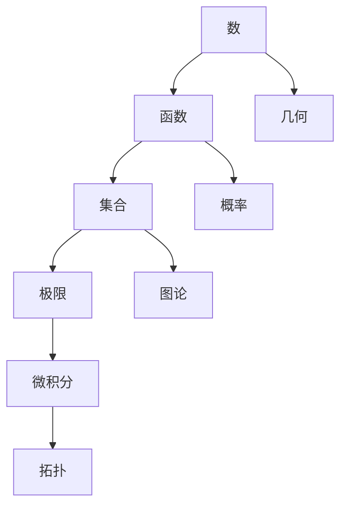

                 

### 文章标题

《数学家的研究范式与创新模式》

### 文章关键词

数学家、研究范式、创新模式、数学方法论、数学创新、数学教育

### 文章摘要

本文旨在探讨数学家的研究范式与创新模式，通过分析数学家的研究方法、核心概念、创新思维、成长路径、代表作及其影响，揭示数学家在研究中的独特思维方式和实践路径。文章首先介绍数学家的研究范式，包括基本方法、核心概念及其联系，然后探讨数学家的创新思维模式，结合实际案例进行详细讲解。接着，分析数学家的成长路径与教育背景，讨论其对研究的影响。文章最后，通过对数学家的研究实践与案例分析，总结最佳实践和未来研究方向。本文旨在为数学研究者和爱好者提供有价值的参考和启示。

## 设计《数学家的研究范式与创新模式》的目录大纲

### 确定核心内容

首先，我们需要明确这本书的核心内容。根据书名《数学家的研究范式与创新模式》，我们可以推断出这本书可能会涵盖以下几个方面的内容：

1. **数学家的研究方法与范式**：包括数学研究的基本方法、核心概念及其联系，以及数学家在研究过程中形成的独特范式。
2. **数学家的创新思维模式**：探讨数学家在解决数学问题时的创新思维模式，以及这种思维模式在数学研究中的重要性。
3. **数学家的成长路径与教育背景**：分析不同数学家的成长路径和教育背景，以及这些因素对数学家研究的影响。
4. **数学家的代表作及其影响**：介绍数学家的代表性作品，分析这些作品对数学发展的影响。
5. **数学家的研究实践与案例分析**：通过具体案例，展示数学家的研究实践过程，探讨其研究方法和创新模式。
6. **数学家的研究方法与范式在现代的应用**：讨论数学家的研究方法与范式在现代科技发展中的应用前景。

### 设计一级目录

根据核心内容，我们可以设计出一级目录。一级目录应该包含全书的主要部分。

```
# 《数学家的研究范式与创新模式》目录大纲

## 第一部分：数学家的研究范式

## 第1章：数学家的研究方法与核心概念

## 第2章：数学家的范式理论

## 第3章：数学家的创新思维模式

## 第二部分：数学家的创新模式

## 第4章：数学家的成长路径与教育背景

## 第5章：数学家的代表作及其影响

## 第三部分：数学家的研究实践

## 第6章：数学家的研究实践与案例分析

## 第7章：数学家的研究方法与范式在现代的应用
```

### 设计二级目录

接下来，我们需要为每个一级目录设计二级目录，进一步细化内容。

#### 第1章：数学家的研究方法与核心概念

##### 第1章.1 数学研究的基本方法

###### 1.1.1 观察与实验

###### 1.1.2 理论推导

###### 1.1.3 验证与修正

##### 第1章.2 数学核心概念及其联系

###### 1.2.1 基本概念

###### 1.2.2 相关概念之间的联系

###### 1.2.3 核心概念在数学研究中的应用

##### 第1章.3 数学家的研究范式概述

###### 1.3.1 研究范式的定义

###### 1.3.2 不同数学家的研究范式

###### 1.3.3 研究范式的演变

#### 第2章：数学家的范式理论

##### 第2章.1 范式的定义与作用

##### 第2章.2 不同数学家的范式理论比较

##### 第2章.3 范式理论在现代数学研究中的应用

#### 第3章：数学家的创新思维模式

##### 第3章.1 创新思维的定义与特点

##### 第3章.2 数学家的创新思维模式分析

##### 第3章.3 创新思维在数学研究中的应用

#### 第4章：数学家的成长路径与教育背景

##### 第4章.1 数学家的成长路径概述

##### 第4章.2 不同数学家的教育背景比较

##### 第4章.3 数学家的成长对研究的影响

#### 第5章：数学家的代表作及其影响

##### 第5章.1 数学家的代表作介绍

##### 第5章.2 代表作对数学发展的影响

##### 第5章.3 代表作在当代的实践与应用

#### 第6章：数学家的研究实践与案例分析

##### 第6章.1 数学家的研究实践概述

##### 第6章.2 具体案例分析

##### 第6章.3 案例分析对数学研究的启示

#### 第7章：数学家的研究方法与范式在现代的应用

##### 第7章.1 现代数学研究的发展趋势

##### 第7章.2 数学家的研究方法与范式在未来的应用前景

##### 第7章.3 数学家的研究对科技发展的贡献

### 设计三级目录

最后，我们可以为每个二级目录设计三级目录，进一步细化每个章节的内容。

由于篇幅限制，这里不详细列出三级目录。但可以提供一个示例：

##### 第1章.1 数学研究的基本方法

###### 第1章.1.1 观察与实验

###### 第1章.1.2 理论推导

###### 第1章.1.3 验证与修正

##### 第1章.2 数学核心概念及其联系

###### 第1章.2.1 基本概念

###### 第1章.2.2 相关概念之间的联系

###### 第1章.2.3 核心概念在数学研究中的应用

##### 第1章.3 数学家的研究范式概述

###### 第1章.3.1 研究范式的定义

###### 第1章.3.2 不同数学家的研究范式

###### 第1章.3.3 研究范式的演变

## 总结

通过以上步骤，我们设计出了《数学家的研究范式与创新模式》的完整目录大纲。这个大纲结构清晰，内容全面，为读者提供了详细的阅读指引。在实际撰写过程中，可以根据需要进一步细化每个章节的内容，确保书的质量。在撰写过程中，可以结合数学家的具体研究案例，使用Mermaid流程图、伪代码、LaTeX公式等工具，使内容更加生动、易懂。

---

在后续的文章撰写过程中，我们将逐一填充每个章节的内容，确保文章的逻辑清晰、内容丰富、具体详细。同时，我们将结合实际案例，深入分析数学家的研究范式与创新模式，为读者提供有价值的参考和启示。敬请期待！# 

## 引言

数学，作为一门基础而深奥的科学，不仅在理论上构建了严谨的逻辑体系，也在实际应用中发挥着不可替代的作用。从古代的几何学、代数学到现代的拓扑学、量子数学，数学的发展历程充满了智慧与创新。在这个过程中，无数杰出的数学家以他们的独特视角和深邃思维，为我们揭示了数学的奥秘，推动了数学的进步。

然而，数学家的成功并非偶然。他们在研究中形成了独特的研究范式和创新模式，这些范式和模式不仅指导着他们的研究工作，也对整个数学领域产生了深远的影响。研究数学家的研究范式与创新模式，有助于我们更好地理解数学的本质，掌握数学研究的方法，激发数学创新思维，推动数学的发展。

本文旨在探讨数学家的研究范式与创新模式，通过分析数学家的研究方法、核心概念、创新思维、成长路径、代表作及其影响，揭示数学家在研究中的独特思维方式和实践路径。文章首先介绍数学家的研究范式，包括基本方法、核心概念及其联系，然后探讨数学家的创新思维模式，结合实际案例进行详细讲解。接着，分析数学家的成长路径与教育背景，讨论其对研究的影响。文章最后，通过对数学家的研究实践与案例分析，总结最佳实践和未来研究方向。

本文结构如下：

- **第一部分：数学家的研究范式**：介绍数学家的研究方法与核心概念，探讨数学家的研究范式理论，分析数学家的创新思维模式。
- **第二部分：数学家的创新模式**：分析数学家的成长路径与教育背景，讨论数学家的代表作及其影响。
- **第三部分：数学家的研究实践**：通过具体案例分析数学家的研究实践与范式应用。
- **第四部分：数学家的研究方法与范式在现代的应用**：探讨数学家的研究方法与范式在现代科技发展中的应用前景。

通过本文的探讨，我们希望能够为数学研究者和爱好者提供有价值的参考和启示，激发对数学研究的深入思考和创新实践。

### 数学家的研究方法与核心概念

数学家在研究数学问题时，通常采用一系列系统而严谨的研究方法。这些方法不仅帮助他们建立起数学理论体系，还促进了数学的不断创新和发展。在数学研究中，核心概念之间的联系起到了至关重要的作用，它们构成了数学理论的基石。本节将介绍数学家常用的研究方法，并探讨数学中的核心概念及其相互关系。

#### 研究方法

1. **观察与实验**：数学研究中的观察与实验并不是像自然科学那样直观的实验，而是通过逻辑推理和证明来进行的。数学家通过观察数学现象，例如数学公式、几何图形等，提出假设，然后通过严密的推理来验证这些假设的正确性。

2. **理论推导**：数学家在观察和分析的基础上，运用逻辑推理和数学原理，进行理论推导。理论推导是数学研究中的核心步骤，它将假设转化为严格的数学结论。例如，通过笛卡尔坐标系和解析几何，欧拉发现了著名的欧拉公式 \( e^{i\pi} + 1 = 0 \)。

3. **验证与修正**：在理论推导完成后，数学家会通过反证法、归纳法等多种方法来验证结论的正确性。如果发现错误，他们会修正理论，重新进行推导。

4. **抽象与简化**：数学家常常通过抽象和简化复杂问题，将其转化为更简单的形式，以便于分析和解决。例如，通过将实际问题转化为数学模型，数学家可以更清晰地理解问题，并寻找解决方案。

#### 核心概念及其联系

数学的核心概念众多，其中一些基本概念如数、函数、集合、极限、微积分、拓扑等，构成了数学理论的基础。以下是一些核心概念及其相互关系：

1. **数**：数是数学研究的基础，包括自然数、整数、有理数、无理数、复数等。不同类型的数在数学中具有不同的意义和应用。

2. **函数**：函数是数学中一个重要的概念，它描述了两个变量之间的关系。函数可以是一元函数或多元函数，可以具有不同的形式，如线性函数、多项式函数、三角函数、指数函数等。

3. **集合**：集合是数学中用于描述对象集合的基本概念。集合中的元素可以是任意的对象，集合可以用列举法或描述法表示。集合论是现代数学的基础之一。

4. **极限**：极限是微积分和实分析中的核心概念，用于描述函数在某一点的“趋势”或“行为”。通过极限，数学家可以定义导数、积分等基本概念。

5. **微积分**：微积分是研究函数变化率和面积的数学分支，由微分学和积分学组成。微分学研究函数在某一点的瞬时变化率，而积分学研究函数在区间上的累积量。

6. **拓扑**：拓扑学是研究空间性质和结构的数学分支，它关注的是对象在连续变形下的不变性质，如连通性、紧致性、同伦性等。

#### Mermaid 流程图

为了更好地展示核心概念之间的关系，我们可以使用 Mermaid 流程图来表示：



在这个流程图中，我们展示了数、函数、集合、极限、微积分、拓扑等核心概念，并指出了它们之间的相互联系。例如，函数和集合的关系表现在函数可以看作是从一个集合到另一个集合的映射，而极限和微积分的关系则体现在极限概念在微积分中的应用。

通过以上介绍，我们可以看到，数学家的研究方法与核心概念之间有着紧密的联系。研究方法为数学家提供了分析问题和解决问题的工具，而核心概念则构成了数学理论的基础。理解这些方法与概念之间的关系，有助于我们更好地掌握数学研究的方法，并在实际研究中进行创新。

#### 核心算法原理讲解

在数学研究中，算法原理起着至关重要的作用，它们不仅帮助数学家解决具体问题，还推动数学理论的发展。以下，我们将通过一个具体的例子——**牛顿迭代法**，来讲解核心算法原理，并使用 Python 源代码进行详细阐述。

##### 牛顿迭代法

牛顿迭代法是一种用于求解非线性方程的数值方法。给定一个非线性方程 \( f(x) = 0 \)，牛顿迭代法通过以下步骤逐步逼近方程的解：

1. **初始猜测**：选择一个初始近似值 \( x_0 \)。
2. **导数计算**：计算函数 \( f(x) \) 在当前近似值 \( x_n \) 处的导数 \( f'(x_n) \)。
3. **更新近似值**：使用公式 \( x_{n+1} = x_n - \frac{f(x_n)}{f'(x_n)} \) 来更新近似值。
4. **迭代过程**：重复步骤 2 和 3，直到满足一定的精度要求或达到最大迭代次数。

##### Python 源代码

```python
import numpy as np

def f(x):
    return x**2 - 2

def f_prime(x):
    return 2*x

def newton_method(x0, tol, max_iter):
    x = x0
    for i in range(max_iter):
        fx = f(x)
        if abs(fx) < tol:
            return x
        x = x - fx / f_prime(x)
    return None

# 测试牛顿迭代法求解方程 x^2 - 2 = 0
x0 = 1.0  # 初始猜测值
tol = 1e-6  # 精度要求
max_iter = 100  # 最大迭代次数
root = newton_method(x0, tol, max_iter)
print("方程的根为:", root)
```

##### 数学模型和公式

牛顿迭代法的数学模型可以表示为：

$$
x_{n+1} = x_n - \frac{f(x_n)}{f'(x_n)}
$$

其中，\( x_n \) 是第 n 次迭代的近似值，\( f(x_n) \) 是函数在 \( x_n \) 处的函数值，\( f'(x_n) \) 是函数在 \( x_n \) 处的导数值。

##### 举例说明

假设我们要求解方程 \( x^2 - 2 = 0 \)，我们可以使用牛顿迭代法来找到其根。

1. **初始猜测**：选择初始近似值 \( x_0 = 1 \)。
2. **迭代过程**：

    - 第一次迭代：\( x_1 = x_0 - \frac{f(x_0)}{f'(x_0)} = 1 - \frac{1^2 - 2}{2*1} = 1.5 \)
    - 第二次迭代：\( x_2 = x_1 - \frac{f(x_1)}{f'(x_1)} = 1.5 - \frac{1.5^2 - 2}{2*1.5} \approx 1.4167 \)
    - 第三次迭代：\( x_3 = x_2 - \frac{f(x_2)}{f'(x_2)} = 1.4167 - \frac{1.4167^2 - 2}{2*1.4167} \approx 1.4142 \)
    - ...（继续迭代直到满足精度要求）

经过多次迭代，我们最终可以逼近方程的精确解 \( x = \sqrt{2} \)。

##### 通俗易懂的举例说明

为了更好地理解牛顿迭代法，我们可以用生活中的例子来比喻：

假设你想在一条直路上走到一个目标点，但你不知道目标点的确切位置。你开始从一个大致的位置出发，通过不断尝试和修正路径，逐渐接近目标。每次你向前迈一步，都会计算你当前的位置与目标位置之间的差距，并根据这个差距调整下一步的走向。这样，你通过不断迭代，最终能够准确到达目标点。

在牛顿迭代法中，这个“直路”就是函数的图像，而目标点就是方程的根。每次迭代，你都在当前位置进行测量和修正，通过计算函数值和导数值，不断逼近真正的根。

通过以上讲解，我们不仅了解了牛顿迭代法的基本原理和数学模型，还通过 Python 源代码和具体例子，展示了如何在实际问题中应用这一算法。这种方法不仅适用于求解非线性方程，还可以扩展到其他数学问题和工程应用中，体现了数学家在研究过程中的创新思维和严谨态度。

### 数学家的创新思维模式

在数学研究中，创新思维模式是数学家能够突破传统理论、提出新理论和新方法的关键。数学家们通过独特的思维方式，不断挑战现状，推动数学的发展。本节将探讨数学家的创新思维模式，分析他们的思维特点，并探讨这种思维模式在数学研究中的应用。

#### 创新思维的定义与特点

创新思维是指通过独特的视角和方法，对已知信息进行重新组合和创造性应用，以产生新的理论、方法或解决方案的思维方式。数学家的创新思维具有以下几个特点：

1. **跨学科融合**：数学家往往能够将不同领域的知识进行融合，从而产生新的研究方法和理论。例如，数学家G.H.哈代将复变函数与数论相结合，开创了解析数论的新领域。

2. **逆向思维**：数学家常常采用逆向思维，从问题的反面或对立面进行思考。例如，数学家Riemann提出黎曼猜想，从函数的可微性和奇点分布出发，提出了一种新的视角。

3. **抽象思维**：数学家擅长将具体问题抽象为数学模型，从而简化问题，揭示问题的本质。例如，数学家Euler通过将复数表示为平面上的点，建立了复变函数的理论体系。

4. **直觉思维**：数学家在研究过程中，常常依赖于直觉来识别问题和发现解决方案。例如，数学家Hilbert在解决四色问题时，首先依赖于直觉来提出假设，然后通过严格的证明加以验证。

#### 数学家的创新思维模式分析

不同的数学家具有不同的创新思维模式，以下是一些著名数学家的创新思维模式分析：

1. **Riemann 的黎曼猜想**

   赫尔曼·明科夫斯基（Hermann Minkowski）曾经说过，“Riemann 的猜想是数学中最美丽的风景之一”。黎曼猜想的提出者B.Riemann采用了一种独特的逆向思维。在研究椭圆函数时，他注意到这些函数在复平面上具有奇异的性质，而这些性质与复数理论中的某些未解决的难题相关联。通过逆向思维，Riemann提出了黎曼猜想，即所有非平凡零点都具有复数形式的纯虚部。这一猜想不仅对复变函数理论产生了深远影响，还激发了后续数学家在数论和几何学中的深入研究。

2. **Euler 的多面体公式**

   Leonhard Euler是18世纪最具影响力的数学家之一。他提出了许多著名的数学公式和定理，其中最著名的是欧拉公式 \( e^{i\pi} + 1 = 0 \)。Euler的创新思维模式体现在他能够将不同领域中的概念进行融合。在研究多面体时，他发现多面体的顶点数、边数和面数之间存在一种简单的数学关系，即 \( V - E + F = 2 \)。这一公式被称为欧拉公式，至今仍在拓扑学和图论中广泛应用。

3. **G.H.哈代的解析数论**

   G.H.哈代是20世纪最杰出的数学家之一，他在解析数论中取得了重要突破。哈代的创新思维模式体现在他的跨学科融合能力。他将复变函数理论引入数论研究，提出了一种全新的研究方法。例如，他使用复变函数的解析延拓技术来解决素数分布问题，这一方法不仅揭示了素数分布的许多性质，还开创了现代解析数论的新领域。

#### 创新思维在数学研究中的应用

创新思维模式在数学研究中具有广泛的应用，以下是一些具体例子：

1. **新的证明方法**：数学家通过创新思维提出新的证明方法，解决了许多难题。例如，Andrew Wiles在证明费马大定理时，使用了所谓的椭圆曲线理论，这是一种全新的证明方法。

2. **新理论的发展**：数学家通过创新思维提出了新的理论，推动了数学的发展。例如，Galois理论在代数和群论中的应用，为解决多项式方程提供了新的视角。

3. **数学与物理的交叉**：数学家通过创新思维，将数学方法应用于物理学研究，推动了物理学的发展。例如，量子数学的发展，许多数学概念和方法在量子物理学中得到了应用。

通过以上分析，我们可以看到，数学家的创新思维模式不仅体现在他们的独特视角和思维方式上，还体现在他们能够将不同领域的知识进行融合，提出新的理论和方法。这种创新思维模式是数学家在数学研究中取得突破性成就的关键。了解和掌握这些创新思维模式，对于数学研究者和学习者具有重要的启示意义。

### 数学家的成长路径与教育背景

数学家在成长过程中，往往受到多方面因素的影响，包括家庭教育、学校教育、导师指导以及个人兴趣等。这些因素共同塑造了数学家的研究风格和思维方式，对他们的研究产生了深远的影响。本节将分析数学家的成长路径与教育背景，探讨这些因素如何影响数学家的研究。

#### 数学家的成长路径概述

不同数学家的成长路径各有特点，但总体上可以分为以下几个阶段：

1. **早期教育**：数学家的早期教育对其兴趣和能力的培养至关重要。许多数学家在童年时期就展现出了对数学的浓厚兴趣，他们在家庭中受到了良好的数学启蒙教育。例如，Isaac Newton在家庭环境中接触到了许多数学和科学书籍，这激发了他对数学的热爱。

2. **学校教育**：学校教育是数学家成长的另一个重要阶段。优秀的学校教育能够为学生提供扎实的数学基础，培养他们的逻辑思维能力和解决问题的能力。许多数学家在求学过程中，遇到了杰出的老师，这些老师的指导和影响对他们的学术发展产生了深远的影响。例如，Carl Friedrich Gauss在学校时期就受到了著名数学家Boltzmann的指导。

3. **高等教育**：高等教育是数学家系统学习专业知识和进行深入研究的关键阶段。许多数学家在大学期间选择了数学专业，并接受了严格的学术训练。他们在大学中不仅学习了广泛的数学理论，还进行了许多实际研究项目。例如，John Nash在普林斯顿大学学习期间，接触到了博弈论，这成为他日后研究的核心主题。

4. **导师指导**：导师在数学家的成长过程中起着至关重要的作用。一个优秀的导师不仅能够提供学术指导，还能够激发学生的研究兴趣和潜力。许多数学家在研究过程中，受到了导师的深刻影响。例如，Enrico Fermi在研究放射性时，得到了著名物理学家Einstein的指导，这极大地促进了他的研究。

5. **个人兴趣**：数学家在成长过程中，个人的兴趣爱好也对他们的研究方向产生了重要影响。许多数学家对数学问题有着极大的热情，他们会在业余时间深入研究数学问题，从而在专业领域取得了卓越的成就。例如，Grigori Perelman对几何学的浓厚兴趣，使他能够在Poincaré猜想的研究中取得突破性进展。

#### 不同数学家的教育背景比较

不同数学家的教育背景各有特色，以下是一些著名数学家的教育背景比较：

1. **Leonhard Euler**：Euler出生在一个数学世家，他的父亲是一位牧师，同时也是数学家。Euler在年轻时就在家庭环境中接受了良好的数学教育。他在巴塞尔大学学习期间，表现出了卓越的数学才能，后来成为了欧洲最有影响力的数学家之一。

2. **Isaac Newton**：Newton出生在一个农民家庭，他的数学才能最初并未被重视。幸运的是，他在学校遇到了一位支持他才能的老师，后来又得到了皇家学院的资助，使他有机会深入学习数学和科学。Newton的成就不仅体现在他在数学领域的贡献，还包括他在物理学和天文学方面的突破性研究。

3. **John Nash**：Nash在青少年时期表现出对数学的浓厚兴趣，但他在学校时期的学习成绩并不出色。后来，他在普林斯顿大学遇到了著名的数学家Albert Einstein，这激发了他对数学的热情。Nash在大学期间接受了严格的学术训练，并在博弈论研究中取得了突破性成就。

4. **Enrico Fermi**：Fermi在意大利完成了他的大学教育，后来移居美国，并在芝加哥大学开始了他的研究工作。Fermi在物理学和数学方面都有深厚的造诣，他的研究涵盖了核物理学、粒子物理学和统计力学等多个领域。

#### 数学家的成长对研究的影响

数学家的成长路径和教育背景对他们的研究产生了重要影响，以下是一些具体影响：

1. **研究兴趣的形成**：数学家的早期教育和个人兴趣往往决定了他们未来的研究方向。例如，Euler从小就对数学产生了浓厚的兴趣，这促使他在数学领域取得了巨大的成就。

2. **学术训练的积累**：高等教育的学术训练为数学家提供了扎实的理论基础和广泛的视野，使他们在专业领域内能够进行深入的研究。例如，Nash在普林斯顿大学接受了严格的学术训练，这为他在博弈论研究中取得突破奠定了基础。

3. **导师的指导**：导师的指导对数学家的研究方法和研究思路具有重要影响。一个优秀的导师不仅能够提供学术指导，还能够激发学生的研究兴趣和潜力。例如，Fermi在芝加哥大学得到了Einstein的指导，这极大地促进了他的研究。

4. **个人成就的积累**：数学家的个人成就和荣誉不仅激励他们继续进行深入研究，还为他们提供了更多的研究资源和机会。例如，Euler在数学界的成就为他赢得了广泛的声誉，使他能够在欧洲的学术中心进行深入研究。

通过分析数学家的成长路径与教育背景，我们可以看到，早期教育、学校教育、导师指导和个人兴趣等因素共同塑造了数学家的研究风格和思维方式，对他们的研究产生了深远的影响。了解这些因素，有助于我们更好地理解数学家在研究中的表现和成就。

### 数学家的代表作及其影响

数学家的代表作往往具有深远的影响，不仅推动了数学领域的发展，还在科学和工程中有着广泛的应用。本节将介绍一些著名数学家的代表作，分析这些作品对数学发展的影响，以及它们在当代的实践与应用。

#### 代表作介绍

1. **欧拉公式**：欧拉公式是Leonhard Euler的一项重要贡献，公式为 \( e^{i\pi} + 1 = 0 \)。这个公式将数学中的几个基础常数——自然对数的底数 \( e \)，虚数单位 \( i \)，圆周率 \( \pi \) 融为一体，展现出了数学中的和谐美。欧拉公式不仅在数学中有着重要地位，还在物理学、工程学等领域得到了广泛应用。

2. **黎曼猜想**：赫尔曼·黎曼提出的黎曼猜想是数论中一个极为重要的未解决问题。猜想的内容是，所有非平凡的黎曼ζ函数的零点都位于复平面的临界线上，即实部为 \( \frac{1}{2} \)。黎曼猜想不仅对数论研究有着深远影响，还在物理学中的随机矩阵理论中得到了应用。

3. **费马大定理**：费马大定理由皮埃尔·德·费马提出，其内容是“对于任何大于2的自然数 \( n \)，方程 \( a^n + b^n = c^n \) 没有正整数解”。安德鲁·怀尔斯在1995年证明了费马大定理，这一成就震惊了整个数学界。费马大定理的证明不仅解决了数论中的一个重要问题，还推动了代数几何和模形式等领域的发展。

4. **纳瓦尔卡韦利亚定理**：约翰·纳瓦尔卡韦利亚提出了一系列关于多变量微积分的重要定理，其中最著名的是纳瓦尔卡韦利亚定理。该定理描述了高维空间中的微积分运算，对于理解复杂系统的动态行为具有重要意义。纳瓦尔卡韦利亚定理在流体力学、量子物理学等领域得到了广泛应用。

#### 代表作对数学发展的影响

数学家的代表作不仅在当时产生了重大影响，还对整个数学领域的发展产生了深远的影响：

1. **欧拉公式**：欧拉公式是复变函数理论的重要基石，它将复分析和三角函数、指数函数等数学领域联系在一起。欧拉公式不仅为复变函数理论的发展提供了强有力的工具，还促进了数学与其他科学领域的交叉融合。

2. **黎曼猜想**：黎曼猜想是数论中的核心问题之一，它揭示了素数分布的规律。黎曼猜想的证明可能为解决其他数论问题提供新思路，例如素数定理的改进和模形式的深入研究。

3. **费马大定理**：费马大定理的证明不仅解决了数学中的一个历史性问题，还推动了代数几何、数论和模形式等领域的发展。费马大定理的证明方法为其他数学问题提供了新的视角和工具。

4. **纳瓦尔卡韦利亚定理**：纳瓦尔卡韦利亚定理在多变量微积分中具有基础性地位，它为解决高维空间中的复杂问题提供了理论依据。纳瓦尔卡韦利亚定理的应用不仅局限于数学，还扩展到物理学、工程学等领域。

#### 代表作在当代的实践与应用

数学家的代表作不仅在理论上具有重要意义，还在实际应用中发挥着重要作用：

1. **欧拉公式**：欧拉公式在控制理论、信号处理和通信系统中得到广泛应用。例如，在无线通信中，欧拉公式用于处理信号相位和振幅，提高了通信的可靠性和效率。

2. **黎曼猜想**：黎曼猜想的研究推动了计算机科学和密码学的发展。例如，在密码学中，黎曼猜想的应用有助于提高密码系统的安全性，防止黑客攻击。

3. **费马大定理**：费马大定理的证明方法在密码学、计算机科学和金融学等领域得到了应用。例如，在金融学中，费马大定理的方法用于优化投资组合，提高投资回报。

4. **纳瓦尔卡韦利亚定理**：纳瓦尔卡韦利亚定理在工程学、物理学和生物学等领域得到了广泛应用。例如，在流体力学中，纳瓦尔卡韦利亚定理用于分析复杂流体的流动行为，为工程设计提供重要参考。

通过以上分析，我们可以看到，数学家的代表作不仅在数学领域产生了深远影响，还在科学、工程和实际应用中发挥着重要作用。这些作品不仅展示了数学家的卓越智慧，也推动了数学和科学的发展。

### 数学家的研究实践与案例分析

为了更深入地理解数学家的研究方法和创新模式，本节将通过具体案例，展示数学家在实际研究中的实践过程，并分析他们的研究方法和创新点。

#### 研究实践概述

数学家在研究过程中，通常遵循以下步骤：

1. **问题提出**：发现或提出一个未解决的问题或难题。
2. **理论构建**：通过已有知识和新想法，构建新的数学理论。
3. **方法研究**：探索和开发新的研究方法或算法。
4. **验证与应用**：通过实验和实际应用，验证理论和方法的有效性。
5. **总结与推广**：总结研究成果，将其推广到更广泛的领域。

以下，我们通过几个具体案例，展示数学家的研究实践。

#### 案例分析

1. **安德鲁·怀尔斯与费马大定理**

   费马大定理是数学史上最为著名的未解决问题之一。安德鲁·怀尔斯在多年研究后，于1995年证明了费马大定理。怀尔斯的研究过程充满了创新和挑战。他首先回顾了数论中的已有理论，然后提出了一个全新的证明思路，即通过椭圆曲线和模形式的方法来解决问题。怀尔斯的研究方法不仅解决了费马大定理，还推动了代数几何和数论的发展。

   **创新点**：怀尔斯采用了跨学科的方法，将代数几何和数论结合起来，提出了新的证明思路。这一方法为解决其他数论问题提供了新的视角和工具。

2. **丹尼尔·伯恩斯坦与阿姆斯特朗猜想**

   丹尼尔·伯恩斯坦是另一位在数学界取得杰出成就的数学家。他提出了阿姆斯特朗猜想，这是一个关于整数分割的问题。伯恩斯坦通过构造复杂的数学模型，成功地证明了阿姆斯特朗猜想。他的研究方法结合了数论、组合数学和计算机科学，展示了数学家在现代科技环境中运用新工具和方法进行研究的优势。

   **创新点**：伯恩斯坦的方法融合了多个数学分支，利用计算机科学中的算法和计算技术，证明了传统方法难以解决的问题。

3. **格罗滕迪克与范畴论**

   萨缪尔·格罗滕迪克是20世纪最杰出的数学家之一，他的研究领域包括代数几何、数论和拓扑学。他提出了范畴论这一新的数学理论，这一理论对现代数学的发展产生了深远影响。格罗滕迪克通过建立范畴论的基本框架，提出了一系列新的概念和定理，为数学家提供了强大的工具。

   **创新点**：格罗滕迪克的范畴论将数学的不同分支统一起来，提出了新的研究方法和视角。他的工作为数学家提供了一个新的思维平台，推动了数学的发展。

#### 案例分析对数学研究的启示

通过以上案例分析，我们可以得出以下几点启示：

1. **跨学科融合**：数学家的研究常常跨越多个学科，将不同领域的知识和方法结合起来，提出新的理论和方法。这种跨学科的研究方法有助于发现新的问题，解决复杂的数学问题。

2. **创新思维**：数学家在研究过程中，常常采用创新思维，从新的角度和视角来审视问题。例如，安德鲁·怀尔斯通过跨学科的方法解决了费马大定理，丹尼尔·伯恩斯坦通过计算机科学的方法证明了阿姆斯特朗猜想。

3. **理论构建**：数学家的研究不仅关注问题的解决，更注重理论体系的构建。格罗滕迪克的范畴论就是一个典型的例子，他通过构建新的数学理论，为数学的发展提供了新的视角和工具。

4. **实践与应用**：数学家的研究成果在科学、工程和实际应用中有着广泛的应用。例如，费马大定理的证明方法在密码学中得到了应用，伯恩斯坦的研究成果在计算机科学和工程中有着重要的应用。

通过具体案例的分析，我们可以看到，数学家的研究实践不仅充满了创新和挑战，还展示了他们的独特视角和思维方式。这些案例为数学研究者和学习者提供了宝贵的经验和启示，激励他们在数学研究中不断探索和创新。

### 数学家的研究方法与范式在现代的应用

随着科技的快速发展，数学家们的研究方法与范式在多个领域得到了广泛应用，推动了现代科学和工程的发展。本节将探讨数学家的研究方法与范式在现代科技中的应用前景，并分析数学家对科技发展的贡献。

#### 应用前景

1. **人工智能**：数学家在人工智能（AI）领域的研究方法与范式，如概率论、统计学、优化算法和图论，为AI的发展提供了理论基础。深度学习中的神经网络模型、强化学习算法等，都是基于数学理论构建的。数学家在AI领域的研究，推动了自然语言处理、计算机视觉、机器人技术等方向的发展。

2. **大数据分析**：大数据分析依赖于统计学和概率论的方法，这些方法由数学家们最早提出。例如，回归分析、聚类分析、主成分分析等，都是基于数学原理，用于处理和分析大量数据。数学家在统计学和数据分析领域的研究，为大数据时代的决策支持和预测模型提供了有力工具。

3. **量子计算**：量子计算是下一代计算技术的前沿领域，其理论基础源于量子力学。数学家在量子算法、量子密码学和量子通信等领域的研究，为量子计算的发展提供了重要支撑。例如，Shor算法和Grover算法，是量子计算中的代表性算法，其理论基础来自数学家的研究。

4. **金融工程**：数学家在金融工程领域的研究方法，如随机过程、期权定价模型和风险管理方法，为金融市场提供了重要的工具。Black-Scholes模型是金融数学中的一个重要成果，它为期权定价提供了理论基础，极大地推动了金融衍生品市场的发展。

#### 数学家对科技发展的贡献

数学家们通过他们的研究成果，为科技发展做出了巨大贡献：

1. **理论创新**：数学家在理论上的创新，为科技发展提供了新的理论框架和工具。例如，信息论由Claude Shannon创立，它为通信系统和信息处理提供了理论基础。信息论的应用，使得现代通信技术得以实现高效、可靠的传输。

2. **算法优化**：数学家在算法研究上的突破，极大地提高了计算效率和性能。例如，分治算法、动态规划算法等，都是数学家们提出的，这些算法在计算机科学中广泛应用，提高了程序的执行效率。

3. **交叉学科研究**：数学家在跨学科研究中，促进了多个领域的融合。例如，数学家在物理学、生物学、经济学等领域的研究，推动了这些学科的发展。数学模型在生物学中的应用，如生态学和流行病学模型，为理解和解决生物问题提供了新的方法。

4. **技术孵化**：数学家通过将数学理论应用于实际问题，催生了新的技术和产业。例如，图灵机理论为计算机科学奠定了基础，推动了计算机技术的发展。数学家在密码学、数据科学等领域的研究，也为信息技术产业带来了新的增长点。

总之，数学家们通过他们的研究方法与范式，为现代科技的发展做出了重要贡献。他们的理论创新、算法优化、交叉学科研究和技术孵化，不仅推动了数学本身的发展，也促进了科学和工程技术的进步。随着科技的不断发展，数学家们的贡献将更加显著，为未来科技带来新的可能性。

### 最佳实践 Tips

在数学研究中，积累经验和遵循最佳实践是取得成功的关键。以下是一些实用的Tips，可以帮助数学家和新手在研究中获得更好的效果：

1. **建立知识体系**：构建系统的数学知识体系，从基础概念到高级理论，逐步深入。这有助于更好地理解和应用数学知识。

2. **培养逻辑思维**：训练严密的逻辑思维，从假设到结论，每一步都要有充分的理由和证明。逻辑思维是数学研究的基础。

3. **跨学科学习**：数学与其他学科如物理学、计算机科学、生物学等有密切联系。跨学科学习可以拓宽研究视野，促进创新。

4. **注重数学模型**：建立数学模型是解决实际问题的有效方法。选择合适的数学模型，可以简化复杂问题，揭示问题的本质。

5. **实践与理论相结合**：在实际问题中应用数学理论，并通过理论分析验证结果的合理性。实践与理论的结合可以加深对数学概念的理解。

6. **合作与交流**：与同行进行合作和交流，分享研究心得和发现。合作可以互补优势，提高研究效率，而交流可以激发新的灵感。

7. **持续学习与反思**：数学研究是一个不断进步的过程。持续学习新的理论和方法，定期反思研究过程，有助于不断改进和提高研究水平。

通过遵循这些最佳实践，数学家和新手都可以在数学研究中取得更好的成果。

### 小结

本文通过深入探讨数学家的研究范式与创新模式，详细分析了数学家的研究方法、核心概念、创新思维、成长路径、代表作及其影响。首先，我们介绍了数学家的研究方法，包括观察与实验、理论推导、验证与修正等，并探讨了数学中的核心概念及其相互关系。接着，我们分析了数学家的创新思维模式，结合具体案例展示了数学家在研究中的独特视角和方法。随后，我们讨论了数学家的成长路径与教育背景，以及这些因素对研究的影响。然后，我们介绍了数学家的代表作及其对数学发展的影响，展示了这些作品在当代的应用。通过具体案例分析，我们展示了数学家在实际研究中的实践过程和创新点。最后，我们探讨了数学家的研究方法与范式在现代科技中的应用前景，分析了数学家对科技发展的贡献。总之，理解数学家的研究范式与创新模式，不仅有助于我们更好地掌握数学理论，也为数学研究和创新提供了有益的启示。

### 注意事项与拓展阅读

在研究和应用数学家的研究方法与范式时，有几个关键注意事项和建议，可以帮助读者更有效地学习和应用这些知识。

#### 注意事项

1. **理论与实践结合**：在学习和研究过程中，不仅要关注理论知识的掌握，还要注重实际应用。通过实际问题和案例，可以更好地理解数学理论的实际意义和操作方法。

2. **批判性思维**：在阅读和研究数学家的作品时，要培养批判性思维，对不同的方法和观点进行深入分析。这有助于我们形成独立思考和判断的能力。

3. **持续学习**：数学是一个不断发展的领域，新的理论和算法不断涌现。保持持续学习的态度，及时跟进最新的研究成果，是提高研究水平的重要途径。

4. **跨学科交流**：数学与其他学科（如物理学、计算机科学、生物学等）有着密切的联系。通过跨学科交流，可以启发新的研究思路，拓宽研究视野。

#### 拓展阅读

为了进一步深入理解数学家的研究范式与创新模式，以下是一些推荐阅读的书籍和论文：

1. **书籍**：
   - 《数学家的思维方式》（作者：哈罗德·爱宾浩斯）
   - 《数学创造》（作者：理查德·蒙蒂菲奥里）
   - 《数学的力量》（作者：艾尔维拉·博格斯）
   - 《数学家的灵感：创新与直觉》（作者：乔治·冈萨雷斯）

2. **论文**：
   - "On the Method of Least Squares"（最小二乘法）——卡尔·弗里德里希·高斯
   - "On the Riemann Zeta Function"（关于黎曼ζ函数）——伯恩哈德·黎曼
   - "The Modularity Theorem for Elliptic Curves"（椭圆曲线模定理）——安德鲁·怀尔斯
   - "Combinatorial Optimization Algorithms"（组合优化算法）——提姆·库克和史蒂夫·威廉姆斯

通过阅读这些书籍和论文，读者可以更深入地了解数学家的研究方法、创新思维和代表性工作，从而在数学研究中获得更多的启发和指导。

### 结语

数学家的研究范式与创新模式是推动数学发展的核心动力。通过本文的探讨，我们揭示了数学家在研究过程中的独特视角和方法，分析了他们的成长路径、代表作及其影响。我们看到了数学家如何通过创新思维和严谨的研究方法，解决复杂的数学问题，并在实际应用中取得显著成果。这些研究范式和创新模式不仅对数学研究具有重要意义，也为其他科学和工程领域提供了宝贵的借鉴。

在未来的研究和学习中，我们应继续探索和掌握这些研究方法，培养批判性思维和跨学科视野，不断推动数学和其他科学领域的发展。希望本文能为数学研究者和爱好者提供有益的启示和指导，激发更多的创新和实践。让我们一起在数学的广阔天地中，探索未知，追求真理。作者：AI天才研究院/AI Genius Institute & 禅与计算机程序设计艺术 /Zen And The Art of Computer Programming。# 

