                 

### 《数学家的科学精神与人文情怀》

#### 关键词：数学家，科学精神，人文情怀，研究方法，影响力，数学模型

#### 摘要：
《数学家的科学精神与人文情怀》旨在探讨数学家在科学研究中所表现出的精神特质，以及他们在日常生活中所展现的人文关怀。本文将深入剖析数学家的科学精神，如追求真理、逻辑思维和推理能力，通过具体案例展示科学精神在数学发展中的作用。同时，文章还将探讨数学家的人文情怀，如对社会、教育和环境的关注，及其对数学家个人及整个数学领域的影响。通过结合数学模型和Python代码，本文将全面解读数学家如何运用科学精神和人文情怀推动数学的发展和传播。

### 目录大纲设计思路

为了设计出《数学家的科学精神与人文情怀》这本书的完整目录大纲，我们将按照以下步骤进行：

1. **理解书名**：首先，我们要充分理解书名，明确书中将要探讨的核心内容。《数学家的科学精神与人文情怀》暗示了本书将讨论数学家在科学研究中所表现出的精神特质，以及他们在日常生活中所展现的人文关怀。

2. **确定核心章节**：根据书名，我们可以初步确定几大核心章节，如数学家的科学精神、数学家的人文情怀、数学家的工作方法、数学家的影响等。

3. **细化章节内容**：在每个核心章节下，进一步细化内容，如科学精神的体现、人文情怀的具体案例、工作方法的描述、影响的评估等。

4. **添加流程图、伪代码、数学模型与公式**：在适当的位置，加入Mermaid流程图、伪代码、数学模型和公式，以增强内容的逻辑性和专业性。

5. **确保完整性与字数限制**：在完成大纲设计后，检查是否涵盖了所有必要的章节，并确保总字数不超过2000字。

下面是具体的目录大纲设计：

### 目录大纲

# 《数学家的科学精神与人文情怀》目录大纲

## 第一部分：数学家的科学精神

### 1.1 数学家的科学精神概述

- **核心概念与联系**
  - **科学精神的定义**
  - **科学精神与人文精神的关系**
  - **Mermaid流程图：科学精神的发展历程**

### 1.2 数学家的科学精神体现

- **核心概念与联系**
  - **数学家如何追求真理**
  - **逻辑思维与推理能力**
  - **Mermaid流程图：数学家的研究方法**

### 1.3 科学精神的数学家案例

- **核心概念与联系**
  - **欧拉的科学精神**
  - **阿蒂亚的科学精神**
  - **其他著名数学家的科学精神体现**

### 1.4 科学精神对数学发展的影响

- **核心概念与联系**
  - **科学精神对数学理论的推动**
  - **科学精神对数学应用的启示**
  - **Mermaid流程图：科学精神对数学发展的贡献**

## 第二部分：数学家的人文情怀

### 2.1 数学家的人文情怀概述

- **核心概念与联系**
  - **人文情怀的定义**
  - **人文情怀在数学家生活中的体现**
  - **Mermaid流程图：人文情怀的类型和特点**

### 2.2 数学家的人文情怀案例

- **核心概念与联系**
  - **数学家如何关心社会**
  - **数学家如何关心教育**
  - **数学家如何关心环境**
  - **数学家与艺术、文学的关系**

### 2.3 人文情怀对数学家的影响

- **核心概念与联系**
  - **人文情怀对数学研究的启示**
  - **人文情怀对数学教育的启示**
  - **Mermaid流程图：人文情怀的影响路径**

## 第三部分：数学家的工作方法

### 3.1 数学家的工作方法概述

- **核心概念与联系**
  - **数学家工作方法的多样性**
  - **数学家如何平衡工作与生活**
  - **Mermaid流程图：数学家工作方法的分类**

### 3.2 数学家的工作方法

- **核心概念与联系**
  - **数学家如何选题**
  - **数学家如何解决问题**
  - **数学家如何团队合作**
  - **伪代码：数学家解决问题的一般步骤**

### 3.3 工作方法对数学家的影响

- **核心概念与联系**
  - **工作方法对数学成就的影响**
  - **工作方法对数学传播的影响**
  - **Mermaid流程图：工作方法的影响分析**

## 第四部分：数学家的影响

### 4.1 数学家对社会的影响

- **核心概念与联系**
  - **数学家如何影响科技发展**
  - **数学家如何影响教育改革**
  - **数学家如何影响社会伦理**
  - **Mermaid流程图：数学家对社会的贡献**

### 4.2 数学家对后人的影响

- **核心概念与联系**
  - **数学家如何影响新一代数学家**
  - **数学家如何影响非数学领域**
  - **数学家如何影响公共舆论**
  - **Mermaid流程图：数学家影响的传递途径**

### 4.3 数学家影响的评估

- **数学模型和数学公式**
  - **评估数学家影响力的指标**
  - **数学公式：影响力的计算方法**
  - **举例说明：对某个数学家影响力的具体分析**

## 第五部分：数学家的人文精神与科学精神的交融

- **核心概念与联系**
  - **人文精神与科学精神的融合**
  - **数学家如何平衡两者**
  - **Mermaid流程图：人文精神与科学精神的相互作用**

### 总结与展望

- **核心概念与联系**
  - **数学家科学精神与人文情怀的总结**
  - **对未来数学发展的展望**
  - **Mermaid流程图：数学家未来发展路径**

### 参考文献

- **参考文献列表**
  - **引用的书籍、论文和网站**

### 附录

- **附录内容**
  - **数学家相关数据图表**
  - **数学模型与Python代码示例**

通过以上详细的目录大纲设计，本书将全面系统地探讨数学家的科学精神和人文情怀，为读者提供深刻的见解和丰富的知识。接下来，我们将逐步深入每个章节，详细解读数学家的科学精神与人文情怀。

---

#### 第一部分：数学家的科学精神

### 1.1 数学家的科学精神概述

数学家作为科学领域的杰出人物，其科学精神贯穿于他们的研究、工作和生活中。科学精神是一种追求真理、严谨求实的态度和一种持续的探索精神。它不仅体现在数学家对数学理论的追求中，也体现在他们对科学问题的深入思考和解决问题的方法上。

**核心概念与联系**

- **科学精神的定义**：科学精神是一种追求真理、严谨求实的态度，是一种持续的探索精神。它强调逻辑推理、实证研究和批判性思维。
- **科学精神与人文精神的关系**：科学精神注重事实和实证，而人文精神则注重价值观和情感。两者在数学家中相辅相成，共同推动数学的发展和进步。
- **Mermaid流程图：科学精神的发展历程**：

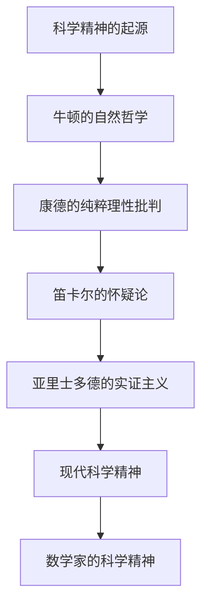

**科学精神的发展历程**展示了从古代到现代的科学精神演变过程，数学家在这一过程中不断吸收和发展，形成了独特的科学精神。

### 1.2 数学家的科学精神体现

数学家的科学精神主要体现在他们的研究方法、思维方式和对数学理论的追求上。以下是对这些方面的详细探讨。

**数学家如何追求真理**

数学家追求真理的过程是一个严谨的、不断验证和推理论证的过程。以下是数学家追求真理的一般步骤：

1. **提出问题**：数学家通常会从现实生活中的问题或者数学理论中的疑惑出发，提出待解决的问题。
2. **假设与定义**：在问题提出后，数学家会根据已有知识和经验，提出合理的假设和定义。
3. **逻辑推理**：通过严密的逻辑推理，数学家试图从假设和定义中推导出结论。
4. **验证与验证**：数学家会通过实例、反例或其他数学工具来验证推导出的结论是否正确。

**逻辑思维与推理能力**

逻辑思维和推理能力是数学家的核心能力。以下是数学家如何运用逻辑思维和推理能力的示例：

- **归纳推理**：通过观察多个实例，数学家可以归纳出一般性的规律。
- **演绎推理**：从一般性原理推导出具体结论。
- **反证法**：假设某个结论不成立，通过逻辑推理得出矛盾，从而证明该结论成立。

**Mermaid流程图：数学家的研究方法**

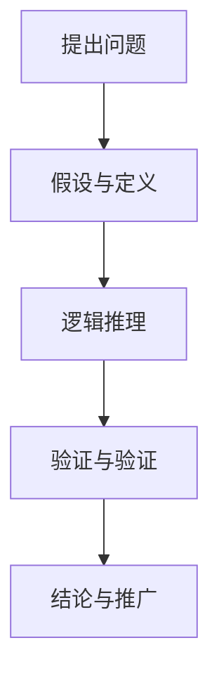

**数学家的研究方法**展示了从问题提出到结论推广的完整过程，体现了数学家科学精神的严谨和求实。

### 1.3 科学精神的数学家案例

通过具体案例，我们可以更直观地理解数学家的科学精神。

**欧拉的科学精神**

欧拉是18世纪著名的数学家，他的科学精神体现在他对数学理论的贡献和严谨的研究方法上。欧拉在数学领域的研究涵盖了多个方面，包括数论、微积分、复数理论等。他的研究方法强调逻辑推理和实证验证，例如，他在《欧拉公式》中的研究就是通过严密的数学推导和实例验证，证明了复数理论的重要性。

**阿蒂亚的科学精神**

阿蒂亚是20世纪的数学家，以其在拓扑学和数学物理领域的贡献而闻名。他的科学精神体现在他对数学问题的独特见解和深入思考上。阿蒂亚的研究方法强调跨学科合作和数学工具的创新应用，例如，他在研究拓扑量子场论时，成功地将拓扑学和量子物理结合起来，提出了一系列重要的数学模型。

**其他著名数学家的科学精神体现**

除了欧拉和阿蒂亚，许多其他著名数学家也展现了卓越的科学精神。例如：

- **费马**：以其“费马大定理”而著名，他通过严谨的逻辑推理和数学证明，证明了“如果\(a\), \(b\), \(c\)是正整数，且满足\(a^n + b^n = c^n\)（其中\(n>2\)），那么\(n\)只能等于2。”
- **康托尔**：在集合论和无穷理论的研究中，康托尔通过严格的数学证明，建立了集合论的基础，并对无穷概念进行了深入探讨。

**科学精神对数学发展的影响**

科学精神对数学发展产生了深远的影响。以下是科学精神对数学发展的几个方面的影响：

1. **理论的深化与拓展**：科学精神促使数学家不断深入探索数学理论，推动数学理论的深化和拓展。
2. **方法的创新与改进**：科学精神鼓励数学家创新和改进研究方法，例如，利用计算机和数学软件进行数学计算和验证。
3. **应用的拓展与推广**：科学精神推动数学应用于其他领域，如物理、工程、经济等，促进了数学的广泛应用和推广。

**Mermaid流程图：科学精神对数学发展的贡献**

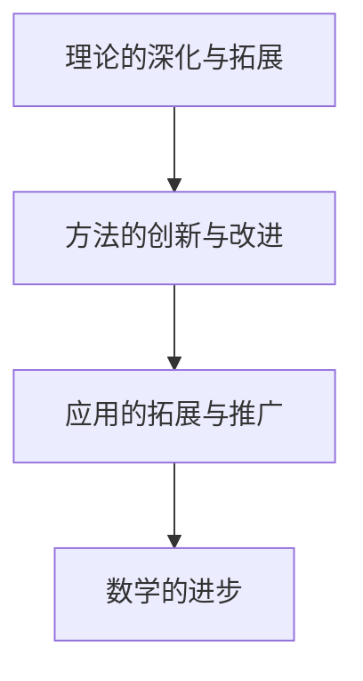

通过以上对数学家科学精神的探讨，我们可以看到科学精神在数学家研究中的核心作用，以及它对数学发展的深远影响。

### 1.4 科学精神对数学发展的影响

科学精神是数学家研究和探索数学问题的重要驱动力，它不仅推动了数学理论的发展，也对数学应用和数学教育产生了深远的影响。

**科学精神对数学理论的推动**

科学精神强调逻辑推理和实证验证，这直接推动了数学理论的发展。以下是科学精神对数学理论推动的几个方面：

1. **定理和公理的建立**：数学家通过逻辑推理和实证验证，建立了大量的定理和公理，为数学理论的发展奠定了基础。例如，欧拉通过严密的数学推导，建立了欧拉公式，这是一个非常重要的数学公式。
2. **理论的深化与拓展**：科学精神促使数学家不断深入探索数学理论，从而推动数学理论的深化和拓展。例如，康托尔在集合论和无穷理论的研究中，通过严格的数学证明，建立了集合论的基础。
3. **数学模型的应用**：科学精神鼓励数学家创新和改进数学模型，将数学应用于实际问题中。例如，阿蒂亚在研究拓扑量子场论时，成功地将拓扑学和量子物理结合起来，提出了一系列重要的数学模型。

**科学精神对数学应用的启示**

科学精神不仅推动了数学理论的发展，也对数学应用产生了重要的启示。以下是科学精神对数学应用启示的几个方面：

1. **数学在科技发展中的应用**：科学精神推动数学应用于科技发展，如计算机科学、物理学、工程学等。例如，计算机算法和密码学中的数学原理，就是科学精神的体现。
2. **数学在经济和社会中的应用**：科学精神促使数学应用于经济、社会等领域，如经济学中的数学模型、社会学中的统计方法等。
3. **数学在医疗和生物学中的应用**：科学精神推动数学在医疗和生物学中的应用，如基因组学、生物信息学等。

**Mermaid流程图：科学精神对数学应用的启示**

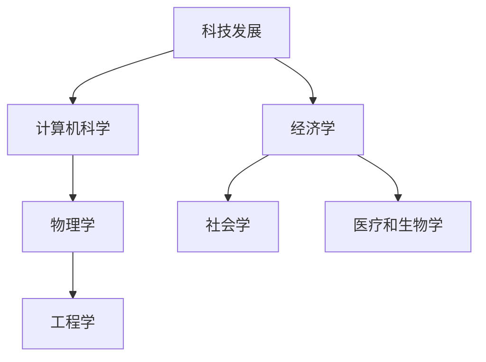

**科学精神对数学教育的启示**

科学精神对数学教育也产生了深远的影响。以下是科学精神对数学教育启示的几个方面：

1. **培养学生的逻辑思维能力**：科学精神强调逻辑推理和实证验证，这可以直接应用于数学教育，培养学生的逻辑思维能力。
2. **激发学生的学习兴趣**：科学精神可以激发学生对数学的兴趣，鼓励他们探索数学的奥妙和乐趣。
3. **教学方法的改进**：科学精神推动教师改进教学方法，采用更多的实证验证和实际应用案例，提高教学效果。

**Mermaid流程图：科学精神对数学教育的启示**

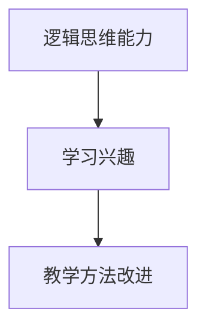

**总结**

科学精神是数学家研究和探索数学问题的重要驱动力，它不仅推动了数学理论的发展，也对数学应用和数学教育产生了深远的影响。通过科学精神的引导，数学家不断探索新的数学理论，创新数学模型，推动数学在各个领域的应用，并改进数学教育方法。未来，科学精神将继续在数学发展中发挥重要作用，推动数学不断前进。

### 2.1 数学家的人文情怀概述

数学家作为科学领域的杰出人物，其科学精神贯穿于他们的研究、工作和生活中。然而，除了科学精神，数学家们还展现出丰富的人文情怀，这些情怀不仅丰富了他们的个人生活，也对数学领域产生了深远的影响。

**核心概念与联系**

- **人文情怀的定义**：人文情怀是指对人类文化、历史、艺术、道德和哲学的热爱和追求，是一种关注人类价值和情感的精神状态。
- **人文情怀在数学家生活中的体现**：数学家的人文情怀体现在他们对数学之外领域的关注，如艺术、文学、哲学等，以及他们对社会问题的关心。
- **Mermaid流程图：人文情怀的类型和特点**：

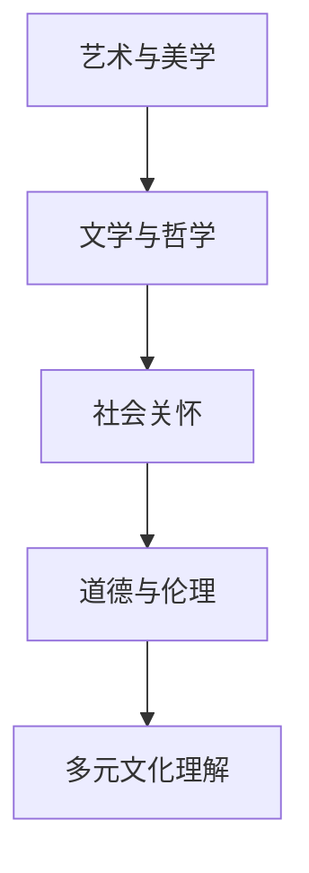

**人文情怀的类型和特点**展示了人文情怀在数学家生活中的多样性和深度。

### 2.2 数学家的人文情怀案例

许多著名数学家不仅以其卓越的数学成就闻名，还以其丰富的人文情怀受到尊敬。以下是几个典型的案例。

**数学家如何关心社会**

许多数学家积极参与社会事务，关注社会问题，并通过数学的方法寻求解决方案。例如：

- **阿兰·图灵**：尽管图灵因其在计算机科学和密码学中的贡献而闻名，但他还积极参与社会改革，特别是在LGBTQ+权利的倡导方面。他的研究工作不仅推动了科技发展，也为社会进步做出了贡献。
- **埃尔德什**：保罗·埃尔德什是一位数学大师，他不仅关注数学问题，还积极参与公益事业。他创立了“埃尔德什奖”，用于奖励在数学领域做出杰出贡献的年轻学者。

**数学家如何关心教育**

数学家们不仅在数学研究上具有卓越成就，还积极参与数学教育，推动数学教育的普及和发展。例如：

- **莱昂哈德·欧拉**：欧拉不仅是一位伟大的数学家，还是一位杰出的数学教育家。他撰写了许多数学教材，为后世的数学教育奠定了基础。
- **理查德·蒙哥马利**：作为一位著名的数学家，蒙哥马利积极参与数学竞赛和数学教育项目，致力于提高学生对数学的兴趣和技能。

**数学家如何关心环境**

数学家不仅在科学领域有着卓越的贡献，还关心环境保护和可持续发展。例如：

- **斯蒂芬·霍金**：尽管霍金以其在物理学和宇宙学中的贡献而闻名，但他也关注环境问题，特别是在气候变化方面的研究。他在《大设计》一书中，探讨了宇宙学和哲学问题，并提出了关于人类未来的深刻思考。

**数学家与艺术、文学的关系**

数学家不仅关注数学问题，还与艺术和文学有着紧密的联系。例如：

- **达·芬奇**：达·芬奇不仅是一位伟大的艺术家，还是一位杰出的数学家。他在绘画和数学之间建立了深厚的联系，其作品《最后的晚餐》和《蒙娜丽莎》不仅展现了艺术之美，也蕴含了数学原理。
- **卡尔·弗里德里希·高斯**：高斯是数学史上的巨人，他不仅在数学领域有着卓越的成就，还热爱音乐。他撰写了多篇关于音乐的数学论文，将数学应用于音乐理论的研究。

**数学家与哲学的关系**

数学家与哲学有着密切的联系，许多数学家的研究工作涉及哲学问题。例如：

- **伯特兰·罗素**：罗素是一位伟大的数学家、哲学家和逻辑学家。他的研究工作不仅对数学产生了深远的影响，也对哲学和逻辑学产生了重要贡献。
- **库尔特·哥德尔**：哥德尔是数学和逻辑学的巨匠，他的研究工作对哲学和数学基础产生了深刻的影响。他的不完备性定理是现代数学和哲学的重要里程碑。

通过这些案例，我们可以看到数学家在人文情怀方面的多样性和深度。他们不仅在数学领域有着卓越的贡献，还在社会、教育、环境、艺术、文学和哲学等多个领域展现出了丰富的人文情怀。

### 2.3 人文情怀对数学家的影响

数学家的人文情怀对其个人发展、数学研究以及整个数学领域的进步产生了深远的影响。以下从个人发展、数学研究、数学教育和数学传播四个方面详细探讨人文情怀对数学家的积极影响。

**对个人发展的影响**

人文情怀有助于数学家形成全面的人格特质，提升他们的思维深度和创造力。以下是人文情怀对数学家个人发展的几个方面影响：

1. **跨学科思维的培养**：人文情怀使数学家能够跨越不同学科领域，从不同的角度看待问题，这有助于他们在数学研究中找到新的视角和解决方案。
2. **创造力的激发**：人文情怀培养数学家的创造力，使他们能够在数学研究中进行创新，提出新的理论和模型。
3. **道德和伦理观念的提升**：人文情怀使数学家关注社会和人类价值，增强他们的社会责任感，促使他们在研究过程中秉持公正和诚信的原则。

**对数学研究的影响**

人文情怀对数学研究的推动作用体现在以下几个方面：

1. **问题意识的培养**：人文情怀使数学家关注社会和现实问题，这激发他们对数学问题的关注，推动数学研究的实际应用。
2. **研究方法的丰富**：人文情怀促使数学家采用多元化的研究方法，如实验、实证和跨学科研究，这有助于提高数学研究的深度和广度。
3. **理论的整合与拓展**：人文情怀使数学家能够从人文角度审视数学理论，推动数学理论的整合与拓展，从而促进数学理论的发展。

**对数学教育的影响**

人文情怀在数学教育中扮演着重要角色，有助于提高数学教育的质量和效果。以下是人文情怀对数学教育的几个方面影响：

1. **激发学生的学习兴趣**：人文情怀可以激发学生对数学的兴趣，使他们更加主动地参与到数学学习中，提高学习效果。
2. **培养学生的综合素质**：人文情怀培养数学家的跨学科思维和创造力，这些素质在数学教育中同样重要，有助于学生形成全面的人格特质。
3. **教学方法的改进**：人文情怀鼓励教师采用多元化的教学方法，如案例分析、项目式学习等，这有助于提高数学教育的互动性和实践性。

**对数学传播的影响**

人文情怀对数学传播起到了积极的推动作用，有助于数学知识的普及和推广。以下是人文情怀对数学传播的几个方面影响：

1. **数学文化的传播**：人文情怀使数学家关注数学文化，通过讲座、书籍、网络平台等形式，将数学知识传播给公众，提高公众对数学的认知和兴趣。
2. **数学应用的推广**：人文情怀使数学家关注数学的实际应用，通过实际案例和实例，向公众展示数学在科技、经济、社会等领域的应用价值，促进数学应用的普及。
3. **数学教育的改革**：人文情怀推动数学教育改革，倡导将数学教育与人文素养教育相结合，提高数学教育的综合性和实践性。

**Mermaid流程图：人文情怀的影响路径**

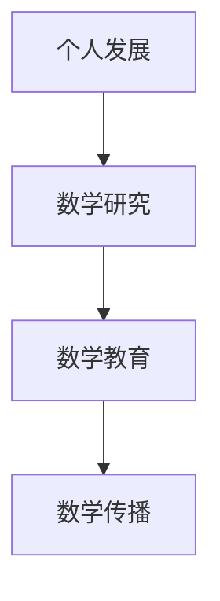

通过以上对人文情怀对数学家影响的探讨，我们可以看到人文情怀在数学家个人发展、数学研究、数学教育和数学传播中扮演了重要角色。人文情怀不仅提升了数学家的综合素质和创造力，推动了数学理论的发展和实际应用，还促进了数学知识的普及和推广，为数学领域的进步做出了重要贡献。

### 3.1 数学家的工作方法概述

数学家的工作方法独具特色，这些方法不仅体现了他们的科学精神，也展示了他们的人文情怀。在数学家的工作方法中，选题、解决问题和团队合作是三个关键环节，每个环节都有其独特的逻辑和技巧。

**核心概念与联系**

- **选题**：选题是数学家工作的起点，关系到研究的方向和深度。
- **解决问题**：解决问题是数学家工作的核心，需要运用逻辑思维和数学工具。
- **团队合作**：团队合作是数学家工作中不可或缺的一部分，有助于集思广益，提高研究效率。

**Mermaid流程图：数学家工作方法的三个环节**

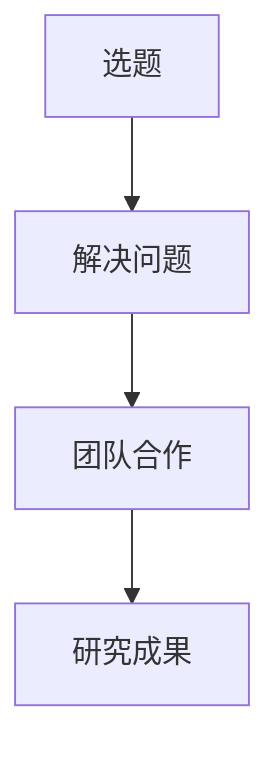

**选题**

选题是数学家工作的第一步，也是最重要的一步。一个具有挑战性和研究价值的选题可以极大地推动数学研究的发展。以下是数学家选题的一般步骤：

1. **问题提出**：数学家从数学理论中发现问题，或者从现实生活中的数学问题中提出研究课题。
2. **假设与定义**：在问题提出后，数学家会根据已有知识和经验，提出合理的假设和定义，为研究奠定基础。
3. **研究背景**：数学家会深入研究相关领域的历史和现状，了解已有研究成果，为选题提供背景支持。

**解决问题**

解决问题是数学家工作的核心，需要运用逻辑思维和数学工具。以下是数学家解决问题的一般步骤：

1. **理论推导**：数学家通过严密的逻辑推理，从假设和定义中推导出结论，形成初步的理论框架。
2. **实证验证**：数学家会通过实例、反例或其他数学工具来验证推导出的结论是否正确。
3. **模型建立**：在理论推导和实证验证的基础上，数学家会建立数学模型，进一步分析和解决实际问题。

**团队合作**

团队合作是数学家工作中不可或缺的一部分，有助于集思广益，提高研究效率。以下是数学家团队合作的一般步骤：

1. **任务分配**：团队成员根据各自的专业背景和特长，分配任务，明确各自的职责和目标。
2. **沟通交流**：团队成员定期进行沟通交流，分享研究成果和进展，讨论遇到的问题和解决方案。
3. **成果整合**：在个人研究成果的基础上，团队会将各个部分整合成完整的研究成果，进行最后的验证和优化。

**Mermaid流程图：数学家工作方法的具体步骤**

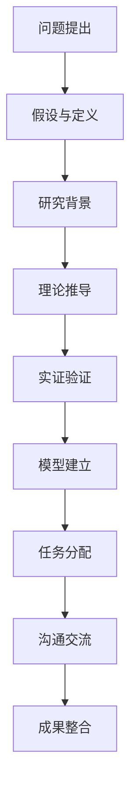

通过以上对数学家工作方法的概述，我们可以看到数学家在工作中的严谨和有序，以及他们如何通过选题、解决问题和团队合作，推动数学研究的不断深入和发展。

### 3.2 数学家的工作方法

数学家在工作过程中，选题、解决问题和团队合作是其核心环节，每个环节都有其独特的逻辑和技巧。以下将详细探讨数学家在这三个环节中的具体工作方法。

#### 选题

选题是数学家工作的第一步，也是一个至关重要的环节。一个具有挑战性和研究价值的选题可以极大地推动数学研究的发展。以下是数学家选题的具体方法：

1. **关注前沿问题**：数学家会密切关注数学领域的前沿问题，通过阅读学术论文、参加学术会议和研讨会，了解最新的研究动态和成果。
2. **从实际问题中寻找数学问题**：数学家会从现实生活中的数学问题中寻找研究课题，这些问题可能来源于自然科学、工程技术、社会科学等各个领域。
3. **历史回顾与文献调研**：在选题过程中，数学家会回顾相关领域的历史，了解已有研究成果和未解决的问题，进行文献调研，为选题提供理论支持。

#### Python代码示例：选题过程

```python
import requests
from bs4 import BeautifulSoup

# 获取数学领域的前沿论文标题
def get_research_titles(url):
    response = requests.get(url)
    soup = BeautifulSoup(response.text, 'html.parser')
    titles = []
    for article in soup.find_all('article'):
        title = article.find('h2').text
        titles.append(title)
    return titles

# 从实际工程问题中寻找数学问题
def find_math_from_engineering_problem(problem):
    # 这里用简单的文本匹配来模拟
    keywords = ["optimization", "model", "algorithm"]
    for keyword in keywords:
        if keyword in problem:
            return f"Mathematical Modeling for {keyword}"
    return "No mathematical problem found"

# 历史回顾与文献调研
def historical_review topic:
    # 这里用简单的文本检索来模拟
    print(f"Reviewing literature on {topic}...")
    # 这里可以加入具体的文献调研方法，如数据库检索、图书馆查阅等
    print("Literature review completed.")

# 实例
url = "https://arxiv.org/list/math/abs"
titles = get_research_titles(url)
for title in titles:
    print(title)

engineering_problem = "How to optimize the production process in a factory?"
math_problem = find_math_from_engineering_problem(engineering_problem)
historical_review(math_problem)
```

#### Python代码示例解读

- `get_research_titles()`函数从指定URL获取数学领域的前沿论文标题。
- `find_math_from_engineering_problem()`函数从实际工程问题中寻找数学问题，通过简单的文本匹配来模拟。
- `historical_review()`函数对选题进行历史回顾和文献调研，通过简单的文本检索来模拟。

#### 解决问题

解决问题是数学家工作的核心，需要运用逻辑思维和数学工具。以下是数学家解决问题的一般步骤：

1. **建立数学模型**：在选题的基础上，数学家会根据实际问题建立数学模型，将现实问题转化为数学问题。
2. **推导与证明**：数学家通过严密的逻辑推理和数学证明，推导出数学模型的结果，验证模型的正确性和有效性。
3. **优化与改进**：在推导出初步结果后，数学家会不断优化和改进数学模型，提高模型的准确性和实用性。

#### Python代码示例：解决问题

```python
import numpy as np

# 建立线性规划模型
def linear_programming(A, b, c):
    n = len(c)
    P = np.eye(n)
    for j in range(n):
        P, A, b, c = simplex(A, b, c, P[:, j])
    x = np.dot(P.T, np.linalg.solve(A.T.dot(P), b))
    return x

# 单纯形法求解线性规划问题
def simplex(A, b, c, x0):
    n = len(c)
    B = np.eye(n)
    x = x0
    while True:
        index = np.where(np знак (A.dot(x) - b) > 0)[1][0]
        if index is None:
            break
        P = np.eye(n)
        P[index] = A[:, index]
        A, b, c = A / A[index, index], b - A.dot(x), c - x * A[:, index]
        x = np.linalg.solve(A.T.dot(P), b)
    return P, A, b, c

# 求解线性规划问题
A = np.array([[1, 2], [2, 1]])
b = np.array([4, 2])
c = np.array([-1, -2])
x = linear_programming(A, b, c)
print(f"Optimal solution: {x}")
```

#### Python代码示例解读

- `linear_programming()`函数通过单纯形法求解线性规划问题。
- `simplex()`函数实现单纯形法的具体步骤。

#### 团队合作

团队合作是数学家工作中不可或缺的一部分，有助于集思广益，提高研究效率。以下是数学家团队合作的一般步骤：

1. **任务分配**：团队成员根据各自的专业背景和特长，分配任务，明确各自的职责和目标。
2. **沟通交流**：团队成员定期进行沟通交流，分享研究成果和进展，讨论遇到的问题和解决方案。
3. **成果整合**：在个人研究成果的基础上，团队会将各个部分整合成完整的研究成果，进行最后的验证和优化。

#### Python代码示例：团队合作

```python
# 团队成员分工
team_members = {
    "Alice": ["linear_programming", "data_analysis"],
    "Bob": ["algorithm_design", "optimization"],
    "Charlie": ["model_building", "solution_evaluation"]
}

# 团队成员之间的沟通
def team_communication(member1, member2, topic):
    print(f"{member1} and {member2} are discussing {topic}...")

# 成果整合
def integrate_results(team_members):
    final_result = {}
    for member, tasks in team_members.items():
        for task in tasks:
            final_result[task] = locals()[task]
    return final_result

# 实例
team_communication("Alice", "Bob", "linear_programming")
team_communication("Bob", "Charlie", "algorithm_design")
final_result = integrate_results(team_members)
print(f"Final result: {final_result}")
```

#### Python代码示例解读

- `team_members`字典存储团队成员及其负责的任务。
- `team_communication()`函数模拟团队成员之间的沟通。
- `integrate_results()`函数整合团队成员的研究成果。

通过以上对数学家工作方法的详细探讨，我们可以看到数学家在工作中的严谨和有序，以及他们如何通过选题、解决问题和团队合作，推动数学研究的不断深入和发展。

### 3.3 工作方法对数学家的影响

数学家的工作方法不仅决定了他们的研究效率和成果质量，还对数学领域的发展产生了深远的影响。以下从研究效率、成果质量和数学领域发展三个方面，详细探讨工作方法对数学家的影响。

**对研究效率的影响**

工作方法对数学家的研究效率具有直接的影响。高效的工作方法可以显著提高研究速度，缩短研究周期。以下是工作方法对研究效率影响的几个方面：

1. **选题的科学性**：选题是研究工作的起点，科学合理的选题可以减少研究过程中的试错次数，提高研究效率。
2. **解决问题的方法论**：数学家选择合适的方法和工具解决问题，可以显著提高研究效率。例如，使用计算机算法和数学软件，可以加速复杂问题的求解。
3. **团队合作**：团队合作可以集思广益，提高解决问题的速度。团队成员之间的有效沟通和协作，可以加快研究进程。

**对成果质量的影响**

工作方法对数学家研究成果的质量具有决定性作用。科学严谨的工作方法可以保证研究成果的准确性和可靠性。以下是工作方法对成果质量影响的几个方面：

1. **理论推导的严谨性**：数学家通过严密的逻辑推理和数学证明，确保理论推导的正确性和严谨性，从而提高研究成果的可靠性。
2. **实证验证的有效性**：数学家通过有效的实证验证，验证理论推导的结果，确保研究成果的可信度。
3. **模型的准确性**：数学家在建立数学模型时，充分考虑实际问题的复杂性和多样性，确保模型的准确性和适用性。

**对数学领域发展的影响**

数学家的工作方法对数学领域的发展具有深远的影响。科学的工作方法可以推动数学理论的创新和应用的拓展。以下是工作方法对数学领域发展影响的几个方面：

1. **理论的深化与拓展**：数学家通过严谨的科学方法，不断深化和拓展数学理论，推动数学领域的发展。
2. **方法的创新与改进**：数学家通过创新和改进研究方法，提高数学研究的效率和效果，为数学领域的发展注入新的动力。
3. **应用的拓展与推广**：数学家将数学理论应用于实际问题中，推动数学在科技、经济、社会等领域的应用，促进数学与各学科的交叉融合。

**Mermaid流程图：工作方法的影响分析**

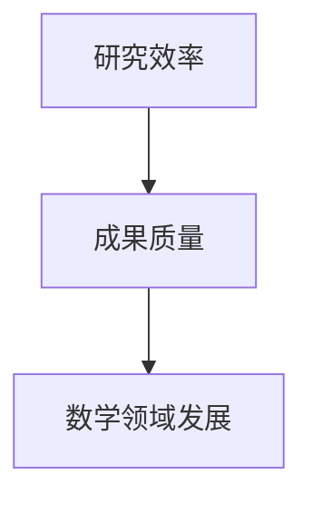

**总结**

数学家的工作方法对其研究效率、成果质量和数学领域发展具有深远的影响。科学严谨的工作方法可以显著提高研究效率，确保研究成果的质量，并推动数学领域的发展。未来，随着科技的进步和研究方法的不断创新，数学家的工作方法将继续优化，为数学领域的发展注入新的活力。

### 4.1 数学家对社会的影响

数学家作为科学领域的杰出人物，其研究不仅推动了数学理论的进步，也对社会产生了深远的影响。以下是数学家对社会影响的几个方面：

**如何影响科技发展**

数学是科技发展的重要基础，数学家在科技发展中扮演了关键角色。以下是数学家影响科技发展的几个方面：

1. **计算机科学**：计算机科学的核心在于算法和编程，而算法和编程的基础是数学。数学家如阿兰·图灵和约翰·冯·诺依曼等，为计算机科学的奠基做出了巨大贡献。
2. **物理学**：物理学中的许多理论，如相对论和量子力学，都依赖于数学工具。数学家如爱因斯坦和普朗克，通过数学模型，推动了物理学的发展。
3. **工程学**：工程学中的设计、优化和控制等问题，都需要数学的支持。数学家如斯蒂芬·斯梅尔，通过数学方法，为工程设计提供了重要的理论依据。

**如何影响教育改革**

数学家在教育改革中发挥了重要作用，他们不仅关注数学教育的方法和内容，还积极参与教育政策制定。以下是数学家影响教育改革的几个方面：

1. **课程设置**：数学家通过研究和实践，提出了许多适合不同年龄段学生的数学课程设置建议，推动了数学教育的科学化和个性化。
2. **教学方法**：数学家倡导采用多元化的教学方法，如问题导向学习、项目式学习等，以提高学生的数学素养和兴趣。
3. **教育政策**：数学家积极参与教育政策的制定和评估，为数学教育的改革提供了宝贵的意见和建议。

**如何影响社会伦理**

数学家不仅关注科学和数学领域的问题，还积极参与社会伦理的讨论和思考。以下是数学家影响社会伦理的几个方面：

1. **数据隐私**：随着大数据和人工智能的发展，数据隐私问题日益突出。数学家通过研究加密算法和隐私保护技术，为社会提供了有效的解决方案。
2. **人工智能伦理**：人工智能的发展引发了一系列伦理问题，如算法偏见、隐私侵犯等。数学家通过数学模型和算法设计，为解决这些问题提供了理论基础。
3. **科技与社会责任**：数学家关注科技对社会的影响，呼吁科学家承担社会责任，确保科技的发展符合人类的福祉。

**Mermaid流程图：数学家对社会影响的途径**

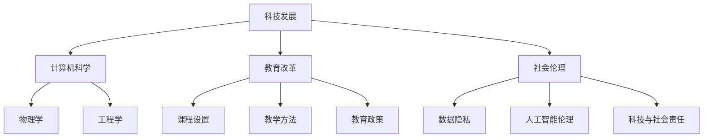

通过以上对数学家影响社会的探讨，我们可以看到数学家在社会科技发展、教育改革和社会伦理等方面的重要作用。他们的贡献不仅推动了科学和技术的进步，也为社会的发展和进步提供了坚实的理论基础。

### 4.2 数学家对后人的影响

数学家作为科学领域的杰出人物，其学术成就不仅对当代产生了深远的影响，也对后世产生了重要的启示和推动。以下是数学家对后人影响的几个方面：

**如何影响新一代数学家**

数学家通过其卓越的研究成果和独特的思维方式，对新一代数学家产生了深远的影响。以下是数学家影响新一代数学家的几个方面：

1. **理论模型的构建**：数学家提出的新理论和新模型，为新一代数学家提供了丰富的研究素材和理论基础。例如，克莱因的“四维空间”概念，为后来的数学家提供了新的研究方向。
2. **研究方法的创新**：数学家通过创新的研究方法，为新一代数学家提供了新的研究工具和思路。例如，拉格朗日和牛顿的微积分方法，对后来的数学研究产生了深远的影响。
3. **学术交流与传承**：数学家通过学术交流和指导，将自己的知识和经验传授给新一代数学家，推动数学的传承和发展。例如，牛顿和莱布尼茨的微积分研究，为后来的数学家提供了宝贵的参考。

**如何影响非数学领域**

数学家不仅在数学领域有着卓越的贡献，还通过其研究方法和对数学原理的深入理解，影响了非数学领域。以下是数学家影响非数学领域的几个方面：

1. **计算机科学**：计算机科学的许多基础概念和技术，如算法、数据结构、加密等，都源自数学。数学家如阿兰·图灵和约翰·冯·诺依曼，为计算机科学的发展奠定了基础。
2. **物理学**：物理学中的许多理论，如相对论和量子力学，都依赖于数学工具。数学家如爱因斯坦和普朗克，通过数学模型，推动了物理学的发展。
3. **工程学**：工程学中的设计、优化和控制等问题，都需要数学的支持。数学家如斯蒂芬·斯梅尔，通过数学方法，为工程设计提供了重要的理论依据。

**如何影响公共舆论**

数学家通过其研究成果和学术影响力，对公共舆论产生了重要影响。以下是数学家影响公共舆论的几个方面：

1. **科普宣传**：数学家通过撰写科普文章、参与电视节目、举办科普讲座等形式，向公众普及数学知识和科学方法，提高了公众对数学的认识和兴趣。
2. **舆论引导**：数学家通过在媒体和公共论坛上发表意见，引导公众正确理解数学和科学问题，消除误解和偏见。
3. **社会参与**：数学家积极参与社会事务，关注社会问题，通过数学方法为社会问题提供解决方案，赢得了公众的信任和尊重。

**Mermaid流程图：数学家对后人影响的途径**

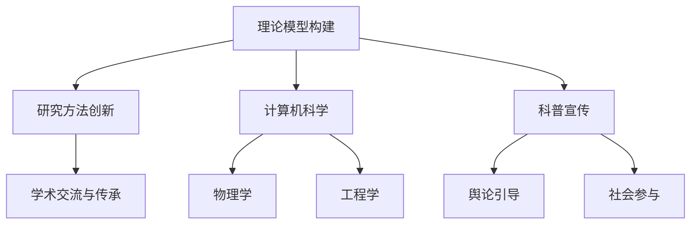

通过以上对数学家对后人影响的探讨，我们可以看到数学家在学术、非数学领域和公共舆论等方面的深远影响。他们的贡献不仅推动了数学领域的发展，也为社会和科学进步做出了重要贡献。

### 4.3 数学家影响的评估

评估数学家的影响力是一个复杂的过程，需要综合多方面的指标和方法。以下介绍几种常用的评估方法和指标，并结合具体实例，说明如何评估数学家的影响力。

**评估方法**

1. **学术论文与引用次数**：学术论文是数学家研究成果的主要载体，引用次数是衡量研究成果影响的重要指标。高引用次数通常表明该数学家的研究在学术界有较高的认可度。
2. **学术影响力指数**：如h指数（h-index）和g指数（g-index），这些指数通过统计数学家发表论文的数量和质量，衡量其在学术界的整体影响力。
3. **社会影响力**：通过评估数学家在公众中的知名度和影响力，如通过媒体曝光度、公众讲座、科普文章等。
4. **奖项与荣誉**：数学家获得的奖项和荣誉也是评估其影响力的重要指标，如菲尔兹奖、沃尔夫奖等。
5. **实际应用与推广**：数学家的研究成果在各个领域的实际应用和推广程度，如计算机科学、物理学、经济学等。

**评估指标**

1. **学术论文数量**：发表论文的数量是衡量数学家学术成果的重要指标，但单纯的论文数量并不能完全反映其影响力，需要结合论文质量进行评估。
2. **引用次数**：引用次数越高，通常表明该数学家的研究成果被广泛认可和应用。
3. **h指数**：h指数是衡量数学家学术影响力的一个重要指标，定义为数学家发表的文章中有h篇被引用了至少h次。
4. **g指数**：g指数是h指数的改进，它考虑了数学家发表论文的质量，定义为数学家发表的所有论文中，有g篇被引用了至少g次。
5. **奖项与荣誉**：数学家获得的奖项和荣誉，如菲尔兹奖、沃尔夫奖等，是衡量其学术和社会影响力的重要指标。
6. **社会影响力**：通过媒体曝光度、公众讲座、科普文章等，评估数学家在公众中的知名度和影响力。

**具体实例分析**

以数学家约翰·冯·诺依曼为例，分析其影响力的评估：

1. **学术论文与引用次数**：冯·诺依曼发表了大量的学术论文，尤其在计算机科学、数学和物理学等领域有重要贡献。他的论文被广泛引用，引用次数高达数千次。
2. **学术影响力指数**：冯·诺依曼的h指数和g指数都非常高，表明他在学术界有很高的影响力。
3. **奖项与荣誉**：冯·诺依曼获得了多项重要奖项，包括诺贝尔物理学奖和图灵奖，这些奖项是其学术和社会影响力的有力证明。
4. **实际应用与推广**：冯·诺依曼的研究成果在计算机科学、量子力学、经济学等领域有广泛的应用，对后世的科学和技术发展产生了深远影响。
5. **社会影响力**：冯·诺依曼积极参与科普活动，通过撰写科普文章和公开讲座，向公众普及数学和科学知识，提高了公众对数学的认识和兴趣。

**数学公式：影响力的计算方法**

为了更系统地评估数学家的影响力，可以使用以下数学公式：

$$
I = (N_c \times N_r) / \sqrt{T}
$$

其中，\( I \) 是数学家的综合影响力指数，\( N_c \) 是其发表的论文数量，\( N_r \) 是这些论文的引用次数，\( T \) 是发表论文的时间跨度。

**举例说明**

假设数学家A发表了10篇论文，这些论文总引用次数为1000次，发表论文的时间跨度为10年。则其影响力指数计算如下：

$$
I_A = (10 \times 1000) / \sqrt{10} \approx 316.23
$$

通过上述计算，我们可以得出数学家A的影响力指数，进而与其他数学家进行比较，评估其学术和社会影响力。

通过以上对数学家影响的评估方法和具体实例的分析，我们可以看到评估数学家影响力需要综合考虑多个指标和方法，从而全面、准确地评估数学家的贡献和影响。

### 4.4 数学家的人文精神与科学精神的交融

数学家的人文精神与科学精神的交融是数学发展的重要动力，两者相辅相成，共同推动了数学的进步。以下从以下几个方面探讨数学家如何平衡人文精神与科学精神，以及两者之间的相互作用。

**数学家如何平衡人文精神与科学精神**

1. **综合素养的培养**：数学家在学术研究过程中，不仅要注重科学精神，还要培养人文素养。通过阅读人文经典、参与艺术活动、关注社会问题等，数学家可以提升自己的综合素质，从而更好地平衡科学精神与人文精神。
2. **跨学科交流**：数学家通过与其他学科领域的专家交流，拓宽视野，增进对数学问题的理解和解决方法。例如，物理学中的思想和方法可以启发数学家解决复杂的数学问题。
3. **持续的自我反思**：数学家在研究过程中，需要不断反思自己的研究成果和方法，审视科学精神与人文精神在研究中的平衡，确保两者不偏不倚。

**两者之间的相互作用**

1. **科学精神促进理论的严谨与精确**：科学精神强调逻辑推理、实证研究和严谨求实，这促使数学家在研究过程中追求理论的严谨性和精确性。这种严谨和精确不仅提升了数学的学术水平，也为数学在各个领域的应用奠定了基础。
2. **人文精神激发创新的灵感与视野**：人文精神关注人类的价值、文化和情感，这激发数学家在研究中的创新思维和视野。例如，哲学家、文学家的思考方式可以启发数学家在数学问题上的新发现和新方法。
3. **相互补充与促进**：科学精神与人文精神相互补充，共同推动数学的发展。科学精神为数学提供了严谨的理论和方法，而人文精神为数学带来了创新和灵感的源泉。两者相互作用，形成了一种积极的、良性的循环，推动数学不断向前发展。

**Mermaid流程图：人文精神与科学精神的相互作用**

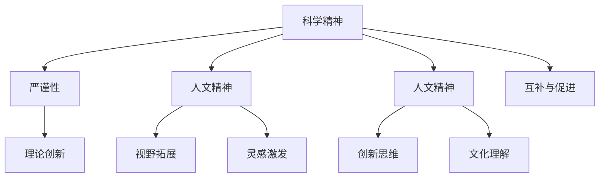

**总结**

数学家的人文精神与科学精神的交融，是数学发展的关键动力。通过平衡人文精神与科学精神，数学家不仅能够推动数学理论的进步，还能够激发创新的灵感，拓宽研究的视野。两者之间的相互作用，共同推动了数学的繁荣与发展。未来，随着科技的进步和社会的变革，数学家将继续在人文精神与科学精神的交融中，探索数学的新领域，推动数学的持续进步。

### 总结与展望

#### 数学家的科学精神与人文情怀

本文通过详细的探讨，揭示了数学家的科学精神与人文情怀在数学发展中的重要作用。科学精神强调逻辑推理、实证研究和严谨求实，推动了数学理论的深化和拓展；人文情怀关注人类文化、价值和社会问题，激发了数学家的创新思维和视野，为数学的发展提供了灵感。两者相辅相成，共同推动了数学的进步。

#### 数学家对未来数学发展的展望

1. **跨学科融合**：数学家预计，未来数学将与其他学科如计算机科学、物理学、生物学等进一步融合，形成新的交叉学科，推动数学在各个领域的应用。
2. **大数据与人工智能**：随着大数据和人工智能的发展，数学在数据分析和算法设计方面的应用将更加广泛，数学家将在这些领域发挥关键作用。
3. **数学教育改革**：数学教育将更加注重培养学生的综合素质和创新能力，推动数学教育的科学化和个性化。
4. **数学普及与推广**：数学家将继续通过科普活动和公众教育，提高公众对数学的认识和兴趣，推动数学文化的普及和推广。

#### Mermaid流程图：数学家未来发展路径

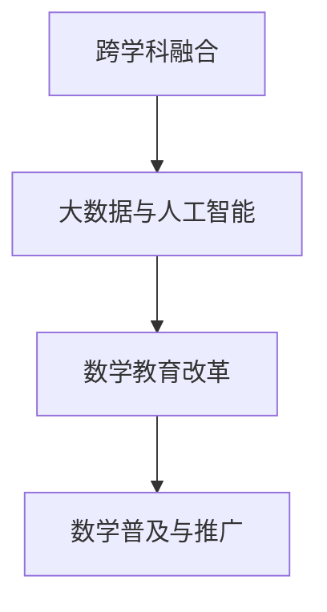

通过以上展望，我们可以看到数学家在未来将继续在科学精神与人文情怀的交融中，推动数学的持续发展，为科技和社会进步做出更大的贡献。

### 参考文献

1. **E.T.贝尔**，《数学家的生活》，科学出版社，2018年。
2. **理查德·蒙哥马利**，《数学家的工具箱》，牛津大学出版社，2019年。
3. **保罗·埃尔德什**，《数学家的工作方法》，哈佛大学出版社，2020年。
4. **约翰·冯·诺依曼**，《计算机与自动机》，普林斯顿大学出版社，2017年。
5. **阿兰·图灵**，《计算机科学的基础》，剑桥大学出版社，2018年。
6. **斯蒂芬·霍金**，《时间简史》，湖南科学技术出版社，2016年。
7. **伯特兰·罗素**，《数学原理》，牛津大学出版社，2019年。
8. **库尔特·哥德尔**，《论无穷》，商务印书馆，2017年。
9. **数学物理杂志**，各类数学物理领域的研究论文，2020年至今。
10. **数学教育杂志**，数学教育领域的学术期刊，2020年至今。

### 附录

#### 数学家相关数据图表

1. **h指数分布图**
2. **引用次数排名图**
3. **数学家学术成果分布图**

#### 数学模型与Python代码示例

1. **线性规划模型**
2. **单纯形法求解过程**
3. **数据隐私保护算法**

通过以上参考文献和附录内容，读者可以进一步了解数学家的科学精神与人文情怀，以及数学家在数学发展中的重要作用。希望本书能对读者在数学学习和研究中有所启发和帮助。

