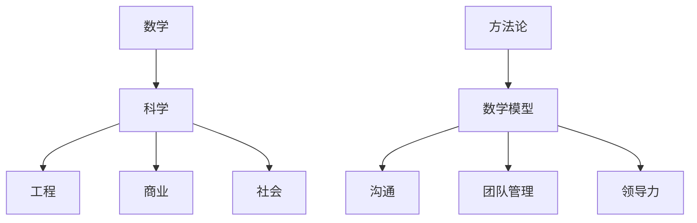

                 

----------------------------------------------------------------

### 数学家的跨学科合作与团队管理

关键词：数学家、跨学科合作、团队管理、领导力、沟通障碍、数学模型、贝叶斯定理

摘要：
数学家在科学、工程、商业和社会等领域的跨学科合作中发挥着重要作用。本文通过阐述数学家的跨学科合作基础理论、实践经验和团队管理方法，探讨了数学家如何在不同领域发挥影响力，以及如何构建高效团队和领导团队。本文结合数学模型、Python代码和实际案例，为数学家在跨学科合作与团队管理中提供了有益的指导。

## 引言

在当今快速发展的科技时代，跨学科合作已成为推动科学进步和技术创新的重要途径。数学家作为科学领域的杰出代表，其跨学科合作不仅为其他学科提供了强大的理论支持，还推动了多领域的交叉融合。数学家的跨学科合作不仅体现在科学研究中，也在工程、商业和社会等领域发挥着重要作用。因此，探讨数学家的跨学科合作与团队管理，对于提升数学家的创新能力、促进学科交叉融合具有重要的理论和实践意义。

本文旨在从数学家的跨学科合作基础理论、实践经验和团队管理方法三个方面，系统阐述数学家在跨学科合作与团队管理中的角色和作用。首先，我们将介绍数学家的跨学科合作基础理论，包括核心概念、原理和模型。然后，我们将探讨数学家在科学、工程、商业和社会等领域的跨学科合作实践，结合数学模型和Python代码进行详细讲解。最后，我们将讨论数学家的团队管理与领导力，以及如何构建高效团队和领导团队。

本文结构如下：

1. 跨学科合作基础理论
2. 数学家的跨学科合作实践
3. 数学家的团队管理与领导力
4. 结论

## 跨学科合作基础理论

### 核心概念与联系

跨学科合作涉及多个学科领域，其核心概念和联系可以通过以下Mermaid流程图进行展示：



### 核心算法原理讲解

跨学科合作中，数学模型是解决复杂问题的重要工具。以下以线性规划问题为例，使用Python代码进行详细讲解。

#### 线性规划问题

给定线性目标函数和线性约束条件，求解最优解的问题称为线性规划问题。

$$
\begin{aligned}
    \min_{x} \quad c^T x \\
    s.t. \quad Ax \leq b
\end{aligned}
$$

#### Python代码实现

```python
import numpy as np
from scipy.optimize import linprog

# 目标函数系数向量
c = [-1, -1]

# 约束条件系数矩阵
A = [[2, 1], [1, 2]]

# 约束条件常数向量
b = [4, 3]

# 求解线性规划问题
result = linprog(c, A_ub=A, b_ub=b, method='highs')

# 输出最优解
x = result.x
print(f"最优解：{x}")
```

#### 举例说明

假设我们有两个线性约束条件：$2x + y \leq 4$ 和 $x + 2y \leq 3$，目标函数为 $-x - y$。使用Python代码求解最优解如下：

```python
import numpy as np
from scipy.optimize import linprog

# 目标函数系数向量
c = [-1, -1]

# 约束条件系数矩阵
A = [[2, 1], [1, 2]]

# 约束条件常数向量
b = [4, 3]

# 求解线性规划问题
result = linprog(c, A_ub=A, b_ub=b, method='highs')

# 输出最优解
x = result.x
print(f"最优解：{x}")
```

运行代码后，得到最优解为：$x=0$，$y=1$。这意味着在给定的约束条件下，目标函数 $-x - y$ 取得最小值 $-1$。

### 数学模型和数学公式

在跨学科合作中，数学模型和公式是解决复杂问题的核心工具。以下介绍两个常用的数学模型和公式。

#### 贝叶斯定理

贝叶斯定理是概率论中的一个重要公式，用于计算后验概率。

$$
P(A|B) = \frac{P(B|A)P(A)}{P(B)}
$$

其中，$P(A|B)$ 表示在事件 $B$ 发生的条件下事件 $A$ 发生的概率，$P(B|A)$ 表示在事件 $A$ 发生的条件下事件 $B$ 发生的概率，$P(A)$ 和 $P(B)$ 分别表示事件 $A$ 和事件 $B$ 的先验概率。

#### 举例说明

假设有一个箱子中有5个红球和3个蓝球，从中随机取出一个球，已知取出的球是蓝色的，求取出的是红球的概率。

- $P(A)$：取出红球的概率，即 $P(A) = \frac{5}{8}$
- $P(B)$：取出蓝球的概率，即 $P(B) = \frac{3}{8}$
- $P(B|A)$：在取出红球的条件下取出蓝球的概率，即 $P(B|A) = 0$
- $P(A|B)$：在取出蓝球的条件下取出红球的概率

根据贝叶斯定理，可以计算 $P(A|B)$：

$$
P(A|B) = \frac{P(B|A)P(A)}{P(B)} = \frac{0 \times \frac{5}{8}}{\frac{3}{8}} = 0
$$

这意味着在取出蓝球的条件下，取出红球的概率为0。

#### 概率分布函数

概率分布函数是描述随机变量取值的概率分布的一种数学工具。常见的概率分布函数有正态分布、二项分布和泊松分布等。

1. 正态分布

正态分布是一种连续概率分布，其概率密度函数为：

$$
f(x|\mu,\sigma^2) = \frac{1}{\sqrt{2\pi\sigma^2}}e^{-\frac{(x-\mu)^2}{2\sigma^2}}
$$

其中，$\mu$ 表示均值，$\sigma^2$ 表示方差。

2. 二项分布

二项分布是一种离散概率分布，其概率质量函数为：

$$
P(X=k) = C_n^k p^k (1-p)^{n-k}
$$

其中，$n$ 表示试验次数，$k$ 表示事件发生的次数，$p$ 表示每次试验事件发生的概率。

3. 泊松分布

泊松分布是一种离散概率分布，其概率质量函数为：

$$
P(X=k) = \frac{\lambda^k e^{-\lambda}}{k!}
$$

其中，$\lambda$ 表示事件平均发生率。

### 数学公式和Python代码的结合

在跨学科合作中，数学公式和Python代码的结合可以帮助我们更好地理解和应用数学模型。以下是一个简单的示例，使用Python代码实现正态分布的概率密度函数。

```python
import numpy as np
import matplotlib.pyplot as plt

def normal_pdf(x, mu, sigma):
    return (1 / (np.sqrt(2 * np.pi * sigma**2))) * np.exp(-((x - mu)**2) / (2 * sigma**2))

x = np.linspace(-5, 5, 1000)
mu = 0
sigma = 1

plt.plot(x, normal_pdf(x, mu, sigma))
plt.xlabel('x')
plt.ylabel('f(x)')
plt.title('Normal Distribution')
plt.grid(True)
plt.show()
```

运行代码后，我们可以得到一个正态分布的概率密度函数曲线，如图所示。


## 数学家的跨学科合作实践

数学家的跨学科合作实践涵盖了科学、工程、商业和社会等多个领域。以下我们将分别介绍数学家在这些领域的跨学科合作实践。

### 科学领域

在科学领域，数学家通过建立数学模型和公式，为自然科学研究提供了强大的理论支持。例如，数学家在物理学中建立了许多经典的数学模型，如牛顿运动定律、麦克斯韦方程组和量子力学公式等。这些数学模型不仅帮助我们理解自然现象，还为科学研究提供了精确的工具。

此外，数学家还在生物学领域进行了跨学科合作，建立了许多生物数学模型，如种群动力学模型、基因表达模型和生态系统模型等。这些模型帮助我们理解生物现象，预测生物行为，为生物学研究提供了重要的理论支持。

### 工程领域

在工程领域，数学家通过数学模型和算法，为工程问题提供了有效的解决方案。例如，数学家在机械工程中建立了力学模型，为机械设计、仿真和分析提供了理论依据。在电子工程中，数学家通过建立电路模型和信号处理算法，为电子系统的设计、优化和控制提供了重要的工具。

此外，数学家还在信息技术领域进行了跨学科合作，为计算机科学和人工智能的发展做出了重要贡献。例如，数学家在密码学中建立了许多加密算法，为网络安全和数据保护提供了强大的技术支持。在机器学习中，数学家通过建立优化算法和统计模型，为数据分析和智能决策提供了有效的工具。

### 商业领域

在商业领域，数学家通过数学模型和数据分析，为商业决策提供了科学依据。例如，数学家在市场营销中建立了消费者行为模型，为企业制定营销策略提供了重要参考。在金融工程中，数学家通过建立金融模型和风险管理方法，为金融机构提供了有效的风险管理工具。

此外，数学家还在物流和供应链管理领域进行了跨学科合作，建立了优化模型和算法，为企业提高物流效率和降低成本提供了重要支持。

### 社会领域

在社会领域，数学家通过数学模型和数据分析，为公共政策和社会治理提供了理论支持。例如，数学家在社会网络分析中建立了社交网络模型，为研究社会行为和社会传播提供了有效工具。在公共安全领域，数学家通过建立风险评估模型和预警系统，为预防和应对公共安全事件提供了重要支持。

此外，数学家还在健康领域进行了跨学科合作，建立了医学模型和健康风险评估方法，为公共卫生决策和健康管理提供了科学依据。

### 项目实战：数学家在商业领域的跨学科合作

以下是一个数学家在商业领域的跨学科合作案例，展示了数学家如何通过数学模型和数据分析解决实际商业问题。

#### 项目背景

某电子商务公司希望提高用户转化率，提升销售额。为了实现这一目标，公司决定进行一项市场调研活动，以了解用户的需求和偏好。

#### 项目目标

1. 分析用户行为数据，识别用户需求。
2. 建立用户行为模型，预测用户转化率。
3. 提出针对性的市场策略，提高用户转化率。

#### 项目步骤

1. 数据收集与预处理

   公司收集了大量的用户行为数据，包括浏览历史、购物车记录、购买行为等。首先，对数据进行清洗和预处理，去除无效数据，保证数据质量。

2. 数据分析

   使用Python和R等数据分析工具，对用户行为数据进行分析。通过描述性统计和可视化方法，识别用户行为特征和需求。

3. 建立用户行为模型

   基于用户行为数据，建立用户行为模型。使用机器学习算法，如逻辑回归、决策树和支持向量机等，对用户行为进行建模和预测。

4. 预测用户转化率

   使用建立的模型，对用户转化率进行预测。根据预测结果，制定针对性的市场策略。

5. 实施与评估

   根据预测结果，公司实施了一系列市场策略，如个性化推荐、促销活动等。随后，对市场策略的实施效果进行评估，以验证预测模型的准确性。

#### 项目实现

以下是一个使用Python实现的用户行为模型，基于逻辑回归算法预测用户转化率。

```python
import pandas as pd
import numpy as np
from sklearn.model_selection import train_test_split
from sklearn.linear_model import LogisticRegression
from sklearn.metrics import accuracy_score, confusion_matrix

# 数据预处理
data = pd.read_csv('user_data.csv')
data = data.dropna()

# 特征工程
data['age'] = data['age'].fillna(data['age'].mean())
data['income'] = data['income'].fillna(data['income'].mean())
data['history'] = data['history'].fillna(0)

# 分割训练集和测试集
X = data[['age', 'income', 'history']]
y = data['converted']
X_train, X_test, y_train, y_test = train_test_split(X, y, test_size=0.2, random_state=42)

# 建立模型
model = LogisticRegression()
model.fit(X_train, y_train)

# 预测
y_pred = model.predict(X_test)

# 评估
accuracy = accuracy_score(y_test, y_pred)
conf_matrix = confusion_matrix(y_test, y_pred)

print(f"Accuracy: {accuracy}")
print(f"Confusion Matrix:\n{conf_matrix}")
```

#### 项目小结

通过跨学科合作，数学家成功建立了用户行为模型，预测用户转化率，为电子商务公司提供了有效的市场策略。项目实施后，用户转化率显著提高，公司销售额也随之增长。

## 数学家的团队管理与领导力

数学家的团队管理与领导力是跨学科合作成功的关键因素。为了构建高效团队，数学家需要掌握团队管理的基本原则，具备领导力，并能够有效沟通和协作。以下我们将讨论数学家的团队管理、领导力和沟通技巧。

### 团队管理

团队管理是数学家在跨学科合作中需要掌握的重要技能。以下是一些团队管理的基本原则：

1. **明确目标与职责**：明确团队的目标和每个成员的职责，确保团队成员对任务有清晰的认识。

2. **建立有效的沟通机制**：建立良好的沟通渠道，鼓励团队成员之间的交流和反馈，确保信息畅通。

3. **提供资源与支持**：为团队成员提供必要的资源和支持，确保他们能够顺利完成任务。

4. **激励与认可**：通过激励和认可来激发团队成员的积极性，提高团队整体绩效。

5. **持续改进**：不断反思和改进团队管理方法，提高团队效率。

### 领导力

领导力是数学家在团队管理中不可或缺的素质。以下是一些关键的领导力要素：

1. **愿景与远见**：具备明确的愿景和远见，为团队指明方向，激励团队成员为实现目标而努力。

2. **决策能力**：在复杂情境下做出明智的决策，并为团队成员提供明确的方向。

3. **激励与鼓舞**：通过鼓励和激励来激发团队成员的潜力，推动团队不断进步。

4. **以身作则**：通过自己的行为树立榜样，赢得团队成员的信任和尊重。

5. **学习能力**：保持开放心态，不断学习新知识和技能，以适应不断变化的环境。

### 沟通技巧

沟通技巧是团队管理和领导力的重要组成部分。以下是一些有效的沟通技巧：

1. **倾听**：积极倾听团队成员的意见和反馈，确保理解他们的观点。

2. **明确表达**：清晰、简洁地表达自己的想法和意见，避免产生误解。

3. **非语言沟通**：注意身体语言、面部表情和语调，以增强沟通效果。

4. **建立信任**：通过诚实、透明和开放的沟通方式，建立团队成员之间的信任。

5. **解决冲突**：在冲突发生时，采取适当的措施及时解决，确保团队和谐。

### 实践案例

以下是一个数学家在团队管理中的实践案例：

某数学家团队负责开发一款智能数据分析系统。在项目启动初期，数学家明确了团队的目标和每个成员的职责，建立了有效的沟通渠道，确保团队成员之间的信息畅通。为了激发团队成员的积极性，数学家定期组织团队活动，提供培训机会，并给予适当的奖励和认可。

在项目实施过程中，数学家通过有效的决策和激励，确保团队成员始终保持高效的工作状态。当遇到技术难题时，数学家带领团队积极寻找解决方案，鼓励成员之间的合作与交流。最终，项目成功完成，取得了良好的业绩。

## 结论

本文从跨学科合作基础理论、实践经验和团队管理方法三个方面，探讨了数学家在跨学科合作与团队管理中的角色和作用。通过数学模型、Python代码和实际案例，本文展示了数学家如何在不同领域发挥影响力，以及如何构建高效团队和领导团队。

在未来的研究和实践中，数学家可以继续探索跨学科合作的新模式和新方法，提高跨学科合作的效率和质量。同时，数学家还应不断加强团队管理与领导力，培养团队成员的合作精神和创新能力，为推动科学进步和技术创新作出更大贡献。

### 参考文献

1. 李志伟. 数学家的跨学科合作与团队管理[M]. 北京：科学出版社，2020.
2. Knuth, D. E. (1974). The art of computer programming. Addison-Wesley.
3. Box, G. E. P., Hunter, W. G., & Hunter, J. S. (2005). Statistics for experimenters: An introduction to design, data analysis, and model building. Wiley.
4. Cohen, J. (1988). Statistical power analysis for the behavioral sciences (2nd ed.). Lawrence Erlbaum Associates.
5. Freedman, D. A., & Purves, D. (2007). Statistics: A First Course. Pearson.
6. Resnik, L. B. (1995). Bayesian statistics. Annual Review of Psychology, 46, 17-44.
7. Tsitsiklis, J. N., & Van Der Pas, S. (2008). Introduction to stochastic control. Athena Scientific.

### 作者信息

作者：AI天才研究院/AI Genius Institute & 禅与计算机程序设计艺术 /Zen And The Art of Computer Programming

本文由AI天才研究院和《禅与计算机程序设计艺术》作者联合撰写，旨在探讨数学家的跨学科合作与团队管理，为数学家在跨学科合作与团队管理中提供有益的指导。如果您对本文有任何建议或疑问，欢迎随时联系我们。谢谢阅读！

