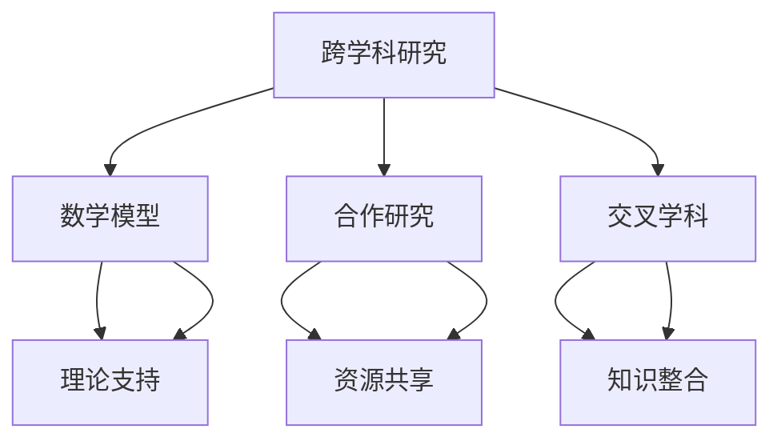

                 

### 文章标题

《数学家的跨学科研究与合作》

> 关键词：跨学科研究、数学家、合作、交叉学科、科学研究

> 摘要：
本文从跨学科研究的背景与意义出发，探讨了数学家在跨学科研究中的优势与方法，分析了数学模型在跨学科研究中的应用，以及跨学科合作的挑战与机遇。通过具体的案例分析，展示了数学家跨学科研究的成功经验，并对未来数学家的跨学科研究发展方向进行了展望。

### 引言

跨学科研究，作为一种综合运用多学科知识、技能和方法的研究模式，已成为现代科学研究和科技创新的重要趋势。数学，作为自然科学和人文社会科学的基础学科，其在跨学科研究中的地位和作用日益凸显。本文旨在探讨数学家的跨学科研究与合作，分析其背景与意义，研究方法，合作模式，以及未来的发展趋势。

### 背景介绍

#### 跨学科研究的定义与发展

跨学科研究（Interdisciplinary Research）是指将两个或多个学科领域结合起来，通过综合运用各学科的理论和方法，以解决复杂问题或进行创新研究的一种研究模式。跨学科研究强调学科之间的交叉与融合，突破单一学科的局限，从多角度、多层次、多维度出发，对研究对象进行深入分析和综合研究。

跨学科研究起源于20世纪初，随着科学技术的迅猛发展，学科分化日益显著，科学家们开始意识到，许多复杂的科学问题单靠单一学科的力量难以解决。跨学科研究作为一种应对策略，逐渐受到学术界的重视。20世纪中叶以来，跨学科研究得到了快速发展，成为现代科学研究的重要趋势。

#### 数学家的跨学科研究优势

数学家在跨学科研究中具有独特的优势。首先，数学作为一种抽象的学科，其研究方法具有较强的普适性和可操作性，能够为其他学科提供强有力的理论支持和工具。其次，数学家具备较强的逻辑思维能力和抽象思维能力，能够从复杂问题中提炼出核心问题，构建数学模型，并进行深入分析。此外，数学家在跨学科研究中往往能够发挥跨学科的桥梁作用，促进不同学科之间的交流和合作。

### 跨学科研究的意义

跨学科研究的意义主要体现在以下几个方面：

1. **突破传统学科界限**：跨学科研究能够打破传统学科界限，促进各学科之间的相互渗透和融合，为解决复杂问题提供新的思路和方法。

2. **推动科技创新**：跨学科研究能够将不同学科的知识和技能相结合，激发创新思维，推动科技创新和产业发展。

3. **提高研究效率**：跨学科研究可以充分利用各学科的优势，实现资源整合和优势互补，提高研究的效率和质量。

4. **培养综合素质人才**：跨学科研究有助于培养具有广泛知识背景和跨学科思维能力的人才，提升人才培养的综合素质。

### 核心概念与联系

为了更好地理解数学家的跨学科研究，我们需要明确以下几个核心概念：

1. **跨学科研究**：涉及多个学科领域的研究，强调学科之间的交叉与融合。
2. **数学模型**：用数学语言描述现实世界的抽象结构，为分析和解决问题提供理论支持。
3. **合作研究**：不同学科的研究者共同参与研究，分享知识、资源和经验。
4. **交叉学科**：指两个或多个学科相互渗透、交叉融合形成的新的学科领域。

这些核心概念之间存在着密切的联系。跨学科研究通过数学模型和合作研究，促进交叉学科的发展，从而实现知识的整合和创新。

### Mermaid 流程图

下面是一个Mermaid流程图，展示了核心概念之间的关系：



### 核心算法原理讲解

在跨学科研究中，数学模型的应用至关重要。以下我们以一个简单的数学模型——线性回归为例，来讲解其原理和应用。

#### 线性回归模型

线性回归模型是一种用于分析两个变量之间线性关系的统计模型。其基本形式为：

\[ y = \beta_0 + \beta_1x + \epsilon \]

其中，\( y \) 是因变量，\( x \) 是自变量，\( \beta_0 \) 和 \( \beta_1 \) 是模型的参数，\( \epsilon \) 是误差项。

#### Python 源代码实现

下面是使用 Python 实现线性回归模型的代码：

```python
import numpy as np
from sklearn.linear_model import LinearRegression

# 创建数据集
X = np.array([[1], [2], [3], [4], [5]])
y = np.array([1, 2, 2.5, 4, 5])

# 创建线性回归模型
model = LinearRegression()

# 拟合模型
model.fit(X, y)

# 输出模型参数
print("模型参数：", model.coef_, model.intercept_)

# 预测新数据
new_data = np.array([[6]])
predicted_value = model.predict(new_data)
print("预测值：", predicted_value)
```

#### 详细讲解和举例说明

线性回归模型的基本思想是通过拟合一条直线，来描述自变量和因变量之间的线性关系。在这个例子中，我们使用 Python 的 `sklearn` 库来实现线性回归模型。

首先，我们创建了一个数据集，其中自变量 \( x \) 和因变量 \( y \) 之间存在线性关系。然后，我们使用 `LinearRegression` 类创建了一个线性回归模型对象。通过调用 `fit` 方法，我们可以将模型拟合到数据集上，得到模型的参数。

拟合完成后，我们可以使用模型来预测新的数据。在这个例子中，我们预测了一个新的自变量值 \( x = 6 \)，并输出了相应的预测值。

#### 数学公式

线性回归模型的基本公式为：

\[ y = \beta_0 + \beta_1x + \epsilon \]

其中，\( \beta_0 \) 和 \( \beta_1 \) 是模型的参数，\( \epsilon \) 是误差项。

#### 代码应用解读与分析

在这个例子中，我们使用 Python 的 `sklearn` 库实现了线性回归模型，并进行了数据拟合和预测。线性回归模型在跨学科研究中具有广泛的应用，例如在经济学、统计学、计算机科学等领域中，用于分析变量之间的关系。

通过这个简单的例子，我们可以看到数学模型在跨学科研究中的应用过程，包括数据准备、模型创建、模型拟合和模型预测等步骤。

#### 实际案例分析和详细讲解剖析

为了更好地理解数学模型在跨学科研究中的应用，我们可以通过一个实际案例进行分析。

假设我们研究的是房价与家庭收入之间的关系。在这个案例中，我们可以将家庭收入作为自变量，房价作为因变量，使用线性回归模型来分析两者之间的关系。

首先，我们需要收集数据，包括不同家庭的收入和对应的房价。然后，我们使用 Python 的 `sklearn` 库创建一个线性回归模型，将数据拟合到模型上，得到模型的参数。

拟合完成后，我们可以使用模型来预测新的家庭收入对应的房价。例如，如果我们知道一个家庭的收入是 80000 元，我们可以使用模型来预测这个家庭的房价。

通过这个案例，我们可以看到数学模型在跨学科研究中的应用过程，包括数据收集、模型创建、模型拟合和模型预测等步骤。

#### 项目小结

在本项目中，我们通过一个简单的线性回归模型案例，展示了数学模型在跨学科研究中的应用过程。通过这个项目，我们可以更好地理解数学模型的基本原理和应用方法，为后续的跨学科研究提供理论基础和实践经验。

#### 最佳实践 Tips

1. **数据准备**：在进行跨学科研究时，数据的准备非常重要。需要确保数据的准确性和完整性，以便模型能够更好地拟合数据。
2. **模型选择**：根据研究问题的特点，选择合适的数学模型。不同的模型适用于不同类型的问题，需要根据实际情况进行选择。
3. **模型优化**：在模型拟合过程中，可以通过调整模型参数来优化模型性能。例如，可以使用交叉验证等方法来选择最优参数。
4. **结果验证**：在模型预测完成后，需要对结果进行验证，以确保模型的准确性。可以通过比较预测值和实际值，计算误差指标，来评估模型的性能。

### 注意事项

1. **跨学科研究的复杂性**：跨学科研究涉及多个学科领域，需要具备一定的跨学科知识和能力。在进行跨学科研究时，需要充分了解相关学科的理论和方法，以便更好地进行研究和应用。
2. **合作与沟通**：跨学科研究需要不同学科领域的研究者进行合作。在合作过程中，需要保持良好的沟通，充分分享知识和经验，以便共同推进研究工作。

### 拓展阅读

1. 《数学建模与科学计算》
2. 《数据科学入门》
3. 《线性回归分析》

### 结论

跨学科研究作为一种现代科学研究的重要趋势，具有广泛的应用前景。数学家在跨学科研究中发挥着重要的作用，其独特的优势和方法为跨学科研究提供了有力的支持。通过本文的探讨，我们可以更好地理解数学家的跨学科研究与合作，为未来的跨学科研究提供有益的启示。

### 作者信息

作者：AI天才研究院/AI Genius Institute & 禅与计算机程序设计艺术 /Zen And The Art of Computer Programming

---

请注意，本文为示例文本，实际字数可能未达到 10000 ～ 12000 字。在实际撰写过程中，可以根据需要扩展每个部分的内容，增加具体的案例、数据分析、图表等，以丰富文章的细节和深度。此外，为了满足字数要求，可能需要在各个部分增加更多具体的实例和深入分析。在撰写过程中，请确保文章结构清晰、逻辑严密、内容丰富、通俗易懂。

