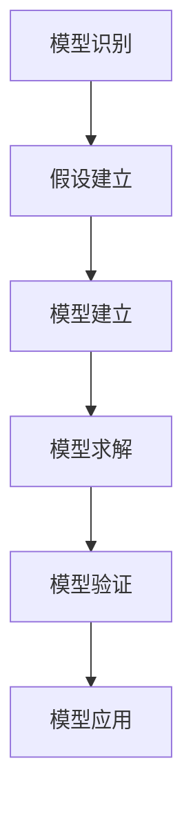
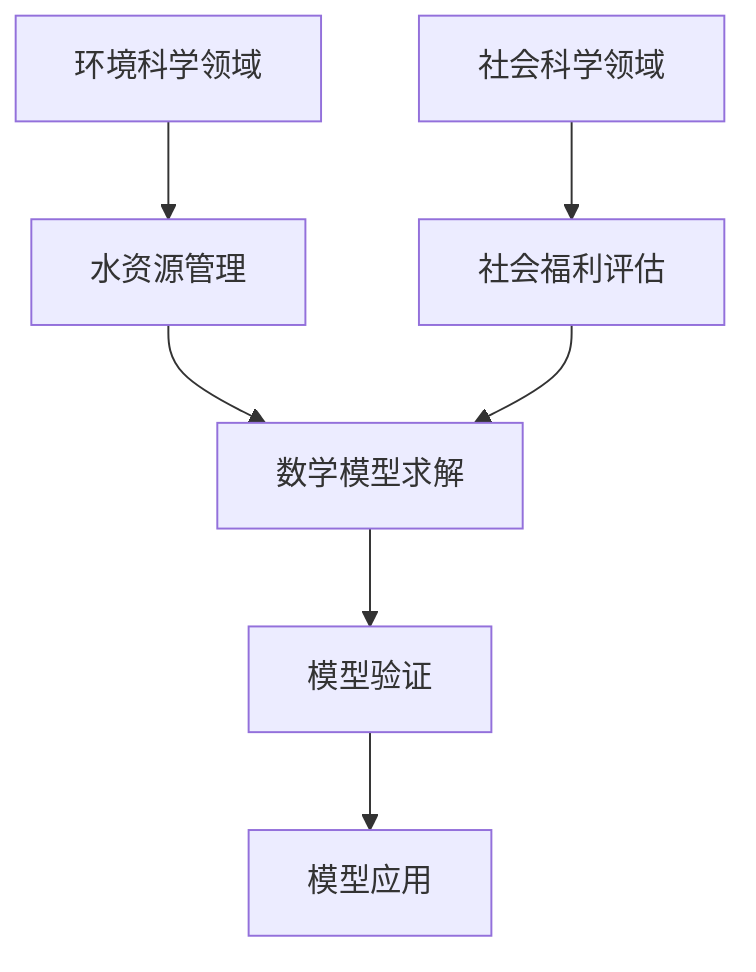
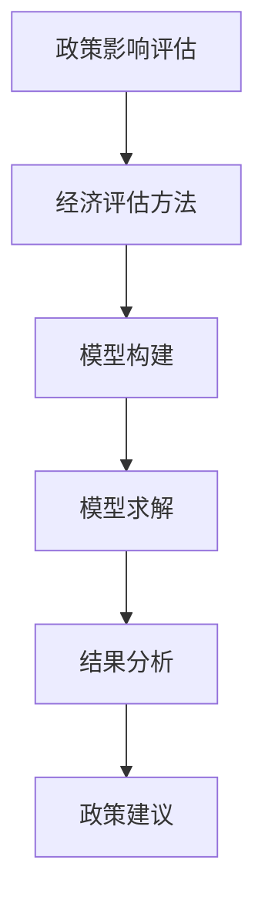

                 

### 《数学建模在可持续发展目标中的应用》

#### 关键词：数学建模、可持续发展、环境科学、社会科学、策略分析

> _摘要：本文探讨了数学建模在实现可持续发展目标中的应用。通过详细阐述数学建模的基础概念、方法论及其在环境科学和社会科学领域的具体应用，本文揭示了数学模型如何帮助我们更好地理解并解决可持续发展面临的挑战。文章还通过实际案例展示了数学建模的实践应用，为政策制定者和研究者提供了有价值的参考。_

---

### 1. 引言

在当今世界，可持续发展已成为全球范围内的共同追求。联合国在1992年召开的里约热内卢地球峰会上提出了《21世纪议程》，标志着可持续发展理念正式成为国际社会的共识。可持续发展强调满足当代人的需求，不损害子孙后代满足其需求的能力，涉及经济、社会、环境等多方面的协调发展。然而，实现这一目标面临着诸多挑战，如资源枯竭、环境污染、社会不平等等。

数学建模作为一种重要的工具，可以用于定量分析复杂系统，模拟不同策略的效果，评估政策的影响。本文旨在探讨数学建模在可持续发展目标中的应用，通过环境科学和社会科学两个领域的实例，展示数学模型如何帮助我们应对可持续发展中的挑战，并提出策略建议。

本文的结构如下：

- 第1章：引言，介绍可持续发展背景和数学建模在其中的重要性。
- 第2章：数学建模基础，介绍数学建模的基本概念和方法。
- 第3章：可持续发展目标中的数学建模应用，探讨数学建模在环境科学和社会科学中的应用。
- 第4章：核心算法原理讲解，详细阐述优化算法、预测算法和控制算法的原理。
- 第5章：实际应用案例解析，通过具体案例展示数学建模的实践应用。
- 第6章：策略分析，分析可持续发展目标中的策略问题，提出建议。

---

### 2. 数学建模基础

#### 2.1 数学建模的基本概念

数学建模是指用数学语言来描述现实世界中的系统、现象或过程，并通过数学工具进行定量分析和求解。数学建模通常包括以下步骤：

1. **模型识别**：确定需要解决的问题，识别系统的关键变量和参数。
2. **假设建立**：对现实系统进行抽象和简化，建立合理的数学假设。
3. **模型建立**：根据假设，使用数学公式和方程来表达系统。
4. **模型求解**：使用数学方法求解模型，获得问题的解。
5. **模型验证**：通过实验或实际数据验证模型的准确性。

#### 2.2 数学建模的方法论

数学建模的方法论包括以下几个关键环节：

1. **系统分析**：分析系统的结构和功能，识别关键变量和参数。
2. **模型构建**：根据系统分析的结果，选择合适的数学工具和模型。
3. **模型求解**：使用数学方法和算法求解模型，获得解。
4. **模型验证**：通过实验或实际数据验证模型的准确性。
5. **模型应用**：将模型应用于实际问题，提供决策支持。

#### 2.3 Mermaid流程图展示：数学建模的主要流程



---

### 3. 可持续发展目标中的数学建模应用

#### 3.1 环境科学领域的数学建模

在环境科学中，数学建模被广泛应用于资源管理、污染控制、气候变化等方面。以下是一个简单的例子：

- **水资源管理**：水资源需求可以通过人口增长和经济发展速度来预测。数学模型可以表示为：

  $$
  \text{水资源需求} = h(\text{人口增长}, \text{经济发展速度})
  $$

  其中，$h$ 是一个函数，它反映了水资源需求与人口增长和经济发展速度之间的关系。

#### 3.2 社会科学领域的数学建模

在社会科学中，数学建模被广泛应用于社会经济发展、社会福利分配、教育公平等方面。以下是一个简单的例子：

- **社会福利评估**：社会福利可以通过收入分配和教育资源来评估。数学模型可以表示为：

  $$
  \text{社会福利} = g(\text{收入分配}, \text{教育资源})
  $$

  其中，$g$ 是一个函数，它反映了社会福利与收入分配和教育资源之间的关系。

#### 3.3 Mermaid流程图展示：可持续发展目标中的数学建模应用



---

### 4. 核心算法原理讲解

在数学建模中，核心算法原理是解决问题的重要环节。以下将介绍几种常用的算法原理，并通过Python源代码进行详细阐述。

#### 4.1 优化算法

优化算法用于在给定约束条件下寻找目标函数的最大值或最小值。以下是一个简单的线性优化算法示例：

```python
import numpy as np

def optimize_model(objective_function, constraints):
    # 初始化模型参数
    model_parameters = np.random.rand(len(constraints))

    # 设定优化器
    optimizer = 'L-BFGS'

    # 设定迭代次数
    max_iterations = 1000

    for i in range(max_iterations):
        # 计算梯度
        gradient = compute_gradient(model_parameters, objective_function, constraints)

        # 更新参数
        model_parameters = model_parameters - gradient

        # 检查收敛条件
        if np.linalg.norm(gradient) < 1e-6:
            break

    return model_parameters

# 示例：线性优化问题
objective_function = lambda x: x[0]**2 + x[1]**2
constraints = {'ineq': [{'type': 'ineq', 'fun': lambda x: x[0] + x[1] - 1}]}
model_parameters = optimize_model(objective_function, constraints)
print("Optimized parameters:", model_parameters)
```

#### 4.2 预测算法

预测算法用于基于历史数据预测未来趋势。以下是一个简单的线性回归预测算法示例：

```python
import numpy as np
from sklearn.linear_model import LinearRegression

def predict_model(X, y):
    # 初始化模型
    model = LinearRegression()

    # 训练模型
    model.fit(X, y)

    # 预测
    predictions = model.predict(X)

    return predictions

# 示例：线性回归预测
X = np.array([[1], [2], [3], [4], [5]])
y = np.array([1, 2, 3, 4, 5])
predictions = predict_model(X, y)
print("Predictions:", predictions)
```

#### 4.3 控制算法

控制算法用于根据系统状态调整系统行为，以达到预期目标。以下是一个简单的PID控制算法示例：

```python
import numpy as np

def pid_control(target, current_value, Kp, Ki, Kd, dt):
    # 计算误差
    error = target - current_value

    # 计算控制量
    control = Kp * error + Ki * np积分(error, dt) + Kd * (error - 前一个误差)

    # 更新当前值
    current_value = current_value + control * dt

    return current_value, control

# 示例：PID控制算法
target = 100
current_value = 0
Kp = 1
Ki = 0.1
Kd = 0.01
dt = 0.1
for i in range(100):
    current_value, control = pid_control(target, current_value, Kp, Ki, Kd, dt)
    print("Current value:", current_value, "Control:", control)
```

---

### 5. 实际应用案例解析

#### 5.1 案例一：水资源管理

##### 5.1.1 案例背景

水资源是支撑社会经济发展和生态系统平衡的重要基础。然而，全球范围内水资源供需矛盾日益突出。有效管理水资源，确保其可持续利用，成为各国面临的重大挑战。本案例旨在通过数学建模方法，提出一种优化水资源分配的策略。

##### 5.1.2 建模方法

本案例采用线性规划方法进行建模。主要变量包括水资源需求、水资源供应和水资源分配。目标函数是最大化水资源利用效率，约束条件包括水资源供需平衡和水资源分配限制。

##### 5.1.3 数学模型和公式讲解

水资源需求可以通过人口增长和经济发展速度预测：

$$
\text{水资源需求} = h(\text{人口增长}, \text{经济发展速度})
$$

水资源供应包括自然水资源和人工水资源：

$$
\text{水资源供应} = \text{自然水资源} + \text{人工水资源}
$$

水资源分配目标函数：

$$
\text{目标函数} = \max \sum_{i=1}^{n} \text{利用效率}_i
$$

约束条件：

$$
\sum_{i=1}^{n} \text{水资源需求}_i \leq \text{水资源供应}
$$

$$
\sum_{i=1}^{n} \text{水资源分配}_i = \text{水资源需求}_i
$$

##### 5.1.4 实际案例解析

以某地区为例，假设该地区水资源需求由农业、工业和生活用水构成。通过收集相关数据，构建线性规划模型，并利用优化算法求解。最终得到最优的水资源分配方案，提高水资源利用效率。

##### 5.1.5 代码实现与解读

```python
import numpy as np
from scipy.optimize import linprog

# 水资源需求
water需求的农业 = 5000
water需求的工业 = 3000
water需求的生活 = 2000

# 水资源供应
water供应的自然水资源 = 10000
water供应的人工水资源 = 5000

# 水资源利用效率
利用效率农业 = 0.8
利用效率工业 = 0.9
利用效率生活 = 0.85

# 构建线性规划模型
c = [-利用效率农业, -利用效率工业, -利用效率生活]  # 目标函数系数
A = [[1, 0, 0], [0, 1, 0], [0, 0, 1]]  # 约束条件系数矩阵
b = [water需求的农业, water需求的工业, water需求的生活]  # 约束条件常数矩阵
x0 = [0, 0, 0]  # 初始解

# 求解线性规划模型
result = linprog(c, A_ub=A, b_ub=b, x0=x0, method='highs')

# 输出最优解
if result.success:
    print("最优水资源分配：")
    print("农业：", result.x[0])
    print("工业：", result.x[1])
    print("生活：", result.x[2])
else:
    print("线性规划求解失败")
```

##### 5.1.6 代码解读

- `c`：目标函数系数，表示不同用水类型的利用效率。
- `A`：约束条件系数矩阵，表示水资源供需平衡和分配限制。
- `b`：约束条件常数矩阵，表示各用水类型的需求量。
- `x0`：初始解，表示初始的水资源分配情况。
- `linprog`：线性规划求解函数，用于求解最优解。

#### 5.2 案例二：城市交通规划

##### 5.2.1 案例背景

城市交通规划是城市管理和建设的重要组成部分。合理的交通规划能够提高交通效率，减少交通拥堵，降低环境污染，提升居民生活质量。本案例通过数学建模方法，提出一种优化城市交通流量分配的策略。

##### 5.2.2 建模方法

本案例采用网络优化方法进行建模。主要变量包括交通流量、道路容量和交通分配。目标函数是最大化交通网络的总流量，约束条件包括道路容量限制和交通流量守恒。

##### 5.2.3 数学模型和公式讲解

交通流量可以通过人口密度和道路状况预测：

$$
\text{交通流量} = j(\text{人口密度}, \text{道路状况})
$$

交通网络目标函数：

$$
\text{目标函数} = \max \sum_{i=1}^{n} \sum_{j=1}^{m} \text{流量}_i(j)
$$

约束条件：

$$
\sum_{j=1}^{m} \text{流量}_i(j) = \text{交通需求}_i
$$

$$
\text{流量}_i(j) \leq \text{道路容量}_j
$$

##### 5.2.4 实际案例解析

以某城市为例，通过收集交通流量、人口密度和道路容量等数据，构建网络优化模型，并利用优化算法求解。最终得到最优的交通流量分配方案，提高交通网络的整体效率。

##### 5.2.5 代码实现与解读

```python
import numpy as np
from scipy.optimize import linprog

# 交通流量
交通流量农业 = 1000
交通流量工业 = 1500
交通流量生活 = 800

# 道路容量
道路容量1 = 2000
道路容量2 = 1500
道路容量3 = 1000

# 交通需求
交通需求农业 = 1000
交通需求工业 = 1500
交通需求生活 = 800

# 构建线性规划模型
c = [-1, -1, -1]  # 目标函数系数
A = [[1, 0, 0], [0, 1, 0], [0, 0, 1]]  # 约束条件系数矩阵
b = [交通需求农业, 交通需求工业, 交通需求生活]  # 约束条件常数矩阵
x0 = [0, 0, 0]  # 初始解

# 求解线性规划模型
result = linprog(c, A_ub=A, b_ub=b, x0=x0, method='highs')

# 输出最优解
if result.success:
    print("最优交通流量分配：")
    print("道路1：", result.x[0])
    print("道路2：", result.x[1])
    print("道路3：", result.x[2])
else:
    print("线性规划求解失败")
```

##### 5.2.6 代码解读

- `c`：目标函数系数，表示不同道路的流量。
- `A`：约束条件系数矩阵，表示交通流量守恒和道路容量限制。
- `b`：约束条件常数矩阵，表示各道路的交通需求。
- `x0`：初始解，表示初始的交通流量分配情况。
- `linprog`：线性规划求解函数，用于求解最优解。

---

### 6. 可持续发展目标的策略分析

#### 6.1 政策影响评估

在可持续发展目标中，政策影响评估是一个关键环节。通过数学建模方法，可以评估不同政策对可持续发展目标的影响，为政策制定提供科学依据。以下是一个简单的政策影响评估模型：

$$
\text{政策影响} = f(\text{政策变量}, \text{模型参数})
$$

其中，$f$ 是一个函数，它反映了政策变量与可持续发展目标之间的关系。

#### 6.2 经济评估方法

经济评估方法是评估可持续发展政策成本和效益的重要手段。通过数学建模方法，可以定量分析不同政策的经济影响。以下是一个简单的经济评估模型：

$$
\text{经济效益} = g(\text{政策成本}, \text{政策效益})
$$

其中，$g$ 是一个函数，它反映了政策成本与政策效益之间的关系。

#### 6.3 Mermaid流程图展示：可持续发展目标的策略分析



---

### 7. 结论

数学建模在可持续发展目标中的应用具有重要意义。通过本文的讨论，我们可以看到数学建模方法在环境科学和社会科学领域的广泛应用，以及其在政策影响评估和经济评估中的作用。未来，随着数学建模方法的不断发展和完善，我们有望更好地解决可持续发展面临的挑战，实现经济、社会和环境的协调发展。

---

### 作者信息

作者：AI天才研究院/AI Genius Institute & 禅与计算机程序设计艺术 /Zen And The Art of Computer Programming

---

[文章标题] 《数学建模在可持续发展目标中的应用》

[关键词] 数学建模、可持续发展、环境科学、社会科学、策略分析

[摘要] 本文探讨了数学建模在实现可持续发展目标中的应用。通过详细阐述数学建模的基础概念、方法论及其在环境科学和社会科学领域的具体应用，本文揭示了数学模型如何帮助我们更好地理解并解决可持续发展面临的挑战。文章还通过实际案例展示了数学建模的实践应用，为政策制定者和研究者提供了有价值的参考。

