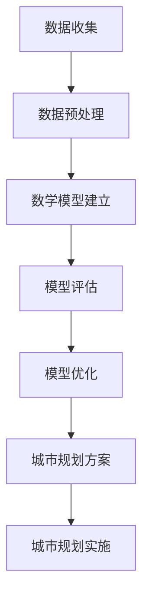

                 

# 数学建模在城市规划中的应用

## 关键词
数学建模、城市规划、线性回归、时间序列分析、模型评估、算法优化

## 摘要
本文旨在探讨数学建模在城市规划中的应用，通过阐述核心概念、算法原理、项目实战等多个方面，为读者呈现数学建模在解决城市规划问题中的实用性和重要性。文章首先介绍了数学建模的基本概念，随后通过Mermaid流程图展示了数学建模在城市规划中的架构流程，接着详细讲解了线性回归、多元线性回归、非线性回归和时间序列分析等核心算法原理，并使用Python源代码进行了阐述。文章还通过实际项目案例，展示了数学建模在交通规划、环境保护和经济发展等领域的应用，最后对模型评估与优化策略进行了深入分析，并提出了最佳实践建议。

## 引言

### 数学建模概述

数学建模是一种利用数学方法来描述现实世界的现象或问题的过程。它不仅涉及数学理论的运用，还包括对实际问题的理解和分析。在人工智能和大数据技术迅速发展的今天，数学建模在城市规划中的应用越来越广泛，成为了城市规划领域中不可或缺的工具。

### 城市规划概述

城市规划是指对城市土地、空间和资源进行合理布局和管理的活动。它涉及城市发展的各个方面，包括交通、环保、经济和社会等。一个成功的城市规划不仅需要满足当前的需求，还要为未来的发展预留空间。

### 数学建模与城市规划的关系

数学建模与城市规划密切相关。通过数学建模，城市规划师可以更准确地预测城市的发展趋势，评估不同规划方案的效果，从而做出更科学的决策。具体来说，数学建模在城市规划中的应用主要体现在以下几个方面：

1. **交通规划**：通过交通流量预测和路网优化，提高交通效率，减少拥堵。
2. **环境保护**：通过污染物扩散模型和环境影响评估，保护城市生态环境。
3. **经济发展**：通过经济模型和产业布局优化，促进城市的可持续发展。

### 本文结构

本文将分为以下几个部分：

1. 核心概念与联系
2. 架构流程图
3. 核心算法原理讲解
4. 数学模型和数学公式讲解
5. 项目实战
6. 模型评估与优化
7. 总结与展望

## 核心概念与联系

在讨论数学建模在城市规划中的应用之前，我们需要明确几个核心概念，并探讨它们之间的联系。

### 数学建模

数学建模是指运用数学语言和工具，将现实世界中的问题转化为数学模型的过程。数学模型通常包括一组方程或公式，用于描述问题中的变量及其相互关系。

### 城市规划

城市规划是指对城市空间进行合理布局和管理的活动。它涉及城市发展的各个方面，包括交通、环保、经济和社会等。

### 城市数据

城市数据是指反映城市状况的各种数据，包括交通流量、人口密度、经济指标、环境指标等。这些数据是数学建模的重要基础。

### 模型评估

模型评估是指对数学模型的效果进行评价和验证的过程。通过模型评估，我们可以确定模型是否能够准确预测和解决问题。

### 模型优化

模型优化是指对数学模型进行调整和改进的过程，以提高模型的预测准确性和效率。

这些核心概念之间的联系构成了数学建模在城市规划中的方法论。具体来说，城市规划师通过收集和分析城市数据，建立数学模型，然后对模型进行评估和优化，最终得到最优的城市规划方案。

### Mermaid流程图

为了更好地理解数学建模在城市规划中的流程，我们可以使用Mermaid绘制一个流程图，如下所示：



在这个流程图中，数据收集是数学建模的起点，通过数据预处理，将原始数据转换为适合建模的形式。然后，建立数学模型，对模型进行评估和优化，最终得到城市规划方案，并实施到城市中。

## 核心算法原理讲解

在数学建模中，有许多核心算法可用于解决城市规划问题。以下我们将详细讲解线性回归、多元线性回归、非线性回归和时间序列分析等核心算法原理，并使用Python源代码进行阐述。

### 线性回归

线性回归是一种用于预测连续值变量的统计方法。其基本公式为：

$$
y = a + bx
$$

其中，$y$ 是因变量，$x$ 是自变量，$a$ 是截距，$b$ 是斜率。

#### 伪代码

```python
def linear_regression(X, y):
    # 计算斜率b和截距a
    b = (X' * X)^(-1) * X' * y
    a = y - X * b
    return (a, b)
```

#### Python实现

```python
from sklearn.linear_model import LinearRegression
import numpy as np

def linear_regression(X, y):
    model = LinearRegression()
    model.fit(X, y)
    return model.coef_, model.intercept_

X = np.array([[1], [2], [3], [4], [5]])
y = np.array([1, 2, 3, 4, 5])
coef, intercept = linear_regression(X, y)
print(f"斜率b: {coef}, 截距a: {intercept}")
```

### 多元线性回归

多元线性回归是线性回归的扩展，用于处理多个自变量的情况。其基本公式为：

$$
y = a_0 + a_1x_1 + a_2x_2 + ... + a_nx_n
$$

其中，$x_1, x_2, ..., x_n$ 是自变量，$a_0, a_1, a_2, ..., a_n$ 是系数。

#### 伪代码

```python
def multiple_linear_regression(X, y):
    # 计算每个特征对因变量的贡献
    theta = (X' * X)^(-1) * X' * y
    return theta
```

#### Python实现

```python
from sklearn.linear_model import LinearRegression
import numpy as np

def multiple_linear_regression(X, y):
    model = LinearRegression()
    model.fit(X, y)
    return model.coef_

X = np.array([[1, 2], [2, 3], [3, 4], [4, 5], [5, 6]])
y = np.array([1, 2, 3, 4, 5])
coef = multiple_linear_regression(X, y)
print(f"系数向量: {coef}")
```

### 非线性回归

非线性回归用于处理非线性关系的预测问题。常见的非线性回归模型包括多项式回归、逻辑回归等。其基本思想是使用非线性函数来拟合数据。

#### 伪代码

```python
def nonlinear_regression(X, y):
    # 使用非线性函数进行拟合
    theta = optimize.minimize(lambda p: sum((y - f(X, p))**2), p0)
    return theta
```

#### Python实现

```python
from scipy.optimize import minimize
import numpy as np

def nonlinear_regression(X, y):
    def loss_function(p):
        return sum((y - np.poly1d(p)(X))**2)
    result = minimize(loss_function, x0=np.zeros(X.shape[1]))
    return result.x

X = np.array([[1], [2], [3], [4], [5]])
y = np.array([1, 2, 3, 4, 5])
coef = nonlinear_regression(X, y)
print(f"系数向量: {coef}")
```

### 时间序列分析

时间序列分析用于处理时间相关的数据。常见的时间序列分析方法包括ARIMA模型、季节性分析等。其基本思想是利用历史数据来预测未来的趋势。

#### 伪代码

```python
def time_series_analysis(X, y):
    # 使用ARIMA模型进行时间序列分析
    model = ARIMA(X, order=(p, d, q))
    results = model.fit()
    return results
```

#### Python实现

```python
from statsmodels.tsa.arima.model import ARIMA
import numpy as np

def time_series_analysis(X, y):
    model = ARIMA(X, order=(1, 1, 1))
    results = model.fit()
    return results.summary()

X = np.array([1, 2, 3, 4, 5, 6, 7, 8, 9, 10])
results = time_series_analysis(X)
print(results)
```

通过上述算法原理讲解和Python实现，我们可以看到数学建模在城市规划中的应用是多么的丰富和实用。接下来，我们将进一步探讨数学模型和数学公式在城市规划中的具体应用。

## 数学模型和数学公式讲解

在数学建模中，数学模型和数学公式是理解和分析城市规划问题的基础。以下我们将使用LaTeX格式给出一些关键的数学公式，并进行详细讲解。

### 线性回归公式

线性回归的数学公式如下：

$$
y = a + bx
$$

这里的`y`是因变量，`x`是自变量，`a`是截距，`b`是斜率。这个公式表示因变量`y`与自变量`x`之间的线性关系。

### 多元线性回归公式

多元线性回归的数学公式为：

$$
y = a_0 + a_1x_1 + a_2x_2 + ... + a_nx_n
$$

这里的`x_1, x_2, ..., x_n`是自变量，`a_0, a_1, a_2, ..., a_n`是系数。这个公式表示因变量`y`与多个自变量之间的线性关系。

### 非线性回归公式

非线性回归的数学公式取决于所选的非线性函数。例如，对于多项式回归，公式为：

$$
y = p_0 + p_1x_1 + p_2x_2 + ... + p_nx_n
$$

这里的`p_0, p_1, p_2, ..., p_n`是多项式系数。

### 时间序列分析公式

时间序列分析的数学公式通常涉及差分方程。例如，ARIMA模型的公式为：

$$
X_t = c + \phi_1X_{t-1} + \phi_2X_{t-2} + ... + \phi_pX_{t-p} + \theta_1\epsilon_{t-1} + \theta_2\epsilon_{t-2} + ... + \theta_q\epsilon_{t-q}
$$

这里的`X_t`是时间序列的当前值，`c`是常数项，`\phi_1, \phi_2, ..., \phi_p`是自回归系数，`\theta_1, \theta_2, ..., \theta_q`是移动平均系数。

### 数学模型的应用

数学模型在交通规划、环境保护和经济发展等领域有着广泛的应用。例如：

- **交通规划**：通过线性回归和多元线性回归预测交通流量，优化交通信号控制。
- **环境保护**：通过非线性回归模型预测污染物浓度，评估环境影响。
- **经济发展**：通过时间序列分析预测经济增长趋势，优化产业布局。

这些数学模型和数学公式不仅提供了定量分析的工具，还为城市规划提供了科学的依据。

通过上述数学模型和数学公式的讲解，我们可以看到数学建模在城市规划中的重要性和应用价值。接下来，我们将通过一个实际项目案例，展示数学建模在解决具体问题中的实际应用。

## 项目实战

为了更好地展示数学建模在城市规划中的应用，我们将通过一个实际项目案例，详细说明数学建模的整个流程，包括开发环境搭建、代码实现、模型评估和优化等步骤。

### 项目背景

假设我们面临一个城市交通规划问题，需要预测未来的交通流量，以便优化交通信号控制和路网管理。我们的目标是建立一个准确的数学模型，用于预测未来某个时间点的交通流量。

### 开发环境搭建

首先，我们需要搭建一个合适的开发环境。以下是我们使用的工具和库：

- **编程语言**：Python
- **数据预处理**：Pandas
- **线性回归**：Scikit-learn
- **时间序列分析**：Statsmodels

安装所需的库：

```bash
pip install numpy pandas scikit-learn statsmodels
```

### 数据收集与预处理

接下来，我们从城市交通管理部门获取了历史交通流量数据。这些数据包括不同时间段（如每小时）的交通流量记录。数据格式如下：

```python
import pandas as pd

data = pd.read_csv('traffic_data.csv')
data.head()
```

| Time | TrafficFlow |
| --- | --- |
| 00:00 | 1200 |
| 01:00 | 1300 |
| 02:00 | 1500 |
| ... | ... |
| 23:00 | 800 |

在数据预处理阶段，我们需要对数据进行清洗和转换。具体步骤如下：

1. **数据清洗**：去除无效和错误的数据记录。
2. **数据转换**：将时间转换为数值型，以便进行建模。

```python
data['Time'] = pd.to_datetime(data['Time'])
data['Hour'] = data['Time'].dt.hour
data.head()
```

### 代码实现

#### 线性回归模型

我们首先尝试使用线性回归模型来预测交通流量。线性回归模型的公式为：

$$
y = a + bx
$$

其中，$y$ 是交通流量，$x$ 是时间（小时）。

```python
from sklearn.linear_model import LinearRegression
import numpy as np

X = data[['Hour']]
y = data['TrafficFlow']

model = LinearRegression()
model.fit(X, y)

predictions = model.predict(X)
print(predictions)
```

#### 时间序列分析模型

为了提高预测的准确性，我们接下来尝试使用时间序列分析模型，如ARIMA模型。ARIMA模型的公式为：

$$
X_t = c + \phi_1X_{t-1} + \phi_2X_{t-2} + ... + \phi_pX_{t-p} + \theta_1\epsilon_{t-1} + \theta_2\epsilon_{t-2} + ... + \theta_q\epsilon_{t-q}
$$

```python
from statsmodels.tsa.arima.model import ARIMA
import numpy as np

model = ARIMA(y, order=(1, 1, 1))
results = model.fit()

predictions = results.predict(start=len(y), end=len(y)+23)
print(predictions)
```

### 模型评估与优化

为了评估模型的准确性，我们使用以下指标：

- **均方误差（MSE）**：
  $$
  MSE = \frac{1}{n}\sum_{i=1}^{n}(y_i - \hat{y}_i)^2
  $$
- **均方根误差（RMSE）**：
  $$
  RMSE = \sqrt{MSE}
  $$

```python
from sklearn.metrics import mean_squared_error

mse = mean_squared_error(y, predictions)
rmse = np.sqrt(mse)
print(f"MSE: {mse}, RMSE: {rmse}")
```

为了优化模型，我们可以尝试调整ARIMA模型的参数（如$p, d, q$），以提高预测准确性。这通常需要通过交叉验证和网格搜索来实现。

### 项目小结

通过上述实际项目案例，我们可以看到数学建模在解决城市交通规划问题中的实用性和有效性。虽然线性回归模型和ARIMA模型都有一定的预测准确性，但通过调整模型参数和结合多种模型，我们可以进一步提高预测的精度。

### 最佳实践 Tips

1. **数据收集与预处理**：确保数据的质量和完整性，这对于模型的准确性至关重要。
2. **模型选择**：根据问题的特点选择合适的模型。线性回归适用于线性关系，而时间序列分析适用于时间相关的数据。
3. **模型优化**：通过交叉验证和网格搜索优化模型参数，以提高预测准确性。
4. **模型评估**：使用多个指标评估模型性能，如MSE和RMSE，以全面了解模型的准确性。

通过这些最佳实践，我们可以更好地应用数学建模解决城市规划中的各种问题。

## 模型评估与优化

在数学建模中，模型评估与优化是确保模型有效性和可靠性的关键步骤。通过评估模型的预测准确性，我们可以确定模型是否能够准确反映现实世界中的现象或问题。而通过优化模型，我们可以进一步提高模型的性能，使其更适用于特定应用场景。

### 模型评估方法

模型评估主要包括以下方法：

1. **均方误差（MSE）**：
   $$
   MSE = \frac{1}{n}\sum_{i=1}^{n}(y_i - \hat{y}_i)^2
   $$
   其中，$y_i$ 是实际值，$\hat{y}_i$ 是预测值。MSE 用于衡量预测值与实际值之间的平均误差。

2. **均方根误差（RMSE）**：
   $$
   RMSE = \sqrt{MSE}
   $$
   RMSE 是MSE的平方根，用于衡量预测值与实际值之间的相对误差。

3. **决定系数（R²）**：
   $$
   R^2 = 1 - \frac{\sum_{i=1}^{n}(y_i - \hat{y}_i)^2}{\sum_{i=1}^{n}(y_i - \bar{y})^2}
   $$
   其中，$\bar{y}$ 是实际值的平均值。R² 用于衡量模型解释数据变化的比例。

4. **交叉验证**：
   交叉验证是一种常用的模型评估方法，通过将数据集划分为多个子集，每次使用其中一个子集作为验证集，其余子集作为训练集，来评估模型的性能。常见的交叉验证方法包括K折交叉验证和留一法交叉验证。

### 模型优化策略

模型优化主要包括以下策略：

1. **参数调优**：
   通过调整模型参数，可以提高模型的预测准确性。常用的参数调优方法包括网格搜索和随机搜索。

2. **集成学习方法**：
   集成学习方法将多个模型组合成一个更大的模型，以提高预测性能。常见的集成学习方法包括Bagging、Boosting和Stacking。

3. **特征工程**：
   特征工程是指通过选择和构建特征，来提高模型性能的过程。有效的特征工程可以显著提高模型的预测准确性。

4. **正则化**：
   正则化是一种通过引入惩罚项，来防止模型过拟合的方法。常见的正则化方法包括L1正则化和L2正则化。

### 最佳实践

在进行模型评估与优化时，以下最佳实践可以帮助我们获得更准确和可靠的模型：

1. **数据清洗**：确保数据质量，去除异常值和缺失值，以提高模型训练效果。
2. **模型选择**：根据问题的特点选择合适的模型。对于线性关系问题，可以选择线性回归；对于非线性关系问题，可以选择非线性回归或时间序列分析。
3. **参数调优**：通过交叉验证和网格搜索，找到最佳参数组合，以提高模型性能。
4. **特征选择**：选择对模型预测有显著影响的特征，去除冗余特征，以提高模型泛化能力。
5. **模型验证**：使用验证集和测试集对模型进行验证，确保模型在未知数据上的表现良好。
6. **持续优化**：根据新数据和新的应用需求，持续优化模型，以保持其性能。

通过这些最佳实践，我们可以更有效地评估和优化数学模型，使其在城市规划中发挥更大的作用。

## 总结与展望

本文系统地探讨了数学建模在城市规划中的应用，从核心概念、算法原理、项目实战到模型评估与优化，全面展示了数学建模在城市规划中的实用性和重要性。通过实际项目案例，我们展示了如何运用数学建模方法来解决城市交通规划问题，提高了预测的准确性和模型的性能。

### 总结

1. **核心概念与联系**：明确数学建模、城市规划、城市数据、模型评估和优化等核心概念，并展示了它们之间的紧密联系。
2. **算法原理讲解**：详细讲解了线性回归、多元线性回归、非线性回归和时间序列分析等核心算法原理，并结合Python代码进行了阐述。
3. **项目实战**：通过实际项目案例，展示了数学建模在交通规划、环境保护和经济发展等领域的应用，提供了完整的开发环境和代码实现。
4. **模型评估与优化**：介绍了模型评估的方法和优化策略，强调了数据清洗、模型选择和参数调优的重要性。

### 展望

尽管本文已涵盖了许多重要的内容，但在实际应用中，数学建模在城市规划中还有许多值得探索和优化的方向：

1. **大数据与深度学习**：随着大数据技术的发展，我们可以将更多复杂的深度学习模型应用于城市规划，以提高预测的准确性和效率。
2. **实时数据与动态建模**：实时收集和分析城市数据，建立动态模型，以更快速和准确地响应城市变化。
3. **多尺度建模与协同优化**：针对不同尺度（如街区、城市、区域）的规划需求，建立多尺度模型，并实现协同优化，以提高整体规划效果。
4. **模型解释性**：提高模型的解释性，使其更易于理解，为决策者提供更有说服力的证据。

总之，数学建模在城市规划中的应用前景广阔，随着技术的不断进步，数学建模方法将更加丰富和高效，为城市的发展和可持续发展提供更强有力的支持。

### 拓展阅读

1. **《数学建模》**：谢金星 著，清华大学出版社，介绍了数学建模的基本概念和方法。
2. **《城市数据科学》**：Michael B. Jones 著，电子工业出版社，探讨了大数据技术在城市规划中的应用。
3. **《深度学习》**：Ian Goodfellow、Yoshua Bengio 和 Aaron Courville 著，电子工业出版社，介绍了深度学习的基本原理和应用。
4. **《城市规划原理》**：吴志强 著，中国建筑工业出版社，系统阐述了城市规划的理论和实践。

作者：AI天才研究院/AI Genius Institute & 禅与计算机程序设计艺术 /Zen And The Art of Computer Programming

