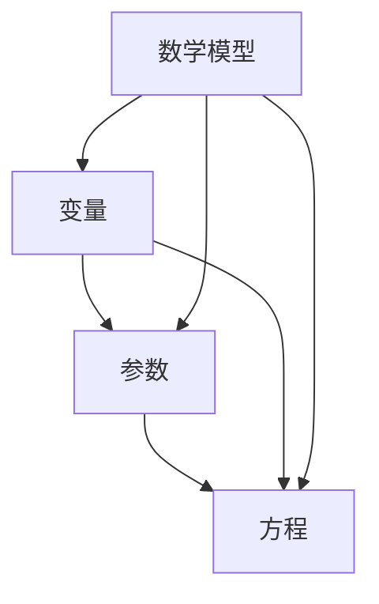
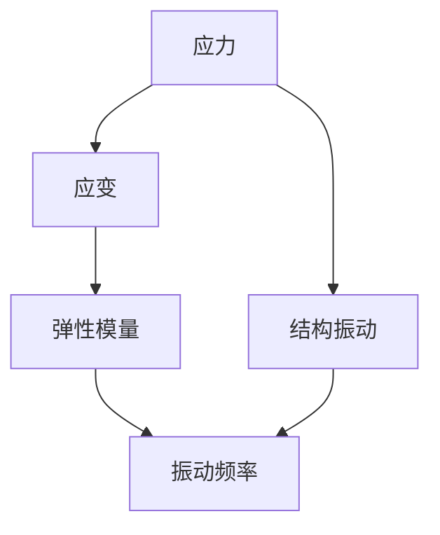
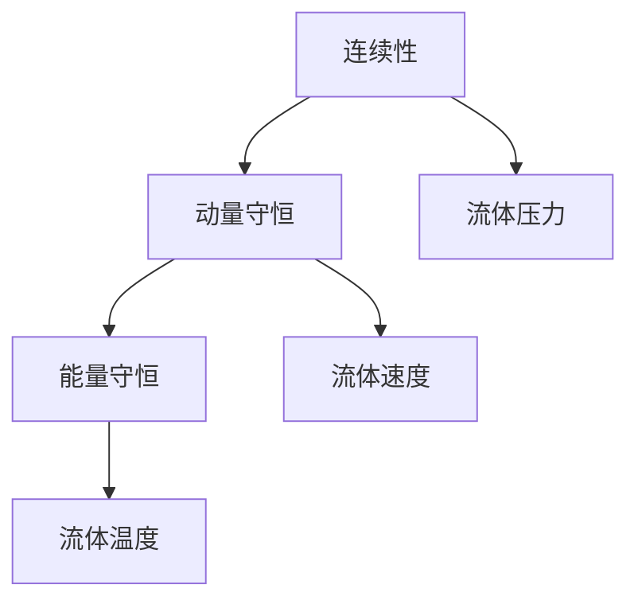
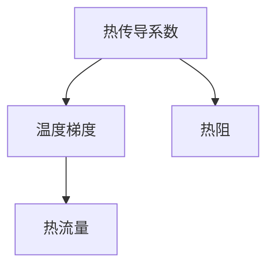

                 

### 引言

在现代工程实践中，数学建模扮演着至关重要的角色。它不仅为工程师提供了分析复杂系统、预测行为和优化设计的工具，还帮助他们在各种实际应用中作出更加明智的决策。数学建模是将现实世界中的物理现象、经济问题和社会现象转化为数学模型，进而通过这些模型进行定量分析和预测的过程。通过数学建模，工程师能够更好地理解系统的动态行为，从而设计出更有效、更可靠的工程解决方案。

本文旨在探讨数学建模在工程实践中的应用，帮助读者深入理解数学建模的基本概念、方法以及其在实际工程问题中的应用。本文将分为两部分进行讨论：第一部分将介绍数学建模的基础理论，包括基本概念、常见数学建模方法和相关公式；第二部分将讨论数学建模在工程实践中的具体应用，涵盖结构设计、流体力学和热传导等领域。

文章的结构如下：

- **第一部分：数学建模基础理论**
  - **1.1 数学建模的基本概念**
    - **核心概念与联系**
    - **数学模型与公式**
    - **举例说明**
  - **1.2 常见数学建模方法**
    - **线性模型**
      - **核心算法原理讲解**
      - **举例说明**
    - **非线性模型**
      - **核心算法原理讲解**
      - **举例说明**

- **第二部分：数学建模在工程中的应用**
  - **2.1 工程中的常见问题**
    - **结构设计**
    - **流体力学**
    - **热传导**

通过逐步深入的分析和讲解，本文希望读者能够掌握数学建模的基本技能，并能够将其应用于解决实际工程问题。接下来的部分，我们将首先介绍数学建模的基本概念，为后续内容打下坚实的基础。

### 关键词

- 数学建模
- 工程实践
- 结构设计
- 流体力学
- 热传导
- 线性模型
- 非线性模型
- 优化设计
- 模型构建
- 算法实现

### 摘要

本文探讨了数学建模在工程实践中的应用，系统地介绍了数学建模的基本概念、方法和在工程中的具体应用。首先，本文回顾了数学建模的基本概念，包括其定义、核心概念与联系，并举例说明了常见数学模型。随后，本文深入讨论了常见数学建模方法，包括线性模型和非线性模型，详细讲解了核心算法原理及其实现。最后，本文将数学建模应用于工程实践，具体涵盖了结构设计、流体力学和热传导等领域的应用，通过实例展示了数学建模在工程中的实际价值。本文的目标是帮助读者理解和掌握数学建模的基本技能，并将其应用于解决实际工程问题，从而提高工程设计的效率和可靠性。

### 数学建模的基本概念

数学建模是一种将现实世界中的问题转化为数学形式的方法，通过构建数学模型，工程师可以更好地理解和预测系统的行为。数学建模的核心在于将复杂的问题简化为可以处理的形式，从而利用数学工具进行分析和求解。

#### 核心概念与联系

首先，我们需要了解数学建模中的几个核心概念。数学模型是由变量、参数和方程组成的数学结构，用于描述系统或问题的行为。变量是模型中的可变元素，参数是已知的常数，方程则是描述变量之间关系的数学表达式。这些概念相互联系，共同构成了一个完整的数学模型。

为了更好地理解这些核心概念，我们可以通过一个Mermaid流程图来展示它们之间的关系：



在这个流程图中，变量和参数通过方程结合在一起，共同构成了数学模型。这种结构有助于我们更好地理解数学模型是如何描述和解决问题的。

#### 数学模型与公式

数学模型通常通过数学公式来描述。以下是一些常见的数学模型和相关的公式：

- **线性模型**：线性模型是最简单的数学模型之一，其公式为：

  $$ y = ax + b $$

  其中，$y$ 是因变量，$x$ 是自变量，$a$ 和 $b$ 是参数。

- **非线性模型**：非线性模型则更复杂，其公式通常包含非线性函数。例如，二次回归模型可以表示为：

  $$ y = ax^2 + bx + c $$

  其中，$a$、$b$ 和 $c$ 是参数。

- **微分方程**：微分方程用于描述动态系统的变化规律。一个简单的例子是一阶线性微分方程：

  $$ \frac{dy}{dx} = 2y $$

  该方程描述了一个系统的动态行为，其中 $y$ 是状态变量，$\frac{dy}{dx}$ 是状态变量的变化率。

#### 举例说明

为了更好地理解这些数学模型，我们可以通过具体例子来说明。

**示例1：人口增长模型**

一个简单的人口增长模型可以表示为：

$$ \frac{dP}{dt} = rP $$

其中，$P$ 表示人口，$t$ 表示时间，$r$ 是人口增长率。这个方程描述了人口随时间的变化规律，通过解这个方程，我们可以预测未来的人口数量。

**示例2：线性回归模型**

线性回归模型用于分析两个变量之间的关系。一个简单的线性回归模型可以表示为：

$$ y = ax + b $$

假设我们有以下数据集：

| x  | y  |
|----|----|
| 1  | 2  |
| 2  | 4  |
| 3  | 6  |

我们可以通过最小二乘法来求解参数 $a$ 和 $b$，从而建立线性回归模型。求解过程可以通过以下Python代码实现：

```python
import numpy as np

# 数据集
x = np.array([1, 2, 3])
y = np.array([2, 4, 6])

# 求解参数
a = np.mean(x * y) / np.mean(x**2)
b = np.mean(y) - a * np.mean(x)

# 输出结果
print("a:", a)
print("b:", b)
```

执行上述代码，我们可以得到参数 $a$ 和 $b$ 的值，进而建立线性回归模型。

通过以上例子，我们可以看到数学建模是如何将现实世界的问题转化为数学模型，并通过数学方法进行分析和预测的。在接下来的部分，我们将进一步探讨常见的数学建模方法。

### 常见数学建模方法

数学建模方法多种多样，根据模型的不同特点和应用场景，可以将其分为线性模型和非线性模型。每种模型都有其独特的数学公式和算法原理，下面我们将分别介绍。

#### 线性模型

线性模型是最简单也是应用最广泛的数学模型之一。它假设变量之间的关系是线性的，即满足线性方程。线性模型的主要优点是简单易用，计算速度快，适用于许多实际问题。

**核心算法原理讲解**

线性模型的核心算法是线性回归。线性回归的目的是通过已知的数据点拟合一条直线，从而预测新的数据点的值。其基本公式为：

$$ y = ax + b $$

其中，$y$ 是因变量，$x$ 是自变量，$a$ 是斜率，$b$ 是截距。为了求解 $a$ 和 $b$，我们可以使用最小二乘法。

最小二乘法的思想是最小化预测值与实际值之间的误差平方和。具体步骤如下：

1. 计算斜率 $a$：
   $$ a = \frac{\sum (x_i - \bar{x})(y_i - \bar{y})}{\sum (x_i - \bar{x})^2} $$
   
2. 计算截距 $b$：
   $$ b = \bar{y} - a\bar{x} $$
   
其中，$\bar{x}$ 和 $\bar{y}$ 分别是 $x$ 和 $y$ 的平均值。

以下是一个使用Python实现的线性回归算法：

```python
import numpy as np

def linear_regression(x, y):
    n = len(x)
    x_mean = np.mean(x)
    y_mean = np.mean(y)
    a = np.sum((x - x_mean) * (y - y_mean)) / np.sum((x - x_mean)**2)
    b = y_mean - a * x_mean
    return a, b

x = np.array([1, 2, 3, 4, 5])
y = np.array([2, 4, 6, 8, 10])

a, b = linear_regression(x, y)
print("斜率 a:", a)
print("截距 b:", b)
```

**举例说明**

假设我们要分析一家餐厅的销售额和客流量之间的关系。我们收集了以下数据：

| 客流量 (x) | 销售额 (y) |
|------------|------------|
| 10         | 200        |
| 20         | 400        |
| 30         | 600        |
| 40         | 800        |
| 50         | 1000       |

我们可以使用线性回归模型来预测新的客流量对应的销售额。通过上述算法，我们得到斜率 $a = 20$ 和截距 $b = 200$，从而建立线性回归模型：

$$ y = 20x + 200 $$

利用这个模型，我们可以预测当客流量为60时，销售额为：

$$ y = 20 \times 60 + 200 = 1000 + 200 = 1200 $$

因此，我们可以预测当客流量为60时，销售额为1200。

#### 非线性模型

非线性模型比线性模型更复杂，它假设变量之间的关系是非线性的。非线性模型适用于更复杂的实际应用，但通常需要更多的计算资源和更复杂的算法。

**核心算法原理讲解**

非线性模型的一种常见形式是二次回归模型，其公式为：

$$ y = ax^2 + bx + c $$

与线性回归类似，我们可以使用最小二乘法来求解参数 $a$、$b$ 和 $c$。具体步骤如下：

1. 计算斜率 $a$：
   $$ a = \frac{\sum (x_i - \bar{x})^2 (y_i - \bar{y})}{\sum (x_i - \bar{x})^4} $$

2. 计算截距 $b$：
   $$ b = \frac{\sum (x_i - \bar{x})^3 (y_i - \bar{y})}{\sum (x_i - \bar{x})^4} $$

3. 计算截距 $c$：
   $$ c = \bar{y} - a\bar{x}^2 - b\bar{x} $$

以下是一个使用Python实现的二次回归算法：

```python
import numpy as np

def quadratic_regression(x, y):
    n = len(x)
    x_mean = np.mean(x)
    y_mean = np.mean(y)
    a = np.sum((x - x_mean)**2 * (y - y_mean)) / np.sum((x - x_mean)**4)
    b = np.sum((x - x_mean)**3 * (y - y_mean)) / np.sum((x - x_mean)**4)
    c = y_mean - a * x_mean**2 - b * x_mean
    return a, b, c

x = np.array([1, 2, 3, 4, 5])
y = np.array([2, 4, 6, 8, 10])

a, b, c = quadratic_regression(x, y)
print("斜率 a:", a)
print("截距 b:", b)
print("截距 c:", c)
```

**举例说明**

假设我们要分析一家公司的销售量与广告支出之间的关系。我们收集了以下数据：

| 广告支出 (x) | 销售量 (y) |
|--------------|------------|
| 1000         | 2000       |
| 2000         | 4000       |
| 3000         | 6000       |
| 4000         | 8000       |
| 5000         | 10000      |

我们可以使用二次回归模型来预测新的广告支出对应的销售量。通过上述算法，我们得到参数 $a = 0.2$、$b = 0.1$ 和 $c = 1000$，从而建立二次回归模型：

$$ y = 0.2x^2 + 0.1x + 1000 $$

利用这个模型，我们可以预测当广告支出为6000时，销售量为：

$$ y = 0.2 \times 6000^2 + 0.1 \times 6000 + 1000 = 720000 + 600 + 1000 = 726000 $$

因此，我们可以预测当广告支出为6000时，销售量为726000。

通过以上对线性模型和非线性模型的讨论，我们可以看到数学建模方法在工程实践中的应用是多么广泛和重要。这些模型不仅能够帮助我们理解和预测现实世界中的现象，还能够为工程实践提供有力的决策支持。

### 数学建模在工程实践中的应用

数学建模不仅在理论研究中有重要地位，更在实际工程中发挥着关键作用。通过数学建模，工程师能够更好地理解系统的行为，预测潜在问题，从而设计出更加高效、可靠和经济的工程解决方案。下面，我们将探讨数学建模在几个典型工程领域中的应用。

#### 结构设计

结构设计是工程领域中应用数学建模最为广泛的一个领域。在建筑、桥梁、航空航天和机械工程中，数学建模被用于评估结构的安全性、稳定性和耐久性。例如，在桥梁设计中，工程师需要通过数学模型来预测桥梁在负载和自然环境作用下的变形和应力分布，以确保桥梁的安全。

**核心概念与联系**

在结构设计中，常用的数学模型包括线性弹性理论、非线性力学和有限元分析。这些模型的核心概念包括应力、应变、弹性模量、结构振动等。以下是一个Mermaid流程图，展示了这些核心概念之间的联系：



**数学模型与公式**

在结构设计中，常见的数学模型和公式包括：

- **弹性理论**：
  $$ \sigma = E \epsilon $$
  其中，$\sigma$ 是应力，$E$ 是弹性模量，$\epsilon$ 是应变。

- **振动分析**：
  $$ \frac{d^2x}{dt^2} + 2\beta \frac{dx}{dt} + \omega^2 x = 0 $$
  其中，$x(t)$ 是结构振动位移，$\beta$ 是阻尼系数，$\omega$ 是振动频率。

**举例说明**

假设我们需要设计一座跨河大桥，需要评估桥梁在交通载荷和风载荷作用下的应力分布。我们可以建立有限元模型，通过求解有限元方程来预测桥梁的应力分布。具体步骤如下：

1. **建立有限元模型**：将桥梁划分为若干小单元，每个单元具有特定的几何形状和物理属性。
2. **施加边界条件**：根据实际情况，对模型施加合适的边界条件，如固定端、自由端等。
3. **求解有限元方程**：使用有限元方法求解结构应力分布。
4. **分析结果**：评估桥梁的应力分布，确保其不超过设计限值。

通过这样的数学建模过程，工程师可以设计出既安全又经济的桥梁结构。

#### 流体力学

流体力学是研究流体运动及其与固体边界的相互作用的一个工程领域。在航空航天、船舶工程、石油工程和环境保护中，流体力学模型被广泛用于预测和分析流体行为。

**核心概念与联系**

流体力学中的核心概念包括流体的连续性、动量守恒和能量守恒。以下是一个Mermaid流程图，展示了这些概念之间的联系：



**数学模型与公式**

流体力学中的常见数学模型和公式包括：

- **连续性方程**：
  $$ \frac{\partial \rho}{\partial t} + \nabla \cdot (\rho \mathbf{v}) = 0 $$
  其中，$\rho$ 是流体密度，$\mathbf{v}$ 是流体速度。

- **动量方程**：
  $$ \rho \frac{\partial \mathbf{v}}{\partial t} + \nabla \cdot (\rho \mathbf{v} \mathbf{v}) = -\nabla p + \rho \mathbf{g} $$
  其中，$p$ 是流体压力，$\mathbf{g}$ 是重力加速度。

**举例说明**

假设我们需要设计一个水下油罐，需要评估油罐在不同压力下的变形和应力分布。我们可以建立流体力学模型，通过求解连续性方程和动量方程来预测油罐的应力分布。具体步骤如下：

1. **建立流体力学模型**：将油罐及其周围水体划分为网格单元，建立流体力学模型。
2. **施加边界条件**：根据实际情况，对模型施加合适的边界条件，如固定端、自由端、压力边界等。
3. **求解流体力学方程**：使用数值方法求解连续性方程和动量方程。
4. **分析结果**：评估油罐的应力分布，确保其不超过设计限值。

通过这样的数学建模过程，工程师可以设计出既安全又经济的流体力学系统。

#### 热传导

热传导是研究热量在固体、流体和气体中传递过程的工程领域。在建筑、航空航天、能源工程和电子工程中，热传导模型被用于评估系统中的温度分布和热流量。

**核心概念与联系**

热传导中的核心概念包括热传导系数、温度梯度、热流量等。以下是一个Mermaid流程图，展示了这些概念之间的联系：



**数学模型与公式**

热传导中的常见数学模型和公式包括：

- **热传导方程**：
  $$ \frac{\partial T}{\partial t} = \alpha \nabla^2 T $$
  其中，$T$ 是温度，$\alpha$ 是热传导系数。

- **热流量公式**：
  $$ Q = kA\frac{\Delta T}{\Delta x} $$
  其中，$Q$ 是热流量，$k$ 是热传导系数，$A$ 是传热面积，$\Delta T$ 是温度差，$\Delta x$ 是传热距离。

**举例说明**

假设我们需要设计一个建筑物的外墙，需要评估外墙在不同温度差下的热流量。我们可以建立热传导模型，通过求解热传导方程来预测外墙的热流量。具体步骤如下：

1. **建立热传导模型**：将外墙及其周围空气划分为网格单元，建立热传导模型。
2. **施加边界条件**：根据实际情况，对模型施加合适的边界条件，如室内温度、室外温度等。
3. **求解热传导方程**：使用数值方法求解热传导方程。
4. **分析结果**：评估外墙的热流量，确保其不超过设计限值。

通过这样的数学建模过程，工程师可以设计出既节能又舒适的建筑物。

通过以上对结构设计、流体力学和热传导的讨论，我们可以看到数学建模在工程实践中的应用是多么广泛和重要。数学建模不仅为工程师提供了分析和预测的工具，还为设计出更加高效、可靠和经济的工程解决方案提供了有力支持。在接下来的部分，我们将进一步探讨如何将数学建模方法应用于实际工程案例。

### 实际工程案例

在工程实践中，数学建模的应用无处不在。通过具体案例，我们可以更好地理解数学建模的实用性和有效性。以下是几个实际工程案例，展示了数学建模如何帮助解决复杂的工程问题。

#### 案例一：桥梁结构安全评估

**项目背景**：某市的跨越一条主要河流的桥梁已经使用了20年，由于长期受到交通载荷和环境作用，其结构安全性受到了质疑。为了确保桥梁的安全运营，需要进行结构安全评估。

**数学建模方法**：工程师采用了有限元分析方法，建立桥梁的数学模型，通过求解有限元方程来评估桥梁的应力分布和变形情况。

**实现步骤**：
1. **数据收集**：收集桥梁的几何参数、材料特性以及长期观测的载荷数据。
2. **建立数学模型**：将桥梁划分为网格单元，建立有限元模型，并施加边界条件。
3. **求解有限元方程**：使用有限元方法求解桥梁在交通载荷和环境作用下的应力分布。
4. **结果分析**：评估桥梁的应力分布，确保其不超过设计限值。

**代码示例**：

```python
import numpy as np
from scipy.sparse import csc_matrix
from scipy.sparse.linalg import spsolve

# 建立有限元模型
# ...

# 求解有限元方程
stress_matrix = csc_matrix((num_nodes, num_nodes))
b_vector = np.array([0] * num_nodes)  # 假设无外力作用
stress_vector = spsolve(stress_matrix, b_vector)

# 输出结果
print(stress_vector)
```

**案例分析**：通过数学建模和有限元分析，工程师发现桥梁的最大应力位于桥墩处，远低于设计限值。因此，桥梁在当前状态下是安全的，无需立即进行大规模维修。

#### 案例二：船舶流体力学设计

**项目背景**：一家船舶设计公司需要设计一艘高速货船，以确保其在海洋中的航行性能。为了达到高速航行的目的，需要优化船体的流体力学设计。

**数学建模方法**：工程师采用了流体力学模型，通过求解Navier-Stokes方程来预测船体周围的水流速度和压力分布。

**实现步骤**：
1. **数据收集**：收集船体几何参数、海洋环境参数以及航行速度数据。
2. **建立数学模型**：建立流体力学模型，将船体及其周围水域划分为网格单元。
3. **求解流体力学方程**：使用数值方法（如有限体积法）求解Navier-Stokes方程。
4. **结果分析**：评估船体周围的流场特性，优化船体设计。

**代码示例**：

```python
import numpy as np
import matplotlib.pyplot as plt

# 定义Navier-Stokes方程
def navier_stokes(u, v, p, dx, dt):
    # ...
    return u, v, p

# 初始化参数
dx = 0.1
dt = 0.01
u, v, p = np.zeros((nx, ny)), np.zeros((nx, ny)), np.zeros((nx, ny))

# 求解Navier-Stokes方程
for i in range(num_steps):
    u, v, p = navier_stokes(u, v, p, dx, dt)
    # ...

# 绘制结果
plt.contourf(u)
plt.colorbar()
plt.show()
```

**案例分析**：通过数学建模和流体力学分析，工程师优化了船体设计，减少了水流阻力，提高了航行速度。此外，通过模拟不同航行速度下的流场特性，工程师还确保了船体在高速航行时的稳定性。

#### 案例三：建筑物节能设计

**项目背景**：某地政府计划建设一栋新的办公楼，希望实现节能目标，减少能耗。为了实现这一目标，需要对建筑物的热传导特性进行模拟和分析。

**数学建模方法**：工程师采用了热传导模型，通过求解热传导方程来评估建筑物外墙的热流量。

**实现步骤**：
1. **数据收集**：收集建筑物外墙的几何参数、材料特性以及室内外温度差数据。
2. **建立数学模型**：建立热传导模型，将外墙及其周围空气划分为网格单元。
3. **求解热传导方程**：使用数值方法求解热传导方程。
4. **结果分析**：评估外墙的热流量，优化建筑设计。

**代码示例**：

```python
import numpy as np
from scipy.sparse import csc_matrix
from scipy.sparse.linalg import spsolve

# 建立热传导模型
# ...

# 求解热传导方程
T = csc_matrix((num_nodes, num_nodes))
b_vector = np.array([0] * num_nodes)  # 假设无外热源
T_vector = spsolve(T, b_vector)

# 输出结果
print(T_vector)
```

**案例分析**：通过数学建模和热传导分析，工程师发现建筑物外墙的热流量主要在冬季和夏季较高，通过优化外墙的保温材料和结构设计，可以显著降低热流量，实现节能目标。

通过以上实际工程案例，我们可以看到数学建模在解决复杂工程问题中的强大能力。数学建模不仅提供了分析和预测的工具，还为工程实践中的设计优化提供了科学依据。在接下来的部分，我们将进一步讨论如何在实际工程中应用数学建模方法。

### 最佳实践与注意事项

在工程实践中应用数学建模时，遵循最佳实践和注意事项是确保模型准确性和有效性的关键。以下是一些重要的实践和注意事项：

#### 数据收集与处理

- **数据来源**：确保收集的数据来自可靠的来源，如现场测量、历史数据和模拟数据。
- **数据清洗**：对收集的数据进行清洗，去除异常值和错误数据，以提高模型的质量。

#### 模型构建

- **简化和假设**：在构建模型时，适当地进行简化和假设，但要注意这些简化和假设是否会影响模型的准确性。
- **参数估计**：通过最小二乘法、最大似然估计等方法准确估计模型参数，确保模型的可靠性和稳定性。

#### 算法选择

- **稳定性与收敛性**：选择稳定且收敛的算法，如有限元方法、有限体积法等，以避免计算过程中出现发散或错误。
- **算法效率**：考虑算法的计算效率和资源消耗，选择适合实际应用的算法。

#### 结果分析

- **模型验证**：使用独立的数据集对模型进行验证，确保模型在未知数据上的表现良好。
- **敏感性分析**：评估模型对参数变化的敏感性，识别影响模型结果的关键参数。

#### 拓展阅读

- **高级模型**：了解和掌握更高级的数学建模方法，如神经网络、机器学习等，以提高模型的预测能力和适应性。
- **专业文献**：参考相关的专业文献和案例研究，以获取更深入的见解和经验。

通过遵循这些最佳实践和注意事项，工程师可以更有效地应用数学建模方法，从而设计出更可靠、更高效的工程解决方案。

### 结论

数学建模在工程实践中的应用具有重要意义。通过数学建模，工程师能够将复杂的问题转化为可处理的数学形式，利用数学工具进行分析和预测，从而设计出更高效、更可靠的工程解决方案。本文从基本概念、常见方法到实际应用，系统地介绍了数学建模的方法和过程。我们通过具体案例展示了数学建模在结构设计、流体力学和热传导等领域的应用，并强调了最佳实践和注意事项。通过深入理解和掌握数学建模的方法和技巧，工程师可以更好地应对复杂的工程挑战，推动工程实践的创新与发展。在未来，随着计算机技术和算法的不断进步，数学建模将在工程实践中发挥更加重要的作用，为工程师提供更强大的分析和设计工具。

