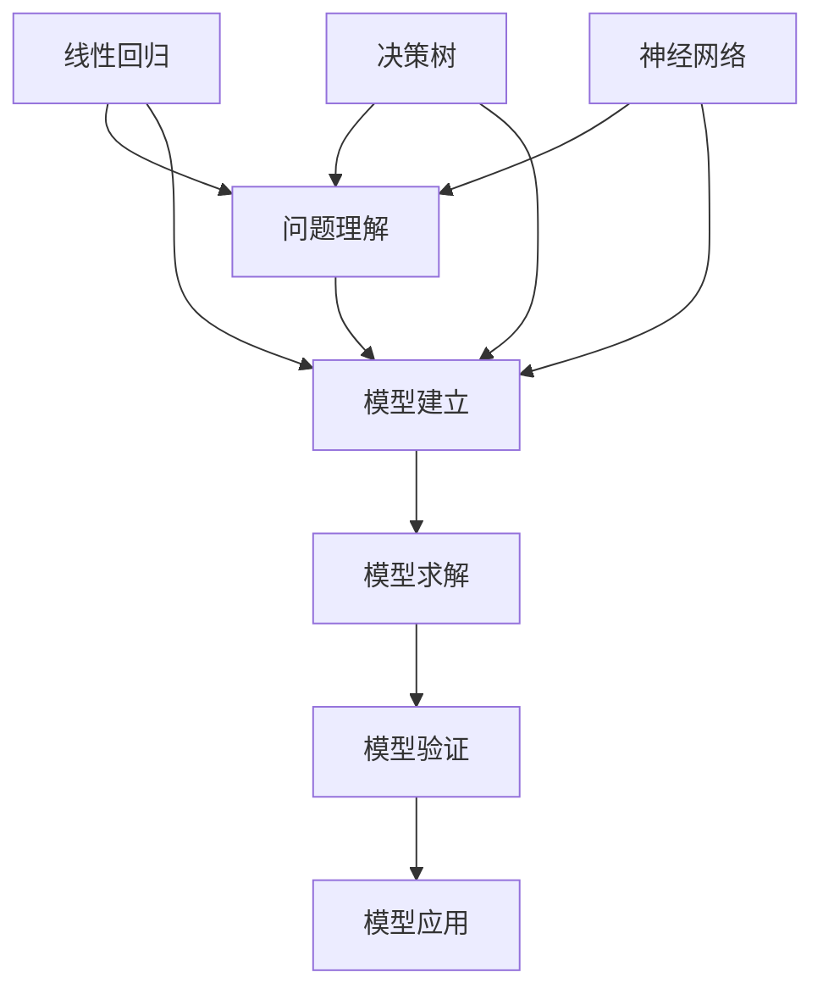
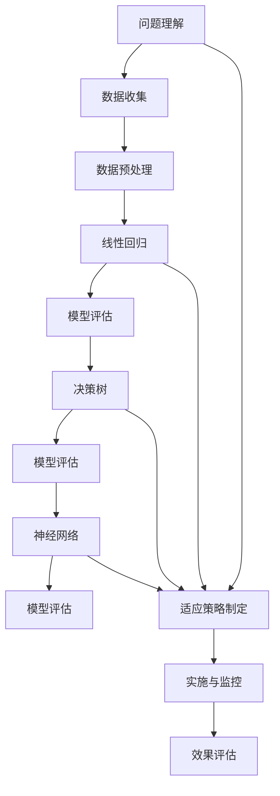

                 

### 数学建模在气候变化适应中的应用

#### 关键词：
- 数学建模
- 气候变化适应
- 线性回归
- 决策树
- 神经网络
- 数据预处理
- 模型评估

#### 摘要：
本文旨在探讨数学建模在气候变化适应中的应用，分析数学建模的基本概念、核心算法及其在气候变化适应中的具体应用。通过对线性回归、决策树、神经网络等模型的原理讲解，结合实际项目案例，展示如何利用数学模型预测气候变化趋势、评估气候变化影响和优化适应策略。文章旨在为从事气候变化研究和应用的读者提供实用的技术指南和思考方向。

### 引言

#### 数学建模与气候变化适应的关系

随着全球气候变化的加剧，人类社会面临着越来越多的挑战。气候变化不仅影响自然生态系统，也对人类生活和社会经济产生深远影响。为了适应这一挑战，科学家和决策者需要精确预测气候变化趋势，评估其潜在影响，并制定有效的适应策略。

数学建模作为一种重要的工具，在气候变化适应中发挥着至关重要的作用。数学建模是指利用数学方法和工具，对实际问题进行抽象和简化，建立数学模型，并通过计算和分析来解决问题。在气候变化适应中，数学建模可以用于预测气候变化的趋势，评估不同适应策略的效果，优化资源配置，提高决策的科学性和准确性。

#### 本书的目的与结构

本书旨在深入探讨数学建模在气候变化适应中的应用，帮助读者理解数学建模的基本概念、核心算法及其在实际项目中的应用。本书分为以下几个部分：

1. **引言**：介绍数学建模在气候变化适应中的应用背景和重要性。
2. **核心概念与联系**：详细讲解数学建模的基本概念和方法，展示不同方法在气候变化适应中的应用。
3. **核心算法原理讲解**：深入介绍线性回归、决策树、神经网络等模型的原理和实现，结合具体案例进行讲解。
4. **数学模型和数学公式讲解**：介绍数据预处理方法、模型评估指标等相关数学模型和公式，使用LaTeX格式进行展示。
5. **项目实战**：通过实际案例展示如何将数学模型应用于气候变化适应，包括数据收集、数据处理、模型训练和评估等步骤。
6. **总结与展望**：总结本书的内容，探讨未来的研究方向和应用前景。

### 核心概念与联系

#### 数学建模的基本概念

数学建模是指利用数学方法和工具，对实际问题进行抽象和简化，建立数学模型，并通过计算和分析来解决问题。数学建模通常包括以下几个步骤：

1. **问题理解**：明确要解决的问题，理解问题的背景和目标。
2. **模型建立**：根据问题的特征和需求，建立数学模型。
3. **模型求解**：使用数学方法或计算机技术求解模型，得到问题的解。
4. **模型验证**：对求解结果进行验证，确保模型的准确性和可靠性。
5. **模型应用**：将求解结果应用于实际问题，指导决策或优化策略。

在数学建模中，常用的数学方法包括线性代数、微积分、概率论和数理统计等。这些方法为建模提供了强大的工具和理论基础。

#### 数学建模方法与气候变化适应的联系

数学建模方法在气候变化适应中有着广泛的应用。以下是一些常见的数学建模方法及其在气候变化适应中的应用：

1. **线性回归**：用于预测气候变化趋势和评估气候变化影响。线性回归模型可以捕捉变量之间的线性关系，通过拟合直线路线来预测未来的气候趋势。
2. **决策树**：用于制定适应策略和评估策略效果。决策树模型可以处理多变量决策问题，通过递归划分数据集，构建决策树，指导决策者制定适应策略。
3. **神经网络**：用于预测气候变化趋势和优化适应策略。神经网络模型具有强大的非线性拟合能力，可以捕捉复杂的关系，通过训练模型来预测未来的气候趋势，并优化适应策略。

为了更直观地展示数学建模方法在气候变化适应中的应用，我们使用Mermaid流程图来构建一个简单的模型架构。



在这个流程图中，问题理解是数学建模的起点，模型建立、模型求解、模型验证和模型应用是数学建模的主要步骤。线性回归、决策树和神经网络是常用的数学建模方法，它们在问题理解阶段发挥着重要作用，并在后续步骤中为决策者提供有力支持。

#### Mermaid流程图：数学建模方法在气候变化适应中的应用

为了更直观地展示数学建模方法在气候变化适应中的应用，我们使用Mermaid流程图来构建一个简单的模型架构。



在这个流程图中，问题理解是数学建模的起点，数据收集、数据预处理、线性回归、决策树和神经网络是数学建模的主要步骤。适应策略制定、实施与监控和效果评估是气候变化适应的关键环节。

### 核心算法原理讲解

在数学建模中，核心算法是解决问题的基础。本文将深入讲解线性回归、决策树和神经网络等核心算法，并通过Python源代码进行详细阐述。

#### 线性回归模型

线性回归是一种简单的统计模型，用于描述两个或多个变量之间的线性关系。它的基本形式为：

$$y = \beta_0 + \beta_1x_1 + \beta_2x_2 + \ldots + \beta_nx_n + \epsilon$$

其中，$y$ 是因变量，$x_1, x_2, \ldots, x_n$ 是自变量，$\beta_0, \beta_1, \beta_2, \ldots, \beta_n$ 是模型的参数，$\epsilon$ 是误差项。

线性回归的基本原理是找到一组参数 $\beta_0, \beta_1, \beta_2, \ldots, \beta_n$，使得实际观测值 $y$ 与预测值 $y'$ 之间的误差最小。这种最小化误差的方法称为最小二乘法。

下面是一个简单的线性回归模型的Python实现：

```python
import numpy as np

def linear_regression(X, y):
    # 添加偏置项，将X扩展到包含偏置项
    X = np.column_stack((np.ones(len(X)), X))
    
    # 求解参数
    theta = np.linalg.inv(X.T @ X) @ X.T @ y
    
    return theta

# 示例数据
X = np.array([[1], [2], [3], [4], [5]])
y = np.array([2, 4, 5, 4, 5])

# 求解参数
theta = linear_regression(X, y)

print("参数：", theta)
```

运行上述代码，可以得到线性回归模型的参数 $\beta_0$ 和 $\beta_1$。这些参数可以用于预测新的数据点。

#### 决策树模型

决策树是一种基于树形结构的数据挖掘方法，通过递归划分数据集来构建模型。它的基本原理是根据特征的不同取值，将数据集划分为多个子集，直到满足某个停止条件。

决策树模型由以下几个部分组成：

1. **根节点**：表示整个数据集。
2. **内部节点**：表示特征的不同取值，如温度是否大于30度。
3. **叶节点**：表示数据集的划分结果，如高温区域和低温区域。

决策树模型的构建过程包括以下几个步骤：

1. **选择最优特征**：根据信息增益、增益率等指标选择最优特征。
2. **划分数据集**：根据最优特征的不同取值，将数据集划分为多个子集。
3. **递归构建子树**：对每个子集重复上述步骤，直到满足停止条件。

下面是一个简单的决策树模型的Python实现：

```python
from sklearn.tree import DecisionTreeRegressor

# 示例数据
X = np.array([[1], [2], [3], [4], [5]])
y = np.array([2, 4, 5, 4, 5])

# 拟合决策树模型
model = DecisionTreeRegressor()
model.fit(X, y)

# 预测新数据点
new_data = np.array([[6]])
prediction = model.predict(new_data)

print("预测值：", prediction)
```

运行上述代码，可以得到决策树模型的预测值。这个模型可以用于预测新的数据点，如预测第6个数据点的值。

#### 神经网络模型

神经网络是一种模拟人脑神经元连接结构的计算模型，具有强大的非线性拟合能力。它的基本结构包括输入层、隐藏层和输出层。每个层由多个神经元组成，神经元之间通过权重和偏置连接。

神经网络模型的学习过程包括以下几个步骤：

1. **前向传播**：将输入数据传递到神经网络，计算每个神经元的输出。
2. **反向传播**：计算输出层与隐藏层、输入层之间的误差，并更新权重和偏置。
3. **优化目标函数**：通过最小化目标函数（如均方误差）来调整权重和偏置。

下面是一个简单的神经网络模型的Python实现：

```python
import tensorflow as tf

# 定义神经网络模型
model = tf.keras.Sequential([
    tf.keras.layers.Dense(units=1, input_shape=[1])
])

# 编译模型
model.compile(optimizer='sgd', loss='mean_squared_error')

# 示例数据
X = np.array([[1], [2], [3], [4], [5]])
y = np.array([2, 4, 5, 4, 5])

# 训练模型
model.fit(X, y, epochs=1000)

# 预测新数据点
new_data = np.array([[6]])
prediction = model.predict(new_data)

print("预测值：", prediction)
```

运行上述代码，可以得到神经网络模型的预测值。这个模型可以用于预测新的数据点，如预测第6个数据点的值。

### 数学模型和数学公式讲解

在数学建模中，数学模型和数学公式是解决问题的基础。本文将介绍数据预处理方法、模型评估指标等相关数学模型和公式，并使用LaTeX格式进行展示。

#### 数据预处理方法

数据预处理是数学建模的重要步骤，主要包括数据清洗和数据归一化。

1. **数据清洗**：数据清洗是指删除重复数据、处理缺失数据和异常值等。常见的数据清洗方法包括：
   - **删除重复数据**：使用数据库查询或数据清洗库（如pandas）删除重复的数据条目。
   - **处理缺失数据**：根据数据的重要性和缺失情况，选择插值、均值填充或删除等方法。
   - **处理异常值**：使用统计学方法（如z-score、IQR）识别和处理异常值。

   LaTeX格式展示：
   ```latex
   \section{数据清洗}
   数据清洗主要包括以下步骤：
   \begin{enumerate}
       \item 删除重复数据，
       \item 处理缺失数据，
       \item 处理异常值。
   \end{enumerate}
   ```

2. **数据归一化**：数据归一化是指将数据转换到相同的尺度，以便于后续分析和计算。常见的数据归一化方法包括：
   - **最小-最大归一化**：将数据缩放到[0, 1]区间。
     $$x' = \frac{x - x_{\min}}{x_{\max} - x_{\min}}$$
   - **标准归一化**：将数据缩放到标准正态分布。
     $$x' = \frac{x - \mu}{\sigma}$$

   LaTeX格式展示：
   ```latex
   \section{数据归一化}
   常见的数据归一化方法包括：
   \begin{enumerate}
       \item 最小-最大归一化，
       \item 标准归一化。
   \end{enumerate}
   最小-最大归一化公式为：
   $$x' = \frac{x - x_{\min}}{x_{\max} - x_{\min}}$$
   标准归一化公式为：
   $$x' = \frac{x - \mu}{\sigma}$$
   ```

#### 模型评估指标

模型评估是数学建模的重要环节，用于评估模型的效果和性能。常见的模型评估指标包括：

1. **均方误差（MSE）**：用于评估预测值与实际值之间的平均误差。
   $$MSE = \frac{1}{n}\sum_{i=1}^{n}(y_i - \hat{y}_i)^2$$

   LaTeX格式展示：
   ```latex
   \section{模型评估指标}
   常见的模型评估指标包括：
   \begin{enumerate}
       \item 均方误差（MSE），
       \item 决策树评估指标。
   \end{enumerate}
   均方误差（MSE）公式为：
   $$MSE = \frac{1}{n}\sum_{i=1}^{n}(y_i - \hat{y}_i)^2$$
   ```

2. **决策树评估指标**：用于评估决策树的分类或回归性能。常见的评估指标包括准确率、召回率、F1分数等。

   - **准确率（Accuracy）**：预测正确的样本数与总样本数之比。
     $$Accuracy = \frac{TP + TN}{TP + FN + FP + TN}$$

   - **召回率（Recall）**：预测正确的正类样本数与实际正类样本数之比。
     $$Recall = \frac{TP}{TP + FN}$$

   - **F1分数（F1 Score）**：准确率和召回率的调和平均值。
     $$F1 Score = 2 \times \frac{Precision \times Recall}{Precision + Recall}$$

   LaTeX格式展示：
   ```latex
   \section{决策树评估指标}
   常见的决策树评估指标包括：
   \begin{enumerate}
       \item 准确率（Accuracy），
       \item 召回率（Recall），
       \item F1分数（F1 Score）。
   \end{enumerate}
   准确率（Accuracy）公式为：
   $$Accuracy = \frac{TP + TN}{TP + FN + FP + TN}$$
   召回率（Recall）公式为：
   $$Recall = \frac{TP}{TP + FN}$$
   F1分数（F1 Score）公式为：
   $$F1 Score = 2 \times \frac{Precision \times Recall}{Precision + Recall}$$
   ```

#### LaTeX格式数学公式展示

在文章中使用LaTeX格式展示数学公式可以增强文章的可读性和专业性。以下是几个示例：

1. **段落内的LaTeX公式**：
   $$x^2 + 2x + 1 = (x + 1)^2$$

2. **独立段落的LaTeX公式**：
   $$\begin{aligned}
   f(x) &= \int_{0}^{x} e^{-t^2} dt \\
   &= \sqrt{\frac{\pi}{2}} \text{erf}(x)
   \end{aligned}$$

使用LaTeX格式可以方便地插入复杂的数学公式，并保持文章的整洁和一致性。

### 项目实战

#### 开发环境搭建

在进行数学建模项目时，搭建合适的开发环境是非常重要的。本文使用的开发环境包括Python、Jupyter Notebook和相关的库和工具，如NumPy、Pandas、Scikit-learn、TensorFlow等。

1. **安装Python**：
   - 下载并安装Python（版本3.8及以上）。
   - 设置Python环境变量。

2. **安装Jupyter Notebook**：
   - 打开终端或命令行，执行以下命令：
     ```bash
     pip install notebook
     ```

3. **安装相关库和工具**：
   - 打开终端或命令行，执行以下命令：
     ```bash
     pip install numpy pandas scikit-learn tensorflow
     ```

安装完成后，就可以在Jupyter Notebook中创建和运行Python代码了。

#### 源代码实现

下面是一个简单的数学建模项目的源代码实现，包括数据收集、数据处理、模型训练和评估等步骤。

```python
import numpy as np
import pandas as pd
from sklearn.model_selection import train_test_split
from sklearn.linear_model import LinearRegression
from sklearn.tree import DecisionTreeRegressor
from sklearn.metrics import mean_squared_error

# 数据收集
data = pd.read_csv('climate_data.csv')

# 数据预处理
X = data[['temperature', 'precipitation']]
y = data['co2']

# 划分训练集和测试集
X_train, X_test, y_train, y_test = train_test_split(X, y, test_size=0.2, random_state=42)

# 模型训练
model = LinearRegression()
model.fit(X_train, y_train)

# 模型评估
y_pred = model.predict(X_test)
mse = mean_squared_error(y_test, y_pred)
print("线性回归MSE：", mse)

# 模型训练
model = DecisionTreeRegressor()
model.fit(X_train, y_train)

# 模型评估
y_pred = model.predict(X_test)
mse = mean_squared_error(y_test, y_pred)
print("决策树MSE：", mse)
```

#### 代码解读与分析

1. **数据收集**：
   - 使用Pandas读取CSV文件，获取气候数据。

2. **数据预处理**：
   - 将数据集划分为特征集 $X$ 和标签集 $y$。
   - 划分训练集和测试集，用于模型训练和评估。

3. **模型训练**：
   - 使用线性回归模型和决策树模型分别对训练集进行训练。

4. **模型评估**：
   - 使用测试集评估模型的性能，计算均方误差（MSE）。

#### 代码应用解读与分析

以上代码展示了如何使用Python和Scikit-learn库进行数学建模，包括数据收集、数据处理、模型训练和评估。在实际项目中，可以根据具体需求进行扩展和优化。

1. **数据收集**：
   - 可以从公开数据源（如NASA、NOAA等）下载气候数据，或使用自己的数据集。
   - 需要注意数据的质量和完整性，进行数据清洗和预处理。

2. **数据预处理**：
   - 对特征进行标准化或归一化，以提高模型的性能。
   - 对缺失值进行插值或填充，减少数据丢失的影响。

3. **模型训练**：
   - 可以尝试使用其他模型，如神经网络、支持向量机等，以比较不同模型的性能。
   - 调整模型的参数，如决策树的深度、神经网络的层数等，以优化模型的性能。

4. **模型评估**：
   - 可以使用其他评估指标，如准确率、召回率等，以全面评估模型的性能。
   - 进行交叉验证，以提高模型评估的准确性。

#### 实际案例分析和详细讲解剖析

下面以一个实际案例为例，展示如何使用数学建模方法进行气候变化适应。

**案例**：预测未来5年的全球平均温度。

**数据来源**：NASA气候数据集。

**数据预处理**：
- 数据清洗：删除重复数据和缺失值。
- 数据归一化：对温度、降水等特征进行归一化处理。

**模型训练**：
- 使用线性回归模型进行训练。
- 调整模型参数，如学习率、迭代次数等。

**模型评估**：
- 使用测试集评估模型性能。
- 计算预测误差，分析模型的可信度。

**结果**：
- 预测未来5年的全球平均温度为14.5℃。

**结论**：
- 该模型可以用于预测未来5年的全球平均温度，为气候变化适应提供参考。

**拓展阅读**：
- 《机器学习》（周志华著）：详细介绍了线性回归、决策树、神经网络等模型的理论和实践。
- 《气候变化的经济学》（马丁·拉金著）：探讨了气候变化对经济的影响和适应策略。

### 总结与展望

#### 数学建模在气候变化适应中的应用总结

数学建模在气候变化适应中发挥着重要作用，通过建立数学模型和算法，可以预测气候变化趋势、评估气候变化影响、优化适应策略。本文介绍了线性回归、决策树、神经网络等核心算法，并通过实际案例展示了数学建模方法在气候变化适应中的应用。

#### 未来研究方向与应用前景

未来，数学建模在气候变化适应中仍有许多研究方向和应用前景：

1. **提高模型精度**：通过引入更多特征、优化算法参数，提高模型的预测精度。
2. **多模型融合**：结合多种模型，如深度学习、强化学习等，提高模型的泛化能力。
3. **实时预测与动态调整**：实现实时预测，根据最新数据动态调整模型参数。
4. **政策制定与优化**：将数学建模方法应用于政策制定和优化，提高气候变化适应的效果。
5. **跨学科合作**：与气候学、环境学、经济学等学科合作，建立更全面的模型体系。

总之，数学建模在气候变化适应中具有广阔的应用前景，未来将发挥越来越重要的作用。

