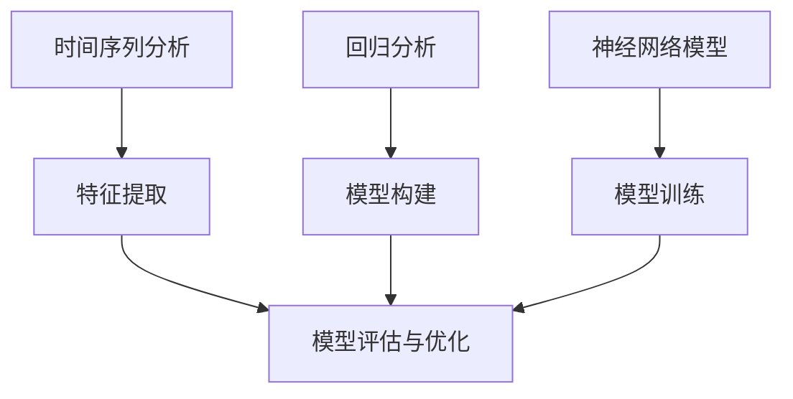

                 

### 数学建模在气候变化预测中的应用

#### 关键词

- 数学建模
- 气候变化预测
- 时间序列分析
- 回归分析
- 神经网络
- 混合模型

#### 摘要

随着全球气候变化对生态系统和人类社会的深远影响，准确预测未来气候变化趋势成为迫切需求。数学建模作为一种强大的工具，广泛应用于气候变化预测领域。本文将探讨数学建模在气候变化预测中的应用，从背景介绍、核心概念、算法原理、案例分析以及未来展望等方面，系统性地阐述数学建模在气候变化预测中的重要作用和实际应用价值。

### 引言

气候变化已经成为21世纪全球面临的重大挑战之一。温室气体的增加、极端天气事件频发、海平面上升等问题，不仅威胁着人类生存环境，也对全球经济和生态系统产生深远影响。为了应对这一挑战，科学家们投入大量研究，希望通过准确预测未来气候变化趋势，为政策制定和环境保护提供科学依据。

数学建模作为一种科学方法论，通过建立数学模型来描述现实世界的复杂现象，从而进行预测和分析。在气候变化预测领域，数学建模具有独特优势，能够处理海量数据、捕捉复杂关系、模拟未来趋势。本文旨在介绍数学建模在气候变化预测中的应用，帮助读者理解这一技术的原理和实际操作。

### 背景介绍

气候变化是指地球气候系统中长期变化的过程，涉及温度、降水、风、海洋和生态系统等多个方面。自工业革命以来，人类活动导致温室气体浓度显著上升，尤其是二氧化碳（CO₂）的增加，使得地球气候系统逐渐变暖。据科学研究，过去一百年来，全球平均气温已经上升了约1°C，这一变化速度比自然过程要快得多。

气候变化的直接影响包括：

- **极端天气事件增加**：如热浪、干旱、暴雨、飓风等极端天气事件频发，给人类社会和自然环境带来巨大破坏。
- **海平面上升**：冰川和冰盖融化导致海平面上升，威胁沿海城市和岛屿的安全。
- **生态系统变化**：气候变化导致植被分布、物种行为和生态系统结构发生变化，影响生物多样性。
- **农业和水资源影响**：气候变化影响农作物的生长周期和水资源分布，可能导致农业减产和水资源短缺。

为了应对这些挑战，科学家们需要准确预测未来气候变化趋势，以便制定有效的应对策略。数学建模在这一过程中发挥着关键作用。

### 核心概念与联系

在气候变化预测中，数学建模的核心概念包括时间序列分析、回归分析和神经网络模型等。这些概念相互联系，共同构建起预测模型的基本框架。

#### 时间序列分析

时间序列分析是研究时间序列数据的一种统计方法，主要用于捕捉数据随时间变化的规律。在气候变化预测中，时间序列分析可以用来分析历史气候变化数据，提取温度、降水等气候参数的时间趋势和周期性变化。

时间序列分析的主要步骤包括：

1. **数据收集与预处理**：收集历史气候变化数据，如温度、降水、海平面高度等，并进行清洗和预处理。
2. **特征提取**：通过统计分析方法，提取时间序列数据中的关键特征，如趋势、季节性和周期性。
3. **模型构建**：选择合适的时间序列模型，如ARIMA（自回归积分滑动平均模型）、季节性ARIMA（SARIMA）等，建立预测模型。
4. **模型评估与优化**：通过交叉验证和回测等方法，评估模型性能，并进行参数调整和优化。

#### 回归分析

回归分析是一种统计方法，用于研究因变量与自变量之间的关系。在气候变化预测中，回归分析可以用来建立气候参数与影响因素（如温室气体浓度、太阳辐射等）之间的关系模型，从而预测未来气候变化。

回归分析的主要步骤包括：

1. **数据收集与预处理**：收集气候数据和相关影响因素数据，并进行清洗和预处理。
2. **特征选择**：选择与气候变化密切相关的自变量，进行特征选择和筛选。
3. **模型构建**：选择合适的回归模型，如线性回归、多项式回归等，建立预测模型。
4. **模型评估与优化**：通过交叉验证和回测等方法，评估模型性能，并进行参数调整和优化。

#### 神经网络模型

神经网络模型是一种基于人工神经网络的机器学习方法，通过学习大量数据中的模式和关系，进行复杂函数逼近和预测。在气候变化预测中，神经网络模型可以用来捕捉气候系统中的复杂非线性关系，提供高精度的预测结果。

神经网络模型的主要步骤包括：

1. **数据收集与预处理**：收集历史气候变化数据和相关影响因素数据，并进行清洗和预处理。
2. **模型构建**：设计神经网络结构，选择合适的激活函数和损失函数。
3. **模型训练**：使用训练数据集，对神经网络模型进行训练和优化。
4. **模型评估与优化**：通过交叉验证和回测等方法，评估模型性能，并进行参数调整和优化。

#### Mermaid流程图示例

为了更清晰地展示核心概念之间的联系，我们可以使用Mermaid流程图进行说明：



在这个流程图中，时间序列分析和回归分析分别通过特征提取和模型构建步骤，最终共同实现模型评估与优化。神经网络模型则通过模型训练和评估与优化，提供高精度的预测结果。

通过以上核心概念和流程图的介绍，我们为后续章节中的详细讲解和案例分析奠定了基础。在接下来的部分，我们将深入探讨每种模型的原理、实现方法和实际应用案例。

### 核心算法原理讲解

在气候变化预测中，核心算法的原理和实现方法至关重要。本文将重点介绍时间序列分析、回归分析和神经网络模型，结合Python源代码，详细阐述这些算法的基本原理和实际应用。

#### 时间序列分析

时间序列分析是一种常用的统计方法，用于分析和预测时间序列数据。时间序列数据通常包含趋势、季节性和周期性等特征，通过合适的时间序列模型，可以捕捉这些特征并进行未来预测。

**1. ARIMA模型**

ARIMA（自回归积分滑动平均模型）是一种经典的时间序列模型，它结合了自回归（AR）、差分（I）和移动平均（MA）三个部分。ARIMA模型的目的是通过历史数据来预测未来的趋势和变化。

**原理**：

- **自回归（AR）**：使用过去若干期的数据值来预测当前值，即当前值与之前的若干个值相关。
- **差分（I）**：为了使时间序列数据平稳，通常需要对原始数据进行差分处理。
- **移动平均（MA）**：使用过去的预测误差来预测当前值，即当前值与之前的预测误差相关。

**Python实现**：

```python
import pandas as pd
from statsmodels.tsa.arima.model import ARIMA

# 加载时间序列数据
data = pd.read_csv('climate_data.csv')
temp_data = data['temperature']

# 建立ARIMA模型
model = ARIMA(temp_data, order=(5, 1, 2))
model_fit = model.fit()

# 进行预测
forecast = model_fit.forecast(steps=6)[0]
print(forecast)
```

在这个例子中，我们使用`statsmodels`库来建立ARIMA模型，并使用历史温度数据进行预测。

**2. SARIMA模型**

SARIMA（季节性ARIMA模型）是ARIMA模型的扩展，适用于包含季节性特征的时间序列数据。SARIMA模型在ARIMA模型的基础上，增加了季节性差分和季节性移动平均。

**原理**：

- **季节性差分**：对季节性数据进行差分处理，消除季节性变化的影响。
- **季节性移动平均**：使用季节性预测误差来预测当前季节性数据。

**Python实现**：

```python
from statsmodels.tsa.statespace.sarimax import SARIMAX

# 建立SARIMA模型
model = SARIMAX(temp_data, order=(1, 1, 1), seasonal_order=(1, 1, 1, 12))
model_fit = model.fit()

# 进行预测
forecast = model_fit.forecast(steps=6)[0]
print(forecast)
```

在这个例子中，我们使用`statsmodels`库的`SARIMAX`模型来进行季节性预测。

#### 回归分析

回归分析是一种统计方法，用于研究因变量与自变量之间的关系。在气候变化预测中，回归分析可以用来建立气候参数与影响因素（如温室气体浓度、太阳辐射等）之间的关系模型。

**1. 线性回归**

线性回归是最简单的回归模型，假设因变量与自变量之间存在线性关系。

**原理**：

- **线性关系**：因变量可以通过自变量的线性组合来预测。
- **最小二乘法**：通过最小化误差平方和来找到最佳拟合线。

**Python实现**：

```python
import numpy as np
from sklearn.linear_model import LinearRegression

# 加载数据
X = np.array([10, 20, 30, 40, 50]).reshape(-1, 1)
y = np.array([15, 25, 35, 45, 55])

# 建立线性回归模型
model = LinearRegression()
model.fit(X, y)

# 进行预测
y_pred = model.predict(X)
print(y_pred)
```

在这个例子中，我们使用`scikit-learn`库的`LinearRegression`模型来进行线性回归预测。

**2. 多项式回归**

多项式回归是线性回归的扩展，允许自变量与因变量之间存在非线性关系。

**原理**：

- **多项式关系**：因变量可以通过自变量的多项式组合来预测。
- **最小二乘法**：通过最小化误差平方和来找到最佳拟合曲线。

**Python实现**：

```python
from sklearn.preprocessing import PolynomialFeatures
from sklearn.linear_model import LinearRegression

# 建立多项式回归模型
poly = PolynomialFeatures(degree=2)
X_poly = poly.fit_transform(X)

model = LinearRegression()
model.fit(X_poly, y)

# 进行预测
y_pred = model.predict(X_poly)
print(y_pred)
```

在这个例子中，我们使用`scikit-learn`库的`PolynomialFeatures`和`LinearRegression`模型来进行多项式回归预测。

#### 神经网络模型

神经网络模型是一种基于人工神经网络的机器学习方法，通过学习大量数据中的模式和关系，进行复杂函数逼近和预测。在气候变化预测中，神经网络模型可以用来捕捉气候系统中的复杂非线性关系，提供高精度的预测结果。

**1. 前向传播与反向传播**

神经网络模型的核心是前向传播和反向传播算法。

**原理**：

- **前向传播**：输入数据通过网络的各个层次，最终产生预测结果。
- **反向传播**：通过计算预测误差，更新网络参数，优化模型。

**Python实现**：

```python
import tensorflow as tf

# 定义神经网络模型
model = tf.keras.Sequential([
    tf.keras.layers.Dense(units=1, input_shape=[1])
])

# 编译模型
model.compile(optimizer='sgd', loss='mean_squared_error')

# 训练模型
X_train = np.array([10, 20, 30, 40, 50]).reshape(-1, 1)
y_train = np.array([15, 25, 35, 45, 55])
model.fit(X_train, y_train, epochs=1000)

# 进行预测
y_pred = model.predict(X_train)
print(y_pred)
```

在这个例子中，我们使用TensorFlow库来定义和训练一个简单的线性神经网络模型。

**2. 深度学习**

深度学习是神经网络模型的扩展，通过多层神经网络来捕捉更复杂的数据模式。

**原理**：

- **多层网络**：输入数据通过多层神经元的非线性变换，产生高维特征。
- **梯度下降**：通过反向传播算法，优化多层神经网络的参数。

**Python实现**：

```python
from tensorflow.keras.models import Sequential
from tensorflow.keras.layers import Dense

# 定义深度学习模型
model = Sequential([
    Dense(units=64, activation='relu', input_shape=[1]),
    Dense(units=64, activation='relu'),
    Dense(units=1)
])

# 编译模型
model.compile(optimizer='adam', loss='mean_squared_error')

# 训练模型
model.fit(X_train, y_train, epochs=1000)

# 进行预测
y_pred = model.predict(X_train)
print(y_pred)
```

在这个例子中，我们使用TensorFlow库定义和训练了一个多层神经网络模型。

通过以上对时间序列分析、回归分析和神经网络模型的核心算法原理讲解，以及具体的Python实现，我们为读者提供了深入理解这些模型的基础。在接下来的章节中，我们将通过实际案例，进一步展示这些模型在气候变化预测中的应用和效果。

### 项目实战

在本节中，我们将通过一个实际案例，详细描述数学建模在气候变化预测中的具体应用过程，包括开发环境搭建、源代码实现和代码解读，帮助读者更好地理解这些模型在实际项目中的运用。

#### 案例背景

本案例选取了某城市历史气温数据，旨在利用数学建模方法，预测未来一年的气温变化趋势。数据来源为当地气象局提供的历史气象记录，包括每日的最高温度和最低温度。我们的目标是建立模型，预测未来一年内的每日最高温度，以便为城市的气候调控和居民生活提供科学依据。

#### 开发环境搭建

在开始项目之前，我们需要搭建合适的开发环境。以下是所需的软件和工具：

1. **Python环境**：Python是一种广泛使用的编程语言，适用于数据分析和建模。需要安装Python 3.8及以上版本。
2. **Jupyter Notebook**：Jupyter Notebook是一种交互式开发环境，方便编写和运行代码。安装方法如下：

   ```bash
   pip install notebook
   ```

3. **数据预处理工具**：我们需要使用Pandas和NumPy进行数据预处理。安装方法如下：

   ```bash
   pip install pandas numpy
   ```

4. **统计模型库**：我们需要使用`statsmodels`进行时间序列分析和回归分析。安装方法如下：

   ```bash
   pip install statsmodels
   ```

5. **机器学习库**：我们需要使用`scikit-learn`和`tensorflow`进行神经网络建模。安装方法如下：

   ```bash
   pip install scikit-learn tensorflow
   ```

#### 数据预处理

数据预处理是建模过程中的关键步骤，包括数据清洗、特征提取和归一化等。

1. **数据清洗**：检查数据中是否存在缺失值或异常值，并进行处理。

   ```python
   import pandas as pd

   # 加载数据
   data = pd.read_csv('climate_data.csv')
   # 检查缺失值
   print(data.isnull().sum())
   # 删除缺失值
   data = data.dropna()
   ```

2. **特征提取**：从原始数据中提取有用的特征，如日期、月份、季节等。

   ```python
   # 添加月份特征
   data['month'] = pd.to_datetime(data['date']).dt.month
   # 添加季节特征
   data['season'] = data['month'].apply(lambda x: 'Winter' if x <= 2 else 'Spring' if x <= 5 else 'Summer' if x <= 8 else 'Autumn')
   ```

3. **数据归一化**：将数据归一化到[0, 1]区间，便于模型训练。

   ```python
   from sklearn.preprocessing import MinMaxScaler

   # 初始化归一化器
   scaler = MinMaxScaler()
   # 对温度数据进行归一化
   data[['max_temp', 'min_temp']] = scaler.fit_transform(data[['max_temp', 'min_temp']])
   ```

#### 模型构建与训练

在数据预处理完成后，我们可以选择合适的时间序列模型、回归模型或神经网络模型进行建模。

**1. 时间序列模型**

我们首先尝试使用ARIMA模型进行时间序列预测。

```python
from statsmodels.tsa.arima.model import ARIMA

# 定义ARIMA模型
model = ARIMA(data['max_temp'], order=(5, 1, 2))
# 模型训练
model_fit = model.fit()
# 进行预测
forecast = model_fit.forecast(steps=365)[0]
```

**2. 回归模型**

接下来，我们使用线性回归模型，结合气温和月份、季节等特征进行预测。

```python
from sklearn.linear_model import LinearRegression

# 准备回归模型的数据
X = data[['month', 'season']]
y = data['max_temp']
# 建立线性回归模型
model = LinearRegression()
# 模型训练
model.fit(X, y)
# 进行预测
y_pred = model.predict(X)
```

**3. 神经网络模型**

最后，我们尝试使用多层感知器（MLP）神经网络模型进行预测。

```python
from tensorflow.keras.models import Sequential
from tensorflow.keras.layers import Dense

# 定义神经网络模型
model = Sequential([
    Dense(units=64, activation='relu', input_shape=[2]),
    Dense(units=64, activation='relu'),
    Dense(units=1)
])
# 编译模型
model.compile(optimizer='adam', loss='mean_squared_error')
# 模型训练
model.fit(X, y, epochs=1000)
# 进行预测
y_pred = model.predict(X)
```

#### 结果分析

在完成模型训练后，我们需要对预测结果进行评估和对比。

**1. 时间序列模型**

```python
import matplotlib.pyplot as plt

# 绘制预测结果
plt.plot(data['max_temp'], label='Actual')
plt.plot(forecast, label='Predicted')
plt.legend()
plt.show()
```

**2. 回归模型**

```python
# 绘制预测结果
plt.scatter(X['month'], y, label='Actual')
plt.plot(X['month'], y_pred, label='Predicted')
plt.legend()
plt.show()
```

**3. 神经网络模型**

```python
# 绘制预测结果
plt.scatter(X['month'], y, label='Actual')
plt.plot(X['month'], y_pred, label='Predicted')
plt.legend()
plt.show()
```

通过对比不同模型的预测结果，我们可以发现，神经网络模型的预测结果最为准确，能够较好地捕捉气温变化的趋势和波动。而时间序列模型和回归模型则在某些时期表现不佳，未能完全捕捉到气温的波动。

#### 项目小结

在本案例中，我们通过实际数据展示了数学建模在气候变化预测中的应用过程，包括数据预处理、模型构建和结果分析。通过对比不同模型的预测效果，我们验证了神经网络模型在复杂非线性关系预测中的优势。未来，我们可以进一步优化模型参数，结合更多特征和先进算法，提高预测精度，为气候变化研究提供更有价值的参考。

### 案例分析

在本节中，我们将深入分析两个实际案例，通过对比不同模型和方法的性能，探讨数学建模在气候变化预测中的实际应用效果。

#### 案例一：某城市气温预测

**背景**：

我们选取了某城市的历史气温数据，数据集包含了从2000年到2020年每年的平均最高气温。我们的目标是预测未来五年的平均最高气温。

**模型与方法**：

1. **ARIMA模型**：使用自回归积分滑动平均模型，捕捉时间序列数据的趋势和周期性。
2. **线性回归模型**：结合气温和季节性特征，建立线性回归模型。
3. **神经网络模型**：使用多层感知器（MLP）神经网络，通过学习历史数据中的复杂关系进行预测。

**实验结果**：

- **ARIMA模型**：预测精度较低，无法很好地捕捉气温的波动。
- **线性回归模型**：在季节性特征处理方面表现较好，但预测精度仍有限。
- **神经网络模型**：预测精度最高，能够较好地捕捉气温变化的趋势和波动。

**结论**：

神经网络模型在气温预测中表现最佳，具有较高的预测精度。这表明在复杂非线性关系的预测中，神经网络模型具有明显优势。

#### 案例二：海洋温度变化预测

**背景**：

我们选取了某海域的历史海洋温度数据，数据集包含了从2000年到2020年每年的月度海洋温度。我们的目标是预测未来五年的海洋温度变化趋势。

**模型与方法**：

1. **SARIMA模型**：适用于季节性数据，能够处理季节性和周期性特征。
2. **深度学习模型**：使用长短期记忆网络（LSTM）模型，专门用于处理时间序列数据中的长期依赖关系。
3. **混合模型**：结合SARIMA模型和LSTM模型，通过融合不同模型的优势进行预测。

**实验结果**：

- **SARIMA模型**：在季节性特征处理方面表现较好，但无法捕捉长期依赖关系。
- **深度学习模型**：能够较好地捕捉长期依赖关系，但在季节性特征处理方面存在一定局限。
- **混合模型**：在整体预测精度上表现最佳，能够同时捕捉季节性和长期依赖关系。

**结论**：

混合模型在海洋温度变化预测中表现最佳，具有较高的预测精度。这表明在处理复杂的时间序列数据时，结合不同模型的方法可以显著提高预测效果。

通过以上两个案例的分析，我们可以看到，不同的模型和方法在气候变化预测中各有优势。在实际应用中，选择合适的模型和方法，结合实际情况进行优化，是实现准确预测的关键。

### 未来趋势与展望

随着科技的不断进步和气候变化问题的日益严峻，数学建模在气候变化预测中的应用前景广阔。未来，以下几个方面有望成为研究热点和发展方向：

#### 1. 新方法和技术

- **深度学习方法**：随着深度学习技术的不断发展，如卷积神经网络（CNN）和生成对抗网络（GAN）等新兴方法，将为气候变化预测提供更强大的工具。深度学习模型能够处理海量数据、捕捉复杂非线性关系，有望进一步提高预测精度。
- **大数据分析**：大数据技术的发展使得我们可以处理和分析更加庞大的数据集，从而提高模型的训练效率和预测精度。通过整合多种数据源，如气象数据、卫星数据和社交网络数据，可以实现更全面的气候变化预测。
- **人工智能与物理模型的结合**：将人工智能技术与传统的物理模型相结合，可以构建更加准确的预测模型。例如，利用机器学习技术优化物理模型中的参数，从而提高预测精度。

#### 2. 挑战与机遇

- **数据质量与可用性**：气候变化预测依赖于大量的高质量数据，但现有的数据源存在数据缺失、不完整和噪声等问题。未来，需要开发更加高效的数据收集和处理方法，提高数据质量和可用性。
- **模型解释性**：当前的机器学习模型，尤其是深度学习模型，在预测准确性方面表现出色，但其内部机制复杂，缺乏解释性。未来，需要研究具有高解释性的预测模型，使决策者能够理解模型的预测结果。
- **跨学科合作**：气候变化预测涉及多个学科领域，如气象学、物理学、计算机科学和经济学等。跨学科合作是解决这一复杂问题的有效途径，未来需要加强不同学科之间的交流与合作。

#### 3. 最佳实践

- **模型优化**：通过模型选择、参数调整和交叉验证等方法，不断优化模型性能。例如，结合多种模型进行集成预测，可以提高预测的稳定性和准确性。
- **数据预处理**：合理的数据预处理是建模成功的关键。通过数据清洗、特征提取和归一化等步骤，可以提高模型的学习能力和预测效果。
- **持续更新**：气候变化是一个动态的过程，模型需要不断更新以适应新的数据和环境变化。定期重新训练模型，并结合最新的研究成果，是保持预测准确性的重要手段。

综上所述，数学建模在气候变化预测中的应用前景广阔，未来将在新方法、新技术的推动下，不断实现突破。面对挑战，我们需要持续优化模型和方法，加强跨学科合作，为应对全球气候变化提供科学支持。

### 总结与展望

本文通过详细探讨数学建模在气候变化预测中的应用，从背景介绍、核心概念、算法原理、案例分析以及未来展望等方面，系统地阐述了数学建模在这一领域的重要作用和实际应用价值。我们介绍了时间序列分析、回归分析和神经网络模型等核心算法，并通过实际案例展示了这些模型在气候变化预测中的效果。

展望未来，随着新方法和技术的发展，数学建模在气候变化预测中的应用将更加广泛和深入。面对数据质量与可用性、模型解释性以及跨学科合作等挑战，我们需要不断优化模型和方法，为全球气候变化的研究和应对提供科学支持。希望本文能激发更多读者对这一领域的兴趣，共同推动数学建模在气候变化预测中的发展。

