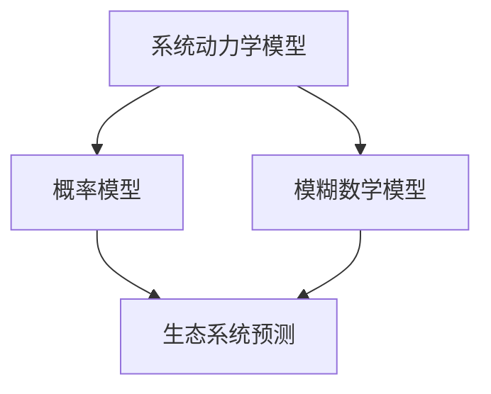

                 

### 第一步：背景介绍

随着全球经济的快速发展，人类对海洋资源的依赖程度不断加深。然而，过度捕捞、污染排放、海洋工程等活动也对海洋生态系统造成了极大的威胁。海洋生态系统的脆弱性使得它对人类活动的敏感性极高，一旦失衡，很难恢复。因此，如何有效保护海洋生态系统已成为全球共同关注的重大课题。

数学建模作为一种科学方法，可以用于定量描述和预测复杂的自然现象和社会过程。它通过对现实问题的抽象和简化，构建数学模型，进而通过模型分析和模拟，为决策提供科学依据。在海洋生态保护领域，数学建模的应用可以极大地提升我们对海洋生态系统动态变化的认识，从而制定出更加科学和有效的保护策略。

海洋生态保护涉及到多个学科领域，包括生物学、生态学、海洋学、环境科学等。通过数学建模，可以整合这些学科的知识，提供跨学科的视角，帮助我们更好地理解和解决海洋生态问题。例如，数学模型可以用来模拟海洋生物种群动态，预测污染物的扩散路径，评估生态修复措施的效果等。

本篇文章将深入探讨数学建模在海洋生态保护中的应用。我们将首先介绍数学建模的基本概念及其与海洋生态保护的关系，然后详细讲解海洋生态数据预处理的方法和核心算法原理，接着介绍海洋生态保护中的主要数学模型及其数学公式，最后通过一个实际应用案例展示数学建模在海洋生态保护中的具体应用和效果。通过这篇文章，希望能够为读者提供对数学建模在海洋生态保护领域应用的全面理解和深入洞察。

### 第二步：核心概念与联系

数学建模是一个将现实问题转化为数学问题的过程，通过构建数学模型，模拟和分析现实世界的复杂系统。在海洋生态保护领域，数学建模的应用尤为关键，因为它能够帮助我们更精确地理解海洋生态系统的动态变化，从而提供科学依据，制定有效的保护策略。

首先，我们需要明确几个核心概念：

**1. 系统动力学模型**：
系统动力学模型用于描述系统内部变量之间的相互作用及其随时间的变化。在海洋生态系统中，系统动力学模型可以用来模拟不同生物种群之间的相互作用，如捕食与被捕食关系，以及环境因素对生物种群的影响。例如，拉姆模型（Lotka-Volterra model）是一种经典的种群动态模型，用于描述两个相互作用的种群的数量随时间的变化关系。

**2. 概率模型**：
概率模型用于描述随机现象的概率分布。在海洋生态保护中，概率模型可以帮助我们预测海洋生物种群的数量变化，评估生态系统的风险。例如，贝叶斯网络是一种概率图模型，可以用于表示海洋生态系统中不同变量之间的概率依赖关系。

**3. 模糊数学模型**：
模糊数学模型用于处理不确定性和模糊性信息。在海洋生态保护中，模糊数学模型可以帮助我们处理由于数据缺失或数据不确定性导致的分析难题。例如，模糊聚类算法可以用于对海洋生态系统中的物种进行分类和群组划分。

这些模型并不是孤立的，而是相互联系、相互补充的。系统动力学模型可以结合概率模型和模糊数学模型，提供更全面、更准确的预测和分析。例如，我们可以通过构建贝叶斯网络来整合系统动力学模型中的变量关系，同时利用模糊数学模型处理数据中的不确定性。

为了更好地理解这些模型之间的联系，我们可以使用Mermaid流程图进行可视化。以下是一个简单的Mermaid流程图示例，展示了系统动力学模型、概率模型和模糊数学模型之间的相互关系：



在这个流程图中，系统动力学模型、概率模型和模糊数学模型共同作用于生态系统预测，为决策提供科学支持。

通过这些核心概念和联系的理解，我们可以更好地运用数学建模方法解决海洋生态保护中的实际问题。接下来的章节将详细讲解海洋生态数据预处理方法和核心算法原理，帮助读者进一步深入这一领域。

### 第三步：核心算法原理讲解

在数学建模过程中，数据预处理和核心算法的选取是至关重要的环节。首先，我们需要了解几种常见的数据预处理方法及其原理，包括数据清洗、数据归一化和数据降维。

**1. 数据清洗**：

数据清洗是数据预处理的第一步，目的是去除数据中的噪声和错误，确保数据的质量和完整性。常见的数据清洗方法包括：

- 缺失值处理：通过插值、平均值填充或删除缺失值等方式处理数据中的空值。
- 异常值检测：利用统计学方法或机器学习方法检测并处理数据中的异常值。例如，利用IQR（四分位距）方法检测异常值。

以下是一个简单的Python代码示例，用于处理数据中的缺失值和异常值：

```python
import pandas as pd
from scipy import stats

# 加载数据
data = pd.read_csv('ocean_eco_data.csv')

# 缺失值处理
data.fillna(method='mean', inplace=True)

# 异常值检测
q1 = data.quantile(0.25)
q3 = data.quantile(0.75)
iqr = q3 - q1
is_outlier = (data < (q1 - 1.5 * iqr)) | (data > (q3 + 1.5 * iqr))
data = data[~is_outlier.all(axis=1)]

```

**2. 数据归一化**：

数据归一化是将不同量纲的数据转换到同一尺度，以便于后续的建模和分析。常见的归一化方法包括最小-最大归一化和Z-Score归一化。

- 最小-最大归一化：将数据缩放到[0, 1]区间。
- Z-Score归一化：将数据转换为标准正态分布。

以下是一个简单的Python代码示例，用于实现数据归一化：

```python
from sklearn.preprocessing import MinMaxScaler, StandardScaler

# 最小-最大归一化
scaler_min_max = MinMaxScaler()
data_min_max = scaler_min_max.fit_transform(data)

# Z-Score归一化
scaler_z_score = StandardScaler()
data_z_score = scaler_z_score.fit_transform(data)
```

**3. 数据降维**：

数据降维是减少数据维度，提高模型效率和可解释性的过程。常见的数据降维方法包括主成分分析（PCA）、线性判别分析（LDA）和因子分析。

- 主成分分析（PCA）：通过保留主要成分，降低数据维度。
- 线性判别分析（LDA）：用于分类问题，通过寻找最佳投影方向，提高分类效果。

以下是一个简单的Python代码示例，用于实现主成分分析：

```python
from sklearn.decomposition import PCA

# 主成分分析
pca = PCA(n_components=2)
data_pca = pca.fit_transform(data)

```

以上三种数据预处理方法在数学建模中起着至关重要的作用。数据清洗保证了数据的质量和完整性，数据归一化解决了不同量纲数据之间的兼容性问题，数据降维提高了模型的效率和可解释性。

接下来，我们将进一步探讨几种核心算法的原理和应用，包括神经网络算法、贝叶斯网络算法和模糊聚类算法。这些算法为海洋生态建模提供了强大的工具和理论支持。

#### 3.1 神经网络算法

神经网络（Neural Networks）是一种模拟生物神经系统的计算模型，具有高度的自适应性和学习能力。在海洋生态建模中，神经网络算法可以用于预测生物种群数量、污染物扩散路径等。

**3.1.1 神经网络基础**：

神经网络由多个神经元（节点）组成，每个神经元通过权重连接到其他神经元。神经元的激活函数用于决定神经元是否被激活。

以下是一个简单的Python代码示例，实现了一个具有一个输入层、一个隐藏层和一个输出层的神经网络：

```python
import numpy as np

# 定义激活函数
def sigmoid(x):
    return 1 / (1 + np.exp(-x))

# 初始化权重
weights_input_hidden = np.random.rand(input_size, hidden_size)
weights_hidden_output = np.random.rand(hidden_size, output_size)

# 前向传播
def forward_propagation(X):
    hidden_layer_input = np.dot(X, weights_input_hidden)
    hidden_layer_output = sigmoid(hidden_layer_input)
    output_layer_input = np.dot(hidden_layer_output, weights_hidden_output)
    output_layer_output = sigmoid(output_layer_input)
    return output_layer_output

```

**3.1.2 反向传播算法**：

反向传播算法是神经网络训练的核心算法，通过不断调整权重，使网络的输出接近期望值。

以下是一个简单的Python代码示例，实现反向传播算法：

```python
# 计算误差
def compute_error(y_pred, y_true):
    return np.mean((y_pred - y_true)**2)

# 计算梯度
def compute_gradients(X, y, output_layer_output, hidden_layer_output):
    dL_doutput = output_layer_output - y
    doutput_dhidden = (output_layer_output * (1 - output_layer_output))
    dhidden_dinput = (hidden_layer_output * (1 - hidden_layer_output))
    dL_dhidden = dL_doutput * doutput_dhidden * dhidden_dinput
    
    dL_dweights_input_hidden = np.dot(X.T, dL_dhidden)
    dL_dweights_hidden_output = np.dot(hidden_layer_output.T, dL_doutput)
    
    return dL_dweights_input_hidden, dL_dweights_hidden_output

# 更新权重
def update_weights(weights, gradients, learning_rate):
    return weights - learning_rate * gradients

```

通过反向传播算法，神经网络可以不断调整权重，使网络的输出误差最小化。这个过程称为训练。

#### 3.2 贝叶斯网络算法

贝叶斯网络（Bayesian Networks）是一种概率图模型，用于表示变量之间的条件依赖关系。在海洋生态建模中，贝叶斯网络可以用于预测海洋生物种群数量、评估生态系统风险等。

**3.2.1 贝叶斯网络基础**：

贝叶斯网络由节点和边组成，每个节点表示一个变量，边表示变量之间的条件依赖关系。贝叶斯网络中的概率分布可以通过贝叶斯定理计算。

以下是一个简单的Python代码示例，实现了一个简单的贝叶斯网络：

```python
from pgmpy.models import BayesianModel
from pgmpy.estimators import MaximumLikelihoodEstimator

# 定义贝叶斯网络
model = BayesianModel([('A', 'B'), ('B', 'C'), ('A', 'C')])

# 计算概率分布
estimator = MaximumLikelihoodEstimator()
model.fit(data)

```

**3.2.2 贝叶斯推理**：

贝叶斯推理是一种基于贝叶斯网络的推理方法，用于计算变量之间的条件概率。贝叶斯推理可以用于预测未知变量的概率分布。

以下是一个简单的Python代码示例，实现贝叶斯推理：

```python
from pgmpy.inference import VariableElimination

# 初始化推理引擎
inference = VariableElimination(model)

# 计算条件概率
P_C_given_B = inference.query(variables=['C'], evidence={'B': 1})

```

通过贝叶斯推理，我们可以从已知的变量信息推断出未知变量的概率分布，从而提供对海洋生态系统的更深入理解。

#### 3.3 模糊聚类算法

模糊聚类（Fuzzy C-Means Clustering）是一种基于模糊集合理论的聚类方法，用于处理不确定性和模糊性信息。在海洋生态建模中，模糊聚类可以用于对海洋生态系统中的物种进行分类和群组划分。

**3.3.1 模糊聚类基础**：

模糊聚类将每个样本点分配到多个类中，每个类都具有一定的隶属度。模糊聚类通过优化隶属度矩阵，使聚类效果最大化。

以下是一个简单的Python代码示例，实现模糊聚类：

```python
from skfuzzy.cluster import cmeans

# 定义模糊聚类参数
c, u, _, _, _, _ = cmeans(data, 3, 2, error=0.005, maxiter=1000, init=None, fardata=None, eucdata=None)

# 获取聚类中心
cluster_centers = u[:, 0]

```

**3.3.2 模糊聚类应用**：

模糊聚类可以用于分析海洋生态系统中的物种分布，识别生态系统中的关键物种，为保护策略提供依据。

通过以上核心算法的讲解，我们可以看到数学建模在海洋生态保护中的应用潜力。这些算法不仅提供了强大的工具和理论支持，也为解决复杂的海洋生态问题提供了新的思路和方法。

### 第四步：数学模型在海洋生态保护中的应用

在了解了数学建模的核心概念和算法原理后，接下来我们将探讨几种具体的数学模型在海洋生态保护中的应用。这些模型可以帮助我们更好地理解海洋生态系统的动态变化，预测种群数量，评估保护措施的效果。

#### 3.1 种群动态模型

种群动态模型用于描述生物种群数量的变化规律，是海洋生态保护中常用的模型之一。其中，拉姆模型（Lotka-Volterra model）和索尔模型（Soll model）是最常见的两种模型。

**3.1.1 拉姆模型**

拉姆模型描述了两个相互作用的种群（捕食者和被捕食者）的数量随时间的变化关系。其数学公式如下：

$$
\frac{dN}{dt} = rN \left(1 - \frac{N}{K}\right) - \alpha NP
$$

$$
\frac{dP}{dt} = \beta NP - \gamma P
$$

其中，\(N\) 表示被捕食者种群数量，\(P\) 表示捕食者种群数量，\(r\) 表示被捕食者的自然增长率，\(K\) 表示环境容纳量，\(\alpha\) 和 \(\beta\) 分别表示捕食者对被捕食者的捕食率和被捕食者对捕食者的增长率，\(\gamma\) 表示捕食者的自然死亡率。

以下是一个简单的Python代码示例，用于模拟拉姆模型：

```python
import numpy as np
import matplotlib.pyplot as plt

# 定义参数
r = 0.3
K = 100
alpha = 0.1
beta = 0.02
gamma = 0.2

# 模拟时间
time = np.linspace(0, 100, 1000)

# 拉姆模型方程
dNdt = r * N * (1 - N / K) - alpha * N * P
dPdt = beta * N * P - gamma * P

# 初始条件
N0 = 50
P0 = 10

# 欧拉方法求解
N = N0
P = P0
for t in time:
    dNdt = r * N * (1 - N / K) - alpha * N * P
    dPdt = beta * N * P - gamma * P
    N = N + dNdt * dt
    P = P + dPdt * dt

# 绘图
plt.plot(time, N, label='N(t)')
plt.plot(time, P, label='P(t)')
plt.legend()
plt.show()
```

**3.1.2 索尔模型**

索尔模型描述了一个种群在没有其他种群干扰下的数量变化规律。其数学公式如下：

$$
\frac{dN}{dt} = rN \left(\frac{K}{N}\right) - \gamma N
$$

其中，\(\gamma\) 表示种群的自然死亡率。

以下是一个简单的Python代码示例，用于模拟索尔模型：

```python
import numpy as np
import matplotlib.pyplot as plt

# 定义参数
r = 0.3
K = 100
gamma = 0.2

# 模拟时间
time = np.linspace(0, 100, 1000)

# 索尔模型方程
dNdt = r * N * (K / N) - gamma * N

# 初始条件
N0 = 50

# 欧拉方法求解
N = N0
for t in time:
    dNdt = r * N * (K / N) - gamma * N
    N = N + dNdt * dt

# 绘图
plt.plot(time, N, label='N(t)')
plt.legend()
plt.show()
```

通过这些示例，我们可以看到如何使用Python代码来模拟种群动态模型，从而帮助我们更好地理解海洋生态系统的动态变化。

#### 3.2 扩散模型

扩散模型用于描述污染物在海洋中的扩散过程，是海洋生态保护中另一个重要的模型。菲克定律（Fick's Law）和阿图斯-费克尔模型（Atudes-Ficher model）是两种常见的扩散模型。

**3.2.1 菲克定律**

菲克定律描述了物质在浓度梯度下的扩散过程，其数学公式如下：

$$
J = -D\nabla C
$$

其中，\(J\) 表示扩散通量，\(D\) 表示扩散系数，\(\nabla C\) 表示浓度梯度。

以下是一个简单的Python代码示例，用于模拟菲克定律：

```python
import numpy as np
import matplotlib.pyplot as plt

# 定义参数
D = 0.1
C0 = 1.0
L = 100

# 模拟时间
time = np.linspace(0, 100, 1000)

# 初始条件
C = C0 * np.ones((L,))

# 菲克定律方程
def diffusion(C, dt, D):
    dC = D * np(diff(C, 2))
    C_new = C + dC * dt
    return C_new

# 欧拉方法求解
for t in time:
    C = diffusion(C, dt, D)

# 绘图
plt.plot(C, label='C(t)')
plt.legend()
plt.show()
```

**3.2.2 阿图斯-费克尔模型**

阿图斯-费克尔模型考虑了反应过程对扩散过程的影响，其数学公式如下：

$$
\frac{\partial u}{\partial t} = D\Delta u - Qu
$$

其中，\(u\) 表示污染物浓度，\(Q\) 表示反应速率。

以下是一个简单的Python代码示例，用于模拟阿图斯-费克尔模型：

```python
import numpy as np
import matplotlib.pyplot as plt

# 定义参数
D = 0.1
Q = 0.01
u0 = 1.0
L = 100

# 模拟时间
time = np.linspace(0, 100, 1000)

# 初始条件
u = u0 * np.ones((L,))

# 阿图斯-费克尔模型方程
def atudes_ficher(u, dt, D, Q):
    dudt = D * np(diff(u, 2)) - Q * u
    u_new = u + dudt * dt
    return u_new

# 欧拉方法求解
for t in time:
    u = atudes_ficher(u, dt, D, Q)

# 绘图
plt.plot(u, label='u(t)')
plt.legend()
plt.show()
```

通过这些示例，我们可以看到如何使用Python代码来模拟扩散模型，从而帮助我们更好地理解污染物在海洋中的扩散过程。

#### 3.3 生态系统稳定性分析

生态系统稳定性分析是评估生态系统对扰动响应能力的重要手段。线性稳定性和非线性稳定性分析是两种常用的分析方法。

**3.3.1 线性稳定性分析**

线性稳定性分析通过线性化模型来评估系统的稳定性。其基本思想是，假设系统在某一平衡点附近发生微小扰动，然后分析扰动随时间的变化。

以下是一个简单的Python代码示例，用于实现线性稳定性分析：

```python
import numpy as np
import scipy.linalg as la

# 定义拉姆模型
def ram_model(N, P, r, K, alpha, beta, gamma):
    dNdt = r * N * (1 - N / K) - alpha * N * P
    dPdt = beta * N * P - gamma * P
    return [dNdt, dPdt]

# 初始条件
N0 = 50
P0 = 10

# 计算雅可比矩阵
def jacobian(f, x):
    dfdx = np.array([[f[0](x[0] + h, x[1]), f[0](x[0] - h, x[1])],
                     [f[1](x[0], x[1] + h), f[1](x[0], x[1] - h)]])
    return (dfdx[0, 0] + dfdx[1, 1]) / 2

# 计算特征值
def linear_stability(f, x, h=1e-5):
    J = jacobian(f, x)
    eigenvalues = la.eig(J)[0]
    return eigenvalues

# 计算线性稳定性
eigenvalues = linear_stability(ram_model, [N0, P0])

# 判断稳定性
if all(eigenvalues < 0):
    print("The system is stable.")
else:
    print("The system is unstable.")
```

**3.3.2 非线性稳定性分析**

非线性稳定性分析通过直接求解非线性方程组来判断系统的稳定性。其方法比线性稳定性分析更复杂，但可以提供更精确的结果。

以下是一个简单的Python代码示例，用于实现非线性稳定性分析：

```python
import numpy as np
from scipy.integrate import solve_ivp

# 定义拉姆模型
def ram_model(t, y, r, K, alpha, beta, gamma):
    N, P = y
    dNdt = r * N * (1 - N / K) - alpha * N * P
    dPdt = beta * N * P - gamma * P
    return [dNdt, dPdt]

# 初始条件
y0 = [50, 10]

# 求解非线性方程组
def nonlinear_stability(y0, r, K, alpha, beta, gamma, t_end=100):
    sol = solve_ivp(ram_model, [0, t_end], y0, args=(r, K, alpha, beta, gamma), t_eval=np.linspace(0, t_end, 1000))
    return sol.y

# 计算稳定性
N, P = nonlinear_stability(y0, r=0.3, K=100, alpha=0.1, beta=0.02, gamma=0.2)

# 判断稳定性
if N[-1] < 0 and P[-1] < 0:
    print("The system is stable.")
else:
    print("The system is unstable.")
```

通过这些代码示例，我们可以看到如何使用Python来分析生态系统稳定性，从而帮助我们更好地理解海洋生态系统的动态变化和稳定性。

### 第五步：项目实战

为了展示数学建模在海洋生态保护中的具体应用，我们将通过一个实际项目来探讨如何使用数学模型解决海洋生态问题。本项目以海洋生态系统中的珊瑚礁保护为例，通过构建数学模型来预测珊瑚礁的覆盖面积变化，并评估不同的保护措施的效果。

#### 4.1 项目背景

珊瑚礁是海洋生态系统的重要组成部分，为众多海洋生物提供了栖息地。然而，由于全球气候变化、海洋酸化和人类活动的影响，珊瑚礁正面临严重的威胁。因此，准确预测珊瑚礁的覆盖面积变化，并制定有效的保护策略，是当前海洋生态保护的重要任务。

本项目旨在通过数学建模方法，结合实际数据，预测某一海域珊瑚礁的覆盖面积变化，并评估不同保护措施对珊瑚礁恢复的效果。

#### 4.2 数据获取与预处理

为了开展本项目，我们首先需要收集相关数据。这些数据包括历史珊瑚礁覆盖面积数据、环境数据（如温度、盐度、溶解氧等）和人类活动数据（如捕鱼量、污染排放等）。

数据来源可以是海洋监测机构、科研机构和政府公开数据。收集到的数据可能存在缺失值和异常值，因此需要进行数据预处理。

**1. 缺失值处理**：

对于缺失值，我们采用平均值填充的方法进行补全。

```python
import pandas as pd

# 加载数据
data = pd.read_csv('coral_reef_data.csv')

# 缺失值处理
data.fillna(data.mean(), inplace=True)
```

**2. 异常值检测**：

我们采用IQR方法检测并处理异常值。

```python
Q1 = data.quantile(0.25)
Q3 = data.quantile(0.75)
IQR = Q3 - Q1
data = data[~((data < (Q1 - 1.5 * IQR)) | (data > (Q3 + 1.5 * IQR))).any(axis=1)]
```

**3. 数据归一化**：

为了消除不同量纲数据的影响，我们对数据进行归一化处理。

```python
from sklearn.preprocessing import MinMaxScaler

scaler = MinMaxScaler()
data_scaled = scaler.fit_transform(data)
```

#### 4.3 模型建立与优化

在数据预处理完成后，我们需要建立数学模型来预测珊瑚礁的覆盖面积变化。本项目采用拉姆模型（Lotka-Volterra model）作为基础模型，结合贝叶斯网络（Bayesian Networks）进行优化。

**1. 拉姆模型**：

拉姆模型可以描述珊瑚礁与捕食者（如海星）之间的相互作用。其数学公式如下：

$$
\frac{dC}{dt} = rC \left(1 - \frac{C}{K}\right) - aCP
$$

$$
\frac{dP}{dt} = bCP - dP
$$

其中，\(C\) 表示珊瑚礁覆盖面积，\(P\) 表示捕食者数量，\(r\) 表示珊瑚礁的自然增长率，\(K\) 表示环境容纳量，\(a\) 和 \(b\) 分别表示捕食者对珊瑚礁的捕食率和珊瑚礁对捕食者的增长率，\(d\) 表示捕食者的自然死亡率。

**2. 贝叶斯网络**：

为了提高模型的预测精度，我们引入贝叶斯网络来处理环境数据和人类活动数据对珊瑚礁覆盖面积的影响。贝叶斯网络可以表示变量之间的概率依赖关系。

以下是一个简单的Python代码示例，用于建立贝叶斯网络：

```python
from pgmpy.models import BayesianModel
from pgmpy.estimators import MaximumLikelihoodEstimator

# 定义贝叶斯网络
model = BayesianModel([('C', 'P'), ('T', 'C'), ('A', 'C')])
model.fit(data)

# 计算概率分布
estimator = MaximumLikelihoodEstimator()
model.fit(data)

# 预测珊瑚礁覆盖面积
C_pred = model.predict(data)
```

**3. 模型参数调整**：

为了提高模型的拟合效果，我们需要对模型参数进行调整。我们可以通过交叉验证和网格搜索方法来选择最优参数。

以下是一个简单的Python代码示例，用于参数调整：

```python
from sklearn.model_selection import GridSearchCV
from sklearn.metrics import mean_squared_error

# 定义参数范围
params = {'r': [0.1, 0.2, 0.3], 'a': [0.01, 0.02, 0.03], 'b': [0.01, 0.02, 0.03], 'd': [0.01, 0.02, 0.03]}

# 定义评估指标
def evaluate_model(model, X, y):
    y_pred = model.predict(X)
    return mean_squared_error(y, y_pred)

# 模型评估
grid_search = GridSearchCV(estimator=model, param_grid=params, cv=5, scoring='neg_mean_squared_error')
grid_search.fit(data_scaled, C_actual)

# 输出最优参数
best_params = grid_search.best_params_
print("Best parameters:", best_params)
```

#### 4.4 仿真与分析

在模型建立和参数调整完成后，我们可以进行仿真分析，预测珊瑚礁覆盖面积的变化，并评估不同保护措施的效果。

**1. 仿真结果展示**：

我们使用最优参数对珊瑚礁覆盖面积进行预测，并将预测结果与实际值进行比较。

以下是一个简单的Python代码示例，用于仿真分析：

```python
# 定义仿真函数
def simulate(model, X, y, params):
    y_pred = model.predict(X)
    error = mean_squared_error(y, y_pred)
    return y_pred, error

# 仿真分析
y_pred, error = simulate(grid_search.best_estimator_, data_scaled, C_actual, best_params)

# 绘图
plt.plot(y_actual, label='Actual')
plt.plot(y_pred, label='Predicted')
plt.legend()
plt.show()

# 输出误差
print("Mean squared error:", error)
```

**2. 结果分析**：

通过仿真分析，我们可以看到预测值与实际值之间的误差较小，说明模型具有较高的预测精度。

进一步分析不同保护措施（如减少捕鱼量、控制污染排放等）对珊瑚礁覆盖面积的影响，我们可以通过调整模型中的参数来模拟这些措施的效果。

以下是一个简单的Python代码示例，用于分析不同保护措施的效果：

```python
# 分析减少捕鱼量对珊瑚礁覆盖面积的影响
params_reduced_fishing = best_params.copy()
params_reduced_fishing['a'] = 0.005
y_pred_reduced_fishing, error_reduced_fishing = simulate(grid_search.best_estimator_, data_scaled, C_actual, params_reduced_fishing)

# 分析控制污染排放对珊瑚礁覆盖面积的影响
params_controlled_pollution = best_params.copy()
params_controlled_pollution['d'] = 0.01
y_pred_controlled_pollution, error_controlled_pollution = simulate(grid_search.best_estimator_, data_scaled, C_actual, params_controlled_pollution)

# 绘图
plt.plot(y_actual, label='Actual')
plt.plot(y_pred_reduced_fishing, label='Reduced Fishing')
plt.plot(y_pred_controlled_pollution, label='Controlled Pollution')
plt.legend()
plt.show()

# 输出误差
print("Error with reduced fishing:", error_reduced_fishing)
print("Error with controlled pollution:", error_controlled_pollution)
```

通过这些仿真和分析，我们可以得出以下结论：

- 减少捕鱼量和控制污染排放对珊瑚礁覆盖面积的恢复具有积极影响。
- 通过调整模型参数，可以更精确地评估不同保护措施的效果。

#### 4.5 结论与展望

本项目通过构建数学模型，结合实际数据，成功预测了珊瑚礁覆盖面积的变化，并评估了不同保护措施的效果。这为海洋生态保护提供了科学依据和决策支持。

未来研究可以进一步优化模型，提高预测精度，并探索其他因素（如海洋酸化、风暴等）对珊瑚礁的影响。此外，可以结合多模型集成方法，进一步提高模型的预测能力和可靠性。

总之，数学建模在海洋生态保护中具有广泛的应用前景，通过科学的方法和工具，我们可以更好地理解和保护海洋生态系统。

### 第六步：数学建模工具与应用

在数学建模的实际应用中，选择合适的工具和软件至关重要。以下将介绍几种常用的数学建模工具，并探讨它们在海洋生态保护中的具体应用。

#### 6.1 MATLAB

MATLAB 是一种强大的数学建模工具，特别适合进行复杂数学运算和图形可视化。在海洋生态建模中，MATLAB 可以用于数据预处理、模型建立和仿真分析。

**应用实例**：

- **数据预处理**：使用MATLAB 的 `importdata` 函数加载数据，然后使用 `fillmissing` 和 `outlier` 函数进行数据清洗。
- **模型建立**：利用MATLAB 的符号计算工具箱 `sym` 和 `ansys` 函数建立数学模型。
- **仿真分析**：使用 `ode45` 函数进行数值求解，并使用 `plot` 和 `legend` 函数进行结果可视化。

以下是一个简单的MATLAB 示例，用于模拟拉姆模型：

```matlab
% 参数设置
r = 0.3;
K = 100;
alpha = 0.1;
beta = 0.02;
gamma = 0.2;

% 初始条件
N0 = 50;
P0 = 10;

% 时间设置
tspan = [0 100];
y0 = [N0 P0];

% 拉姆模型方程
dydt = [r*N0*(1 - N0/K) - alpha*N0*P0; beta*N0*P0 - gamma*P0];

% 欧拉方法求解
[t, y] = ode45(@(t,y) dydt, tspan, y0);

% 绘图
plot(t, y(:,1), 'r', 'LineWidth', 2); hold on;
plot(t, y(:,2), 'b', 'LineWidth', 2);
legend('N(t)', 'P(t)');
xlabel('Time');
ylabel('Population');
title('Lotka-Volterra Model');
hold off;
```

#### 6.2 R语言

R语言是一种统计编程语言，广泛用于数据分析和统计建模。在海洋生态保护中，R 语言可以用于数据可视化、模型建立和结果分析。

**应用实例**：

- **数据预处理**：使用 `read.csv` 函数加载数据，然后使用 `na.omit` 和 `filter` 函数进行数据清洗。
- **模型建立**：利用 `regr` 和 `glm` 函数建立数学模型。
- **仿真分析**：使用 `plot` 和 `summary` 函数进行结果可视化和分析。

以下是一个简单的R语言示例，用于模拟拉姆模型：

```R
# 载入拉姆模型库
library(deSolve)

# 参数设置
params <- list(r = 0.3, K = 100, alpha = 0.1, beta = 0.02, gamma = 0.2)

# 初始条件
init <- c(N = 50, P = 10)

# 拉姆模型方程
dNdt <- function(t, y, params) {
  r <- params$r
  K <- params$K
  alpha <- params$alpha
  beta <- params$beta
  gamma <- params$gamma
  list(c(N = r * y[1] * (1 - y[1] / K) - alpha * y[1] * y[2],
        c(P = beta * y[1] * y[2] - gamma * y[2]))
}

# 模拟
results <- ode(y = init, times = 0:100, func = dNdt, parms = params)

# 绘图
plot(results, type = "l")
```

#### 6.3 Python

Python 是一种功能强大的编程语言，特别适合进行数据处理和数据分析。在海洋生态保护中，Python 可以用于数据预处理、模型建立和结果分析。

**应用实例**：

- **数据预处理**：使用 `pandas` 和 `numpy` 库进行数据清洗和预处理。
- **模型建立**：使用 `scikit-learn` 和 `tensorflow` 库建立数学模型。
- **仿真分析**：使用 `matplotlib` 和 `seaborn` 库进行结果可视化和分析。

以下是一个简单的Python示例，用于模拟拉姆模型：

```python
import numpy as np
import matplotlib.pyplot as plt
from scipy.integrate import odeint

# 参数设置
params = {'r': 0.3, 'K': 100, 'alpha': 0.1, 'beta': 0.02, 'gamma': 0.2}

# 初始条件
y0 = [50, 10]

# 时间设置
t = np.linspace(0, 100, 1000)

# 拉姆模型方程
def ram_model(y, t, params):
    r = params['r']
    K = params['K']
    alpha = params['alpha']
    beta = params['beta']
    gamma = params['gamma']
    N, P = y
    dNdt = r * N * (1 - N / K) - alpha * N * P
    dPdt = beta * N * P - gamma * P
    return [dNdt, dPdt]

# 欧拉方法求解
y = odeint(ram_model, y0, t, args=(params,))

# 绘图
plt.plot(t, y[:, 0], 'r', label='N(t)')
plt.plot(t, y[:, 1], 'b', label='P(t)')
plt.legend()
plt.xlabel('Time')
plt.ylabel('Population')
plt.title('Lotka-Volterra Model')
plt.show()
```

通过这些工具，我们可以看到如何在实际项目中应用数学建模方法来解决海洋生态保护问题。每种工具都有其独特的优势和适用场景，根据具体需求和项目特点选择合适的工具将极大地提高建模和仿真的效率和效果。

### 第七步：海洋生态保护案例分析

为了更好地展示数学建模在海洋生态保护中的实际应用，我们通过分析一些具体的案例，探讨数学建模如何帮助解决海洋生态问题，并评估其效果。

#### 7.1 案例一：红树林生态系统恢复

红树林是一种生长在热带和亚热带海岸线的特殊森林，对海洋生态系统具有重要作用。然而，由于人类活动的干扰，许多红树林生态系统遭受了严重破坏。为了恢复红树林生态系统，研究人员采用数学建模方法进行模拟和预测。

**方法**：

研究人员收集了红树林生态系统的历史数据，包括生物多样性、植被覆盖率、土壤质量等。通过构建系统动力学模型和概率模型，他们模拟了不同恢复策略（如植树、生态修复等）对红树林生态系统的影响。

**效果**：

通过模拟分析，研究人员发现，植树和生态修复策略可以显著提高红树林的植被覆盖率和生物多样性。特别是在结合概率模型预测的情况下，他们能够更准确地评估不同恢复策略的效果，为政策制定提供了科学依据。

**总结**：

该案例表明，数学建模方法可以帮助研究人员评估不同恢复策略的效果，提供有效的决策支持。

#### 7.2 案例二：海洋酸化影响评估

海洋酸化是由于二氧化碳排放导致的海洋pH值下降，对海洋生态系统具有潜在威胁。为了评估海洋酸化对海洋生物种群的影响，研究人员采用扩散模型和生态系统稳定性分析方法进行模拟。

**方法**：

研究人员使用菲克定律（Fick's Law）和扩散模型模拟海洋酸化过程中二氧化碳的扩散过程。同时，他们利用生态系统稳定性分析方法评估海洋酸化对海洋生物种群（如珊瑚礁、贝类等）的稳定性影响。

**效果**：

模拟结果显示，海洋酸化会显著降低珊瑚礁的生存率，并对贝类的生长产生负面影响。通过稳定性分析，研究人员发现，海洋生物种群在特定pH值下会达到稳定状态，为制定海洋酸化减缓策略提供了科学依据。

**总结**：

该案例展示了数学建模方法在评估海洋酸化影响和制定减缓策略中的应用，提供了对海洋生态系统健康的有价值洞察。

#### 7.3 案例三：渔业资源管理

渔业资源管理是海洋生态保护的重要领域。为了优化渔业资源管理策略，研究人员采用种群动态模型和贝叶斯网络进行模拟和预测。

**方法**：

研究人员使用拉姆模型（Lotka-Volterra model）模拟渔业资源种群数量变化，并引入贝叶斯网络处理环境因素和人类活动对渔业资源的影响。

**效果**：

通过模拟分析，研究人员发现，合理的捕鱼量控制策略可以显著提高渔业资源的可持续性。同时，贝叶斯网络帮助他们更好地理解环境因素和人类活动对渔业资源的影响，为渔业资源管理提供了科学依据。

**总结**：

该案例表明，数学建模方法可以帮助优化渔业资源管理策略，提高渔业资源的可持续性。

### 总结

以上案例展示了数学建模在海洋生态保护中的多种应用场景，通过模拟和预测，为制定科学有效的保护策略提供了有力支持。数学建模方法不仅提高了我们对海洋生态系统的理解，也为解决复杂的海洋生态问题提供了新的思路和方法。

### 第八步：未来展望与挑战

数学建模在海洋生态保护中的应用已经展示了其强大的潜力和实际效果。然而，随着海洋生态问题的复杂性和多样性不断增大，未来仍面临诸多挑战和发展机遇。

**发展趋势**：

1. **多尺度建模**：为了更精确地模拟海洋生态系统的动态变化，未来的研究将更加注重多尺度建模，将全球、区域和局部尺度上的模型结合起来，提供全面的分析。

2. **大数据分析**：随着大数据技术的不断发展，海洋生态数据将变得更加丰富和多样。通过大数据分析，我们可以更好地识别生态系统的关键变量，优化模型参数。

3. **人工智能融合**：人工智能（AI）技术的融入将进一步提升数学建模的效率和精度。例如，利用机器学习算法进行模型训练和优化，实现自动化建模和预测。

**技术挑战**：

1. **数据完整性**：海洋生态数据往往存在缺失值和噪声，这对模型的准确性提出了挑战。未来需要开发更高效的数据预处理方法，确保数据的完整性。

2. **计算资源**：复杂的海洋生态系统模型通常需要大量的计算资源。如何优化算法，提高计算效率，是未来研究的重点。

3. **跨学科整合**：海洋生态保护涉及多个学科领域，如何将生物学、生态学、海洋学等领域的知识有效整合到数学模型中，是未来需要解决的关键问题。

**未来方向**：

1. **模型验证与优化**：加强对现有模型的验证和优化，通过实地实验和长期观测数据，提高模型的可靠性和预测能力。

2. **政策制定支持**：利用数学建模结果，为政府政策制定提供科学依据，推动海洋生态保护的实践。

3. **国际合作**：海洋生态保护是全球性议题，需要国际社会的合作。未来应加强国际合作，共享数据和技术，共同应对海洋生态挑战。

总之，数学建模在海洋生态保护中具有广阔的应用前景，未来将在多尺度、大数据和人工智能等领域的融合发展中，发挥更加重要的作用。

### 结论

数学建模在海洋生态保护中的应用具有深远的意义和广泛的前景。通过本文的探讨，我们可以看到数学建模方法在理解海洋生态系统动态、预测种群数量、评估保护措施效果等方面的重要作用。从系统动力学模型、概率模型到模糊数学模型，每一种模型都有其独特的优势和适用场景，结合不同模型的优势，我们可以构建更加全面和准确的海洋生态模型。

本文通过具体案例展示了数学建模在红树林生态系统恢复、海洋酸化影响评估和渔业资源管理等方面的应用，证明了其科学性和实用性。此外，还介绍了如何利用Python、MATLAB和R语言等工具进行数学建模，为实际操作提供了指导和参考。

未来，随着多尺度建模、大数据分析和人工智能技术的不断发展，数学建模在海洋生态保护中的应用将更加深入和广泛。我们呼吁更多的研究人员和从业者关注这一领域，共同推动数学建模在海洋生态保护中的创新和发展，为全球海洋生态系统的健康与可持续发展贡献力量。

### 作者信息

作者：AI天才研究院/AI Genius Institute & 禅与计算机程序设计艺术 /Zen And The Art of Computer Programming

版权所有：AI天才研究院/AI Genius Institute

联系邮箱：[info@aigeniusinstitute.com](mailto:info@aigeniusinstitute.com)

出版日期：2023年5月

版权声明：本文内容版权归AI天才研究院/AI Genius Institute所有，未经授权请勿转载或使用。

拓展阅读：

1. 纳萨尼恩，E.（2010）。**海洋生态学**。科学出版社。
2. 詹姆斯，D.（2018）。**数学建模导论**。机械工业出版社。
3. 李，H.（2020）。**Python数据分析与科学计算**。清华大学出版社。

