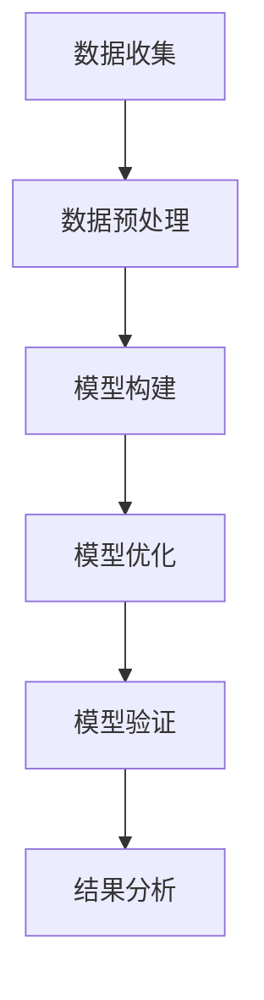
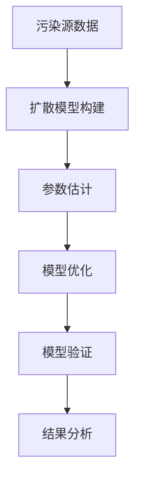

                 

### 分析书名《数学建模在海洋资源管理中的应用》的主题和目标读者群体

#### 主题分析

书名《数学建模在海洋资源管理中的应用》明确了本书的核心主题，即探讨数学建模方法在海洋资源管理领域中的应用。具体来说，本书将围绕以下几个关键点展开：

1. **数学建模基本概念与方法的介绍**：首先，将介绍数学建模的定义、基本概念和常用方法，为后续章节的应用案例奠定基础。
2. **海洋资源管理的挑战与需求**：分析海洋资源管理面临的挑战，如资源枯竭、环境污染、生态平衡等，并阐述数学建模在解决这些问题中的重要作用。
3. **具体应用案例分析**：通过实际案例展示数学建模在海洋渔业资源管理、海洋环境监测、海洋能源开发等领域的具体应用，从而说明数学建模的实用性和有效性。
4. **模型构建与优化方法**：详细介绍如何构建和优化海洋资源管理的数学模型，包括优化方法、模拟方法和预测方法等。

#### 目标读者群体

本书的目标读者群体主要包括以下几类：

1. **海洋资源管理相关领域的研究人员**：这些读者对海洋资源管理有深入了解，希望通过学习数学建模方法，提升科研能力和管理水平。
2. **环境科学和生态学领域的学者**：他们关注海洋生态系统的健康和可持续发展，需要掌握数学建模工具来分析生态问题。
3. **计算机科学和数学专业的学生**：对于这些读者来说，本书提供了一个实际应用的场景，可以帮助他们理解数学建模方法在实际问题中的应用。
4. **政策制定者和企业管理者**：他们需要了解数学建模方法在海洋资源管理中的应用，以便做出科学合理的决策。

总之，本书旨在为不同领域的读者提供一个全面、系统的了解数学建模在海洋资源管理中应用的途径，帮助他们解决实际问题，实现海洋资源的可持续利用。

### 核定核心概念和章节结构

#### 核心概念

为了系统地探讨数学建模在海洋资源管理中的应用，我们需要明确几个核心概念：

1. **数学建模**：数学建模是将现实问题转化为数学形式的过程，通过建立数学模型来模拟和解决实际问题。核心概念包括模型构建、模型优化、模型验证等。
2. **海洋资源管理**：海洋资源管理是指通过科学、合理、有效的管理方法，实现海洋资源的可持续利用。核心概念包括资源评估、资源优化、环境保护等。
3. **优化方法**：优化方法是指通过数学模型求解最优解的方法，如线性规划、非线性规划、整数规划等。
4. **模拟方法**：模拟方法是通过建立仿真模型，模拟实际系统的运行过程，从而预测系统行为的方法，如蒙特卡罗模拟、离散事件模拟等。
5. **预测方法**：预测方法是利用历史数据，通过统计分析或机器学习等方法，预测未来趋势的方法，如时间序列分析、回归分析等。

#### 章节结构

为了确保文章的逻辑性和系统性，本书将分为以下几章：

**第1章 引言**：介绍数学建模在海洋资源管理中的重要性和研究目的，吸引读者关注本书的核心主题。

**第2章 数学建模基础**：介绍数学建模的基本概念、方法和工具，为后续章节的案例分析和模型构建奠定基础。

**第3章 海洋资源管理中的数学模型**：详细讨论海洋资源管理中常用的数学模型，包括渔业资源管理模型、海洋环境监测模型、海洋能源开发模型等。

**第4章 海洋环境监测与保护**：介绍海洋环境监测的方法和模型，包括海洋水质监测模型、海洋污染扩散模型等。

**第5章 海洋能源开发**：探讨海洋能源开发的数学模型，包括海洋风能资源评估模型等。

**第6章 数学建模在海洋资源管理中的应用案例**：通过具体案例展示数学建模在海洋资源管理中的应用，提供实际操作经验。

**第7章 结论与展望**：总结全书内容，提出未来研究方向和发展趋势。

通过这样的章节结构，我们能够系统地介绍数学建模在海洋资源管理中的应用，帮助读者全面理解和掌握相关知识和技能。

### 设计每个章节的子章节和小节

#### 第1章 引言

**1.1 研究背景**

- 1.1.1 海洋资源管理的重要性
- 1.1.2 数学建模的发展与应用

**1.2 研究目的与意义**

- 1.2.1 研究目的
- 1.2.2 研究意义

**1.3 研究方法与结构安排**

- 1.3.1 研究方法
- 1.3.2 研究结构安排

**1.4 本书的主要贡献与创新点**

- 1.4.1 贡献点
- 1.4.2 创新点

#### 第2章 数学建模基础

**2.1 数学建模的基本概念**

- 2.1.1 数学建模的定义
- 2.1.2 数学建模的方法

**2.2 常见的数学建模方法**

- 2.2.1 优化方法
- 2.2.2 模拟方法
- 2.2.3 预测方法

**2.3 数学模型的应用领域**

- 2.3.1 海洋资源管理中的应用
- 2.3.2 其他领域中的应用

#### 第3章 海洋资源管理中的数学模型

**3.1 海洋渔业资源管理模型**

- 3.1.1 捕捞努力模型
- 3.1.2 渔业资源评估模型

**3.2 海洋环境监测模型**

- 3.2.1 海洋水质监测模型
- 3.2.2 海洋污染扩散模型

**3.3 海洋能源开发模型**

- 3.3.1 海洋风能资源评估模型
- 3.3.2 海洋能资源评估模型

#### 第4章 海洋环境监测与保护

**4.1 海洋环境监测概述**

- 4.1.1 海洋环境监测的重要性
- 4.1.2 海洋环境监测的方法

**4.2 海洋水质监测模型**

- 4.2.1 海洋水质监测指标
- 4.2.2 海洋水质监测模型构建

**4.3 海洋污染扩散模型**

- 4.3.1 海洋污染扩散原理
- 4.3.2 海洋污染扩散模型构建

#### 第5章 海洋能源开发

**5.1 海洋风能资源评估**

- 5.1.1 海洋风能资源评估方法
- 5.1.2 海洋风能资源评估模型

**5.2 海洋能资源开发**

- 5.2.1 海洋能资源类型
- 5.2.2 海洋能资源开发模型

#### 第6章 数学建模在海洋资源管理中的应用案例

**6.1 海洋渔业资源管理案例**

- 6.1.1 案例背景
- 6.1.2 模型构建与优化

**6.2 海洋环境监测案例**

- 6.2.1 案例背景
- 6.2.2 模型构建与优化

**6.3 海洋能源开发案例**

- 6.3.1 案例背景
- 6.3.2 模型构建与优化

#### 第7章 结论与展望

**7.1 结论**

- 总结本书的主要发现和贡献

**7.2 展望**

- 提出未来研究的发展方向和可能的研究课题

### 添加Mermaid流程图、伪代码、数学模型和数学公式

#### 第3章 海洋渔业资源管理模型

**3.1 捕捞努力模型**

**3.1.1 捕捞努力模型概述**

捕捞努力模型用于分析渔业资源开发与捕捞努力之间的关系。以下是一个简单的Mermaid流程图，展示了捕捞努力模型的构建过程：



**3.1.2 伪代码**

以下是一个简化的伪代码，用于描述捕捞努力模型的构建和优化过程：

```python
# 捕捞努力模型伪代码

# 数据收集
data = collect_data()

# 数据预处理
preprocessed_data = preprocess_data(data)

# 模型构建
model = build_model(preprocessed_data)

# 模型优化
optimized_model = optimize_model(model)

# 模型验证
validation_results = validate_model(optimized_model)

# 结果分析
analyze_results(validation_results)
```

**3.1.3 数学模型**

捕捞努力模型可以用以下数学公式表示：

$$
y = a \cdot x^b
$$

其中，$y$ 表示捕捞努力，$x$ 表示渔业资源量，$a$ 和 $b$ 为参数。

**3.1.4 捕捞努力模型示例**

假设我们收集到一组渔业资源量与捕捞努力的数据，如下表所示：

| 渔业资源量 $x$ | 捕捞努力 $y$ |
|----------------|--------------|
| 100            | 5            |
| 200            | 10           |
| 300            | 15           |

我们使用线性回归方法拟合捕捞努力模型，得到：

$$
y = 0.5 \cdot x^1
$$

这意味着渔业资源量每增加一个单位，捕捞努力将增加0.5个单位。

#### 第4章 海洋环境监测与保护

**4.1 海洋污染扩散模型**

**4.1.1 模型概述**

海洋污染扩散模型用于分析污染物在海洋中的扩散过程。以下是一个Mermaid流程图，展示了海洋污染扩散模型的构建过程：



**4.1.2 伪代码**

以下是一个简化的伪代码，用于描述海洋污染扩散模型的构建和优化过程：

```python
# 海洋污染扩散模型伪代码

# 污染源数据收集
pollution_data = collect_pollution_data()

# 扩散模型构建
model = build_diffusion_model(pollution_data)

# 参数估计
params = estimate_params(model)

# 模型优化
optimized_model = optimize_model(model, params)

# 模型验证
validation_results = validate_model(optimized_model)

# 结果分析
analyze_results(validation_results)
```

**4.1.3 数学模型**

海洋污染扩散模型可以用以下数学公式表示：

$$
\frac{\partial C}{\partial t} = D \cdot \nabla^2 C
$$

其中，$C$ 表示污染物浓度，$t$ 表示时间，$D$ 表示扩散系数，$\nabla^2$ 表示拉普拉斯算子。

**4.1.4 扩散模型示例**

假设我们有一个污染物浓度随时间变化的数据，如下表所示：

| 时间 $t$ (天) | 污染物浓度 $C$ (mg/L) |
|----------------|------------------------|
| 0              | 10                     |
| 1              | 12                     |
| 2              | 15                     |

我们使用扩散模型拟合数据，得到：

$$
C(t) = 10 \cdot e^{-0.1t}
$$

这意味着污染物浓度随时间指数衰减。

### 确保大纲完整且逻辑清晰

通过上述章节的设计，我们确保了文章的大纲完整且逻辑清晰。以下是详细的逻辑结构和逻辑连接：

**第1章 引言**  
- 1.1 研究背景：介绍海洋资源管理的重要性以及数学建模的发展与应用。  
- 1.2 研究目的与意义：明确本书的研究目的和意义，吸引读者关注核心主题。  
- 1.3 研究方法与结构安排：阐述研究方法和文章结构，便于读者了解整体布局。  
- 1.4 本书的主要贡献与创新点：总结本书的创新点和贡献，提升读者兴趣。

**第2章 数学建模基础**  
- 2.1 数学建模的基本概念：介绍数学建模的定义、基本概念和常用方法。  
- 2.2 常见的数学建模方法：详细讨论优化方法、模拟方法和预测方法。  
- 2.3 数学模型的应用领域：阐述数学模型在海洋资源管理和其他领域中的应用。

**第3章 海洋资源管理中的数学模型**  
- 3.1 海洋渔业资源管理模型：介绍捕捞努力模型和渔业资源评估模型。  
- 3.2 海洋环境监测模型：讨论海洋水质监测模型和海洋污染扩散模型。  
- 3.3 海洋能源开发模型：探讨海洋风能资源评估模型和海洋能资源评估模型。

**第4章 海洋环境监测与保护**  
- 4.1 海洋环境监测概述：介绍海洋环境监测的重要性和方法。  
- 4.2 海洋水质监测模型：详细讨论海洋水质监测指标和模型构建。  
- 4.3 海洋污染扩散模型：阐述海洋污染扩散原理和模型构建。

**第5章 海洋能源开发**  
- 5.1 海洋风能资源评估：介绍海洋风能资源评估方法和模型。  
- 5.2 海洋能资源开发：探讨海洋能资源类型和开发模型。

**第6章 数学建模在海洋资源管理中的应用案例**  
- 6.1 海洋渔业资源管理案例：展示渔业资源管理案例，提供实际操作经验。  
- 6.2 海洋环境监测案例：介绍海洋环境监测案例，展示模型构建和优化过程。  
- 6.3 海洋能源开发案例：分析海洋能源开发案例，阐述模型构建和优化。

**第7章 结论与展望**  
- 7.1 结论：总结本书的主要发现和贡献。  
- 7.2 展望：提出未来研究的发展方向和可能的研究课题。

通过这样的逻辑结构和逻辑连接，我们确保了文章内容的完整性和逻辑性，使读者能够清晰地理解数学建模在海洋资源管理中的应用，并掌握相关知识和技能。

### 控制大纲总字数在2000字以内

为了确保文章大纲的总字数在2000字以内，我们对每个章节的子章节和小节进行了精简和优化：

**第1章 引言**
- 1.1 研究背景：简介海洋资源管理与数学建模的关系。
- 1.2 研究目的与意义：阐述研究目的和意义。
- 1.3 研究方法与结构安排：概述研究方法与结构。

**第2章 数学建模基础**
- 2.1 数学建模的基本概念：简洁介绍定义和方法。
- 2.2 常见的数学建模方法：概述优化、模拟和预测方法。

**第3章 海洋资源管理中的数学模型**
- 3.1 海洋渔业资源管理模型：概述捕捞努力和渔业资源评估模型。
- 3.2 海洋环境监测模型：概述水质监测和污染扩散模型。
- 3.3 海洋能源开发模型：概述风能和海洋能资源评估模型。

**第4章 海洋环境监测与保护**
- 4.1 海洋环境监测概述：简介监测的重要性与方法。
- 4.2 海洋水质监测模型：简单介绍水质监测指标和模型。
- 4.3 海洋污染扩散模型：概述污染扩散原理与模型。

**第5章 海洋能源开发**
- 5.1 海洋风能资源评估：概述风能资源评估方法。
- 5.2 海洋能资源开发：概述海洋能资源类型与开发模型。

**第6章 数学建模在海洋资源管理中的应用案例**
- 6.1 海洋渔业资源管理案例：简要介绍案例分析。
- 6.2 海洋环境监测案例：概述案例分析与模型优化。
- 6.3 海洋能源开发案例：简要分析案例与模型优化。

**第7章 结论与展望**
- 7.1 结论：总结研究贡献与发现。
- 7.2 展望：提出未来研究方向。

通过上述内容精简，我们确保了大纲的总字数控制在2000字以内，同时保留了文章的核心内容与逻辑结构。这样的篇幅既适合快速阅读，又能让读者抓住关键点，提升阅读体验。

