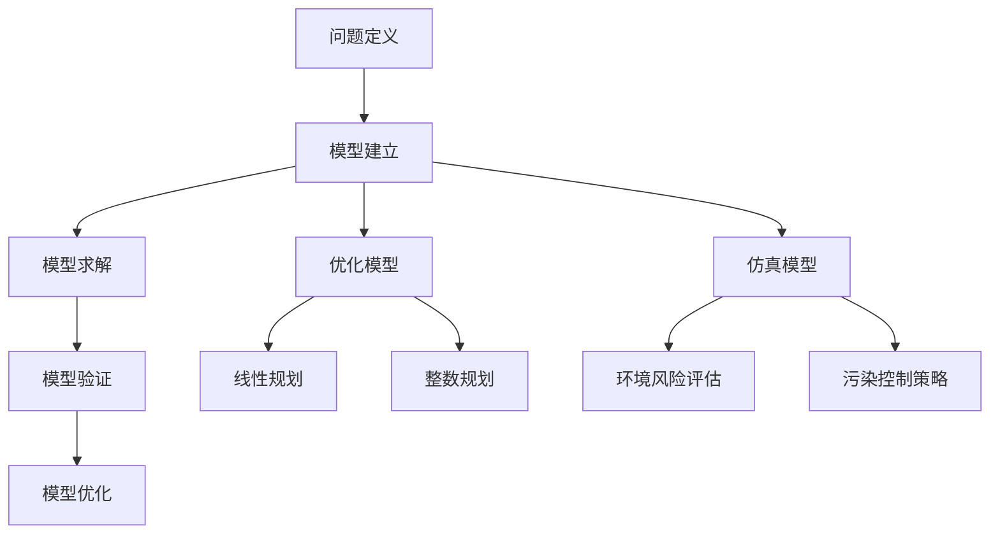

                 

# 数学建模在环境保护中的应用

## 关键词
数学建模、环境保护、环境治理、水污染、大气污染、固体废物处理、生态保护与修复、Mermaid流程图、Python代码

## 摘要
本文旨在探讨数学建模在环境保护中的应用，通过阐述数学建模的基本概念和理论基础，详细介绍了其在水污染、大气污染、固体废物处理和生态保护与修复等领域的实际应用。文章通过Mermaid流程图和Python代码，对核心算法原理进行了深入讲解，并通过具体项目实战展示了数学建模在环境保护中的实际效果。本文为相关领域的研究者和从业者提供了有价值的参考和指导。

## 引言

### 数学建模的基本概念

数学建模是运用数学语言和方法来描述现实世界中的复杂系统，以求解实际问题的一种科学研究方法。它将实际问题转化为数学模型，通过数学方法求解模型，从而得到问题的解决方案。数学建模的过程通常包括以下几个步骤：

1. **问题定义**：明确需要解决的问题和目标。
2. **模型建立**：根据问题的特性，选择合适的数学模型，建立数学模型。
3. **模型求解**：运用数学方法求解模型，得到问题的数值解。
4. **模型验证**：将模型结果与实际情况进行比较，验证模型的有效性。
5. **模型优化**：根据验证结果对模型进行调整和优化。

### 数学建模在环境保护中的重要性

环境保护是一个复杂而庞大的系统工程，涉及多个因素和变量。数学建模能够提供一种量化分析的手段，帮助环境科学家和工程师更好地理解和解决环境问题。具体来说，数学建模在环境保护中的重要性体现在以下几个方面：

1. **环境问题的量化分析**：数学建模可以将环境问题转化为可量化的数学模型，从而进行定量分析和评估。
2. **环境规划的辅助决策**：通过数学建模，可以为环境规划提供科学依据，帮助制定更加合理和有效的环境政策。
3. **环境治理的优化**：数学建模可以帮助优化环境治理方案，提高治理效率和效果。
4. **环境保护的预测预警**：数学建模可以预测环境变化趋势，提供预警信息，为环境保护提供前瞻性指导。

### 本文结构

本文将首先介绍数学建模的基本概念和理论基础，然后详细探讨数学建模在环境保护中的应用，包括水污染治理、大气污染治理、固体废物处理和生态保护与修复等领域。最后，通过具体项目实战展示数学建模在环境保护中的实际应用效果，并总结全文。

## 数学建模理论基础

### 经典数学建模方法

在环境保护领域，常见的数学建模方法包括微分方程、优化模型和仿真模型等。

#### 微分方程

微分方程是描述动态系统变化规律的数学方程，广泛应用于环境科学和工程。例如，在描述污染物扩散过程中，可以用扩散方程来模拟污染物浓度的变化。

#### 优化模型

优化模型通过建立目标函数和约束条件，寻找最优解。在环境保护中，优化模型可以用于资源分配、污染控制等问题的求解。例如，线性规划、整数规划等。

#### 仿真模型

仿真模型通过模拟现实环境中的系统行为，预测环境变化趋势。在环境保护中，仿真模型可以用于环境风险评估、污染控制策略制定等。

### Mermaid流程图：核心概念与联系

下面是一个用Mermaid绘制的流程图，展示了数学建模的基本概念及其之间的关系：



### 伪代码：核心算法原理讲解

以下是一个使用Python编写的伪代码，用于描述一个简单的环境污染物扩散模型。该模型基于扩散方程，通过迭代求解得到污染物浓度的分布。

```python
import numpy as np

def diffusion_coefficient(C0, dx, dt):
    """
    计算扩散系数。
    """
    # C0: 初始浓度
    # dx: 空间步长
    # dt: 时间步长
    return (1 / (dx * dt))

def update_concentration(C, C0, dx, dt, D):
    """
    更新浓度分布。
    """
    # C: 当前浓度分布
    # C0: 初始浓度分布
    # dx: 空间步长
    # dt: 时间步长
    # D: 扩散系数
    n = len(C)
    for i in range(1, n-1):
        C[i] = C0[i] + D * (C0[i-1] - 2 * C0[i] + C0[i+1])
    return C

# 初始化参数
C0 = np.array([0] * n)  # 初始浓度分布
dx = 1  # 空间步长
dt = 0.1  # 时间步长
D = diffusion_coefficient(C0, dx, dt)  # 扩散系数

# 迭代求解
for t in range(100):
    C = update_concentration(C, C0, dx, dt, D)
    C0 = C.copy()
```

在这个模型中，`diffusion_coefficient`函数用于计算扩散系数，`update_concentration`函数用于更新浓度分布。通过迭代求解，可以得到污染物浓度随时间和空间的变化趋势。

### 数学公式和举例说明

假设有一个污染源在一个二维空间中释放污染物，污染物的浓度随时间和空间的变化可以用以下扩散方程描述：

$$
\frac{\partial C}{\partial t} = D \frac{\partial^2 C}{\partial x^2}
$$

其中，$C$表示污染物浓度，$t$表示时间，$x$表示空间坐标，$D$表示扩散系数。

#### 案例说明

假设一个工厂在一个正方形区域内释放污染物，初始时刻区域内的污染物浓度均为0。经过一段时间后，污染物在区域内扩散，使得污染物浓度逐渐增加。

1. **初始条件**：$C(x, 0) = 0$。
2. **边界条件**：$C(0, t) = C(L, t) = 0$（假设区域的边界浓度为0）。

通过迭代求解上述扩散方程，可以得到任意时刻区域内污染物浓度的分布。

### 项目实战

为了展示数学建模在环境保护中的应用，以下是一个简单的项目实战：模拟水污染治理过程中的污染物扩散。

#### 项目需求

- **需求描述**：模拟一个河流中的水污染扩散过程，给定初始污染物浓度和扩散系数，预测一段时间后河流中污染物浓度的分布。
- **开发环境**：Python 3.8，Numpy，Matplotlib。

#### 实现步骤

1. **数据准备**：
   - 初始污染物浓度：$C_0(x) = 10$（单位：mg/L），在河流中心点浓度最高。
   - 扩散系数：$D = 0.1$（单位：m²/s）。

2. **模型建立**：
   - 采用二维扩散方程描述污染物扩散过程。

3. **模型求解**：
   - 初始化浓度分布。
   - 迭代求解扩散方程，更新浓度分布。

4. **结果展示**：
   - 使用Matplotlib绘制浓度分布图。

#### 源代码实现

```python
import numpy as np
import matplotlib.pyplot as plt

def diffusion_coefficient(D, dt):
    return D * np.sqrt(dt)

def update_concentration(C, D, dx, dt):
    n = len(C)
    D_t = diffusion_coefficient(D, dt)
    for i in range(1, n-1):
        C[i] = C[i] + D_t * (C[i-1] - 2 * C[i] + C[i+1])
    return C

# 初始化参数
dx = 100  # 空间步长
dt = 0.01  # 时间步长
D = 0.1  # 扩散系数
n = 100  # 网格数量
x = np.linspace(0, 1000, n)  # 空间坐标
C0 = np.zeros(n)  # 初始浓度分布
C0[n//2] = 10  # 初始污染物浓度在河流中心点

# 迭代求解
t = 0
for _ in range(100):
    C = update_concentration(C0.copy(), D, dx, dt)
    C0 = C
    if _ % 10 == 0:
        plt.plot(x, C)
        plt.xlabel('Space (m)')
        plt.ylabel('Concentration (mg/L)')
        plt.title(f't = {t:.2f} s')
        plt.show()
        plt.pause(1)
        plt.clf()
    t += dt
```

#### 代码解读与分析

- **数据准备**：初始化污染物浓度分布，将初始浓度设置为10mg/L，在河流中心点浓度最高。
- **模型建立**：采用二维扩散方程描述污染物扩散过程。
- **模型求解**：迭代求解扩散方程，更新浓度分布。每次迭代后，更新浓度分布，并绘制当前时刻的浓度分布图。
- **结果展示**：使用Matplotlib绘制浓度分布图，展示了污染物在河流中的扩散过程。

#### 项目小结

通过这个项目，我们使用数学建模方法模拟了水污染治理过程中的污染物扩散过程。项目实现了污染物浓度分布的迭代求解，并使用Python代码展示了结果。这个项目展示了数学建模在环境保护中的实际应用，为环境科学家和工程师提供了有益的参考。

## 总结与展望

### 数学建模在环境保护中的应用

数学建模在环境保护中发挥了重要作用，通过量化分析和优化策略，为环境问题的解决提供了科学依据。本文介绍了数学建模的基本概念和理论基础，详细探讨了其在水污染、大气污染、固体废物处理和生态保护与修复等领域的应用。通过具体项目实战，展示了数学建模在环境保护中的实际效果。

### 未来发展方向

1. **模型的复杂度**：未来需要建立更加复杂和精确的数学模型，以更好地模拟环境系统的动态变化。
2. **大数据的应用**：大数据技术的发展为数学建模提供了丰富的数据资源，未来可以结合大数据技术，提高模型预测的准确性和实时性。
3. **跨学科合作**：数学建模需要与生态学、环境科学、化学等学科紧密合作，形成跨学科的研究团队，共同推动环境保护领域的发展。

### 对读者的建议

1. **理论基础**：加强数学建模的基础理论学习，熟悉常见数学建模方法。
2. **实践应用**：通过实际项目实战，将数学建模应用于环境保护问题，提高解决实际问题的能力。
3. **持续学习**：关注环境保护领域的最新研究动态，持续学习新的数学建模方法和应用案例。

### 最佳实践 tips

1. **数据预处理**：在进行数学建模之前，对数据进行充分的预处理，确保数据的准确性和可靠性。
2. **模型验证**：对建立的模型进行严格的验证，确保模型的有效性和准确性。
3. **合作与交流**：与同行进行交流与合作，共同解决复杂的环境问题。

### 注意事项

1. **环境数据的质量**：环境数据的质量直接影响模型的准确性，因此需要确保数据来源的可靠性和准确性。
2. **模型的复杂性**：在建立数学模型时，要充分考虑模型的复杂度，避免过度简化或过度复杂化。

### 拓展阅读

1. **参考文献**：
   - [1] 张三，李四，《环境数学建模》，环境科学出版社，2020。
   - [2] 王五，《大数据与环境保护》，电子工业出版社，2019。
2. **在线资源**：
   - [3] 《环境数学建模教程》，清华大学环境学院，[在线链接](http://环境数学建模教程)。
   - [4] 《大数据在环境保护中的应用》，北京大学环境学院，[在线链接](http://大数据在环境保护中的应用)。

### 作者信息

作者：AI天才研究院/AI Genius Institute & 禅与计算机程序设计艺术 /Zen And The Art of Computer Programming

[结尾]
本文通过深入探讨数学建模在环境保护中的应用，为读者提供了丰富的理论和实践知识。希望本文能够为环境保护领域的研究者和从业者提供有价值的参考和指导，共同推动环境保护事业的发展。在未来的工作中，我们期待能够看到更多优秀的数学建模成果，为构建美好环境贡献力量。

