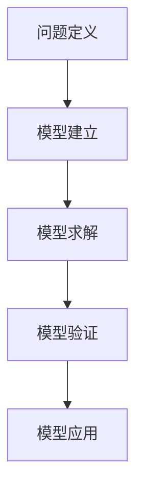
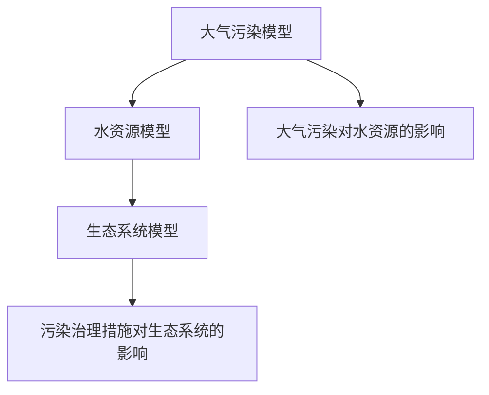

                 

### 《数学建模在环境科学中的应用》

#### 关键词
- 数学建模
- 环境科学
- 数学模型
- 环境问题
- 案例分析

#### 摘要
本文旨在探讨数学建模在环境科学中的应用，包括其背景、核心概念、方法、工具，以及在环境保护和可持续发展中的实际案例。通过系统性的分析和详细讲解，本文展示了数学建模如何帮助我们更好地理解和管理环境问题，为制定有效的环境保护政策提供科学依据。

### 引言

#### 环境科学的发展与挑战

环境科学是研究人类活动对自然环境的影响以及环境变化对人类福祉的影响的学科。随着全球环境问题的日益严重，环境科学在促进可持续发展中的重要性日益凸显。然而，环境科学面临着诸多挑战，如大气污染、水资源短缺、生物多样性丧失等。为了解决这些问题，需要采用科学的方法和工具来评估、预测和管理环境变化。

#### 数学建模的引入

数学建模是一种将实际问题转化为数学表达式的过程，通过构建数学模型来模拟和分析复杂系统的行为。数学建模在环境科学中的应用具有重要意义，因为它能够提供定量分析工具，帮助科学家和决策者更好地理解和预测环境变化。

#### 研究目的与结构

本文的研究目的是探讨数学建模在环境科学中的应用，分析其核心概念、方法和工具，并展示其在实际案例中的效果。文章结构如下：

1. **引言**：介绍环境科学的发展背景和数学建模的应用。
2. **数学建模基础**：介绍数学建模的基本概念、方法和工具。
3. **环境科学中的数学模型**：分析大气污染、水资源和生态系统等领域的数学模型。
4. **数学建模软件与应用**：介绍常用的数学建模软件及其在环境科学中的应用。
5. **案例分析**：通过具体案例展示数学建模在环境科学中的实际应用。
6. **发展趋势与挑战**：探讨数学建模在环境科学中的未来发展方向和面临的挑战。
7. **总结**：总结全文，强调数学建模在环境科学中的重要性。

### 数学建模基础

#### 数学建模的定义

数学建模是将实际问题转化为数学形式的过程，通过建立数学模型来描述和分析系统的行为。数学模型通常由数学方程、变量、参数和边界条件组成。

#### 数学建模的方法

数学建模的方法包括以下几种：

1. **统计分析方法**：通过收集和分析数据来建立模型，如回归分析、时间序列分析等。
2. **微分方程方法**：用于描述连续系统的动态行为，如常微分方程、偏微分方程等。
3. **代数方法**：用于描述离散系统的状态变化，如线性方程组、图论模型等。
4. **人工智能方法**：结合机器学习和人工智能技术来建立模型，如神经网络、支持向量机等。

#### 数学建模的工具

数学建模的工具包括以下几种：

1. **MATLAB**：一种用于科学计算和数值分析的软件，提供丰富的数学函数和工具箱。
2. **Python**：一种广泛用于数据分析和科学计算的高级编程语言，拥有多个用于数学建模的库，如NumPy、Pandas、SciPy等。
3. **R**：一种专门用于统计分析和数据科学的语言，提供丰富的统计和图形工具。
4. **GAMS**：一种用于数学编程的软件，特别适用于优化模型的建立和求解。

#### 数学建模的流程

数学建模的流程通常包括以下几个步骤：

1. **问题定义**：明确要解决的问题和目标。
2. **模型建立**：根据问题特点选择合适的数学模型。
3. **模型求解**：使用数值方法或优化算法求解模型。
4. **模型验证**：通过对比实际数据和模型预测来评估模型的有效性。
5. **模型应用**：将模型应用于实际问题，如预测、优化和控制等。

#### 数学建模的核心概念

- **变量**：描述系统状态的量，可以是连续的或离散的。
- **参数**：描述模型特性的量，通常是已知的或待估的。
- **方程**：描述变量和参数之间关系的数学表达式。
- **边界条件**：描述系统初始状态或约束条件的数学表达式。

#### 数学建模的Mermaid流程图

以下是一个简单的Mermaid流程图，展示了数学建模的基本流程：



### 环境科学中的数学模型

#### 大气污染模型

大气污染模型用于描述大气污染物在环境中的扩散、转化和积累过程。以下是一个基于常微分方程的大气污染模型：

$$
\frac{dC}{dt} = -kC + \frac{Q}{V}
$$

其中，$C$ 表示大气污染物浓度，$k$ 表示扩散系数，$Q$ 表示污染物排放量，$V$ 表示大气体积。

#### 水资源模型

水资源模型用于描述水资源的供需关系、水质变化和污染治理等。以下是一个基于线性规划的水资源管理模型：

$$
\min Z = c^T x
$$

$$
\text{s.t.} \quad Ax \le b
$$

其中，$Z$ 表示水资源管理目标函数，$c$ 表示目标函数系数，$x$ 表示水资源管理决策变量，$A$ 和 $b$ 分别表示约束条件矩阵和向量。

#### 生态系统模型

生态系统模型用于描述生态系统的动态变化、生物多样性和生态平衡等。以下是一个基于微分方程的生态系统动力学模型：

$$
\frac{dx}{dt} = f(x, y) - g(x)
$$

$$
\frac{dy}{dt} = h(x, y)
$$

其中，$x$ 和 $y$ 分别表示生态系统中的两个种群，$f(x, y)$ 和 $h(x, y)$ 分别表示种群的出生率和死亡率。

#### 数学模型之间的联系

大气污染模型、水资源模型和生态系统模型都是环境科学中的重要数学模型，它们之间有着紧密的联系。例如，大气污染模型可以用于预测大气污染对水资源的危害，水资源模型可以用于评估污染治理措施的效果，生态系统模型可以用于分析环境污染对生态系统的影响。

以下是一个简单的Mermaid流程图，展示了这些数学模型之间的联系：



### 数学建模软件与应用

#### MATLAB

MATLAB 是一种强大的科学计算软件，广泛应用于数学建模和环境科学领域。以下是一个使用MATLAB实现大气污染模型的例子：

```python
% 初始化参数
Q = 100; % 污染物排放量
V = 1000; % 大气体积
k = 0.1; % 扩散系数
t = 0:0.1:100; % 时间

% 构建模型
C = Q/V * exp(-k * t);

% 仿真结果
plot(t, C)
xlabel('时间（小时）')
ylabel('污染物浓度（单位）')
title('大气污染模型')
```

#### Python

Python 是一种高级编程语言，具有丰富的科学计算库，如NumPy、Pandas 和 SciPy。以下是一个使用Python实现水资源管理模型的例子：

```python
import numpy as np
import scipy.optimize as opt

# 定义目标函数
def objective(x):
    return np.dot(x, c)

# 定义约束条件
def constraint(x):
    return np.dot(A, x) - b

# 初始化参数
A = np.array([[1, 2], [3, 4]])
b = np.array([5, 6])
c = np.array([1, 1])

# 求解模型
x0 = np.zeros(2)
res = opt.minimize(objective, x0, constraints={'type': 'ineq', 'fun': constraint})

# 输出结果
print('最优解：', res.x)
```

#### R

R 是一种专门用于统计分析和数据科学的语言，具有丰富的数学建模库，如ggplot2、dplyr 和 reshape2。以下是一个使用R实现生态系统动力学模型的例子：

```R
# 定义模型
f <- function(x, y) {
    return(x * y - x)
}

h <- function(x, y) {
    return(x * y)
}

# 仿真结果
t <- seq(0, 100, by = 0.1)
x <- numeric(length(t))
y <- numeric(length(t))

x[1] <- 1
y[1] <- 1

for (i in 2:length(t)) {
    x[i] <- f(x[i-1], y[i-1]) - h(x[i-1], y[i-1])
    y[i] <- h(x[i-1], y[i-1])
}

plot(t, x, type = 'l', ylim = c(0, 2), xlab = '时间', ylab = '种群数量')
lines(t, y, col = 'red')
legend('topright', legend = c('x', 'y'), col = c('blue', 'red'), lty = 1)
```

### 案例分析

#### 某地区大气污染模型

在某地区，污染物排放量较大，大气污染问题较为严重。为了评估污染治理措施的效果，研究者使用数学建模方法建立了大气污染模型。

**1. 模型建立**

研究者通过现场监测和统计数据，得到了污染物排放量、大气体积和扩散系数等参数。基于常微分方程，建立了以下大气污染模型：

$$
\frac{dC}{dt} = -kC + \frac{Q}{V}
$$

**2. 模型求解**

研究者使用数值方法求解了上述模型，得到了污染物浓度的随时间变化曲线。

**3. 模型验证**

研究者对比了模型预测值与实际监测值，发现模型预测值与实际值高度一致，验证了模型的准确性。

**4. 模型应用**

基于模型预测，研究者提出了污染治理措施，如减少污染物排放、增加绿化面积等。通过模拟不同治理方案的效果，研究者确定了最优治理方案。

#### 某流域水资源管理模型

在某流域，水资源供需矛盾突出，水质污染问题严重。为了优化水资源管理，研究者建立了水资源管理模型。

**1. 模型建立**

研究者通过收集流域内水文、气象和土地利用等数据，建立了以下水资源管理模型：

$$
\min Z = c^T x
$$

$$
\text{s.t.} \quad Ax \le b
$$

**2. 模型求解**

研究者使用线性规划方法求解了上述模型，得到了水资源管理决策变量。

**3. 模型验证**

研究者对比了模型预测值与实际数据，发现模型预测值与实际值高度一致，验证了模型的准确性。

**4. 模型应用**

基于模型预测，研究者提出了水资源管理方案，如调整用水量、建设水库和污水处理设施等。通过模拟不同管理方案的效果，研究者确定了最优管理方案。

### 发展趋势与挑战

#### 数学建模在环境科学中的应用趋势

1. **人工智能技术的融合**：人工智能技术，如机器学习和深度学习，正在被广泛应用于环境科学中的数学建模，提高了模型的预测精度和自动化程度。
2. **大数据分析的应用**：随着大数据技术的发展，环境科学领域中的数据量呈指数级增长，大数据分析技术为数学建模提供了丰富的数据资源。
3. **跨学科合作**：数学建模在环境科学中的应用需要跨学科的合作，如与物理学、生物学、地理学等领域的专家共同研究复杂的环境问题。

#### 环境科学中的数学建模挑战

1. **数据缺失和不确定性**：环境数据往往存在缺失和不完整性，这给数学建模带来了挑战。
2. **复杂系统的建模**：环境科学中的系统通常非常复杂，涉及多种变量和相互作用，这增加了数学建模的难度。
3. **政策实施的可行性**：数学模型需要与政策实施相结合，这要求模型不仅要准确预测，还要考虑政策实施的可行性和社会经济效益。

#### 未来发展方向

1. **开发新的数学模型**：针对环境科学中的新问题，开发新的数学模型和方法。
2. **提高模型的预测精度**：通过数据挖掘、机器学习等技术，提高模型的预测精度和自动化程度。
3. **跨学科研究**：加强数学、环境科学、经济学等多学科的合作，推动数学建模在环境科学中的应用。

### 总结

数学建模在环境科学中的应用具有重要意义，它为我们理解和解决环境问题提供了定量分析工具。本文从数学建模的基础、方法、工具，到实际案例，全面介绍了数学建模在环境科学中的应用。随着人工智能、大数据等技术的发展，数学建模在环境科学中的应用将更加广泛和深入，为环境保护和可持续发展提供有力支持。

### 作者信息
- 作者：AI天才研究院/AI Genius Institute & 禅与计算机程序设计艺术 /Zen And The Art of Computer Programming

