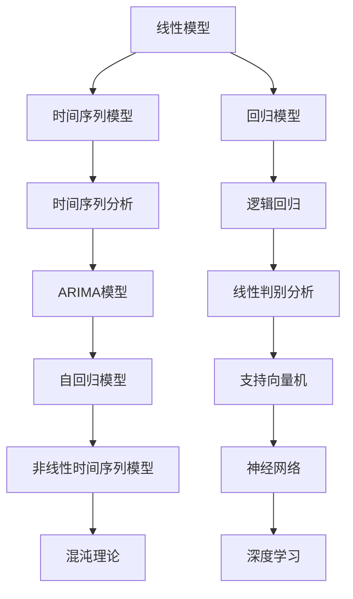
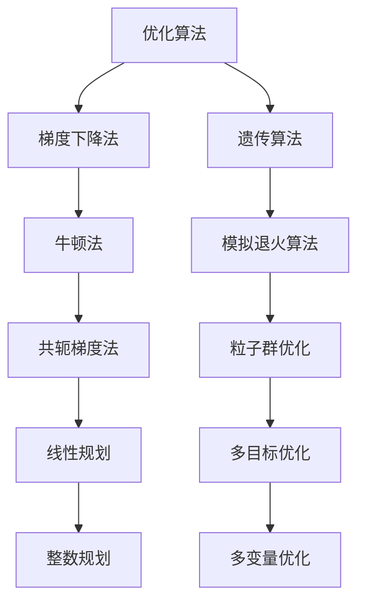
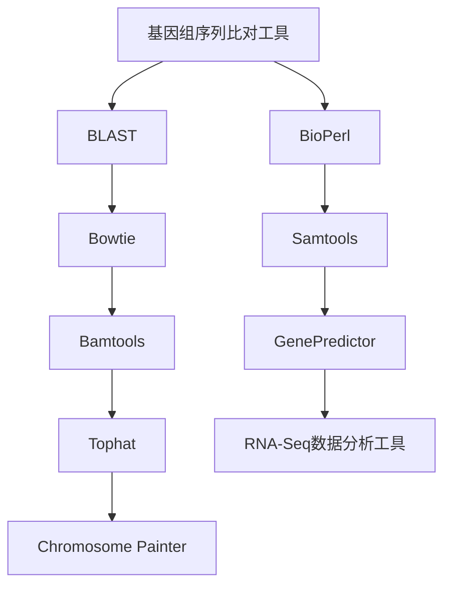

                 

### 文章标题

# 数学建模在生物信息学中的应用

---

> 关键词：数学建模、生物信息学、基因组学、蛋白质工程、数据可视化

> 摘要：本文旨在探讨数学建模在生物信息学中的应用，通过深入剖析数学建模的基本概念、方法与工具，结合生物信息学的实际案例，展示数学建模在基因组学、蛋白质工程等领域的强大作用。文章还将探讨数学建模在生物信息学中的应用前景与挑战。

---

### 引言

#### 数学建模概述

数学建模是运用数学语言和工具，对现实世界的复杂系统进行抽象、分析和模拟的过程。在生物学领域，数学建模被广泛应用于基因组学、蛋白质工程、生态学等研究领域。通过数学建模，科学家能够从复杂的数据中提取有用信息，预测生物系统的行为，进而揭示生物学现象的本质。

#### 生物信息学概述

生物信息学是研究生物学数据及其分析方法的一门交叉学科。它利用计算机技术和数学方法，对大量的生物学数据进行分析，以揭示生物体的结构和功能。生物信息学的研究内容包括基因组学、蛋白质组学、代谢组学等，其目标是理解和解释生物体的复杂生物学过程。

#### 本书目的与结构

本书旨在通过介绍数学建模的基本概念、方法和工具，结合生物信息学的实际案例，展示数学建模在生物信息学中的广泛应用。本书分为以下几个部分：

1. **数学建模基础**：介绍数学建模的基本原理、常用模型和算法。
2. **生物信息学基础**：介绍生物信息学的基本概念、研究方法和常用工具。
3. **数学建模在生物信息学中的应用**：具体案例和实践，展示数学建模在生物信息学中的实际应用。
4. **案例分析**：通过实际案例分析，加深读者对数学建模在生物信息学中的应用理解。
5. **总结与展望**：对全书内容进行总结，并对未来发展趋势进行展望。

### 数学建模基础

#### 数学建模的基本原理

数学建模的基本原理包括以下三个方面：

1. **抽象**：将现实问题抽象为数学模型，忽略非关键因素，突出主要因素。
2. **量化**：将抽象的数学模型用数学语言和工具进行量化，以便进行计算和分析。
3. **求解**：运用数学方法和算法，求解数学模型，以得到问题的解答。

#### 常用数学模型

在生物信息学中，常用的数学模型包括线性模型、非线性模型、离散模型等。以下是一个简单的Mermaid流程图，展示了这些模型之间的关系：



#### 常用数学算法

在数学建模中，常用的算法包括优化算法、模型评估算法和随机算法等。以下是一个简单的Mermaid流程图，展示了这些算法之间的关系：



### 生物信息学基础

#### 生物信息学的基本概念

生物信息学是研究生物学数据及其分析方法的一门交叉学科。它利用计算机技术和数学方法，对大量的生物学数据进行分析，以揭示生物体的结构和功能。生物信息学的研究内容包括基因组学、蛋白质组学、代谢组学等。

#### 生物信息学的研究方法

生物信息学的研究方法主要包括以下三个方面：

1. **数据收集**：通过高通量测序技术、蛋白质质谱技术等手段，收集大量的生物学数据。
2. **数据存储**：将收集到的生物学数据存储在数据库中，以便进行后续分析。
3. **数据分析**：运用数学建模和统计分析方法，对生物学数据进行处理和分析，以揭示生物体的结构和功能。

#### 生物信息学常用工具

生物信息学常用工具包括基因组序列比对工具、基因表达数据分析工具、蛋白质结构预测工具等。以下是一个简单的Mermaid流程图，展示了这些工具之间的关系：



### 数学建模在生物信息学中的应用

#### 蛋白质结构预测

蛋白质结构预测是生物信息学中的一个重要研究方向。通过数学建模，可以预测蛋白质的三维结构，从而揭示其功能。以下是一个简单的Python代码示例，展示了如何使用线性回归模型进行蛋白质结构预测：

```python
import numpy as np
import pandas as pd
from sklearn.linear_model import LinearRegression

# 加载数据
data = pd.read_csv('protein_structure_data.csv')

# 分割特征和标签
X = data[['sequence_length', 'hydrophobicity']]
y = data['structure']

# 创建线性回归模型
model = LinearRegression()

# 训练模型
model.fit(X, y)

# 预测新数据的结构
new_data = np.array([[10, 0.5]])
predicted_structure = model.predict(new_data)

print(f'Predicted structure: {predicted_structure}')
```

#### 基因表达数据分析

基因表达数据分析是生物信息学的另一个重要研究方向。通过数学建模，可以分析基因表达数据，揭示基因的功能和调控机制。以下是一个简单的Python代码示例，展示了如何使用聚类分析进行基因表达数据分析：

```python
import numpy as np
import pandas as pd
from sklearn.cluster import KMeans

# 加载数据
data = pd.read_csv('gene_expression_data.csv')

# 分割特征和标签
X = data.iloc[:, 1:]

# 创建K-means聚类模型
model = KMeans(n_clusters=3)

# 训练模型
model.fit(X)

# 预测新数据的聚类结果
new_data = np.array([[0.5, 1.2], [1.5, 0.8]])
predicted_clusters = model.predict(new_data)

print(f'Predicted clusters: {predicted_clusters}')
```

### 案例分析

#### 某研究机构的数学建模实践

某研究机构利用数学建模方法，对某一特定基因进行表达数据分析，以揭示其功能。具体步骤如下：

1. **数据收集**：收集该基因在不同细胞类型中的表达数据。
2. **数据预处理**：对收集到的数据进行分析，去除噪声和异常值。
3. **建立模型**：利用线性回归模型，分析基因表达数据与细胞类型之间的关系。
4. **模型验证**：利用另一组独立的数据，对模型进行验证。
5. **结果分析**：根据模型的预测结果，揭示该基因的功能。

#### 某生物制药公司的生物信息学应用

某生物制药公司利用生物信息学方法，对某一新药物进行作用机制分析。具体步骤如下：

1. **数据收集**：收集该药物对多种生物分子的作用数据。
2. **数据存储**：将收集到的数据存储在数据库中，以便进行后续分析。
3. **数据分析**：运用聚类分析和网络分析等方法，分析药物对生物分子的作用机制。
4. **结果解读**：根据分析结果，揭示该药物的作用机制和潜在副作用。

### 总结与展望

#### 全书总结

本书通过对数学建模和生物信息学的基本概念、方法与工具的深入剖析，展示了数学建模在生物信息学中的广泛应用。通过具体案例和实践，读者可以深入了解数学建模在基因组学、蛋白质工程等领域的实际应用。

#### 未来发展趋势

随着计算机技术和生物学的发展，数学建模在生物信息学中的应用将越来越广泛。未来发展趋势包括：

1. **更高效的算法**：开发更高效的数学建模算法，提高建模精度和计算速度。
2. **更广泛的应用**：将数学建模应用于更多的生物信息学领域，如代谢组学、表观遗传学等。
3. **跨学科合作**：加强数学、生物学、计算机科学等学科的交叉合作，推动数学建模在生物信息学中的应用。

### 最佳实践 Tips

1. **数据质量**：在进行数学建模前，确保数据质量，去除噪声和异常值，以提高建模精度。
2. **模型选择**：根据具体问题，选择合适的数学模型和算法，避免过度拟合和欠拟合。
3. **模型验证**：利用独立数据集对模型进行验证，确保模型的可靠性。

### 注意事项

1. **知识产权**：在进行生物信息学研究时，尊重知识产权，避免侵犯他人专利和版权。
2. **数据安全**：保护生物信息数据的安全，防止数据泄露和滥用。

### 拓展阅读

1. **《基因组学数据挖掘与生物信息学》**：详细介绍了基因组学数据挖掘的方法和技术。
2. **《数学建模方法与应用》**：涵盖了数学建模的基本原理、方法和应用案例。
3. **《生物信息学导论》**：全面介绍了生物信息学的基本概念、方法和应用领域。

---

**作者：AI天才研究院/AI Genius Institute & 禅与计算机程序设计艺术 /Zen And The Art of Computer Programming**

