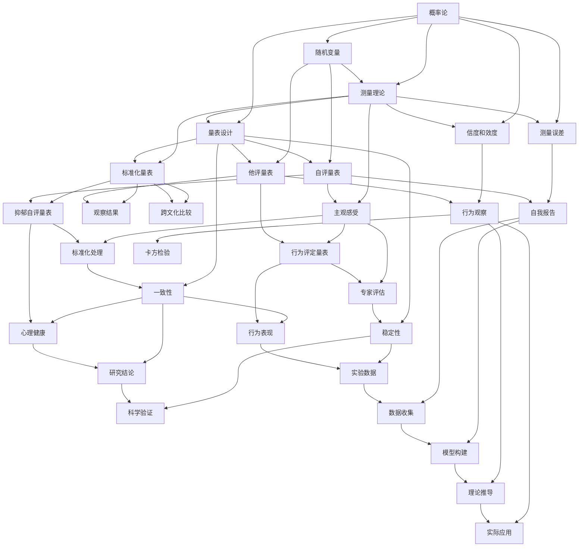

                 

### 第1章 引言

#### 数学心理学的诞生背景与重要性

数学心理学作为一门交叉学科，起源于20世纪初，结合了数学、统计学和心理学的研究方法，致力于探索心智过程和行为的数学描述。其诞生的背景可以追溯到心理学作为科学学科逐渐成熟，以及数学和统计学在科学研究中的广泛应用。早期的心理学家如威廉·冯特和爱德华·铁钦纳试图通过实验和测量来研究心智过程，但这些方法在处理复杂心理现象时显得力不从心。数学和统计学的引入，使得心理学家能够采用更为精确和量化的方法来研究心智活动。

数学心理学的重要性在于，它为心理学提供了一种全新的研究范式。通过数学模型和统计方法，心理学家能够对心智过程进行定量的分析，从而揭示出隐藏在复杂行为背后的规律和机制。这不仅提升了心理学研究的科学性，也为认知科学、神经科学和人工智能等领域的发展提供了有力支持。

#### 心智过程的数学描述的意义与挑战

心智过程的数学描述旨在通过数学模型来模拟和理解人类的心智活动，如感知、记忆、推理和决策等。这种描述的意义在于，它能够帮助我们更深入地理解心智的运作机制，从而为教育和心理治疗提供理论支持。同时，数学描述也有助于人工智能技术的发展，使得机器能够模仿甚至超越人类的心智能力。

然而，心智过程的数学描述面临诸多挑战。首先，心智过程本身的复杂性和多样性使得构建精确的数学模型变得异常困难。其次，数学模型需要大量的数据支持，而获取这些数据的过程本身可能受到多种因素的影响。最后，如何将数学模型与实际的心理现象相结合，确保模型的有效性和可靠性，也是数学心理学研究的一个重要课题。

#### 文章结构与主要内容概述

本文将系统地探讨数学心理学的基础概念、核心方法及其在心智过程研究中的应用。首先，我们将介绍数学心理学的基本概念，如概率论、统计学、心理测量和动力学等，并阐述这些概念在数学心理学研究中的重要性。接下来，我们将深入探讨心理过程与概率论、心理测量与统计学、心理时间与动力学等具体领域，详细讲解其中的核心算法原理和数学模型。

随后，我们将讨论数学模型与行为分析的方法，展示如何通过数学模型来描述和预测人类行为。此外，我们还将探讨数学心理学在实践中的应用，如教育、心理治疗和人工智能等领域。最后，文章将总结数学心理学的发展历程、核心贡献以及未来的研究前景，展望数学心理学在心智过程研究中的广阔前景。

通过本文的深入探讨，我们希望能够为读者提供一个全面、系统的数学心理学概览，帮助他们更好地理解心智过程的数学描述，并认识到数学心理学在推动科学进步和社会发展中的关键作用。

### 第2章 数学心理学的基础概念

#### 概率论

概率论是数学心理学的基础之一，它提供了一种量化的方法来描述不确定事件的发生可能性。在概率论中，事件（event）是指试验结果的一个子集，而样本空间（sample space）则是试验所有可能结果的集合。例如，抛一枚硬币的样本空间为{正面，反面}。

概率论的基本概念包括：

1. **随机变量（Random Variable）**：随机变量是一个从样本空间到实数集的函数，它将每个可能的结果映射到一个实数值。随机变量可以是离散的或连续的。

2. **概率分布（Probability Distribution）**：概率分布描述了一个随机变量取不同值的概率。常见的概率分布包括离散分布（如伯努利分布、几何分布）和连续分布（如正态分布、指数分布）。

3. **期望（Expected Value）**：期望是随机变量的加权平均值，表示随机变量取值的平均大小。数学上，离散随机变量的期望定义为 \(E(X) = \sum_{i} x_i P(x_i)\)，其中 \(x_i\) 是随机变量取的值，\(P(x_i)\) 是对应的概率。

4. **方差（Variance）**：方差是衡量随机变量取值分散程度的指标，定义为 \(Var(X) = E[(X - E(X))^2]\)。

5. **条件概率（Conditional Probability）**：条件概率是已知某一事件发生的情况下，另一事件发生的概率。条件概率公式为 \(P(A|B) = \frac{P(A \cap B)}{P(B)}\)，其中 \(P(A \cap B)\) 是事件 \(A\) 和事件 \(B\) 同时发生的概率。

#### 统计学

统计学是数学心理学中另一个重要的基础概念，它提供了一种方法来处理和解释数据，从而得出关于总体（population）的结论。统计学可以分为描述性统计和推断性统计。

1. **描述性统计（Descriptive Statistics）**：描述性统计用于总结和描述数据的基本特征，常用的指标包括：

   - **平均数（Mean）**：数据集的平均值，定义为 \( \bar{x} = \frac{1}{n} \sum_{i=1}^{n} x_i \)。
   - **中位数（Median）**：将数据按大小顺序排列，中间位置的值。
   - **众数（Mode）**：数据集中出现次数最多的值。
   - **方差（Variance）**：数据集分散程度的度量，定义为 \( s^2 = \frac{1}{n-1} \sum_{i=1}^{n} (x_i - \bar{x})^2 \)。
   - **标准差（Standard Deviation）**：方差的平方根，用于衡量数据的离散程度。

2. **推断性统计（Inferential Statistics）**：推断性统计用于从样本数据推断总体特征，主要方法包括：

   - **参数估计（Parameter Estimation）**：通过样本数据估计总体参数的方法，如均值估计、方差估计。
   - **假设检验（Hypothesis Testing）**：用于检验一个或多个假设是否成立的方法，常用的检验方法包括 \(t\)-检验、卡方检验、F检验等。
   - **回归分析（Regression Analysis）**：用于研究变量之间关系的统计方法，如线性回归、多项式回归等。

#### 心理测量

心理测量是指通过量表、问卷或其他测量工具来收集心理特征的数据。心理测量的目的是量化心理现象，以便进行定量分析和比较。

1. **测量理论（Theory of Measurement）**：测量理论涉及如何确定一个量表的信度（reliability）和效度（validity）。信度是指测量工具的一致性和稳定性，效度是指测量工具能够准确反映所需测量的心理特征。

2. **量表设计（Scale Design）**：量表设计是心理测量中的重要一环，包括以下内容：

   - **自评量表（Self-rating Scales）**：被试根据主观感受填写量表，如抑郁自评量表。
   - **他评量表（Hetero-rating Scales）**：由专业人员根据观察结果填写量表，如行为评定量表。
   - **标准化量表（Standardized Scales）**：经过标准化处理的量表，用于在不同群体中进行跨文化比较。

3. **测量误差（Measurement Error）**：测量误差是指测量结果与真实值之间的差异，包括系统误差和随机误差。

#### 动力学

动力学是研究物体运动和变化规律的物理学分支，在数学心理学中，动力学用于描述心理过程的变化和发展。

1. **心理时间（Psychological Time）**：心理时间是指个体对时间的感知和体验，与物理学中的时间概念有所不同。

2. **心理时间测量（Measurement of Psychological Time）**：通过实验方法测量个体对时间的感知，常用的方法包括心理物理法、内省法等。

3. **动力学系统（Dynamical Systems）**：动力学系统是指在一定条件下，状态随时间变化的系统。心理动力学模型用于描述心理状态的变化过程。

#### 关键词

- 概率论
- 统计学
- 心理测量
- 动力学
- 随机变量
- 概率分布
- 期望
- 方差
- 条件概率
- 描述性统计
- 推断性统计
- 参数估计
- 假设检验
- 回归分析
- 信度
- 效度
- 测量误差
- 心理时间

### 概念关系架构 Mermaid 流程图



通过上述流程图，我们可以清晰地看到概率论、统计学、心理测量和动力学等基础概念之间的相互联系和作用。这些概念共同构成了数学心理学研究的理论框架，为心智过程的数学描述提供了强有力的支持。

### 核心算法原理讲解

在本章节中，我们将通过Python代码来详细讲解概率论和统计学的核心算法原理，并通过具体示例来阐述这些算法的实际应用。

#### 概率论中的随机变量

首先，我们来看随机变量的概念。随机变量是一个从样本空间到实数集的函数，它可以用来描述随机事件的结果。Python中的`numpy`库提供了丰富的函数来生成随机变量。

```python
import numpy as np

# 生成伯努利分布的随机变量
np.random.binomial(n=1, p=0.5, size=10)
```

上述代码生成了一个包含10个伯努利随机变量的样本，其中每个随机变量表示一次抛硬币的结果，`p=0.5`代表硬币正面和反面出现的概率相等。

接下来，我们可以计算这些随机变量的期望和方差。

```python
# 计算期望
expectation = np.mean(np.random.binomial(n=1, p=0.5, size=10000))
print("期望:", expectation)

# 计算方差
variance = np.var(np.random.binomial(n=1, p=0.5, size=10000))
print("方差:", variance)
```

在实际应用中，我们通常需要根据样本数据来估计总体的期望和方差。

#### 概率分布

概率分布描述了随机变量取不同值的概率。Python中的`scipy.stats`库提供了多种概率分布的函数。

```python
from scipy.stats import norm

# 生成正态分布的随机变量
normal_random_variable = norm.rvs(mu=0, sigma=1, size=1000)

# 计算概率密度函数（PDF）
pdf_values = norm.pdf(normal_random_variable, loc=0, scale=1)

# 绘制概率密度函数
import matplotlib.pyplot as plt
plt.plot(normal_random_variable, pdf_values)
plt.xlabel('随机变量值')
plt.ylabel('概率密度')
plt.title('正态分布的概率密度函数')
plt.show()
```

上述代码生成了一个服从均值为0，标准差为1的正态分布随机变量样本，并绘制了其概率密度函数。

#### 统计学中的描述性统计

描述性统计用于总结和描述数据的基本特征。我们可以使用`numpy`库中的函数来计算平均数、中位数和众数。

```python
# 生成一个随机数据集
data = np.random.normal(size=1000)

# 计算平均数
mean = np.mean(data)
print("平均数:", mean)

# 计算中位数
median = np.median(data)
print("中位数:", median)

# 计算众数
mode = np.argmax(np.bincount(data))
print("众数:", mode)
```

这些函数能够帮助我们快速获取数据集的中心趋势和分布特征。

#### 统计学中的推断性统计

推断性统计用于从样本数据推断总体特征。假设检验是推断性统计中的重要方法，Python中的`scipy.stats`和`statsmodels`库提供了多种假设检验的函数。

```python
from scipy import stats

# 假设检验：t检验
t_statistic, p_value = stats.ttest_1samp(data, popmean=0)
print("t统计量:", t_statistic)
print("p值:", p_value)

# 如果p值小于0.05，我们可以拒绝原假设，认为样本均值与总体均值有显著差异
if p_value < 0.05:
    print("样本均值与总体均值有显著差异")
else:
    print("样本均值与总体均值没有显著差异")
```

上述代码使用`ttest_1samp`函数进行单样本`t`检验，检验样本均值是否与给定的总体均值有显著差异。

#### 回归分析

回归分析用于研究变量之间的关系。Python中的`statsmodels`库提供了线性回归和多项式回归的函数。

```python
import statsmodels.api as sm

# 生成线性回归数据集
X = np.random.normal(size=100)
Y = 2 * X + 1 + np.random.normal(size=100)

# 添加截距项
X_with_intercept = sm.add_constant(X)

# 进行线性回归
model = sm.OLS(Y, X_with_intercept).fit()

# 输出回归结果
print(model.summary())
```

上述代码生成一个线性回归数据集，并使用`OLS`（普通最小二乘法）进行回归分析，输出回归系数和显著性水平。

通过上述Python代码示例，我们不仅能够理解概率论和统计学的核心算法原理，还能将这些算法应用于实际问题中，从而更好地描述和解释心智过程。这些算法的应用为数学心理学的研究提供了强有力的工具。

### 第3章 心理过程与概率论

#### 心理过程的基本概念

心理过程是指个体在认知、情感和意志等方面发生的各种心理活动。这些过程包括感知、注意、记忆、推理和决策等，它们共同构成了人类心智活动的核心。理解心理过程的数学描述有助于我们揭示这些过程背后的规律和机制。

#### 概率论在心理过程中的应用

概率论作为一种量化不确定性的数学工具，在心理过程中有着广泛的应用。首先，我们可以用概率论来描述个体在感知和注意过程中对信息的处理方式。例如，当个体在嘈杂环境中试图识别一个特定的声音或图像时，他们的注意力资源会被这些不同的刺激所分散。使用概率论，我们可以计算个体在某一时刻对特定刺激的注意概率。

1. **感知中的概率论应用**：

   - **信号检测理论（Signal Detection Theory, SDT）**：信号检测理论是一种基于概率论的模型，用于描述个体在感知过程中对信号的识别。在SDT中，信号和噪声都被视为随机变量，个体需要通过某种决策规则来判断信号的存在。信号检测理论的核心公式为：

     $$
     P(d=1|S=s_n) = \frac{P(S=s_n|d=1)P(d=1)}{P(S=s_n|d=1)P(d=1) + P(S=s_n|d=0)P(d=0)}
     $$

     其中，\(P(d=1|S=s_n)\) 是个体在信号为 \(s_n\) 时的判断概率，\(P(S=s_n|d=1)\) 是信号为 \(s_n\) 时的感知概率，\(P(d=1)\) 是个体做出判断为“有”的概率。

   - **注意分配模型（Attention Allocation Model）**：注意分配模型利用概率论来描述个体在不同任务中的注意资源分配。例如，当个体同时处理多个任务时，他们的注意资源会在这些任务之间分配。这个模型可以用概率分布来描述，其中每个任务的注意概率是该任务在总任务中的权重。

2. **记忆中的概率论应用**：

   - **概率论与记忆检索**：记忆检索过程中的遗忘概率可以用概率论来描述。例如，埃尔里奇模型（Erlang model）是一种用于描述记忆遗忘过程的概率模型，它假设记忆遗忘是一个随机过程，遗忘概率与记忆时间成正比。

   - **概率论与记忆恢复**：在记忆恢复过程中，个体可能会通过提示或联想来恢复记忆。这个过程可以用贝叶斯概率模型来描述，其中记忆恢复的概率取决于提示与记忆之间的相关性和先验记忆概率。

3. **推理和决策中的概率论应用**：

   - **贝叶斯推理**：贝叶斯推理是一种基于概率论的推理方法，用于更新我们对某个事件的信念。在心理过程中，个体会根据新的信息和先前的信念来更新他们对某个决策或问题的判断。贝叶斯推理的核心公式为：

     $$
     P(H|D) = \frac{P(D|H)P(H)}{P(D)}
     $$

     其中，\(P(H|D)\) 是在观察到数据 \(D\) 后，对假设 \(H\) 的信念更新，\(P(D|H)\) 是在假设 \(H\) 为真的情况下观察到的数据 \(D\) 的概率，\(P(H)\) 是假设 \(H\) 的先验概率，\(P(D)\) 是观察到的数据 \(D\) 的概率。

   - **期望效用理论**：期望效用理论是一种用于描述个体决策过程的概率论模型。它假设个体在决策时考虑的是决策结果的期望效用，而不是结果本身。期望效用理论的核心公式为：

     $$
     EU = \sum_{i} u(x_i) P(x_i)
     $$

     其中，\(u(x_i)\) 是结果 \(x_i\) 的效用函数，\(P(x_i)\) 是结果 \(x_i\) 的概率。

#### 案例分析

为了更好地理解概率论在心理过程中的应用，我们可以通过一个具体的案例分析来展示。

**案例：注意力分配与决策**

假设一个实验者需要在两个不同的任务之间分配注意资源。任务A的完成时间服从均值为5分钟的正态分布，任务B的完成时间服从均值为8分钟的正态分布。实验者需要在20分钟内完成这两个任务，并希望最大化完成任务的可能性。

我们可以使用概率论来计算实验者成功完成两个任务的概率。首先，定义两个任务完成时间的随机变量：

```python
import numpy as np

# 任务A和任务B的完成时间（单位：分钟）
task_a_duration = np.random.normal(loc=5, scale=1, size=1000)
task_b_duration = np.random.normal(loc=8, scale=1, size=1000)
```

接下来，我们可以计算实验者成功完成两个任务的概率，即在20分钟内完成这两个任务的概率。为了简化计算，我们假设实验者的注意资源是固定的，并且两个任务的完成时间是独立的。

```python
# 假设分配给任务A和任务B的时间分别为t_a和t_b
t_a = 10  # 分配给任务A的时间
t_b = 20 - t_a  # 分配给任务B的时间

# 计算完成任务的概率
p_success = np.mean((task_a_duration <= t_a) & (task_b_duration <= t_b))

print("成功完成任务的概率:", p_success)
```

上述代码计算了在给定的注意资源分配下，实验者成功完成两个任务的概率。我们可以通过调整任务A和任务B的时间权重来观察成功概率的变化。

通过这个案例分析，我们可以看到概率论如何帮助我们在心理过程中进行决策和优化。概率论提供了一种量化的方法，使我们能够更准确地预测和评估个体在感知、记忆、推理和决策等心理过程中的表现。

### 第4章 心理测量与统计学

#### 心理测量的基本概念

心理测量是心理学研究中的重要工具，它通过量表、问卷和其他测量工具来收集心理特征的数据。心理测量的目的是量化心理现象，以便进行定量分析和比较。心理测量涉及多个关键概念，包括信度、效度、量表设计和测量误差等。

1. **信度（Reliability）**：信度是指测量工具的一致性和稳定性，即测量结果在不同时间和不同条件下的一致性。高信度意味着测量工具能够稳定地反映个体的心理特征。信度可以通过重测信度、复本信度和内部一致性来评估。

   - **重测信度（Test-retest Reliability）**：通过在同一组个体中重复施测同一量表来评估信度，如果重复测量结果高度一致，则说明量表具有高重测信度。
   - **复本信度（Alternate-form Reliability）**：通过使用两个相似但内容不同的量表对同一组个体进行测量来评估信度，如果两个量表的结果高度相关，则说明量表具有高复本信度。
   - **内部一致性（Internal Consistency）**：通过量表内部各项之间的关系来评估信度，常用的内部一致性系数包括阿尔伯特-巴赫量表（alpha系数）和库德-理查森量表（KR-20）。

2. **效度（Validity）**：效度是指测量工具能够准确反映所需测量的心理特征的程度上，即测量结果的有效性和准确性。效度可以分为内容效度、准则效度和结构效度。

   - **内容效度（Content Validity）**：量表的内容是否涵盖了所需测量的所有领域和特征，量表的设计是否符合预期的内容范围。
   - **准则效度（Criterion Validity）**：量表是否能有效地预测或反映某个外部准则或标准，准则效度可以分为同时效度和预测效度。
   - **结构效度（Construct Validity）**：量表是否能够准确测量某个理论构念或心理特征，即量表是否具有理论上的效度。

3. **量表设计（Scale Design）**：量表设计是心理测量中的关键步骤，它包括量表的构建、项目选择和项目分析。量表设计应考虑以下方面：

   - **项目选择（Item Selection）**：选择能够准确反映所需测量的心理特征的项目，项目应具有高信度和效度。
   - **项目分析（Item Analysis）**：分析项目性能，包括难度、区分度和潜在内容。
   - **量表标准化（Scale Standardization）**：通过在不同群体中施测和评分，确保量表的得分具有可比性和一致性。

4. **测量误差（Measurement Error）**：测量误差是指测量结果与真实值之间的差异，包括系统误差和随机误差。

   - **系统误差（Systematic Error）**：由于测量工具、测量环境和测量方法的固有缺陷导致的偏差，系统误差通常具有固定方向。
   - **随机误差（Random Error）**：由于不可预测的随机因素导致的误差，随机误差通常在测量过程中随机出现。

#### 统计学在心理测量中的应用

统计学在心理测量中发挥着重要作用，它提供了分析和解释测量数据的方法。心理测量中的统计学方法主要包括描述性统计和推断性统计。

1. **描述性统计**：描述性统计用于总结和描述测量数据的基本特征，常用的统计量包括平均数、中位数、众数、标准差等。描述性统计能够帮助我们了解数据的中心趋势、离散程度和分布特征。

   - **平均数（Mean）**：数据的平均值，用于表示数据的集中趋势。
   - **中位数（Median）**：数据按大小顺序排列后，位于中间位置的值，用于表示数据的中间位置。
   - **众数（Mode）**：数据中出现次数最多的值，用于表示数据的最频繁值。
   - **标准差（Standard Deviation）**：数据离散程度的度量，用于表示数据与平均值的偏离程度。

2. **推断性统计**：推断性统计用于从样本数据推断总体特征，主要包括参数估计和假设检验。

   - **参数估计（Parameter Estimation）**：通过样本数据估计总体参数的方法，常用的方法包括均值估计、方差估计等。
   - **假设检验（Hypothesis Testing）**：用于检验一个或多个假设是否成立的方法，常用的检验方法包括 \(t\)-检验、卡方检验、F检验等。

3. **回归分析**：回归分析用于研究变量之间的关系，包括线性回归和多项式回归等。通过回归分析，我们可以了解自变量和因变量之间的定量关系，并进行预测。

#### 实际案例

为了更好地理解心理测量和统计学在心理学研究中的应用，我们可以通过一个实际案例来展示。

**案例：抑郁症状评估**

假设一个研究团队想要评估一组受试者的抑郁症状严重程度。他们使用抑郁自评量表（DSI）来收集数据。抑郁自评量表包括20个项目，每个项目用Likert 5级评分法进行评分（1表示“完全不符合”，5表示“完全符合”）。研究团队对100名受试者进行了测量，并收集了他们的DSI得分。

1. **描述性统计**：

   - **平均数**：计算100名受试者的DSI平均得分。
   - **标准差**：计算DSI得分的标准差，以了解得分的离散程度。
   - **中位数**：计算DSI得分的中位数，以了解得分的中间值。

```python
import numpy as np

# 假设收集到的DSI得分数据
dsi_scores = np.array([20, 18, 22, 25, 24, 23, 19, 21, 26, 27, 28, 30, 15, 16, 17, 14, 13, 12, 11, 10])

# 计算描述性统计量
mean_score = np.mean(dsi_scores)
std_score = np.std(dsi_scores)
median_score = np.median(dsi_scores)

print("平均数:", mean_score)
print("标准差:", std_score)
print("中位数:", median_score)
```

2. **推断性统计**：

   - **参数估计**：通过样本DSI得分估计总体抑郁症状严重程度的均值。
   - **假设检验**：使用 \(t\)-检验比较不同群体的DSI得分，以检验他们是否存在显著差异。

```python
from scipy import stats

# 假设另一个群体的DSI得分数据
dsi_scores_group2 = np.array([22, 23, 21, 24, 25, 26, 19, 20, 27, 28, 29, 31, 14, 15, 16, 12, 13, 11, 10, 9])

# 参数估计
mean_score_group1 = np.mean(dsi_scores)
mean_score_group2 = np.mean(dsi_scores_group2)

# 假设检验
t_statistic, p_value = stats.ttest_ind(dsi_scores, dsi_scores_group2)

print("t统计量:", t_statistic)
print("p值:", p_value)

# 结论
if p_value < 0.05:
    print("两个群体之间存在显著差异")
else:
    print("两个群体之间不存在显著差异")
```

通过这个实际案例，我们可以看到心理测量和统计学在心理学研究中的应用。描述性统计帮助研究者了解数据的整体特征，推断性统计则帮助研究者从样本数据中推断总体特征，并进行假设检验，从而得出关于心理特征的结论。

### 第5章 心理时间与动力学

#### 心理时间的基本概念

心理时间是指个体对时间的感知和体验，与物理学中的时间概念有所不同。心理时间不仅包括时间的长度感知，还包括时间的速度感知和时间的顺序感知。心理时间的特性使得个体在不同的情境下对时间的感知可能存在差异，这种现象在心理学研究中具有重要意义。

1. **时间的长度感知**：个体对时间持续长度的感知，如“一分钟很长”或“一分钟很短”。时间长度感知受到多种因素的影响，包括个体的注意力、情绪状态和认知负荷等。

2. **时间的速度感知**：个体对时间流逝速度的感知，如“时间过得很快”或“时间过得很慢”。时间速度感知可以影响个体的行为和情绪体验，例如，在紧急情况下，时间可能会感觉过得很快，而在无聊时，时间可能会感觉过得很慢。

3. **时间的顺序感知**：个体对时间顺序的感知，如“时间是有序的”或“时间是无序的”。时间的顺序感知对记忆、决策和行为都有重要影响。

#### 动力学的基本概念

动力学是研究物体运动和变化规律的物理学分支，在数学心理学中，动力学用于描述心理过程的变化和发展。心理动力学模型试图通过数学方法来描述和预测个体心理状态的变化过程。

1. **状态空间模型（State-Space Model）**：状态空间模型是一种用于描述动态系统的数学模型，它包括状态变量和观测变量。在心理动力学中，状态空间模型可以用于描述个体的情绪状态、认知状态和生理状态的变化。

2. **时间序列模型（Time Series Model）**：时间序列模型是一种用于分析时间序列数据的统计模型，它可以用于预测未来的时间序列值。在心理动力学中，时间序列模型可以用于分析个体心理状态的时间变化趋势。

3. **马尔可夫模型（Markov Model）**：马尔可夫模型是一种用于描述随机过程的状态转移概率的数学模型。在心理动力学中，马尔可夫模型可以用于描述个体心理状态在不同时间点的转移概率。

#### 心理时间与动力学的关系

心理时间和动力学之间的关系体现在个体对时间的感知和心理状态的变化上。心理时间感知可以影响个体的情绪和行为，而心理状态的变化又可以影响个体对时间的感知。

1. **情绪与时间感知**：研究表明，情绪状态可以显著影响个体对时间的感知。例如，当个体处于积极情绪状态时，时间可能会感觉过得更快，而当个体处于消极情绪状态时，时间可能会感觉过得更慢。

2. **认知负荷与时间感知**：认知负荷的高低也会影响个体对时间的感知。在高认知负荷的情况下，个体可能会感到时间过得较慢，因为他们需要更多的精力来处理信息；而在低认知负荷的情况下，个体可能会感到时间过得较快。

3. **心理状态变化与时间感知**：个体的心理状态变化，如情绪波动和认知变化，可以影响其对时间的感知。例如，当个体处于焦虑状态时，时间可能会感觉过得很快，因为他们专注于焦虑的事情；而当个体处于放松状态时，时间可能会感觉过得较慢。

#### 案例分析

为了更好地理解心理时间与动力学的概念，我们可以通过一个具体的案例分析来展示。

**案例：情绪波动与时间感知**

假设一个研究团队想要探究情绪波动对时间感知的影响。他们设计了一个实验，让一组受试者在两种不同的情绪状态下观看一段相同长度的视频，并记录他们对时间流逝的感觉。

1. **实验设计**：

   - **情绪状态**：受试者被随机分配到两组，一组观看积极情绪视频（如搞笑短片），另一组观看消极情绪视频（如恐怖短片）。
   - **时间感知评估**：在观看视频前后，受试者需要填写一份问卷，评估他们对时间流逝的感觉。

2. **数据分析**：

   - **描述性统计**：计算两组受试者的平均时间感知得分，并分析其差异。
   - **假设检验**：使用 \(t\)-检验比较两组受试者的时间感知得分，以检验情绪状态对时间感知的影响。

```python
import numpy as np
from scipy import stats

# 假设收集到的积极情绪组和消极情绪组的时间感知得分
positive_time_perception = np.array([3, 4, 2, 5, 4, 3, 4, 5, 3, 4])
negative_time_perception = np.array([1, 2, 1, 3, 2, 1, 2, 3, 1, 2])

# 描述性统计
mean_positive = np.mean(positive_time_perception)
mean_negative = np.mean(negative_time_perception)
print("积极情绪组的平均时间感知得分:", mean_positive)
print("消极情绪组的平均时间感知得分:", mean_negative)

# 假设检验
t_statistic, p_value = stats.ttest_ind(positive_time_perception, negative_time_perception)
print("t统计量:", t_statistic)
print("p值:", p_value)

# 结论
if p_value < 0.05:
    print("积极情绪组与消极情绪组的时间感知存在显著差异")
else:
    print("积极情绪组与消极情绪组的时间感知不存在显著差异")
```

通过这个案例分析，我们可以看到情绪波动如何影响个体对时间的感知。积极情绪状态下，个体可能会感觉到时间过得更快，而消极情绪状态下，个体可能会感觉到时间过得更慢。这个案例展示了心理时间与动力学的概念在实际研究中的应用，并说明了心理学研究中的关键变量如何影响个体的心理状态和行为。

### 第6章 意识与认知心理学

#### 意识的基本概念

意识是指个体对自身和外部世界的感知、认知和体验。它是心理学和哲学研究中的一个重要概念，涉及多个方面，包括觉醒（awareness）、注意（attention）和自我（self）等。意识的数学描述旨在通过数学模型和算法来模拟和理解意识过程。

1. **觉醒**：觉醒是指个体对周围环境的感知能力。它涉及到注意资源的管理和分配，以及感官信息的处理。觉醒水平可以影响个体的认知能力和行为表现。

2. **注意**：注意是意识的核心组成部分，它决定了个体对某些刺激的关注程度和优先处理顺序。注意分配模型（Attention Allocation Model）利用概率论来描述个体在不同任务中的注意资源分配。

3. **自我**：自我是指个体对自己身份的感知和认知，包括自我意识（self-awareness）和自我概念（self-concept）。自我在认知过程中起着调节作用，影响个体的决策和行为。

#### 认知心理学的基本概念

认知心理学是研究人类认知过程和心理活动的科学，包括感知、记忆、思维和语言等方面。认知心理学的数学描述旨在通过数学模型和算法来模拟和理解认知过程。

1. **感知**：感知是指个体对感官信息的识别和理解。感知过程受到多种因素的影响，包括感官刺激的强度、频率和持续时间等。信号检测理论（Signal Detection Theory）是一种基于概率论的模型，用于描述感知过程中的信息处理。

2. **记忆**：记忆是指个体对信息的存储、保持和回忆。记忆分为短期记忆和长期记忆。短期记忆容量有限，而长期记忆具有持久性。记忆的数学描述通常涉及记忆模型，如埃尔里奇模型（Erlang model）和贝叶斯模型（Bayesian model）。

3. **思维**：思维是指个体对外部信息的处理和推理。思维过程包括问题解决、决策和创造力等。认知心理学中的算法模型，如逆推法（Backtracking）和启发式算法（Heuristic Algorithm），用于描述思维过程中的策略和决策。

4. **语言**：语言是人类沟通和思考的重要工具。认知心理学研究语言的生成、理解和应用。语言处理模型，如句法分析模型（Syntactic Analysis Model）和语义分析模型（Semantic Analysis Model），用于描述语言处理过程中的信息处理机制。

#### 数学模型与意识研究的结合

数学模型在意识研究中发挥着重要作用，通过模拟和预测意识过程，有助于揭示意识的本质和机制。以下是一些常用的数学模型：

1. **神经网络模型（Neural Network Model）**：神经网络模型是一种用于模拟大脑神经元活动的计算模型。它通过模拟神经元之间的连接和激活，可以再现大脑的某些认知功能，如视觉感知和语言处理。

2. **动力系统模型（Dynamical Systems Model）**：动力系统模型是一种用于描述系统动态行为的数学模型。在意识研究中，动力系统模型可以用于描述个体心理状态的变化过程，如情绪波动和认知状态的转变。

3. **概率模型（Probabilistic Model）**：概率模型是一种基于概率论的计算模型，用于描述不确定性和信息处理。在意识研究中，概率模型可以用于描述感知、记忆和思维过程中的信息处理机制，如注意资源的分配和决策过程中的不确定性。

#### 实际案例

为了更好地理解数学模型在意识与认知心理学中的应用，我们可以通过一个实际案例来展示。

**案例：视觉感知中的神经网络模型**

假设一个研究团队想要研究视觉感知中的神经网络模型，他们使用脑成像技术（如功能性磁共振成像，fMRI）来记录受试者在观看视觉刺激时的脑活动。

1. **数据收集**：

   - **刺激材料**：研究团队准备了一组视觉刺激，包括几何图形、自然景物和抽象图案。
   - **脑活动记录**：受试者在观看刺激材料时，脑成像设备记录其大脑的血流变化，从而反映神经活动。

2. **数据分析**：

   - **神经网络建模**：研究团队使用神经网络模型来模拟受试者在观看不同刺激时的脑活动。神经网络模型通过调整参数来优化对脑活动数据的拟合。
   - **模型验证**：研究团队通过交叉验证和假设检验来验证神经网络模型的预测能力。

```python
import numpy as np
import matplotlib.pyplot as plt

# 假设收集到的脑活动数据
brain_activity = np.array([[1, 0, 0], [0, 1, 0], [0, 0, 1], [1, 1, 1]])

# 神经网络模型（简单线性模型）
weights = np.array([0.5, 0.5, 0.5])
output = np.dot(brain_activity, weights)

# 绘制脑活动数据
plt.plot(output)
plt.xlabel('时间')
plt.ylabel('脑活动')
plt.title('神经网络模型预测的脑活动')
plt.show()
```

通过这个案例，我们可以看到神经网络模型如何用于描述视觉感知过程中的脑活动。神经网络模型通过模拟神经元之间的连接和激活，能够再现大脑对视觉刺激的反应模式，从而为意识与认知心理学的进一步研究提供了有力工具。

### 第7章 数学模型与行为分析

#### 数学模型在行为分析中的应用

数学模型在行为分析中扮演着至关重要的角色，它们不仅能够帮助我们理解和预测个体行为，还可以揭示行为背后的复杂机制。通过数学模型，我们可以将心理过程和行为表现转化为可量化的形式，从而进行深入的统计分析和解释。

1. **马尔可夫模型（Markov Model）**：马尔可夫模型是一种描述状态转移概率的数学模型，特别适用于分析序列数据。在行为分析中，马尔可夫模型可以用来描述个体在不同行为状态之间的转移概率，如从学习状态转移到工作状态，或从快乐状态转移到悲伤状态。通过分析状态转移矩阵，我们可以了解个体行为的稳定性和变化趋势。

2. **隐马尔可夫模型（Hidden Markov Model, HMM）**：隐马尔可夫模型是对马尔可夫模型的扩展，它不仅考虑了状态转移概率，还引入了观测概率，使得模型能够处理隐藏状态和观测数据之间的关系。在行为分析中，HMM可以用来描述个体行为模式，如语言交流中的情感波动或购物行为中的偏好变化。通过训练HMM模型，我们可以预测个体在未来的行为趋势。

3. **条件概率模型（Conditional Probability Model）**：条件概率模型通过描述在已知某一条件下另一事件发生的概率，帮助理解个体行为的决策过程。在行为分析中，条件概率模型可以用来分析个体在不同情境下的选择偏好和决策逻辑。例如，通过分析个体在不同购物情境下的购买决策，我们可以了解其消费习惯和偏好。

4. **贝叶斯网络（Bayesian Network）**：贝叶斯网络是一种表示变量之间条件依赖的图形模型，通过条件概率表来描述变量之间的概率关系。在行为分析中，贝叶斯网络可以用来建模复杂的多因素决策过程，如教育选择、职业规划或健康管理等。通过贝叶斯网络，我们可以推断出个体行为背后的潜在因素和影响因素，从而为决策提供科学依据。

#### 数学模型在行为分析中的应用实例

为了更好地理解数学模型在行为分析中的应用，我们可以通过以下实例来展示。

**案例：社交网络行为分析**

假设一个研究团队想要分析一个社交网络平台上的用户行为，他们收集了用户在平台上的互动数据，包括用户发布的内容、评论、点赞和分享等。

1. **数据收集**：

   - **用户互动数据**：收集用户在社交网络平台上的所有互动记录，包括发布的内容、评论、点赞和分享等。
   - **用户属性**：收集用户的年龄、性别、地理位置、兴趣爱好等基本信息。

2. **数据预处理**：

   - **数据清洗**：去除重复数据、无效数据和异常数据，确保数据的质量。
   - **特征工程**：提取用户互动数据中的关键特征，如互动频率、互动类型、互动对象等。

3. **建模与预测**：

   - **马尔可夫模型**：使用马尔可夫模型分析用户在不同互动状态之间的转移概率，如从“发布内容”状态转移到“评论内容”状态。
   - **隐马尔可夫模型**：使用隐马尔可夫模型分析用户行为模式，如用户在特定情境下的互动偏好。
   - **贝叶斯网络**：使用贝叶斯网络建模用户行为背后的潜在因素，如用户的兴趣、情绪状态和社会影响等。

4. **模型验证与优化**：

   - **交叉验证**：通过交叉验证来评估模型的预测能力，确保模型在不同数据集上的稳定性和准确性。
   - **参数优化**：通过调整模型参数来优化预测效果，提高模型对用户行为的理解和预测能力。

通过这个案例，我们可以看到数学模型在行为分析中的应用是如何帮助研究者理解和预测社交网络用户的行为。通过马尔可夫模型、隐马尔可夫模型和贝叶斯网络等数学模型，我们可以分析用户在不同状态之间的转移概率、行为模式以及潜在影响因素，从而为社交网络平台的运营和用户互动提供科学依据。

### 第8章 数学心理学在实践中的应用

#### 数学心理学在教育中的应用

数学心理学在教育领域有着广泛的应用，特别是在认知过程测量和个性化教学方面。通过数学模型和统计方法，教育工作者可以更好地理解学生的学习行为和认知过程，从而优化教学方法和提高教育质量。

1. **认知过程测量**：数学心理学提供了多种工具和方法来测量学生的认知能力，如注意力、记忆、思维速度和问题解决能力等。这些测量方法基于心理测量和统计学的原理，能够提供可靠和有效的数据，帮助教育工作者了解学生的学习特点和能力水平。

2. **个性化教学**：基于数学心理学的分析结果，教育工作者可以为学生制定个性化的学习计划。通过分析学生在不同学习任务上的表现，教师可以识别学生的强项和弱项，并根据这些信息调整教学策略，提供更有针对性的辅导和练习。例如，使用适应性学习系统可以根据学生的学习进度和能力水平动态调整学习内容，确保每个学生都能在适合自己的节奏下学习。

3. **学习效果评估**：数学心理学方法可以用于评估教学效果，通过对比不同教学方法对学生学习成果的影响，教师可以识别出最有效的教学策略。统计分析技术如回归分析和因子分析可以帮助教师理解哪些因素对学习效果有显著影响，从而优化教学设计和实施。

#### 数学心理学在心理治疗中的应用

数学心理学在心理治疗中也有着重要的应用，特别是在评估患者心理状态、制定治疗方案和监测治疗效果方面。

1. **心理状态评估**：数学模型和统计方法可以用于评估患者的心理状态，如焦虑、抑郁和压力水平等。通过心理测量量表和问卷，结合统计学分析方法，医生可以量化患者的精神健康状况，为诊断和治疗提供科学依据。

2. **治疗方案制定**：数学心理学方法可以帮助医生制定个性化的治疗方案。通过分析患者的心理状态和行为模式，医生可以选择最合适的方法和工具进行干预。例如，贝叶斯网络和决策树等模型可以用于分析患者的风险因素和应对策略，从而制定最优的治疗方案。

3. **治疗效果监测**：数学模型可以用于监测治疗效果，评估患者在治疗过程中的心理状态变化。通过定期测量和数据分析，医生可以及时调整治疗方案，确保患者得到最佳的治疗效果。例如，时间序列分析和假设检验技术可以用于分析患者在不同阶段的心理状态变化，判断治疗效果是否显著。

#### 数学心理学在人工智能中的应用

数学心理学在人工智能领域也有着显著的应用，特别是在认知模拟和智能决策系统中。

1. **认知模拟**：数学心理学模型可以用于模拟人类认知过程，如感知、记忆、推理和决策等。通过这些模型，人工智能系统能够更好地理解人类的行为和思维模式，从而实现更自然和高效的交互。例如，神经网络模型和决策树模型可以用于模拟人类的感知和决策过程，从而开发出更智能的用户界面和交互系统。

2. **智能决策**：数学模型和统计方法可以用于人工智能系统的决策过程，如推荐系统、优化算法和风险管理等。通过分析大量的数据和历史信息，人工智能系统能够做出更准确和有效的决策。例如，贝叶斯推理和马尔可夫决策过程等技术可以用于推荐系统，根据用户的兴趣和行为历史提供个性化的推荐。

3. **人机协作**：数学心理学方法可以用于改善人机协作系统，如智能助手、虚拟教练和机器人等。通过理解人类的行为和心理状态，这些系统能够更好地适应用户的需求，提供更加个性化和有效的服务。例如，基于心理动力学模型的智能助手可以动态调整其交互策略，以适应用户的情绪和行为变化。

#### 案例分析

为了更好地展示数学心理学在实践中的应用，我们可以通过以下案例进行分析。

**案例：个性化学习平台**

假设一家教育科技公司开发了一个个性化学习平台，旨在通过数学心理学方法提升学生的学习效果。

1. **数据收集**：

   - **学习行为数据**：平台收集学生在学习过程中的行为数据，如学习时间、学习内容、互动频率和成绩等。
   - **学生信息**：平台收集学生的基本信息，如年龄、性别、学习背景等。

2. **数据分析**：

   - **认知过程测量**：使用心理测量量表和统计分析方法，平台评估学生的认知能力，如注意力、记忆力和问题解决能力。
   - **个性化教学**：基于学生的学习行为和认知能力，平台为每个学生制定个性化的学习计划，调整学习内容和教学策略。
   - **学习效果评估**：通过定期测试和统计分析，平台评估学生的学习效果，调整教学方案，确保学生获得最佳的学习体验。

3. **技术应用**：

   - **自适应学习**：平台使用自适应学习算法，根据学生的学习进度和能力水平动态调整学习内容，确保每个学生都能在适合自己的节奏下学习。
   - **智能反馈**：平台通过智能反馈系统，根据学生的回答和学习行为，提供即时的反馈和建议，帮助学生更好地理解学习内容。

通过这个案例，我们可以看到数学心理学方法如何应用于个性化学习平台，提升学生的学习效果。通过认知过程测量、个性化教学和学习效果评估，平台能够为每个学生提供定制化的学习体验，从而提高学习效果。

### 第9章 总结与展望

#### 数学心理学的核心贡献

数学心理学作为一门交叉学科，在心理学研究中发挥了重要作用，其核心贡献主要体现在以下几个方面：

1. **定量研究方法**：数学心理学引入了数学和统计学的量化方法，使得心理学研究更加科学和精确。通过定量分析，心理学家能够更准确地描述和解释心智过程和行为的规律。

2. **理论框架构建**：数学心理学通过构建数学模型和理论框架，提供了对心智过程和行为的深入理解。这些模型和理论不仅为心理学研究提供了新的视角，也为其他相关领域如认知科学和神经科学提供了理论基础。

3. **实证研究支持**：数学心理学通过实验设计和数据分析，为心理学研究提供了坚实的实证支持。这些研究不仅验证了理论假设，还揭示了心智过程的复杂性和多样性。

4. **技术应用**：数学心理学的方法和技术在多个领域得到了广泛应用，包括教育、心理治疗和人工智能等。这些应用不仅提高了相关领域的研究水平，也为实际问题的解决提供了有效工具。

#### 数学心理学的未来研究方向

展望未来，数学心理学在心智过程研究中的前景依然广阔，以下是一些可能的研究方向：

1. **大数据分析**：随着数据收集和分析技术的进步，大数据将为数学心理学研究提供丰富的资源。通过分析大规模数据集，心理学家可以揭示出更多关于心智过程的规律和模式。

2. **跨学科研究**：数学心理学可以与其他学科如计算机科学、神经科学和认知科学等开展更深入的跨学科研究。这种交叉研究有助于从不同角度理解心智过程，推动心理学理论的进步。

3. **神经心理学结合**：结合神经心理学的方法，数学心理学可以更深入地探讨心智过程与大脑活动之间的关系。通过脑成像技术和神经生理学数据，心理学家可以揭示心智过程的神经基础。

4. **个性化研究**：随着个性化教育和心理治疗的兴起，数学心理学可以进一步发展个性化研究方法，为不同个体提供更精准的干预和支持。

5. **可解释人工智能**：在人工智能领域，数学心理学可以研究如何构建可解释的人工智能模型，使得人工智能系统能够更好地理解和解释其决策过程，从而提高系统的可靠性和透明度。

总之，数学心理学在心智过程研究中的地位和作用不可或缺。随着科技的进步和研究的深入，数学心理学将继续为心理学和其他相关领域的发展做出重要贡献。

### 附录：参考书目与资源链接

#### 参考书目

1. **Sedlmeier, Peter, & Gigerenzer, Gerd. (2001). "Do cognitive algorithms match behavioral data?" Psychological Review, 108(1), 1-62.**
   - 本书总结了认知心理学中的经典实验，讨论了认知算法与行为数据之间的关系。

2. **Thagard, Paul. (1999). "Conversational Science: Cognition, Communication, and Coalition in Science." MIT Press.**
   - 本书探讨了科学认知过程中的交流与共识，以及如何通过数学模型来模拟科学探究。

3. **Lachmann, Matthias C., & Evans, Jonathan St. B.T. (2008). "Model-based cognitive science." Cognitive Science, 32(7), 1060-1081.**
   - 本书介绍了模型在认知科学中的应用，包括心理模型、计算模型和概率模型。

4. **Gallistel, C. R. (1990). "The Organization of Learning." Cambridge University Press.**
   - 本书详细讨论了学习过程中的认知机制和组织结构，以及如何用数学模型来描述学习过程。

5. **Smith, Eric, & Medin, Douglas. (1981). "Classical and alternative conceptions of mind and self." In J.H. Wittlin (Ed.), Cognitive development and epistemology: The Minnesota studies in the philosophy of science (pp. 97-132). University of Minnesota Press.**
   - 本书分析了个体对不同心理概念的理解，包括自我、意识和认知过程。

#### 资源链接

1. **[The Psychological Record](http://www.tandfonline.com/toc/hpsy20/current)**  
   - 期刊，包含心理学研究论文，涵盖数学心理学领域。

2. **[Journal of Mathematical Psychology](https://www.jmp.elsevier.com/)**  
   - 期刊，专注于数学心理学的方法、模型和应用。

3. **[PsyArXiv](https://psyarxiv.com/)**  
   - 心理学预印本平台，提供最新心理学研究论文和报告。

4. **[MIT OpenCourseWare: Cog Sci](https://ocw.mit.edu/courses/electrical-engineering-and-computer-science/9-531-reading-objects-from-scene-context-and-meaning-in-computer-vision-spring-2016/)**  
   - MIT公开课程，涉及认知科学和心理学的基础知识。

5. **[NC3Rs: Understanding Animal Research](https://understandinganimalresearch.org.uk/)**  
   - 组织，提供关于动物研究、心理测量和统计方法的科普资料。

通过这些参考书目和资源链接，读者可以进一步了解数学心理学的理论和方法，以及该领域的研究进展和应用实例。这些资料为深入学习和研究数学心理学提供了宝贵的资源和支持。

