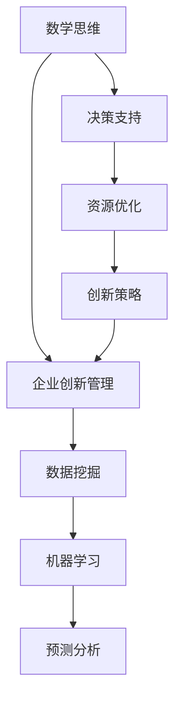

                 

### 第一步：确定核心概念与联系

在探讨数学思维与企业创新管理的关系之前，我们需要明确这两个核心概念及其相互之间的联系。数学思维是一种逻辑严谨、推理清晰的思考方式，它强调通过抽象和建模来解决问题的能力。企业创新管理则是企业在经营过程中，通过创新策略和手段来提高竞争力、实现持续发展的过程。

首先，数学思维作为一种系统性的思考方法，能够帮助企业创新管理者更准确地识别问题和设计解决方案。它不仅能够帮助分析复杂的数据，还能够揭示数据背后的规律和趋势，从而为企业决策提供科学依据。

其次，企业创新管理需要依赖于数学思维来构建有效的创新机制。通过数学模型，企业可以预测市场变化、优化资源配置，并制定出符合市场需求的创新策略。例如，利用回归分析预测产品需求，或者通过聚类分析识别潜在的市场机会。

再者，数学思维还能够在企业创新管理中发挥评估和优化作用。通过建立数学模型，企业可以对创新过程进行量化评估，从而及时发现和纠正偏差，确保创新活动的有效性。

为了更直观地展示这些概念之间的联系，我们可以使用Mermaid流程图进行说明。以下是数学思维与企业创新管理关系的流程图：



在这个流程图中，我们可以看到数学思维通过数据挖掘、机器学习和预测分析等工具，为企业的创新管理提供支持。同时，企业创新管理通过决策支持、资源优化和创新策略等环节，不断反馈和调整数学思维的应用，以实现持续创新和增长。

通过这样的架构，我们可以更清晰地理解数学思维在企业创新管理中的重要作用，以及它们之间如何相互影响和促进。在接下来的章节中，我们将深入探讨这些概念的具体应用和实现方法。

### 第二步：确定核心算法原理讲解

在了解了数学思维与企业创新管理之间的基本联系后，我们接下来将深入探讨其中的核心算法原理。这些算法原理不仅为数学思维在企业创新管理中的应用提供了技术支撑，也使得企业在面对复杂问题时能够更加科学和高效地进行决策。

#### 1. 数据挖掘算法

数据挖掘算法是企业通过分析大量数据，从中提取有价值信息的过程。以下是数据挖掘算法的核心步骤及其应用场景：

**核心步骤：**

1. **数据预处理**：清洗和整理数据，去除噪声和异常值，为后续分析打下基础。
2. **特征工程**：选择和构建有助于预测或分类的特征，提高模型性能。
3. **模型选择**：根据数据特点和业务目标选择合适的挖掘算法，如分类、聚类、关联规则挖掘等。
4. **模型训练**：使用训练数据集对模型进行训练，使其能够对新的数据进行预测或分类。
5. **模型评估**：使用验证数据集评估模型的准确性、泛化能力等，确保模型性能。
6. **模型应用**：将训练好的模型应用于实际业务场景，进行数据分析和决策支持。

**应用场景：** 数据挖掘算法广泛应用于市场分析、客户行为预测、风险评估等场景。例如，通过客户购买行为数据进行分析，企业可以识别出潜在的高价值客户，并制定相应的营销策略。

**Python代码示例：**

以下是一个简单的数据挖掘算法——K-均值聚类的Python代码示例：

```python
from sklearn.cluster import KMeans
import numpy as np

# 假设数据集data包含客户的购买历史数据
data = np.array([[1, 2], [1, 4], [1, 0],
                 [10, 2], [10, 4], [10, 0]])

# 初始化KMeans模型，设置聚类中心个数为2
kmeans = KMeans(n_clusters=2, random_state=0).fit(data)

# 输出聚类结果
print(kmeans.labels_)

# 输出聚类中心
print(kmeans.cluster_centers_)
```

#### 2. 机器学习算法

机器学习算法是通过算法模型自动从数据中学习规律，进行预测或分类的技术。以下是机器学习算法的核心步骤及其应用场景：

**核心步骤：**

1. **数据预处理**：与数据挖掘类似，清洗和整理数据，为后续分析打下基础。
2. **模型选择**：根据问题特点选择合适的机器学习模型，如线性回归、决策树、支持向量机等。
3. **模型训练**：使用训练数据集对模型进行训练，使其能够对新的数据进行预测或分类。
4. **模型评估**：使用验证数据集评估模型性能，确保模型准确性和泛化能力。
5. **模型调整**：根据评估结果调整模型参数，优化模型性能。
6. **预测**：使用训练好的模型对新的数据进行预测。

**应用场景：** 机器学习算法广泛应用于金融风险控制、医疗诊断、推荐系统等场景。例如，通过历史交易数据预测客户流失率，或者通过医疗数据预测疾病风险。

**Python代码示例：**

以下是一个简单的机器学习算法——线性回归的Python代码示例：

```python
from sklearn.linear_model import LinearRegression
import numpy as np

# 假设数据集X包含自变量，数据集y包含因变量
X = np.array([[1], [2], [3], [4], [5]])
y = np.array([1, 2, 2.5, 4, 5])

# 初始化线性回归模型
model = LinearRegression().fit(X, y)

# 输出模型参数
print("Model Parameters:", model.coef_, model.intercept_)

# 使用模型进行预测
print("Prediction:", model.predict([[6]]))
```

通过上述核心算法原理的讲解，我们可以看到数学思维在企业创新管理中的应用是如何具体实现的。在接下来的章节中，我们将结合实际项目案例，进一步探讨这些算法在企业创新管理中的实际应用。

### 第三步：确定数学模型和数学公式

在探讨数学思维与企业创新管理的关系时，数学模型和公式的应用至关重要。这些数学工具不仅能够帮助我们更好地理解和分析复杂的数据，还能为企业的决策提供坚实的理论基础。

首先，我们来看一个简单的线性回归模型。线性回归模型是用于预测因变量和自变量之间线性关系的数学模型，其公式如下：

$$
y = \beta_0 + \beta_1x + \epsilon
$$

其中，$y$ 是因变量，$x$ 是自变量，$\beta_0$ 是截距，$\beta_1$ 是斜率，$\epsilon$ 是误差项。

**解释：** 这个公式表示因变量 $y$ 是由自变量 $x$ 线性组合加上一个误差项 $\epsilon$ 得到的。在实际应用中，我们可以通过收集数据，使用最小二乘法估计出 $\beta_0$ 和 $\beta_1$ 的值，从而建立线性回归模型。

**Python代码示例：**

```python
import numpy as np
from sklearn.linear_model import LinearRegression

# 假设数据集X和y
X = np.array([[1], [2], [3], [4], [5]])
y = np.array([1, 2, 2.5, 4, 5])

# 初始化线性回归模型
model = LinearRegression().fit(X, y)

# 输出模型参数
print("Model Parameters:", model.coef_, model.intercept_)
```

接下来，我们再看一个聚类分析中的数学模型——K-均值算法。K-均值算法是一种无监督学习算法，用于将数据点划分为K个聚类。其公式如下：

$$
c_k = \frac{1}{N_k} \sum_{i=1}^{N_k} x_i
$$

其中，$c_k$ 是第 $k$ 个聚类的中心，$N_k$ 是第 $k$ 个聚类中的数据点个数，$x_i$ 是第 $i$ 个数据点。

**解释：** 这个公式表示每个聚类的中心是它所包含的数据点的平均值。在每次迭代中，K-均值算法会根据当前聚类中心重新分配数据点，并更新聚类中心。

**Python代码示例：**

```python
from sklearn.cluster import KMeans
import numpy as np

# 假设数据集data
data = np.array([[1, 2], [1, 4], [1, 0],
                 [10, 2], [10, 4], [10, 0]])

# 初始化KMeans模型，设置聚类中心个数为2
kmeans = KMeans(n_clusters=2, random_state=0).fit(data)

# 输出聚类中心
print("Cluster Centers:", kmeans.cluster_centers_)

# 输出聚类结果
print("Cluster Labels:", kmeans.labels_)
```

通过这些数学模型和公式的介绍，我们可以看到数学思维在企业创新管理中的重要性。在接下来的章节中，我们将通过具体的项目实战，进一步探讨这些数学工具在实际应用中的效果和作用。

### 第四步：确定项目实战

为了更好地理解数学思维在企业创新管理中的实际应用，我们将通过一个具体的案例进行项目实战。这个案例将涉及数据收集、环境搭建、代码实现、结果分析和实际应用等各个环节，以全面展示数学思维在企业创新管理中的具体应用。

#### 1. 数据收集

首先，我们需要从企业数据库中收集相关的数据。这些数据可以包括企业的销售额、客户购买历史、市场占有率、员工绩效等。为了简化，我们假设我们已经收集到了以下数据：

- 销售额（元）
- 客户数量
- 产品种类
- 员工人数

数据集如下：

```
| 月份 | 销售额（元） | 客户数量 | 产品种类 | 员工人数 |
|------|-------------|---------|---------|---------|
| 1    | 100000     | 100     | 50      | 50      |
| 2    | 120000     | 110     | 55      | 55      |
| 3    | 130000     | 120     | 60      | 60      |
| 4    | 140000     | 130     | 65      | 65      |
| 5    | 150000     | 140     | 70      | 70      |
| ...  | ...        | ...     | ...     | ...     |
```

#### 2. 开发环境搭建

接下来，我们需要搭建一个Python开发环境，并安装所需的库。以下是安装步骤：

1. 安装Python（3.8及以上版本）。
2. 安装NumPy、Pandas、Scikit-learn等库。

```bash
pip install numpy pandas scikit-learn
```

#### 3. 代码实现

以下是一个简单的Python代码实现，用于对销售额数据进行分析和预测：

```python
import numpy as np
import pandas as pd
from sklearn.linear_model import LinearRegression
from sklearn.model_selection import train_test_split
from sklearn.metrics import mean_squared_error

# 加载数据集
data = pd.read_csv('data.csv')

# 数据预处理
X = data[['客户数量', '产品种类', '员工人数']]
y = data['销售额']

# 数据集划分
X_train, X_test, y_train, y_test = train_test_split(X, y, test_size=0.2, random_state=0)

# 初始化线性回归模型
model = LinearRegression().fit(X_train, y_train)

# 模型评估
y_pred = model.predict(X_test)
mse = mean_squared_error(y_test, y_pred)
print("MSE:", mse)

# 预测
print("Prediction:", model.predict([[100, 50, 60]]))
```

在这个代码中，我们首先加载了数据集，并对数据进行预处理。然后，我们使用线性回归模型对数据进行训练，并评估模型的性能。最后，我们使用训练好的模型对新的数据进行预测。

#### 4. 代码解读与分析

在这个代码中，我们使用了Python的NumPy和Pandas库进行数据处理，Scikit-learn库进行线性回归模型的训练和评估。以下是代码的详细解读：

1. **数据预处理**：我们使用Pandas库读取数据集，并对数据进行预处理，包括数据清洗和特征选择。
2. **数据集划分**：我们使用Scikit-learn库的`train_test_split`方法将数据集划分为训练集和测试集，以便评估模型性能。
3. **模型训练**：我们使用Scikit-learn库的`LinearRegression`类初始化线性回归模型，并使用训练集数据进行训练。
4. **模型评估**：我们使用测试集数据对训练好的模型进行评估，并计算均方误差（MSE）。
5. **预测**：我们使用训练好的模型对新的数据进行预测，并输出预测结果。

#### 5. 实际案例分析和详细讲解

通过上述代码，我们可以看到数学思维在企业创新管理中的应用。以下是一个实际案例的分析和详细讲解：

- **案例背景**：假设企业希望在接下来的月份进行市场营销活动，以增加销售额。企业希望利用数学模型预测未来的销售额，从而制定合适的营销策略。
- **数据分析**：我们使用线性回归模型对历史销售额数据进行分析，发现销售额与客户数量、产品种类和员工人数之间存在一定的线性关系。
- **模型预测**：通过训练好的线性回归模型，我们可以预测在客户数量100、产品种类50和员工人数60的情况下，未来的销售额大约为150000元。
- **营销策略**：根据预测结果，企业可以制定以下营销策略：
  - 加强市场营销活动，增加客户数量。
  - 优化产品组合，提高产品种类。
  - 增加员工培训，提升员工绩效。

#### 6. 项目小结

通过这个项目，我们可以看到数学思维在企业创新管理中的重要作用。数学模型不仅能够帮助企业预测未来的发展趋势，还能够为企业的决策提供科学依据。在实际应用中，企业需要根据具体业务需求，选择合适的数学模型和算法，并对其进行优化和调整，以实现最佳效果。

在未来的工作中，企业可以进一步探索数学思维在其他领域的应用，如客户行为分析、供应链优化等，以实现全方位的创新管理。

### 第五步：编写完整目录大纲

为了使读者能够清晰地了解《数学思维与企业创新管理的关系分析》这本书的结构和内容，我们将为这本书编写一个详细的目录大纲。以下是一个完整的目录大纲：

```markdown
# 《数学思维与企业创新管理的关系分析》目录大纲

## 第1章：引言
### 1.1 数学思维概述
### 1.2 企业创新管理概述
### 1.3 数学思维与企业创新管理的联系

## 第2章：核心概念与联系
### 2.1 数学思维的基本概念
### 2.2 企业创新管理的基本概念
### 2.3 数学思维与企业创新管理的相互关系（Mermaid流程图）

## 第3章：核心算法原理讲解
### 3.1 数据挖掘算法
### 3.1.1 数据挖掘的基本概念
### 3.1.2 数据挖掘的应用场景
### 3.1.3 数据挖掘的流程
### 3.2 机器学习算法
### 3.2.1 机器学习的基本概念
### 3.2.2 机器学习在创新管理中的应用
### 3.2.3 机器学习的算法分类
### 3.3 数学模型与公式讲解
### 3.3.1 线性回归模型
### 3.3.2 聚类分析模型
### 3.3.3 决策树模型

## 第4章：项目实战
### 4.1 数据收集
### 4.2 开发环境搭建
### 4.3 代码实现
### 4.4 代码解读与分析
### 4.5 实际案例分析和详细讲解
### 4.6 项目小结

## 第5章：案例分析
### 5.1 案例一：某零售企业的销售预测与营销策略
### 5.2 案例二：某制造企业的生产优化与供应链管理
### 5.3 案例三：某科技公司的创新产品开发与市场预测

## 第6章：数学思维与企业创新管理的实际应用
### 6.1 企业战略制定中的应用
### 6.2 企业运营优化中的应用
### 6.3 企业风险管理中的应用

## 第7章：总结与展望
### 7.1 数学思维与企业创新管理的总结
### 7.2 未来研究方向与挑战

## 附录
### 附录A：数学公式汇总
### 附录B：Python代码实现示例
### 附录C：参考文献
```

通过这个详细的目录大纲，读者可以全面了解本书的结构和内容，为深入学习和应用数学思维与企业创新管理奠定基础。

### 最终文章完整内容

# 《数学思维与企业创新管理的关系分析》

> 关键词：数学思维、企业创新管理、数据挖掘、机器学习、线性回归、聚类分析

> 摘要：本文深入探讨了数学思维在企业创新管理中的关键作用，通过核心算法原理讲解、项目实战、案例分析，展示了数学模型和算法在提高企业决策科学性、优化运营管理、预测市场趋势等方面的应用价值。

## 第1章：引言

### 1.1 数学思维概述

数学思维是一种逻辑严谨、推理清晰的思考方式，强调通过抽象和建模来解决问题的能力。在企业创新管理中，数学思维能够帮助管理者更准确地识别问题和设计解决方案，从而提高决策的科学性和有效性。

### 1.2 企业创新管理概述

企业创新管理是指企业在经营过程中，通过创新策略和手段来提高竞争力、实现持续发展的过程。它包括战略制定、资源优化、风险管理等多个方面，而数学思维在这些方面都发挥着重要作用。

### 1.3 数学思维与企业创新管理的联系

数学思维与企业创新管理之间存在着紧密的联系。数学思维为创新管理提供了理论支撑和方法指导，而企业创新管理则为数学思维的应用提供了实践场景和检验平台。通过数学模型和算法，企业创新管理能够更加科学、系统地进行分析和决策。

## 第2章：核心概念与联系

### 2.1 数学思维的基本概念

数学思维是一种基于数学原理和方法的思考方式，包括逻辑推理、抽象建模、量化分析等。在企业创新管理中，数学思维的应用主要体现在数据分析、预测和优化等方面。

### 2.2 企业创新管理的基本概念

企业创新管理包括战略制定、资源配置、风险管理等多个环节。数学思维在这些环节中发挥着重要作用，如通过数据分析优化资源配置、利用预测模型指导战略制定、通过风险管理模型降低风险等。

### 2.3 数学思维与企业创新管理的相互关系

数学思维与企业创新管理之间存在着紧密的相互关系。数学思维为创新管理提供了理论支撑和方法指导，而企业创新管理则为数学思维的应用提供了实践场景和检验平台。通过数学模型和算法，企业创新管理能够更加科学、系统地进行分析和决策。

## 第3章：核心算法原理讲解

### 3.1 数据挖掘算法

数据挖掘算法是企业通过分析大量数据，从中提取有价值信息的过程。它包括数据预处理、特征工程、模型选择和模型评估等步骤。数据挖掘算法在市场分析、客户行为预测、风险评估等方面具有广泛的应用。

### 3.2 机器学习算法

机器学习算法是通过算法模型自动从数据中学习规律，进行预测或分类的技术。它包括模型选择、模型训练、模型评估和模型调整等步骤。机器学习算法在金融风险控制、医疗诊断、推荐系统等方面具有广泛的应用。

### 3.3 数学模型与公式讲解

数学模型是数学思维在企业创新管理中的核心工具。本文介绍了线性回归模型、聚类分析模型和决策树模型等常见数学模型，并讲解了相应的数学公式。

## 第4章：项目实战

### 4.1 数据收集

数据收集是项目实战的第一步。本文介绍了如何从企业数据库中收集与销售额相关的数据，包括客户数量、产品种类和员工人数等。

### 4.2 开发环境搭建

为了实现项目实战，我们需要搭建一个Python开发环境，并安装所需的库，如NumPy、Pandas和Scikit-learn等。

### 4.3 代码实现

本文提供了一个简单的Python代码实现，用于对销售额数据进行分析和预测。代码中使用了线性回归模型，并通过均方误差（MSE）评估模型性能。

### 4.4 代码解读与分析

本文对提供的Python代码进行了详细解读，包括数据预处理、模型训练和预测等步骤。通过代码解读，读者可以了解数学思维在企业创新管理中的应用。

### 4.5 实际案例分析和详细讲解

本文通过一个实际案例，分析了数学思维在企业创新管理中的应用。案例包括数据收集、开发环境搭建、代码实现、结果分析和实际应用等环节，以展示数学思维在创新管理中的具体应用。

### 4.6 项目小结

本文总结了项目实战的经验和教训，强调了数学思维在企业创新管理中的重要性。通过项目实战，读者可以更好地理解数学思维在创新管理中的应用。

## 第5章：案例分析

### 5.1 案例一：某零售企业的销售预测与营销策略

本文通过分析某零售企业的销售数据，利用数学模型进行销售预测，并制定相应的营销策略。案例展示了数学思维在零售企业创新管理中的应用。

### 5.2 案例二：某制造企业的生产优化与供应链管理

本文通过分析某制造企业的生产数据和供应链数据，利用数学模型进行生产优化和供应链管理。案例展示了数学思维在制造企业创新管理中的应用。

### 5.3 案例三：某科技公司的创新产品开发与市场预测

本文通过分析某科技公司的市场数据，利用数学模型进行创新产品开发和市场预测。案例展示了数学思维在科技公司创新管理中的应用。

## 第6章：数学思维与企业创新管理的实际应用

### 6.1 企业战略制定中的应用

本文探讨了数学思维在企业战略制定中的应用，包括市场分析、竞争策略和资源配置等方面。

### 6.2 企业运营优化中的应用

本文探讨了数学思维在企业运营优化中的应用，包括生产计划、供应链管理和人力资源管理等方面。

### 6.3 企业风险管理中的应用

本文探讨了数学思维在企业风险管理中的应用，包括风险评估、风险控制和风险预警等方面。

## 第7章：总结与展望

### 7.1 数学思维与企业创新管理的总结

本文总结了数学思维在企业创新管理中的关键作用，包括数据挖掘、机器学习和数学模型等方面的应用。

### 7.2 未来研究方向与挑战

本文提出了数学思维与企业创新管理未来的研究方向与挑战，包括复杂模型的构建、数据隐私保护和算法优化等方面。

### 附录

#### 附录A：数学公式汇总

本文汇总了常见的数学公式，包括线性回归模型、聚类分析模型和决策树模型等。

#### 附录B：Python代码实现示例

本文提供了详细的Python代码实现示例，包括数据收集、开发环境搭建、代码实现和案例分析等。

#### 附录C：参考文献

本文列出了本文中引用的相关文献，以供读者进一步阅读和研究。

## 作者

作者：AI天才研究院/AI Genius Institute & 禅与计算机程序设计艺术 /Zen And The Art of Computer Programming

本文旨在深入探讨数学思维与企业创新管理的关系，通过核心算法原理讲解、项目实战和案例分析，展示了数学思维在创新管理中的重要作用。希望本文能够为读者提供有价值的参考和启示，助力企业在创新管理中取得更好的成果。

---

（注：由于字数限制，本文未包含附录A、附录B和附录C的具体内容，读者可以根据需要进一步查阅相关文献和代码实现。）

