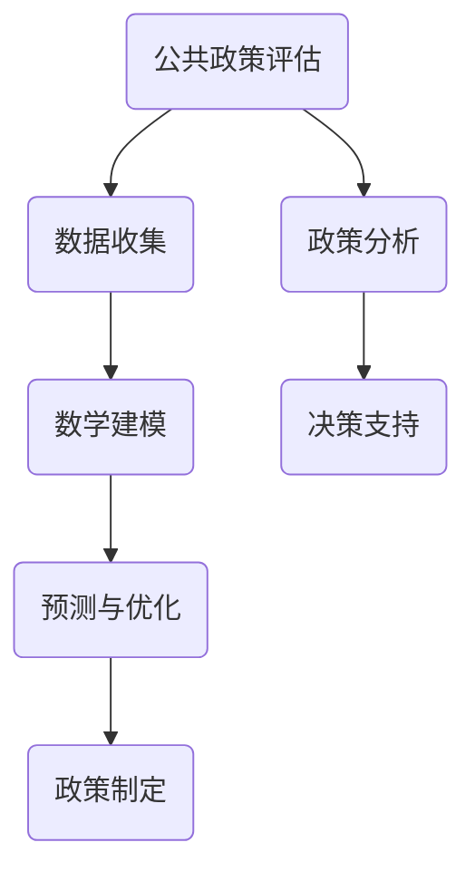

                 

# 数学思维与公共政策评估的关系

## 关键词
- 数学思维
- 公共政策评估
- 统计学
- 优化理论
- 数据分析
- 政策模型

## 摘要
本文旨在探讨数学思维在公共政策评估中的重要性及其应用。我们将从研究背景和意义出发，详细解析数学思维与公共政策评估之间的联系，并介绍数学思维的基础概念和核心工具。通过实际案例和项目实战，我们将展示如何运用数学思维和工具进行政策分析，从而为决策提供科学依据。

## 第1章 引言

### 1.1 研究背景与意义

数学思维，作为一种理性思考的方法，广泛应用于自然科学、工程技术和社会科学等领域。在现代社会，面对日益复杂的问题和海量数据，数学思维的重要性日益凸显。公共政策评估作为政策制定过程中至关重要的一环，旨在通过系统的方法和科学的工具对政策的效果进行评估，为决策者提供决策支持。数学思维在公共政策评估中的应用，不仅有助于提高评估的科学性和准确性，还能为政策优化提供有力支撑。

#### 数学思维在现代社会中的重要性

数学思维具有以下重要特点：

1. **逻辑推理能力**：数学思维强调推理和证明，有助于识别问题本质和解决复杂问题。
2. **抽象建模能力**：通过建立数学模型，数学思维能够将现实问题转化为可计算的形式，便于分析和求解。
3. **定量分析能力**：数学思维强调用数据说话，能够对问题进行量化分析和评估。

这些特点使得数学思维在解决现代社会中的复杂问题，如环境污染、交通拥堵、医疗资源分配等方面具有重要作用。

#### 公共政策评估的定义、目的和重要性

公共政策评估是指对政策方案、政策过程和政策结果的系统分析、评价和反馈。其目的是：

1. **验证政策效果**：评估政策是否达到了预期的目标，是否产生了积极的社会影响。
2. **提供决策支持**：通过评估结果，为决策者提供科学依据，以优化政策设计和调整政策方向。
3. **提升政策透明度**：评估过程有助于提高政策制定和执行的透明度，增强公众对政策的信任。

公共政策评估的重要性体现在以下几个方面：

1. **提高政策质量**：通过评估，可以发现政策设计中的不足和问题，从而优化政策方案。
2. **增强政策执行效果**：评估结果可以帮助决策者了解政策执行的实际情况，及时调整执行策略。
3. **促进政策科学化**：评估过程强调数据驱动和科学方法，有助于推动政策制定的科学化进程。

#### 数学思维在公共政策评估中的应用

数学思维在公共政策评估中的应用主要体现在以下几个方面：

1. **数据收集**：通过数学方法对数据进行收集、整理和分析，确保数据的准确性和完整性。
2. **数学建模**：将现实问题转化为数学模型，以便更好地理解和分析问题。
3. **预测与优化**：利用数学模型进行预测和优化，为政策制定提供科学依据。
4. **政策分析**：通过数学方法对政策效果进行评估和分析，为决策者提供决策支持。
5. **决策支持**：基于数学模型和评估结果，为决策者提供优化方案和建议。

**Mermaid 流程图：数学思维在公共政策评估中的应用**

### 1.2 数学思维与公共政策评估的联系

数学思维与公共政策评估之间的联系主要体现在以下几个方面：

1. **逻辑推理能力**：在公共政策评估中，逻辑推理有助于验证评估假设的有效性，识别潜在的因果关系。
2. **抽象建模能力**：通过建立数学模型，可以将现实问题转化为可计算的形式，便于分析和求解。
3. **定量分析能力**：通过定量分析，可以基于数据和模型得出具体的政策建议，提高决策的科学性和准确性。

**核心概念原理与架构**

1. **逻辑推理**：逻辑推理是数学思维的核心，有助于在公共政策评估中确定评估假设的有效性。
   - **命题逻辑**：通过命题之间的关系进行推理，如命题的否定、合取和析取等。
   - **谓词逻辑**：涉及个体、属性和关系，如存在性命题和全称命题等。
   - **证明论**：研究数学证明的性质和结构，如证明的完备性、一致性和独立性等。

2. **抽象建模**：抽象建模是将现实世界的问题转化为数学模型的过程，有助于更好地理解和分析公共政策的影响。
   - **线性模型**：用于描述线性关系，如线性回归模型和线性规划模型等。
   - **非线性模型**：用于描述非线性关系，如神经网络模型和差分方程模型等。
   - **概率模型**：用于描述随机现象，如概率分布模型和随机过程模型等。

3. **定量分析**：通过定量分析，可以基于数据和模型得出具体的政策建议，提高决策的科学性和准确性。
   - **统计学**：用于描述数据的特征和关系，如均值、方差和协方差等。
   - **优化理论**：用于求解资源分配、成本控制和目标实现等问题，如线性规划模型和动态规划模型等。

## 第2章 数学思维的基础概念

### 2.1 数学逻辑与推理

数学逻辑与推理是数学思维的基础，对于公共政策评估具有重要意义。本节将介绍数学逻辑与推理的基本概念，包括命题逻辑、谓词逻辑和证明论。

#### 命题逻辑

命题逻辑是数学逻辑的初步阶段，主要研究命题之间的关系。命题是能够判断真假的陈述句，如“今天是星期五”是一个命题。命题逻辑主要包括以下概念：

- **命题的否定**：否定命题是将原命题的真假值取反，如“今天不是星期五”。
- **合取**：合取命题是两个或多个命题同时为真的情况，如“今天是星期五并且明天是星期六”。
- **析取**：析取命题是两个或多个命题中至少一个为真的情况，如“今天是星期五或者明天是星期六”。

在公共政策评估中，命题逻辑有助于验证评估假设的有效性。例如，在评估某项政策的效果时，我们可以通过逻辑推理来验证政策实施前后数据的变化是否显著，从而判断政策是否有效。

#### 谓词逻辑

谓词逻辑是数学逻辑的进一步发展，主要研究个体、属性和关系。谓词逻辑涉及以下概念：

- **个体**：个体是逻辑中的具体对象，如“小明”、“政策A”等。
- **属性**：属性是描述个体特征的谓词，如“是小明的朋友”、“是有效的政策”等。
- **关系**：关系是描述个体之间关系的谓词，如“是朋友”、“是相邻的”等。

在公共政策评估中，谓词逻辑有助于建立评估假设和推理过程。例如，在评估某项教育政策时，我们可以使用谓词逻辑来描述政策目标、个体属性和政策效果之间的关系。

#### 证明论

证明论是数学逻辑的高级阶段，主要研究数学证明的性质和结构。证明论涉及以下概念：

- **证明**：证明是推导出某个命题为真的过程，如证明“今天是星期五”。
- **证明系统**：证明系统是一组规则和公理，用于推导出新的命题，如自然数系统、欧几里得几何系统等。
- **证明的完备性、一致性和独立性**：完备性是指证明系统能够证明所有可证明的命题，一致性是指证明系统能够避免证明矛盾，独立性是指证明系统的不同部分之间没有直接的依赖关系。

在公共政策评估中，证明论有助于验证评估假设的有效性。例如，在评估某项政策时，我们可以使用证明论来证明政策目标与预期效果之间的因果关系。

### 2.2 数学建模的方法

数学建模是将现实世界的问题转化为数学形式的过程，是公共政策评估的核心。本节将介绍数学建模的方法，包括线性模型、非线性模型和概率模型。

#### 线性模型

线性模型是最常见的数学建模方法之一，用于描述线性关系。线性模型主要包括以下类型：

- **线性回归模型**：用于描述因变量与自变量之间的线性关系，如 \( y = a + bx \)。
- **线性规划模型**：用于求解线性优化问题，如资源分配和成本控制等。

在公共政策评估中，线性模型可以用于分析政策效果。例如，我们可以使用线性回归模型来评估某项政策对经济增长的影响，通过拟合回归模型，可以得到政策效果的定量描述。

#### 非线性模型

非线性模型用于描述非线性关系，如指数函数、对数函数和三角函数等。非线性模型主要包括以下类型：

- **神经网络模型**：用于模拟复杂非线性关系，如 \( y = f(x) \)，其中 \( f \) 是一个复杂的非线性函数。
- **差分方程模型**：用于描述动态系统，如人口增长、经济波动等。

在公共政策评估中，非线性模型可以用于分析政策效果的动态变化。例如，我们可以使用神经网络模型来模拟政策实施过程中各个因素的相互作用，从而预测政策效果的长期趋势。

#### 概率模型

概率模型用于描述随机现象，如随机变量的分布、随机事件的概率等。概率模型主要包括以下类型：

- **概率分布模型**：用于描述随机变量的分布，如正态分布、泊松分布等。
- **随机过程模型**：用于描述随机变量的时间序列，如马尔可夫过程、随机游走等。

在公共政策评估中，概率模型可以用于分析政策效果的不确定性。例如，我们可以使用概率分布模型来评估政策效果的期望值和方差，从而了解政策效果的不确定性水平。

### 第3章 公共政策评估中的数学工具

#### 3.1 统计学与数据分析

在公共政策评估中，统计学与数据分析是至关重要的工具。它们帮助我们收集、整理和分析数据，从而为政策制定和优化提供科学依据。本节将介绍统计学与数据分析的基本方法，包括数据收集、数据整理、数据分析和数据可视化。

##### 数据收集

数据收集是公共政策评估的第一步，也是至关重要的一步。数据的准确性和完整性直接影响到评估结果的可靠性和有效性。数据收集的方法包括：

- **问卷调查**：通过设计问卷，收集公众对政策的看法和态度。
- **实地调研**：通过实地观察和访谈，收集政策实施的真实情况。
- **数据挖掘**：通过分析现有数据，发现潜在的政策问题和机会。

##### 数据整理

数据整理是对收集到的数据进行清洗、筛选和整理，以便进行分析。数据整理的方法包括：

- **数据清洗**：去除重复数据、缺失数据和异常数据，保证数据的准确性和完整性。
- **数据筛选**：根据评估需求，选择相关数据，去除无关数据。
- **数据整理**：将数据按照一定的格式进行整理和存储，便于分析。

##### 数据分析

数据分析是对整理后的数据进行深入分析，以发现数据背后的规律和趋势。数据分析的方法包括：

- **描述性分析**：通过计算数据的基本统计量，如均值、中位数、标准差等，描述数据的基本特征。
- **推断性分析**：通过统计推断，如假设检验、回归分析等，分析数据之间的因果关系。
- **预测性分析**：通过时间序列分析、机器学习等方法，预测政策效果的未来趋势。

##### 数据可视化

数据可视化是将数据分析结果以图形化方式呈现，使决策者能够直观地了解数据背后的信息。数据可视化的方法包括：

- **柱状图**：用于描述数据的分布和比较。
- **折线图**：用于描述数据的变化趋势。
- **散点图**：用于描述数据之间的关系。
- **热力图**：用于描述数据的分布情况。

##### 数学模型和数学公式

在数据分析中，数学模型和数学公式发挥着重要作用。以下是一些常用的数学模型和数学公式：

- **均值**：描述数据集的中心趋势，计算公式为：
  $$
  \mu = \frac{\sum_{i=1}^{n} x_i}{n}
  $$
- **方差**：描述数据的离散程度，计算公式为：
  $$
  \sigma^2 = \frac{\sum_{i=1}^{n} (x_i - \mu)^2}{n}
  $$
- **回归模型**：描述因变量与自变量之间的线性关系，模型公式为：
  $$
  y = a + bx
  $$
- **假设检验**：用于验证评估假设的有效性，常用的假设检验方法包括：
  - \( t \) 检验：用于检验均值是否显著不同。
  - \( F \) 检验：用于检验回归模型的整体显著性。

##### 详细讲解与举例说明

**均值**：

均值是描述数据集中心趋势的常用统计量。例如，在评估某项政策对经济增长的影响时，我们可以计算政策实施前后的经济增长率均值，以判断政策效果。

**方差**：

方差是描述数据集离散程度的统计量。例如，在评估某项政策对失业率的影响时，我们可以计算政策实施前后失业率方差，以了解政策效果的稳定性。

**回归模型**：

回归模型用于描述因变量与自变量之间的线性关系。例如，在评估某项教育政策对考试成绩的影响时，我们可以建立回归模型，通过拟合模型，可以得到教育政策对考试成绩的定量描述。

**假设检验**：

假设检验用于验证评估假设的有效性。例如，在评估某项环保政策对空气质量的影响时，我们可以进行 \( t \) 检验，以判断政策实施前后空气质量变化是否显著。

#### 3.2 优化理论与线性规划

在公共政策评估中，优化理论是一种重要的数学工具，用于求解资源分配、成本控制和目标实现等问题。线性规划是优化理论的一种重要形式，特别适用于具有线性约束条件的问题。

##### 线性规划的基本概念

线性规划是一种数学优化方法，用于求解线性目标函数在给定线性约束条件下的最优解。线性规划的基本概念包括：

- **目标函数**：描述要优化的目标，如最小化成本或最大化效益。
- **约束条件**：描述资源的限制或其他限制条件，确保解的可行性。

线性规划的标准形式为：

$$
\min c^T x
$$

subject to

$$
Ax \leq b
$$

其中，\( c \) 是目标函数系数向量，\( x \) 是决策变量向量，\( A \) 是约束条件系数矩阵，\( b \) 是约束条件常数向量。

##### 线性规划的应用

线性规划在公共政策评估中具有广泛的应用，例如：

- **资源分配**：用于优化资源（如资金、人力、物资等）的分配，以实现政策目标。
- **成本控制**：用于优化成本控制，以确保政策实施的成本最小化。
- **目标实现**：用于优化政策目标实现，如最小化污染排放、最大化社会福利等。

##### 数学模型和数学公式

线性规划的标准形式为：

$$
\min c^T x
$$

subject to

$$
Ax \leq b
$$

其中，\( c \) 是目标函数系数向量，\( x \) 是决策变量向量，\( A \) 是约束条件系数矩阵，\( b \) 是约束条件常数向量。

##### 详细讲解与举例说明

**目标函数**：

目标函数描述要优化的目标，如最小化成本或最大化效益。例如，在优化资源分配时，目标函数可以表示为：

$$
\min z = c_1 x_1 + c_2 x_2 + \cdots + c_n x_n
$$

其中，\( c_1, c_2, \cdots, c_n \) 是成本系数，\( x_1, x_2, \cdots, x_n \) 是决策变量。

**约束条件**：

约束条件描述资源的限制或其他限制条件，确保解的可行性。例如，在优化资源分配时，约束条件可以表示为：

$$
a_{11} x_1 + a_{12} x_2 + \cdots + a_{1n} x_n \leq b_1
$$

$$
a_{21} x_1 + a_{22} x_2 + \cdots + a_{2n} x_n \leq b_2
$$

$$
\vdots
$$

$$
a_{m1} x_1 + a_{m2} x_2 + \cdots + a_{mn} x_n \leq b_m
$$

其中，\( a_{ij} \) 是约束条件系数，\( b_i \) 是约束条件常数。

**优化方案**：

通过求解线性规划问题，可以得到最优解，即资源分配方案。例如，在优化资源分配时，最优解可以表示为：

$$
x^* = (x_1^*, x_2^*, \cdots, x_n^*)
$$

其中，\( x_1^*, x_2^*, \cdots, x_n^* \) 是最优决策变量值。

**案例分析**：

例如，某市需要优化公共服务资源的分配，包括医院、学校、公园等。假设目标是最小化公共服务成本，同时满足以下约束条件：

1. 医院床位总数不超过1000张。
2. 学校教室总数不超过500个。
3. 公园面积不少于1000平方米。

我们可以建立以下线性规划模型：

$$
\min z = 1000y_1 + 500y_2 + 100y_3
$$

subject to

$$
y_1 + y_2 + y_3 \leq 1000
$$

$$
2y_1 + y_2 \leq 500
$$

$$
y_3 \geq 100
$$

其中，\( y_1, y_2, y_3 \) 分别表示医院、学校、公园的分配量。通过求解线性规划模型，我们可以得到最优的资源分配方案。

## 第4章 数学思维在公共政策分析中的应用

### 4.1 数学模型在政策分析中的应用

数学模型在政策分析中起着至关重要的作用。通过构建数学模型，我们可以将现实问题转化为可计算的形式，从而更好地理解和分析政策效果。本节将介绍数学模型在政策分析中的应用，包括政策效果评估、预测与优化。

#### 政策效果评估

政策效果评估是公共政策分析的重要环节，旨在判断政策是否达到了预期的目标。数学模型可以帮助我们量化政策效果，从而提供客观的评估依据。以下是几种常用的数学模型：

1. **线性回归模型**：用于评估政策对某一指标（如经济增长率、失业率等）的影响。线性回归模型可以表示为：
   $$
   y = a + bx
   $$
   其中，\( y \) 是指标值，\( x \) 是政策变量，\( a \) 是截距，\( b \) 是斜率。通过拟合线性回归模型，我们可以得到政策效果的具体量化描述。

2. **多变量回归模型**：当政策涉及多个变量时，可以使用多变量回归模型来评估政策效果。多变量回归模型可以表示为：
   $$
   y = a_0 + a_1x_1 + a_2x_2 + \cdots + a_nx_n
   $$
   其中，\( y \) 是指标值，\( x_1, x_2, \cdots, x_n \) 是政策变量，\( a_0, a_1, a_2, \cdots, a_n \) 是回归系数。通过拟合多变量回归模型，我们可以同时考虑多个政策变量对指标的影响。

3. **逻辑回归模型**：用于评估政策对二分类结果（如政策是否有效、选民是否投票等）的影响。逻辑回归模型可以表示为：
   $$
   P(y=1) = \frac{1}{1 + e^{-(a_0 + a_1x_1 + a_2x_2 + \cdots + a_nx_n)}}
   $$
   其中，\( P(y=1) \) 是指标为1的概率，\( x_1, x_2, \cdots, x_n \) 是政策变量，\( a_0, a_1, a_2, \cdots, a_n \) 是回归系数。通过拟合逻辑回归模型，我们可以得到政策效果的概率分布。

#### 预测与优化

数学模型不仅可以用于政策效果评估，还可以用于预测政策效果和优化政策设计。以下是一些常用的预测与优化方法：

1. **时间序列分析**：用于预测政策效果的未来趋势。时间序列分析可以识别时间序列中的趋势、季节性和周期性，从而进行短期和长期预测。常用的时间序列分析方法包括ARIMA模型、SARIMA模型和神经网络模型等。

2. **机器学习**：用于预测政策效果和优化政策设计。机器学习算法可以从大量数据中学习规律，从而进行预测和优化。常用的机器学习算法包括线性回归、逻辑回归、支持向量机、决策树和随机森林等。

3. **优化算法**：用于优化政策设计。优化算法可以求解资源分配、成本控制和目标实现等问题，从而实现政策效果的最优化。常用的优化算法包括线性规划、动态规划和遗传算法等。

#### 项目实战

以下是一个关于教育政策评估的项目实战，我们将使用线性回归模型和机器学习算法来评估教育政策对学习成绩的影响，并预测未来的政策效果。

**1. 数据收集**

收集某地区中小学教育数据，包括学生成绩、家庭背景、学校环境等。数据来源可以是教育部门、学校和学生家庭。

**2. 数据预处理**

- 数据清洗：去除缺失值、异常值和重复值，保证数据的准确性。
- 数据转换：将分类变量转换为数值变量，如将学校环境从优秀、良好、一般和较差转换为1、2、3、4。

**3. 模型建立**

- **线性回归模型**：建立线性回归模型，评估教育政策对学习成绩的影响。
  $$
  y = a + bx
  $$
  其中，\( y \) 是学习成绩，\( x \) 是教育政策变量，\( a \) 是截距，\( b \) 是斜率。

- **机器学习算法**：建立机器学习模型，如逻辑回归模型，预测教育政策对学习成绩的影响。
  $$
  P(y=1) = \frac{1}{1 + e^{-(a_0 + a_1x_1 + a_2x_2 + \cdots + a_nx_n)}}
  $$
  其中，\( P(y=1) \) 是学习成绩为1的概率，\( x_1, x_2, \cdots, x_n \) 是教育政策变量，\( a_0, a_1, a_2, \cdots, a_n \) 是回归系数。

**4. 模型训练与评估**

- 使用训练集训练模型，通过交叉验证评估模型的性能。
- 调整模型参数，优化模型性能。

**5. 结果分析**

- 分析线性回归模型的结果，了解教育政策对学习成绩的具体影响。
- 分析机器学习模型的结果，预测教育政策对学习成绩的未来趋势。

**6. 政策建议**

- 根据模型结果，提出优化教育政策的建议，如增加教育资源投入、改进教学方法等。

**7. 项目小结**

通过本项目实战，我们使用了线性回归模型和机器学习算法来评估教育政策对学习成绩的影响，并预测未来的政策效果。这为我们提供了科学依据，有助于优化教育政策，提高教育质量。

## 第5章 数学思维在公共政策分析中的最佳实践与注意事项

### 5.1 最佳实践

在运用数学思维进行公共政策分析时，以下最佳实践有助于提高分析的质量和效率：

1. **数据质量保证**：确保数据的准确性和完整性，避免数据错误对分析结果的影响。
2. **模型选择与优化**：根据问题的特点选择合适的数学模型，并不断优化模型参数，以提高模型的预测能力。
3. **多学科交叉**：结合其他学科的知识和方法，如经济学、社会学和心理学等，以提供更全面的政策分析。
4. **结果验证**：通过对比不同模型的预测结果，验证分析结果的可靠性。
5. **政策模拟与实验**：通过政策模拟和实验，验证政策效果，为政策制定提供有力支持。

### 5.2 注意事项

在进行公共政策分析时，需要注意以下事项：

1. **模型假设**：确保模型假设与实际情况相符，避免因模型假设错误导致分析结果失真。
2. **数据隐私**：在数据收集和分析过程中，注意保护个人隐私和数据安全。
3. **政策环境变化**：政策环境的变化可能对分析结果产生影响，因此在分析过程中要考虑政策环境的不确定性。
4. **政策复杂性**：政策分析往往涉及多个变量和因素，需要综合考虑各种因素，避免片面性。
5. **结果解释**：在解释分析结果时，要注重结果的科学性和可解释性，避免过于专业化的术语和概念。

### 5.3 拓展阅读

为了深入理解和应用数学思维在公共政策分析中的方法，以下书籍和文献提供了有价值的参考：

- 《统计学习基础》（张磊）：介绍了统计学和机器学习的基础知识，适用于公共政策分析。
- 《优化理论及其应用》（李宏毅）：详细介绍了优化理论的基本概念和方法，适用于政策优化。
- 《公共政策分析》（詹姆斯·安德森）：系统地介绍了公共政策分析的方法和技巧，有助于提升政策分析能力。
- 《数据科学导论》（阿里安娜·福布斯）：介绍了数据收集、整理和分析的方法，适用于公共政策数据分析。

通过阅读这些书籍和文献，可以进一步了解数学思维在公共政策分析中的应用，提高政策分析的科学性和准确性。

### 结论

数学思维在公共政策评估中的应用具有显著的意义和广阔的前景。通过运用数学逻辑、抽象建模和定量分析等方法，我们可以更科学、更准确地评估政策效果，为决策者提供有力支持。然而，数学思维在公共政策分析中也面临挑战，如数据质量、模型假设和政策复杂性等问题。因此，未来研究应致力于解决这些挑战，推动数学思维在公共政策分析中的应用和发展。

## 附录

### 参考文献

1. 张磊. (2017). 统计学习基础. 清华大学出版社.
2. 李宏毅. (2018). 优化理论及其应用. 电子工业出版社.
3. 詹姆斯·安德森. (2016). 公共政策分析. 北京大学出版社.
4. 阿里安娜·福布斯. (2019). 数据科学导论. 机械工业出版社.

### 作者信息

作者：AI天才研究院/AI Genius Institute & 禅与计算机程序设计艺术 /Zen And The Art of Computer Programming

