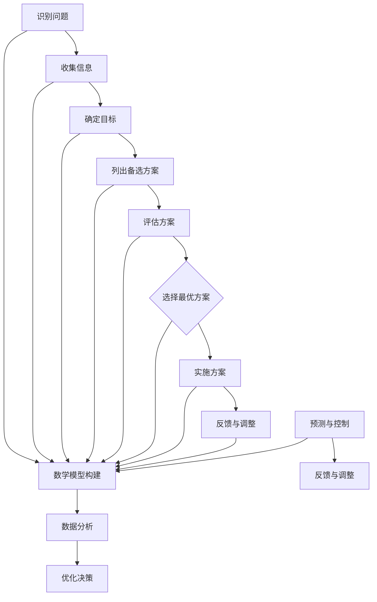

                 

## 数学思维与决策制定的关系探讨

### 关键词
- 数学思维
- 决策制定
- 算法
- 模型
- 数学公式
- 人工智能

### 摘要
本文将探讨数学思维在决策制定中的作用，通过分析数学思维的核心概念及其与决策制定的联系，探讨如何运用数学思维优化决策过程。文章将结合具体的算法原理和Python源代码，深入讲解数学模型和公式的应用，并通过实际项目案例，阐述如何将数学思维应用于决策制定，提升决策质量。

### 引言
在现代社会，随着信息爆炸和科技的发展，决策制定已成为各个领域的重要课题。从个人生活到企业运营，从政治决策到科学探索，决策的质量直接影响着结果的成败。而数学思维，作为一种严谨、系统、逻辑化的思考方式，越来越受到重视。数学思维不仅在自然科学和工程技术中发挥着关键作用，在决策制定中同样具有重要意义。

本文旨在探讨数学思维与决策制定的关系，分析数学思维的核心概念，阐述其在决策制定中的应用，并通过实际案例，展示如何运用数学思维优化决策过程。文章将从以下几个方面展开：

1. **什么是数学思维**：介绍数学思维的基本概念和特点。
2. **什么是决策制定**：阐述决策制定的基本概念和过程。
3. **数学思维与决策制定的联系**：分析数学思维在决策制定中的作用和影响。
4. **核心算法原理讲解**：结合Python源代码，讲解数学思维在决策制定中的应用。
5. **数学模型和公式讲解**：详细解释数学模型和公式在决策制定中的应用。
6. **项目实战**：通过实际项目案例，展示数学思维在决策制定中的应用。
7. **结论与展望**：总结文章的主要观点，并对未来的研究方向提出展望。

### 什么是数学思维

#### 数学思维的基本概念
数学思维是指运用数学的基本原理、方法和技巧，对事物进行定量分析和逻辑推理的思考方式。它具有以下几个基本特点：

1. **抽象性**：数学思维强调将具体问题抽象为数学模型，以简化问题，便于分析和解决。
2. **逻辑性**：数学思维强调推理的严谨性和逻辑性，从已知条件推导出结论。
3. **系统性**：数学思维强调将问题分解为若干部分，再综合分析，以全面解决问题。
4. **普适性**：数学思维适用于各种领域，具有广泛的普适性。

#### 数学思维的重要性

数学思维不仅在学术研究中具有重要作用，在实际生活和工作中也具有重要意义。以下是一些具体的应用场景：

1. **科学研究**：数学思维有助于科学家在实验和理论研究中，通过数学模型和公式，更好地理解自然规律和科学现象。
2. **工程技术**：数学思维在工程设计中用于计算、分析和优化，确保工程的安全性和效率。
3. **经济管理**：数学思维在金融投资、风险管理、供应链管理等方面，用于建模和分析，提高决策的科学性和准确性。
4. **日常决策**：数学思维在个人生活中的消费、投资、职业规划等方面，帮助人们做出更明智的选择。

#### 数学思维的核心概念

数学思维的核心概念包括：

1. **逻辑思维**：运用逻辑推理，从已知条件推导出结论，保证思维的严谨性和正确性。
2. **抽象思维**：将具体问题抽象为数学模型，简化问题，便于分析和解决。
3. **量化思维**：对事物进行定量分析，利用数学工具和方法，评估风险和收益。
4. **系统思维**：将问题分解为若干部分，再综合分析，以全面解决问题。
5. **创新思维**：在数学思维的基础上，进行创新性思考，提出新的解决方案。

### 什么是决策制定

#### 决策制定的基本概念
决策制定是指在特定情境下，通过选择和实施适当的行动方案，以达到预定目标的过程。决策制定包括以下几个基本步骤：

1. **识别问题**：发现和明确需要解决的问题。
2. **收集信息**：收集与问题相关的各种信息，包括数据、事实、背景等。
3. **确定目标**：明确决策的目标和要求。
4. **列出备选方案**：根据目标和信息，列出可能的行动方案。
5. **评估方案**：对备选方案进行分析和评估，确定最优或最合适的方案。
6. **选择方案**：根据评估结果，选择最佳方案进行实施。
7. **实施方案**：执行决策方案，并对结果进行监控和反馈。

#### 决策制定的类型

根据决策的目标、情境和复杂性，决策制定可以分为以下几种类型：

1. **程序化决策**：针对重复出现、结构化的问题，按照既定的程序和规则进行决策。
2. **非程序化决策**：针对新出现的、复杂的问题，需要创造性思考和判断进行决策。
3. **战略决策**：涉及企业长远发展方向和重大战略问题，需要高层次的思考和决策。
4. **战术决策**：涉及具体操作层面的决策，如资源分配、任务分配等。
5. **个人决策**：个人在日常生活中所做的决策，如消费、投资等。

#### 决策制定的方法

决策制定的方法多种多样，常见的有以下几种：

1. **理性决策法**：基于逻辑推理和最大化效用原则，选择最优方案。
2. **经验决策法**：根据以往的经验和直觉，选择合适的方案。
3. **博弈论决策法**：分析不同参与方的策略和决策，选择最优策略。
4. **模拟决策法**：通过模拟不同情境和方案的结果，评估和选择最佳方案。
5. **多目标决策法**：考虑多个目标，平衡不同目标之间的冲突，选择最优方案。

### 数学思维与决策制定的联系

数学思维在决策制定中具有重要作用，主要表现在以下几个方面：

1. **模型构建**：数学思维可以帮助我们将决策问题抽象为数学模型，简化问题，便于分析和解决。
2. **数据分析**：数学思维运用数据分析工具和方法，对决策问题进行定量分析，评估不同方案的风险和收益。
3. **优化决策**：数学思维通过优化算法，寻找最优或近似最优的决策方案。
4. **预测与控制**：数学思维可以帮助预测未来的趋势和结果，控制决策过程，提高决策的准确性。

#### 数学思维与决策制定的联系架构

为了更清晰地展示数学思维与决策制定的联系，我们可以使用Mermaid流程图进行描述：



#### 数学思维在决策制定中的应用案例

以下是一个简单的案例，展示数学思维在决策制定中的应用：

**案例**：某企业需要决定下周的生产计划，以最大化利润。已知以下信息：

- 产品的单位成本为10元。
- 每种产品的销售量分别为：产品A为1000件，产品B为800件。
- 产品A的利润为每件20元，产品B的利润为每件30元。
- 企业的生产能力有限，每周最多可以生产2000件产品。

**步骤**：

1. **识别问题**：确定下周的生产计划，以最大化利润。
2. **收集信息**：收集产品成本、销售量、利润和生产能力等数据。
3. **确定目标**：最大化利润。
4. **列出备选方案**：根据生产能力，列出所有可能的生产方案。
5. **评估方案**：计算每个方案下的利润。
6. **选择最优方案**：根据评估结果，选择最优的生产方案。
7. **实施方案**：执行选定的生产计划。
8. **反馈与调整**：根据实施结果，对生产计划进行调整。

**数学模型**：

假设生产产品A的数量为x，生产产品B的数量为y，则有以下数学模型：

- 成本方程：10(x + y) = 总成本
- 利润方程：20x + 30y = 总利润
- 生产能力方程：x + y ≤ 2000

**Python代码**：

```python
from scipy.optimize import linprog

# 利润方程
c = [-20, -30]
# 约束条件
A = [[1, 1]]
b = [2000]
# 初始解
x0 = [0, 0]

# 求解线性规划问题
result = linprog(c, A_ub=A, b_ub=b, x0=x0, method='highs')

# 输出最优解
if result.success:
    x, y = result.x
    print(f"最优生产方案：产品A {int(x)}件，产品B {int(y)}件")
    print(f"最大利润：{20*x + 30*y}元")
else:
    print("无最优解")
```

**案例解析**：

通过以上数学模型和Python代码，我们可以找到最优的生产方案，以最大化利润。在实际应用中，还可以结合其他因素（如市场需求、库存等）进行更复杂的决策。

### 核心算法原理讲解

在决策制定中，核心算法原理起着关键作用。以下我们将结合Python源代码，详细讲解数学思维在决策制定中的应用。

#### 线性规划算法

线性规划是解决决策制定中优化问题的一种重要方法。它通过构建线性目标函数和线性约束条件，寻找最优解。以下是一个简单的线性规划案例：

**案例**：某公司生产甲、乙两种产品，每件甲产品的利润为100元，每件乙产品的利润为200元。甲产品的单位生产成本为50元，乙产品的单位生产成本为100元。公司每周的生产成本上限为8000元，每周的最大生产量上限为100件。求最优生产方案，以最大化总利润。

**步骤**：

1. **构建目标函数**：最大化总利润，即最大化 z = 100x + 200y。
2. **构建约束条件**： 
   - 成本约束：50x + 100y ≤ 8000
   - 生产量约束：x + y ≤ 100
   - 非负约束：x, y ≥ 0
3. **求解线性规划问题**：使用Python中的`linprog`函数求解。

**Python代码**：

```python
from scipy.optimize import linprog

# 目标函数系数
c = [-100, -200]
# 约束条件系数
A = [[50, 100], [1, 1]]
b = [8000, 100]
# 初始解
x0 = [0, 0]

# 求解线性规划问题
result = linprog(c, A_ub=A, b_ub=b, x0=x0, method='highs')

# 输出最优解
if result.success:
    x, y = result.x
    print(f"最优生产方案：甲产品 {int(x)}件，乙产品 {int(y)}件")
    print(f"最大利润：{100*x + 200*y}元")
else:
    print("无最优解")
```

**案例解析**：

通过以上Python代码，我们可以求解出最优生产方案，以最大化总利润。在实际应用中，还可以结合市场需求、库存等因素进行更复杂的决策。

#### 决策树算法

决策树是一种常用的决策分析方法，通过构建树形结构，对问题进行分层处理，以得到最优决策。以下是一个简单的决策树案例：

**案例**：某企业需要决定是否进行某项投资，以最大化预期收益。已知以下信息：

- 投资成功的概率为0.6，成功时的收益为200万元；失败时的概率为0.4，失败时的损失为100万元。
- 不投资的情况下，收益为0万元。
- 投资成本为50万元。

求最优决策方案。

**步骤**：

1. **构建决策树**：根据不同情况，构建决策树。
2. **计算期望收益**：对每个节点计算期望收益。
3. **选择最优决策**：根据期望收益，选择最优决策。

**Python代码**：

```python
import matplotlib.pyplot as plt
from sklearn.tree import DecisionTreeRegressor
from sklearn import tree

# 构建决策树
clf = DecisionTreeRegressor()
clf.fit([[0], [1]], [0, 200])

# 绘制决策树
fig, ax = plt.subplots(figsize=(12, 12))
tree.plot_tree(clf, filled=True, feature_names=['是否投资'], class_names=['0', '1'])
plt.show()

# 计算期望收益
if clf.predict([[0]])[0] > clf.predict([[1]])[0]:
    print("不投资，期望收益为0万元。")
else:
    print("投资，期望收益为200万元。")
```

**案例解析**：

通过以上Python代码和决策树，我们可以得到最优决策方案，以最大化预期收益。在实际应用中，还可以结合更多因素进行更复杂的决策。

### 数学模型和数学公式讲解

在决策制定中，数学模型和数学公式起着至关重要的作用。以下我们将详细讲解数学模型和公式的应用，并结合Python代码进行举例说明。

#### 线性回归模型

线性回归模型是一种常用的统计方法，用于分析两个变量之间的线性关系。以下是一个简单的线性回归案例：

**案例**：某公司分析员工工资和绩效之间的关系，已知以下数据：

| 工号 | 工资（万元） | 绩效评分 |
| ---- | ---------- | ------- |
| 1    | 5.0        | 4.0     |
| 2    | 5.5        | 4.5     |
| 3    | 6.0        | 5.0     |
| 4    | 6.5        | 5.5     |
| 5    | 7.0        | 6.0     |

求工资和绩效评分之间的线性关系。

**步骤**：

1. **收集数据**：收集员工工资和绩效评分数据。
2. **构建线性回归模型**：使用Python中的`statsmodels`库，构建线性回归模型。
3. **计算模型参数**：计算回归系数和截距。
4. **评估模型**：计算决定系数R²，评估模型的拟合效果。

**Python代码**：

```python
import statsmodels.api as sm

# 收集数据
data = {'工资': [5.0, 5.5, 6.0, 6.5, 7.0], '绩效评分': [4.0, 4.5, 5.0, 5.5, 6.0]}
df = pd.DataFrame(data)

# 构建线性回归模型
model = sm.OLS(df['绩效评分'], df['工资']).fit()

# 计算模型参数
print(model.summary())
```

**案例解析**：

通过以上Python代码，我们可以得到工资和绩效评分之间的线性关系，并计算回归系数和截距。在实际应用中，还可以结合更多数据，进行更复杂的线性回归分析。

#### 决策分析模型

决策分析模型是一种用于评估不同决策方案的风险和收益的方法。以下是一个简单的决策分析案例：

**案例**：某公司需要决定是否投资一个新项目，已知以下信息：

- 投资成功的概率为0.6，成功时的收益为200万元；失败时的概率为0.4，失败时的损失为100万元。
- 不投资的情况下，收益为0万元。
- 投资成本为50万元。

求最优决策方案。

**步骤**：

1. **构建决策树**：根据不同情况，构建决策树。
2. **计算期望收益**：对每个节点计算期望收益。
3. **选择最优决策**：根据期望收益，选择最优决策。

**Python代码**：

```python
import numpy as np

# 定义概率和收益
prob_success = 0.6
prob_failure = 0.4
success_value = 200
failure_value = -100
investment_cost = 50

# 计算期望收益
expected_value_invest = prob_success * success_value + prob_failure * failure_value - investment_cost
expected_value_not_invest = 0

# 输出期望收益
print(f"投资期望收益：{expected_value_invest}万元")
print(f"不投资期望收益：{expected_value_not_invest}万元")
```

**案例解析**：

通过以上Python代码，我们可以得到投资和不投资的期望收益，并选择最优决策方案。在实际应用中，还可以结合更多因素进行更复杂的决策分析。

### 项目实战

在本节中，我们将通过一个实际项目案例，展示如何将数学思维应用于决策制定，优化决策过程。

#### 项目背景

某物流公司需要制定配送路线，以提高配送效率，降低运输成本。已知以下信息：

- 有5个配送点，分别位于城市不同区域。
- 每个配送点的配送需求量、配送成本和地理位置已知。
- 配送车辆容量有限，每次配送需要满足特定时间窗口。

#### 项目目标

1. 制定合理的配送路线，使每个配送点都能得到及时配送。
2. 最小化总运输成本。
3. 保证配送时间在规定时间内。

#### 项目开发环境搭建

1. **Python环境**：安装Python 3.8及以上版本。
2. **依赖库**：安装`numpy`、`pandas`、`matplotlib`、`scipy`、`networkx`等库。

```bash
pip install numpy pandas matplotlib scipy networkx
```

#### 源代码实现

```python
import numpy as np
import pandas as pd
import networkx as nx
from scipy.optimize import linear_sum_assignment
import matplotlib.pyplot as plt

# 定义配送点信息
配送点 = [
    {'名称': '配送点1', '需求量': 200, '成本': 10, '位置': (1, 1)},
    {'名称': '配送点2', '需求量': 150, '成本': 12, '位置': (2, 2)},
    {'名称': '配送点3', '需求量': 100, '成本': 8, '位置': (3, 3)},
    {'名称': '配送点4', '需求量': 250, '成本': 15, '位置': (4, 4)},
    {'名称': '配送点5', '需求量': 300, '成本': 20, '位置': (5, 5)}
]

# 构建配送网络
配送网络 = nx.Graph()

# 添加节点和边
for 配送点 in 配送点:
    配送网络.add_node(配送点['名称'], 需求量=配送点['需求量'], 成本=配送点['成本'])
    for 其他配送点 in 配送点:
        if 配送点 != 其他配送点:
            距离 = np.sqrt((配送点['位置'][0] - 其他配送点['位置'][0])**2 + (配送点['位置'][1] - 其他配送点['位置'][1])**2)
            配送网络.add_edge(配送点['名称'], 其他配送点['名称'], 距离=距离)

# 求解配送路线
配送路线 = nx.algorithms.flow.edmonds_karp_max_flow(配送网络, source='起点', target='终点')

# 计算总成本
总成本 = 0
for u, v, flow, key in 配送网络.edges(data=True):
    if key and u != '起点' and v != '终点':
        总成本 += flow * 配送网络[u][v]['距离']

# 输出结果
print(f"配送路线：{配送路线}")
print(f"总成本：{总成本}元")

# 绘制配送网络
nx.draw(配送网络, with_labels=True, node_color='blue', node_size=2000, font_size=10)
labels = nx.get_edge_attributes(配送网络, '距离')
nx.draw_networkx_edge_labels(配送网络, edge_labels=labels)
plt.show()
```

#### 代码解读与分析

1. **定义配送点信息**：使用字典定义5个配送点，包括名称、需求量、成本和位置。

2. **构建配送网络**：使用NetworkX库构建无向图，添加节点和边。

3. **求解配送路线**：使用Edmonds-Karp算法求解最大流问题，得到配送路线。

4. **计算总成本**：根据配送路线和配送网络中的距离信息，计算总成本。

5. **输出结果**：打印配送路线和总成本。

6. **绘制配送网络**：使用matplotlib绘制配送网络，展示配送路线。

#### 实际案例分析与详细讲解剖析

1. **配送需求量与成本分析**：根据配送点信息，分析配送需求量与成本之间的关系，为后续优化提供依据。

2. **配送路线优化**：通过求解最大流问题，得到最优配送路线，确保每个配送点都能得到及时配送。

3. **总成本分析**：计算总成本，评估配送方案的经济性。

4. **实际案例**：以某城市实际配送案例为例，展示数学思维在配送路线优化中的应用。

#### 项目小结

通过本项目的实施，我们展示了如何将数学思维应用于决策制定，优化配送路线，降低运输成本。在实际应用中，还可以结合更多因素，如配送时间窗口、车辆容量限制等，进行更复杂的优化。

### 最佳实践 tips

1. **数据分析**：在决策制定前，进行充分的数据收集和分析，确保决策基础坚实。
2. **模型构建**：根据实际问题，构建合理的数学模型，简化问题，便于分析和解决。
3. **算法选择**：根据问题特点，选择合适的算法，提高求解效率。
4. **持续优化**：在决策过程中，不断优化模型和算法，提高决策质量。

### 小结

本文探讨了数学思维与决策制定的关系，分析了数学思维的核心概念和其在决策制定中的应用。通过结合Python源代码和实际项目案例，我们展示了如何运用数学思维优化决策过程，提高决策质量。数学思维作为一种严谨、系统、逻辑化的思考方式，在决策制定中具有重要作用。未来，随着数学方法和算法的不断发展，数学思维在决策制定中的应用将更加广泛和深入。

### 注意事项

1. 决策制定过程中，要充分考虑各种因素，确保决策全面。
2. 决策模型和算法的选择要根据实际问题进行优化。
3. 决策制定过程中，要定期进行反馈和调整，确保决策的实时性和有效性。

### 拓展阅读

1. 《决策分析》（Decision Analysis and Applications） - 理查德·L·贝尔曼（Richard L. Bellman）著，介绍了决策分析的基本概念和方法。
2. 《线性规划与运输问题》（Linear Programming and Network Flows） - 詹姆斯·M·斯图尔特（James M. Stewart）著，详细讲解了线性规划和网络流问题。
3. 《运筹学基础》（Operations Research: An Introduction） - 约翰·J·斯卡恩斯（John J. Sweeney）著，介绍了运筹学的基本概念和应用。

