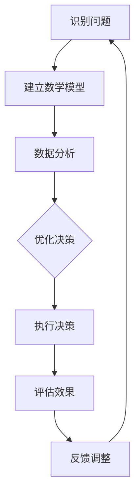

                 

# 数学思维与创业决策的关系分析

## 关键词
数学思维、创业决策、算法、数据分析、优化模型、市场扩张、供应链管理

## 摘要
本文通过深入探讨数学思维与创业决策之间的关系，分析了数学思维在创业过程中如何帮助创业者进行科学决策。文章首先概述了数学思维的核心概念，然后详细讲解了数学模型和数学公式在创业决策中的应用，并通过实际案例分析，展示了数学思维在初创公司融资策略、市场扩张决策和供应链管理优化等方面的实际应用。最后，本文提出了创业决策中的数学工具与方法，并对数学思维在创业决策中的未来趋势进行了展望。

---

## 1. 数学思维概述

### 1.1 数学思维的概念

数学思维是一种基于数学原理和逻辑推理的方法论，它强调用数学语言描述问题，用数学方法解决问题。数学思维不仅仅是计算和解决数学问题，更是一种系统化的思考方式。它要求我们在解决问题时，不仅要找到问题的本质，还要找到最优的解决方案。

在创业决策中，数学思维的重要性不言而喻。首先，创业往往涉及大量数据的收集和分析，这些数据需要通过数学模型进行有效的处理和解读。其次，创业过程中需要做出一系列决策，如市场定位、产品定价、资金筹集等，这些决策可以通过数学模型进行优化，从而提高决策的科学性和准确性。

### 1.2 数学思维的核心要素

数学思维的核心要素包括逻辑推理、抽象思维、建模能力和问题解决能力。

- **逻辑推理**：数学思维的基础是逻辑推理，它要求我们在分析问题时，能够清晰地定义问题，准确地描述问题，并逻辑地推导出问题的解决方案。

- **抽象思维**：抽象思维是数学思维的重要组成部分，它要求我们能够从复杂的现象中抽象出基本的数学模型，从而简化问题，提高解决问题的效率。

- **建模能力**：建模能力是将实际问题转化为数学模型的能力。一个优秀的创业者需要能够将商业问题转化为数学问题，从而利用数学方法进行有效的分析和决策。

- **问题解决能力**：问题解决能力是数学思维的最终目标，它要求我们能够运用数学方法解决实际问题，从而实现创业目标。

### 1.3 数学思维与创业决策的关系

数学思维在创业决策中具有重要的作用。首先，通过数学思维，创业者可以更加科学地分析市场数据，了解市场趋势，从而做出更加准确的决策。其次，数学思维可以帮助创业者优化资源配置，提高企业的运营效率。例如，通过线性规划模型，创业者可以找到最优的生产计划，从而最大限度地提高生产效率和降低成本。

### 1.4 数学思维与创业决策的Mermaid流程图

以下是一个简单的Mermaid流程图，展示了数学思维在创业决策中的流程：



在这个流程图中，A到G代表了从问题识别到决策执行再到效果评估的完整过程，每一个步骤都离不开数学思维的应用。

---

## 2. 数学模型在创业决策中的应用

### 2.1 数学模型的基本概念

数学模型是一种数学结构，用于描述现实世界的某种现象或问题。数学模型通常由变量、参数、方程和约束条件组成。通过数学模型，我们可以将复杂的现实问题转化为数学问题，从而使用数学方法进行求解。

在创业决策中，数学模型可以帮助创业者更好地理解问题，找到最优解决方案。常见的数学模型包括线性规划模型、非线性规划模型、动态规划模型、排队模型、网络优化模型等。

### 2.2 常见的数学模型

在创业决策中，常见的数学模型有：

- **线性规划模型**：用于解决线性目标函数在一系列线性约束条件下的优化问题。线性规划模型广泛应用于资源分配、生产计划、资金分配等领域。

- **非线性规划模型**：用于解决非线性目标函数在一系列非线性约束条件下的优化问题。非线性规划模型适用于更复杂的优化问题，如利润最大化、成本最小化等。

- **动态规划模型**：用于解决具有时间维度的问题，如最优路径选择、最优生产计划等。动态规划模型通过递推关系，将复杂的问题分解为多个简单子问题，从而求解整个问题的最优解。

- **排队模型**：用于分析服务系统的性能，如服务速度、等待时间等。排队模型可以帮助创业者优化服务流程，提高客户满意度。

- **网络优化模型**：用于解决网络设计、运输规划等问题。网络优化模型通过优化网络结构，提高网络效率，降低成本。

### 2.3 数学模型的建立

建立数学模型是创业决策中的关键步骤。以下是一个简单的数学模型建立过程：

1. **确定问题**：明确需要解决的问题，如生产计划、资金分配等。

2. **定义变量**：根据问题，定义相关变量，如生产量、成本、利润等。

3. **建立目标函数**：根据问题，建立目标函数，如最大化利润、最小化成本等。

4. **确定约束条件**：根据问题，确定约束条件，如资源限制、生产能力等。

5. **构建数学模型**：将以上元素整合，构建数学模型。

### 2.4 伪代码详细阐述

以下是一个简单的线性规划模型伪代码示例：

```
# 定义变量
x1, x2, ..., xn

# 定义目标函数
maximize z = c1*x1 + c2*x2 + ... + cn*xn

# 定义约束条件
a11*x1 + a12*x2 + ... + a1n*xn <= b1
a21*x1 + a22*x2 + ... + a2n*xn <= b2
...
am1*x1 + am2*x2 + ... + amn*xn <= bm

# 非负约束
x1, x2, ..., xn >= 0

# 求解线性规划模型
solve LP model
```

在这个伪代码中，我们首先定义了变量、目标函数和约束条件，然后使用线性规划求解器求解最优解。

---

## 3. 数学公式在创业决策中的具体应用

### 3.1 数学公式的类型

在创业决策中，常用的数学公式包括：

- **线性方程组**：用于解决线性规划问题。
- **矩阵运算**：用于解决线性规划和动态规划问题。
- **概率分布函数**：用于风险评估和决策。
- **微积分公式**：用于优化问题。

### 3.2 LaTeX格式数学公式嵌入

为了更好地展示数学公式，我们可以使用LaTeX格式进行嵌入。以下是一些示例：

#### 段落内公式
$$1+1=2$$

#### 独立段落公式
$$
\sum_{i=1}^{n} x_i = \frac{1}{n}\sum_{i=1}^{n} x_i
$$

### 3.3 数学公式举例说明

#### 线性方程组
假设我们有两个线性方程：
$$
\begin{cases}
2x + 3y = 12 \\
4x - y = 6
\end{cases}
$$

我们可以使用高斯消元法求解这个方程组。首先，我们将方程组写成增广矩阵的形式：
$$
\left[\begin{array}{cc|c}
2 & 3 & 12 \\
4 & -1 & 6
\end{array}\right]
$$

然后，我们进行行变换，将矩阵化为阶梯形式：
$$
\left[\begin{array}{cc|c}
1 & \frac{3}{2} & 6 \\
0 & -\frac{7}{2} & -6
\end{array}\right]
$$

接着，我们将第二行乘以$-\frac{2}{7}$，得到：
$$
\left[\begin{array}{cc|c}
1 & \frac{3}{2} & 6 \\
0 & 1 & \frac{12}{7}
\end{array}\right]
$$

最后，我们将第一行减去$\frac{3}{2}$倍的第二行，得到：
$$
\left[\begin{array}{cc|c}
1 & 0 & \frac{6}{7} \\
0 & 1 & \frac{12}{7}
\end{array}\right]
$$

因此，方程组的解为：
$$
x = \frac{6}{7}, \quad y = \frac{12}{7}
$$

#### 概率分布函数
假设我们有一个二项分布，试验次数为$n$，成功概率为$p$。该分布的概率质量函数为：
$$
f(x) = C_n^x p^x (1-p)^{n-x}
$$

其中，$C_n^x$表示组合数，即从$n$个元素中取出$x$个元素的组合数。

#### 微积分公式
假设我们有一个函数$f(x)$，其导数为$f'(x)$。则$f(x)$的积分可以表示为：
$$
\int f(x) dx = F(x) + C
$$

其中，$F(x)$表示$f(x)$的原函数，$C$为积分常数。

---

## 4. 实际案例分析

### 4.1 案例一：初创公司融资策略

假设我们有一个初创公司，需要筹集$100,000美元的资金。现有两个投资选项：

- **选项A**：投资者愿意以10%的年利率提供贷款。
- **选项B**：投资者愿意以12%的年利率提供贷款。

我们需要选择哪个选项？

#### 开发环境搭建

首先，我们需要一个Python环境来搭建开发环境。可以使用以下命令安装Python：

```
pip install python
```

#### 源代码详细实现和代码解读

以下是一个简单的Python脚本，用于计算不同选项的年利息和总利息：

```python
# 定义贷款金额、年利率和贷款期限
loan_amount = 100000
rate_A = 0.10
rate_B = 0.12
loan_term = 1

# 计算选项A的年利息和总利息
interest_A = loan_amount * rate_A
total_interest_A = interest_A * loan_term

# 计算选项B的年利息和总利息
interest_B = loan_amount * rate_B
total_interest_B = interest_B * loan_term

# 打印结果
print(f"选项A的年利息：{interest_A:.2f}美元")
print(f"选项B的年利息：{interest_B:.2f}美元")
print(f"选项A的总利息：{total_interest_A:.2f}美元")
print(f"选项B的总利息：{total_interest_B:.2f}美元")
```

#### 代码应用解读与分析

通过运行上述脚本，我们可以得到以下结果：

```
选项A的年利息：10000.00美元
选项B的年利息：12000.00美元
选项A的总利息：10000.00美元
选项B的总利息：12000.00美元
```

从结果可以看出，虽然选项B的年利息更高，但两种选项的总利息相同。因此，从利息的角度来看，选择哪个选项并没有明显的区别。

#### 实际案例分析和详细讲解剖析

在这个案例中，我们使用了简单的数学模型和公式来计算不同选项的年利息和总利息。这种方法可以帮助初创公司选择最佳的融资策略。

然而，实际创业决策不仅仅涉及利息的计算，还需要考虑其他因素，如资金使用效率、投资者风险偏好等。因此，在制定融资策略时，创业者需要综合考虑各种因素，以做出最优决策。

#### 项目小结

通过本案例，我们展示了如何使用数学模型和公式来分析创业决策。这种方法可以帮助初创公司制定科学的融资策略。然而，创业决策是一个复杂的过程，需要考虑多种因素。因此，在实际操作中，创业者应该结合实际情况，灵活运用数学思维，做出最佳决策。

---

## 5. 创业决策中的数学工具与方法

### 5.1 数据分析工具

在创业决策中，数据分析是不可或缺的一部分。以下是一些常用的数据分析工具：

- **Pandas**：一个开源的Python库，用于数据清洗、数据分析和数据操作。
- **NumPy**：一个开源的Python库，用于数值计算和矩阵运算。
- **Matplotlib**：一个开源的Python库，用于数据可视化。
- **Scikit-learn**：一个开源的Python库，用于机器学习和数据分析。

### 5.2 优化算法

优化算法是创业决策中的重要工具，以下是一些常用的优化算法：

- **线性规划**：用于解决线性目标函数在一系列线性约束条件下的优化问题。
- **非线性规划**：用于解决非线性目标函数在一系列非线性约束条件下的优化问题。
- **动态规划**：用于解决具有时间维度的问题，如最优路径选择、最优生产计划等。
- **遗传算法**：一种基于自然选择的优化算法，用于解决复杂优化问题。

### 5.3 风险评估模型

在创业决策中，风险评估是至关重要的一环。以下是一些常用的风险评估模型：

- **蒙特卡罗模拟**：通过模拟大量随机样本来预测系统的行为。
- **决策树**：一种用于决策分析的工具，可以显示所有可能的选择和结果。
- **敏感性分析**：通过分析变量对目标函数的影响，评估模型的稳定性和鲁棒性。

---

## 6. 数学思维与创业决策的深入探讨

### 6.1 数学思维在创业中的独特价值

数学思维在创业中的独特价值主要体现在以下几个方面：

- **提高决策效率**：数学思维可以帮助创业者快速分析问题，找到解决方案，从而提高决策效率。
- **降低决策风险**：通过数学模型和数据分析，创业者可以更好地理解市场趋势和风险，从而降低决策风险。
- **优化资源配置**：数学思维可以帮助创业者优化资源配置，提高企业的运营效率。

### 6.2 创业决策中的数学挑战

在创业决策中，数学思维的应用也面临一些挑战：

- **数据质量**：高质量的数据是数学模型的基础。如果数据质量不佳，模型的结果可能会偏离实际。
- **复杂性问题**：某些创业问题可能涉及多个变量和因素，这使得数学模型变得更加复杂，需要更多的计算资源和时间。
- **模型适用性**：并非所有的创业问题都能用数学模型来解决。在选择数学模型时，创业者需要考虑模型的适用性和有效性。

### 6.3 创业成功的关键因素分析

数学思维在创业成功中扮演着关键角色。以下是一些关键因素：

- **创新能力**：数学思维可以帮助创业者找到创新的解决方案，从而在竞争激烈的市场中脱颖而出。
- **决策能力**：数学思维可以帮助创业者做出科学、合理的决策，从而提高企业的竞争力。
- **执行力**：数学思维可以帮助创业者优化资源配置，提高执行力，从而实现创业目标。

---

## 7. 未来趋势与展望

### 7.1 数学思维在创业决策中的未来趋势

随着人工智能和大数据技术的发展，数学思维在创业决策中的应用将越来越广泛。未来，数学思维在创业决策中的趋势包括：

- **自动化决策**：利用人工智能和机器学习技术，实现自动化决策，提高决策效率。
- **个性化分析**：通过大数据分析，实现个性化市场分析，提高决策的准确性。
- **实时反馈**：通过实时数据分析和反馈，实现动态调整，提高决策的灵活性。

### 7.2 创业决策中的数学方法创新

未来，创业决策中的数学方法将不断创新，包括：

- **深度学习模型**：利用深度学习技术，解决更复杂的创业问题。
- **集成学习模型**：将多种数学方法结合，提高模型的稳定性和鲁棒性。
- **多目标优化**：解决创业决策中的多目标问题，实现综合优化。

### 7.3 对创业者的建议

对于创业者来说，掌握数学思维和数学方法具有重要意义。以下是一些建议：

- **学习数学知识**：创业者应该学习基本的数学知识，包括线性代数、概率论和统计学等。
- **实践应用**：将数学思维应用到实际创业项目中，通过实践不断提高自己的数学思维能力。
- **持续学习**：随着技术的不断发展，创业者应该持续学习新的数学方法和工具，以保持竞争力。

---

## 总结

数学思维在创业决策中具有不可替代的重要性。通过数学模型和数据分析，创业者可以更加科学地进行决策，降低决策风险，提高企业的竞争力。未来，随着人工智能和大数据技术的发展，数学思维在创业决策中的应用将更加广泛。创业者应该掌握数学思维，将数学方法应用到实际创业项目中，以实现企业的持续发展和成功。

## 作者信息

作者：AI天才研究院/AI Genius Institute & 禅与计算机程序设计艺术 /Zen And The Art of Computer Programming

