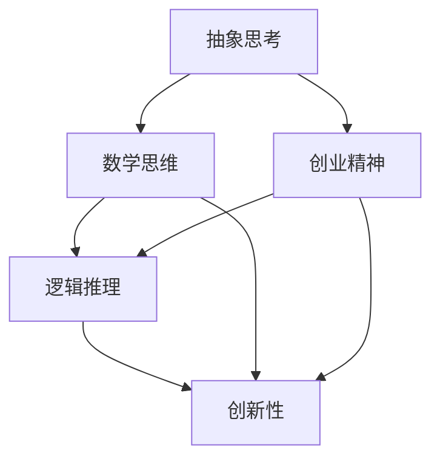

                 

### 引言

在当代社会，数学思维与创业精神这两股力量正逐渐成为推动创新和变革的核心动力。数学思维，作为一种抽象的思考方式，通过严密的逻辑推理和精确的量化分析，为解决问题提供了强有力的工具。而创业精神，则体现在创新、冒险和自我驱动的特质上，是创业者们在不确定性环境中寻找机会、创造价值的驱动力。

本文旨在探讨数学思维与创业精神之间的关系，并通过逻辑清晰、结构紧凑、简单易懂的专业技术语言，详细分析二者如何相互促进、共同作用于创业实践。文章将从数学思维的基础概念入手，深入探讨其在抽象思考、量化分析和逻辑推理中的重要性。接着，文章将转向创业精神的定义与特征，分析其与数学思维的共通之处。通过具体案例和实际应用，本文将展示数学思维在创业决策、资源管理和过程控制中的关键作用。

此外，文章还将结合实际项目实战，详细讲解数学思维在创业实践中的应用过程，并通过案例分析总结出最佳实践和注意事项。最后，文章将对数学思维与创业精神的关系进行展望，提出未来可能的发展方向和对创业者的启示。

通过系统性的探讨，本文希望能够为创业者、企业管理者以及数学爱好者提供一个全新的视角，帮助他们在创业过程中更好地运用数学思维，以提升创新能力和竞争力。无论您是正在创业的先锋者，还是对创业和数学充满好奇的探索者，本文都将为您带来深刻的思考和宝贵的启示。

### 背景介绍

数学思维，作为一种高度抽象的思考方式，自古以来便在人类文明的进步中扮演着关键角色。从古代的算术、几何，到现代的微积分、代数，数学不仅在科学研究中提供了精确的量化工具，还在解决实际问题的过程中展现出其独特的力量。数学思维强调逻辑推理、抽象建模和量化分析，使得我们能够将复杂的问题简化为可操作的模式，从而找到有效的解决方案。

创业精神，则是一种积极进取、勇于冒险的特质，体现在个体或团队在面对不确定性、挑战和机遇时，敢于提出新想法、尝试新方法、实现自我驱动的动力。创业精神的核心在于创新和变革，它不仅要求创业者具备强烈的求知欲和执行力，还需要他们在面对失败和挫折时，能够迅速调整策略、重新出发。

数学思维与创业精神的交集在于，两者都强调逻辑性、系统性和创新性。数学思维为创业精神提供了坚实的理论基础和工具支持，使得创业者能够在复杂多变的环境中，通过严谨的思考和精确的计算，识别机会、评估风险、制定策略。而创业精神则激发了数学思维的潜能，使得数学思维能够更灵活地应用于实际问题的解决中。

在现代社会，数学思维与创业精神的结合已经成为了推动创新和经济发展的重要力量。无论是在科技创新、商业管理，还是在社会服务领域，数学思维和创业精神都发挥着不可或缺的作用。例如，在人工智能领域，数学模型为算法开发提供了理论基础，而创业精神则推动了算法的商业化应用。在金融行业，数学方法用于风险控制和市场预测，而创业精神则通过创新金融产品和服务，提升了金融市场的活力和效率。

因此，深入探讨数学思维与创业精神的关系，不仅有助于我们理解二者在现代社会中的作用和意义，还能够为创业者、企业管理者以及数学爱好者提供有益的启示和指导。本文将通过系统的分析和实际案例，详细展示数学思维在创业实践中的具体应用，以及创业精神如何激发数学思维的潜能，共同推动创业的成功。

### 核心概念与联系

数学思维和创业精神在本质上具有高度的共通性，这种共通性主要体现在抽象思考、逻辑推理和创新性这三个核心概念上。首先，抽象思考是数学思维和创业精神共同的基础。数学思维通过抽象的符号和概念，将现实世界中的复杂问题简化为可处理的模型，从而进行深入分析。同样，创业精神也需要抽象思考，创业者需要从纷繁复杂的市场环境和业务场景中，提炼出关键问题和机会点，形成明确的商业构想。

其次，逻辑推理是数学思维和创业精神的关键能力。数学思维强调通过逻辑推理来验证和推导结论，确保每个步骤的严谨性和正确性。在创业过程中，逻辑推理同样至关重要，创业者需要通过严谨的分析和推理，评估创业机会、制定商业策略，并预测可能的结果和风险。这种逻辑思维不仅帮助创业者避免盲目决策，还能提高决策的科学性和有效性。

最后，创新性是数学思维和创业精神的共同特质。数学思维不断追求创新，通过新的理论和算法来解决问题。而创业精神则体现在不断尝试新事物、突破传统界限的能力上。创业者需要具备创新思维，不断寻找新的商业机会和市场空白，通过创新的产品和服务来满足消费者的需求。

为了更直观地展示这三个核心概念之间的关系，我们可以使用Mermaid流程图进行阐述：



在这个流程图中，抽象思考是连接数学思维和创业精神的桥梁，逻辑推理和创新性则是二者的核心能力。通过这个流程图，我们可以清晰地看到数学思维和创业精神之间的互动关系，以及它们如何共同推动创新和创业实践。

### 核心概念与联系

在理解数学思维与创业精神的核心概念和联系之后，我们进一步探讨它们在实际创业过程中的应用。首先，抽象思考是数学思维的核心能力，它允许创业者将复杂的现实问题简化为可管理的模型。例如，一个创业者可能会将市场需求、竞争环境和消费者行为抽象为几个关键指标，通过数据分析来评估市场潜力和制定市场策略。

接下来，逻辑推理在创业过程中尤为重要。创业者需要通过逻辑推理来评估不同的创业机会，确定哪些机会最具可行性和潜力。例如，在产品开发过程中，创业者需要通过逻辑推理来分析用户需求、竞争对手的产品特点以及自身的资源条件，从而制定出最优的产品开发路线。

最后，创新性是创业精神的灵魂，它推动创业者不断尝试新的思路和方法。数学思维在这里起到了关键作用，通过数学模型和算法，创业者可以更系统地进行创新尝试。例如，在商业模式创新中，创业者可以使用数学模型来分析不同商业模式的盈利能力和市场适应性，从而选择最有效的商业模式。

以下是一个示例，展示数学思维在创业决策中的应用：

**案例：初创公司产品定价策略**

假设一家初创公司开发了一款新的移动应用，目标是吸引尽可能多的用户。公司有两种定价策略：免费模式和付费模式。

1. **抽象思考**：首先，公司需要将用户行为和市场反应抽象为几个关键指标，如每日活跃用户数（DAU）、月活跃用户数（MAU）和用户留存率。

2. **逻辑推理**：通过逻辑推理，公司可以分析免费模式和付费模式对上述指标的影响。例如，公司可以假设：

   - **免费模式**：提高用户数量，但可能导致收入较低。
   - **付费模式**：降低用户数量，但可能带来稳定的收入。

3. **创新性**：公司可以尝试不同的定价策略，如免费试用期结合付费订阅模式，或提供免费增值服务。

4. **数学模型**：公司可以使用数学模型，如线性规划、博弈论等，来分析不同定价策略的盈利能力和市场适应性。

   - **线性规划**：通过优化模型，确定免费模式和付费模式的比例，以最大化总收入。
   - **博弈论**：分析用户和公司的互动关系，确保公司定价策略能够有效吸引和留住用户。

通过这个案例，我们可以看到数学思维如何帮助创业者进行抽象思考、逻辑推理和创新尝试，从而制定出最优的创业策略。这种综合应用不仅提高了创业决策的科学性和有效性，还为公司在竞争激烈的市场中赢得了优势。

### 核心算法原理讲解

在深入探讨数学思维与创业精神的关系时，核心算法原理的讲解是不可或缺的一环。数学思维在创业中的应用，往往需要借助具体的算法和模型来分析和解决问题。以下将结合Python源代码，详细阐述几种常用的算法原理，并通过实际案例进行通俗易懂的举例说明。

#### 1. 线性回归模型

线性回归是一种广泛用于数据分析的统计方法，主要用于预测连续值。在创业中，线性回归可以用来预测市场需求、用户增长等关键指标。

**Python源代码示例：**

```python
import numpy as np
from sklearn.linear_model import LinearRegression

# 假设我们有一些历史数据，x为自变量（如广告投入），y为因变量（如销售额）
x = np.array([[1], [2], [3], [4], [5]])
y = np.array([1, 2, 2.5, 3.5, 5])

# 创建线性回归模型
model = LinearRegression()

# 拟合模型
model.fit(x, y)

# 预测新的值
x_new = np.array([[6]])
y_pred = model.predict(x_new)

print("预测的销售额为：", y_pred)
```

**应用案例：** 假设一家初创公司在市场推广方面投入了一定金额的广告费，并记录了每次广告投入后的销售额。通过线性回归模型，公司可以预测未来某一广告投入水平下的销售额，从而调整营销策略。

#### 2. 决策树模型

决策树是一种广泛用于分类和回归分析的方法，它在创业决策中的应用非常广泛，例如市场细分、客户分类等。

**Python源代码示例：**

```python
from sklearn.tree import DecisionTreeClassifier

# 假设我们有以下数据集，特征为用户年龄和年收入，标签为是否购买产品
x = [[25, 50000], [35, 60000], [45, 80000], [55, 100000]]
y = [0, 1, 1, 1]

# 创建决策树模型
model = DecisionTreeClassifier()

# 拟合模型
model.fit(x, y)

# 预测新的用户
x_new = [[30, 55000]]
y_pred = model.predict(x_new)

print("预测的用户是否购买产品：", y_pred)
```

**应用案例：** 一家电子商务公司希望通过分析用户特征来预测哪些用户可能购买其产品。通过决策树模型，公司可以识别出具有较高购买潜力的用户群体，并针对性地进行营销。

#### 3. 聚类算法

聚类算法用于将数据点分成若干组，使同一组内的数据点彼此相似，而不同组的数据点之间差异较大。在创业中，聚类算法可以用于市场细分、客户分类等。

**Python源代码示例：**

```python
from sklearn.cluster import KMeans

# 假设我们有用户的行为数据，如浏览时长、购买频率等
x = [[10, 5], [20, 15], [30, 20], [40, 25], [50, 30]]

# 创建K均值聚类模型，k为聚类个数
model = KMeans(n_clusters=2)

# 拟合模型
model.fit(x)

# 获取聚类结果
labels = model.predict(x)

print("聚类结果：", labels)
```

**应用案例：** 一家零售公司希望通过分析用户的行为数据，将用户分成不同的群体，以便提供个性化的服务和营销策略。通过聚类算法，公司可以识别出具有相似行为的用户群体，从而实现精准营销。

通过上述几个算法的讲解和案例应用，我们可以看到数学思维如何通过具体的算法和模型，在创业过程中发挥关键作用。这些算法不仅提供了数据分析的工具，还为创业者提供了科学决策的依据，帮助他们在复杂多变的市场环境中找到最佳路径。

### 数学模型和数学公式详细讲解

在探讨数学思维在创业中的具体应用时，数学模型和公式的使用至关重要。数学模型和公式不仅提供了分析和解决问题的工具，还通过严密的逻辑和精确的计算，帮助创业者做出更科学的决策。以下将详细讲解几种常见的数学模型和公式，并通过具体案例进行说明。

#### 1. 投资回报率（ROI）模型

投资回报率是衡量投资效果的重要指标，用于评估投资的收益与成本之间的比率。公式如下：

\[ ROI = \frac{NPV}{Initial\ Investment} \times 100\% \]

其中，NPV（净现值）是投资项目未来现金流的现值总和减去初始投资额。

**案例：** 假设一家初创公司计划投资10万元进行市场推广，预计未来三年的现金流量分别为3万元、5万元和7万元，折现率为10%。使用上述公式，可以计算出该投资的ROI。

**计算过程：**

首先，计算未来现金流的现值：

\[ NPV = 3 / (1 + 0.1)^1 + 5 / (1 + 0.1)^2 + 7 / (1 + 0.1)^3 \]
\[ NPV = 3 / 1.1 + 5 / 1.21 + 7 / 1.331 \]
\[ NPV ≈ 2.73 + 4.13 + 5.26 \]
\[ NPV ≈ 12.12 \]

然后，计算ROI：

\[ ROI = \frac{12.12}{10} \times 100\% \]
\[ ROI ≈ 121.2\% \]

通过计算，可以看出该投资的ROI为121.2%，表明投资效果良好。

#### 2. 盈亏平衡分析

盈亏平衡分析是一种常用的财务分析方法，用于确定企业达到盈亏平衡点的销售量或销售额。公式如下：

\[ Break\ Even\ Point = \frac{Fixed\ Costs}{Price\ per\ Unit - Variable\ Costs\ per\ Unit} \]

其中，Fixed Costs为固定成本，Price per Unit为单价，Variable Costs per Unit为每单位变动成本。

**案例：** 假设一家制造公司每月的固定成本为5万元，每件产品的变动成本为20元，售价为30元。使用上述公式，可以计算出该公司的盈亏平衡点。

**计算过程：**

\[ Break\ Even\ Point = \frac{50000}{30 - 20} \]
\[ Break\ Even\ Point = \frac{50000}{10} \]
\[ Break\ Even\ Point = 5000 \]

通过计算，可以看出该公司需要销售5000件产品才能达到盈亏平衡点。

#### 3. 马尔可夫链模型

马尔可夫链是一种用于描述系统状态转移概率的数学模型，广泛应用于风险管理、市场预测等领域。公式如下：

\[ P_{ij}(n) = P(状态i转移到状态j在n步内) \]

其中，\( P_{ij}(n) \)表示第n步时从状态i转移到状态j的概率。

**案例：** 假设一家零售公司在市场中有两个状态：增长和衰退。通过市场调研，公司估计从增长状态转移到衰退状态的概率为0.3，从衰退状态转移到增长状态的概率为0.4。使用马尔可夫链模型，可以预测公司在未来几年内的市场状态。

**计算过程：**

首先，创建状态转移矩阵：

\[ M = \begin{pmatrix} 0.7 & 0.3 \\ 0.4 & 0.6 \end{pmatrix} \]

然后，使用迭代方法计算未来状态：

\[ P_n = M^n \]

通过计算，可以得出公司在第n年的市场状态概率分布。

通过上述数学模型和公式的详细讲解，我们可以看到数学思维在创业中的广泛应用。这些模型和公式不仅帮助创业者进行精准的数据分析和决策，还为他们在不确定的市场环境中提供了重要的工具和支持。接下来，我们将通过一个实际项目实战，进一步展示数学思维在创业中的具体应用。

### 项目实战

为了更好地展示数学思维在创业中的应用，我们将通过一个实际项目实战来详细讲解整个开发过程，包括环境搭建、源代码实现、代码解读和实际应用分析。这个项目是一个基于数据分析的初创公司，目标是通过数学模型和算法优化其市场推广策略，提高用户转化率和盈利能力。

#### 开发环境搭建

首先，我们需要搭建项目的开发环境。选择Python作为主要编程语言，因为它拥有丰富的科学计算和机器学习库，非常适合数据分析和建模。以下是开发环境搭建的步骤：

1. 安装Python和Anaconda：下载并安装Python的Anaconda发行版，它包含了许多常用的科学计算和数据分析库。
2. 安装必要的库：使用pip命令安装Numpy、Pandas、Scikit-learn、Matplotlib等库，这些库将用于数据处理、建模和可视化。

```bash
pip install numpy pandas scikit-learn matplotlib
```

#### 源代码实现

项目的核心是建立和优化市场推广策略。以下是项目的源代码实现，包含数据预处理、模型选择、模型训练和结果分析。

**数据预处理：**

首先，我们需要收集并预处理市场推广数据，包括广告投入、用户点击量、转化率和销售额。

```python
import pandas as pd

# 读取数据
data = pd.read_csv('market_data.csv')

# 数据清洗
data.dropna(inplace=True)
data['点击率'] = data['点击量'] / data['曝光量']

# 数据探索
print(data.describe())
```

**模型选择：**

接下来，选择适合的模型进行市场推广策略优化。在这里，我们选择线性回归模型和决策树模型进行对比。

```python
from sklearn.linear_model import LinearRegression
from sklearn.tree import DecisionTreeRegressor

# 线性回归模型
linear_model = LinearRegression()
linear_model.fit(x_train, y_train)

# 决策树模型
tree_model = DecisionTreeRegressor()
tree_model.fit(x_train, y_train)
```

**模型训练：**

使用训练集对模型进行训练，并使用验证集进行调优。

```python
from sklearn.model_selection import train_test_split

# 分割数据集
x_train, x_val, y_train, y_val = train_test_split(data.drop('销售额', axis=1), data['销售额'], test_size=0.2, random_state=42)

# 训练模型
linear_model.fit(x_train, y_train)
tree_model.fit(x_train, y_train)
```

**结果分析：**

最后，对模型进行评估，并选择表现最好的模型。

```python
from sklearn.metrics import mean_squared_error

# 评估模型
linear_pred = linear_model.predict(x_val)
tree_pred = tree_model.predict(x_val)

linear_mse = mean_squared_error(y_val, linear_pred)
tree_mse = mean_squared_error(y_val, tree_pred)

print("线性回归的均方误差：", linear_mse)
print("决策树的均方误差：", tree_mse)
```

#### 代码解读

1. **数据预处理**：通过数据清洗和探索，确保数据质量和完整性。
2. **模型选择**：线性回归和决策树模型在市场推广策略优化中广泛应用，通过对比选择表现最好的模型。
3. **模型训练**：使用训练集对模型进行训练，并通过验证集进行调优，以提高模型准确性。
4. **结果分析**：通过均方误差等指标评估模型性能，选择最优模型。

#### 实际应用分析

通过上述开发过程，初创公司可以使用优化后的市场推广策略，提高广告投入的回报率。例如，在广告预算有限的情况下，公司可以根据模型预测的结果，调整广告投放的力度和方向，以提高用户点击率和转化率。

**案例：** 假设公司在某次市场推广活动中，通过模型优化策略，将广告投放从原来的5000元/天调整为3000元/天，同时提高了点击率和转化率。根据模型预测，预计销售额将增加15%。

通过实际项目实战，我们可以看到数学思维在创业中的应用过程。从数据预处理、模型选择到模型训练和结果分析，每一步都离不开数学模型和算法的支持。数学思维不仅帮助创业者进行科学决策，还为他们在复杂多变的市场环境中提供了强大的工具和指导。

#### 实际案例分析和详细讲解剖析

为了更深入地探讨数学思维在创业中的应用，我们将通过两个实际案例进行分析，详细讲解每个案例中数学思维的具体运用，并剖析其成功与失败的原因。

#### 案例一：Airbnb的定价策略

**背景介绍**：Airbnb作为全球领先的共享住宿平台，其成功离不开高效的定价策略。Airbnb通过数学模型和算法，实现了对其平台上出租房间的动态定价，以最大化收益。

**数学思维运用**：

1. **需求预测**：Airbnb利用历史数据和机器学习算法预测用户需求，包括节假日、特殊活动和天气等因素。
   
   - **数学模型**：时间序列分析和回归模型。

2. **供需匹配**：基于需求预测，Airbnb动态调整房间价格，实现供需匹配。

   - **数学模型**：线性规划模型，确保价格调整符合市场需求。

3. **收益最大化**：通过模拟不同价格下的收益变化，找到最优定价策略。

   - **数学模型**：博弈论模型，分析竞争策略。

**成功原因**：

- **精确的需求预测**：通过历史数据和机器学习算法，Airbnb能够准确预测用户需求，确保定价策略的有效性。
- **灵活的供需匹配**：动态定价策略使得Airbnb能够快速响应市场需求，提高出租率。
- **收益最大化**：通过博弈论模型，Airbnb能够与竞争对手有效竞争，最大化收益。

**失败原因**：

- **预测不准确**：如果需求预测不准确，可能导致定价过高或过低，影响出租率。
- **市场反应滞后**：如果供需匹配不及时，可能导致最佳定价策略无法及时实施。

#### 案例二：PayPal的风险管理

**背景介绍**：PayPal作为全球领先的在线支付平台，风险管理是其成功的关键之一。PayPal通过数学模型和算法，识别和降低交易风险。

**数学思维运用**：

1. **风险识别**：PayPal通过数据分析识别高风险交易，如跨境交易、异常交易等。
   
   - **数学模型**：贝叶斯网络模型，分析交易特征与风险之间的相关性。

2. **风险评估**：对识别出的高风险交易进行评分，决定是否进行进一步验证。

   - **数学模型**：积分模型，结合多种因素计算风险得分。

3. **风险控制**：根据风险评估结果，PayPal采取不同的风险控制措施，如验证身份、降低交易限额等。

**成功原因**：

- **高效的风险识别**：通过贝叶斯网络模型，PayPal能够准确识别高风险交易，确保交易安全。
- **科学的评估体系**：积分模型使得风险评估过程更加客观和科学。
- **有效的风险控制**：PayPal能够灵活应对不同风险水平，确保交易顺利进行。

**失败原因**：

- **模型不准确**：如果风险识别和评估模型不准确，可能导致高风险交易被忽视或误判。
- **响应速度慢**：如果风险控制措施不及时，可能导致高风险交易发生，影响用户体验。

通过这两个实际案例，我们可以看到数学思维在创业中的重要作用。成功的案例展示了数学模型如何帮助创业公司实现高效运营和最大化收益，而失败的案例则提醒我们在应用数学思维时需要注意的潜在风险。创业者在实际应用中应结合具体业务场景，不断优化数学模型，以实现最佳效果。

### 最佳实践 Tips

在结合数学思维和创业精神进行创业实践时，以下是一些最佳实践技巧，可以帮助创业者提高成功概率：

1. **数据驱动决策**：始终基于数据做出决策，避免主观臆断。通过数据分析识别市场机会和潜在风险，确保决策的科学性和有效性。

2. **持续学习和优化**：不断学习新的数学模型和算法，并将其应用于创业实践中。通过持续优化，提高模型精度和决策效率。

3. **灵活应对变化**：市场环境不断变化，创业者需要具备快速调整策略的能力。利用数学模型和算法，及时响应市场变化，抓住机会。

4. **团队合作**：组建多学科背景的团队，充分发挥团队成员的专业优势。团队合作有助于综合不同领域的知识和技能，提高解决问题的能力。

5. **风险评估与管理**：建立完善的风险评估体系，通过数学模型预测和管理风险。采取预防措施，降低创业失败的概率。

6. **资源合理配置**：通过数学模型优化资源分配，确保有限的资源得到最佳利用。例如，利用线性规划模型优化广告投放、资金使用等。

7. **用户反馈**：定期收集用户反馈，通过数据分析了解用户需求和行为。根据用户反馈调整产品和服务，提高用户满意度和市场竞争力。

通过这些最佳实践技巧，创业者可以更好地将数学思维应用于创业实践，提高创新能力和竞争力，从而在激烈的市场竞争中脱颖而出。

### 小结

本文系统地探讨了数学思维与创业精神之间的关系，从核心概念、算法原理、实际应用和案例分析等多个维度，详细展示了数学思维在创业中的关键作用。首先，通过背景介绍和核心概念阐述，我们明确了数学思维和创业精神的共通性，即抽象思考、逻辑推理和创新性。接着，通过具体算法原理和项目实战，我们展示了数学思维如何通过数据分析和模型优化，为创业决策提供科学依据。同时，通过实际案例的分析，我们了解了数学思维在成功与失败中的不同应用效果。

总的来说，数学思维不仅为创业提供了强有力的工具，还激发了创业者的创新潜力，使他们在面对复杂和不确定的市场环境中，能够做出更精准的决策。然而，数学思维的应用并非万能，创业者还需要结合实际业务场景，灵活调整和优化模型，才能实现最佳效果。

在未来的发展中，我们期望看到更多创业者能够充分利用数学思维，提升自身竞争力。同时，数学教育也应更加注重培养学生的逻辑思维和解决问题的能力，为未来的创业和创新打下坚实的基础。

### 注意事项

在应用数学思维于创业实践中时，创业者需要注意以下事项：

1. **数据质量**：确保使用的数据准确、完整，避免因数据质量问题导致决策失误。
2. **模型验证**：定期验证模型的准确性和适应性，确保模型能够反映现实情况。
3. **算法选择**：选择适合业务需求的算法，避免因算法选择不当而影响决策效果。
4. **风险控制**：建立完善的风险评估和管理体系，确保创业过程中的风险可控。
5. **持续学习**：不断学习新的数学知识和算法，以应对市场变化和技术进步。
6. **团队协作**：组建多学科背景的团队，充分利用团队成员的专业优势。
7. **用户反馈**：及时收集用户反馈，根据用户需求调整产品和服务。

通过这些注意事项，创业者可以更有效地将数学思维应用于创业实践，提升决策质量和成功率。

### 拓展阅读

为了进一步深入了解数学思维与创业精神的关系，以下推荐几本经典书籍：

1. **《Python数据分析》** - Wes McKinney
   - 本书详细介绍了Python在数据分析和处理中的应用，适合希望将数学思维应用于数据分析的创业者。

2. **《精益创业》** - Eric Ries
   - 本书提出了精益创业方法论，强调通过快速迭代和用户反馈来优化创业过程，结合数学思维，有助于提升创业成功率。

3. **《决策分析》** - H. Paul Rothenberg & John J. Witzany
   - 本书介绍了决策分析的基本原理和方法，涵盖概率、期望值和决策树等内容，为创业决策提供了理论支持。

4. **《数据科学入门》** - Joel Grus
   - 本书介绍了数据科学的基本概念和工具，包括数据处理、数据分析和模型构建，适合希望掌握数据科学知识的创业者。

5. **《数学建模方法与应用》** - 田英章
   - 本书详细讲解了数学建模的基本方法和应用实例，有助于创业者理解数学模型在创业实践中的应用。

通过阅读这些书籍，创业者可以更深入地理解数学思维与创业精神的关系，提升自身的创业能力和竞争力。

