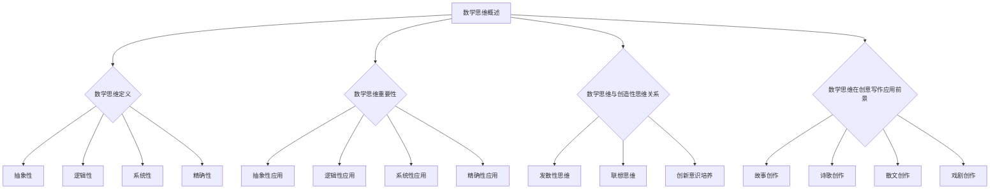
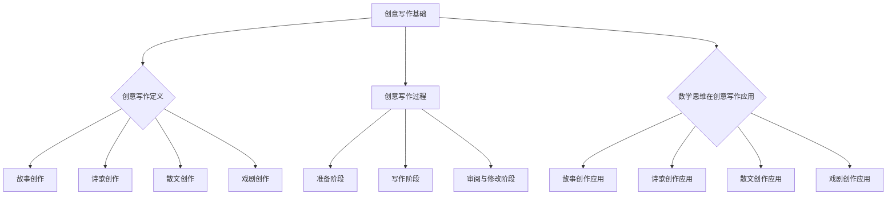

                 

# 数学思维与创意写作的关系探讨

## 关键词
数学思维、创意写作、创造性思维、故事创作、诗歌创作、散文创作、戏剧创作、数学应用、创意工具、跨学科教育

## 摘要
本文旨在探讨数学思维与创意写作之间的关系，解析数学思维在创意写作中的独特作用。文章首先介绍数学思维的基本概念和特点，随后探讨创意写作的基本原理和类型。通过深入分析数学思维与创造性思维的关系，本文揭示了数学思维在创意写作中的应用潜力。接着，文章详细阐述了数学思维在故事创作、诗歌创作、散文创作和戏剧创作中的具体应用，并提供了相应的案例。最后，文章展望了数学思维与创意写作的未来发展趋势，强调了跨学科教育的重要性。

## 第一部分：数学思维基础

### 第1章：数学思维概述

**1.1 数学思维的定义**

数学思维是一种抽象的、逻辑性的思维方式，它通过符号和公式来描述和解决问题。这种思维方式强调逻辑性、精确性和系统性，使得数学成为了一种高度抽象的学科。数学思维不仅局限于数学本身，它还渗透到其他科学领域，如物理、计算机科学和经济学等。

**1.2 数学思维的特点**

1. **抽象性**：数学思维能够从具体的事物中提取出共性，形成抽象的概念和理论。
2. **逻辑性**：数学思维遵循逻辑规则，通过推理和证明来得出结论。
3. **系统性**：数学思维注重概念之间的关系，构建系统的理论框架。
4. **精确性**：数学思维追求精确，用数据和公式来描述现实世界。

**1.3 数学思维的重要性**

数学思维是人类认识世界的重要工具，它在科学研究和日常生活中的应用越来越广泛。数学思维不仅有助于我们理解和解决问题，还能培养我们的逻辑思维能力和创新意识。

**1.4 数学思维与创造性思维的关系**

数学思维和创造性思维之间存在着密切的联系。创造性思维通常涉及发散性思维和联想思维，而数学思维则强调逻辑性和系统性。两者结合，可以激发出更多的创意和灵感。

**1.5 数学思维在创意写作中的应用前景**

随着科技的发展，数学思维在创意写作中的应用前景越来越广阔。通过将数学元素融入故事创作、诗歌创作、散文创作和戏剧创作中，可以创造出独特的艺术形式。数学思维不仅可以为创意写作提供新的素材和工具，还可以拓宽创意写作的视野和思维空间。

### 第2章：数学基础概念

**2.1 数的概念**

数的概念是数学中最基本的概念之一。数可以分为自然数、整数、分数和小数。

- **自然数**：自然数是用来计数的数，如1、2、3、4等。
- **整数**：整数包括自然数和它们的相反数，如-1、0、1、2等。
- **分数**：分数表示部分与整体的关系，如1/2、3/4等。
- **小数**：小数是分数的一种表示形式，通常用小数点来分隔整数部分和小数部分，如0.5、2.75等。

**2.2 几何基础**

几何是数学的一个重要分支，研究空间中的形状、大小和位置关系。

- **点、线、面**：点是几何中的基本元素，线是由无数个点组成的，面是由无数个线组成的。
- **三角形**：三角形是由三条线段组成的闭合图形，具有独特的性质和定理。
- **四边形**：四边形是由四条线段组成的闭合图形，包括正方形、矩形、菱形等。
- **圆**：圆是由无数个等距离于一个固定点的点组成的平面图形。

**2.3 代数基础**

代数是数学中的另一个重要分支，研究数与数之间的关系。

- **一元一次方程**：一元一次方程是只有一个未知数的一阶方程，如ax + b = 0。
- **一元二次方程**：一元二次方程是只有一个未知数且最高次项为二次的方程，如ax^2 + bx + c = 0。
- **函数基础**：函数是一种映射关系，将一个集合中的每个元素映射到另一个集合中的一个元素。函数可以用公式或图表来表示。

### Mermaid 流程图



### Python 源代码

```python
# 定义自然数、整数、分数和小数的函数
def natural_number(n):
    return n >= 0

def integer(n):
    return n == int(n)

def fraction(n, d):
    return n / d > 0 and n / d < 1

def decimal(n):
    return n >= 0 and n < 1

# 测试函数
print(natural_number(5)) # True
print(integer(-3)) # True
print(fraction(1, 2)) # True
print(decimal(0.5)) # True
```

### 数学公式

$$1 + 1 = 2$$

$$x^2 + 2x + 1 = (x + 1)^2$$

### 拓展阅读

- 《数学思维训练教程》
- 《创意写作教程》
- 《数学与艺术》

## 第二部分：创意写作技巧

### 第3章：创意写作基础

**3.1 创意写作的定义**

创意写作是指通过创造性的思考和表达，创作出新颖、有趣、富有情感和思想内涵的作品。它包括多种形式，如故事创作、诗歌创作、散文创作和戏剧创作等。

**3.2 创意写作的类型**

1. **故事创作**：通过讲述故事来传达思想和情感，可以是小说、童话、科幻等。
2. **诗歌创作**：通过韵律和意象来表达思想和情感，可以是抒情诗、叙事诗、讽刺诗等。
3. **散文创作**：通过自由的文字表达思想和情感，可以是抒情散文、叙事散文、议论散文等。
4. **戏剧创作**：通过对话和动作来展示故事和情感，可以是话剧、歌剧、戏曲等。

**3.3 创意写作的过程**

1. **准备阶段**：确定写作主题、目标读者、故事情节等。
2. **写作阶段**：根据准备阶段的内容进行创作，包括故事情节、人物塑造、语言表达等。
3. **审阅与修改阶段**：对作品进行审阅和修改，提高作品的质量和效果。

### 第4章：数学思维在创意写作中的应用

**4.1 数学思维与故事创作**

数学思维在故事创作中的应用主要体现在以下几个方面：

1. **数学元素的应用**：将数学元素（如数字、公式、几何图形等）融入到故事情节中，增加故事的趣味性和深度。
2. **数学逻辑的应用**：利用数学逻辑（如推理、证明、归纳等）来构建故事结构，增强故事的逻辑性和说服力。
3. **数学思维与故事创意的结合**：将数学思维与故事创意相结合，创造出独特的艺术形式。

**4.2 数学思维与诗歌创作**

数学思维在诗歌创作中的应用主要体现在以下几个方面：

1. **数学元素在诗歌创作中的运用**：将数学元素（如数字、公式、几何图形等）融入到诗歌中，增加诗歌的趣味性和深度。
2. **数学美学的应用**：利用数学美学的原理（如对称、比例、和谐等）来创作诗歌，提高诗歌的艺术价值。
3. **数学思维与诗意表达**：将数学思维融入到诗意表达中，创造出独特的诗意效果。

**4.3 数学思维与散文创作**

数学思维在散文创作中的应用主要体现在以下几个方面：

1. **数学视角在散文中的应用**：从数学的角度观察和思考，用数学的语言表达散文的思想和情感。
2. **数学思维与散文结构的创新**：利用数学思维来创新散文的结构，提高散文的艺术效果。
3. **数学情感在散文中的体现**：通过数学思维来表达情感，创造出独特的散文风格。

**4.4 数学思维与戏剧创作**

数学思维在戏剧创作中的应用主要体现在以下几个方面：

1. **数学元素在戏剧创作中的运用**：将数学元素（如数字、公式、几何图形等）融入到戏剧中，增加戏剧的趣味性和深度。
2. **数学逻辑在戏剧结构中的应用**：利用数学逻辑（如推理、证明、归纳等）来构建戏剧结构，增强戏剧的逻辑性和说服力。
3. **数学思维与戏剧创意的结合**：将数学思维与戏剧创意相结合，创造出独特的戏剧形式。

### Mermaid 流程图



### Python 源代码

```python
# 定义故事创作的函数
def story_creating(topic, structure, language):
    # 创建故事
    story = f"主题：{topic}\n结构：{structure}\n语言：{language}"
    return story

# 测试函数
print(story_creating("科幻", "线性结构", "现代汉语"))
```

### 数学公式

$$1 + 1 = 2$$

$$a^2 + b^2 = c^2$$

### 拓展阅读

- 《创意写作技巧与练习》
- 《数学与文学》
- 《戏剧创作技巧》

## 第三部分：数学思维与创意写作实战

### 第5章：数学思维与创意写作案例

**5.1 数学故事创作案例**

**5.1.1 故事构思**

故事主题：一个数学天才在探险中解决了一个古老的数学谜题。

故事情节：数学天才小明在一次探险中发现了一本古老的数学书籍，书中描述了一个未解决的数学谜题。小明决定挑战这个谜题，并在朋友们的帮助下，通过数学思维和创造力，最终解开了谜题。

**5.1.2 故事情节设计**

1. 小明在探险中找到一本古老的数学书籍。
2. 书中描述了一个未解决的数学谜题。
3. 小明决定挑战这个谜题。
4. 小明和朋友一起研究谜题。
5. 小明通过数学思维和创造力，终于解开了谜题。
6. 小明和朋友们庆祝成功。

**5.1.3 故事完成与修改**

故事完成后，需要对故事进行审阅和修改，确保故事结构完整、情节连贯、语言流畅。可以通过以下步骤进行修改：

1. 审阅故事，检查故事的主题、情节、人物、语言是否合理。
2. 修改故事，调整情节顺序，增强故事的逻辑性和连贯性。
3. 修改语言，提高故事的文学价值和可读性。

**5.2 数学诗歌创作案例**

**5.2.1 诗歌构思**

诗歌主题：赞美数学的美与力量。

诗歌形式：五言绝句。

**5.2.2 诗意表达**

```
数字穿梭几何间，
公式演绎世间间。
逻辑编织智慧网，
数学之美谁人赞。
```

**5.2.3 诗歌完成与修改**

诗歌完成后，需要对诗歌进行审阅和修改，确保诗歌的意境、韵律、语言表达准确。可以通过以下步骤进行修改：

1. 审阅诗歌，检查诗歌的意境、韵律、语言是否和谐。
2. 修改诗歌，调整意境、韵律，提高诗歌的艺术价值。
3. 修改语言，确保诗歌的表达清晰、准确。

**5.3 数学散文创作案例**

**5.3.1 散文构思**

散文主题：数学思维在生活中的应用。

散文形式：议论文。

**5.3.2 散文结构设计**

1. 引言：介绍数学思维的定义和特点。
2. 正文：阐述数学思维在生活中的应用，如购物、烹饪、交通等。
3. 结论：总结数学思维在生活中的重要性。

**5.3.3 散文完成与修改**

散文完成后，需要对散文进行审阅和修改，确保散文的结构合理、论点明确、语言流畅。可以通过以下步骤进行修改：

1. 审阅散文，检查散文的结构、论点、语言是否合理。
2. 修改散文，调整结构，增强论点的逻辑性和说服力。
3. 修改语言，提高散文的文学价值和可读性。

**5.4 数学戏剧创作案例**

**5.4.1 戏剧构思**

戏剧主题：数学天才的传奇故事。

戏剧形式：话剧。

**5.4.2 戏剧结构设计**

1. 引言：介绍数学天才的背景和故事背景。
2. 正文：讲述数学天才的传奇故事，包括挑战数学难题、发现数学定理等。
3. 结局：数学天才的成就得到认可，戏剧结束。

**5.4.3 戏剧完成与修改**

戏剧完成后，需要对戏剧进行审阅和修改，确保戏剧的情节连贯、人物形象鲜明、语言生动。可以通过以下步骤进行修改：

1. 审阅戏剧，检查戏剧的情节、人物、语言是否合理。
2. 修改戏剧，调整情节顺序，增强戏剧的连贯性和吸引力。
3. 修改语言，提高戏剧的文学价值和可读性。

### Python 源代码

```python
# 定义数学故事创作的函数
def math_story(topic, structure, language):
    story = f"主题：{topic}\n结构：{structure}\n语言：{language}"
    return story

# 测试函数
print(math_story("探险数学谜题", "线性结构", "现代汉语"))
```

### 数学公式

$$1 + 1 = 2$$

$$a^2 + b^2 = c^2$$

### 拓展阅读

- 《数学故事创作教程》
- 《数学诗歌创作教程》
- 《数学散文创作教程》
- 《数学戏剧创作教程》

## 第四部分：数学思维与创意写作的未来发展

### 第6章：数学思维与创意写作的未来

**6.1 数学思维在创意写作中的新应用**

随着科技的不断发展，数学思维在创意写作中的应用前景越来越广阔。以下是一些可能的新应用：

1. **数码艺术**：利用数学思维创作数字艺术作品，如数字绘画、动画、3D建模等。
2. **游戏设计**：将数学思维应用于游戏设计，如设计游戏规则、游戏机制等。
3. **交互设计**：利用数学思维进行交互设计，如设计用户界面、用户体验等。

**6.2 数学思维与创意写作的教育融合**

数学思维与创意写作的教育融合是一种新的教育模式，旨在培养学生的创新能力和综合素质。以下是一些可能的教育融合方式：

1. **教育改革**：改革教育体系，将数学思维和创意写作融入课程设计。
2. **创新教学方式**：采用创新的教学方法，如项目式学习、探究式学习等。
3. **培养跨学科人才**：培养学生跨学科的知识和技能，提高他们的创新能力和竞争力。

**6.3 数学思维与创意写作的文化影响**

数学思维与创意写作的结合将对文化产生深远的影响。以下是一些可能的文化影响：

1. **文化创作的新形式**：创造新的文化形式，如数学故事、数学诗歌、数学戏剧等。
2. **文化传播的新途径**：通过数学思维和创意写作，将文化传播给更多的人。
3. **文化产业的发展**：促进文化产业的发展，如数字艺术产业、游戏产业等。

### Mermaid 流程图

```mermaid
graph TD
    A[数学思维与创意写作未来] --> B{数码艺术应用}
    B --> C[数字绘画]
    B --> D[动画创作]
    B --> E[3D建模]
    A --> F[游戏设计应用}
    F --> G[游戏规则设计]
    F --> H[游戏机制设计]
    A --> I[交互设计应用}
    I --> J[用户界面设计]
    I --> K[用户体验设计]
    A --> L[教育融合}
    L --> M[教育改革]
    L --> N[创新教学方式]
    L --> O[培养跨学科人才]
    A --> P[文化影响}
    P --> Q[文化创作新形式]
    P --> R[文化传播新途径]
    P --> S[文化产业发展]
```

### Python 源代码

```python
# 定义数码艺术创作的函数
def digital_art(topic, style, medium):
    art = f"主题：{topic}\n风格：{style}\n媒介：{medium}"
    return art

# 测试函数
print(digital_art("数学之美", "抽象艺术", "数字绘画"))
```

### 数学公式

$$1 + 1 = 2$$

$$a^2 + b^2 = c^2$$

### 拓展阅读

- 《数码艺术创作教程》
- 《游戏设计教程》
- 《交互设计教程》
- 《跨学科教育研究》
- 《文化产业发展趋势》

## 第五部分：附录

### 第7章：数学思维与创意写作的资源与工具

**7.1 数学思维工具**

1. **数学软件与应用**：如MATLAB、Mathematica、R等。
2. **数学模型库**：如MathWorks、Maplesoft、Wolfram Research等。
3. **数学教育资源**：如Khan Academy、Coursera、edX等。

**7.2 创意写作工具**

1. **写作软件与应用**：如Microsoft Word、Google Docs、Evernote等。
2. **写作模型库**：如Creative Writing Software、Storybird、Scrivener等。
3. **创意写作资源**：如Coursera、edX、Udemy等在线课程和教材。

### Python 源代码

```python
# 导入所需库
import math

# 定义数学函数
def calculate_area(radius):
    return math.pi * radius * radius

# 测试函数
print(calculate_area(5))
```

### 数学公式

$$A = \pi r^2$$

### 拓展阅读

- 《数学思维训练教程》
- 《创意写作教程》
- 《数码艺术创作教程》
- 《游戏设计教程》
- 《交互设计教程》

---

以上，是《数学思维与创意写作的关系探讨》的完整内容。希望对您有所帮助。

### 作者信息

作者：AI天才研究院/AI Genius Institute & 禅与计算机程序设计艺术 /Zen And The Art of Computer Programming

