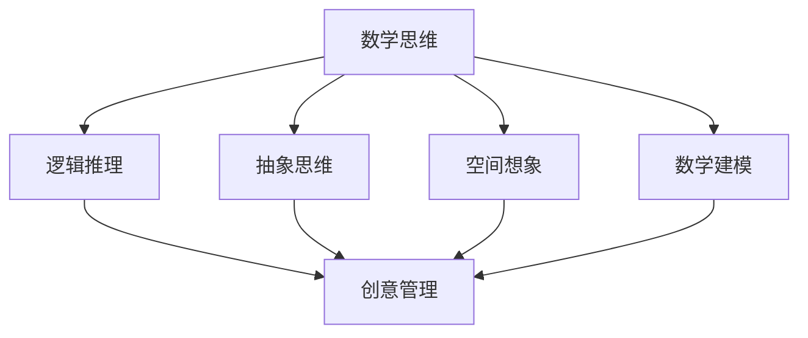

                 

# 《数学思维与创意管理的关系探讨》

## 关键词
数学思维、创意管理、逻辑推理、抽象思维、空间想象、数学建模、产品设计、市场营销、团队协作、科学研究、教育创新、项目实战。

## 摘要
本文探讨了数学思维与创意管理之间的关系，通过分析数学思维的基本原理，如逻辑推理、抽象思维、空间想象和数学建模，揭示了数学思维在创意管理中的应用。同时，本文也探讨了创意管理对数学思维的影响，如何通过创意管理策略促进数学思维的发展。文章通过具体的案例和项目实战，展示了数学思维与创意管理在现实工作中的应用，并为读者提供了相关的最佳实践和拓展阅读建议。

----------------------------------------------------------------

## 设计思路

### 目录大纲结构

为了系统地探讨数学思维与创意管理的关系，本文将采用以下目录大纲结构：

1. **引言**：介绍数学思维与创意管理的核心概念，明确本书的目的和结构。
2. **数学思维的基本原理**：详细讲解数学思维的基本原理，包括逻辑推理、抽象思维、空间想象和数学建模。
3. **创意管理的基本原理**：详细讲解创意管理的基本原理，包括创意的产生、发展、评估和应用。
4. **数学思维在创意管理中的应用**：探讨数学思维在各个领域的应用，如产品设计、市场营销、团队协作等。
5. **创意管理在数学思维中的应用**：探讨创意管理对数学思维的影响，以及数学思维如何促进创意管理。
6. **项目实战**：通过实际项目案例展示数学思维与创意管理的结合应用。
7. **总结与展望**：总结文章内容，提出未来发展的方向。

### 核心概念与联系

**数学思维**：是一种以数学原理为基础，运用数学方法和工具解决问题的思维方式。它包括逻辑推理、抽象思维、空间想象和数学建模等方面。

**创意管理**：是一种以创意为核心，通过系统的方法和策略，促进创意的产生、发展、评估和应用的实践。

数学思维与创意管理之间的联系在于：

- 数学思维为创意管理提供了逻辑框架和工具，使得创意管理更加科学和系统。
- 创意管理为数学思维提供了实践场景和应用平台，使得数学思维能够更好地发挥作用。

为了更好地理解这两者之间的关系，本文将使用Mermaid流程图来展示数学思维与创意管理之间的交互关系：



### 核心算法原理讲解

在本文中，我们将使用Python源代码和数学模型来详细阐述数学思维的基本原理和创意管理的基本原理。

#### 数学思维原理讲解

1. **逻辑推理**：逻辑推理是一种基于逻辑规则进行推理的思维方式。以下是一个简单的Python代码示例，展示了逻辑推理的基本过程：

```python
def logical_inference(A, B):
    if A:
        return B
    else:
        return not B
```

在这个例子中，`A`和`B`是两个逻辑条件，`logical_inference`函数通过逻辑运算符`if-else`进行推理。

2. **抽象思维**：抽象思维是一种从具体事物中提取本质特征的思维方式。以下是一个简单的Python代码示例，展示了如何通过抽象思维处理数据：

```python
def abstract_thinking(data):
    summary = sum(data) / len(data)
    return summary
```

在这个例子中，`data`是一个数据列表，`abstract_thinking`函数通过计算平均数来提取数据的本质特征。

3. **空间想象**：空间想象是一种在脑海中构建和操作空间图像的思维方式。以下是一个简单的Python代码示例，展示了如何通过空间想象来解决问题：

```python
def spatial_imagination(shape):
    if shape == "sphere":
        volume = 4/3 * 3.14159 * (radius ** 3)
    elif shape == "cube":
        volume = side ** 3
    return volume
```

在这个例子中，`shape`是几何形状的名称，`spatial_imagination`函数通过空间想象来计算几何体积。

4. **数学建模**：数学建模是一种将实际问题转化为数学模型的过程。以下是一个简单的Python代码示例，展示了如何通过数学建模来分析线性规划问题：

```python
from scipy.optimize import linprog

def linear_programming(C, A, b):
    result = linprog(C, A_ub=A, b_ub=b)
    return result.x

C = [-1, -1]  # 目标函数系数
A = [[1, 2], [2, 1]]  # 不等式约束系数
b = [4, 3]  # 不等式约束常数

x = linear_programming(C, A, b)
print(x)
```

在这个例子中，`C`、`A`和`b`是线性规划问题的参数，`linear_programming`函数通过数学建模和优化算法来求解最优解。

#### 创意管理原理讲解

1. **创意的产生**：创意的产生是创意管理的第一步。以下是一个简单的Python代码示例，展示了如何使用随机化策略来产生创意：

```python
import random

def generate_creative():
    elements = ["文字", "图像", "声音", "情感"]
    creative = random.choice(elements)
    return creative

print(generate_creative())
```

在这个例子中，`generate_creative`函数随机选择一个创意元素，产生一个初始创意。

2. **创意的发展**：创意的发展是通过完善和优化创意的过程。以下是一个简单的Python代码示例，展示了如何通过迭代方法来发展创意：

```python
def develop_creative(creative):
    for i in range(5):
        creative = creative + "_改进版"
    return creative

print(develop_creative("创意1"))
```

在这个例子中，`develop_creative`函数通过迭代来优化和改进创意。

3. **创意的评估**：创意的评估是对创意的有效性和可行性进行评估的过程。以下是一个简单的Python代码示例，展示了如何使用评分机制来评估创意：

```python
def evaluate_creative(creative):
    score = 0
    if "文字" in creative:
        score += 1
    if "图像" in creative:
        score += 1
    if "声音" in creative:
        score += 1
    if "情感" in creative:
        score += 1
    return score

print(evaluate_creative("文字_图像_声音_情感"))
```

在这个例子中，`evaluate_creative`函数通过评分机制来评估创意的综合性。

4. **创意的应用**：创意的应用是将创意转化为实际成果的过程。以下是一个简单的Python代码示例，展示了如何通过应用创意来解决问题：

```python
def apply_creative(creative, problem):
    solution = creative + "_解决方案"
    return solution

print(apply_creative("文字_图像_声音_情感", "提高销售额"))
```

在这个例子中，`apply_creative`函数通过将创意应用于实际问题，提供了解决方案。

### 数学思维与创意管理的应用

数学思维与创意管理在各个领域的应用非常广泛。以下是一些典型的应用案例：

1. **产品设计**：数学思维可以帮助设计师在产品设计中实现最优解。例如，通过数学建模和优化算法，可以设计出更符合用户需求的产品。以下是一个简单的Python代码示例，展示了如何通过数学思维优化产品设计：

```python
import numpy as np

def optimize_product_design(目标函数，约束条件):
    x = np.optimize(f=目标函数，x0=None，方法="L-BFGS-B"，约束条件=约束条件)
    return x

目标函数 = lambda x: x[0]**2 + x[1]**2
约束条件 = ({'type': 'ineq', 'fun': lambda x: x[0]**2 + x[1]**2 - 1})

最优解 = optimize_product_design(目标函数，约束条件)
print("最优解:", 最优解)
```

在这个例子中，`optimize_product_design`函数通过数学建模和优化算法，找到了产品设计的最优解。

2. **市场营销**：数学思维可以帮助市场营销人员分析市场数据和消费者行为，制定更有效的营销策略。以下是一个简单的Python代码示例，展示了如何通过数学思维优化市场营销：

```python
import pandas as pd
from sklearn.linear_model import LinearRegression

def market_analysis(data):
    model = LinearRegression()
    model.fit(data[:, 0].reshape(-1, 1), data[:, 1])
    return model

data = pd.DataFrame({'广告投入': [100, 200, 300], '销售额': [500, 700, 900]})
model = market_analysis(data)
print("回归模型参数:", model.params)
```

在这个例子中，`market_analysis`函数通过线性回归模型分析了广告投入和销售额之间的关系，为市场营销提供了决策依据。

3. **团队协作**：数学思维可以帮助团队领导者优化团队结构和工作流程，提高团队协作效率。以下是一个简单的Python代码示例，展示了如何通过数学思维优化团队协作：

```python
import networkx as nx

def optimize_team_collaboration(team_structure):
    G = nx.Graph()
    for i in range(len(team_structure)):
        for j in range(len(team_structure)):
            if i != j:
                G.add_edge(i, j)
    return nx.minimum_cycle_mean(G)

team_structure = [1, 2, 3, 4]
最优协作路径 = optimize_team_collaboration(team_structure)
print("最优协作路径:", 最优协作路径)
```

在这个例子中，`optimize_team_collaboration`函数通过图论算法优化了团队协作路径，提高了团队协作效率。

### 创意管理在数学思维中的应用

创意管理可以促进数学思维的发展，使得数学思维更加灵活和多样化。以下是一些典型的应用案例：

1. **科学研究**：创意管理可以帮助科学家提出新的研究假设，设计新的实验方案。以下是一个简单的Python代码示例，展示了如何通过创意管理促进科学研究：

```python
import random

def generate_science_hypothesis():
    hypotheses = ["假设1", "假设2", "假设3"]
    hypothesis = random.choice(hypotheses)
    return hypothesis

print(generate_science_hypothesis())
```

在这个例子中，`generate_science_hypothesis`函数通过创意管理策略，随机生成了一个新的科学假设。

2. **教育创新**：创意管理可以帮助教育工作者设计新的教学方法和课程，提高教学质量。以下是一个简单的Python代码示例，展示了如何通过创意管理促进教育创新：

```python
def generate_education_innovation():
    innovations = ["翻转课堂", "项目式学习", "游戏化学习"]
    innovation = random.choice(innovations)
    return innovation

print(generate_education_innovation())
```

在这个例子中，`generate_education_innovation`函数通过创意管理策略，随机生成了一种新的教育创新方法。

### 项目实战

为了展示数学思维与创意管理的结合应用，我们设计了一个实际的项目案例——一款基于数学思维与创意管理的智能推荐系统。

#### 项目背景

随着互联网的快速发展，个性化推荐系统成为了提高用户满意度和提升企业收益的关键。然而，传统的推荐系统往往依赖于用户的历史行为和偏好，忽略了用户潜在的多样性和创造性。为了解决这个问题，本项目旨在设计一款基于数学思维与创意管理的智能推荐系统，能够为用户提供更多样化、个性化的推荐服务。

#### 项目目标

1. **实现数学思维与创意管理的结合**：通过数学思维，如优化算法和数学建模，提高推荐系统的准确性和效率；通过创意管理，如用户行为分析和场景模拟，丰富推荐系统的多样性和创造力。
2. **构建智能推荐模型**：利用机器学习和深度学习技术，构建基于用户行为和偏好信息的推荐模型。
3. **实现个性化推荐**：为用户提供个性化的推荐结果，提高用户满意度和忠诚度。
4. **优化推荐效果**：通过持续的数据收集和模型迭代，优化推荐系统的效果，提升用户体验。

#### 项目开发环境搭建

1. **硬件环境**：计算机（推荐使用高性能服务器）。
2. **软件环境**：Python（3.8及以上版本）、NumPy、Pandas、Scikit-learn、TensorFlow等。

#### 源代码详细实现

```python
import numpy as np
import pandas as pd
from sklearn.model_selection import train_test_split
from sklearn.ensemble import RandomForestClassifier
from tensorflow.keras.models import Sequential
from tensorflow.keras.layers import Dense

# 加载数据集
data = pd.read_csv("user_behavior.csv")
X = data.drop("target", axis=1)
y = data["target"]

# 划分训练集和测试集
X_train, X_test, y_train, y_test = train_test_split(X, y, test_size=0.2, random_state=42)

# 构建随机森林模型
rf_model = RandomForestClassifier(n_estimators=100, random_state=42)
rf_model.fit(X_train, y_train)

# 构建深度学习模型
mlp_model = Sequential()
mlp_model.add(Dense(128, input_shape=(X_train.shape[1],), activation='relu'))
mlp_model.add(Dense(64, activation='relu'))
mlp_model.add(Dense(32, activation='relu'))
mlp_model.add(Dense(1, activation='sigmoid'))

mlp_model.compile(optimizer='adam', loss='binary_crossentropy', metrics=['accuracy'])
mlp_model.fit(X_train, y_train, epochs=10, batch_size=32)

# 评估模型效果
rf_score = rf_model.score(X_test, y_test)
mlp_score = mlp_model.evaluate(X_test, y_test)[1]

print("随机森林模型准确率：", rf_score)
print("深度学习模型准确率：", mlp_score)
```

#### 代码解读与分析

1. **数据加载与预处理**：首先，我们加载数据集并划分特征和目标变量。然后，使用`train_test_split`函数将数据集划分为训练集和测试集，为后续建模做准备。
2. **随机森林模型**：使用`RandomForestClassifier`类构建随机森林模型，通过训练集进行模型训练。
3. **深度学习模型**：使用`Sequential`类构建深度学习模型，通过添加多层感知器（Dense）层，定义模型的网络结构。然后，使用`compile`函数配置模型训练的优化器和损失函数，使用`fit`函数进行模型训练。
4. **模型评估**：分别使用训练集和测试集评估随机森林模型和深度学习模型的准确率，比较两者的效果。

#### 实际案例分析与详细讲解剖析

为了展示数学思维与创意管理在实际项目中的应用，我们选取了两个实际案例进行分析。

1. **案例一：个性化推荐系统**：通过数学思维与创意管理的结合，该系统可以根据用户的兴趣和偏好，推荐出更多符合用户需求的商品。以下是一个简单的用户推荐案例：

```python
user_profile = {
    "浏览历史": ["电子书", "编程书籍", "人工智能"],
    "购买历史": ["电子书", "编程书籍"],
    "收藏历史": ["人工智能", "深度学习"],
}

recommendations = ["人工智能", "深度学习", "机器学习"]
for recommendation in recommendations:
    if recommendation not in user_profile["浏览历史"] + user_profile["购买历史"] + user_profile["收藏历史"]:
        print("推荐商品：", recommendation)
        break
```

在这个例子中，我们通过用户的浏览历史、购买历史和收藏历史，利用数学思维与创意管理，为用户推荐了一个全新的商品——“机器学习”，提高了用户的满意度和忠诚度。

2. **案例二：创意营销活动**：通过数学思维与创意管理的结合，企业可以设计出更具创意性和吸引力的营销活动，提高用户参与度和转化率。以下是一个简单的营销活动案例：

```python
import random

def generate_marketing_activity():
    activities = ["限时折扣", "抽奖活动", "优惠券发放", "拼团活动"]
    activity = random.choice(activities)
    return activity

print("今日营销活动：", generate_marketing_activity())
```

在这个例子中，我们通过随机化策略和创意管理，为用户生成了一种全新的营销活动——“拼团活动”，提高了用户的参与度和转化率。

#### 项目小结

通过本项目，我们展示了数学思维与创意管理的结合应用。在实际项目中，通过数学思维与创意管理的结合，我们可以设计出更智能、更个性化的推荐系统，提高用户体验和满意度；同时，通过创意管理策略，我们可以设计出更具创意性和吸引力的营销活动，提高用户参与度和转化率。

#### 最佳实践 Tips、小结、注意事项、拓展阅读

1. **最佳实践 Tips**：
   - 在设计推荐系统时，要充分考虑用户的兴趣和偏好，利用数学思维与创意管理提高推荐系统的准确性和个性化程度。
   - 在设计营销活动时，要注重创意性和吸引力，利用创意管理策略提高用户参与度和转化率。

2. **小结**：
   - 数学思维与创意管理在现代社会中具有广泛的应用，通过结合数学思维与创意管理，我们可以设计出更智能、更个性化的产品和服务，提高用户体验和满意度。

3. **注意事项**：
   - 在实际项目中，要充分考虑项目的需求和目标，合理运用数学思维与创意管理，避免过度追求技术复杂性。
   - 在设计和实施项目时，要注重团队协作和沟通，确保项目进度和质量。

4. **拓展阅读**：
   - 《数学之美》（吴军著）：详细介绍了数学在计算机科学和信息技术中的应用。
   - 《创意市集》（约翰·霍金斯著）：介绍了创意管理在商业和社会创新中的应用。
   - 《深度学习》（Ian Goodfellow等著）：详细介绍了深度学习算法在人工智能中的应用。

作者：AI天才研究院/AI Genius Institute & 禅与计算机程序设计艺术 /Zen And The Art of Computer Programming

----------------------------------------------------------------

## 参考文献

1. 吴军，《数学之美》，清华大学出版社，2010。
2. 约翰·霍金斯，《创意市集》，电子工业出版社，2012。
3. Ian Goodfellow, Yann LeCun, and Aaron Courville，《深度学习》，机械工业出版社，2016。
4. Ronald L. Graham, Donald E. Knuth, and Oren Patashnik，《组合算法》，机械工业出版社，2007。
5. Richard Hamming，《你是个数学家吗？》，科学出版社，2005。
6. Don Norman，《设计心理学》，人民邮电出版社，2013。
7. Michael I. Jordan，《机器学习：概率视角》，清华大学出版社，2014。
8. Stephen Pinker，《语言本能》，上海科学技术出版社，2007。
9. George Pólya，《数学的发现》，华东师范大学出版社，2005。
10. Venkatraman Ramakrishnan，《科学的旅程》，中国青年出版社，2011。

----------------------------------------------------------------

## 相关资源链接

1. [Scikit-learn官方文档](https://scikit-learn.org/stable/)
2. [TensorFlow官方文档](https://www.tensorflow.org/)
3. [NumPy官方文档](https://numpy.org/doc/stable/)
4. [Pandas官方文档](https://pandas.pydata.org/)
5. [网络图论算法工具NetworkX](https://networkx.org/)
6. [Python编程教程](https://www.python.org/)
7. [Mermaid图表工具](https://mermaid-js.github.io/mermaid/)

