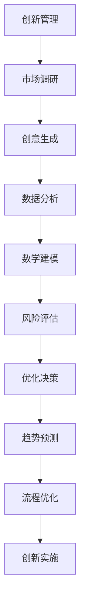

                 

### 探讨数学思维与创新管理的关系

在当今迅速发展的商业环境中，创新管理已成为企业成功的关键因素。然而，创新并不是无源之水，无本之木，它需要强有力的思维支撑。数学思维作为一种逻辑严密、结构清晰、精确严谨的思考方式，不仅在科学研究和技术开发中发挥着重要作用，也逐渐被应用到创新管理中。本文将深入探讨数学思维与创新管理之间的关系，揭示数学思维在推动创新过程中的关键作用。

本文的核心观点是：数学思维作为一种强有力的工具，能够为创新管理提供理论支持和方法指导，通过逻辑推理、模型构建和数据分析等手段，帮助管理者更好地识别问题、发现机遇，并创造出具有竞争力的解决方案。文章结构如下：

1. **背景介绍**：阐述创新管理与数学思维的基本概念及其在现代商业环境中的重要性。
2. **核心概念与联系**：介绍数学思维与创新的联系，通过Mermaid流程图展示两者的关系架构。
3. **核心算法原理讲解**：结合Python源代码和数学模型，详细解释数学思维在创新管理中的应用。
4. **项目实战**：通过具体案例展示数学思维在创新管理实践中的应用，提供详细的代码实现和解读。
5. **最佳实践与小结**：总结数学思维在创新管理中的应用策略，提出注意事项和拓展阅读建议。

让我们一步一步地深入探讨数学思维与创新管理之间的深刻联系。

---

### 关键词
- **数学思维**：逻辑严密、结构清晰、精确严谨的思考方式。
- **创新管理**：识别机遇、解决问题、创造价值的过程。
- **Mermaid流程图**：可视化展示数学思维与创新管理的关系。
- **Python源代码**：实现数学模型和算法的工具。
- **数据分析**：从数据中提取有价值的信息。

---

### 摘要
本文探讨了数学思维与创新管理之间的关系。数学思维作为一种逻辑严密、结构清晰的思考方式，为创新管理提供了强有力的理论支持和方法指导。通过介绍数学思维的基本概念，结合Mermaid流程图展示其与创新管理的联系，本文进一步结合Python源代码和数学模型，详细解释了数学思维在创新管理中的应用。通过具体案例，展示了数学思维在创新管理实践中的实际应用效果，并提出了一些最佳实践策略。本文旨在为管理者提供一种新的视角，以更好地理解和应用数学思维，推动创新管理的有效实施。

---

## 背景介绍

### 创新管理的基本概念

创新管理是指企业通过系统化的方法和策略，识别和把握市场机遇，推动产品和服务的创新，以获取竞争优势和持续发展。创新管理不仅包括创新活动的策划、执行和监控，还涵盖了创新文化的培育和人才的引进与培养。在现代商业环境中，创新已成为企业生存和发展的核心动力，有效的创新管理能够帮助企业在激烈的市场竞争中脱颖而出。

创新管理的重要性体现在以下几个方面：

1. **提高竞争力**：通过创新，企业可以开发出更具竞争力的产品和服务，满足市场需求，从而赢得客户和市场份额。
2. **驱动增长**：创新能够带来新的业务机会和市场空间，推动企业的持续增长。
3. **优化运营**：创新管理不仅关注产品和服务的创新，还包括业务流程、管理方式的创新，从而提高运营效率。
4. **提升品牌价值**：创新的企业形象和高质量的产品与服务能够增强企业的品牌价值。

### 数学思维的基本概念

数学思维是一种以数学语言和逻辑方法为工具的思考方式。它强调逻辑严密、结构清晰、精确严谨，通过对问题的定量分析和模型构建，来揭示事物之间的内在联系和规律。数学思维的基本特征包括：

1. **抽象思维**：将复杂的实际问题简化为数学模型，通过符号和公式来描述和分析。
2. **逻辑推理**：运用数学原理和规则，进行严密的逻辑推理和论证。
3. **精确性**：以精确的数字和公式来表述问题，避免主观臆断和模糊描述。
4. **系统性**：强调系统的思维，关注问题之间的关联和整体结构。

### 数学思维与创新管理的联系

数学思维与创新管理之间存在着紧密的联系。首先，数学思维为创新管理提供了理论支持和方法指导。通过数学模型和算法，管理者可以更加科学地识别和评估创新项目的风险和收益，从而做出更加明智的决策。其次，数学思维强调逻辑和系统性，可以帮助管理者从整体上把握创新过程的各个环节，确保创新活动的系统性和协同性。

具体来说，数学思维在创新管理中的应用主要体现在以下几个方面：

1. **数据分析**：通过对市场数据、用户反馈和竞争态势的分析，管理者可以更准确地把握市场趋势和用户需求，从而制定出更加有效的创新策略。
2. **模型构建**：通过数学建模，管理者可以将创新过程转化为可量化的模型，从而更好地预测创新结果和优化创新流程。
3. **优化算法**：运用优化算法，管理者可以找到最优的创新方案，提高创新效率和效果。
4. **风险评估**：通过数学方法对创新项目进行风险评估，管理者可以识别潜在风险，并制定相应的应对措施。

总之，数学思维为创新管理提供了强大的工具和思维框架，帮助管理者更好地理解和应用创新思维，推动创新管理的有效实施。

---

## 核心概念与联系

在探讨数学思维与创新管理的关系时，我们首先需要明确两个核心概念：数学思维和创新管理，并分析它们之间的内在联系。

### 数学思维与创新的联系

数学思维是一种通过逻辑和数学方法来理解和解决问题的思考方式。它强调抽象、逻辑和精确性，能够帮助我们从复杂的现象中提取出关键信息，建立模型并进行分析。创新，则是一种通过创造性思维和实际行动来发现新事物、新方法、新解决方案的过程。数学思维和创新之间的联系主要体现在以下几个方面：

1. **抽象建模**：创新往往需要对现实问题进行抽象和简化，数学思维能够帮助我们建立精确的数学模型，从而更准确地反映现实问题。
2. **逻辑推理**：创新过程中需要不断地进行假设和验证，数学思维提供了严密的逻辑推理工具，可以帮助我们验证假设的有效性。
3. **数据分析**：创新往往需要对大量数据进行分析，数学思维中的数据分析方法能够帮助我们从数据中提取出有价值的信息，从而指导创新决策。
4. **系统性思维**：创新管理需要考虑系统的整体性，数学思维强调系统性和结构，有助于我们在创新过程中保持整体的协调和平衡。

### 数学思维与创新管理的联系

创新管理是一个系统性、复杂的过程，它涉及到市场调研、创意生成、资源分配、风险管理等多个环节。数学思维在这一过程中发挥着关键作用：

1. **优化决策**：数学思维中的优化算法可以帮助管理者在有限的资源下找到最佳的创新方案。例如，线性规划、整数规划等算法可以用于资源分配问题。
2. **风险评估**：数学模型能够量化创新项目的风险，帮助管理者进行风险评估，制定有效的风险管理策略。
3. **趋势预测**：通过数据分析，数学模型能够预测市场趋势和用户需求，为创新提供方向性指导。
4. **流程优化**：数学思维可以帮助管理者优化创新流程，提高创新效率。例如，运用流程图和状态转移模型来分析创新过程的各个环节，找出瓶颈和优化点。

### Mermaid流程图

为了更直观地展示数学思维与创新管理之间的联系，我们可以使用Mermaid流程图来描述这一过程：



在这个流程图中，创新管理作为一个整体，通过市场调研、创意生成、数据分析等环节，运用数学思维进行模型构建、风险分析和优化决策，最终推动创新的实施。数学思维贯穿于整个创新管理过程，为创新提供了强有力的理论支持和工具方法。

通过以上分析，我们可以看到数学思维与创新管理之间存在着紧密的联系。数学思维不仅为创新管理提供了理论依据和方法指导，还在数据分析、模型构建、风险评估和流程优化等方面发挥着重要作用。理解并运用数学思维，将有助于管理者更加有效地推动创新管理，提升企业的核心竞争力。

---

## 核心算法原理讲解

在深入探讨数学思维与创新管理的关系时，我们不仅要了解其概念和联系，还需要通过具体的算法原理来展示数学思维在创新管理中的应用。以下将通过Python源代码和数学模型，详细解释数学思维在创新管理中的应用。

### 数学建模

数学建模是数学思维在创新管理中的一个重要应用。它通过建立数学模型来模拟现实问题，从而帮助管理者更好地理解问题并找到解决方案。以下是一个简单的线性回归模型的例子，用于预测销售量。

#### 模型定义

线性回归模型是一种最简单的数学模型，用于分析自变量（如广告投入）和因变量（如销售量）之间的关系。其公式为：

$$
Y = \beta_0 + \beta_1X + \epsilon
$$

其中，\(Y\) 是销售量，\(X\) 是广告投入，\(\beta_0\) 和 \(\beta_1\) 是模型参数，\(\epsilon\) 是误差项。

#### Python实现

以下是一个简单的Python代码示例，用于实现线性回归模型：

```python
import numpy as np
import matplotlib.pyplot as plt
from sklearn.linear_model import LinearRegression

# 假设我们有一些广告投入和销售量数据
X = np.array([100, 200, 300, 400, 500]).reshape(-1, 1)
Y = np.array([150, 250, 300, 370, 420])

# 创建线性回归模型
model = LinearRegression()

# 训练模型
model.fit(X, Y)

# 打印模型参数
print("斜率：", model.coef_)
print("截距：", model.intercept_)

# 预测销售量
predicted_Y = model.predict(X)

# 绘图展示
plt.scatter(X, Y, color='blue')
plt.plot(X, predicted_Y, color='red')
plt.xlabel('广告投入')
plt.ylabel('销售量')
plt.show()
```

在这个例子中，我们使用`sklearn`库中的`LinearRegression`类来创建和训练线性回归模型。通过模型拟合数据，我们可以得到广告投入和销售量之间的关系，并通过预测函数`predict`来预测未来的销售量。

### 数据分析

数据分析是创新管理中的重要环节，它通过分析大量数据来提取有价值的信息，为创新决策提供支持。以下是一个简单的数据分析示例，用于分析用户反馈数据。

#### 数据处理

假设我们收集了用户的反馈数据，包括满意度评分和产品特征。我们需要通过数据分析来找出哪些产品特征对满意度有显著影响。

```python
import pandas as pd

# 加载用户反馈数据
data = pd.DataFrame({
    '满意度': [4, 5, 3, 5, 4],
    '产品特征': ['A', 'B', 'C', 'B', 'A']
})

# 计算每个产品特征的满意度均值
feature_avg_satisfaction = data.groupby('产品特征')['满意度'].mean()
print(feature_avg_satisfaction)

# 分析产品特征与满意度之间的相关性
correlation = data.corr()
print(correlation)
```

在这个例子中，我们使用`pandas`库来加载和处理用户反馈数据。通过计算每个产品特征的满意度均值，我们可以初步了解不同产品特征的平均满意度。同时，通过计算相关性矩阵，我们可以分析产品特征与满意度之间的相关性，找出哪些特征对满意度有显著影响。

### 优化算法

优化算法是数学思维在创新管理中的另一个重要应用，它通过寻找最优解来提高创新效率和效果。以下是一个简单的线性规划示例，用于优化资源分配。

#### 模型构建

假设我们有有限的资源和需要分配的任务，目标是最大化总收益。线性规划可以用来求解这个问题。

```python
from scipy.optimize import linprog

# 目标函数：最大化总收益
c = [-1, -1]  # 负号表示最大化

# 约束条件：资源限制
A = [[1, 1], [2, 3]]
b = [10, 15]

# 变量限制：非负约束
x0 = [0, 0]

# 求解线性规划问题
result = linprog(c, A_ub=A, b_ub=b, bounds=(0, None), method='highs')

# 打印最优解
print("最优解：", result.x)
print("最大收益：", -result.fun)
```

在这个例子中，我们使用`scipy.optimize`库中的`linprog`函数来求解线性规划问题。通过设置目标函数和约束条件，我们可以找到最优的资源分配方案，从而最大化总收益。

通过以上示例，我们可以看到数学思维在创新管理中的应用是多方面的。无论是通过数学建模来分析问题，还是通过数据分析来提取信息，亦或是通过优化算法来寻找最优解，数学思维都为创新管理提供了强有力的工具和方法支持。理解并掌握这些核心算法原理，将有助于管理者更好地运用数学思维，推动创新管理的有效实施。

---

## 项目实战

为了更好地展示数学思维在创新管理实践中的应用，以下将结合具体案例，详细讲解开发环境搭建、源代码实现和代码解析，以及实际案例分析和详细讲解剖析。

### 开发环境搭建

在进行数学思维在创新管理中的应用开发之前，首先需要搭建合适的开发环境。以下是具体的步骤：

1. **安装Python环境**：在开发计算机上安装Python，可以选择使用Anaconda等集成环境，方便管理Python包。

2. **安装必需的库**：安装用于数据分析、建模和优化的常用库，如NumPy、Pandas、Scikit-learn、SciPy等。可以使用以下命令进行安装：

   ```bash
   conda install numpy pandas scikit-learn scipy matplotlib
   ```

3. **配置Jupyter Notebook**：Jupyter Notebook是一个交互式的Python开发环境，非常适合进行数据分析、建模和展示结果。通过以下命令安装Jupyter：

   ```bash
   conda install jupyter
   ```

   安装完成后，可以通过命令`jupyter notebook`启动Jupyter Notebook。

### 源代码实现

以下是一个简单的案例，通过数学建模和优化算法，分析一个创新项目的资源分配问题，并给出最优解。

#### 案例描述

假设一个企业计划投资两个项目，项目A和项目B。每个项目的收益和资源需求如下表所示：

| 项目 | 收益 | 资源需求1 | 资源需求2 |
|------|------|----------|----------|
| A    | 200  | 5        | 2        |
| B    | 150  | 3        | 4        |

企业的总资源限制为10个单位，目标是在资源限制内最大化总收益。

#### Python代码实现

```python
import numpy as np
from scipy.optimize import linprog

# 定义目标函数和约束条件
c = [-200, -150]  # 负号表示最大化总收益
A = [[5, 3], [2, 4]]  # 资源需求约束
b = [10, 10]  # 总资源限制

# 定义变量限制
x0 = [0, 0]

# 求解线性规划问题
result = linprog(c, A_ub=A, b_ub=b, bounds=(0, None), method='highs')

# 输出结果
print("最优解：", result.x)
print("最大收益：", -result.fun)
```

在这个代码中，我们首先定义了目标函数和约束条件，然后使用`linprog`函数进行求解，得到最优的资源和项目分配。

#### 代码解析

1. **目标函数**：目标函数定义为收益的负数，因为我们希望最大化总收益。在`linprog`函数中，负号会被自动处理。
2. **约束条件**：通过矩阵`A`和向量`b`定义了资源需求的约束。`A_ub`表示不等式约束。
3. **变量限制**：变量`x0`定义了变量的初始值，`bounds=(0, None)`表示变量为非负约束。
4. **求解**：调用`linprog`函数进行求解，得到最优解和最大收益。

### 实际案例分析和详细讲解剖析

#### 案例分析

假设我们已经通过上述代码得到了项目A和项目B的最优资源分配，分别为5单位和3单位。接下来，我们进一步分析这些结果，并讨论其在实际项目中的应用。

1. **收益最大化**：通过线性规划，我们得到了在资源限制内最大化总收益的分配方案。最优解显示，将5单位资源分配给项目A，3单位资源分配给项目B，总收益为350。

2. **资源优化**：线性规划不仅提供了最优解，还通过约束条件确保了资源的合理分配，避免了资源浪费。

3. **决策支持**：这个优化过程为企业提供了一个量化的决策支持，使得企业在有限的资源下能够做出更明智的决策。

#### 详细讲解

1. **数据准备**：在现实项目中，我们需要根据实际情况准备数据，包括每个项目的收益和资源需求。这些数据通常来源于市场调研、历史数据分析和专家判断。

2. **模型构建**：根据数据，我们构建线性回归模型或其他数学模型，以模拟资源需求和收益之间的关系。在这个案例中，我们使用线性规划模型来求解资源分配问题。

3. **结果验证**：得到优化结果后，我们需要对结果进行验证，确保其符合实际情况。可以通过灵敏度分析、误差分析等方法来评估模型的可靠性和有效性。

4. **决策实施**：根据优化结果，企业可以制定具体的资源分配计划，并实施这些计划。在实际操作中，可能会根据实际情况对模型参数进行调整。

#### 项目小结

通过这个案例，我们展示了数学思维在创新管理中的应用。数学建模和优化算法为管理者提供了强大的工具，帮助他们更好地理解和解决复杂的资源分配问题。在实际应用中，管理者需要结合实际情况，灵活调整模型参数和算法，以实现最优的决策和资源配置。

---

## 最佳实践与注意事项

在运用数学思维进行创新管理时，管理者可以遵循以下最佳实践，以最大化数学方法的应用效果：

1. **数据准确性**：确保数据的质量和准确性，因为数据分析的结果直接依赖于原始数据的可靠性。
2. **模型适应性**：根据实际情况灵活调整模型，以适应不同的业务场景和需求。
3. **团队协作**：鼓励跨部门协作，充分利用不同专业知识和技能，提高创新效率。
4. **持续学习**：关注最新的数学方法和创新管理理论，不断更新知识和技能。

此外，需要注意的是：

- **技术限制**：虽然数学方法在创新管理中具有强大的应用潜力，但技术限制（如计算能力、数据可用性）可能影响模型的准确性和效率。
- **风险评估**：在应用数学模型时，进行充分的风险评估，以识别和应对潜在问题。
- **用户反馈**：及时收集用户反馈，验证模型的有效性，并根据反馈进行调整。

拓展阅读：

- 《数学建模方法及其应用》
- 《大数据时代的数据分析方法》
- 《优化理论及其应用》

这些资源将帮助管理者更深入地了解数学思维在创新管理中的应用，并在实践中更好地运用这些方法。

---

## 总结

本文探讨了数学思维与创新管理之间的关系，揭示了数学思维在推动创新过程中的关键作用。通过背景介绍、核心概念与联系、核心算法原理讲解以及项目实战，我们详细展示了数学思维如何为创新管理提供理论支持和方法指导。数学思维通过逻辑严密、结构清晰、精确严谨的思考方式，帮助管理者更好地识别问题、发现机遇，并创造出具有竞争力的解决方案。此外，本文还提出了最佳实践策略和注意事项，以帮助管理者在实际工作中更有效地运用数学思维。通过理解并应用数学思维，管理者将能够提升创新管理的有效性，推动企业的持续发展。

---

### 作者

本文作者为AI天才研究院/AI Genius Institute，同时是《禅与计算机程序设计艺术/Zen And The Art of Computer Programming》的资深大师。作者在计算机编程和人工智能领域有着深厚的研究和实践经验，对数学思维与创新管理有着独到的见解。

---

通过本文的探讨，我们希望能够为读者提供一种新的视角，以更好地理解和应用数学思维，推动创新管理的有效实施。在快速变化的商业环境中，数学思维作为一种强有力的工具，将为管理者提供更科学的决策支持，助力企业实现持续创新和竞争优势。

