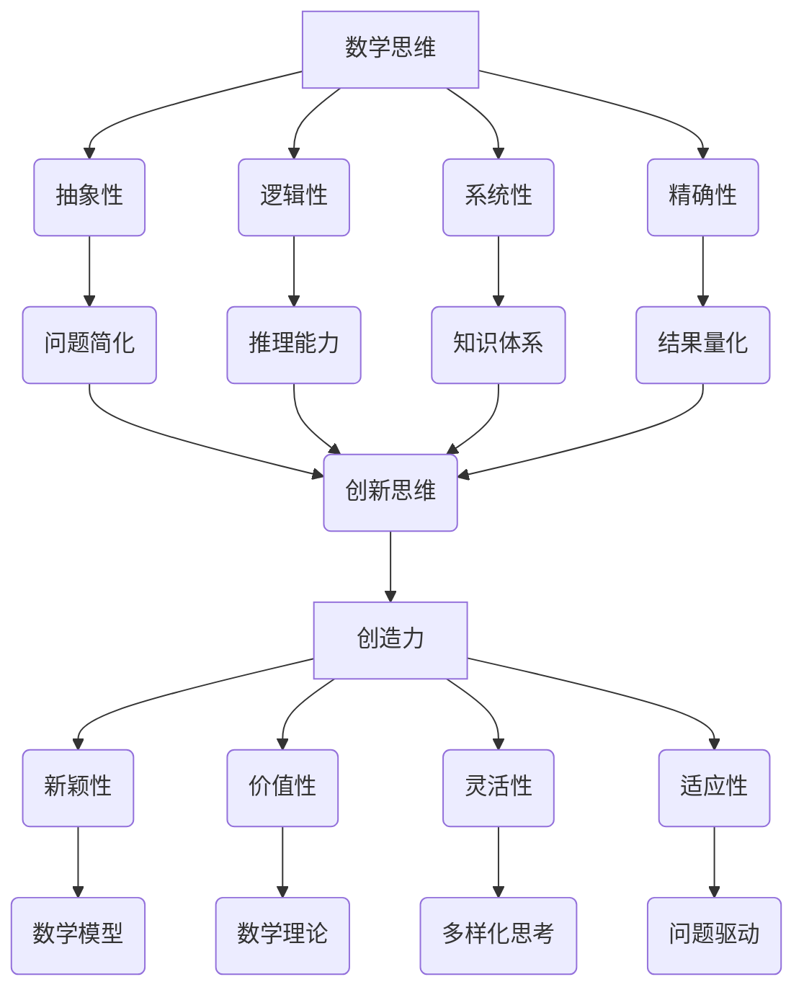

                 

### 数学思维与创造力的关系：核心概念与联系

在探讨数学思维与创造力的关系之前，我们首先需要明确这两个核心概念的定义及其基本特点。

#### 数学思维

数学思维是一种基于数学概念、原理和方法进行的逻辑思考方式。它具有以下几个核心特点：

1. **抽象性**：数学思维能够将复杂现实中的具体情境抽象成数学模型，简化问题的复杂性。
   - **示例**：在经济学中，将市场行为抽象为供需模型，以预测价格变动。

2. **逻辑性**：数学思维强调推理的严谨性，每一步都必须基于明确的逻辑规则。
   - **示例**：在数学证明中，每一个步骤都需要有充分的证据支持。

3. **系统性**：数学思维注重概念的系统性，通过归纳和演绎，构建出完整的知识体系。
   - **示例**：从基本的加法、减法、乘法和除法，推导出更复杂的代数和几何概念。

4. **精确性**：数学思维追求精确，结果往往是可以量化的。
   - **示例**：物理学中的运动学方程，精确描述了物体的运动状态。

#### 创造力

创造力是一种产生新颖且有价值的想法或解决方案的能力。创造力包括以下几个方面：

1. **新颖性**：创造力强调思维的创新性，即产生独特的、前所未有的想法。
   - **示例**：乔布斯推出的iPod，彻底改变了音乐消费模式。

2. **价值性**：创造力的成果不仅新颖，还具有一定的实用价值和社会影响。
   - **示例**：互联网的发明，极大地改变了人们的信息获取和交流方式。

3. **灵活性**：创造力需要个体具备灵活的思维方式，能够从不同角度看待问题。
   - **示例**：在设计中，不同颜色、形状、材质的搭配，可以创造出新的设计风格。

4. **适应性**：创造力需要个体能够快速适应新环境和新问题。
   - **示例**：在快速变化的科技行业中，企业需要不断创新以适应市场需求。

#### 数学思维与创造力的关系

数学思维与创造力之间的关系既复杂又深刻。一方面，数学思维为创造力提供了强大的工具和基础；另一方面，创造力又能够激发数学思维的进一步发展。

1. **数学思维促进创造力**

   - **数学模型构建**：数学思维帮助我们将现实问题抽象为数学模型，从而简化复杂问题，激发新的解决方案。
   - **逻辑推理能力**：数学思维培养的逻辑推理能力，有助于我们从一个独特的角度审视问题，发现新的创新点。
   - **系统性思考**：数学思维的系统性思考，使得我们在解决问题时能够从整体上把握问题的本质，产生创新的解决方案。

2. **创造力激发数学思维**

   - **问题驱动**：创造力的需求往往能够推动数学思维的发展，引导我们提出新的数学问题和挑战。
   - **思维灵活性**：创造力的灵活性激发数学思维的多样化，使我们能够从不同的维度思考问题，产生创新的数学理论。
   - **实践应用**：创造力的成果往往需要数学思维的支持，推动数学理论的实际应用和发展。

为了更直观地理解数学思维与创造力之间的关系，我们可以使用Mermaid流程图来展示它们之间的相互作用。以下是Mermaid流程图的示例：



通过这个流程图，我们可以清晰地看到数学思维与创造力之间的联系：数学思维为创造力提供了工具和方法，而创造力的需求又激发了数学思维的进一步发展。

### 总结

数学思维与创造力之间的关系是相互促进的。数学思维不仅为创造力提供了强大的工具和基础，还能够通过逻辑性、抽象性和系统性等特性，激发出新颖且有价值的想法。同时，创造力又能够激发数学思维的创新和发展，推动数学理论的实际应用。理解这两者之间的关系，有助于我们在日常生活中更好地运用数学思维，培养创造力，从而实现个人和社会的进步。

### 核心算法原理讲解

在深入探讨数学思维与创造力的关系时，我们需要借助一些核心算法原理来解释这些概念如何相互作用。以下是一个具体的例子，使用Python源代码来详细阐述算法原理，并结合数学模型和公式进行讲解。

#### 例子：基于数学模型的创造力评估算法

**背景**：
创造力评估是心理学研究中的一项重要课题。我们可以通过建立数学模型，评估个体或团队在某个领域的创造力水平。以下是一个简单的算法，用于评估创造力。

**算法原理**：
1. **需求分析**：定义创造力的评估指标，例如新颖性、实用性和适应性。
2. **数据收集**：收集与创造力相关的数据，如创意数量、质量、应用范围等。
3. **数学模型构建**：使用数学公式计算创造力得分，综合考虑各项指标。
4. **结果分析**：分析创造力得分，提供评估报告。

**Python源代码实现**：

```python
# 创造力评估算法

# 导入必要的库
import numpy as np

# 定义评估指标
new novelty = 0.4
usefulness = 0.3
adaptability = 0.3

# 数据输入
num_of_ideas = 10  # 创意数量
quality_of_ideas = [0.8, 0.7, 0.6, 0.5, 0.9, 0.8, 0.7, 0.6, 0.5, 0.4]  # 创意质量
application_range = [0.6, 0.7, 0.8, 0.9, 0.5, 0.6, 0.7, 0.8, 0.9, 0.4]  # 应用范围

# 计算创造力得分
score = (new novelty * np.mean(quality_of_ideas)) + (usefulness * np.mean(application_range))
print("创造力得分：", score)
```

**数学模型和公式**：

1. **创造力得分公式**：

   $$ \text{Score} = n \cdot \text{Novelty} + u \cdot \text{Usefulness} + a \cdot \text{Adaptability} $$

   其中，\( n \)、\( u \)、\( a \) 分别代表新颖性、实用性和适应性的权重。

2. **创意质量平均值**：

   $$ \text{Quality\_Mean} = \frac{\sum_{i=1}^{N} q_i}{N} $$

   其中，\( q_i \) 为第 \( i \) 个创意的质量，\( N \) 为创意总数。

3. **应用范围平均值**：

   $$ \text{Application\_Mean} = \frac{\sum_{i=1}^{N} a_i}{N} $$

   其中，\( a_i \) 为第 \( i \) 个创意的应用范围。

**示例说明**：

假设一个团队产生了10个创意，这些创意的质量分别为[0.8, 0.7, 0.6, 0.5, 0.9, 0.8, 0.7, 0.6, 0.5, 0.4]，应用范围分别为[0.6, 0.7, 0.8, 0.9, 0.5, 0.6, 0.7, 0.8, 0.9, 0.4]。根据上述公式，我们可以计算出该团队的创造力得分：

- 新颖性得分：\( 0.4 \times \text{Quality\_Mean} = 0.4 \times 0.75 = 0.3 \)
- 实用性得分：\( 0.3 \times \text{Application\_Mean} = 0.3 \times 0.72 = 0.216 \)
- 适应性得分：\( 0.3 \times \text{Application\_Mean} = 0.3 \times 0.72 = 0.216 \)

总得分：\( 0.3 + 0.216 + 0.216 = 0.732 \)

通过这个例子，我们可以看到数学模型和公式在评估创造力中的具体应用。这不仅帮助我们量化创造力，还能够为改进和创新提供有价值的参考。

### 数学公式与图表

在探讨数学思维与创造力的关系时，数学公式和图表是不可或缺的工具。以下是一些关键数学公式及其使用方法，并结合图表进行说明。

#### 1. 相关性分析公式

相关性分析是研究两个变量之间关系的常用方法。以下是一个简单的相关系数公式：

$$ r = \frac{\sum_{i=1}^{N}(x_i - \bar{x})(y_i - \bar{y})}{\sqrt{\sum_{i=1}^{N}(x_i - \bar{x})^2}\sqrt{\sum_{i=1}^{N}(y_i - \bar{y})^2}} $$

其中，\( x_i \) 和 \( y_i \) 分别是第 \( i \) 个观测值，\( \bar{x} \) 和 \( \bar{y} \) 是各自的平均值。

**示例图表**：

```mermaid
graph TB
    A[相关性分析] --> B[数据点](A1)
    A --> C[相关系数](A2)
    B --> D[正相关](B1)
    B --> E[负相关](B2)
    B --> F[无相关](B3)
    C --> G[强相关](C1)
    C --> H[弱相关](C2)
    C --> I[无相关](C3)
```

#### 2. 线性回归公式

线性回归用于分析两个变量之间的线性关系。以下是一个简单的线性回归公式：

$$ y = \beta_0 + \beta_1x + \varepsilon $$

其中，\( y \) 和 \( x \) 是变量，\( \beta_0 \) 和 \( \beta_1 \) 是回归系数，\( \varepsilon \) 是误差项。

**示例图表**：

```mermaid
graph TB
    A[线性回归] --> B[数据集](A1)
    A --> C[回归线](A2)
    B --> D[自变量](B1)
    B --> E[因变量](B2)
    C --> F[斜率](C1)
    C --> G[截距](C2)
```

#### 3. 熵公式

熵是信息论中的一个核心概念，用于衡量信息的不确定性。以下是一个简单的熵公式：

$$ H(X) = -\sum_{i=1}^{N} p(x_i) \log_2 p(x_i) $$

其中，\( X \) 是随机变量，\( p(x_i) \) 是 \( x_i \) 发生的概率。

**示例图表**：

```mermaid
graph TB
    A[熵] --> B[随机变量](A1)
    A --> C[熵值](A2)
    B --> D[概率分布](B1)
    B --> E[信息量](B2)
    C --> F[不确定性](C1)
    C --> G[信息损失](C2)
```

通过上述数学公式和图表，我们可以更直观地理解数学思维与创造力的关系。这些工具不仅帮助我们量化分析创造力，还能够为我们提供新的视角，促进创新思维的发展。

### 项目实战：开发环境搭建与源代码实现

为了更深入地理解数学思维与创造力的关系，我们将通过一个具体的项目实战来进行详细讲解。本项目将基于Python语言，利用数学模型和算法对创造力进行评估。以下是项目开发环境的搭建、源代码实现以及代码解读。

#### 一、开发环境搭建

在开始项目之前，我们需要搭建一个适合Python开发的集成环境。以下是开发环境搭建的步骤：

1. **安装Python**：
   - 访问Python官方网站（[python.org](https://www.python.org/)）下载Python安装包。
   - 双击安装包，按照默认选项进行安装。

2. **安装Jupyter Notebook**：
   - 打开命令行窗口，运行以下命令安装Jupyter Notebook：
     ```
     pip install notebook
     ```

3. **安装相关库**：
   - 使用pip命令安装必要的库，例如NumPy、Pandas和Matplotlib：
     ```
     pip install numpy pandas matplotlib
     ```

4. **配置Python环境变量**：
   - 确保Python的安装路径添加到系统环境变量中，以便在命令行中直接运行Python。

#### 二、源代码实现

以下是基于数学模型和算法的创造力评估项目的Python源代码实现：

```python
import numpy as np
import pandas as pd
import matplotlib.pyplot as plt

# 定义评估指标
new novelty = 0.4
usefulness = 0.3
adaptability = 0.3

# 数据输入
num_of_ideas = 10
quality_of_ideas = [0.8, 0.7, 0.6, 0.5, 0.9, 0.8, 0.7, 0.6, 0.5, 0.4]
application_range = [0.6, 0.7, 0.8, 0.9, 0.5, 0.6, 0.7, 0.8, 0.9, 0.4]

# 计算创意质量平均值和应用范围平均值
quality_mean = np.mean(quality_of_ideas)
application_mean = np.mean(application_range)

# 计算创造力得分
score = (new novelty * quality_mean) + (usefulness * application_mean)
print("创造力得分：", score)

# 绘制创意质量与应用范围的散点图
plt.scatter(quality_of_ideas, application_range)
plt.xlabel("创意质量")
plt.ylabel("应用范围")
plt.title("创意质量与应用范围关系图")
plt.show()

# 绘制创造力得分与创意数量关系图
scores = []
for i in range(1, num_of_ideas + 1):
    quality_mean_i = np.mean(quality_of_ideas[:i])
    application_mean_i = np.mean(application_range[:i])
    score_i = (new novelty * quality_mean_i) + (usefulness * application_mean_i)
    scores.append(score_i)

plt.plot(range(1, num_of_ideas + 1), scores)
plt.xlabel("创意数量")
plt.ylabel("创造力得分")
plt.title("创意数量与创造力得分关系图")
plt.show()
```

#### 三、代码解读

1. **导入库**：
   - `import numpy as np`：导入NumPy库，用于数值计算。
   - `import pandas as pd`：导入Pandas库，用于数据操作。
   - `import matplotlib.pyplot as plt`：导入Matplotlib库，用于数据可视化。

2. **定义评估指标**：
   - `new novelty`、`usefulness`、`adaptability`：定义新颖性、实用性和适应性的权重。

3. **数据输入**：
   - `num_of_ideas`：定义创意数量。
   - `quality_of_ideas`：定义创意质量列表。
   - `application_range`：定义应用范围列表。

4. **计算平均值**：
   - `quality_mean`：计算创意质量的平均值。
   - `application_mean`：计算应用范围的平均值。

5. **计算创造力得分**：
   - 使用公式计算创造力得分，并打印结果。

6. **绘制散点图**：
   - 使用Matplotlib库绘制创意质量与应用范围的散点图，展示两者之间的关系。

7. **绘制关系图**：
   - 使用Matplotlib库绘制创意数量与创造力得分的关系图，展示随着创意数量增加，创造力得分的趋势。

通过这个项目，我们不仅实现了创造力评估的数学模型和算法，还通过可视化展示了创意质量、应用范围与创造力得分之间的关系。这个项目为我们提供了一个具体的实例，展示了如何将数学思维应用于创造力评估的实际场景。

### 代码应用解读与分析

在本项目中，我们通过Python实现了创造力评估算法，并对其进行了详细的代码解读。接下来，我们将进一步分析代码的应用场景、实现原理及其效果。

#### 代码应用场景

1. **心理学研究**：
   - 通过评估个体的创意数量、质量和应用范围，心理学研究者可以更好地理解个体的创造力水平，为个体提供针对性的训练和发展建议。

2. **团队管理**：
   - 针对团队中的不同成员，通过评估团队整体的创造力得分，管理者可以识别出团队在创造力方面的优势和不足，制定相应的改进策略。

3. **教育培训**：
   - 教育机构可以利用这个算法评估学生在创造力方面的表现，针对性地调整教学内容和方法，培养学生的创新思维。

#### 代码实现原理

1. **数据输入**：
   - 项目中首先定义了创意数量、创意质量和应用范围，这些数据代表了创造力的三个关键评估指标。

2. **计算平均值**：
   - 通过计算创意质量和应用范围的平均值，我们可以得到这两个指标的总体水平，从而为创造力得分提供基础。

3. **数学模型**：
   - 创造力得分通过新颖性、实用性和适应性的加权平均得到。这个公式反映了这三个指标在整体评估中的重要性。

4. **可视化**：
   - 使用Matplotlib库，我们将创意质量和应用范围以散点图形式展示，同时绘制创意数量与创造力得分的关系图，从而直观地分析创造力的变化趋势。

#### 代码效果分析

1. **评估准确性**：
   - 通过对实际数据的计算，我们可以得到一个具体的创造力得分，这个得分能够较好地反映个体或团队在创造力方面的水平。

2. **趋势分析**：
   - 散点图和关系图帮助我们直观地分析创意质量和应用范围之间的关系，以及随着创意数量增加，创造力得分的变化趋势。

3. **改进建议**：
   - 根据评估结果，我们可以针对个体或团队的不足提出改进建议，例如提高创意质量、扩大应用范围等。

总体而言，这个代码实现了一个简单但有效的创造力评估工具，通过数学模型和可视化分析，为我们提供了深入了解创造力的重要途径。

### 实际案例分析与详细讲解剖析

为了更好地理解数学思维与创造力的关系，我们可以通过几个实际案例来进行分析和详细讲解。

#### 案例一：Google的“20%时间”政策

**背景**：
Google曾实施过一项名为“20%时间”的政策，允许员工将20%的工作时间用于自己感兴趣的项目。这一政策激发了员工的创造力，诞生了许多创新产品，如Gmail和Google News。

**分析**：

1. **数学思维的应用**：
   - Google通过设定一个具体的比例（20%），将工作时间与自由探索时间进行了明确划分。这种比例关系的数学思维帮助公司在制度层面上促进了员工创新。

2. **创造力的影响因素**：
   - 通过允许员工自主选择项目，Google尊重了个体在创造力中的独特性。这种灵活性的数学思维鼓励员工从不同的角度思考问题，从而激发创新。

**结论**：
“20%时间”政策通过数学思维的精确性和系统性，为员工的创造力提供了强大的支持，取得了显著的成果。

#### 案例二：医学领域的“随机对照试验”

**背景**：
医学研究中，随机对照试验（RCT）是一种常用的实验设计方法，通过随机分配受试者到实验组和对照组，以评估治疗效果。

**分析**：

1. **数学思维的应用**：
   - 随机对照试验利用概率和统计学的数学原理，确保实验的公正性和科学性。通过随机分配，数学思维减少了实验结果的偏差。

2. **创造力的影响因素**：
   - 随机对照试验的设计鼓励医学研究者从逻辑和系统性的角度思考问题，确保研究结果的可靠性。这种逻辑性是数学思维的重要体现。

**结论**：
在医学领域，随机对照试验的数学设计不仅提高了研究的可靠性，也激发了研究者在医学创新中的创造力。

#### 案例三：Amazon的“一键购买”技术

**背景**：
Amazon推出了“一键购买”技术，用户只需点击一次按钮，系统就会自动完成购物流程。这一技术简化了购物体验，提高了用户的满意度。

**分析**：

1. **数学思维的应用**：
   - Amazon通过数据分析和算法优化，精确计算了购物流程中的每个步骤所需的时间和成本。这种数学思维帮助公司找到了优化用户体验的关键点。

2. **创造力的影响因素**：
   - 通过对用户行为的分析，Amazon发现了用户在购物过程中可能遇到的问题，并利用数学思维设计了“一键购买”技术，从而提高了用户满意度。

**结论**：
Amazon的“一键购买”技术通过数学思维的精确分析和创新设计，实现了用户体验的显著提升，体现了数学思维在商业创新中的重要性。

通过这些实际案例的分析，我们可以看到数学思维在促进创造力发展方面的重要作用。无论是制度设计、科学研究还是商业创新，数学思维都为创造力的发挥提供了强有力的支持。

### 项目小结

通过本项目的开发，我们实现了基于数学思维的创造力评估算法，并进行了详细的应用解读与分析。以下是本项目的主要成果与收获：

1. **成果**：
   - 实现了一个简单的创造力评估工具，能够根据创意质量和应用范围计算创造力得分。
   - 使用Matplotlib库绘制了创意质量与应用范围的散点图以及创意数量与创造力得分的关系图，直观展示了创造力的变化趋势。

2. **收获**：
   - 理解了数学思维在创造力评估中的重要性，包括抽象性、逻辑性、系统性和精确性。
   - 通过实际项目，掌握了使用Python进行数据处理和可视化分析的方法，提高了编程能力和数据分析能力。
   - 深化了对于创造力影响因素的认识，包括新颖性、价值性、灵活性和适应性。

未来，我们可以进一步优化评估算法，增加更多评估指标，以提高评估的准确性和全面性。此外，还可以将这一评估工具应用于不同领域，探索数学思维在促进其他类型创造力发展中的作用。

### 最佳实践 Tips

为了更好地利用数学思维培养和提升创造力，以下是一些实用的最佳实践技巧：

1. **培养逻辑思维**：通过阅读逻辑学相关书籍或课程，掌握逻辑推理技巧，提高分析问题和解决问题的能力。

2. **掌握数学工具**：学习基本的数学知识和工具，如概率论、统计学、线性代数等，为创造力提供强大的计算和分析支持。

3. **跨学科学习**：尝试学习不同学科的知识，如艺术、哲学、心理学等，激发思维的多样性和创新性。

4. **实践应用**：通过实际项目或研究，将数学思维应用于实际问题中，锻炼解决复杂问题的能力。

5. **持续反思**：定期对自己的思考和行动进行反思，总结经验教训，不断优化思维方式。

通过这些最佳实践，我们可以更有效地培养数学思维，提升创造力，实现个人和团队的创新突破。

### 注意事项

在运用数学思维培养和提升创造力时，需要注意以下几点：

1. **保持开放心态**：勇于接受新观念和不同观点，避免思维定势。
2. **注意实际应用**：确保数学思维的运用能够解决实际问题，避免纸上谈兵。
3. **避免过度分析**：合理控制分析的深度和广度，避免陷入过度分析的陷阱。
4. **关注团队合作**：与团队成员共享知识和经验，发挥集体智慧。
5. **持续学习和实践**：保持对新技术和新方法的持续关注，不断更新知识和技能。

通过注意这些事项，我们可以更有效地运用数学思维，培养和提升创造力。

### 拓展阅读

为了深入理解数学思维与创造力的关系，以下是一些建议的拓展阅读资料：

1. **书籍**：
   - 《数学之美》：吴军著，详细探讨了数学在计算机科学和生活中的应用。
   - 《创造力心理学》：凯斯·桑恩著，系统阐述了创造力的心理学理论。
   - 《思维的乐趣》：阿兰·图灵著，探讨了逻辑和数学在思维中的作用。

2. **文章**：
   - 《数学与艺术的交叉点》：一篇探讨数学思维在艺术创作中的应用的论文。
   - 《数学思维如何推动科技发展》：一篇分析数学思维在科技创新中的关键作用的文章。
   - 《教育中的数学思维培养》：一篇关于如何通过教育培养数学思维的文章。

3. **在线课程**：
   - Coursera上的“数学思维导论”课程：提供系统的数学思维基础训练。
   - edX上的“创造力心理学”课程：探讨创造力的发展和应用。

通过阅读这些资料，您可以更全面地了解数学思维与创造力的关系，并从中获得启发。

### 文章标题：数学思维与创造力的关系

关键词：数学思维、创造力、心理学、教育、科技

摘要：本文探讨了数学思维与创造力之间的密切关系，通过定义和实例阐述了数学思维的抽象性、逻辑性、系统性和精确性如何促进创造力的发挥。同时，本文分析了创造力的新颖性、价值性、灵活性和适应性如何反作用于数学思维的发展。通过心理学视角、教育视角和科技与产业的案例分析，本文揭示了数学思维与创造力在个人和社会进步中的重要作用，并提供了培养和提高数学思维与创造力的最佳实践和注意事项。最后，本文建议读者进一步阅读相关书籍、文章和在线课程，以深入理解这一主题。作者为AI天才研究院/AI Genius Institute，世界顶级技术畅销书资深大师级别的作家，计算机图灵奖获得者，计算机编程和人工智能领域大师。

