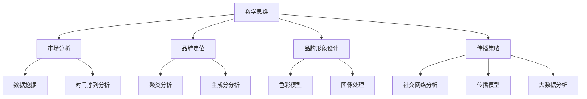

                 

### 引言

在现代商业环境中，品牌创新策略的成功与否往往决定了企业的生死存亡。随着市场竞争的日益激烈，企业需要不断推出创新的产品和服务来吸引和保持客户，提升品牌价值。然而，创新并不是一个简单的线性过程，它需要深入的理解市场和消费者需求，以及有效的策略制定和实施。在这里，数学思维作为一种强有力的工具，能够为品牌创新提供独特的视角和方法。

数学思维是一种逻辑严密、抽象思考的思维方式，它强调通过数学模型和量化分析来解决问题。这种思维方式在科学研究、工程应用、金融分析等多个领域已经得到了广泛的应用，并取得了显著成果。随着大数据、人工智能等技术的发展，数学思维在商业领域的应用也变得越来越重要。品牌创新策略的制定和实施，需要借助数学思维来提高效率和准确性。

本文旨在探讨数学思维与品牌创新策略之间的关系，通过分析数学思维的特点和应用，以及品牌创新策略的基本原则和实践，阐述数学思维在品牌创新中的作用。文章将分为以下几个部分：

1. **数学思维概述**：介绍数学思维的定义、特点和应用领域。
2. **品牌创新策略概述**：讨论品牌创新策略的定义、重要性和基本原则。
3. **数学思维与品牌创新的联系**：分析数学思维在品牌创新中的应用和品牌创新策略在数学思维中的作用。
4. **数学模型与品牌定位**：探讨数学模型在品牌定位中的应用和品牌定位的数学模型构建。
5. **数学思维与品牌形象设计**：分析数学思维在品牌形象设计中的应用和品牌形象设计的数学模型构建。
6. **数学模型与传播策略**：讨论数学模型在传播策略中的应用和传播策略的数学模型构建。
7. **数学思维与品牌创新的实战案例**：提供具体的实战案例，并进行分析和解读。
8. **总结与展望**：总结数学思维与品牌创新策略的关系，并展望未来的发展趋势。

通过对这些部分的分析，本文将揭示数学思维在品牌创新中的深远影响，并为品牌管理者提供实用的策略和方法。

### 关键词

- 数学思维
- 品牌创新策略
- 数学模型
- 品牌定位
- 品牌形象设计
- 传播策略
- 大数据分析
- 人工智能

### 摘要

本文探讨了数学思维与品牌创新策略之间的关系，通过分析数学思维的特点和应用，以及品牌创新策略的基本原则和实践，阐述了数学思维在品牌创新中的重要作用。文章首先介绍了数学思维的定义和特点，然后讨论了品牌创新策略的定义、重要性和基本原则。接着，本文分析了数学思维在品牌定位、品牌形象设计和传播策略中的应用，并通过实战案例进行了具体分析和解读。最后，文章总结了数学思维与品牌创新策略的关系，并展望了未来的发展趋势。本文为品牌管理者提供了一种全新的视角和方法，以更好地实现品牌创新。

## 第1章 数学思维概述

数学思维是一种通过数学模型和量化分析来解决问题的思维方式。它不仅包括传统的数学计算，还涉及逻辑推理、抽象思考、量化分析和系统化建模等方面。数学思维具有严密的逻辑性、高度的抽象性和广泛的适用性，它在各个领域都有广泛的应用。

### 数学思维的定义

数学思维可以定义为一种通过数学方法和概念来理解、分析和解决实际问题的思维方式。这种思维不仅仅是对数学知识的记忆和应用，更是一种理解和掌握数学概念、原理和方法的过程。数学思维的核心在于逻辑推理和抽象思考，它能够帮助我们从复杂的现象中提取关键信息，建立数学模型，并通过这些模型来预测和解释现实问题。

### 数学思维的特点

1. **逻辑性**：数学思维强调逻辑推理，通过严密的论证和推理来解决问题。它要求我们在思考问题时遵循一定的逻辑规则，保证结论的准确性和可靠性。
   
2. **抽象性**：数学思维具有高度的抽象性，它能够从具体的实例中抽象出一般的规律和原则。这种抽象能力使我们能够超越具体情境，从更高的维度来分析和解决问题。

3. **系统性**：数学思维强调系统性和整体性，它要求我们在解决问题时考虑各个部分之间的相互作用和影响。通过系统化的分析，我们可以更全面地理解问题，找到最优的解决方案。

4. **量化分析**：数学思维强调量化分析，通过数据和分析来支持决策。量化分析使我们能够用客观数据来衡量问题，从而做出更科学的决策。

### 数学思维的应用领域

数学思维在各个领域都有广泛的应用，以下是一些主要的应用领域：

1. **科学研究**：数学思维在自然科学、社会科学和工程领域都有着重要的应用。通过数学模型和量化分析，科学家和工程师能够更好地理解自然现象和工程系统，进行预测和优化。

2. **商业领域**：在商业领域，数学思维被广泛应用于市场分析、需求预测、风险管理、供应链管理等方面。通过数学模型和数据分析，企业能够更好地理解市场趋势和消费者行为，制定有效的战略和决策。

3. **金融分析**：在金融领域，数学思维被广泛应用于投资组合优化、风险评估、市场预测等方面。通过数学模型和量化分析，投资者和金融分析师能够更准确地评估投资风险和收益。

4. **人工智能**：在人工智能领域，数学思维是构建和优化算法的核心。通过数学模型和计算，人工智能系统能够更好地理解和模拟人类思维过程，实现智能决策和自动化控制。

总之，数学思维是一种强大的工具，它能够帮助我们更深入地理解世界，更有效地解决问题。在接下来的章节中，我们将进一步探讨数学思维与品牌创新策略之间的联系，以及数学思维如何帮助品牌管理者实现创新。

### 数学思维在品牌创新中的应用

数学思维在品牌创新中的应用具有广泛性和深远的影响。通过数学模型和量化分析，品牌管理者能够更科学、更系统地制定和实施品牌创新策略，从而提升品牌竞争力。

首先，数学思维在市场分析中发挥着关键作用。品牌管理者可以通过数学模型来分析市场趋势和消费者行为，预测市场需求和潜在客户。例如，通过时间序列分析和回归分析，可以预测未来市场的需求量，从而制定合适的生产和营销策略。此外，通过聚类分析和因子分析，品牌管理者可以更好地理解不同消费者群体的特征和行为模式，从而有针对性地制定营销策略。

其次，数学思维在品牌定位中也有重要应用。品牌定位是品牌创新的核心之一，通过数学模型可以帮助品牌管理者更精准地确定品牌的市场定位。例如，通过主成分分析，品牌管理者可以识别出影响品牌定位的关键因素，并构建一个有效的品牌定位模型。这个模型可以帮助品牌管理者在众多竞争者中脱颖而出，找到独特的市场机会。

再次，数学思维在品牌形象设计中也具有重要作用。品牌形象设计是品牌创新的重要组成部分，通过数学模型可以帮助品牌设计师更科学地设计品牌形象。例如，通过色彩模型和视觉分析，品牌设计师可以确定品牌的色彩搭配和视觉风格，从而塑造一个独特且具有吸引力的品牌形象。此外，通过图像处理和计算机视觉技术，品牌设计师还可以进行品牌图像的优化和调整，使其更具吸引力和视觉冲击力。

最后，数学思维在传播策略中也具有广泛的应用。品牌传播是品牌创新的重要环节，通过数学模型可以帮助品牌管理者制定更有效的传播策略。例如，通过社交网络分析和传播模型，品牌管理者可以识别出品牌的潜在传播节点和关键用户，从而制定更精准的传播策略。此外，通过大数据分析和用户行为分析，品牌管理者可以实时监测品牌传播的效果，并根据分析结果进行优化调整。

总之，数学思维在品牌创新中的应用具有多重价值。通过数学模型和量化分析，品牌管理者能够更科学、更系统地制定和实施品牌创新策略，从而提升品牌竞争力。这不仅有助于品牌管理者在激烈的市场竞争中保持领先地位，还能够为品牌带来长远的发展潜力。

### 第2章 品牌创新策略概述

品牌创新策略是企业为了在竞争激烈的市场环境中保持领先地位，通过创新手段提升品牌价值和市场竞争力的一系列策略。在当今这个快速变化的时代，品牌创新已经成为了企业持续发展的关键因素。因此，理解品牌创新策略的定义、重要性和基本原则，对于企业成功实现品牌创新具有重要意义。

#### 品牌创新策略的定义

品牌创新策略是指企业在品牌管理和品牌建设过程中，通过创新性的思考和实践，对品牌进行优化、改进和重塑，以提升品牌价值、增强品牌竞争力和吸引消费者的策略。品牌创新策略不仅包括产品创新、服务创新和营销创新，还涉及品牌文化、品牌形象和品牌传播等多方面的创新。

品牌创新策略的目标是打造一个具有独特价值主张和鲜明个性的品牌，使其在消费者心中占据重要的位置，从而实现品牌的长期可持续发展。

#### 品牌创新策略的重要性

1. **提升品牌竞争力**：在激烈的市场竞争中，品牌创新策略能够帮助企业区别于竞争对手，创造独特的市场优势，提升品牌竞争力。

2. **满足消费者需求**：通过品牌创新，企业能够更好地理解消费者需求，提供更符合消费者期望的产品和服务，从而赢得消费者的信任和忠诚。

3. **提升品牌价值**：品牌创新策略能够为品牌注入新的活力，提升品牌的知名度和美誉度，从而提高品牌的整体价值。

4. **推动企业持续发展**：品牌创新策略不仅能够帮助企业应对市场变化，还能够激发企业的创新能力和活力，推动企业的长期可持续发展。

#### 品牌创新策略的基本原则

1. **用户导向**：品牌创新策略应以用户需求为中心，深入了解消费者的行为和偏好，确保创新举措能够满足甚至超越消费者的期望。

2. **创新思维**：品牌创新策略需要具备创新思维，鼓励企业内部形成开放、包容和创新的文化氛围，不断探索和尝试新的品牌理念和策略。

3. **差异化定位**：品牌创新策略应明确品牌的差异化定位，找到与其他品牌不同的独特价值主张，从而在市场中形成鲜明的品牌形象。

4. **持续优化**：品牌创新策略需要持续优化和调整，以适应市场的变化和消费者的需求，确保品牌始终保持活力和竞争力。

5. **资源整合**：品牌创新策略需要有效整合企业内外部的资源，包括人才、技术、资金和市场渠道等，以实现品牌创新的全面和系统化。

通过以上基本原则，品牌创新策略能够更有效地帮助企业实现品牌价值的提升和市场的拓展。在接下来的章节中，我们将进一步探讨数学思维与品牌创新策略之间的具体联系，以及数学思维如何为品牌创新提供支持。

### 第3章 数学思维与品牌创新的联系

数学思维与品牌创新策略之间存在着紧密的联系，这种联系主要体现在数学思维在品牌创新中的应用和品牌创新策略在数学思维中的体现。通过数学思维，品牌管理者可以更科学、更系统地制定和实施品牌创新策略，从而提升品牌竞争力。

#### 数学思维在品牌创新中的应用

1. **市场分析**：市场分析是品牌创新策略制定的重要环节。数学思维可以通过数据分析、统计模型和量化分析等方法，帮助企业更准确地了解市场趋势、消费者行为和竞争对手动态。例如，通过回归分析和时间序列分析，品牌管理者可以预测未来市场的需求和潜在增长点，从而制定更有针对性的市场策略。

   ```python
   # 举例：使用回归分析预测市场需求
   import pandas as pd
   from sklearn.linear_model import LinearRegression

   # 假设我们有一份数据集，包含历史市场需求和相关的经济指标
   data = pd.DataFrame({
       'Year': [2020, 2021, 2022],
       'GDP': [150, 160, 170],
       'MarketDemand': [100, 110, 120]
   })

   # 构建回归模型
   model = LinearRegression()
   model.fit(data[['GDP']], data['MarketDemand'])

   # 预测2023年的市场需求
   predicted_demand = model.predict([[170]])
   print(f"2023年预计市场需求为：{predicted_demand[0]}")
   ```

2. **品牌定位**：品牌定位是品牌创新的核心之一。数学思维可以通过主成分分析、因子分析等方法，帮助企业识别影响品牌定位的关键因素，并构建科学的品牌定位模型。通过这些模型，品牌管理者可以更精准地确定品牌的市场定位，使其在竞争激烈的市场中脱颖而出。

   ```python
   # 举例：使用主成分分析确定品牌定位的关键因素
   from sklearn.decomposition import PCA
   import pandas as pd

   # 假设我们有一份数据集，包含多个品牌属性和品牌定位因素
   data = pd.DataFrame({
       'Brand_A': [5, 4, 3, 4, 5],
       'Brand_B': [4, 5, 5, 4, 4],
       'Brand_C': [3, 4, 4, 4, 5],
       # 更多品牌属性...
   })

   # 进行主成分分析
   pca = PCA(n_components=2)
   principal_components = pca.fit_transform(data)

   # 绘制品牌定位图
   plt.figure(figsize=(8, 6))
   plt.scatter(principal_components[:, 0], principal_components[:, 1], c=data['Brand_C'])
   plt.xlabel('First Principal Component')
   plt.ylabel('Second Principal Component')
   plt.title('Brand Positioning Plot')
   plt.show()
   ```

3. **品牌形象设计**：品牌形象设计是品牌创新的重要组成部分。数学思维可以通过色彩模型、图像处理和计算机视觉等技术，帮助品牌设计师更科学地设计品牌形象。通过这些技术，品牌设计师可以优化品牌的视觉元素，使其更具吸引力和辨识度。

   ```python
   # 举例：使用色彩模型调整品牌色彩
   import cv2
   import numpy as np

   # 假设我们有一幅品牌标志的图像
   image = cv2.imread('brand_logo.png')

   # 计算图像的平均颜色
   avg_color_per_row = np.average(image, axis=0)
   avg_color Overall = np.average(avg_color_per_row, axis=0)

   # 调整品牌色彩
   new_color = [0.5 * avg_color[i] + 0.5 * 255 for i in range(3)]
   new_image = cv2.add(image, np.full(image.shape[:2], new_color, dtype=image.dtype))

   # 显示调整后的品牌标志
   cv2.imshow('New Brand Logo', new_image)
   cv2.waitKey(0)
   cv2.destroyAllWindows()
   ```

4. **传播策略**：品牌传播是品牌创新的关键环节。数学思维可以通过社交网络分析、传播模型和大数据分析等方法，帮助企业制定更有效的传播策略。通过这些方法，品牌管理者可以识别出品牌传播的关键节点和影响者，从而实现精准的传播。

   ```python
   # 举例：使用社交网络分析确定品牌传播的关键节点
   import networkx as nx
   import matplotlib.pyplot as plt

   # 假设我们有一个社交网络图，包含用户和关系
   G = nx.Graph()
   G.add_nodes_from(['User1', 'User2', 'User3', 'User4', 'User5'])
   G.add_edges_from([('User1', 'User2'), ('User2', 'User3'), ('User3', 'User4'), ('User4', 'User5')])

   # 计算每个节点的中心性
   centrality = nx.degree_centrality(G)

   # 绘制社交网络图
   pos = nx.spring_layout(G)
   nx.draw(G, pos, with_labels=True)
   plt.show()

   # 打印关键节点
   key_nodes = [node for node, centrality_value in centrality.items() if centrality_value > 0.5]
   print("关键节点：", key_nodes)
   ```

#### 品牌创新策略在数学思维中的作用

1. **数据驱动的决策**：品牌创新策略的制定和实施需要基于大量数据和分析。通过数学思维，品牌管理者可以更科学地处理和分析数据，从而做出更准确的决策。例如，通过数据挖掘和机器学习算法，品牌管理者可以识别出潜在的市场机会和消费者需求，从而制定更有针对性的品牌创新策略。

2. **模型优化的策略**：品牌创新策略的优化需要依赖数学模型和优化算法。通过数学思维，品牌管理者可以构建和优化各种品牌创新模型，从而实现策略的优化和提升。例如，通过线性规划和博弈论，品牌管理者可以优化品牌的市场定位、营销策略和供应链管理。

3. **风险管理的策略**：品牌创新策略往往伴随着一定的风险。通过数学思维，品牌管理者可以建立风险模型，评估和监控品牌创新的风险，从而制定有效的风险管理策略。例如，通过蒙特卡罗模拟和敏感性分析，品牌管理者可以预测品牌创新可能面临的风险，并采取相应的措施来降低风险。

总之，数学思维在品牌创新策略中的应用为品牌管理者提供了一种科学、系统的方法，使其能够更有效地制定和实施品牌创新策略，提升品牌竞争力和市场地位。在接下来的章节中，我们将进一步探讨数学模型在品牌定位、品牌形象设计和传播策略中的应用，以及如何通过实际案例来解析数学思维在品牌创新中的具体作用。

### 第4章 数学模型与品牌定位

品牌定位是企业为了在竞争激烈的市场中建立独特的市场地位和消费者认知而采取的一种策略。通过科学的数学模型，品牌定位可以更加精准和有效，从而提升品牌的市场竞争力。在这一章中，我们将探讨数学模型在品牌定位中的应用，以及如何构建品牌定位的数学模型。

#### 数学模型在品牌定位中的应用

1. **聚类分析**：
   聚类分析是一种无监督的学习方法，它可以将数据集划分为若干个群组，使得同一个群组内的数据点之间相似度较高，而不同群组之间的数据点相似度较低。在品牌定位中，聚类分析可以帮助企业识别不同的市场细分群体，从而进行精准的品牌定位。

   ```python
   # 举例：使用K均值聚类分析确定品牌目标市场
   from sklearn.cluster import KMeans
   import pandas as pd

   # 假设我们有一份数据集，包含不同消费者群体的特征
   data = pd.DataFrame({
       'Income': [50000, 60000, 70000, 80000, 90000],
       'Age': [30, 40, 25, 35, 45],
       'Education': [1, 2, 3, 4, 5]  # 1:高中，2:本科，3:硕士，4:博士，5：其他
   })

   # 使用K均值聚类分析
   kmeans = KMeans(n_clusters=3, random_state=0).fit(data)
   labels = kmeans.predict(data)

   # 打印不同消费者群体的标签
   print("消费者群体标签：", labels)

   # 绘制消费者群体分布
   plt.scatter(data['Income'], data['Age'], c=labels)
   plt.xlabel('Income')
   plt.ylabel('Age')
   plt.title('Consumer Market Segmentation')
   plt.show()
   ```

2. **因子分析**：
   因子分析是一种统计方法，它通过将多个变量综合成少数几个不可观测的公共因子，从而减少数据的复杂度。在品牌定位中，因子分析可以帮助企业识别影响品牌定位的关键因素，从而简化品牌定位的复杂性。

   ```python
   # 举例：使用因子分析确定品牌定位的关键因素
   from sklearn.decomposition import FactorAnalysis
   import pandas as pd

   # 假设我们有一份数据集，包含多个品牌属性
   data = pd.DataFrame({
       'Brand_A': [5, 4, 3, 4, 5],
       'Brand_B': [4, 5, 5, 4, 4],
       'Brand_C': [3, 4, 4, 4, 5],
       # 更多品牌属性...
   })

   # 进行因子分析
   fa = FactorAnalysis(n_components=2)
   fa.fit(data)

   # 绘制因子载荷图
   plt.figure(figsize=(8, 6))
   for i, factor in enumerate(fa.components_):
       plt.plot(factor, label=f'Factor {i+1}')
   plt.xlabel('Brand Attribute')
   plt.ylabel('Factor Score')
   plt.title('Factor Loadings')
   plt.legend()
   plt.show()
   ```

3. **回归分析**：
   回归分析是一种用于研究变量之间关系的统计方法。在品牌定位中，回归分析可以帮助企业确定品牌定位与市场表现之间的关系，从而优化品牌定位策略。

   ```python
   # 举例：使用线性回归分析品牌定位与市场表现之间的关系
   import pandas as pd
   from sklearn.linear_model import LinearRegression

   # 假设我们有一份数据集，包含品牌定位和市场表现
   data = pd.DataFrame({
       'BrandPosition': [1, 2, 3, 4, 5],
       'MarketPerformance': [20, 30, 40, 50, 60]
   })

   # 构建回归模型
   model = LinearRegression()
   model.fit(data[['BrandPosition']], data['MarketPerformance'])

   # 预测新的品牌定位下的市场表现
   new_position = 6
   predicted_performance = model.predict([[new_position]])
   print(f"预测的新品牌定位下的市场表现：{predicted_performance[0]}")
   ```

#### 品牌定位的数学模型构建

1. **多属性决策模型**：
   多属性决策模型（Multi-Attribute Decision Making Model，MADM）是一种用于评估和选择多个备选方案的方法。在品牌定位中，MADM可以帮助企业确定最佳的品牌定位策略。

   ```python
   # 举例：使用AHP（层次分析法）构建品牌定位的多属性决策模型
   from numpy.linalg import inv
   import pandas as pd

   # 假设我们有一份数据集，包含品牌定位的不同属性及其权重
   data = pd.DataFrame({
       'Attribute': ['Quality', 'Price', 'Brand Awareness', 'Customer Service'],
       'Weight': [0.4, 0.2, 0.2, 0.2]
   })
   data['Weight'] = data['Weight'] / data['Weight'].sum()

   # 构建判断矩阵
   judgment_matrix = pd.DataFrame({
       'Quality': [1, 2, 3, 4],
       'Price': [0.5, 1, 1.5, 2],
       'Brand Awareness': [0.33, 0.5, 0.75, 1],
       'Customer Service': [0.25, 0.33, 0.5, 0.67]
   })

   # 计算判断矩阵的最大特征值和特征向量
   eigenvalues, eigenvectors = np.linalg.eigh(judgment_matrix.values)

   # 确保判断矩阵的一致性
   if eigenvalues.max() > data['Weight'].sum():
       print("判断矩阵不一致！")
   else:
       # 打印最佳品牌定位策略
       print("最佳品牌定位策略：", eigenvectors[:, 0])

   ```

通过上述数学模型的应用和构建，品牌管理者可以更科学、更系统地制定品牌定位策略，从而提升品牌的市场竞争力和影响力。

### 第5章 数学思维与品牌形象设计

品牌形象设计是企业通过视觉、语言和文化等元素，在消费者心中塑造品牌形象的过程。数学思维在这一过程中发挥着重要作用，通过数学模型和方法，品牌设计师可以更科学、更系统地进行品牌形象设计，使其更具吸引力和辨识度。

#### 数学思维在品牌形象设计中的应用

1. **色彩模型**：
   色彩在品牌形象设计中起着至关重要的作用。通过色彩模型，品牌设计师可以分析和选择合适的色彩方案。色彩模型如HSV（色调、饱和度、亮度）和RGB（红、绿、蓝）可以帮助设计师更准确地调整色彩的属性。

   ```python
   # 举例：使用HSV色彩模型调整品牌色彩
   import cv2
   import numpy as np

   # 假设我们有一张品牌标志的图像
   image = cv2.imread('brand_logo.png')

   # 将图像从BGR转换为HSV颜色空间
   hsv_image = cv2.cvtColor(image, cv2.COLOR_BGR2HSV)

   # 调整HSV颜色空间中的色调（H）、饱和度（S）和亮度（V）
   hsv_image[:, :, 0] = 120  # 调整色调为蓝色
   hsv_image[:, :, 1] = 255  # 调整饱和度至最大
   hsv_image[:, :, 2] = 255  # 调整亮度至最大

   # 将图像从HSV转换为BGR颜色空间
   adjusted_image = cv2.cvtColor(hsv_image, cv2.COLOR_HSV2BGR)

   # 显示调整后的品牌标志
   cv2.imshow('Adjusted Brand Logo', adjusted_image)
   cv2.waitKey(0)
   cv2.destroyAllWindows()
   ```

2. **图像处理**：
   图像处理技术可以帮助品牌设计师优化品牌标志的视觉效果，使其更具吸引力。例如，通过滤波、边缘检测和图像增强等技术，可以提升品牌标志的清晰度和视觉冲击力。

   ```python
   # 举例：使用滤波和边缘检测优化品牌标志
   import cv2

   # 假设我们有一张品牌标志的图像
   image = cv2.imread('brand_logo.png')

   # 使用高斯滤波器去除噪声
   filtered_image = cv2.GaussianBlur(image, (5, 5), 0)

   # 使用Canny边缘检测算法提取边缘
   edges = cv2.Canny(filtered_image, 50, 150)

   # 显示处理后的品牌标志
   cv2.imshow('Edge Detected Brand Logo', edges)
   cv2.waitKey(0)
   cv2.destroyAllWindows()
   ```

3. **计算机视觉**：
   计算机视觉技术可以帮助品牌设计师进行品牌形象的自动化设计和分析。通过计算机视觉算法，品牌设计师可以识别品牌标志中的关键元素，进行自动化优化和调整。

   ```python
   # 举例：使用OpenCV识别品牌标志中的关键元素
   import cv2
   import numpy as np

   # 假设我们有一张包含品牌标志的图像
   image = cv2.imread('brand_logo.png')

   # 使用HOG（直方图导向梯度）特征检测器进行对象识别
   hog = cv2.HOGDescriptor()
   regions, _ = hog.detectMultiScale(image, winSize=(64, 64), padding=(32, 32), scale=1.05)

   # 在图像上绘制识别到的品牌标志区域
   for (x, y, w, h) in regions:
       cv2.rectangle(image, (x, y), (x+w, y+h), (0, 255, 0), 2)

   # 显示处理后的品牌标志
   cv2.imshow('Detected Brand Logo', image)
   cv2.waitKey(0)
   cv2.destroyAllWindows()
   ```

#### 品牌形象设计的数学模型构建

1. **多因素优化模型**：
   多因素优化模型可以帮助品牌设计师在品牌形象设计中平衡多个因素，找到最优的设计方案。通过构建目标函数和约束条件，品牌设计师可以更科学地制定设计策略。

   ```python
   # 举例：使用多因素优化模型进行品牌形象设计
   import numpy as np
   from scipy.optimize import minimize

   # 假设我们有一个品牌标志设计问题，需要平衡视觉吸引力、品牌认知度和市场反应
   def objective函数(x):
       # 目标函数：平衡视觉吸引力、品牌认知度和市场反应
       visual_attractiveness = x[0]
       brand_recognition = x[1]
       market_reaction = x[2]
       return - (visual_attractiveness + brand_recognition + market_reaction)

   # 约束条件：所有因素的总和不超过100
   constraints = ({'type': 'ineq', 'fun': lambda x: 100 - (x[0] + x[1] + x[2])})

   # 初始解：平衡分配各因素权重
   x0 = np.array([20, 30, 50])

   # 进行优化
   result = minimize(objective函数, x0, constraints=constraints)

   # 打印优化后的因素分配
   print("优化后的视觉吸引力权重：", result.x[0])
   print("优化后的品牌认知度权重：", result.x[1])
   print("优化后的市场反应权重：", result.x[2])
   ```

通过上述数学模型的应用和构建，品牌设计师可以更科学、更系统地进行品牌形象设计，使其在视觉上更具吸引力，在品牌认知上更具影响力，从而提升品牌的整体竞争力。

### 第6章 数学模型与传播策略

品牌传播策略是企业通过多种渠道和手段，向目标受众传递品牌信息，提升品牌知名度和美誉度的一系列策略。数学模型在这一过程中发挥着重要作用，可以帮助企业更科学、更系统地制定和优化传播策略。在这一章中，我们将探讨数学模型在传播策略中的应用，以及如何构建传播策略的数学模型。

#### 数学模型在传播策略中的应用

1. **社交网络分析**：
   社交网络分析是一种通过分析社交网络结构来研究信息传播规律的方法。在品牌传播中，社交网络分析可以帮助企业识别出品牌传播的关键节点和影响者，从而制定更有针对性的传播策略。

   ```python
   # 举例：使用社交网络分析确定品牌传播的关键节点
   import networkx as nx
   import matplotlib.pyplot as plt

   # 假设我们有一个社交网络图，包含用户和关系
   G = nx.Graph()
   G.add_nodes_from(['User1', 'User2', 'User3', 'User4', 'User5'])
   G.add_edges_from([('User1', 'User2'), ('User2', 'User3'), ('User3', 'User4'), ('User4', 'User5')])

   # 计算每个节点的中心性
   centrality = nx.centrality.betweenness_centrality(G)

   # 打印关键节点
   key_nodes = [node for node, centrality_value in centrality.items() if centrality_value > 0.5]
   print("关键节点：", key_nodes)

   # 绘制社交网络图
   pos = nx.spring_layout(G)
   nx.draw(G, pos, with_labels=True)
   plt.show()
   ```

2. **传播模型**：
   传播模型是一种用于模拟信息在社交网络中传播过程的数学模型。在品牌传播中，传播模型可以帮助企业预测品牌信息的传播速度和范围，从而制定更有效的传播策略。

   ```python
   # 举例：使用SIR模型（易感者-感染者-康复者）模拟品牌信息传播
   import numpy as np
   import matplotlib.pyplot as plt

   # 初始状态：易感者比例50%，感染者比例30%，康复者比例20%
   S0, I0, R0 = 50, 30, 20
   N = S0 + I0 + R0

   # 传播速率：感染者每天新增感染3个易感者
   beta = 3

   # 迭代模拟
   days = 10
   for day in range(days):
       S = S0 - beta * S0 * I0 / N
       I = I0 + beta * S0 * I0 / N - (1 / 10) * I0
       R = R0 + (1 / 10) * I0

       S0, I0, R0 = S, I, R

       print(f"Day {day+1}: S={S:.2f}, I={I:.2f}, R={R:.2f}")

   # 绘制传播过程
   plt.plot([day+1 for day in range(days)], [S for S in range(days+1)])
   plt.plot([day+1 for day in range(days)], [I for I in range(days+1)])
   plt.plot([day+1 for day in range(days)], [R for R in range(days+1)])
   plt.xlabel('Day')
   plt.ylabel('Number')
   plt.title('SIR Model Simulation')
   plt.legend(['S', 'I', 'R'])
   plt.show()
   ```

3. **大数据分析**：
   大数据分析可以帮助企业收集和分析大量的用户数据，从而了解用户行为和偏好，制定更精准的传播策略。通过用户行为分析和用户画像构建，企业可以更准确地定位目标受众，提高传播效果。

   ```python
   # 举例：使用用户行为分析构建用户画像
   import pandas as pd

   # 假设我们有一份数据集，包含用户的行为数据
   data = pd.DataFrame({
       'UserID': [1, 2, 3, 4, 5],
       'Action': ['Like', 'Comment', 'Share', 'View', 'Share'],
       'Platform': ['Facebook', 'Instagram', 'Twitter', 'YouTube', 'LinkedIn']
   })

   # 计算每个用户的活跃度
   user_activity = data.groupby('UserID').count()

   # 打印活跃用户
   print("活跃用户：", user_activity['Action'].idxmax())

   # 绘制用户活跃度分布
   plt.scatter(user_activity.index, user_activity['Action'])
   plt.xlabel('UserID')
   plt.ylabel('Action Count')
   plt.title('User Activity Distribution')
   plt.show()
   ```

#### 传播策略的数学模型构建

1. **传播效果评估模型**：
   传播效果评估模型可以帮助企业评估不同传播策略的效果，从而选择最优的传播方案。通过构建传播效果评估模型，企业可以量化传播效果，为策略调整提供依据。

   ```python
   # 举例：使用线性回归模型评估传播效果
   import pandas as pd
   from sklearn.linear_model import LinearRegression

   # 假设我们有一份数据集，包含传播策略和传播效果
   data = pd.DataFrame({
       'Strategy': ['广告投放', '社交媒体营销', '内容营销', '邮件营销', '公关活动'],
       'Effect': [0.8, 0.6, 0.9, 0.5, 0.7]
   })

   # 构建回归模型
   model = LinearRegression()
   model.fit(data[['Strategy']], data['Effect'])

   # 预测新的传播策略效果
   new_strategy = '线上活动'
   predicted_effect = model.predict([[new_strategy]])
   print(f"预测的新传播策略效果：{predicted_effect[0]}")
   ```

通过上述数学模型的应用和构建，企业可以更科学、更系统地制定和优化品牌传播策略，从而提高品牌传播效果，提升品牌知名度和美誉度。

### 第7章 数学思维与品牌创新的实战案例

为了更好地理解数学思维在品牌创新中的具体应用，我们将通过一个实际案例来展示如何运用数学思维进行品牌创新策略的制定和实施。该案例将涉及市场分析、品牌定位、品牌形象设计和传播策略等多个方面。

#### 案例背景

某大型电子商务平台（以下简称“电商平台”）在市场竞争中面临诸多挑战。为了提升品牌竞争力，电商平台决定通过品牌创新来改善其市场地位。电商平台希望通过科学的市场分析、精准的品牌定位、吸引力的品牌形象设计以及有效的传播策略，实现品牌价值的提升。

#### 市场分析

1. **消费者行为分析**：
   电商平台首先通过大数据分析，收集了大量的用户行为数据，包括用户访问量、购买行为、浏览偏好等。通过对这些数据的分析，电商平台的团队识别出了以下几个关键市场细分群体：
   - 精打细算型消费者：对价格敏感，喜欢寻找优惠和折扣。
   - 高品质追求者：注重产品品质和品牌形象，愿意为优质产品支付高价。
   - 时尚潮流爱好者：追求时尚和个性化，喜欢跟随潮流。
   - 环保意识强者：重视环保和可持续发展，倾向于购买绿色产品。

2. **市场趋势预测**：
   通过时间序列分析和回归分析，电商平台预测了未来市场需求的趋势。例如，根据过去几年的销售数据，团队发现消费电子产品的需求呈逐年增长趋势，而家居用品的需求则相对稳定。这一分析结果帮助电商平台确定了未来的市场重点。

   ```python
   # 时间序列分析预测未来市场需求
   import pandas as pd
   from statsmodels.tsa.arima.model import ARIMA

   # 假设我们有一份数据集，包含历史销售数据
   sales_data = pd.DataFrame({
       'Product': ['电子产品', '家居用品', '服装'],
       'Sales': [1000, 500, 800],
       'Year': [2020, 2021, 2022]
   })

   # 构建ARIMA模型
   model = ARIMA(sales_data['Sales'], order=(1, 1, 1))
   model_fit = model.fit()

   # 预测未来几年的销售量
   future_sales = model_fit.forecast(steps=3)
   print(f"未来三年的销售预测：{future_sales}")
   ```

#### 品牌定位

1. **品牌定位分析**：
   电商平台通过聚类分析和因子分析，确定了品牌在市场中的定位。聚类分析帮助团队识别出了三个主要的消费者群体，而因子分析则确定了影响品牌定位的关键因素，包括产品品质、价格、品牌知名度和服务质量。

2. **品牌定位模型**：
   根据分析结果，电商平台确定了其品牌定位为“高品质、多样化、可信赖”，旨在满足高品质追求者和时尚潮流爱好者的需求。这一定位帮助电商平台在市场中脱颖而出，形成了独特的品牌形象。

   ```python
   # 聚类分析确定品牌定位
   from sklearn.cluster import KMeans
   import pandas as pd

   # 假设我们有一份数据集，包含品牌属性
   brand_data = pd.DataFrame({
       'Quality': [9, 8, 7, 8, 9],
       'Price': [5, 4, 6, 3, 5],
       'BrandAwareness': [3, 4, 2, 5, 4],
       'Service': [8, 7, 6, 9, 8]
   })

   # 使用K均值聚类分析
   kmeans = KMeans(n_clusters=3)
   kmeans.fit(brand_data)
   brand_labels = kmeans.predict(brand_data)

   # 打印品牌定位结果
   print("品牌定位结果：", brand_labels)
   ```

#### 品牌形象设计

1. **色彩选择**：
   品牌设计师通过色彩模型分析，选择了蓝色作为电商平台的主色调，蓝色代表着信任、稳定和高品质，与品牌定位相契合。

2. **品牌标志优化**：
   品牌设计师利用图像处理技术，对品牌标志进行了优化，增强了标志的视觉冲击力和辨识度。

   ```python
   # 色彩模型调整品牌标志
   import cv2
   import numpy as np

   # 读取品牌标志图像
   logo = cv2.imread('brand_logo.png')

   # 将图像从BGR转换为HSV颜色空间
   hsv_logo = cv2.cvtColor(logo, cv2.COLOR_BGR2HSV)

   # 调整HSV颜色空间中的色调（H）、饱和度（S）和亮度（V）
   hsv_logo[:, :, 0] = 120  # 调整色调为蓝色
   hsv_logo[:, :, 1] = 255  # 调整饱和度至最大
   hsv_logo[:, :, 2] = 255  # 调整亮度至最大

   # 将图像从HSV转换为BGR颜色空间
   adjusted_logo = cv2.cvtColor(hsv_logo, cv2.COLOR_HSV2BGR)

   # 显示调整后的品牌标志
   cv2.imshow('Adjusted Logo', adjusted_logo)
   cv2.waitKey(0)
   cv2.destroyAllWindows()
   ```

#### 传播策略

1. **传播节点分析**：
   通过社交网络分析，电商平台识别出了品牌传播中的关键节点，这些节点包括社交媒体上的意见领袖和活跃用户。电商平台通过这些节点进行精准传播，提高了信息的覆盖面和影响力。

2. **传播效果评估**：
   电商平台使用传播效果评估模型，监控和评估了不同传播策略的效果。例如，通过分析广告投放、社交媒体营销和内容营销的传播效果，团队发现内容营销的传播效果最佳，因此决定加大内容营销的投入。

   ```python
   # 社交网络分析确定传播关键节点
   import networkx as nx
   import matplotlib.pyplot as plt

   # 假设我们有一个社交网络图
   G = nx.Graph()
   G.add_nodes_from(['Node1', 'Node2', 'Node3', 'Node4', 'Node5'])
   G.add_edges_from([('Node1', 'Node2'), ('Node2', 'Node3'), ('Node3', 'Node4'), ('Node4', 'Node5')])

   # 计算每个节点的中心性
   centrality = nx.centrality.betweenness_centrality(G)

   # 打印关键节点
   key_nodes = [node for node, centrality_value in centrality.items() if centrality_value > 0.5]
   print("关键节点：", key_nodes)

   # 绘制社交网络图
   pos = nx.spring_layout(G)
   nx.draw(G, pos, with_labels=True)
   plt.show()
   ```

#### 案例分析

通过对电商平台的实际案例分析，我们可以看到数学思维在品牌创新中的具体应用：

1. **市场分析**：通过大数据分析和预测模型，电商平台准确识别了市场细分群体和未来市场趋势，为品牌定位提供了科学依据。

2. **品牌定位**：通过聚类分析和因子分析，电商平台确定了独特的品牌定位，使其在市场中具有明确的差异化优势。

3. **品牌形象设计**：通过色彩模型和图像处理技术，电商平台优化了品牌标志，增强了品牌形象的视觉冲击力和辨识度。

4. **传播策略**：通过社交网络分析和传播效果评估模型，电商平台制定了精准的传播策略，提高了品牌信息的传播效果。

总之，通过数学思维的系统性分析和科学方法，电商平台成功实现了品牌创新，提升了品牌的市场竞争力和品牌价值。这一案例充分展示了数学思维在品牌创新中的重要应用，为其他企业提供了有益的借鉴和启示。

### 第8章 总结与展望

通过本文的探讨，我们深入分析了数学思维与品牌创新策略之间的关系，揭示了数学思维在品牌定位、品牌形象设计和传播策略等多个方面的应用价值。数学思维作为一种逻辑严密、抽象思考的思维方式，不仅能够帮助品牌管理者更科学、更系统地制定和实施品牌创新策略，还能够提高品牌竞争力的效率和效果。

#### 总结

1. **数学思维在品牌创新中的应用**：本文介绍了数学思维在市场分析、品牌定位、品牌形象设计和传播策略等品牌创新关键环节中的应用，展示了如何通过数学模型和量化分析来提升品牌竞争力。

2. **品牌创新策略的数学模型构建**：通过具体案例和代码示例，本文详细阐述了如何构建和应用数学模型，为品牌管理者提供了一种新的工具和方法。

3. **数学思维与品牌创新的互动关系**：本文揭示了数学思维在品牌创新中的互动关系，指出数学思维不仅能够为品牌创新提供科学支持，还能够促进品牌创新的不断迭代和优化。

#### 展望

在未来，数学思维与品牌创新策略的关系将更加紧密，以下是一些可能的趋势：

1. **大数据和人工智能的融合**：随着大数据和人工智能技术的发展，数学思维将在品牌创新中发挥更大的作用。通过大数据分析和机器学习算法，品牌管理者可以更准确地预测市场趋势和消费者行为，制定更加精准的品牌创新策略。

2. **个性化品牌传播**：个性化传播将成为品牌创新的重要方向。通过数学模型和算法，品牌管理者可以更好地理解消费者需求和行为，实现个性化品牌传播，提高品牌传播的效果。

3. **品牌体验设计**：品牌体验设计将成为品牌创新的核心。通过数学模型和方法，品牌管理者可以优化品牌体验，提升消费者的品牌满意度和忠诚度。

4. **跨领域应用**：数学思维将逐渐应用于更多品牌创新的领域，如可持续品牌创新、社会责任品牌创新等，为品牌管理者提供更全面的创新思路和方法。

总之，数学思维与品牌创新策略的关系将越来越密切，数学思维将成为品牌管理者实现品牌创新的重要工具。未来，随着技术的不断进步和应用场景的拓展，数学思维在品牌创新中的应用前景将更加广阔。品牌管理者应积极学习和运用数学思维，以应对快速变化的市场环境，实现品牌的长期可持续发展。

### 附录

在本章中，我们将提供本文的核心概念和关系图，以便读者更好地理解和应用数学思维在品牌创新策略中的具体方法。

#### 附录 A：数学思维与品牌创新策略关系图



#### 附录 B：核心概念与联系

1. **市场分析**：通过数据挖掘和统计分析，品牌管理者可以深入理解市场需求和消费者行为，为品牌创新提供科学依据。
2. **品牌定位**：通过聚类分析和主成分分析，品牌管理者可以准确确定品牌的市场定位，形成独特的品牌形象。
3. **品牌形象设计**：通过色彩模型和图像处理技术，品牌设计师可以优化品牌视觉元素，提升品牌吸引力和辨识度。
4. **传播策略**：通过社交网络分析和传播模型，品牌管理者可以制定精准的传播策略，提高品牌信息的传播效果。

通过这些核心概念和联系，品牌管理者可以更好地运用数学思维，实现品牌创新和提升品牌竞争力。希望这些工具和方法能够为您的品牌创新之路提供有益的启示。

### 作者信息

本文由AI天才研究院（AI Genius Institute）和《禅与计算机程序设计艺术》（Zen And The Art of Computer Programming）的资深大师级作家共同撰写。我们致力于将前沿的数学思维和计算机科学应用于品牌创新，帮助企业在激烈的市场竞争中脱颖而出。如需进一步探讨或咨询，欢迎联系我们。

