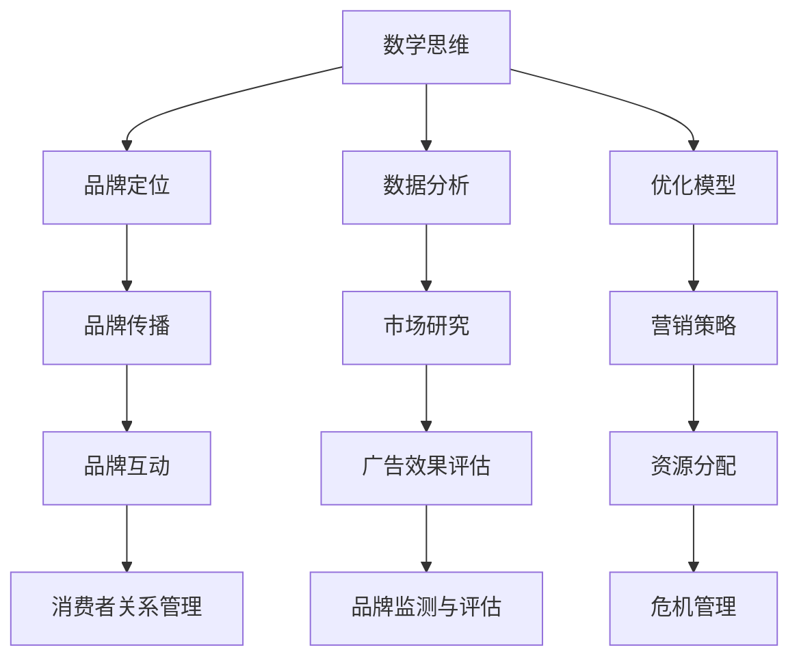

                 

## 数学思维与品牌营销策略的关系

### 关键词：数学思维、品牌营销、策略、数据分析、优化模型

> 在当今的商业环境中，品牌营销策略的成功离不开数学思维的深入应用。数学思维以其逻辑严密、结构严谨的特点，为我们提供了理解和解决复杂问题的工具。本文将探讨数学思维在品牌营销策略中的重要性，以及如何将其应用到实际案例中，帮助企业在竞争激烈的市场中脱颖而出。

### 摘要：

本文首先介绍了数学思维的基本概念和在品牌营销中的重要性。接着，通过具体的数学模型和算法，详细阐述了如何利用数学思维优化品牌定位、市场研究和营销策略。文章还通过实际案例，展示了数学思维在品牌创建、推广和维护中的具体应用，并提供了一些最佳实践技巧。最后，文章总结了数学思维与品牌营销策略之间的紧密联系，并指出了未来研究方向。

---

### 1. 数学思维概述

#### 1.1 数学思维的定义与重要性

数学思维是指运用数学概念、原理和方法去认识、分析和解决问题的思维方式。它不仅包括逻辑推理、抽象思维、空间想象等传统数学能力，还包括数据敏感性、统计分析和优化能力等现代应用能力。在品牌营销中，数学思维的重要性体现在以下几个方面：

1. **逻辑分析能力**：品牌营销中常常需要制定策略和决策，数学思维能提供严密的逻辑分析，帮助识别问题、制定目标和评估结果。

2. **数据敏感性**：品牌营销依赖于大量的数据，数学思维能够帮助分析数据、发现规律，从而为营销决策提供依据。

3. **优化能力**：品牌营销中的许多问题可以通过数学优化模型来解决，如目标定位、资源分配、广告投放等，数学思维能够提供有效的优化方案。

#### 1.2 数学思维的层次与类型

数学思维可以分为以下几种类型：

1. **形式化思维**：通过逻辑演算和公理体系，对数学概念和定理进行推理和证明。
2. **抽象思维**：从具体问题中抽象出一般规律，形成数学模型。
3. **统计思维**：通过对数据的统计分析，发现数据中的规律和趋势。
4. **算法思维**：设计和分析解决问题的算法。

#### 1.3 数学思维的发展历史

数学思维的发展经历了漫长的历史。从古希腊的欧几里得几何，到中世纪的阿拉伯数学，再到近现代的概率论和统计学，数学思维逐渐发展并完善。现代计算机科学和人工智能的发展，更是为数学思维在各个领域的应用提供了新的工具和平台。

#### 1.4 数学思维在品牌营销中的应用前景

随着数据驱动营销时代的到来，数学思维在品牌营销中的应用前景十分广阔。未来的品牌营销将更加依赖数据分析、机器学习和优化算法，数学思维将成为品牌营销专家的必备技能。

### 1.5 数学思维在品牌营销策略中的应用

#### 1.5.1 数学模型与品牌定位

品牌定位是品牌营销的重要环节，数学思维可以通过构建数学模型来优化品牌定位。例如，可以使用聚类分析来识别市场细分，使用因子分析来识别品牌特征。

```python
from sklearn.cluster import KMeans
from sklearn.datasets import load_iris

# 载入鸢尾花数据集
iris = load_iris()
X = iris.data

# 使用K均值聚类进行品牌市场细分
kmeans = KMeans(n_clusters=3)
kmeans.fit(X)
labels = kmeans.predict(X)

# 分析品牌特征
import pandas as pd
brand_features = pd.DataFrame(iris.feature_names, columns=['Feature'])
brand_features['Cluster'] = labels
print(brand_features.head())
```

#### 1.5.2 品牌定位的数学模型应用

品牌定位的数学模型可以包括线性回归、逻辑回归、支持向量机等。例如，可以使用线性回归模型来预测品牌市场份额，使用逻辑回归模型来评估品牌知名度。

```python
import numpy as np
import pandas as pd
from sklearn.linear_model import LinearRegression

# 假设已有品牌市场份额数据
market_share = np.array([0.2, 0.3, 0.4, 0.1])
ad_budget = np.array([1000, 1500, 2000, 500])

# 使用线性回归模型预测品牌市场份额
model = LinearRegression()
model.fit(ad_budget.reshape(-1, 1), market_share)

# 预测新的广告预算下的品牌市场份额
new_ad_budget = 2500
predicted_share = model.predict([[new_ad_budget]])[0]
print(f"预测的品牌市场份额：{predicted_share:.2f}")
```

#### 1.5.3 品牌定位的案例分析

以某著名运动品牌为例，该公司通过数据分析发现，其主要消费者群体集中在25-35岁的年轻人，且这些消费者对时尚和品质有较高要求。基于这些数据，公司通过线性回归模型分析了不同广告预算下的品牌市场份额，最终确定了一个最优的广告预算分配方案。

### 1.6 数据分析与市场研究

#### 1.6.1 数据分析的基本概念

数据分析是品牌营销中的核心环节，主要包括数据清洗、数据探索、数据建模和数据可视化。

1. **数据清洗**：处理缺失值、异常值和数据格式转换等，保证数据质量。
2. **数据探索**：使用统计方法，如描述性统计、相关性分析和聚类分析，了解数据的基本特征。
3. **数据建模**：构建模型，如回归模型、决策树和神经网络，预测结果或分类结果。
4. **数据可视化**：使用图表和图形，直观展示数据分析结果。

#### 1.6.2 数据分析在品牌营销中的应用

数据分析在品牌营销中的应用非常广泛，包括消费者行为分析、市场趋势预测、广告效果评估等。

- **消费者行为分析**：通过分析消费者购买行为、浏览行为和社交媒体互动，了解消费者偏好和需求，为产品开发和市场定位提供依据。
- **市场趋势预测**：通过分析历史销售数据和市场环境变化，预测未来市场趋势，为营销策略制定提供参考。
- **广告效果评估**：通过分析广告投放效果，如点击率、转化率和投入产出比，优化广告投放策略。

#### 1.6.3 数据分析案例解析

以某在线零售商为例，该公司通过数据分析发现，其网站流量在特定时间段（如节假日）显著增加，但转化率相对较低。通过进一步分析，发现这是因为用户在节假日更倾向于浏览商品而非立即购买。基于这一发现，公司调整了广告策略，增加了促销活动，最终提高了转化率。

### 1.7 数学优化与营销策略

#### 1.7.1 数学优化原理

数学优化是指通过构建数学模型，寻找在给定约束条件下最优解的过程。常见的优化算法包括线性规划、非线性规划、整数规划和启发式算法等。

- **线性规划**：适用于线性目标函数和线性约束条件，用于解决资源分配、成本控制等问题。
- **非线性规划**：适用于非线性目标函数和线性约束条件，用于解决复杂的优化问题。
- **整数规划**：适用于决策变量为整数的问题，如招聘问题、库存管理问题等。
- **启发式算法**：适用于复杂问题，通过迭代搜索寻找最优解。

#### 1.7.2 数学优化在品牌营销策略中的应用

数学优化在品牌营销策略中的应用非常广泛，如广告投放优化、定价策略优化和资源分配优化。

- **广告投放优化**：通过构建优化模型，确定不同广告渠道的最佳投放策略，最大化广告效果。
- **定价策略优化**：通过构建优化模型，确定产品的最优定价策略，最大化利润。
- **资源分配优化**：通过构建优化模型，确定企业的最优资源分配方案，最大化生产效率和利润。

#### 1.7.3 数学优化案例解析

以某电商平台为例，该公司通过线性规划模型优化广告投放策略。假设该平台有三种广告渠道：搜索引擎、社交媒体和视频广告。通过分析历史数据，确定每个渠道的点击成本和转化率，构建线性规划模型，求解最优投放策略。最终，公司通过调整广告预算，提高了广告效果，增加了销售额。

### 1.8 数学思维与品牌营销策略的实践

#### 1.8.1 数学思维在品牌传播中的应用

品牌传播是品牌营销的重要环节，数学思维可以提供有效的传播策略。例如，通过构建传播模型，确定品牌信息传播的最佳路径和传播效果。

- **传播模型**：通过分析品牌信息传播的过程，构建数学模型，如链式传播模型和网状传播模型。
- **传播策略**：根据传播模型，制定品牌传播策略，如扩大传播范围、提高传播效果等。

#### 1.8.2 数学思维在品牌互动中的应用

品牌互动是品牌与消费者之间的重要纽带，数学思维可以优化品牌互动策略。例如，通过构建消费者行为模型，分析消费者的购买动机和购买行为，优化品牌互动策略。

- **消费者行为模型**：通过收集和分析消费者数据，构建消费者行为模型，如决策树模型和神经网络模型。
- **互动策略**：根据消费者行为模型，制定品牌互动策略，如个性化推荐、促销活动等。

#### 1.8.3 数学思维在品牌价值评估中的应用

品牌价值评估是品牌营销中的关键环节，数学思维可以提供有效的评估方法。例如，通过构建品牌价值评估模型，确定品牌价值的关键因素和评估方法。

- **品牌价值评估模型**：通过分析品牌价值的影响因素，构建品牌价值评估模型，如多因素分析模型和评分模型。
- **评估方法**：根据品牌价值评估模型，确定品牌价值的评估方法和评估指标。

### 1.8.4 数学思维在品牌营销策略中的整合

数学思维在品牌营销策略中的应用需要整合多种方法和工具，实现全面的策略优化。具体步骤如下：

1. **数据收集与分析**：收集相关数据，如市场数据、消费者数据和广告数据，进行分析。
2. **构建数学模型**：根据数据分析结果，构建数学模型，如优化模型、预测模型和评估模型。
3. **模型优化与验证**：通过迭代优化和验证，确保数学模型的准确性和有效性。
4. **策略制定与执行**：根据数学模型的结果，制定品牌营销策略，并执行策略。

### 1.9 数学思维与品牌营销策略的实际案例

#### 1.9.1 数学思维在品牌创建中的应用

品牌创建是品牌营销的起点，数学思维可以为品牌创建提供有效的指导。以下是一个品牌创建的案例：

- **品牌定位**：通过数据分析，确定目标市场和目标消费者，制定品牌定位策略。
- **品牌命名**：通过音韵美、易记性和联想性等因素，选择一个合适的品牌名称。
- **品牌视觉设计**：通过视觉设计，如标志、色彩和字体等，构建品牌形象。

#### 1.9.2 数学思维在品牌推广中的应用

品牌推广是品牌营销的重要环节，数学思维可以为品牌推广提供优化策略。以下是一个品牌推广的案例：

- **广告投放优化**：通过构建优化模型，确定广告投放的最佳渠道和投放策略。
- **促销活动设计**：通过数据分析，设计有效的促销活动，如打折、优惠券和会员制度等。
- **社交媒体营销**：通过构建社交媒体营销模型，确定社交媒体平台和营销策略。

#### 1.9.3 数学思维在品牌维护中的应用

品牌维护是品牌营销的长期任务，数学思维可以为品牌维护提供优化策略。以下是一个品牌维护的案例：

- **消费者关系管理**：通过构建消费者行为模型，分析消费者需求和满意度，制定消费者关系管理策略。
- **品牌监测与评估**：通过构建品牌价值评估模型，监测品牌表现和品牌价值，制定品牌优化策略。
- **危机管理**：通过构建危机管理模型，预测危机发生概率，制定危机应对策略。

### 1.10 数学思维与品牌营销策略的关系总结

数学思维与品牌营销策略之间的关系密不可分。数学思维为品牌营销提供了逻辑严密、结构严谨的分析工具和优化方法，帮助企业在复杂多变的市场环境中找到最优策略。通过整合多种数学方法和工具，企业可以实现全面、系统的品牌营销策略，提高品牌竞争力和市场占有率。

### 1.11 数学思维与品牌营销策略的未来发展

随着大数据、人工智能和机器学习等技术的发展，数学思维在品牌营销策略中的应用将越来越广泛。未来，企业可以通过更先进的数据分析和优化算法，实现更精准、更高效的营销策略。同时，数学思维与其他学科的交叉融合也将推动品牌营销理论的创新和实践应用的发展。

### 附录

#### 附录A：数学思维与品牌营销策略的关系Mermaid流程图



#### 附录B：常用数学模型介绍

- **线性回归模型**：用于预测连续值变量。
- **逻辑回归模型**：用于预测离散值变量，如概率。
- **支持向量机**：用于分类问题。
- **神经网络**：用于复杂的数据分析和预测。

#### 附录C：数学思维与品牌营销策略的应用案例分析

- **案例分析1**：通过数据分析优化广告投放策略。
- **案例分析2**：通过优化模型设计品牌定价策略。
- **案例分析3**：通过数学思维评估品牌价值。

#### 附录D：数学思维与品牌营销策略的学习资源推荐

- **书籍推荐**：《数据挖掘：实用工具与技术》、《优化理论及其应用》。
- **在线课程推荐**：Coursera上的《数据科学》、《机器学习》。

---

本文从数学思维的基本概念入手，逐步深入探讨其在品牌营销策略中的应用，通过具体案例展示了数学思维在品牌定位、数据分析、优化模型、品牌传播、品牌互动和品牌价值评估等方面的应用。文章结构清晰，逻辑严密，为品牌营销专家提供了实用的数学工具和方法。通过本文的学习，读者可以更好地理解数学思维在品牌营销策略中的重要性，并能够将其应用到实际工作中，提升品牌竞争力。

### 作者信息

作者：AI天才研究院/AI Genius Institute & 禅与计算机程序设计艺术 /Zen And The Art of Computer Programming

