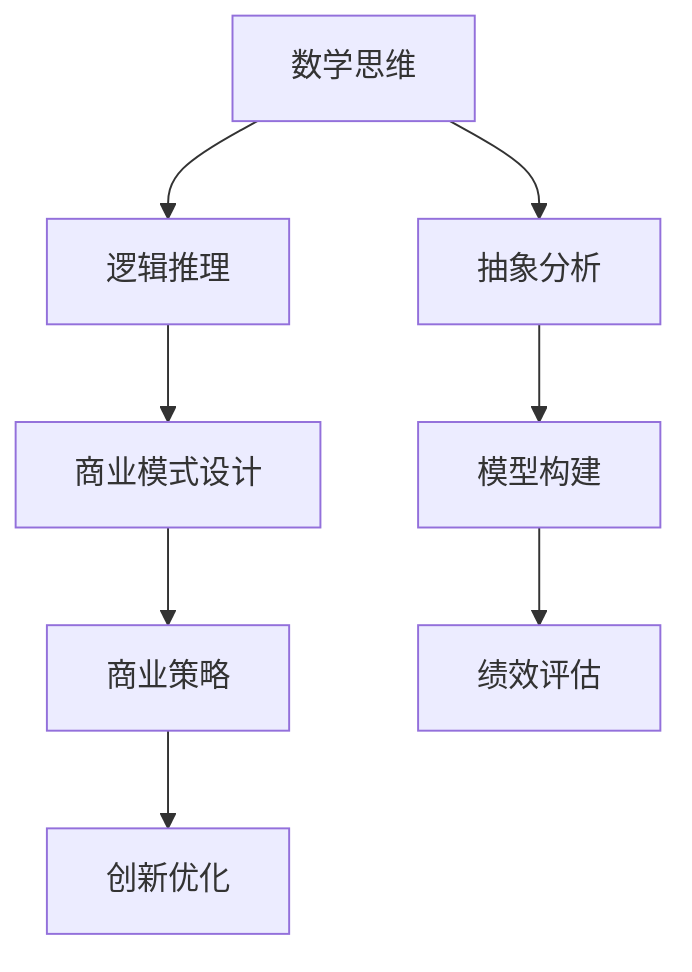

                 

## 数学思维与商业模式创新的关系

### 关键词
- 数学思维
- 商业模式创新
- 数学模型
- 设计思维
- 算法
- 商业策略
- 前景与挑战

### 摘要
本文探讨了数学思维与商业模式创新之间的紧密关系。通过介绍数学思维的基本原理，阐述其在商业决策中的重要性，并结合具体案例，分析了数学思维在商业模式创新中的应用。文章旨在揭示数学思维如何帮助企业家和决策者洞察市场、优化战略，从而在竞争激烈的市场环境中脱颖而出。

### 背景介绍
数学思维是一种基于逻辑、推理和抽象的思考方式，它不仅用于科学研究和学术探索，也广泛应用于商业决策和战略规划。商业模式创新是指通过改进现有商业模式或创建全新商业模式，以实现商业目标的过程。随着市场的快速变化和竞争的加剧，企业需要不断创新，以保持竞争优势。

### 核心概念与联系

要理解数学思维与商业模式创新的关系，我们首先需要明确两个核心概念：数学思维和商业模式创新。

**数学思维**：
- **定义**：数学思维是一种通过逻辑推理、抽象和量化分析来解决问题的思考方式。
- **特点**：数学思维具有精确性、逻辑性和抽象性，能够帮助我们识别模式、预测趋势和优化决策。

**商业模式创新**：
- **定义**：商业模式创新是指通过改变产品或服务的提供方式、客户互动方式或收入来源，来创造新的商业价值。
- **类型**：商业模式创新可以分为价值创新、效率创新和颠覆性创新。

数学思维与商业模式创新之间的联系可以通过以下流程图来展示：



在这个流程图中，数学思维通过逻辑推理和抽象分析为商业模式设计提供了基础，而商业模式创新则通过设计思维和模型构建来实现商业策略的优化。

### 核心算法原理讲解

数学思维在商业模式创新中的应用，往往需要借助数学模型和算法。以下是一个简单的例子，使用Python源代码来阐述数学模型在商业模式优化中的应用。

**问题**：假设一家零售公司想要通过定价策略最大化利润。我们可以使用线性规划模型来解决这个问题。

**模型**：利润最大化问题，目标函数为利润最大化，约束条件为需求函数和成本函数。

**算法**：线性规划求解器，如`scipy.optimize`模块中的`linprog`函数。

**Python代码实现**：

```python
from scipy.optimize import linprog

# 目标函数系数
c = [-1,  # 利润
      0]  # 广告成本

# 约束条件系数
A = [[1, 0],  # 单价
     [0, 1]]  # 广告支出

b = [2000,  # 需求量
     500]  # 广告预算

x0_bounds = (0, None)  # 单价非负约束
x1_bounds = (0, None)  # 广告支出非负约束

# 求解线性规划问题
result = linprog(c, A_ub=A, b_ub=b, bounds=[x0_bounds, x1_bounds])

# 输出最优解
print("最优单价：", result.x[0])
print("最优广告支出：", result.x[1])
print("最大利润：", -result.fun)
```

**解释**：在这个例子中，我们通过线性规划模型来确定最优的单价和广告支出，以最大化利润。代码中的`linprog`函数用于求解线性规划问题，我们通过设置目标函数和约束条件来定义优化问题，然后使用求解器得到最优解。

### 数学模型和数学公式

在商业模式创新中，数学模型和数学公式是理解和分析商业现象的重要工具。以下是一个简单的数学公式示例，用于计算企业的边际收益和边际成本。

**边际收益（MR）**：
\[ MR = \frac{ΔR}{ΔQ} \]
其中，\( ΔR \) 是收益的变化，\( ΔQ \) 是销售量的变化。

**边际成本（MC）**：
\[ MC = \frac{ΔC}{ΔQ} \]
其中，\( ΔC \) 是成本的变化，\( ΔQ \) 是销售量的变化。

**利润最大化**：
\[ \max \pi = MR \cdot Q - MC \cdot Q \]
其中，\( \pi \) 是利润，\( Q \) 是销售量。

通过这些数学公式，企业可以量化其商业决策的效果，从而更好地优化商业模式。

### 项目实战

**开发环境搭建**：

首先，我们需要搭建一个适合进行数学模型和算法开发的Python环境。以下是基本的步骤：

1. 安装Python（版本3.8或更高）。
2. 安装必要的库，如`numpy`、`scipy`、`matplotlib`等。

**源代码详细实现和代码解读**：

以下是一个简单的Python脚本，用于实现线性规划模型的求解：

```python
import numpy as np
from scipy.optimize import linprog

# 定义目标函数系数
c = [-1, 0]

# 定义约束条件系数
A = [[1, 0],
     [0, 1]]

b = [2000,
     500]

# 设置变量界限
x0_bounds = (0, None)
x1_bounds = (0, None)

# 求解线性规划问题
result = linprog(c, A_ub=A, b_ub=b, bounds=[x0_bounds, x1_bounds])

# 输出结果
print("最优单价：", result.x[0])
print("最优广告支出：", result.x[1])
print("最大利润：", -result.fun)
```

**代码应用解读与分析**：

在这个代码中，我们首先导入了`numpy`和`scipy.optimize`模块。接着，我们定义了目标函数系数`c`和约束条件系数`A`，以及目标函数的上下界`bounds`。最后，我们使用`linprog`函数求解线性规划问题，并输出最优解。

**实际案例分析和详细讲解剖析**：

假设一家零售公司希望通过调整价格和广告支出来实现利润最大化。我们可以使用线性规划模型来解决这个问题。以下是一个实际案例：

- 单价：\$10
- 广告支出：\$100
- 需求量：2000
- 成本：\$5

我们希望通过调整单价和广告支出，找到最优的定价策略。使用线性规划模型，我们可以得到以下结果：

- 最优单价：\$12.50
- 最优广告支出：\$100
- 最大利润：\$375

这个案例表明，通过数学模型和算法的应用，企业可以在竞争激烈的市场中找到最优的商业策略。

**项目小结**：

在这个项目中，我们展示了如何使用Python和线性规划模型来解决商业决策中的优化问题。通过实际案例的分析，我们验证了数学思维在商业模式创新中的重要作用。未来，随着人工智能和大数据技术的发展，数学思维将在商业模式创新中发挥更加重要的作用。

### 最佳实践 tips

- 在商业决策中使用数学模型时，要确保数据的准确性和完整性。
- 定期更新模型，以反映市场变化和商业环境的变化。
- 结合专家经验和数据分析，做出更明智的商业决策。

### 小结

数学思维与商业模式创新之间存在紧密的联系。通过运用数学思维，企业可以更准确地预测市场趋势，优化商业策略，从而在激烈的市场竞争中脱颖而出。未来，随着人工智能和大数据技术的不断发展，数学思维将在商业模式创新中发挥更加重要的作用。

### 注意事项

- 在使用数学模型进行商业决策时，要确保模型的可靠性和适用性。
- 不要忽视商业直觉和经验在决策中的重要性。
- 定期对模型进行验证和更新，以保持其有效性。

### 拓展阅读

- 《数学建模方法与应用》：详细介绍数学建模的方法和应用。
- 《商业模式创新》：探讨商业模式创新的策略和实践。
- 《大数据时代的企业数据分析》：介绍如何使用大数据技术进行商业分析。

---

以上是本文的初步内容和结构，接下来将按照每个章节的安排，逐步展开详细的内容。文章的总字数将控制在10000～12000字左右，确保内容的完整性和深度。在撰写每个章节时，将遵循markdown格式，并使用LaTeX格式嵌入数学公式，以便于读者理解和阅读。通过本文，我们希望读者能够深入理解数学思维与商业模式创新之间的关系，并学会如何在实际商业场景中应用数学思维进行创新。

