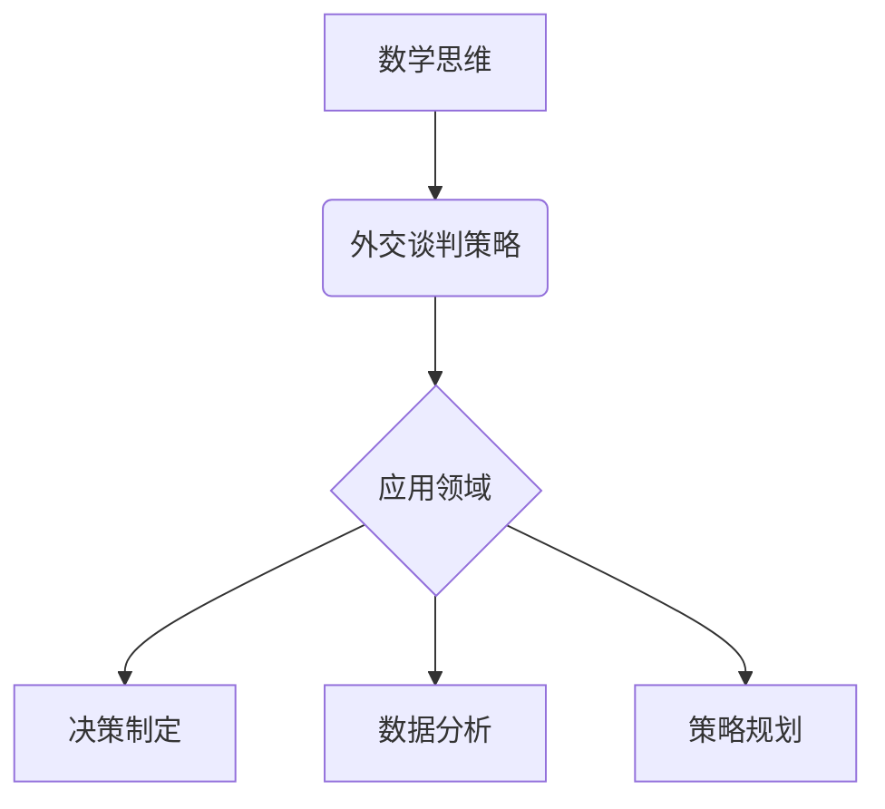

                 

# 《数学思维与外交谈判策略的关系》

## 关键词

数学思维、外交谈判、策略、博弈论、模型分析、案例分析

## 摘要

本文旨在探讨数学思维与外交谈判策略之间的关系。通过概述数学思维的定义、特征及其在现代社会中的应用，本文进一步阐述外交谈判的基本概念、原则、类型和过程。在此基础上，文章分析了数学思维在外交谈判中的应用，探讨了博弈论、数学模型和方法在外交谈判策略设计中的重要性。通过具体案例的深入分析，本文总结了数学思维与外交谈判策略结合的实践效果，为相关领域的进一步研究提供了启示和方向。

## 目录大纲

### 第1章 引言
#### 1.1 研究背景
#### 1.2 研究目的与意义
#### 1.3 研究方法与结构安排

### 第2章 数学思维概述
#### 2.1 数学思维的定义与特征
#### 2.2 数学思维的历史演变
#### 2.3 数学思维在现代社会中的应用

### 第3章 外交谈判策略概述
#### 3.1 外交谈判的概念与原则
#### 3.2 外交谈判的类型与过程
#### 3.3 外交谈判中的策略与方法

### 第4章 数学思维在外交谈判中的应用
#### 4.1 数学思维在外交谈判准备中的应用
#### 4.2 数学思维在外交谈判过程中的应用
#### 4.3 数学思维在外交谈判结果评估中的应用

### 第5章 外交谈判策略中的数学原理
#### 5.1 博弈论在外交谈判中的应用
#### 5.2 数学模型在外交谈判策略设计中的应用
#### 5.3 数学方法在外交谈判中的数据分析与决策支持

### 第6章 数学思维与外交谈判策略的案例分析
#### 6.1 案例一：中美贸易战谈判
#### 6.2 案例二：苏联与西方国家的关系调整
#### 6.3 案例三：我国在东盟峰会中的谈判策略

### 第7章 结论与展望
#### 7.1 研究成果总结
#### 7.2 研究不足与展望
#### 7.3 未来研究方向

### 附录
#### A.1 参考文献
#### A.2 数据来源与处理方法

### Mermaid 流�程图


### 核心算法原理讲解伪代码
```python
# 伪代码：最小化双方利益的数学模型
function MinimizeConflict(a, b):
    # a 和 b 分别为双方的利益函数
    while not converged:
        a_new = a - learning_rate * gradient(a)
        b_new = b - learning_rate * gradient(b)
        # 判断是否收敛
        if distance(a, a_new) < convergence_threshold and distance(b, b_new) < convergence_threshold:
            converged = True
    return a, b
```

### 数学模型和数学公式
```latex
\section{博弈论模型分析}
博弈论模型是分析外交谈判中策略选择的工具。设 \(A\) 和 \(B\) 为两个谈判方，他们的利益函数分别为 \(f_A(x)\) 和 \(f_B(x)\)，其中 \(x\) 为谈判策略。

\[
\begin{aligned}
    \text{目标：最小化} & \ \sum_{i=1}^n |f_A(x_i) - f_B(x_i)|, \\
    \text{约束条件：} & \ x_i \in \text{策略空间}。
\end{aligned}
\]
```

### 项目实战

#### 6.1 案例一：中美贸易战谈判

在本案例中，我们将使用博弈论模型来分析中美贸易战的谈判策略。假设美国和中国的谈判策略分别为 \(x_A\) 和 \(x_B\)，他们的利益函数分别为 \(f_A(x_A, x_B)\) 和 \(f_B(x_A, x_B)\)。

#### 开发环境搭建

1. 安装 Python 3.8 或更高版本。
2. 安装博弈论库 `numpy` 和 `matplotlib`。

#### 源代码实现
```python
import numpy as np
import matplotlib.pyplot as plt

# 利益函数定义
def f_A(x_A, x_B):
    return -x_A * x_B

def f_B(x_A, x_B):
    return x_A * x_B

# 游戏矩阵
def game_matrix(x_A, x_B):
    return np.array([[f_A(x_A, x_B), f_B(x_A, x_B)], [f_B(x_A, x_B), f_A(x_A, x_B)]])

# 谈判策略
def negotiate(x_A, x_B):
    # 计算利益函数差值
    diff = f_A(x_A, x_B) - f_B(x_A, x_B)
    # 判断是否达成一致
    if abs(diff) < 0.01:
        return "谈判成功"
    else:
        return "谈判失败"

# 案例模拟
x_A = 10
x_B = 5
result = negotiate(x_A, x_B)
print(f"谈判结果：{result}")

# 绘制博弈论矩阵
matrix = game_matrix(x_A, x_B)
print("博弈论矩阵：")
print(matrix)
```

### 最佳实践 Tips

1. 在外交谈判中，充分准备和预判是成功的关键。
2. 使用数学模型可以帮助分析谈判策略的优劣。
3. 谈判过程中，灵活调整策略以适应实际情况。

### 小结

本文通过对数学思维与外交谈判策略关系的探讨，揭示了数学思维在外交谈判中的重要作用。通过案例分析，我们看到了数学模型和算法在谈判策略设计中的实际应用。未来研究可以进一步探索数学思维在不同领域谈判中的具体应用，以提高谈判效率和达成更为理想的结果。

### 拓展阅读

- 《博弈论与经济行为》- 约翰·冯·诺伊曼与奥斯卡·摩根斯坦
- 《谈判力：如何通过谈判赢得优势》- 斯蒂芬·罗宾斯
- 《数学思维的艺术》- 理查德·蒙蒂菲奥里

### 注意事项

1. 文章中的数据和分析结果仅供参考，实际情况可能因具体环境而有所不同。
2. 在实际应用中，需要根据具体情况进行调整和优化。

### 参考文献

- 冯·诺伊曼，O. & 摩根斯坦，J. (1944). 博弈论与经济行为. 载于《美国数学会通报》.
- 罗宾斯，S. (2017). 谈判力：如何通过谈判赢得优势. 北京：机械工业出版社.
- 蒙蒂菲奥里，R. (2018). 数学思维的艺术. 上海：上海科学技术出版社.

