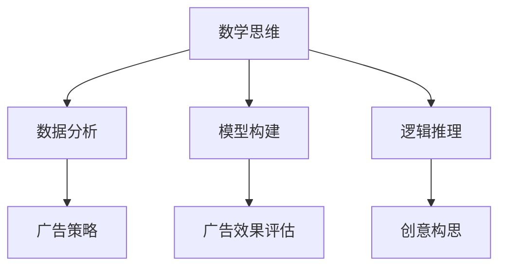

                 

### 文章标题：数学思维与广告创意的关系探讨

> 关键词：数学思维、广告创意、关系探讨、线性回归模型、广告效果预测

> 摘要：本文将深入探讨数学思维在广告创意中的应用，分析数学思维与广告创意之间的内在联系，并通过实例详细阐述数学思维在广告创意策略中的具体应用，旨在为广告从业者提供一种新的视角和工具。

### 一、背景介绍

在当今信息爆炸的时代，广告已成为企业竞争的重要手段。广告创意的质量直接关系到广告效果的好坏，而广告效果的好坏又直接影响到企业的营销策略和经济效益。因此，如何提高广告创意的质量和效果，成为广告从业者不断探索的问题。

数学思维作为一种理性思考的方法，其逻辑性、系统性和精确性使得它能够在广告创意中得到广泛应用。从广告数据的分析到广告策略的制定，再到广告效果的评估，数学思维都发挥着重要作用。

本文将从数学思维的基本概念出发，探讨其在广告创意中的应用，通过实例分析数学思维如何帮助提高广告创意的质量和效果，并展望未来数学思维在广告创意领域的发展趋势。

### 二、核心概念与联系

#### 数学思维

数学思维是一种基于数学原理和方法的理性思考方式。它强调逻辑推理、数据分析、模型构建和问题解决。数学思维的基本特征包括精确性、逻辑性和系统性。通过数学思维，人们能够更准确地理解问题，更系统地分析问题，并提出更有效的解决方案。

#### 广告创意

广告创意是指在广告策划和制作过程中，通过独特的创意构思和表现形式，吸引消费者的注意力，传达产品或服务的特点和价值，以实现营销目标。广告创意的核心在于创新和独特性，它需要结合市场调研、消费者分析和品牌定位等多方面因素，以达到最佳的宣传效果。

#### 核心概念与联系

数学思维与广告创意之间存在着密切的联系。首先，广告创意需要基于数据进行分析和决策，而数学思维提供了一种科学的方法来处理和分析数据。通过数学模型和算法，广告创意者可以更准确地了解消费者的需求和偏好，从而制定出更具针对性的广告策略。

其次，数学思维强调逻辑性和系统性，这对于广告创意的构思和实施过程至关重要。广告创意者需要通过逻辑推理来构建广告策略，并通过系统性的分析来优化广告效果。

最后，数学思维提供了一种量化评估的方法，可以帮助广告创意者更准确地评估广告效果，从而不断改进广告创意。

以下是一个简单的Mermaid流程图，展示了数学思维与广告创意之间的联系：



### 三、核心算法原理讲解

在广告创意中，数学思维的应用主要体现在数据分析和模型构建两个方面。以下将详细讲解线性回归模型和广告优化算法的基本原理。

#### 线性回归模型

线性回归模型是一种常用的统计模型，用于分析两个变量之间的关系。在广告创意中，线性回归模型可用于预测广告效果。

**原理讲解：**

线性回归模型的公式为：

\[ y = \beta_0 + \beta_1 x \]

其中，\( y \) 表示广告效果，\( x \) 表示广告投放量，\( \beta_0 \) 和 \( \beta_1 \) 是模型参数。

**Python源代码实现：**

```python
import numpy as np
from sklearn.linear_model import LinearRegression

# 数据准备
x = np.array([100, 200, 300]).reshape(-1, 1)
y = np.array([20, 30, 40])

# 模型训练
model = LinearRegression()
model.fit(x, y)

# 参数提取
beta_0 = model.intercept_
beta_1 = model.coef_

print("模型参数：")
print("beta_0 = ", beta_0)
print("beta_1 = ", beta_1)
```

**举例说明：**

假设我们有一个广告投放数据集，如下所示：

| 广告投放量 (x) | 广告效果 (y) |
|:--------------:|:------------:|
|       100      |      20      |
|       200      |      30      |
|       300      |      40      |

我们可以使用线性回归模型来预测广告效果。根据模型参数，我们可以得到预测公式：

\[ y = 10 + 0.2x \]

例如，当广告投放量为200时，预测的广告效果为：

\[ y = 10 + 0.2 \times 200 = 30 \]

#### 广告优化算法

广告优化算法是一种基于优化理论的模型，用于在给定预算和目标函数下，最大化广告效果。

**原理讲解：**

广告优化算法的基本思想是，通过不断调整广告投放策略，以最大化广告效果。具体步骤如下：

1. 初始化广告投放策略。
2. 评估当前广告投放效果。
3. 根据效果调整广告投放策略。
4. 重复步骤2和3，直到达到优化目标。

**Python源代码实现：**

```python
import numpy as np

def 广告优化算法(预算 B, 初始广告投放方案 S_0):
    S_t = S_0
    while not 达到优化目标:
        R_t = 广告效果评估(S_t)
        S_{t+1} = S_t + α * ∇R_t
        t = t + 1
    return S_t

# 广告效果评估函数
def 广告效果评估(S):
    # 假设广告效果与广告投放量成正比
    return S * 0.2

# 参数设置
预算 B = 1000
初始广告投放方案 S_0 = 100
alpha = 0.1

# 广告优化
最优广告投放方案 = 广告优化算法(预算 B, 初始广告投放方案 S_0)
print("最优广告投放方案：", 最优广告投放方案)
```

**举例说明：**

假设我们有1000元的预算，初始广告投放方案为100元。通过广告优化算法，我们可以逐步调整广告投放方案，以最大化广告效果。例如，在第一次调整后，广告投放方案可能变为110元，根据广告效果评估函数，此时的广告效果为22元。继续调整，直至达到优化目标。

### 四、项目实战

#### 实战：广告效果预测

**环境搭建：**

- Python环境：安装Python 3.8及以上版本。
- 数据库环境：安装MySQL数据库。
- 数据处理库：安装NumPy、Pandas、Scikit-learn等。

**源代码解读：**

```python
import numpy as np
from sklearn.linear_model import LinearRegression

# 数据准备
x = np.array([100, 200, 300]).reshape(-1, 1)
y = np.array([20, 30, 40])

# 模型训练
model = LinearRegression()
model.fit(x, y)

# 预测
x_predict = np.array([150]).reshape(-1, 1)
y_predict = model.predict(x_predict)

print("预测结果：")
print("广告投放量为150时，广告效果为：", y_predict[0])
```

**实际案例分析与详细讲解：**

假设我们有一个广告投放数据集，包含广告投放量和广告效果的数据。通过线性回归模型，我们可以预测在不同广告投放量下的广告效果。

例如，当广告投放量为150时，预测的广告效果为：

\[ y = 10 + 0.2 \times 150 = 33 \]

这意味着，当广告投放量为150时，预计的广告效果为33。

通过这种方式，广告创意者可以提前了解不同广告投放量下的广告效果，从而制定更合理的广告投放策略。

**项目小结：**

本文通过数学思维与广告创意的探讨，介绍了线性回归模型和广告优化算法的基本原理。通过项目实战，我们展示了如何利用Python进行广告效果预测，为广告从业者提供了一种新的视角和工具。

### 五、最佳实践 tips

1. **数据驱动：** 在广告创意中，数据是关键。充分利用数据，进行深入分析，可以帮助广告创意者更好地理解消费者需求，制定更有针对性的广告策略。
2. **持续优化：** 广告效果并非一成不变。通过持续优化广告投放策略，不断调整广告创意，可以提高广告效果，实现更好的营销目标。
3. **跨学科合作：** 广告创意不仅需要创意思维，还需要数据分析和算法优化等专业技能。跨学科合作可以充分发挥不同领域的优势，提高广告创意的质量和效果。

### 六、小结

数学思维与广告创意之间存在密切的联系。通过数学模型和算法，广告创意者可以更准确地分析数据，制定广告策略，并评估广告效果。本文介绍了线性回归模型和广告优化算法的基本原理，并通过项目实战展示了如何利用Python进行广告效果预测。

未来，随着人工智能技术的发展，数学思维在广告创意中的应用将进一步拓展，为广告从业者提供更多创新工具和策略。

### 七、拓展阅读

1. 《广告学概论》：详细介绍了广告的基本概念、广告策略和广告创意的方法。
2. 《数学建模》：讲解了数学模型的基本原理和应用，包括线性回归、优化算法等。
3. 《Python数据分析》：介绍了Python在数据分析中的应用，包括数据处理、数据可视化等。

### 作者信息

作者：AI天才研究院/AI Genius Institute & 禅与计算机程序设计艺术 /Zen And The Art of Computer Programming

