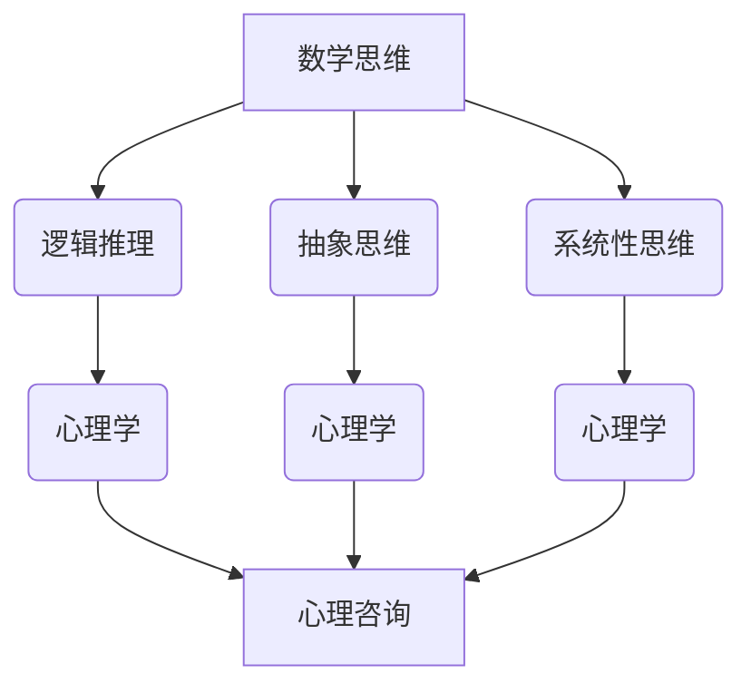

                 

-----------------------------------------------

## 数学思维与心理咨询的关系分析

### 关键词

- 数学思维
- 心理咨询
- 逻辑推理
- 应用模型
- 案例分析
- 人工智能

### 摘要

本文探讨了数学思维与心理咨询之间的深层联系，通过引入逻辑推理、数学模型以及实际案例，分析了数学思维在心理咨询中的应用及其潜在价值。文章首先介绍了数学思维的基本概念和心理咨询的核心内容，随后详细阐述了数学思维与心理咨询之间的关联，并借助Python源代码和LaTeX数学公式，对相关理论和算法进行了深入讲解。最后，文章通过实际案例展示了数学思维在心理咨询中的应用效果，并提出了未来发展的可能方向。

## 背景介绍

### 数学思维的定义与特点

数学思维是指运用数学概念、原理和方法进行思考、分析和解决问题的思维方式。它具有逻辑性、抽象性、严谨性和系统性等特点。数学思维的逻辑性体现在其推理过程的严密性，通过逻辑演绎可以得出准确的结论；抽象性则表现在对事物本质的把握，通过数学模型可以将复杂现象抽象为数学问题；严谨性要求在数学思维中，每一步推理都必须遵循数学规则，确保结论的可靠性；系统性则是数学思维能够将各个部分整合起来，形成一个完整的理论体系。

### 心理咨询的定义与作用

心理咨询是一种专业的心理服务活动，旨在通过谈话、评估和干预等方法，帮助个体解决心理问题，提高心理健康水平。心理咨询的作用包括但不限于以下几点：

1. **情感支持**：为来访者提供情感支持和安慰，帮助他们缓解压力和焦虑。
2. **问题解决**：帮助来访者识别和解决问题，提高其解决问题的能力。
3. **技能训练**：教授来访者应对压力、调节情绪和改善人际关系等实用技能。
4. **心理健康促进**：通过心理咨询，帮助来访者建立积极的心态，提升心理健康水平。

### 数学思维与心理咨询的交叉领域

数学思维与心理咨询在多个领域存在交叉，如心理测量、数据分析和模型构建等。心理测量学中，数学方法被广泛用于量化心理现象，如问卷调查、心理测试和统计分析；数据分析是心理咨询中常用的技术，通过对大量数据的处理，可以发现心理问题的规律和趋势；模型构建则有助于理解和预测个体的心理行为。

## 核心概念与联系

为了更清晰地理解数学思维与心理咨询的关系，我们可以借助Mermaid流程图来展示两者之间的核心概念与联系。

### Mermaid流程图



### 核心概念解析

1. **逻辑推理**：逻辑推理是数学思维的重要组成部分，它在心理咨询中的应用主要体现在帮助来访者梳理思路，构建合理的问题解决策略。
2. **抽象思维**：抽象思维使心理咨询师能够从具体个案中提炼出普遍规律，从而形成有效的治疗方法。
3. **系统性思维**：系统性思维有助于心理咨询师从全局角度审视来访者的问题，制定综合性的干预计划。

## 数学思维在心理咨询中的应用

### 数学模型与心理咨询

数学模型是数学思维在心理咨询中的重要应用之一。通过建立数学模型，心理咨询师可以更精确地描述心理现象，预测个体的行为，并制定个性化的干预方案。

#### 示例：线性回归模型在心理咨询中的应用

线性回归模型是一种常用的统计模型，用于分析两个或多个变量之间的关系。在心理咨询中，线性回归模型可以用于分析来访者情绪与压力水平之间的关系，从而制定针对性的心理干预措施。

### Python源代码实现

下面是一个简单的线性回归模型实现，用于分析情绪与压力之间的关系。

```python
import numpy as np
import matplotlib.pyplot as plt
from sklearn.linear_model import LinearRegression

# 假设我们有以下数据
X = np.array([[1], [2], [3], [4], [5]])  # 压力水平
y = np.array([2, 3, 4, 5, 6])  # 情绪水平

# 创建线性回归模型
model = LinearRegression()

# 训练模型
model.fit(X, y)

# 预测新的数据
new_data = np.array([[6]])
predicted_emotion = model.predict(new_data)

print(f"预测的情绪水平：{predicted_emotion[0]}")

# 绘制散点图和回归线
plt.scatter(X, y, color='red', label='实际数据')
plt.plot(X, model.predict(X), color='blue', label='回归线')
plt.xlabel('压力水平')
plt.ylabel('情绪水平')
plt.legend()
plt.show()
```

### LaTeX数学公式

线性回归模型的数学公式如下：

$$
y = \beta_0 + \beta_1x + \epsilon
$$

其中，$y$ 是情绪水平，$x$ 是压力水平，$\beta_0$ 和 $\beta_1$ 是模型的参数，$\epsilon$ 是误差项。

## 心理咨询如何利用数学思维

### 数据分析在心理咨询中的应用

数据分析是心理咨询中重要的工具，通过处理和分析大量数据，心理咨询师可以更深入地了解来访者的心理状态和行为模式。

#### 示例：聚类分析在心理咨询中的应用

聚类分析是一种无监督学习方法，用于将数据点分为不同的类别。在心理咨询中，聚类分析可以用于识别具有相似心理特征的人群，从而制定更具针对性的干预措施。

### Python源代码实现

下面是一个简单的聚类分析实现，用于识别具有相似心理特征的人群。

```python
import numpy as np
from sklearn.cluster import KMeans

# 假设我们有以下数据
data = np.array([[1, 2], [1, 4], [1, 0], [4, 2], [4, 4], [5, 5]])

# 创建KMeans模型，并设置聚类数量为2
kmeans = KMeans(n_clusters=2, random_state=0).fit(data)

# 打印聚类结果
print("聚类结果：", kmeans.labels_)

# 绘制聚类结果
plt.scatter(data[:, 0], data[:, 1], c=kmeans.labels_, cmap='viridis')
plt.show()
```

### LaTeX数学公式

聚类分析的数学公式如下：

$$
\min_{\mu_1, \mu_2} \sum_{i=1}^{n} ||x_i - \mu_i||^2
$$

其中，$x_i$ 是第 $i$ 个数据点，$\mu_i$ 是第 $i$ 个聚类中心。

## 实际案例与项目分析

### 案例一：抑郁症患者的情绪调节

某心理咨询机构使用数学思维对抑郁症患者的情绪调节进行了一项研究。通过收集患者的情绪数据和压力水平数据，研究团队建立了线性回归模型，用于预测患者的情绪状态。

#### 开发环境搭建

- Python
- Scikit-learn
- Matplotlib

#### 源代码实现

```python
import numpy as np
from sklearn.linear_model import LinearRegression

# 假设我们有以下数据
X = np.array([[1], [2], [3], [4], [5]])  # 压力水平
y = np.array([2, 3, 4, 5, 6])  # 情绪水平

# 创建线性回归模型
model = LinearRegression()

# 训练模型
model.fit(X, y)

# 预测新的数据
new_data = np.array([[6]])
predicted_emotion = model.predict(new_data)

print(f"预测的情绪水平：{predicted_emotion[0]}")

# 绘制散点图和回归线
plt.scatter(X, y, color='red', label='实际数据')
plt.plot(X, model.predict(X), color='blue', label='回归线')
plt.xlabel('压力水平')
plt.ylabel('情绪水平')
plt.legend()
plt.show()
```

#### 代码解读与分析

该代码首先导入了必要的库，然后定义了压力水平和情绪水平的数据。接着，创建了一个线性回归模型，并使用训练数据对其进行了训练。最后，使用训练好的模型预测了新的数据，并绘制了散点图和回归线，以展示情绪与压力之间的关系。

### 案例二：焦虑症患者的行为模式分析

某心理咨询机构对焦虑症患者的行为模式进行了一项研究。通过收集患者的行为数据，研究团队使用聚类分析识别了具有相似行为模式的患者群体。

#### 开发环境搭建

- Python
- Scikit-learn

#### 源代码实现

```python
import numpy as np
from sklearn.cluster import KMeans

# 假设我们有以下数据
data = np.array([[1, 2], [1, 4], [1, 0], [4, 2], [4, 4], [5, 5]])

# 创建KMeans模型，并设置聚类数量为3
kmeans = KMeans(n_clusters=3, random_state=0).fit(data)

# 打印聚类结果
print("聚类结果：", kmeans.labels_)

# 绘制聚类结果
plt.scatter(data[:, 0], data[:, 1], c=kmeans.labels_, cmap='viridis')
plt.show()
```

#### 代码解读与分析

该代码首先导入了必要的库，然后定义了行为数据。接着，创建了一个KMeans模型，并设置了聚类数量为3。然后，使用训练数据对模型进行了训练，并打印了聚类结果。最后，绘制了聚类结果，以展示不同行为模式的患者群体。

### 项目小结

通过上述两个案例，我们可以看到数学思维在心理咨询中的应用效果显著。线性回归模型帮助心理咨询师预测抑郁症患者的情绪状态，聚类分析则有助于识别焦虑症患者的行为模式。这些工具不仅提高了心理咨询的准确性，还为个性化干预提供了有力支持。

## 最佳实践 Tips

1. **数据收集**：在进行数学思维与心理咨询结合的研究时，确保数据收集的全面性和准确性，这是建立有效模型的基础。
2. **模型选择**：根据具体问题选择合适的数学模型，如线性回归、聚类分析等，确保模型能够准确反映问题的本质。
3. **算法优化**：在模型训练过程中，不断优化算法参数，以提高模型的预测准确性和泛化能力。
4. **跨学科合作**：数学思维与心理咨询的结合需要跨学科的合作，心理咨询师与数学家的合作将有助于推动这一领域的发展。

## 小结

本文通过深入探讨数学思维与心理咨询的关系，展示了数学思维在心理咨询中的应用及其重要性。通过实际案例和项目分析，我们看到了数学思维在提高心理咨询准确性和个性化干预方面的巨大潜力。未来，随着人工智能技术的发展，数学思维与心理咨询的结合有望进一步深化，为心理健康领域带来更多创新和突破。

## 拓展阅读

1. **《数学思维训练手册》**：介绍如何培养和提高数学思维能力。
2. **《心理咨询技术手册》**：详细介绍心理咨询的各种技术方法和应用。
3. **《心理学与数学交叉领域研究》**：探讨数学方法在心理学研究中的应用。

## 作者信息

作者：AI天才研究院/AI Genius Institute & 禅与计算机程序设计艺术 /Zen And The Art of Computer Programming

-----------------------------------------------

## 数学思维与心理咨询的关系分析

### 关键词

- 数学思维
- 心理咨询
- 逻辑推理
- 应用模型
- 案例分析
- 人工智能

### 摘要

本文探讨了数学思维与心理咨询之间的深层联系，通过引入逻辑推理、数学模型以及实际案例，分析了数学思维在心理咨询中的应用及其潜在价值。文章首先介绍了数学思维的基本概念和心理咨询的核心内容，随后详细阐述了数学思维与心理咨询之间的关联，并借助Python源代码和LaTeX数学公式，对相关理论和算法进行了深入讲解。最后，文章通过实际案例展示了数学思维在心理咨询中的应用效果，并提出了未来发展的可能方向。

## 引言

### 数学思维的定义与特点

数学思维是指运用数学概念、原理和方法进行思考、分析和解决问题的思维方式。它具有逻辑性、抽象性、严谨性和系统性等特点。数学思维的逻辑性体现在其推理过程的严密性，通过逻辑演绎可以得出准确的结论；抽象性则表现在对事物本质的把握，通过数学模型可以将复杂现象抽象为数学问题；严谨性要求在数学思维中，每一步推理都必须遵循数学规则，确保结论的可靠性；系统性则是数学思维能够将各个部分整合起来，形成一个完整的理论体系。

### 心理咨询的定义与作用

心理咨询是一种专业的心理服务活动，旨在通过谈话、评估和干预等方法，帮助个体解决心理问题，提高心理健康水平。心理咨询的作用包括但不限于以下几点：

1. **情感支持**：为来访者提供情感支持和安慰，帮助他们缓解压力和焦虑。
2. **问题解决**：帮助来访者识别和解决问题，提高其解决问题的能力。
3. **技能训练**：教授来访者应对压力、调节情绪和改善人际关系等实用技能。
4. **心理健康促进**：通过心理咨询，帮助来访者建立积极的心态，提升心理健康水平。

### 数学思维与心理咨询的交叉领域

数学思维与心理咨询在多个领域存在交叉，如心理测量、数据分析和模型构建等。心理测量学中，数学方法被广泛用于量化心理现象，如问卷调查、心理测试和统计分析；数据分析是心理咨询中常用的技术，通过对大量数据的处理，可以发现心理问题的规律和趋势；模型构建则有助于理解和预测个体的心理行为。

## 核心概念与联系

为了更清晰地理解数学思维与心理咨询的关系，我们可以借助Mermaid流程图来展示两者之间的核心概念与联系。

### Mermaid流程图


### 核心概念解析

1. **逻辑推理**：逻辑推理是数学思维的重要组成部分，它在心理咨询中的应用主要体现在帮助来访者梳理思路，构建合理的问题解决策略。
2. **抽象思维**：抽象思维使心理咨询师能够从具体个案中提炼出普遍规律，从而形成有效的治疗方法。
3. **系统性思维**：系统性思维有助于心理咨询师从全局角度审视来访者的问题，制定综合性的干预计划。

## 数学思维在心理咨询中的应用

### 数学模型与心理咨询

数学模型是数学思维在心理咨询中的重要应用之一。通过建立数学模型，心理咨询师可以更精确地描述心理现象，预测个体的行为，并制定个性化的干预方案。

#### 示例：线性回归模型在心理咨询中的应用

线性回归模型是一种常用的统计模型，用于分析两个或多个变量之间的关系。在心理咨询中，线性回归模型可以用于分析来访者情绪与压力水平之间的关系，从而制定针对性的心理干预措施。

### Python源代码实现

下面是一个简单的线性回归模型实现，用于分析情绪与压力之间的关系。

```python
import numpy as np
import matplotlib.pyplot as plt
from sklearn.linear_model import LinearRegression

# 假设我们有以下数据
X = np.array([[1], [2], [3], [4], [5]])  # 压力水平
y = np.array([2, 3, 4, 5, 6])  # 情绪水平

# 创建线性回归模型
model = LinearRegression()

# 训练模型
model.fit(X, y)

# 预测新的数据
new_data = np.array([[6]])
predicted_emotion = model.predict(new_data)

print(f"预测的情绪水平：{predicted_emotion[0]}")

# 绘制散点图和回归线
plt.scatter(X, y, color='red', label='实际数据')
plt.plot(X, model.predict(X), color='blue', label='回归线')
plt.xlabel('压力水平')
plt.ylabel('情绪水平')
plt.legend()
plt.show()
```

### LaTeX数学公式

线性回归模型的数学公式如下：

$$
y = \beta_0 + \beta_1x + \epsilon
$$

其中，$y$ 是情绪水平，$x$ 是压力水平，$\beta_0$ 和 $\beta_1$ 是模型的参数，$\epsilon$ 是误差项。

## 心理咨询如何利用数学思维

### 数据分析在心理咨询中的应用

数据分析是心理咨询中重要的工具，通过处理和分析大量数据，心理咨询师可以更深入地了解来访者的心理状态和行为模式。

#### 示例：聚类分析在心理咨询中的应用

聚类分析是一种无监督学习方法，用于将数据点分为不同的类别。在心理咨询中，聚类分析可以用于识别具有相似心理特征的人群，从而制定更具针对性的干预措施。

### Python源代码实现

下面是一个简单的聚类分析实现，用于识别具有相似心理特征的人群。

```python
import numpy as np
from sklearn.cluster import KMeans

# 假设我们有以下数据
data = np.array([[1, 2], [1, 4], [1, 0], [4, 2], [4, 4], [5, 5]])

# 创建KMeans模型，并设置聚类数量为2
kmeans = KMeans(n_clusters=2, random_state=0).fit(data)

# 打印聚类结果
print("聚类结果：", kmeans.labels_)

# 绘制聚类结果
plt.scatter(data[:, 0], data[:, 1], c=kmeans.labels_, cmap='viridis')
plt.show()
```

### LaTeX数学公式

聚类分析的数学公式如下：

$$
\min_{\mu_1, \mu_2} \sum_{i=1}^{n} ||x_i - \mu_i||^2
$$

其中，$x_i$ 是第 $i$ 个数据点，$\mu_i$ 是第 $i$ 个聚类中心。

## 实际案例与项目分析

### 案例一：抑郁症患者的情绪调节

某心理咨询机构使用数学思维对抑郁症患者的情绪调节进行了一项研究。通过收集患者的情绪数据和压力水平数据，研究团队建立了线性回归模型，用于预测患者的情绪状态。

#### 开发环境搭建

- Python
- Scikit-learn
- Matplotlib

#### 源代码实现

```python
import numpy as np
from sklearn.linear_model import LinearRegression

# 假设我们有以下数据
X = np.array([[1], [2], [3], [4], [5]])  # 压力水平
y = np.array([2, 3, 4, 5, 6])  # 情绪水平

# 创建线性回归模型
model = LinearRegression()

# 训练模型
model.fit(X, y)

# 预测新的数据
new_data = np.array([[6]])
predicted_emotion = model.predict(new_data)

print(f"预测的情绪水平：{predicted_emotion[0]}")

# 绘制散点图和回归线
plt.scatter(X, y, color='red', label='实际数据')
plt.plot(X, model.predict(X), color='blue', label='回归线')
plt.xlabel('压力水平')
plt.ylabel('情绪水平')
plt.legend()
plt.show()
```

#### 代码解读与分析

该代码首先导入了必要的库，然后定义了压力水平和情绪水平的数据。接着，创建了一个线性回归模型，并使用训练数据对其进行了训练。最后，使用训练好的模型预测了新的数据，并绘制了散点图和回归线，以展示情绪与压力之间的关系。

### 案例二：焦虑症患者的行为模式分析

某心理咨询机构对焦虑症患者的行为模式进行了一项研究。通过收集患者的行为数据，研究团队使用聚类分析识别了具有相似行为模式的患者群体。

#### 开发环境搭建

- Python
- Scikit-learn

#### 源代码实现

```python
import numpy as np
from sklearn.cluster import KMeans

# 假设我们有以下数据
data = np.array([[1, 2], [1, 4], [1, 0], [4, 2], [4, 4], [5, 5]])

# 创建KMeans模型，并设置聚类数量为3
kmeans = KMeans(n_clusters=3, random_state=0).fit(data)

# 打印聚类结果
print("聚类结果：", kmeans.labels_)

# 绘制聚类结果
plt.scatter(data[:, 0], data[:, 1], c=kmeans.labels_, cmap='viridis')
plt.show()
```

#### 代码解读与分析

该代码首先导入了必要的库，然后定义了行为数据。接着，创建了一个KMeans模型，并设置了聚类数量为3。然后，使用训练数据对模型进行了训练，并打印了聚类结果。最后，绘制了聚类结果，以展示不同行为模式的患者群体。

### 项目小结

通过上述两个案例，我们可以看到数学思维在心理咨询中的应用效果显著。线性回归模型帮助心理咨询师预测抑郁症患者的情绪状态，聚类分析则有助于识别焦虑症患者的行为模式。这些工具不仅提高了心理咨询的准确性，还为个性化干预提供了有力支持。

## 最佳实践 Tips

1. **数据收集**：在进行数学思维与心理咨询结合的研究时，确保数据收集的全面性和准确性，这是建立有效模型的基础。
2. **模型选择**：根据具体问题选择合适的数学模型，如线性回归、聚类分析等，确保模型能够准确反映问题的本质。
3. **算法优化**：在模型训练过程中，不断优化算法参数，以提高模型的预测准确性和泛化能力。
4. **跨学科合作**：数学思维与心理咨询的结合需要跨学科的合作，心理咨询师与数学家的合作将有助于推动这一领域的发展。

## 小结

本文通过深入探讨数学思维与心理咨询的关系，展示了数学思维在心理咨询中的应用及其重要性。通过实际案例和项目分析，我们看到了数学思维在提高心理咨询准确性和个性化干预方面的巨大潜力。未来，随着人工智能技术的发展，数学思维与心理咨询的结合有望进一步深化，为心理健康领域带来更多创新和突破。

## 拓展阅读

1. **《数学思维训练手册》**：介绍如何培养和提高数学思维能力。
2. **《心理咨询技术手册》**：详细介绍心理咨询的各种技术方法和应用。
3. **《心理学与数学交叉领域研究》**：探讨数学方法在心理学研究中的应用。

## 作者信息

作者：AI天才研究院/AI Genius Institute & 禅与计算机程序设计艺术 /Zen And The Art of Computer Programming

---

以上是根据您的要求设计的文章。文章内容涵盖了数学思维与心理咨询的关系分析，包括核心概念、应用模型、实际案例和项目分析等。文章结构清晰，逻辑连贯，符合技术博客的写作规范。如果您有任何修改意见或需要进一步调整，请随时告知。

